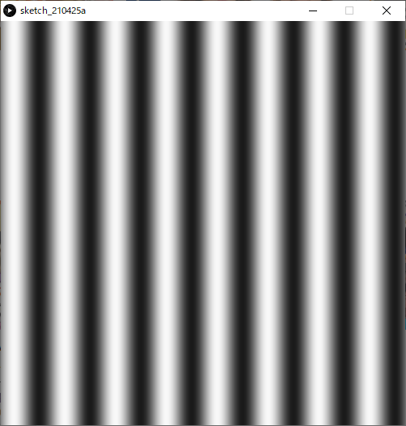
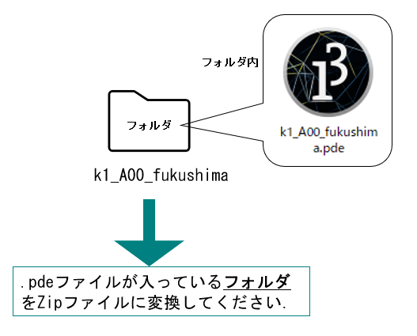
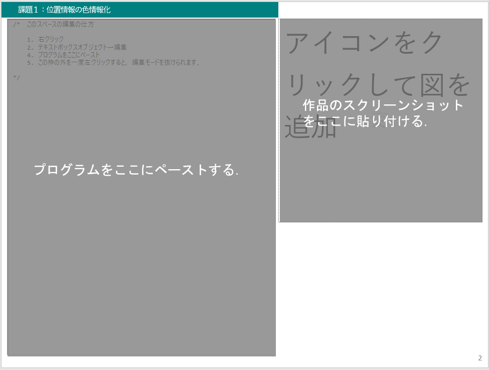
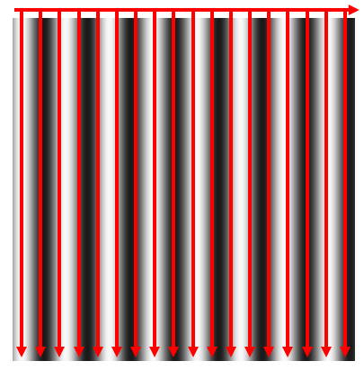
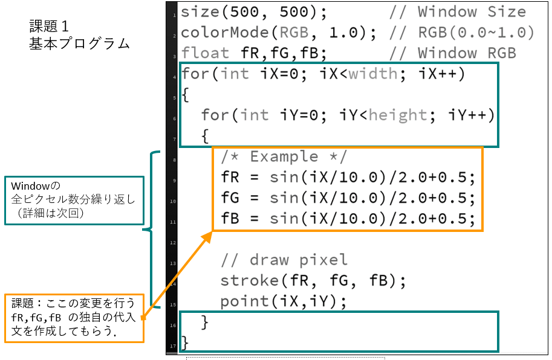
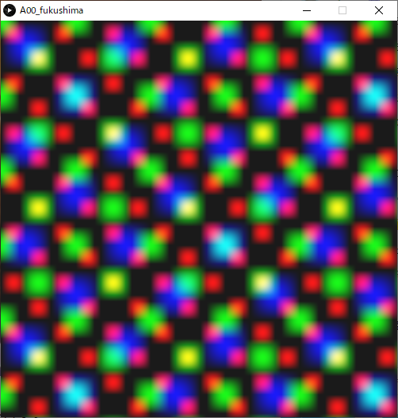
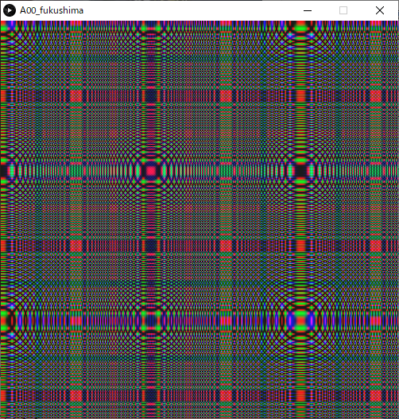
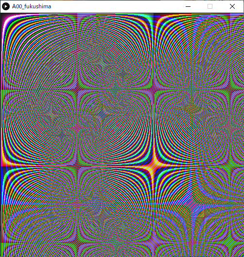
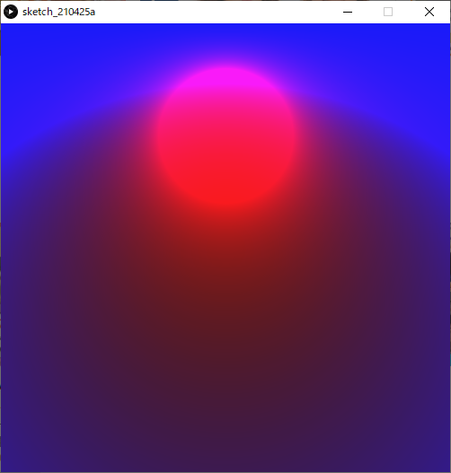
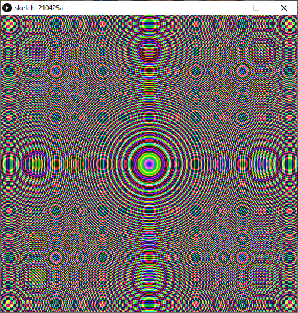

# 課題1

配布されているプログラムを書き換えることで，美的な画像を生成する． 位置情報を数値計算によって色情報に変換する処理の編集を行う．

## 目的

- 課題の提出方法に慣れる．
  - 提出フォームの使い方．
  - pptテンプレートファイルの編集．
  - スケッチブック（フォルダ）をzipファイルへ圧縮．
- 数値計算の記述に慣れる．
  - 学習した命令を組み合わせる．
  - トライアンドエラーの繰り返し．

## 提出までの流れ

提出期限：**5/9(月) 23:59**

1. Teams課題ページより以下のリソースをダウンロードする．

   - A00_fukushima.pptx
   - A00_fukushima.zip

2. A00_fukushima.zip を解凍ソフトで解凍する．

3. 解凍後，中の**フォルダ名とpdeファイルのファイル名の両方**を以下のように変更する．

   - **クラス+クラス番号_苗字** 例：A02_akama,   B16_shibata,  C22_saitou

4. **A00_fukushima.pptx のファイル名も上記のように変更しておく**．

5. Processingを使用して，pde 内のプログラム/* `Example` */以下3行部分に独自の変更を加え実行し，画像を表示する．

   `/* Example */`直後の三つの文における**右辺**の記述を様々に書き換え，いろいろな画像が出力されることを確認する．

   ```
   size(500, 500);      // Window Size
   colorMode(RGB, 1.0); // RGB(0.0~1.0)
   float fR,fG,fB;      // Window RGB
   for(int iX=0; iX<width; iX++)
   {
     for(int iY=0; iY<height; iY++)
     {
       /* Example */
       fR = sin(iX/10.0)/2.0+0.5;
       fG = sin(iX/10.0)/2.0+0.5;
       fB = sin(iX/10.0)/2.0+0.5;
       // draw pixel
       stroke(fR, fG, fB);
       point(iX,iY);
     }
   }
   ```



1. 画像が完成したら，Processing の実行ウィンドウ（画像が表示されているウィンドウ）のスクリーンショットを撮影． Windows標準のペイントソフトなどにペーストし，そのままpngファイルとして保存する．

   - 最前面のウィンドウのスクリーンショットの撮り方

     - Windows

       「[Alt] + [PrtSc(PrintScreen)]」

     - Mac

       「[shift]キー＋[command]キー＋[4]キー→[Space]キー」

2. スケッチブック(pdeが入ったフォルダ)をzip形式に圧縮する.

   - **クラス+クラス番号_苗字.zip** が出来上がるはず．



1. pptxファイルをパワーポイントで開き
   - 右に表示されているサンプル画像を自分の作品のスクリーンショット(png)に差し替える．
   - 左のテキストボックス内のプログラムを自分の作品のプログラムに差し替える．
   - 保存する．



1. ファイルの提出
   - Teams課題１のページで「+作業の追加」をクリックして，出来上がった以下の２つのファイルをアップロードしてください．
     - **クラス+クラス番号_苗字.pptx**
     - **クラス+クラス番号_苗字.zip**

## 条件

- プログラム中の指示した箇所以外に変更を加えないこと．
- 本課題ではコメントは特に必要ない．
- 第３回目の授業「演算と変数」までで学習していない文法や命令を用いることは極力控える．

## 評価

- 提出を正しく行えているか．
  - 提出期限を順守する．
  - 提出したファイルがそろっている．
  - ファイル名が指定した形式通り正しく付けられている．
- プログラムから試行錯誤を行った形跡を感じられるか．
  - 提出画像のクオリティに依らず加点．
- 作成された画像のクオリティ．（加点は少な目）
  - 審美性
  - プログラムならではの表現

## 注意事項

- リファレンスや課題ページのサンプルプログラムを少々加工した作品については評価を行わない．
  - 色や形を変えた程度であったり，明らかに似ていると判断されるものは評価が難しい．
- また，ネット上のサンプルや参考書籍のプログラムを応用する場合は，出典を何らかの形式で明記し，どのように応用しているのか説明すること．盗作が疑われる場合は厳しく対処する．

## 質問・質問について

- 質問する際，「どんな作品をつくりたいのか」「何がわからないのか」「自分でどこまで調べたか」を明確化しておくこと．
- プログラムに関する具体的な質問は，pdeファイルを添付するか，コードのテキストをコピー＆ペーストして文面に記載すること．

## 解説

このプログラムは，ウィンドウ内のすべてのピクセルに`point()`で色付きの点を描画するプログラムである．

1. 以下のような手順の繰り返しによりウィンドウ内の全ピクセルに点描画を行っている．
   1. 下の図のように原点から描画が始まる．
   2. 上から下へ縦方向へ点を描画．
   3. 横へ1ピクセルずれる．
   4. 手順2.へ戻る．



2. このような繰り返し処理はfor文で行っている．



3. ピクセルカラー`fR, fG, fB`に代入する式を考える．
   - ピクセルの座標値`iX`,` iY`を活用する．
   - 様々な式や数値を組み合わせる．（すべてを使用する必要はない）
     - 四則演算
     - 三角関数 `sin()`, `cos()`, `tan()`
     - ランダム値 `random()`


## 参考作品

### Sample01

```
size(500, 500);      // Window Size
colorMode(RGB, 1.0); // RGB(0.0~1.0)
float fR,fG,fB;      // Window RGB
for(int iX=0; iX<width; iX++)
{
  for(int iY=0; iY<height; iY++)
  {
    fR=sin(iX/10.0)*sin(iY/10.0);
    fG=cos(iX/15.0)*cos(iY/15.0);
    fB=sin(iX/20.0)*sin(iY/20.0);
    // draw pixel
    stroke(fR, fG, fB);
    point(iX,iY);
  }
}
```



### Sample02

```
size(500, 500);      // Window Size
colorMode(RGB, 1.0); // RGB(0.0~1.0)
float fR,fG,fB;      // Window RGB
for(int iX=0; iX<width; iX++)
{
  for(int iY=0; iY<height; iY++)
  {
    fR=cos(iX*iX/30.0)*cos(iY*iY/30.0);
    fG=sin(iY*iY/60.0)*cos(iX*iX/60.0);
    fB=sin(iX*iX/120.0)*cos(iY*iY/120.0);

    // draw pixel
    stroke(fR, fG, fB);
    point(iX,iY);
  }
}
```



### Sample03

```
size(500, 500);      // Window Size
colorMode(RGB, 1.0); // RGB(0.0~1.0)
float fR,fG,fB;      // Window RGB
for(int iX=0; iX<width; iX++)
{
  for(int iY=0; iY<height; iY++)
  {
    fR=tan(iX*iY/200.0);
    fG=(tan(iX*iY/100.0)*(-1.0));
    fB=tan(iX*iY/250.0);
    
    // draw pixel
    stroke(fR, fG, fB);
    point(iX,iY);
  }
}
```



### Sample04

```
size(500, 500);      // Window Size
colorMode(RGB, 1.0); // RGB(0.0~1.0)
float fR,fG,fB;      // Window RGB
for(int iX=0; iX<width; iX++)
{
  for(int iY=0; iY<height; iY++)
  {
    /* Example */
    fR=1/((pow(iX-250,2)/iY+pow(iY-100,2)/iY)/50.0);
    fG=0.0;
    fB=(pow(iX-250,2)+pow(iY-250,2))/(500*iY);

    // draw pixel
    stroke(fR, fG, fB);
    point(iX,iY);
  }
}
```



### Sample05

```
size(500, 500);      // Window Size
colorMode(RGB, 1.0); // RGB(0.0~1.0)
float fR,fG,fB;      // Window RGB
for(int iX=0; iX<width; iX++)
{
  for(int iY=0; iY<height; iY++)
  {
    fR=tan((pow(iX-250,2)+pow(iY-250,2))/50);
    fG=sin((pow(iX-250,2)+pow(iY-250,2))/150);
    fB=cos((pow(iX-250,2)+pow(iY-250,2))/100);

    // draw pixel
    stroke(fR, fG, fB);
    point(iX,iY);
  }
}
```



### 2021年度参考作品

課題1提出作品集2021.pptx

- Teams->「ファイル」タブ からダウンロード可能．
