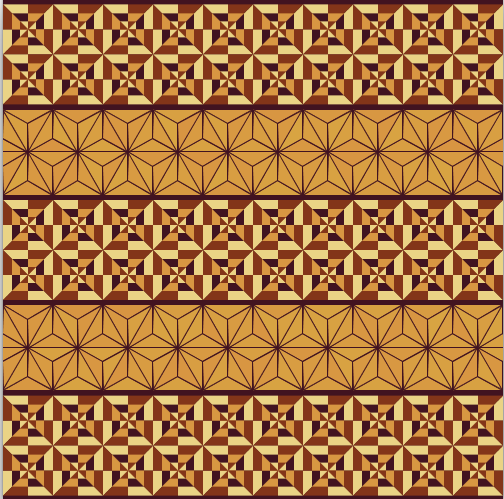
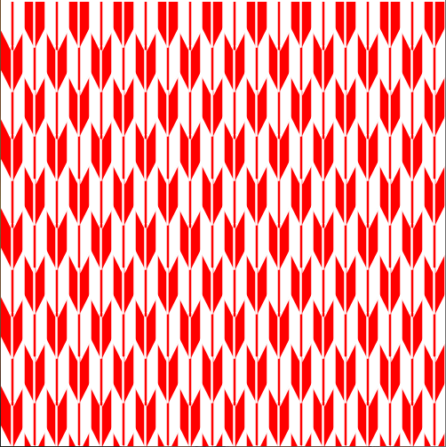
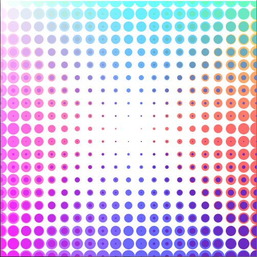
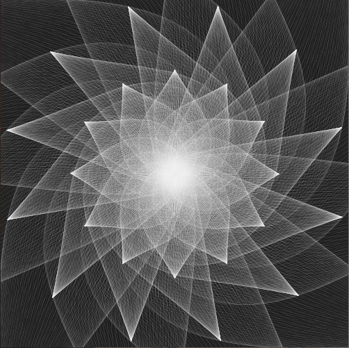

# 課題2 繰り返し文によるパターン作成

繰り返し（for文）を効果的に使用した美しいパターン画像をデザインしなさい．

## 目的

- 繰り返し文の記述方法に慣れること． 
- 効率的に美しい画像を生成する方法を体験すること．

## 条件

- 画面サイズは**500×500**ピクセルとする．

- 必ず**for文**を使用すること．

- 図形描画命令（point, line, rect, ellipse等）は全てfor文のブロック文 `{ }` の中に記述してあること．
  以下のように，for文にネストされているif文のブロック文内でもOK．

  ```java
  for(int iX=0; iX<500; iX++)
  {
  	if( iX%2 == 0 )
  	{
  		point( iX, 50 );
  	}
  }
  ```

- 画像は複雑であるほど評価が高いが，プログラムはできるだけ効率的に設計するよう心がけること．

- プログラム中にコメントを適切に入れること．
  - 日本語表示が上手くいかない場合は簡単な英単語やローマ字などでもよい．
  - 日本語コメントを入れたい場合，Processing バージョン**3.54以前**のものをダウンロードして使うとよい．
    - インストール不要．
    - 最新のバージョン4.0は現在日本語表示にバグがあり．
- 第４回目の授業「制御文」までで学習していない文法や命令を用いることは極力控える．
  - 静止画作品であるので，setup( )や，draw( )を使ったアニメーションの使用は不可．
- 提出用パワーポイントが自分のPC環境で編集できない場合，できるだけスタジオのWindowsPCを使って編集し，提出すること．
  - スタジオのWindowsPCなら確実に編集できるはず．
  - どうしてもスタジオのPCで編集が行えない場合のみ，事前に講師にメールで通知の上，通常のテキストボックスにコードをペーストして提出すること．

## 提出までの流れ

提出期限：**5/23(月) 23:59**

1. Teams課題ページより以下のリソースをダウンロードする．

   - k2_A00_fukushima.pptx

2. k2_A00_fukushima.pptx のファイル名を以下のように変更する．

   - **k2\_クラス+クラス番号\_苗字** 
   - 例：k2_A02_akama,   k2_B16_shibata,  k2_C22_saitou

3. Processingを使用して作品を制作する．

   - 早めにスケッチブック（フォルダ）とスケッチ(.pde)の名前をステップ2.のpptxファイルと同じ名前にしておく．

4. 画像が完成したら，Processing の実行ウィンドウ（画像が表示されているウィンドウ）のスクリーンショットを撮影． Windows標準のペイントソフトなどにペーストし，そのままpngファイルとして保存する．

   - 最前面のウィンドウのスクリーンショットの撮り方

     - Windows

       「[Alt] + [PrtSc(PrintScreen)]」

     - Mac
   
       「[shift]キー＋[command]キー＋[4]キー→[Space]キー」

5. スケッチブック(pdeが入ったフォルダ)をzip形式に圧縮する.

   - 圧縮の前に，スケッチブック（フォルダ）とスケッチ(.pde)の名前が「k2\_クラス+クラス番号\_苗字」になっているか確認．
   - **k2\_クラス+クラス番号\_苗字.zip** が出来上がるはず．

6. pptxファイルをパワーポイントで開き
   - 右に表示されているサンプル画像を自分の作品のスクリーンショット(png)に差し替える．
   - 左のテキストボックス内のプログラムを自分の作品のプログラムに差し替える．
   - 保存する．


7. ファイルの提出
   - Teams課題2のページで「+作業の追加」をクリックして，出来上がった以下の２つのファイルをアップロードしてください．
     - **k2\_クラス+クラス番号\_苗字.pptx**
     - **k2\_クラス+クラス番号\_苗字.zip**

## 評価

- 提出を正しく行えているか．
  - 提出期限を順守する．
  - 提出したファイルがそろっている．
  - ファイル名が指定した形式通り正しく付けられている．
- プログラムの読みやすさ．
  - 適切にコメントが付けられているか．
  - for文やif文のカッコ類が適切な位置に記述されているか．
  - インデント等が正しく行われているか．
- 作成された画像のクオリティ．
  - 審美性
  - プログラムならではの表現か．

## 注意事項

- 課題(HTML)ページのサンプルプログラムを加工した作品（色や形を変えた程度）については評価を行わない．また，ネット上のサンプルや参考書籍のプログラムを応用する場合は，出典を何らかの形式で明記し，どのように応用しているのか説明すること．盗作が疑われる場合は厳しく対処する．
- 本科目で教えていない技術を使用しないこと．独自の関数，配列，クラス，外部ライブラリ等の使用は不可とする．
  for文のみでできることを追求するのがこの課題の目的であるので，そこをはき違えて身勝手な作品をつくらないようにすること．

## 質問・質問について

- 質問する際，「どんな作品をつくりたいのか」「何がわからないのか」「自分でどこまで調べたか」を明確化しておくこと．
- プログラムに関する具体的な質問は，pdeファイルを添付するか，コードのテキストをコピー＆ペーストして文面に記載すること．

## 参考作品

### sample01

```
size(500,500);
background(50);
colorMode(RGB,100);
stroke(200);
 
float fx=0;
float fy=20;
 
for(int ix=0;ix<500;ix+=40)
{
  for(int iy=0;iy<500;iy+=40)
  {
  
  noFill();
 
  stroke(random(0,100),random(0,100),random(0,100));//枠線色
  triangle(fx+ix,fy+iy,fx+10+ix,fy-20+iy,fx+ix+20,fy+iy);//上向きの三角形
  triangle(fx+ix+5 ,fy+iy+10,fx+10+ix,fy+iy,fx+ix+15,fy+iy+10);//内側の三角形
  triangle(fx+iy,fy+ix,fx+10+iy,fy+20+ix,fx+iy+20,fy+ix);//下向きの三角形
  triangle(fx+iy+5,fy+ix-10,fx+10+iy,fy+ix,fx+iy+15,fy+ix-10);//内側の三角形
 
  }
}
```


------

### sample02

```
size(500,500);
background(0);
 
float x=0;
float y=0;
 
for(int iX=0; iX<100 && iX<100; iX++)
{
  x=x+6;
  y=y+5;
  stroke(10, x+100, y+200,150);
  noFill();
  ellipse(x,y,x-400,y+50);
}
  
x=0;
y=100;
for(int iY=0; iY<100 && iY<100; iY++)
{
  x=x+4;
  y=y+6;
  stroke(10, x+100, y+200,150);
  noFill();
  ellipse(x,y,x+180,y-200);
}
```


------

### sample03

```
size(500,500);
colorMode(RGB,256,256,256,0.1);
background(66,20,33);
int a = 25; //正方形の大きさを指定
float b = a/3*2;//3分の2の辺
float c  =a/3; //3分の1の辺
float r = a*sin(120); //三角形の高さ
translate (-a,a+r*0.3);//入れ子のズレ
 
for(int pt=0; pt<3; pt++)  //2つの図柄を３回繰り返す
{
    //図柄1
    for(int y=0; y<2; y++)       //縦に2繰り返し
    {   
       for(int x=0; x<10; x++)      //横に10繰り返し
       {
          translate(a*2,0);
     
            for(int i=0; i<4; i++)   //1ブロックを4回繰り返し
            {   
              noStroke();
              rotate(PI/2);//角度を90度変える
              //色、大きさの違う三段の三角形を作成
              //配色1
              fill(235,212,134); //クリーム
              triangle(0, 0, 0, a, a, a);
              fill(66,20,33); //焦茶
              triangle(0, 0, 0, b, b, b);
              fill(235,212,134);//クリーム
              triangle(0, 0, 0, c, c, c);
              //配色2
              fill(132,54,26); //茶
              triangle(0, 0, a, 0, a, a);
              fill(217,152,67); //ベージュ
              triangle(0, 0, b, 0, b, b);
              fill(132,54,26);//茶
              triangle(0, 0, c, 0, c, c);
            }
        }
        translate(-500,0); //X座標を左端に戻す
        translate(0,50); //Y座標を一段下げる
    }
  
    translate(a,r*0.6);//図柄と図柄の感覚を開ける
  
    //図柄2
    for(int y=0; y<2; y++)//縦に2個
    {
        for(int x=0; x<21; x++)//横に10個複製
        {
            for(int tri = 0; tri<3; tri++)//正三角形を三分割する
            {
              stroke(66,20,33);
              fill(217,random(150,165),67);
              triangle(0, 0, -a, r, a, r);
              rotate(radians(120));
            }
          scale(1,-1);  //複製するごとに上下を反転する
          translate(a,r); //横に移動、反転時の上下のズレ
        }
      translate(-525,0);
      translate(0,-50+(r/2));
    }
    translate(-a,100-r*0.9);
}
```



------

### sample04

```
size(500, 500);
colorMode(RGB, 500, 500, 500);//カラーモード（RGB、500段階）
background(500, 500, 500);//背景白
noFill();//塗りつぶしなし
strokeWeight(0.5);//線の太さを設定
for (int i=0; i<220; i=i+2)
{//110回繰り返し
  stroke(500, 400, 0,100);//線の色をやや透明の黄色に設定
  ellipse(250, 300+i, i+35, i+35);
  //繰り返しごとに大きさ、位置が変わるように円を描く
  ellipse(250, 200-i, i+35, i+35);
  ellipse(300+i, 250, i+35, i+35);
  ellipse(200-i, 250, i+35, i+35);
  ellipse(200+i, 200+i, i+35, i+35);
  //繰り返しごとに大きさ、位置が変わるように円を描く
  ellipse(200+i, 300-i, i+35, i+35);
  ellipse(300-i, 200+i, i+35, i+35);
  ellipse(300-i, 300-i, i+35, i+35);
  stroke(500, 2*i, 500-2*i,100);
  //線の色を外側にいくほどピンクからオレンジに変わるように設定
  ellipse(250, 250+i, i+70, i+70);
  //繰り返しごとに大きさ、位置が変わるように円を描く
  ellipse(250, 250-i, i+70, i+70);
  ellipse(250+i, 250, i+70, i+70);
  ellipse(250-i, 250, i+70, i+70);
  ellipse(250+0.7*i, 250+0.7*i, i+70, i+70);
  //繰り返しごとに大きさ、位置が変わるように円を描く
  ellipse(250+0.7*i, 250-0.7*i, i+70, i+70);
  ellipse(250-0.7*i, 250+0.7*i, i+70, i+70);
  ellipse(250-0.7*i, 250-0.7*i, i+70, i+70);
}
```


------

### sample05

```
size(500,500);
colorMode(RGB,500,500,500);
background(500,0,0);
strokeWeight(2.5);
stroke(500,500,500);
for(int x=0; x<600; x=x+50)
{
  for(int y=0; y<600; y=y+100)
  {
    quad(x+0,-20+y,
    x+0,y+30,
    x+10,y+50,
    x+10,y);
    quad(x+15,y+50,
    x+15,y,
    x+25,-20+y,
    x+25,y+30);
    quad(x+25,y+30,
    x+25,y+80,
    x+35,y+100,
    x+35,y+50);
    quad(x+40,y+100,
    x+40,y+50,
    x+50,y+30,
    x+50,y+80);
  }
}
for(int x=0; x<600; x=x+50)
{
  for(int y=0; y<600; y=y+100)
  {
    line(x+12,y+55,x+12,y+100);
    line(x+37,y+0,x+37,y+50);
  }
}
```



------

### sample06

```
//青梅波という和柄パターンです。波模様の厚みや大きさなど適宜変更可能
size(500,500);
ellipseMode(CORNER);
strokeWeight(5);
int r = 45; //波模様の半径。strokeWeightと一緒に調整すると吉
float d = 0.55; //円と真下の円との間隔。d=1のとき2r分
int n = 5; //波の層がn層になる
for(int k=0;(k-1)*r*d<=500+r;k++)
{
  //縦幅500を埋めたらそれ以上を描画しないよう調整
  for(int j=0;(j-1)*2*r<=500;j++)
  { //横幅も同様。
    for(int i=n;i>=1;i--)
    {
      stroke(58,143-k,183-k); //軽いグラデーション
      ellipse(r-r*i/n + j*2*r -k%2*r,
      //-k%2*rで一段ずつ噛み合うようにずらす
      -r*i/n + k*r*d,
      i*2*r/n,
      i*2*r/n);
    }
  }
}
```


------

### sample07

```
size(500,500);
colorMode(RGB,100);//RGB 100dankai
background(0);//black haikei
stroke(10,55,60);//green?
strokeWeight(2);
noFill();//sikakuno sendakenisuru
int a=15;
int c=4*a;
for(int y=-1; y<500 ;y++)
{
  for(int x=-2; x<500 ;x=x+2)
  {
    quad(c*x+0,c*y+40,c*x+20,c*y+10,c*x+60,c*y+10,c*x+40,c*y+40);//sikaku_a1
    quad(c*x+0,c*y+40,c*x+20,c*y+70,c*x+60,c*y+70,c*x+40,c*y+40);//sikaku_b1
    quad(c*x+60,c*y+10,c*x+100,c*y+10,c*x+120,c*y+-20,c*x+80,c*y+-20);//sikaku_a2
    quad(c*x+60,c*y+70,c*x+80,c*y+100,c*x+120,c*y+100,c*x+100,c*y+70);//sikaku_b2
    line(y*60,0,y*60,500);//tate
    line(c*x+0,c*y+40,c*x+60,c*y+10);//naname_ue
    line(c*x+0,c*y+40,c*x+60,c*y+70);//naname_sita
    line(c*x+60,c*y+10,c*x+120,c*y+-20);//naname_ue2
    line(c*x+60,c*y+70,c*x+120,c*y+100);//naname_sita2
  }
}
```


------

### sample08

```
size(500,500);
background(0);
noStroke();
fill(255,255,0);
float c;
for(int a = 25; a <= 500; a += 50)
{
  for(int b = 25; b <= 500; b += 50)
  {
    c = random(0,360);
    arc(a,b,40,40,radians(c),radians(c+300));
  }
}
```


------

### sample09

```
size(500,500);
background(255);
noStroke();
for(int i= 0;i <= width; i+=25)
{
  for(int j = 0;j <= height;j+=25)
  {
    fill(255,255-i,255-j,150);
    ellipse(j,i,25 -j/10,25 -j/10);
  }
}
for(int i= 0;i <= width; i+=25)
{
  for(int j = 0;j <= height;j+=25)
  {
    fill(255-i,255-j,255,150);
    ellipse(i,j,25 -j/10,25 -j/10);
  }
}
```



------

### sample10

```
size(500,500);
colorMode(HSB, 100); //colormodeHSB 100
background(0,0,0); //background-black
for(int i=0; i<5; i++)
{ //5kai kurikaesu
  noStroke(); //sennashi
  fill(random(0,8),100,100,30); //red~yellow,alpha30
  rect(i*100,0,25,500); //tateline 1
  rect(i*100+30,0,25,500); //tateline 2
  rect(0,i*100,500,25); //yokoline 1
  rect(0,i*100+30,500,25); //yokoline 2
  for(int k=0; k<100; k++)
  { //100 kai kurikaesu
    stroke(10,100,100); //line color yellow
    strokeWeight(2);
    point(k*5,i*100+77); //tensentate
    point(i*100+77,k*5); //tensenyoko
  }
}
```


------

### sample11

```
size(500,500);
background(30);
stroke(240,100);
strokeWeight(0.1);
noFill();
float r = 100;
float centx= width/2;
float centy= height/2;
float x, y;
float a, b, c, d, e, f;
float a2, b2, c2, d2, e2, f2;
float a3, b3, c3, d3, e3, f3;
for(float ang2 = 0; ang2 < 360; ang2 = ang2 + 360 / 12)
{
  for(float ang= 0; ang< 360; ang= ang+ 3)
  {
    float rad = radians(ang); //角度をラジアンに変換する
    float rad2 = radians(ang2);
    x = centx+ (r * cos(rad))*1.3;
    y = centy+ (r * sin(rad))*1.3;
    /*
    ↓の図形を円形に回転させて花びら的なものを作る
    bezier(centx, height*0.2, x-cos(rad)*70, y-sin(rad)*70-30, x-cos(rad)*50, y-sin(rad)*50-50, centx, centy);
    bezier(centx, 0, x-cos(rad)*50, y-sin(rad)*50-60, x-cos(rad)*20, y-sin(rad)*20-80, centx, centy);
    bezier(centx, height*-0.5, x, y-110, x-cos(rad)*-30, y-sin(rad)*-30-130, centx, centy);
    */
    a3 = centx+ height * cos(rad2-45);
    b3 = centy+ height * sin(rad2-45);
    c3 = x + 110 * cos(rad2);
    d3 = y + 110 * sin(rad2);
    e3 = x -cos(rad) * -30 + 130 * cos(rad2);
    f3 = y -sin(rad) * -30 + 130 * sin(rad2);
    bezier(a3, b3, c3, d3, e3, f3, centx, centy); //図形(大)
    a2 = centx+ height * 0.5 * cos(rad2 + 11.25);
    b2 = centy+ height * 0.5 * sin(rad2 +11.25);
    c2 = x -cos(rad) * 50 + 60 * cos(rad2);
    d2 = y -sin(rad) * 50 + 60 * sin(rad2);
    e2 = x -cos(rad) * 20 + 80 * cos(rad2);
    f2 = y -sin(rad) * 20 + 80 * sin(rad2);
    bezier(a2, b2, c2, d2, e2, f2, centx, centy);//図形(中)
    a = centx+ height * 0.3 * cos(rad2);
    //先端が中心(centx,centy)からheight*0.3離れて回転
    b = centy+ height * 0.3 * sin(rad2);
    c = x -cos(rad) * 70 + 30 * cos(rad2);
    d = y -sin(rad) * 70 + 30 * sin(rad2);
    e = x -cos(rad) * 50 + 50 * cos(rad2);
    f = y -sin(rad) * 50 + 50 * sin(rad2);
    bezier(a, b, c, d, e, f, centx, centy); //図形(小)
  }
}
```



------

### sample12

```
size(500, 500);
background(0); //背景を黒に設定
colorMode(RGB,500,500,500); //カラーモード(RGB, 500段階)
noFill(); //塗りつぶしなし
for(int i=0; i<500; i=i+25)
{ //20回繰り返し
  stroke(500, 500, i); //RGBのBに変数を使用
  ellipse(0, i, 500, 500);
  ellipse(500, i, 500, 500);
  stroke(i, 500, 500); //RGBのRに変数を使用
  ellipse(i, 0, 500, 500);
  ellipse(i, 500, 500, 500);
}
```


------

### sample13

```
size(500, 500);
colorMode(HSB, 100);//カラーモード（HSB、100段階）
noStroke();//枠線なし
float a, b; //変数（a=外円の直径、b=内円の直径）
for(int i=0; i<500; i=i+50)
{//10回繰り返し
  for(int j=0; j<500; j=j+50)
  {//10回繰り返し
    fill(random(70, 80), 50, 80);//紫っぽい色に設定
    a=random(30, 50);//30〜50の間の乱数を求める
    ellipse(i+25, j+25, a, a);//外側の円の描画
    fill(random(10, 30), 50, 80);//黄色〜黄緑
    b=random(0, 20);//0〜20の間の乱数を求める
    ellipse(i+25, j+25, b, b);//内側の円の描画
  }
}
```


------

### sample14

```
size(500, 500);
float sx=0,sy=0; //変数の宣言（正方形の左上X、Y座標）
float px, py; //変数の宣言（正方形の中心のズレX,Y座標）
for(int i=0; i<10; i++)
{
  sx=i*50; //正方形の開始地点のX座標を計算
  for(int j=0; j<10; j++)
  {
    sy=j*50; //正方形の開始地点のY座標を計算
    px=random(5);//乱数でズレを求める
    py=random(5);
    for(int k=0; k<10; k++)
    {
      rect(sx+px*k, sy+py*k, 50-(k*5), 50-(k*5));
    }
  }
}
```


### 2021年度参考作品

課題2提出作品集2021.pptx

- Teams->「ファイル」タブ からダウンロード可能．

  

# 課題1 位置情報の色情報化

配布されているプログラムを書き換えることで，美的な画像を生成する． 位置情報を数値計算によって色情報に変換する処理の編集を行う．

## 目的

- 課題の提出方法に慣れる．
  - 提出フォームの使い方．
  - pptテンプレートファイルの編集．
  - スケッチブック（フォルダ）をzipファイルへ圧縮．
- 数値計算の記述に慣れる．
  - 学習した命令を組み合わせる．
  - トライアンドエラーの繰り返し．

## 提出までの流れ

提出期限：**5/9(月) 23:59**

1. Teams課題ページより以下のリソースをダウンロードする．

   - k1_A00_fukushima.pptx
   - k1_A00_fukushima.zip

2. A00_fukushima.zip を解凍ソフトで解凍する．

3. 解凍後，中の**フォルダ名とpdeファイルのファイル名の両方**を以下のように変更する．

   - **k1\_クラス_+クラス番号\_苗字** 
   - 例：k1_A02_akama,   k1_B16_shibata,  k1_C22_saitou

4. **k1\_A00_fukushima.pptx のファイル名も上記のように変更しておく**．

5. Processingを使用して，pde 内のプログラム/* `Example` */以下3行部分に独自の変更を加え実行し，画像を表示する．

   `/* Example */`直後の三つの文における**右辺**の記述を様々に書き換え，いろいろな画像が出力されることを確認する．

   ```
   size(500, 500);      // Window Size
   colorMode(RGB, 1.0); // RGB(0.0~1.0)
   float fR,fG,fB;      // Window RGB
   for(int iX=0; iX<width; iX++)
   {
     for(int iY=0; iY<height; iY++)
     {
       /* Example */
       fR = sin(iX/10.0)/2.0+0.5;
       fG = sin(iX/10.0)/2.0+0.5;
       fB = sin(iX/10.0)/2.0+0.5;
       // draw pixel
       stroke(fR, fG, fB);
       point(iX,iY);
     }
   }
   ```


1. 画像が完成したら，Processing の実行ウィンドウ（画像が表示されているウィンドウ）のスクリーンショットを撮影． Windows標準のペイントソフトなどにペーストし，そのままpngファイルとして保存する．

   - 最前面のウィンドウのスクリーンショットの撮り方

     - Windows

       「[Alt] + [PrtSc(PrintScreen)]」

     - Mac

       「[shift]キー＋[command]キー＋[4]キー→[Space]キー」

2. スケッチブック(pdeが入ったフォルダ)をzip形式に圧縮する.

   - **k1\_クラス+クラス番号\_苗字.zip** が出来上がるはず．


1. pptxファイルをパワーポイントで開き
   - 右に表示されているサンプル画像を自分の作品のスクリーンショット(png)に差し替える．
   - 左のテキストボックス内のプログラムを自分の作品のプログラムに差し替える．
   - 保存する．


1. ファイルの提出
   - Teams課題１のページで「+作業の追加」をクリックして，出来上がった以下の２つのファイルをアップロードしてください．
     - **k1\_クラス+クラス番号\_苗字.pptx**
     - **k1\_クラス+クラス番号\_苗字.zip**

## 条件

- プログラム中の指示した箇所以外に変更を加えないこと．
- 本課題ではコメントは特に必要ない．
- 第３回目の授業「演算と変数」までで学習していない文法や命令を用いることは極力控える．

## 評価

- 提出を正しく行えているか．
  - 提出期限を順守する．
  - 提出したファイルがそろっている．
  - ファイル名が指定した形式通り正しく付けられている．
- プログラムから試行錯誤を行った形跡を感じられるか．
  - 提出画像のクオリティに依らず加点．
- 作成された画像のクオリティ．（加点は少な目）
  - 審美性
  - プログラムならではの表現

## 注意事項

- リファレンスや課題ページのサンプルプログラムを少々加工した作品については評価を行わない．
  - 色や形を変えた程度であったり，明らかに似ていると判断されるものは評価が難しい．
- また，ネット上のサンプルや参考書籍のプログラムを応用する場合は，出典を何らかの形式で明記し，どのように応用しているのか説明すること．盗作が疑われる場合は厳しく対処する．

## 質問・質問について

- 質問する際，「どんな作品をつくりたいのか」「何がわからないのか」「自分でどこまで調べたか」を明確化しておくこと．
- プログラムに関する具体的な質問は，pdeファイルを添付するか，コードのテキストをコピー＆ペーストして文面に記載すること．

## 解説

このプログラムは，ウィンドウ内のすべてのピクセルに`point()`で色付きの点を描画するプログラムである．

1. 以下のような手順の繰り返しによりウィンドウ内の全ピクセルに点描画を行っている．
   1. 下の図のように原点から描画が始まる．
   2. 上から下へ縦方向へ点を描画．
   3. 横へ1ピクセルずれる．
   4. 手順2.へ戻る．


2. このような繰り返し処理はfor文で行っている．


3. ピクセルカラー`fR, fG, fB`に代入する式を考える．
   - ピクセルの座標値`iX`,` iY`を活用する．
   - 様々な式や数値を組み合わせる．（すべてを使用する必要はない）
     - 四則演算
     - 三角関数 `sin()`, `cos()`, `tan()`
     - ランダム値 `random()`


## 参考作品

### Sample01

```
size(500, 500);      // Window Size
colorMode(RGB, 1.0); // RGB(0.0~1.0)
float fR,fG,fB;      // Window RGB
for(int iX=0; iX<width; iX++)
{
  for(int iY=0; iY<height; iY++)
  {
    fR=sin(iX/10.0)*sin(iY/10.0);
    fG=cos(iX/15.0)*cos(iY/15.0);
    fB=sin(iX/20.0)*sin(iY/20.0);
    // draw pixel
    stroke(fR, fG, fB);
    point(iX,iY);
  }
}
```


### Sample02

```
size(500, 500);      // Window Size
colorMode(RGB, 1.0); // RGB(0.0~1.0)
float fR,fG,fB;      // Window RGB
for(int iX=0; iX<width; iX++)
{
  for(int iY=0; iY<height; iY++)
  {
    fR=cos(iX*iX/30.0)*cos(iY*iY/30.0);
    fG=sin(iY*iY/60.0)*cos(iX*iX/60.0);
    fB=sin(iX*iX/120.0)*cos(iY*iY/120.0);

    // draw pixel
    stroke(fR, fG, fB);
    point(iX,iY);
  }
}
```


### Sample03

```
size(500, 500);      // Window Size
colorMode(RGB, 1.0); // RGB(0.0~1.0)
float fR,fG,fB;      // Window RGB
for(int iX=0; iX<width; iX++)
{
  for(int iY=0; iY<height; iY++)
  {
    fR=tan(iX*iY/200.0);
    fG=(tan(iX*iY/100.0)*(-1.0));
    fB=tan(iX*iY/250.0);
    
    // draw pixel
    stroke(fR, fG, fB);
    point(iX,iY);
  }
}
```


### Sample04

```
size(500, 500);      // Window Size
colorMode(RGB, 1.0); // RGB(0.0~1.0)
float fR,fG,fB;      // Window RGB
for(int iX=0; iX<width; iX++)
{
  for(int iY=0; iY<height; iY++)
  {
    /* Example */
    fR=1/((pow(iX-250,2)/iY+pow(iY-100,2)/iY)/50.0);
    fG=0.0;
    fB=(pow(iX-250,2)+pow(iY-250,2))/(500*iY);

    // draw pixel
    stroke(fR, fG, fB);
    point(iX,iY);
  }
}
```


### Sample05

```
size(500, 500);      // Window Size
colorMode(RGB, 1.0); // RGB(0.0~1.0)
float fR,fG,fB;      // Window RGB
for(int iX=0; iX<width; iX++)
{
  for(int iY=0; iY<height; iY++)
  {
    fR=tan((pow(iX-250,2)+pow(iY-250,2))/50);
    fG=sin((pow(iX-250,2)+pow(iY-250,2))/150);
    fB=cos((pow(iX-250,2)+pow(iY-250,2))/100);

    // draw pixel
    stroke(fR, fG, fB);
    point(iX,iY);
  }
}
```


### 2021年度参考作品

課題1提出作品集2021.pptx

- Teams->「ファイル」タブ からダウンロード可能．
