# プログラムの実行(流れ)の制御
## フローチャート(流れ図)
プログラムの実行（手続き）の流れは，制御することができる．
これは，フローチャートによって図として表すことができる．

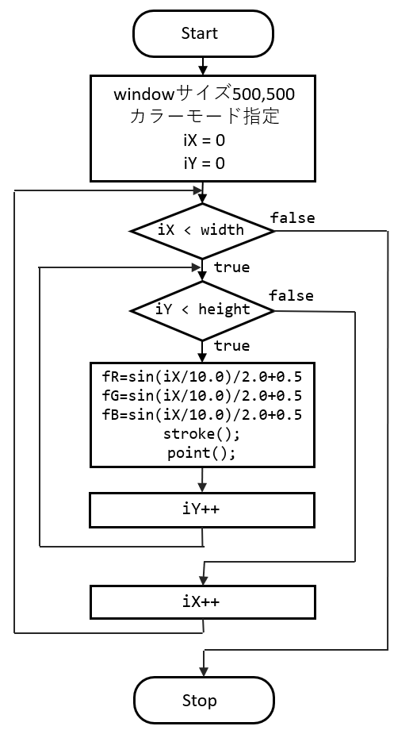

## 条件式
- プログラムの実行の流れを決める重要な要素，'判断'のパーツ．
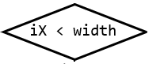

ここで用いられるのが条件式．
- 式(Expression)の一種
- 要素
	- 値，変数
	- 比較演算子，論理演算子
- 計算結果（式が返す値）
	- 真(true)
	- 偽(false)
### 条件式（比較演算子）
以下の条件を満たしたとき，式の結果は真(true)となり，
そうでなければ偽(false)となる．

|条件式|条件|
| ---- | ---- |
|`a < b`|aがbより小さい|
|`a <= b`|aよりb以下|
|`a > b`|aがbより大きい|
|`a == b`|aとbが等しい|
|`a != b`|aがbが等しくない|

## 繰り返し文
### できること

- 大量の図形を描画する
```java
size(400, 400);
 
for(int iIdx=0; iIdx<400; iIdx++)
{
	circle( random(width), random(height), 20 );
}
```
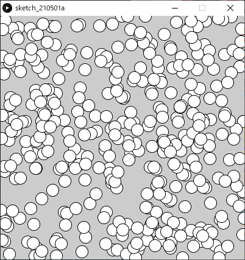

- 大量のプロパティ(座標，サイズ，色など)を変更する

  ```java
  size(400, 400);
   
  for(int iIdx=0; iIdx<400; iIdx++)
  {
    fill( 170 + random(80), 100 + random(50), 200 );
    circle( random(width), random(height), 10 + random(15) );
  }
  ```

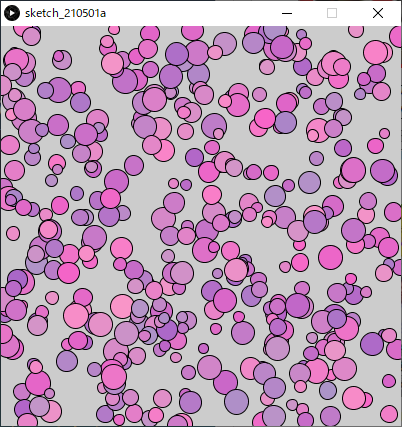

### for文
- 英語の前置詞for（〜の間）から由来．
- **指定した/回数**分．処理を繰り返す．
- あらかじめ繰り返す回数が決まっている場合に便利．

#### 書式
```java
for( 繰り返し用変数の宣言・初期化; 繰り返し条件式; 繰り返し用変数の更新式 )	 //セミコロン(；)無し
{
	(命令)文（複数書いてよい）;	// ←ここが繰り返される
    // インデント(字下げ)はエディタが自動で行ってくれる．
    // 手動で行う場合はTabキーを使う．
}
```

#### 処理の流れ

```java
// 点をランダムに100個打つ
for(int iPointIdx=0; iPointIdx<400; iPointIdx++)
{
  point( random(100), random(100) );
}
```
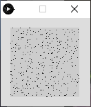

1. 繰り返し用変数の宣言と初期化．

```java
int iPointIdx=0;
```

2. 繰り返し条件式の評価（計算）.

```java
iPointIdx<400	// 変数iPointIdxの値が400未満か
```
​	結果が '真' なら，手順3へ.
​	結果が '偽' なら，**繰り返し終了**し，{}の次の行に処理を移す.

3. {}内の(命令)文を実行.
```java
point( random(100), random(100) );
```
4.  繰り返し用変数の更新

```java
iPointIdx++		// 変数iPointIdxの値をインクリメント(1を足す)
```
​	手順2へ戻る.

#### 星空のような図の描画
前述の点を打つプログラムを加工して星空を描いてみましょう．
ゼロから書くのが難しい場合，以下のサンプルをアレンジしてみましょう．

- 星の数を増やす.
- 色や明るさを変える
```java
size( 400, 400);
background( 0, 10, 20 );  // 背景.
 
for(int iPointIdx=0; iPointIdx<400; iPointIdx++)
{
  stroke( 255, 255, 255 );
  point( random(400), random(400) );
}
```
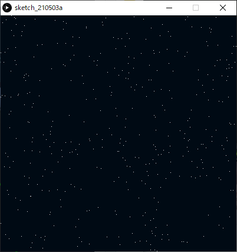

### 星空のような図の描画（point()の代わりにcircle()を使用）
```java
// 星空のような図の描画（point()の代わりにcircle()を使用）
size(400, 400);
colorMode( HSB, 360, 1.0, 1.0, 1.0 ); // HSBA
background( 220, 0.1, 0.1 );          // 背景色
noStroke();                           // 線無し
 
for(int iStarIdx=0; iStarIdx<400; iStarIdx++)     // 400回繰り返す.
{
  fill( random(360),          // H
        0.1 + random(0.4),    // S
        1.0,                  // B
        0.2 + random(0.8) );  // A
        
  circle( random(width), random(height), 1 + random(3) );
}
```
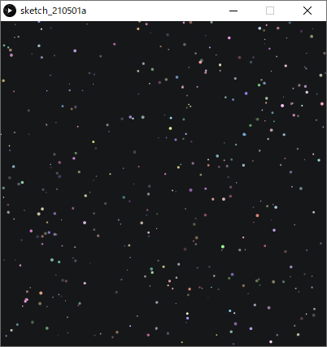

### for中における変数の使用
繰り返し用変数は{}の中でも使うことができる．
```java
// グラデーションの対角線を描画.
colorMode(RGB, 100);
for(int iX=0; iX<100; iX++)
{
  stroke(iX, iX, iX);
  point(iX, iX);
}
```
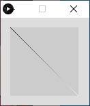

### for()の様々な書き方
```java
// iXにX座標の0~スクリーン端の座標値を(昇順で)代入しながら繰り返す
for( int iX=0; iX<width; iX++ )
{
    //（命令）文;
}
// iYにY座標の0~スクリーン端の座標値を(昇順で)代入しながら繰り返す
for( int iY=0; iY<height; iY++ )
{
    //（命令）文;
}
```
```java
// iXにX座標のスクリーン端~0座標値を(降順で)代入しながら繰り返す
for( int iX=width-1; iX>=0; iX-- )
{
    //（命令）文;
}
// iYにY座標のスクリーン端~0の座標値を(降順で)代入しながら繰り返す
for( int iY=height-1; iY>=0; iY-- )
{
    //（命令）文;
}
```
### forのネスティング
- forの中で，さらにforを使うことができる．
- これは何段階でも使用でき，増やすたびに次元が増えるイメージ．
  →2つのforで二次元的な表現に向く

```java
// グラデーションのカラーチャート(矩形)
size(200, 200);
colorMode(HSB, 100);
background(99);
 
for(int iSatIdx=0; iSatIdx<10; iSatIdx++)        // 彩度(Y軸方向)
{
  for(int iHueIdx=0; iHueIdx<10; iHueIdx++)      // 色相(X軸方向)
  {
    fill( iHueIdx*10, 10+iSatIdx*10, 99 );
    rect( iHueIdx*20, iSatIdx*20, 10, 10 );
  }
}
```
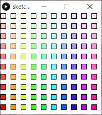

```java
// グラデーションのカラーチャート(ドット)
size(200,200);
noStroke();
colorMode(HSB, 200); // カラーモード:HSB, 各値の最大値200
 
for ( int iY = 0; iY < height; iY++ )    // 彩度(Y軸方向)
{
    for ( int iX = 0; iX < width; iX++ ) // 色相(X軸方向)
    {
        stroke( iX, iY, 200);
        point( iX, iY);
    }
}
```
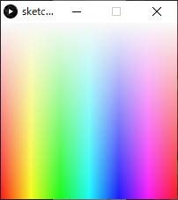
### while文

- 英語の接続詞while（〜の間ずっと）から由来．

- 指定した条件満たす限り，処理を繰り返す．
- 何かの数を数え上げる場合などに便利．

#### 書式
```java
while (繰り返し条件式)
{
	繰り返したい命令;
}
```
#### 例
```java
size( 400, 200 );
 
int iCount = 0;
 
while( 40*iCount < width )  // スクリーン右端まで処理を続ける
{
  rect( 40*iCount, 80, 20, 20 );
 
  iCount++;  // iCountのインクリメント.
}
 
print( "描画した矩形の数は" + iCount + "個" );

// コンソール表示：描画した矩形の数は10個
```

**本授業では基本的にforを使うことを推奨**

### 繰り返しによる表現
***
#### 反復
```java
size(400,200);
noStroke();
colorMode( HSB,360, width-40, 1.0 );
 
for( int iX=0; iX<width; iX+=30 )
{
  fill( 180, iX+40, 1 );
  rect( iX,    50,    8, height );  // 矩形:長
  
  fill( 300, iX+40, 1 );
  rect( iX+10, 50+40, 8, height );  // 矩形:中
  
  fill( 60,  iX+40, 1 );
  rect( iX+20, 50+80, 8, height );  // 矩形:短
}
```

***
#### 振動
```java
int iAmplitudeL = 80;  // 振幅（大きな波の高さ）
int iAmplitudeS = 40;  // 振幅（小さな波の高さ）
 
size( 400,200 );
colorMode( HSB, 360, 1.0, 1.0, 1.0 );
 
// 大きな波形(cos).
strokeWeight( 8 );
for( int iX=0; iX < width; iX++ )
{
  int iAngle0 = iX*4;
  int iAngle1 = (iX+1)*4;
   
  stroke( iAngle0%360, 1.0, 1.0 );  // a%b:aをbで割った余り.
  line( iX, height/2 + iAmplitudeL*cos( radians(iAngle0) ),
        iX, height/2 + iAmplitudeL*cos( radians(iAngle1+1) ) );
}
 
// 小さな波形(sin).
strokeWeight( 8 );
for( int iX=0; iX < width; iX++ )
{
  int iAngle0 = iX*4;
  int iAngle1 = (iX+1)*4;
  
  stroke( iAngle0%360, 1.0, 1.0, 0.2 );
  line( iX, height/2 + iAmplitudeS*sin( radians(iAngle0) ),
        iX, height/2 + iAmplitudeS*sin( radians(iAngle1+1) ) );
}
```
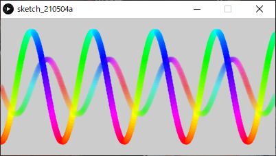
***
#### 遷移
```java
size(400,200);
noStroke();
colorMode( HSB,width, 1.0, 1.0 );
 
for( int iX=0; iX<width; iX+=10 )
{
  fill( iX, 1, 1 );
  rect( iX, iX*height/width, 8, height );  // 矩形
}
```
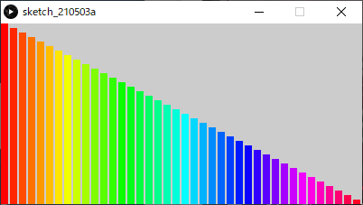

***
#### 乱雑さ
```java
size(400,200);
noStroke();
colorMode( HSB, width, height, 1.0 );
 
for( int iX=0; iX<width; iX+=10 )
{
  float fY = 20 + random(height-20);  // Y座標値を表す変数．
  fill( iX, height-fY+20, 1 );
  rect( iX, fY, 8, height );  // 矩形
}
```
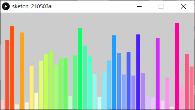

***
#### モアレ
```java
size(400,200);
background(0, 0, 0);
 
noStroke();
colorMode( HSB, width, height, 1.0 );
 
for( int iY=3; iY<height; iY+=12 )
{
  for( int iX=3; iX<width; iX+=12 )
  {
    fill( iX, height, 1 );
    circle( iX, iY, 6 );  // 円
  }
}
 
pushMatrix();  // 念のため移動する前の座標系を記憶.
 
translate( width/3, -height/2 );  // 座標系を平行移動
rotate( radians(45) );            // 座標系を45度回転
 
for( int iY=3; iY<height; iY+=12 )
{
  for( int iX=3; iX<width; iX+=12 )
  {
    fill( iX, height, 1 );
    circle( iX, iY, 6 );  // 円
  }
}
 
popMatrix();   // 座標系を戻す.
```
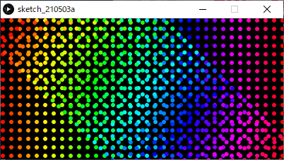

***
### その他，身近にある「繰り返し」を観察してみましょう
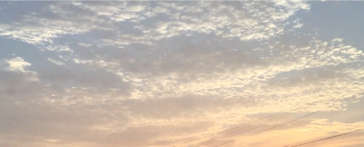

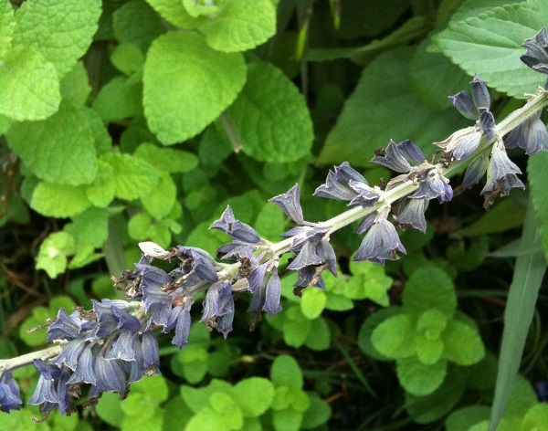

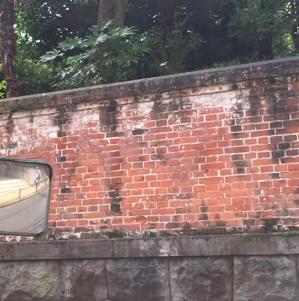

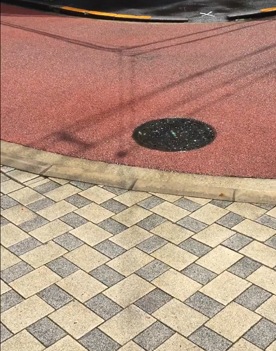

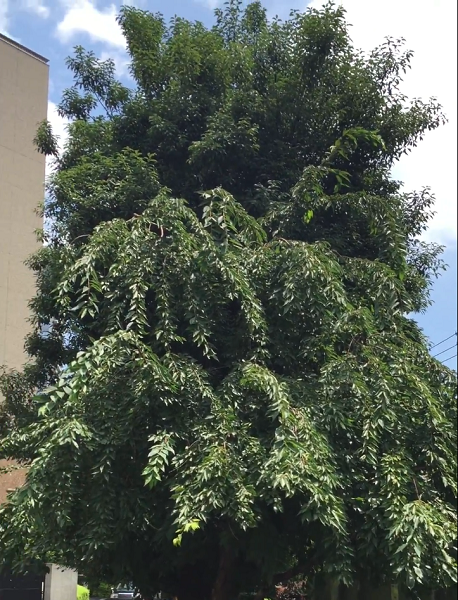

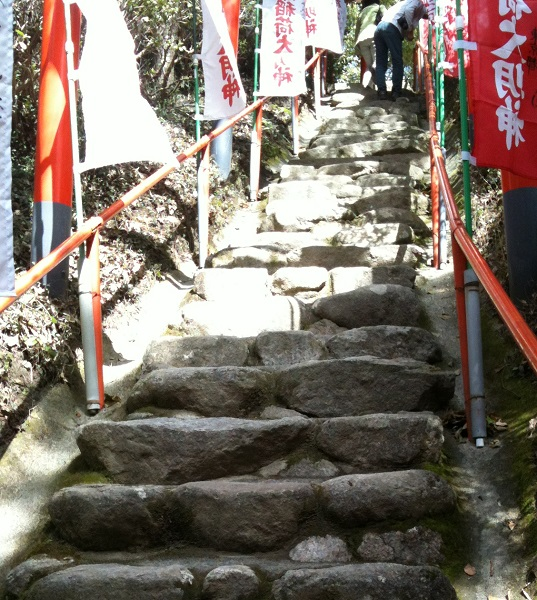

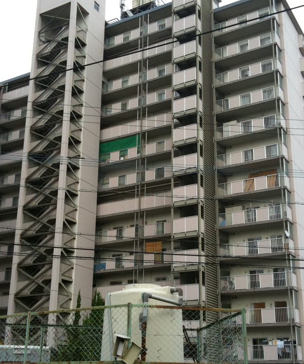