# Processingの基本

## Processingのデータ
ファイル形式（拡張子）: .pde
スケッチとも呼ばれる．
スケッチが格納された同名のフォルダをスケッチブックとも呼ぶ．
スケッチ(.pde)がフォルダ(スケッチブック)に格納されているファイル構造を壊さないよう注意．
（スケッチブックだけを移動させる等）

## フォント（エディタ・コンソール）の変更（任意）
変更方法：ファイル>設定>エディタとコンソールのフォント
デフォルトのフォント Source Code Pro は以下のことができない．

- プログラム及びコメントへの日本語（全角）入力
- コンソールへの日本語（全角）出力
- これらを有効にするには，日本語対応のフォントに変更してください．
	MS ゴシック など


## プログラムを書く際の最低限のルール
- 半角英数と数字を用いる
- 単語ごとにスペースを入れて区切る
- 文末にはセミコロン（;）を入れる（忘れがち！）
- 大文字と小文字の区別があるので注意

## Processingの命令
Processingには，線を描く命令や，円を描く命令，色を変える命令など，様々な命令が用意されている．
基本的にはプログラムは上から下へ，順番に逐次実行されていく．
命令の名前は一つの単語となっており，スペースを含まない．
基本的には小文字が命令の名前に用いられるが，二単語が複合した命令は，2単語目に大文字が用いられる．例：rectMode();
あらかじめ用意された命令を入力すると，エディタ上では色が変わる．
これらの命令は，プログラムにおける関数の一種である．

## コンソールへの出力 print()
- プログラム処理の内容を視覚化し，問題が起こった場合原因を特定しやすくする．
- 変数の中の値をトレース（監視）することができる．
### コンソールエリアに任意の値を出力する．
```java
print( "文字列" );
print( 値or変数 );
print( "文字列" + 値or変数 );  // 文字列と値や変数を+を用いてつなげることも可能
```
### 改行を含めたい場合
```java
println( 上記と同様のフォーマット );
```
### 例
```java
String s = "The size is ";
int w = 1920;
int h = 1080;
print(s);
print(w, "x", h);
// コンソールには以下のように出力される:
// The size is 1920 x 1080
```
```java
print("begin- ");
 
float f = 0.3;
int i = 1024;
print("f is " + f + " and i is " + i);
 
println("-end");
 
// コンソールには以下のように出力される:
// begin- f is 0.3 and i is 1024 -end
```
## 座標系について
画面はピクセルというモザイク状の点の集まりによって表現される．
Processingでは左上を原点（0, 0）とし，右下に向かって座標値が大きくなる．


https://processing.org/tutorials/drawing/

## 画面のサイズを決める

```java
size( 横のピクセル数, 縦のピクセル数 );
```
https://processing.org/reference/size_.html

## 画面のサイズを取得する

必ずsize()記述以後に記述する必要がある．
### 例
```java
width   // 横のピクセル数
height  // 縦のピクセル数
```


https://processing.org/reference/width.html
https://processing.org/reference/height.html


## 色を扱う

### カラーモードの設定
色を扱うにはまず、プログラムで使用するカラーモードを指定する必要がある．
プログラム中に明示的に指定が無ければ，RGBモードが使用される．
```java
colorMode(RGB, 最大値);
colorMode(HSB, 最大値);
colorMode(HSB, 色相の最大値, 彩度の最大値, 輝度の最大値);
```
### デフォルトのカラーモード
カラーモードを明示的に指定していない場合は，以下の初期設定が適用されている．
```java
// 使用するカラーモデルはRGB，最大値は255
colorMode( RGB, 256 );
```
例：
```java
// 使用するカラーモデルをRGBに設定，最大値を100とする．
colorMode( RGB, 100 );

// カラーモデルをHSBに設定し，色相の最大値を360とし，彩度と輝度の最大値1,0とする．
colorMode( HSB, 360, 1.0, 1.0 );
```
### 色の書式
各アルファベットの位置に具体的な数値が入る
RGB
```java
r, g, b
例：0.1, 0, 1.0
```
RGB, alpha
```
r, g, b, a
```
gray
```
g
```
gray, alpha
```
g, a
```
HSB
```
h, s, b
```
HSB, alpha
```
h, s, b, a
```
### 色相と彩度
```java
// 下のグラデーション図のプログラム
noStroke();
colorMode(HSB, 100); // カラーモード:HSB, 各値の最大値100
for (int i = 0; i < 100; i++)
{
    for (int j = 0; j < 100; j++)
    {
        stroke(i, j, 100);
        point(i, j);
    }
}
```


https://processing.org/reference/colorMode_.html

## 背景に色を付ける

```java
background( 色の書式 );  // colorMode設定に依存
```
例：
```java
background(255, 204, 0);
```


https://processing.org/reference/background_.html

## アンチエイリアスをかける

```java
smooth();
```
### アンチエイリアスを解除する
```java
noSmooth();
```
https://processing.org/reference/smooth_.html


***

# 図形描画
## 線の色を変える
```java
stroke( 色の書式 );  // colorMode設定に依存
```
### 例
```java
stroke(204, 102, 0);
rect(30, 20, 55, 55);
```


https://processing.org/reference/stroke_.html

## 線を消去する

```java
noStroke();
```
### 例
```java
noStroke();
rect(30, 20, 55, 55);
```


https://processing.org/reference/noStroke_.html

## 線の太さを設定する

```java
strokeWeight( 太さ );
```
### 例

```java
strokeWeight(1);  // Default
line(20, 20, 80, 20);
strokeWeight(4);  // Thicker
line(20, 40, 80, 40);
strokeWeight(10);  // Beastly
line(20, 70, 80, 70);
```


https://processing.org/reference/strokeWeight_.html

## 図形の塗りつぶし色を設定する

```java
fill( 色の書式 );　// colorMode設定に依存
```
### 例1
```java
colorMode(RGB, 256);
fill(204, 102, 0);
rect(30, 20, 55, 55);
```


### 例2

```java
colorMode( HSB, 360, 1.0, 1.0 );
fill(80, 0.8, 0.9);
rect(15, 10, 55, 55);
```


### 例3

```java
colorMode(RGB, 256);
 
fill(204, 102, 0);
rect(15, 10, 55, 55);
 
fill(0, 102, 200, 80);  // アルファ80
rect(30, 20, 55, 55);
```


https://processing.org/reference/fill_.html

## 塗りつぶしを消去する

```java
noFill();
例：
rect(15, 10, 55, 55);
noFill();
rect(30, 20, 55, 55);
```


https://processing.org/reference/noFill_.html

## 点を描画する

```java
point( x座標, y座標 );
```
### 例
```java
stroke( 255, 0, 0 );  // 色を指定する場合はstroke()を使う．
point( 50,50 );
point( 51,50 );
point( 50,51 );
point( 51,51 );
```


https://processing.org/reference/point_.html

## 線を描画する

```java
line( 始点x座標, 始点y座標, 終点x座標, 終点y座標 );
```
### 例1
```java
line(30, 20, 85, 75);
```
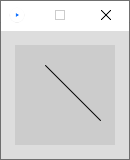

### 例2 連続した線

```java
stroke(255,0,0);        // R
line( 20, 20, 40, 40 );
 
stroke(0,255,0);        // G
line( 40, 40, 50, 70 );	// 一つ目の線の終わりの点からスタート
 
stroke(0,0,255);        // B
line( 50, 70, 80, 80 );	// 二つ目の線の終わりの点からスタート
```
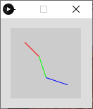

https://processing.org/reference/line_.html

## 三角形を描画する

```java
triangle( 頂点1のx値, 頂点1のy値, 頂点2のx値, 頂点2のy値, 頂点3のx値, 頂点3のy値 );
```
### 例
```java
triangle(30, 75, 58, 20, 86, 75);
```


https://processing.org/reference/triangle_.html

## 矩形（長方形）を描画する

主に三種類のやり方があるが，自分の実現したいことに適した方法を選ぶとよい．

### 左上の座標と大きさを指定（初期設定）

```java
rectMode(CORNER); // 他にrectMode()を使用している箇所が無ければ，不要
rect( 左上x座標, 左上y座標, 矩形の幅, 矩形の高さ );
```


### 中心の座標を指定

```java
rectMode(CENTER);
rect( 中心x座標, 中心y座標, 矩形の幅, 矩形の高さ );
```


### 左上と右下の座標を指定

```java
rectMode(CORNERS);
rect( 左上x座標, 左上y座標, 右下x座標, 右下y座標 );
```
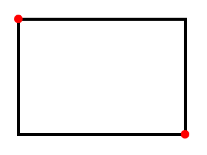

### 例

```java
rectMode(CORNER);
rect(30, 20, 55, 55);
```


https://processing.org/reference/rect_.html
関連する命令：正方形の描画
https://processing.org/reference/square_.html


## 四辺形を描画する
自由な四辺形を描くことができる．
```java
quad( 頂点1のx値, 頂点1のy値,
      頂点2のx値, 頂点2のy値,
      頂点3のx値, 頂点3のy値,
      頂点4のx値, 頂点4のy値 );
```
### 例
```java
quad(38, 31, 86, 20, 69, 63, 30, 76);
```


https://processing.org/reference/quad_.html


## 円・楕円を描画する

### 中心座標と直径を指定

```java
ellipseMode(CENTER); // 他にellipseMode()を使用している箇所が無ければ，不要
ellipse( 中心のx座標, 中心のy座標, 横の直径, 縦の直径 );
```
### 中心座標と半径を指定
```java
ellipseMode(RADIUS);
ellipse( 中心のx座標, 中心のy座標, 横の半径, 縦の半径 );
```
### 例
```java
ellipseMode(CENTER);
ellipse(56, 46, 55, 55);
```


https://processing.org/reference/ellipse_.html
関連する命令：正円の描画
https://processing.org/reference/circle_.html


## 円弧を描画する
度（度数法）をラジアン（弧度法）に変換する方法
指定する角度は，ラジアン単位である必要がある
```java
// θ = θ° × π / 180 [rad]
radians( 度 ); // この命令で任意の角度をラジアンに変換できる．
おおまかな度とラジアンの対応
QUARTER_PI : 45°
HALF_PI    : 90°
PI         : 180°
TWO_PI     : 360°
```
### オープンな弧を描画する
```java
arc( 中心のx座標, 中心のy座標, 横の直径, 縦の直径, 弧の始まりの角度, 弧の終わりの角度, OPEN );
```
#### 例
```java
arc(50, 50, 80, 80, 0, PI+QUARTER_PI, OPEN);
```


### 閉じた弧を描画する

```java
arc( 中心のx座標, 中心のy座標, 横の直径, 縦の直径, 弧の始まりの角度, 弧の終わりの角度, CHORD );
```
#### 例
```java
arc(50, 50, 80, 80, 0, PI+QUARTER_PI, CHORD);
```


### パイ状に描画する

```java
arc( 中心のx座標, 中心のy座標, 横の直径, 縦の直径, 弧の始まりの角度, 弧の終わりの角度, PIE );
```
#### 例
```java
arc(50, 50, 80, 80, 0, PI+QUARTER_PI, PIE);
```
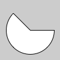

https://processing.org/reference/radians_.html
https://processing.org/reference/PI.html
https://processing.org/reference/arc_.html

### 例: 月の満ち欠けのような描画

```java
size( 400, 200 );
 
arc( 50,     100, 80, 80, radians(120), radians(420), CHORD );
arc( 50+100, 100, 80, 80, radians(135), radians(405), CHORD );
arc( 50+200, 100, 80, 80, radians(175), radians(365), CHORD );
arc( 50+300, 100, 80, 80, radians(190), radians(350), CHORD );
```


## 曲線を描画する

4点を結ぶ曲線の中間2点間が描画される（スプライン曲線）

```java
curve( 点1のx値, 点1のy値,   // 制御点1
       点2のx値, 点2のy値,   // 描画点1
       点3のx値, 点3のy値,   // 描画点2
       点4のx値, 点4のy値 ); // 制御点2
```
### 例
```java
noFill();
stroke(255, 102, 0);
curve(5, 26, 5, 26, 73, 24, 73, 61);
stroke(0);
curve(5, 26, 73, 24, 73, 61, 15, 65);    // 中間2点間（黒）
stroke(255, 102, 0);
curve(73, 24, 73, 61, 15, 65, 15, 65);
```


https://processing.org/reference/curve_.html


## ベジェ曲線を描画する

```java
bezier( 点1のx値, 点1のy値,
        制御点1のx座標, 制御点1のy座標,
        点2のx値, 点2のy値,
        制御点2のx座標, 制御点2のy座標 );
```
### 例
```java
noFill();
stroke(255, 102, 0);
line(85, 20, 10, 10);    // 点1から制御点1への線（橙）
line(90, 90, 15, 80);    // 点2から制御点2への線（橙）
stroke(0, 0, 0);
bezier(85, 20, 10, 10, 90, 90, 15, 80);   // 得られた曲線(黒)
```


https://processing.org/reference/bezier_.html


## 多角形を描画する

複数の命令で構成される．
はじめにbeginShape();と書き，次いで必要な頂点数だけ vertex( x座標, y座標 ); を記述する．
最後に endShape(); で閉じる．
※なお、endShape(CLOSE)と指定すると、閉じた形状となる
```java
beginShape(); // 形状の開始宣言
vertex( x座標, y座標 ); // 頂点座標（頂点の数だけ書く。複数書いてよい）
endShape(); //形状の終了宣言
```
### 例
```java
beginShape();
vertex(20, 20);
vertex(40, 20);
vertex(40, 40);
vertex(60, 40);
vertex(60, 60);
vertex(20, 60);
endShape(CLOSE);
```


https://processing.org/reference/beginShape_.html
https://processing.org/reference/vertex_.html
https://processing.org/reference/endShape_.html


***

# 座標変換（平行移動，回転，拡大縮小）

## 前提知識
- Processingでは座標原点がスクリーン左上(0,0)に設定されている．
- この座標を移動，回転，拡大縮小することを座標変換という．
公式チュートリアル
https://processing.org/tutorials/transform2d/

## 平行移動
```java
translate( x移動量, y移動量 );
```
### 例
```java
// 平行移動させる前
rect(20, 20, 40, 40 );
```


```java
translate(60, 80);	// 平行移動
rect(20, 20, 40, 40);
```


### 利点
入れ子状の構造の繰り返しがシンプルにできる
#### 例1　家のような図の描画（平行移動前）
```java
// 平行移動前
size(400, 100);
background(255); 
 
triangle(15, 0, 0, 15, 30, 15);
rect(0, 15, 30, 30);
rect(12, 30, 10, 15);
```


#### 例2　家のような図の複数描画（平行移動後）

```java
size(400, 100);
background(255); 
 
// 一つ目
triangle(15, 0, 0, 15, 30, 15);
rect(0, 15, 30, 30);
rect(12, 30, 10, 15);
 
translate(40, 0); // x軸方向に40移動
 
// 二つ目
triangle(15, 0, 0, 15, 30, 15);
rect(0, 15, 30, 30);
rect(12, 30, 10, 15);
 
translate(40, 0); // x軸方向にさらに40移動
 
// 三つ目
triangle(15, 0, 0, 15, 30, 15);
rect(0, 15, 30, 30);
rect(12, 30, 10, 15);
```


https://processing.org/reference/translate_.html


## 回転

座標を原点を中心に時計回りに回転する．
```java
rotate( 角度 );  // 単位：ラジアン
```
ラジアンに慣れていない人はこう書くとよい．
```java
rotate( radians( 角度 ) );  // 度数法をラジアンに変換
```
※図形描画の円弧のセクションも参照してください
### 例1
矩形を45°回転させる（スクリーン左上を中心に回転してしまっている例）
```java
size(200, 200);
background(255);
 
fill(192);
noStroke();
rect(40, 40, 40, 40);
 
rotate(radians(45));    // 45°時計回りに回転
fill(0);
rect(40, 40, 40, 40);
```


### 例2

矩形を45°回転させる(正しい例)
1. 原点座標を矩形の左上に移動させる
2. 座標を回転させる
3. 原点に矩形を描画する
```java
size(200, 200);
background(255); 
 
fill(192);
noStroke();
rect(40, 40, 40, 40);
 
translate(40, 40);  // 原点を矩形の左上に移動
rotate(radians(45));
 
fill(0);
rect(0, 0, 40, 40); // 原点に二つ目の矩形を描画
```


https://processing.org/reference/rotate_.html


## 拡大縮小

```java
scale( 拡大率 );
scale( x拡大率, y拡大率 );
```
### 例
矩形の大きさだけでなく，x,y座標値も拡大されていることに注目
```java
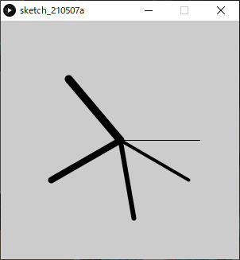size(200,200);
background(255);
 
stroke(128);
rect(20, 20, 40, 40);
 
stroke(0);
scale(2.0);
rect(20, 20, 40, 40);
```


## 例: 時計の針のような描画
```java
size( 300, 300 );
 
translate( width/2, height/2 );  // 原点をスクリーン中心に移動.
 
strokeWeight(1);
line( 0, 0, 100, 0 );
 
rotate( radians(30) );    // 30度回転.
strokeWeight(4);
line( 0, 0, 100, 0 );
 
rotate( radians(50) );    // 50度回転.
strokeWeight(6);
line( 0, 0, 100, 0 );
 
rotate( radians(70) );    // 80度回転.
strokeWeight(8);
line( 0, 0, 100, 0 );
 
rotate( radians(80) );    // 90度回転.
strokeWeight(10);
line( 0, 0, 100, 0 );
```


https://processing.org/reference/scale_.html


## 座標系の保存と復帰

詳細は行列の計算が関連することもあり難解であり，本授業では掘り下げない．
任意の場所に記述し，使うことができれば問題ない．
### 座標系の保存
```java
pushMatrix();
```
### 座標系の復帰
```java
popMatrix();
```
### 例
```java
size(500, 500);
pushMatrix(); 			// 座標系の記憶
 
translate(250, 250);	// 座標系の移動
rect(0, 0, 50, 50);     // 平行移動後の位置に描画されるはず
 
popMatrix(); 			// 座標系を元に戻す
rect(0, 0, 50, 50);     // スクリーン左上に描画されるはず
```


https://processing.org/reference/pushMatrix_.html
https://processing.org/reference/popMatrix_.html


## 座標系まとめ

### ２次元座標系


***


***


***


***


***

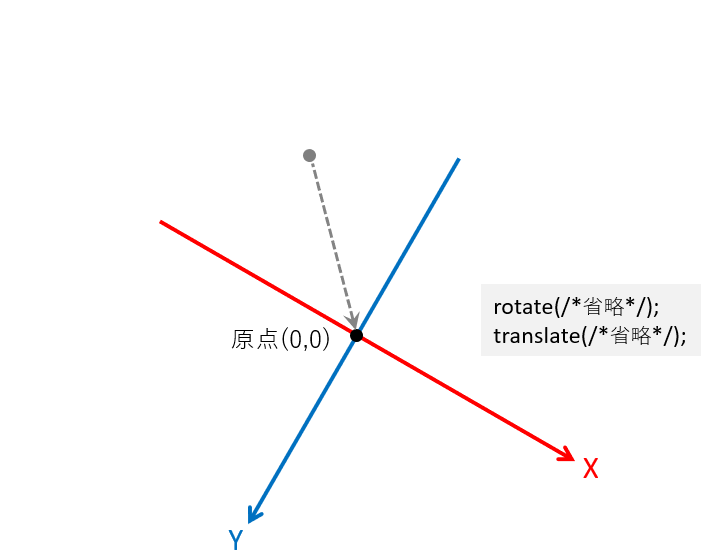

***

### 初期の座標系


***


***

### 平行移動

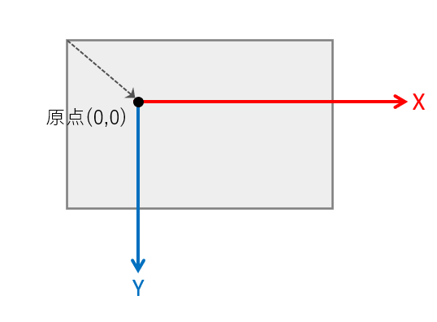

***

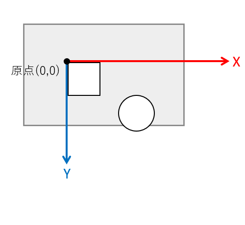

***

### 回転


***


***

### 平行移動+回転


***


***


***

### 回転+平行移動


***


***


***

### 座標系の保存と復帰について


基本的には

- **translate()やrotate()を使う前にpushMatrix()**で初期の座標系を保存しておく．
- **座標系をリセットしたいときにpopMatrix()**で初期の座標系に戻す．

以上のような使い方が多い．


***

# 演算と変数

## 文と式
### 文 Statement
- 手続きを表す．
- プログラムは基本的に文から構成される．
- 逐次実行される(手続き型言語).
- セミコロン「；」 で区切られている部分が一つの文となる．
```java
size(200,200);          // 文
rectMode(CENTER);       // 文
rect(100,10020,100);    // 文
```
- 主に二種存在する．
	- 宣言文 Declarative Statement
	- 命令文 Imperative Statement
```java
int a;      // 宣言文
a = a + 1;  // 命令文
```

### 式 Expression
- コンピュータにとっての「計算」を表す表現
- 式は基本的には文の中に含まれている（存在する）．
- 主に以下の要素から構成される．
	- 値
	- 変数
	- 演算子 Operator
	- 関数

| line( 0, 0, 0, <u>a + 1</u> ); // 式<br/>line( <u>0</u>, <u>0</u>, <u>0,</u> a + <u>1</u> ); // 値<br/>line( 0, 0, 0, <u>a</u> + 1 ); // 変数<br/>line( 0, 0, 0, a <u>+</u> 1 ); // 演算子<br/><u>line(</u> 0, 0, 0, a + 1 <u>)</u>; // 関数<br/><u>line( 0, 0, 0, a + 1 )</u>; // 文 |
| ------------------------------------------------------------ |

## 算術式
### 四則演算（+-×÷）を表す式

|計算|種類|式|演算子|
| ---- | ---- | ---- | ---- |
|足し算|加算|`a + b`|プラス|
|引き算|減算|`a - b`|マイナス|
|かけ算|乗算|`a * b`|アスタリスク|
|割り算|除算|`a / b`|スラッシュ|

#### 例

```java
print("answer=");
println(1+2);
```
### 括弧を使った計算
#### 例
```java
(6-4)/(2+3)
(2*(3+7))/5     // 乗算*は省略できないことに注意
```
### 剰余算

「割り算の余り」を求める記述

```java
a % b	// aをbで割ったときの余り
```

#### 例

```java
// 偶数と奇数を判別する．

int iA = 234;
if( iA%2 == 0 )	// もし変数iAが偶数だったら．
{
    // 命令
}
```

### 演算優先順位

算数の四則計算に準じる
左から逐次実行されるわけではない

|優先度| 種類|演算子|
| ---- | ---- | ---- |
|高い|括弧(カッコ)|`( )`|
||乗算|`*`|
||除算|`/`|
||加算|`+`|
|低|減算|`-`|

## 変数
- 変数とは，数値などのデータを入れて保持しておくための入れ物であり，現実世界の保管箱のようなもの．
- 関数や式に組み込むことで，中の値を参照したり書き換えたりすることができる．
- 使う前に，準備（宣言）する必要がある．
### 変数の要素
- 型
- 変数名
- 値
### 型
データ型とも言う．
変数は決められた型を持ち，**入れられるデータの種類が決まっている**．

- 整数型 Integer
値として小数は持てない整数の型
```java
int     // 2,147,483,647 ~ -2,147,483,648
```
- 実数型  floating-point numbers
値として小数を持てる型
```java
float   // 3.40282347E+38 ~ -3.40282347E+38 32bit
double  // 3.40282347E+38 ~ -3.40282347E+38 64bit,  float型より広い範囲を保持できる
                                       E+38 は「10の38乗」の意
```
### 宣言
変数を使うには，宣言文によって変数の宣言を行う必要がある．
- (データ)型の指示
- 変数名の決定
- 初期値の代入（必須ではない）
```java
型 変数名;              // 宣言のみ
型 変数名 = 値 or 数式;  // 宣言+初期化型
```
### 変数名
- 変数は，変数名によって，その中に入っている値を参照することができる．
- 各変数は変数名により一意に定まる（ユニークである）必要がある．
#### 変数名の制限
変数名の１文字目は英字
```java
誤：55musabi, 2baisoku
正：musabi55, baisoku2
```
予約語は変数名として使用できない．
```java
background, beginShape, bezier, bezierVertex, case, colorMode, curve, curveVertex, default, , dist, draw, ellipse, ellipseMode, else, endShape, fill, frameRate, height, if, image, imageMode, keyPressed, keyReleased, line, loadFont, loadImage, loadPixels, min, mouseButton, mouseDraged, mouseMoved, mousePressed など
```
#### 例
```java
int a;      // 変数の型，スペースをあけて変数名を書く
int a, b;   // カンマで区切り，複数の変数を宣言できる
int a=5;    // 変数にいきなり値を代入してもよい（初期化）
int a=1+1;  // 数式を代入してもよい
```
### 代入文
特に宣言時に初期化されていない変数は代入文によって値を代入されなければならない．
代入文によって，変数に格納されている値を上書きすることができる．
```java
変数名 = 新しい値 or 数式;
```
#### 例
```java
int a;      // 変数aの宣言
int b = 3;  // 変数bの宣言と初期化
 
a = 5;      // 変数aへの値の代入（初期化）
a = b + 2;  // 変数aへの値の代入（上書き）
```

### 良い変数名をつける
プログラムを久しぶりに見たり，他人に見せたりする場合に円滑に理解できるための工夫．
企業等でチームでプログラムを行う際には，コーディング規約というものでルールが決められることが多い．
#### 複数単語の区切り
- キャメルケース
２つ目以降の単語の頭文字を大文字にする．
```java
hogeData
```
- スネークケース
アンダースコアで区切る．
```java
hoge_data
```
#### 頭文字にデータ型の頭文字を小文字で付ける
```java
int   iRadius, iLength;
float fWidth, fHeight;
````
#### プロパティ（性質）
名前の後ろの方につけるのが好ましい．
```java
// よく使われる記述
X             // X座標
Y             // Y座標
Position, Pos // 位置，座標
Width         // 幅
Height        // 高さ
Radius        // 半径
Diameter      // 直径
Degree, Deg   // 角度°
Radian, Rad   // 角度ラジアン
Minute        // 分
Second, Sec   // 秒
Ratio         // 比，率
R,G,B         // RGBカラー
```
#### 計算値による修飾子
名前の最後につけるのがよい．
```java
// よく使われる記述
Total        // 合計
Sum          // 和
Count        // 数え上げた数
Average      // 平均
Max          // 最大
Min          // 最小
Index, Idx   // (特定の)番号

// Number または Num は混乱しがちなので避けることを推奨
```

#### 例
変数によって各部のサイズ・色を変えられる家の描画
```java
int iHouseWidth  = 60;  // 家の幅
 
int iRoofHeight  = 15;  // 屋根の高さ
 
int iWallHeight  = 30;  // 壁の高さ
 
int iDoorWidth   = 10;  // 扉の幅
int iDoorHeight  = 15;  // 扉の高さ
int iDoorX       = 40;  // 扉のX座標
 
float fRoofR = 1.0;     //  屋根のRGB
float fRoofG = 0.1;
float fRoofB = 0.3;
 
size(100, 100);
background(255);
colorMode(RGB, 1.0);
 
// 屋根
fill( fRoofR, fRoofG, fRoofB );                // 屋根色
triangle( iHouseWidth/2, 0,                    // 上
          0,             iRoofHeight,          // 左下
          iHouseWidth,   iRoofHeight );        // 右下
 
// 壁
fill( 1.0 );
rect(0, iRoofHeight, iHouseWidth, iWallHeight);
 
// 扉
fill( 1.0 );
rect(iDoorX, iRoofHeight+iWallHeight-iDoorHeight, iDoorWidth, iDoorHeight);
```


### ローカル変数とグローバル変数

#### ローカル変数

- 特定の範囲でのみ有効
- `draw()`の度にメモリ領域が初期化されるため，フレームをまたいで値を保存することができない．
- アニメーションでは局所的な使用に限られる．

##### ブロック

`{ }`で囲まれた部分を**ブロック**という．
繰り返しfor文，条件分岐if文，関数で使用されている．

```java
for(/** 省略 */)
{
    // ブロック
}
```

```java
if(/** 省略 */)
{
    // ブロック
}
```

```java
void setup()
{
    // ブロック
}
void draw()
{
    // ブロック
}
```

##### 使い方

- **ブロック内で宣言された変数がローカル変数**となる．配列も同様．
- ローカル変数・配列は，**宣言文のあるブロック内**でのみ有効（**スコープ**）．
- 宣言文のあるブロック内にさらに**ネスティングされているブロック内**でも有効．

```java
for(/** 省略 */)
{
    int iX = 0;				// iX,iY宣言
    int iY = 0;
    point( iX, iY );		// OK
    
    for(/** 省略 */)
    {
        point( iX, iY );	// OK(ネスティング)
    }
}

point( iX, iY );			// エラー：変数iXは存在しません
```

```java
if(/** 省略 */)
{
    int iX = 0;				// iX,iY宣言
    int iY = 0;
    point( iX, iY );		// OK
    
    if(/** 省略 */)
    {
        int iZ = 0;			// iZ宣言
        
        point( iX, iY );	// OK(ネスティング)
    }
    
    iZ = iZ +1;				// エラー：変数iZは存在しません
}

point( iX, iY );			// エラー：変数iXは存在しません
```

```java
void setup()
{
    int iX = 0;				// iX,iY宣言
    int iY = 0;
    point( iX, iY );		// OK
    
    if(/** 省略 */)
    {
        point( iX, iY );	// OK(ネスティング)
    }
}
void draw()
{
    point( iX, iY );		// エラー：変数iXは存在しません
}
```

#### グローバル変数

- 全ての範囲で有効


- `draw()`の度にメモリ領域が初期化されることなく残るため，`draw()`の度に少しずつ数値を変更する等が可能．
- **アニメーションにおいて，変化をもたらすために特に重要**．

##### 使い方

- **ブロック外で宣言すればグローバル変数**となる．
- 通常，**プログラムの一番上に記述**する．

```java
int iX;			 // 宣言

void setup()
{
	iX = 0;		 // OK
}
void draw()
{
	iX = iX + 5; // OK
}
```


## プログラミング独特の演算表現

### インクリメント
「変数aに1を足す」記述
```java
a++;
++a;
```
### デクリメント
「変数aから1を引く」記述
```java
a--;
--a;
```
#### 例

```java
print( 445 % 200 );
// コンソール表示：45
```


「変数aに2を足す」記述

```java
a = a + 2;
a += 2;     // こちらも同じ意味
```
「変数aから2を引く」記述
```java
a = a - 2;
a -= 2;     // こちらも同じ意味
```
「変数aに2をかける」記述
```java
a = a * 2;
a *= 2;     // こちらも同じ意味
```
「変数aを2で割る」記述
```java
a = a / 2;
a /= 2;     // こちらも同じ意味
```
https://processing.org/reference/increment.html
https://processing.org/reference/decrement.html
https://processing.org/reference/addassign.html
https://processing.org/reference/subtractassign.html


### 計算を行う関数

変数や数値を参照する(渡す)ことにより，複雑な計算を行う命令．
#### べき乗，平方根の計算を行う関数

|関数名|算法|コード記述|算術表記|
| ---- | ---- | ---- | ---- |
|指数関数|べき乗算|`pow( n, e )`|  |
|平方根を求める関数|開平算|`sqrt( n )`|  |

#### 例1
```java
print( "2の4乗は" );
println( pow( 2, 4 ) );
// コンソール出力：2の4乗は16.0
```
#### 例2
```java
print( "4の平方根は" );
println( sqrt( 4 ) );
// コンソール出力：4の平方根は2.0
```
https://processing.org/reference/pow_.html
https://processing.org/reference/sqrt_.html


#### 三角関数

サイン、コサイン、タンジェントなどの値を求める関数
|算法|コード記述|算術表記|
| ---- | ---- | ---- |
|サイン（正弦）|`sin( α：角度のラジアン値 )`||
|コサイン（余弦）|`cos( α：角度のラジアン値 )`||
|タンジェント（正接）|`tan( α：角度のラジアン値 )`||

####　三角比と三角関数


#### 例1

```java
sin( radians(45) )  // 45度をラジアンに変換してサイン値を求める
```
#### 例2
座標変換を使わず，三角関数で回転を表す．
```java
size( 400, 400 );
 
strokeWeight(1);
line( width/2,
      height/2,
      width/2  + cos( radians(0) )*width/2,
      height/2 + sin( radians(0) )*height/2 );
 
strokeWeight(3);
line( width/2,
      height/2,
      width/2  + cos( radians(60) )*width/2,
      height/2 + sin( radians(60) )*height/2 );
 
strokeWeight(6);
line( width/2,
      height/2,
      width/2  + cos( radians(145) )*width/2,
      height/2 + sin( radians(145) )*height/2 );
 
strokeWeight(9);
line( width/2,
      height/2,
      width/2  + cos( radians(210) )*width/2,
      height/2 + sin( radians(210) )*height/2 );
 
strokeWeight(12);
line( width/2,
      height/2,
      width/2  + cos( radians(280) )*width/2,
      height/2 + sin( radians(280) )*height/2 );
```


#### 例３：三角関数と指数関数を使った螺旋状の表現

```java
size(400,400);
 
// 円の描画をiPointIdxをインクリメントしながら200回繰り返す.
for(int iPointIdx = 0; iPointIdx < 200; iPointIdx++ )
{
  circle( width/2  + pow( 1.1,iPointIdx*0.2 )*cos( radians(10*iPointIdx) )*10,   // X座標
          height/2 + pow( 1.1,iPointIdx*0.2 )*sin( radians(10*iPointIdx) )*10,   // Y座標
          pow( 1.1,iPointIdx*0.2)*1.7 );                                         // 円の大きさ

}
```


https://processing.org/reference/sin_.html
https://processing.org/reference/cos_.html
https://processing.org/reference/tan_.html


### その他便利関数

#### 絶対値を求める
```java
abs( 絶対値を求める数値 )
```
##### 例
```java
print( abs(-16) );   // コンソールに 16 が表示される．
```

#### 小数点以下を切り上げる
```java
ceil( 数値 )
```
##### 例
```java
print( ceil(8.22) );   // コンソールに 9 が表示される．
```
#### 小数点以下を切り捨てる
```java
floor( 数値 )
```
##### 例
```java
print( floor(2.88) );   // コンソールに 2 が表示される．
```
#### 小数点以下を四捨五入する
```java
round( 数値 )
```
##### 例
```java
print( round(9.2) );   // コンソールに 9 が表示される．
print( round(9.5) );   // コンソールに 10 が表示される．
print( round(9.9) );   // コンソールに 10 が表示される．
```
https://processing.org/reference/abs_.html
https://processing.org/reference/ceil_.html
https://processing.org/reference/floor_.html
https://processing.org/reference/round_.html

### 乱数を生成する関数
- 乱数とは，ランダムな値のことをいう．
- Processingでは`random()`という命令で乱数を用いることができる．
- 乱数は，あらゆる命令の引数として使用できる．
- この乱数をうまく組み合わせることで，人間の手作業では難しい事象を表現できる．
```java
random( 最大値 )      // 0~最大値で設定した値の間で，ランダムな値を生成する
random( 最小値， 最大値 )
```
#### 例1
```java
point(random(200), 50);  // X座標を0〜200の間の乱数で決定し，点をうつ


```
#### 例2
```java
size(200,200);
 
for (int iX = 0; iX < width; iX++)  // 以下の処理をiX:0~widthまで繰り返す．
{
  stroke(5);
  line( iX, 0, iX, 0.8*random(height)); // 黒線を描画する
}
```


#### 例3

```java
size(400,200);
colorMode(RGB,1.0);
 
for (int iX = 0; iX < width; iX+=15)  // 以下の処理をiX:0~widthまで15ピクセルおきに繰り返す．
{
  fill( 1.0, 0.3, 0.5, random(1.0) ); // 塗りつぶしのαをランダム.
  rect( iX, 100, 15, 15);
}
```


#### 変数への代入する際の注意点

`random()`からは実数（小数有り）が得られるため，変数への代入の際は以下のどちらかの処理を行う．

- **実数型**`float`などの変数に代入する．
- `floor()`などをつかって小数部を処理し，整数型`int`などの変数に代入する．

##### 例

```java
float fRandom = random( 100 );	// float型の変数fRandomにランダムな値を代入.

//int iRandom = random( 100 );	// これだとエラーが出る
int iRandom = floor( random(100) );	// int型の変数iRandomに，ランダムな値を小数点以下を切り捨てて代入．
```


https://processing.org/reference/random_.html


***

# 制御文

## フローチャート(流れ図)
プログラムの実行（手続き）の流れは，制御することができる．
これは，フローチャートによって図として表すことができる．


## 条件式

- プログラムの実行の流れを決める重要な要素，'判断'のパーツ．


ここで用いられるのが条件式．
- 式(Expression)の一種
- 要素
	- 値，変数
	- 比較演算子，論理演算子
- 計算結果（式が返す値）
	- 真(true)
	- 偽(false)
### 条件式（比較演算子）
以下の条件を満たしたとき，式の結果は真(true)となり，
そうでなければ偽(false)となる．

|条件式|演算子|条件|
| ---- |----| ---- |
|`a < b`|`<`|aがbより小さい|
|`a <= b`|`<=`|aがb以下|
|`a > b`|`>`|aがbより大きい|
|`a == b`|`==`|aとbが等しい|
|`a != b`|`!=`|aがbが等しくない|
### 条件式（論理演算子）
基本的には比較演算式による条件式を組み合わせ，より複雑な条件を課す場合に用いる．
以下の条件を満たしたとき，式の結果は真(true)となり，
そうでなければ偽(false)となる．

|条件式|演算子|条件|
| ---- |----| ---- |
|`条件式A && 条件式B`|`&&`|条件式Aが真，なおかつ条件式Bが真|
|`条件式A || 条件式B`|`||`|条件式Aが真，もしくは条件式Bが真|

------


## 繰り返し

### できること

- 大量の図形を描画する
```java
size(400, 400);

for(int iIdx=0; iIdx<400; iIdx++)
{
	circle( random(width), random(height), 20 );
}
```


- 大量のプロパティ(座標，サイズ，色など)を変更する

```java
  size(400, 400);
   
  for(int iIdx=0; iIdx<400; iIdx++)
  {
    fill( 170 + random(80), 100 + random(50), 200 );
    circle( random(width), random(height), 10 + random(15) );
  }
```


### for文
- 英語の前置詞for（〜の間）から由来．
- **指定した/回数**分．処理を繰り返す．
- あらかじめ繰り返す回数が決まっている場合に便利．

#### 書式
```java
for( 繰り返し用変数の宣言・初期化; 繰り返し条件式; 繰り返し用変数の更新式 )	 //セミコロン(；)無し
{
	(命令)文（複数書いてよい）;	// ←ここが繰り返される
    // インデント(字下げ)はエディタが自動で行ってくれる．|
    // 手動で行う場合はTabキーを使う．
}
```

#### 処理の流れ

```java
// 点をランダムに100個打つ
for(int iPointIdx=0; iPointIdx<400; iPointIdx++)
{
  point( random(100), random(100) );
}
```


1. 繰り返し用変数の宣言と初期化．

```java
int iPointIdx=0;
```

2. 繰り返し条件式の評価（計算）.

```java
iPointIdx<400	// 変数iPointIdxの値が400未満か
```
	結果が '真' なら，手順3へ.
	結果が '偽' なら，**繰り返し終了**し，{}の次の行に処理を移す.

3. `{}`内の(命令)文を実行.
```java
point( random(100), random(100) );
```
4.  繰り返し用変数の更新

```java
iPointIdx++		// 変数iPointIdxの値をインクリメント(1を足す)
```
手順2へ戻る.

##### 処理の流れまとめ


#### 星空のような図の描画
前述の点を打つプログラムを加工して星空を描いてみましょう．
ゼロから書くのが難しい場合，以下のサンプルをアレンジしてみましょう．

- 星の数を増やす.
- 色や明るさを変える
```java
size( 400, 400);
background( 0, 10, 20 );  // 背景.
 
for(int iPointIdx=0; iPointIdx<400; iPointIdx++)
{
  stroke( 255, 255, 255 );
  point( random(400), random(400) );
}
```


### 星空のような図の描画（point()の代わりにcircle()を使用）
```java
// 星空のような図の描画（point()の代わりにcircle()を使用）
size(400, 400);
colorMode( HSB, 360, 1.0, 1.0, 1.0 ); // HSBA
background( 220, 0.1, 0.1 );          // 背景色
noStroke();                           // 線無し
 
for(int iStarIdx=0; iStarIdx<400; iStarIdx++)     // 400回繰り返す.
{
  fill( random(360),          // H
        0.1 + random(0.4),    // S
        1.0,                  // B
        0.2 + random(0.8) );  // A
        
  circle( random(width), random(height), 1 + random(3) );
}
```


### for中における変数の使用
繰り返し用変数は{}の中でも使うことができる．
```java
// グラデーションの対角線を描画.
colorMode(RGB, 100);
for(int iX=0; iX<100; iX++)
{
  stroke(iX, iX, iX);
  point(iX, iX);
}
```


### for()の様々な書き方
```java
// iXにX座標の0~スクリーン端の座標値を(昇順で)代入しながら繰り返す
for( int iX=0; iX<width; iX++ )
{
    //（命令）文;
}
// iYにY座標の0~スクリーン端の座標値を(昇順で)代入しながら繰り返す
for( int iY=0; iY<height; iY++ )
{
    //（命令）文;
}
```
```java
// iXにX座標のスクリーン端~0座標値を(降順で)代入しながら繰り返す
for( int iX=width-1; iX>=0; iX-- )
{
    //（命令）文;
}
// iYにY座標のスクリーン端~0の座標値を(降順で)代入しながら繰り返す
for( int iY=height-1; iY>=0; iY-- )
{
    //（命令）文;
}
```
### forのネスティング
- forの中で，さらにforを使うことができる．
- これは何段階でも使用でき，増やすたびに次元が増えるイメージ．
  →2つのforで二次元的な表現に向く

```java
// グラデーションのカラーチャート(矩形)
size(200, 200);
colorMode(HSB, 100);
background(99);
 
for(int iSatIdx=0; iSatIdx<10; iSatIdx++)        // 彩度(Y軸方向)
{
  for(int iHueIdx=0; iHueIdx<10; iHueIdx++)      // 色相(X軸方向)
  {
    fill( iHueIdx*10, 10+iSatIdx*10, 99 );
    rect( iHueIdx*20, iSatIdx*20, 10, 10 );
  }
}
```


```java
// グラデーションのカラーチャート(ドット)
size(200,200);
noStroke();
colorMode(HSB, 200); // カラーモード:HSB, 各値の最大値200
 
for ( int iY = 0; iY < height; iY++ )    // 彩度(Y軸方向)
{
    for ( int iX = 0; iX < width; iX++ ) // 色相(X軸方向)
    {
        stroke( iX, iY, 200);
        point( iX, iY);
    }
}
```

### while文

- 英語の接続詞while（〜の間ずっと）から由来．

- 指定した条件満たす限り，処理を繰り返す．
- 何かの数を数え上げる場合などに便利．

#### 書式
```java
while (繰り返し条件式)
{
	繰り返したい命令;
}
```
#### 例
```java
size( 400, 200 );
 
int iCount = 0;
 
while( 40*iCount < width )  // スクリーン右端まで処理を続ける
{
  rect( 40*iCount, 80, 20, 20 );
 
  iCount++;  // iCountのインクリメント.
}
 
print( "描画した矩形の数は" + iCount + "個" );

// コンソール表示：描画した矩形の数は10個
```

**本授業では基本的にforを使うことを推奨**

### 繰り返しによる表現
***
#### 反復
```java
size(400,200);
noStroke();
colorMode( HSB,360, width-40, 1.0 );
 
for( int iX=0; iX<width; iX+=30 )
{
  fill( 180, iX+40, 1 );
  rect( iX,    50,    8, height );  // 矩形:長
  
  fill( 300, iX+40, 1 );
  rect( iX+10, 50+40, 8, height );  // 矩形:中
  
  fill( 60,  iX+40, 1 );
  rect( iX+20, 50+80, 8, height );  // 矩形:短
}
```
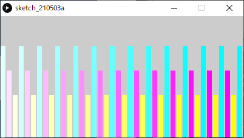
***
#### 振動
```java
int iAmplitudeL = 80;  // 振幅（大きな波の高さ）
int iAmplitudeS = 40;  // 振幅（小さな波の高さ）
 
size( 400,200 );
colorMode( HSB, 360, 1.0, 1.0, 1.0 );
 
// 大きな波形(cos).
strokeWeight( 8 );
for( int iX=0; iX < width; iX++ )
{
  int iAngle0 = iX*4;
  int iAngle1 = (iX+1)*4;
   
  stroke( iAngle0%360, 1.0, 1.0 );  // a%b:aをbで割った余り.
  line( iX, height/2 + iAmplitudeL*cos( radians(iAngle0) ),
        iX, height/2 + iAmplitudeL*cos( radians(iAngle1+1) ) );
}
 
// 小さな波形(sin).
strokeWeight( 8 );
for( int iX=0; iX < width; iX++ )
{
  int iAngle0 = iX*4;
  int iAngle1 = (iX+1)*4;
  
  stroke( iAngle0%360, 1.0, 1.0, 0.2 );
  line( iX, height/2 + iAmplitudeS*sin( radians(iAngle0) ),
        iX, height/2 + iAmplitudeS*sin( radians(iAngle1+1) ) );
}
```

***
#### 遷移
```java
size(400,200);
noStroke();
colorMode( HSB,width, 1.0, 1.0 );
 
for( int iX=0; iX<width; iX+=10 )
{
  fill( iX, 1, 1 );
  rect( iX, iX*height/width, 8, height );  // 矩形
}
```


***
#### 乱雑さ
```java
size(400,200);
noStroke();
colorMode( HSB, width, height, 1.0 );
 
for( int iX=0; iX<width; iX+=10 )
{
  float fY = 20 + random(height-20);  // Y座標値を表す変数．
  fill( iX, height-fY+20, 1 );
  rect( iX, fY, 8, height );  // 矩形
}
```


***
#### モアレ
```java
size(400,200);
background(0, 0, 0);
 
noStroke();
colorMode( HSB, width, height, 1.0 );
 
for( int iY=3; iY<height; iY+=12 )
{
  for( int iX=3; iX<width; iX+=12 )
  {
    fill( iX, height, 1 );
    circle( iX, iY, 6 );  // 円
  }
}
 
pushMatrix();  // 念のため移動する前の座標系を記憶.
 
translate( width/3, -height/2 );  // 座標系を平行移動
rotate( radians(45) );            // 座標系を45度回転
 
for( int iY=3; iY<height; iY+=12 )
{
  for( int iX=3; iX<width; iX+=12 )
  {
    fill( iX, height, 1 );
    circle( iX, iY, 6 );  // 円
  }
}
 
popMatrix();   // 座標系を戻す.
```


***

#### 回転対称

```java
int iDiamondTotal = 9;  // ひし形の数.
int iRotDeg = 40;       // 回転させる角度.
 
size(400,400);
colorMode( HSB, 3, 1, 1 );
 
translate( width/2, height/2 );  // 原点座標をスクリーン中心へ移動.
 
// ひし形の数だけ繰り返す.
for( int iDiamondIdx = 0; iDiamondIdx < iDiamondTotal; iDiamondIdx++ )
{
  fill( iDiamondIdx % 3, 1, 1 );  // 3種類の色相を交互に.
  
  quad( 0,     0,
        100, -15,
        200,   0,
        100,  15 );            // ひし形の描画.
  
  rotate( radians(iRotDeg) );  // 座標系の回転.
}
```


***
#### 並進対称
```java
int iColumnRepeat = 7; // 横に繰り返す回数.
 
size(400,400);
 
colorMode( HSB, 10, iColumnRepeat+2, 1 );
noStroke();
 
translate( -40, 0);  // スクリーンを充填するため，最初に少しずらす．
for( int iRowIdx = 0; iRowIdx < 10; iRowIdx++ )
{
  // 原点座標の位置(左端)を記憶.
  pushMatrix();
  
  // 横にiColumnRepeatセットの三角形ペアを描画.
  for( int iColumnIdx = 0; iColumnIdx < iColumnRepeat; iColumnIdx++ )
  {
    fill( iRowIdx, iColumnIdx+2, 1 );
    
    // 下向きの三角.
    triangle( 0, 0,
              80, 0,
              40, 40 );
    fill( iRowIdx+1, iColumnIdx+2, 1 );
    
    // 上向きの三角.
    triangle( 40, 40,
              80, 0,
              120, 40 );
    
    translate( 80, 0 );  // 右にずらす.
  }
  
  // 原点座標を左端に戻す.
  popMatrix();
  
  // 原点座標を一段下げる.
  translate( 0, 40 );
}
```

***
### その他，身近にある「繰り返し」を観察してみましょう


------


## 条件分岐

フローチャートの判断のパーツと同等の処理を行う．
ある条件に基づき，実行する命令を選択し，プログラムの流れを分岐させる．
これを用いることで，現在の状況に応じ，様々なふるまいが表現できる．


### if文

#### if

特定の条件を満たした場合，結果は真(True)となり，特定の（命令）文を実行する．
満たさなかった場合，結果は偽(False)となり，命令は実行されない．
for文と違い，繰り返しは起きない．
条件として，基本的には**条件式**を用いる．


##### 書式

```java
if( 条件式 ) //								[条件]
{
    // 条件を満たした場合実行する(命令)文;			[処理]
    // for文の時と同様，インデントする．
}
```

##### 例

if文はもちろんfor文の中に記述することができる．
その場合，さらにインデントを追加する必要がある．

```java
// スクリーンの一定範囲にだけランダムドットを打つ．
size(400,200);
 
for( int iPointIdx=0; iPointIdx < 3000; iPointIdx++ )
{
  float fX = random( width );  // Xのランダム値.
  float fY = random( height ); // Yのランダム値.
  if( fX + fY < 300 )  // もしX値とY値の合計が300以下なら.
  {
    point( fX,fY );
  }
}
```


### よく使われる技術
#### 剰余算
※演算と変数/算術式のセクションにも記載済み．
「割り算の余り」を求める記述

```java
a % b	// aをbで割ったときの余り
```

```java
// 偶数と奇数を判別する．

int iA = 234;
if( iA%2 == 0 )	// もし変数iAが偶数だったら．
{
    // 命令
}
```
#### 論理演算子
※制御文/条件式のセクションにも記載済み．
基本的には比較演算式による条件式を組み合わせ，より複雑な条件を課す場合に用いる．
以下の条件を満たしたとき，式の結果は真(true)となり，
そうでなければ偽(false)となる．

| 条件式               | 演算子 | 条件                                   |
| -------------------- | ------ | -------------------------------------- |
| `条件式A && 条件式B` | `&&`   | 条件式Aが真，なおかつ条件式Bが真( and) |
| `条件式A || 条件式B` | `||`   | 条件式Aが真，もしくは条件式Bが真(or)   |


### if else

if文に対し，条件を満たさなかった場合にも特定の処理を行わせる．

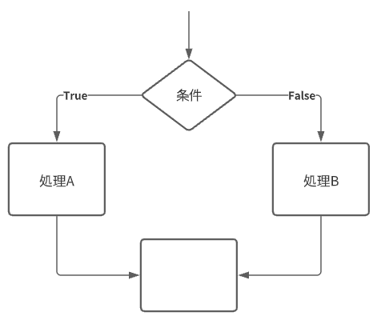

##### 書式

`else{}`の部分は必ず`if(){}`とセットで記述すること．

```java
if( 条件 ) //                              [条件]
{
    // 条件を満たした場合実行する(命令)文;       [処理A]
    // for文の時と同様，インデントする．
}
else
{
    // 条件を満たさなかった場合実行する(命令)文;  [処理B]
}
```

##### 例1: ランダムドット日の丸模様

```java
size(400,200);
background( 0, 0, 0 );
 
translate( width/2, height/2 );  // 原点をスクリーン中心に移動．
 
for( int iPointIdx=0; iPointIdx < 5000; iPointIdx++ )
{
  float fX = random( -width/2,  width/2 );  // Xのランダム値( -width/2～width/2).
  float fY = random( -height/2, height/2 ); // Yのランダム値( -height/2～height/2).
  
  // (X,Y)座標値が円の内部に有れば.
  // 円の公式 Xの二乗 + yの二乗 = 半径の二乗
  if( pow(fX,2) + pow(fY,2) < pow(height/2,2) )
  {
    stroke( 255,0, 0 );		// R
  }
  else	// 条件を満たさなかった場合．
  {
    stroke( 255,255, 255 );	// White
  }
  point( fX,fY );
}
```


##### 例2: 市松模様

```java
int iCellSize = 40;                  // セル(四角)のサイズ.
 
size(400,400);
colorMode(RGB,16,16,16);
 
int iColumnTotal = width/iCellSize;  // 列(横軸)の総数.
int iRowTotal = height/iCellSize;    // 行(横軸)の総数.
 
noStroke();
 
for( int iColumnIdx=0; iColumnIdx < iColumnTotal; iColumnIdx++ )  // 列の繰り返し
{
  for( int iRowIdx=0; iRowIdx < iRowTotal; iRowIdx++ )            // 行の繰り返し
  {
    int iX = iColumnIdx*iCellSize;                                // 矩形の座標iX,iY
    int iY = iRowIdx*iCellSize;
    
    if( iColumnIdx%2 == 0 && iRowIdx%2 == 0 ||                    // 列番号が偶数かつ行番号が偶数の時，もしくは，
        iColumnIdx%2 == 1 && iRowIdx%2 == 1 )                     // 列番号が奇数かつ行番号が奇数の時
    {
      fill(0, 8, 6);      // 緑模様.
    }
    else
    {
      fill(0, 0, 0 );     // 黒.
    }
    
    rect( iX, iY, iCellSize, iCellSize );
  }
}
```


##### 演習

1. 100個の円をランダムな位置に描画

```java
size(200,200);
　
for( int iEllipseIdx=0; iEllipseIdx < 100; iEllipseIdx++ )
{
  float fX = random(width);
  float fY = random(height);
    
  ellipse( fX, fY, 20, 20 );
}
```

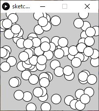

2. 条件分岐を追加．

	- もしXの値が100未満であれば色を赤に設定
	- そうでなければ色を青に設定．
	
	下の答えを見る前にまずやってみましょう．


```java
size(200,200);

for( int iEllipseIdx=0; iEllipseIdx < 100; iEllipseIdx++ )
{
  float fX = random(width);
  float fY = random(height);

  if( fX < 100 )	// もしfXの値が100未満なら
  {
    fill( 255, 0, 0);  // R
  }
  else				// そうでなければ
  {
    fill( 0, 0, 255);  // B
  }

  ellipse( fX, fY, 20, 20 );
}
```


### else if

最初の条件を満たさなかった場合にも，二つ目以降の条件を課し，それを満たした場合特定の処理を行わせる．
`else␣if`は**複数加えることができ，細かく条件を加えて分岐させることができる**．


##### 書式

```java
if( 条件式 )	//							  [条件A]
{
    // 条件Aを満たした場合実行する(命令)文;       [処理A]
    // for文の時と同様，インデントする．
}
else if( 条件式 )	//						  [条件B]
{
    // 条件Bを満たした場合実行する(命令)文;       [処理B]
    // for文の時と同様，インデントする．
}
```

### else if else

一見ややこしいが，`else if`の最後に`else{}`を加え，全ての条件を満たさなかった場合にも特定の処理を行わせる方式． 

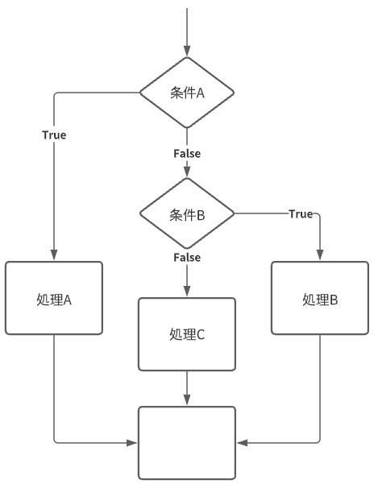

##### 書式

```java
if( 条件式 )	//							  [条件A]
{
    // 条件Aを満たした場合実行する(命令)文;       [処理A]
    // for文の時と同様，インデントする．
}
else if( 条件式 )	//						  [条件B]
{
    // 条件Bを満たした場合実行する(命令)文;       [処理B]
    // for文の時と同様，インデントする．
}
else
{
    // 条件を満たさなかった場合実行する(命令)文;   [処理C]
}
```

##### 例: ランダムドット4つの領域分け

```java
size(400,200);

for( int iPointIdx=0; iPointIdx < 8000; iPointIdx++ )
{
  float fX = random( width );  // Xのランダム値.
  float fY = random( height ); // Yのランダム値.

  if( fX < 100 )
  {
    stroke( 255,0, 0 ); 	//R
  }
  else if( fX < 200 )
  {
    stroke( 0,255, 0 );  	//G
  }
  else if( fX < 300 )
  {
    stroke( 0,0, 255 );  	//B
  }
  else
  {
    stroke( 255,255, 255 );	//White
  }

  point( fX,fY );
}
```


##### 演習

1. 100個の円をランダムな位置に描画 (※ウィンドウサイズ300*200)

```java
size(300,200);

for( int iEllipseIdx=0; iEllipseIdx < 100; iEllipseIdx++ )
{
  float fX = random(width);
  float fY = random(height);

  ellipse( fX, fY, 20, 20 );
}
```


2.  条件分岐を追加．
	- もしXの値が100未満であれば色を赤に設定
	- もしXの値が200未満であれば色を緑に設定
	- そうでなければ色を青に設定．
	
	  下の答えを見る前にまずやってみましょう．

```java
size(300,200);

for( int iEllipseIdx=0; iEllipseIdx < 100; iEllipseIdx++ )
{
  float fX = random(width);
  float fY = random(height);

  if( fX < 100 )  		// もしfXの値が100未満なら
  {
    fill( 255, 0, 0);   // R
  }
  else if( fX < 200 )	// もしfXの値が200未満なら
  {
    fill( 0, 255, 0);   // G
  }
  else        			// そうでなければ
  {
    fill( 0, 0, 255);   // B
  }

  ellipse( fX, fY, 20, 20 );
}
```


#### ifのネスティング

if文はfor文と同様に，入れ子に（ネスティング）することができる．
`else if` を単純に追加するだけでは難しい処理も，こちらで容易に行える場合がある．

##### 例: if else のネスティング


```java
if( 条件式 )	//							       [条件A]
{   
    // 条件Aを満たした場合,このブロックへ処理が移る．
    

    if( 条件式 )	//						 	   [条件B]
    {
        // 条件Bを満たした場合，実行する(命令)文;       [処理A]
        // 二段階インデントされる．
    }
    else
    {
        // 条件Bを満たさなかった場合，実行する(命令)文;  [処理B]
    }
}
else
{
    // 条件Aを満たさなかった場合,このブロックへ処理が移る．
    
    if( 条件式 )	//						 	   [条件C]
    {
        // 条件Cを満たした場合，実行する(命令)文;       [処理C]
    }
    else
    {
        // 条件Cを満たさなかった場合，実行する(命令)文;  [処理D]
    }
}
```

##### 例

```java
// ランダムドットを4つの領域で塗り分ける．(縦2×横2)
size(300,300);
 
for( int iPointIdx=0; iPointIdx < 8000; iPointIdx++ )
{
  float fX = random( width );  // Xのランダム値.
  float fY = random( height ); // Yのランダム値.
  
  if( fX < width/2 )
  {
    if( fY < height/2 )
    {
      stroke( 255,0, 0 );      //R
    }
    else
    {
      stroke( 0,255, 0 );      //G  
    }  
  }
  else
  {
    if( fY < height/2 )
    {
      stroke( 0,0, 255 );      //B
    }
    else
    {
      stroke( 255,255, 255 );  //White
    }
  }
  
  point( fX,fY );
}
```


##### 演習

1. 100個の円をランダムな位置に描画 (※if else の演習ステップ1と同じ )

```java
size(200,200);
　
for( int iEllipseIdx=0; iEllipseIdx < 100; iEllipseIdx++ )
{
  float fX = random(width);
  float fY = random(height);
    
  ellipse( fX, fY, 20, 20 );
}
```


2. 条件分岐を追加．
	- もしXの値が100未満で，
		- Yの値が100未満なら，色を赤に設定
		- そうでなければ，黒に設定
	- Xの値が100未満ではなく，
		- Yの値が100未満なら色を青に設定
		- そうでなければ白に設定
	
	  下の答えを見る前にまずやってみましょう．


```java
size(200,200);
 
for( int iEllipseIdx=0; iEllipseIdx < 100; iEllipseIdx++ )
{
  float fX = random(width);
  float fY = random(height);
  
  if( fX < 100 )  // もしfXの値が100未満なら
  {
    if( fY < 100 )
    {
      fill( 255, 0, 0);      // R
    }
    else
    {
      fill( 0, 0, 0 );       // Black
    }
  }
  else        // そうでなければ
  {
    if( fY < 100 )
    {
      fill( 0, 0, 255);      // B
    }
    else
    {
      fill( 255, 255, 255);  // White
    }
  }
  
  ellipse( fX, fY, 20, 20 );
}
```


### switch文

Switch文は分岐の判断に**条件式を用いない**．
ある式（変数も可）の返す値を読み取り，その値と等しいラベルの箇所の処理が行われる．
if文の`else if`とほぼ同様の役割を果たすが，こちらのほうがより適している場合もある．

比較的難解であるので，本授業では無理に使う必要はない．
活用できる者は活用してもよい．


#### 書式

ラベル(`case 値;`)は`else if`とほぼ同様の役割を果たし，複数記述可能．
`default:`は`else`とほぼ同様の役割を果たし，記述は任意．

```java
switch( 式 )	//													  [式]
{
  case 値A:	//								　　					 [ラベルA]
        
     // 式の値が値Aと等しい場合，実行する(命令)文;	  					   [処理A]
     // 二段階インデントされる．
     
     break;	// break; が有れば，即Switch文の処理を終了し，ブロックの外へ処理を移す．
     // ※break; が無ければ，続けて下のラベルB内の処理へと進む．
  case 値B:	//								  					  [ラベルB]
     // 式の値が値Bと等しい場合，実行する(命令)文;	    				   [処理B]
        
     break; // break;の記述は任意.
  default:
        
     // 式の値が全てのラベルの値と等しくなかった場合，実行する(命令)文;	    [処理C]
}
```

#### 例

```java
// 4色が交互に出現するストライプの描画．
int iLineWeight = 8;  // 一本の縦線の太さ.
 
size(400,200);
 
strokeWeight( iLineWeight );
 
for( int iLineIdx=0; iLineIdx < 50; iLineIdx++ )  // 50本の線を繰り返し描画.
{
  int iModLineIdx4 = iLineIdx%4;                  // iLineIdxを4で割った余り(剰余)(0~3)
  
  switch( iModLineIdx4 )
  {
    case 0:
        stroke( 255, 0, 0 );      // R
        break;
    case 1:
        stroke( 0, 255, 0 );      // G
        break;
    case 2:
        stroke( 0, 0, 255 );      // b
        break;
    case 3:
        stroke( 255, 255, 255 );  // White
        break;
    default:
  }
  line( iLineIdx*iLineWeight, 0, iLineIdx*iLineWeight, height );
}
```

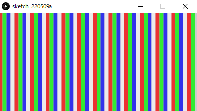

#### 

# 配列

## 配列( array )とは

- **同一の型**のデータ（変数）をメモリ上に並べたもの．
- 違う型のデータは混在できない．


- 並んでいる各データ（変数）を**要素（element）**という．
- 各要素は，**要素番号（index）**という番号で参照できる．
- 配列には，その配列全体を指すための名前（**配列名**）がついている。
- 配列のもつ要素の総数を**要素数**という．
  - 配列の最後の要素番号は`要素数-1`であることに注意．


### 宣言

変数と同じく，配列も宣言文によって配列の宣言を行う必要がある．
書式が変数の場合とかなり異なる点に注意．

```java
要素のデータ型[] 配列名 = new 要素のデータ型[要素数];              // 宣言のみ
```

##### 例

```java
int[] iA = new int[10];		// int型（整数型）の要素を10個持つ，名前がiAの配列の宣言

float[] fB = new float[4];	// float型（実数型）の要素を4個持つ，名前がfBの配列の宣言
```

### 宣言＋初期化

宣言と同時に初期化することもできる．
調整用のパラメータなど，値を手入力する場合などに有効．

```java
int[] iParams = { 0, 106, 24, 16, 8, 112 };	// int型（整数型）の名前がiParamsの配列の宣言・初期化
```

### 初期化

基本的に**全ての要素にアクセスし，一つ一つ値を代入**する必要がある．

#### 一つの要素への値の代入

```java
配列名[ 要素番号 ] = 値;	// 要素番号のアドレスの要素に値を代入する．
```

##### 例

```java
int[] iA = new int[4]; // 配列iAを宣言
iA[0] = 0;	// 要素番号0に値0を代入．
iA[1] = 0;	// 要素番号1に値0を代入．
iA[2] = 0;	// 要素番号2に値0を代入．
iA[3] = 0;	// 要素番号3に値0を代入．
```

#### for文を使った初期化

特に要素数が多い場合，for文を使って初期化すると楽．
その際，繰り返し回数として，**要素数を取得**し設定するとより確実．
（配列外の要素を間違って参照しようとしてしまうエラーの回避）

##### 要素数の取得

```java
配列名.length
```

##### for文を使った基本的な初期化

```java
for( int iIdx=0; iIdx < 変数名.length; iIdx++ )
{
	配列名[ iIdx ] = 値;
}
```

##### 例

```java
int[] iA = new int[10];						// 配列iAを宣言
for( int iIdx=0; iIdx < iA.length; iIdx++ )	// 初期化(全ての要素に0を代入)
{
	iA[ iIdx ] = 0;
}
```

### 要素の参照

配列名と要素番号を組み合わせることで，配列の一つの要素を**変数と同じように使用できる**．
変数と同様に式に組み込むこともできる．

```java
配列名[ 要素番号 ]			 // 一つの要素の参照.
```

初期化の項で述べたように，ある配列の要素へは以下の書式で値を代入でき，これは初期化後もいつでも行える．

##### 一つの要素への値の代入

```java
配列名[ 要素番号 ] = 値;	// 要素番号のアドレスの要素に値を代入する．
```

### 例1

```java
// 矩形の高さリスト（配列）から，矩形を描画する．
 
int iRectWidth = 12;  // 矩形の幅.
 
size( 200, 200 );
 
int[] iRectHeight = new int[16];                           // 配列iRectHeightを宣言(矩形の高さのリスト)
for( int iIdx=0; iIdx < iRectHeight.length; iIdx++ )       // 初期化
{
  iRectHeight[ iIdx ] = 10 + iIdx*10;                      // 10,20,30....と代入.
}
 
colorMode( HSB, 3, iRectHeight.length, 1 );				   // 彩度のMaxを配列の要素数に
 
// 矩形リストを昇順に描画.
for( int iIdx=0; iIdx < iRectHeight.length; iIdx++ )       // 要素番号順に繰り返し(0~max)
{
  fill( 0, iIdx, 1 );  // R,彩度=要素番号
  rect( 0, height-iRectHeight[iIdx], iRectWidth, iRectHeight[iIdx] );
  translate( iRectWidth, 0 );
}
```

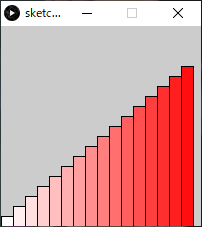

### 例2

```java
// 矩形の高さリスト（配列）から，矩形を描画する．(3パターン)
 
int iRectWidth = 8;  // 矩形の幅.
 
size( 208, 100 );
 
int[] iRectHeight = new int[8];                            // 配列iRectHeightを宣言(矩形の高さのリスト)
for( int iIdx=0; iIdx < iRectHeight.length; iIdx++ )       // 初期化
{
  iRectHeight[ iIdx ] = 10 + iIdx*10;                      // 10,20,30....と代入.
}
　
colorMode( HSB, 3, iRectHeight.length, 1 );				   // 彩度のMaxを配列の要素数に
　
// 矩形リストを昇順に描画.
for( int iIdx=0; iIdx < iRectHeight.length; iIdx++ )       // 要素番号順に繰り返し(0~max)
{
  fill( 0, iIdx, 1 );  // R,彩度=要素番号
  rect( 0, height-iRectHeight[iIdx], iRectWidth, iRectHeight[iIdx] );
  translate( iRectWidth, 0 );
}
 
translate( iRectWidth, 1 );
 
// 矩形リストを降順に描画.
for( int iIdx=0; iIdx < iRectHeight.length; iIdx++ )
{
  int iReverseIdx = iRectHeight.length - iIdx - 1;         // 要素番号を逆転(max~0)
  
  fill( 1, iIdx, 1 );  // G,彩度=要素番号
  rect( 0, height-iRectHeight[iReverseIdx], iRectWidth, iRectHeight[iReverseIdx] );
  translate( iRectWidth, 0 );
}
 
translate( iRectWidth, 1 );
 
// 矩形リストをランダム順に描画.
for( int iIdx=0; iIdx < iRectHeight.length; iIdx++ )
{
  int iRandIdx = floor( random( iRectHeight.length ) );   // 要素番号をランダムに, floor():小数点切り捨て
  
  fill( 2, iIdx, 1 );  // B,彩度=要素番号
  rect( 0, height-iRectHeight[iRandIdx], iRectWidth, iRectHeight[iRandIdx] );
  translate( iRectWidth, 0 );
}
```

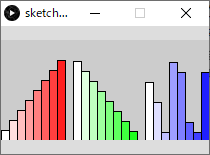

### 演習

1. 　角度を5°ずつ足しながら，スクリーン中心からランダムな長さの線を12本描画

```java
size(300,300);
 
translate( width/2, height/2 );        // 原点をスクリーン中心に移動
 
for( int iLineIdx = 0; iLineIdx<12; iLineIdx++ )  // 線12本分繰り返す
{
  line( 0, 0, 20 + random( 100 ), 0 );            // 長さランダム20~120
  
  rotate( radians(5) );                           // 5°回転
}
```


2. 　12本の線の長さを`float`で保存する配列を用意する（宣言だけ）．
    下の答えを見る前にやってみましょう．

```java
size(300,300);
 
float[] fLineLength = new float[12];   // 12本の線の長さを保存する配列
 
translate( width/2, height/2 );        // 原点をスクリーン中心に移動

for( int iLineIdx = 0; iLineIdx<12; iLineIdx++ )  // 線12本分繰り返す
{
  line( 0, 0, 20 + random( 100 ), 0 );            // 長さランダム20~120
  
  rotate( radians(5) );                           // 5°回転
}
```

3. 　配列に線の長さの値を代入し，初期化しましょう．
      	線の長さ: ` 20 + random( 100 ) `

   下の答えを見る前にやってみましょう．

```java
size(300,300);
 
float[] fLineLength = new float[12];                               // 12本の線の長さを保存する配列
for( int iLineIdx = 0; iLineIdx<fLineLength.length; iLineIdx++ )   // 配列の初期化.
{
  fLineLength[iLineIdx] = 20 + random( 100 );
}
 
translate( width/2, height/2 );        // 原点をスクリーン中心に移動
 
for( int iLineIdx = 0; iLineIdx<12; iLineIdx++ )  // 線12本分繰り返す
{
  line( 0, 0, 20 + random( 100 ), 0 );            // 長さランダム20~120
  rotate( radians(5) );                           // 5°回転
}
```

4. 　線の描画命令`line()`を，配列の要素を参照するよう変更し，
   12本繰り返すfor文全体を，さらに6回繰り返すよう変更しましょう（for文のネスティング）．

   正しく完成すると下の図のようになる．
   

   下のプログラムの答えを見る前にやってみましょう．

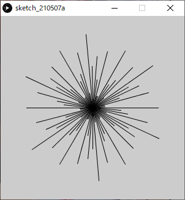

```java
size(300,300);
 
float[] fLineLength = new float[12];                               // 12本の線の長さを保存する配列
for( int iLineIdx = 0; iLineIdx<fLineLength.length; iLineIdx++ )   // 配列の初期化.
{
  fLineLength[iLineIdx] = 20 + random( 100 );
}
 
translate( width/2, height/2 );                // 原点をスクリーン中心に移動
 
for( int iRepIdx = 0; iRepIdx<6; iRepIdx++ )   // ６回繰り返す．
{
  for( int iLineIdx = 0; iLineIdx<fLineLength.length; iLineIdx++ )  // 線12本分繰り返す
  {    
    line( 0, 0, fLineLength[iLineIdx], 0 );		   // 配列を参照.
    rotate( radians(5) );                          // 5°回転
  }
}
```


## ２次元配列

これまで説明したのは１次元の配列．
２次元の配列は特に画像を扱うのに適している．
実際のメモリ上での配置は以下の図の通り．


しかし，人にとっては表のイメージで考えた方が分かりやすい場合がある．


### 宣言

```java
要素のデータ型[][] 配列名 = new 要素のデータ型[行数][列数];              // 宣言のみ
```

#### 例

```java
int[][] iA = new int[3][4];				// 行数3,列数4の２次元配列iAの宣言

float[][] fColor = new float[300][200];	// 行数300,列数200の２次元配列iColorの宣言
```

### 初期化+宣言

１次元配列と同様に，２次元配列も初期化と宣言を同時に行うことができる.
少しややこしいが，`{}`内に列の値を列挙し，さらにそれを`{}`で入れ子にし，
行ごとに改行しながら行数文増やしていけば理解しやすい．

```java
// 行数3,列数4の場合
要素のデータ型[][] 配列名 = { { 列0値, 列1値，列2値，列3値 },	  // 行0
               			  { 列0値, 列1値，列2値，列3値 },		// 行1
               			  { 列0値, 列1値，列2値，列3値 } };	// 行2
```

#### 例

```java
int[][] iA = { { 0,   1， 2， 3 },
               { 10, 11，12，13 },
               { 20, 21，22，23 } };

float[][] fColor = { { 1.0, 0.5, 0.0 },
                   	 { 1.0, 0.6, 0.1 },
                     { 0.9, 0.6, 0.3 },
                     { 0.8, 0.5, 0.5} };
```

### 初期化

１次元配列と同様に，２次元配列も初期化に際し，基本的にはfor文を使うのが楽．
ただし，２次元配列を初期化するには，for文のネスティングを行う必要がある．

繰り返し回数として，**要素数を取得**し設定するとより確実だが，
行数と列数それぞれの要素数を取得する方法が多少紛らわしい点に注意．

#### 要素数の取得

```java
配列名.length		  // 行の要素数の取得.
配列名[行番号].length	// 列の要素数の取得(取得する列の行番号を指定する必要がある).
```

#### for文を使った基本的な初期化

```java
要素のデータ型[][] 配列名 = new 要素のデータ型[行数][列数];

for( int iRowIdx=0; iRowIdx < 配列名.length; iRowIdx++ )	//行数分繰り返す.
{
  for( int iColumnIdx=0; iColumnIdx < 配列名[iRowIdx].length; iColumnIdx++ )	//列数分繰り返す.
  {
    配列名[iRowIdx][iColumnIdx] = 0;
  }
}
```

##### 例

```java
int[][] iA = new int[3][4];
 
for( int iRowIdx=0; iRowIdx < iA.length; iRowIdx++ )
{
  for( int iColumnIdx=0; iColumnIdx < iA[iRowIdx].length; iColumnIdx++ )
  {
    iA[iRowIdx][iColumnIdx] = 0;
  }
}
```

### 例: 回転対称ランダム多角形

```java
/*
fVertexPos配列のイメージ.
多角形の頂点座標を格納する．
|　 | 列0 | 列1 |
|行0| x値 | y値 |
|行1| x値 | y値 |
|行2| x値 | y値 |
|行3| x値 | y値 |
*/
// 実行する度にランダムな図形が描画される.
 
int iRepeatTotal = 12;  // 多角形繰り返しの数.
 
size( 300, 300 );
 
float[][] fVertexPos = new float[4][2];                                // 配列[頂点][座標値x,y]
for( int iVertexIdx=0; iVertexIdx < fVertexPos.length; iVertexIdx++ )  // 配列初期化
{
  fVertexPos[iVertexIdx][0] = random( width/3 );	// スクリーンサイズの三分の一までの値からランダム.
  fVertexPos[iVertexIdx][1] = random( height/3 );
}
 
colorMode( HSB, iRepeatTotal, 1, 1 );                                 // 色相の最大値を多角形繰り返しの数に設定
 
translate( width/2, height/2 );                                       // 原点をスクリーン中心に移動
 
for( int iRepIdx=0; iRepIdx < iRepeatTotal; iRepIdx++ )               // 回転しながら多角形の繰り返し
{
  fill( iRepIdx, 1, 1 );  // 回転毎に色相を変える.
  
  beginShape();                                                         // 多角形スタート
  vertex( 0, 0 );                                                       // 頂点0
  for( int iVertexIdx=0; iVertexIdx < fVertexPos.length; iVertexIdx++ )  // 頂点の数分繰り返し
  {
    vertex( fVertexPos[iVertexIdx][0], fVertexPos[iVertexIdx][1] );      // 頂点
  }
  endShape(CLOSE);                                                     // 多角形閉じる.
  rotate( radians(360/iRepeatTotal) );                                 // 座標系回転 
}
```


### 演習: ルール９０セル・オートマトン

セル・オートマトンとは，格子状に配置されたセルがそれぞれ状態を持ち，隣接している周囲のセルの状態をもとに，時間とともに状態を遷移させていくモデルです．
一定のルールを与えることで，規則が単純でも，豊かな結果を得ることができます．

#### 初期状態


#### 隣接するセルの合計が次の(行の)値になる

このルールをさらに次の行へと進めていく．


#### 奇数のセルを描画する

プログラム中では奇数を1，偶数を0として配列に格納している．

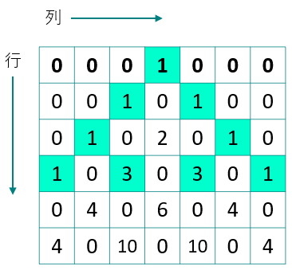

#### 制作手順

今回制作するプログラムでは，セル=ピクセルと考える．

1. 二次元配列の宣言，初期化
   格子状のセルを表す配列を用意しましょう．

```java
size(500,500);
 
int[][] cell=new int[width][height];       // スクリーンサイズ分の配列.
 
for(int iY=0; iY<cell.length; iY++)  	   // 列の繰り返し
{
  for(int iX=0; iX<cell[iY].length; iX++)  // 行の繰り返し  
  {
    cell[iX][iY]=0;
  }
}
```

2. 初期状態の入力

   - 最初の行の中心のセルを1，それ以外は0
   - 初期状態の唯一のセルを描画

   ※ステップ1のプログラムの後に追加

```java
cell[width/2][0]= 1;  // 初期状態：最初の行の中心のセルを1，それ以外は0
point( width/2, 0 );  // 描画.
```

3. 一行ずつセルの内容を更新して描画
   ※ステップ2のプログラムの後に追加

```java
for(int iY=1; iY<height; iY++)  // ２行目から繰り返し開始．
{
  for(int iX=0; iX<width; iX++)	// 列0から繰り返し．
  {
    // 隣接するセルの合計が偶数なら0,奇数なら1をセルの値に代入.
    cell[iX][iY] = ( cell[iX-1][iY-1] + cell[iX+1][iY-1] )%2;
    
    if( cell[iX][iY] == 1 )    // もしもセルの値が1なら.
    {
      point( iX, iY );
    }
  }
}
```

4. スクリーン両端の処理
   ステップ3のままだと`iX-1`の値がマイナスになったり，`iX+1`の値が配列の要素番号の最大を超えてしまう．
   ※ステップ3のプログラムを書き換える．

```java
for(int iY=1; iY<height; iY++)  // ２行目から繰り返し開始．
{
  for(int iX=0; iX<width; iX++)	// 列0から繰り返し．
  {
    if( iX == 0 )             // スクリーン左端の処理.
    {
      cell[iX][iY] = ( 0 + cell[iX+1][iY-1] )%2;
    }
    else if( iX == width-1 )  // スクリーン右端の処理.
    {
      cell[iX][iY] = ( cell[iX-1][iY-1] + 0 )%2;
    }
    else
    {
      // 隣接するセルの合計が偶数なら0,奇数なら1をセルの値に代入.
      cell[iX][iY] = ( cell[iX-1][iY-1] + cell[iX+1][iY-1] )%2;
    }
    
    if( cell[iX][iY] == 1 )    // もしもセルの値が1なら.
    {
      point( iX, iY );
    }
  }
}
```

#### 完成したプログラム


```java
// シェルピンスキーのギャスケット.
// 初期状態：最初の行の中心のセルを1，それ以外は0
size(500, 500);
 
int[][] cell=new int[width][height];       // スクリーンサイズ分の配列.
 
for(int iY=0; iY<cell.length; iY++)  // 列の繰り返し
{
  for(int iX=0; iX<cell[iY].length; iX++)        // 行の繰り返し  
  {
    cell[iX][iY]=0;
  }
}
 
cell[width/2][0]= 1;  // 初期状態：最初の行の中心のセルを1，それ以外は0
point( width/2, 0 );  // 初期状態の唯一のセルを描画.
 
for(int iY=1; iY<height; iY++)  // ２行目から繰り返し開始．
{
  for(int iX=0; iX<width; iX++)	// 列0から繰り返し．
  {
    if( iX == 0 )             // スクリーン左端の処理.
    {
      cell[iX][iY] = ( 0 + cell[iX+1][iY-1] )%2;
    }
    else if( iX == width-1 )  // スクリーン右端の処理.
    {
      cell[iX][iY] = ( cell[iX-1][iY-1] + 0 )%2;
    }
    else
    {
      // 隣接するセルの合計が偶数なら0,奇数なら1をセルの値に代入.
      cell[iX][iY] = ( cell[iX-1][iY-1] + cell[iX+1][iY-1] )%2;
    }
    
    if( cell[iX][iY] == 1 )    // もしもセルの値が1なら.
    {
      point( iX, iY );
    }
  }
}
```


#### 初期状態（一行目のセルの状態）を変える

```java
// シェルピンスキーのギャスケット.
// 初期状態：最初の行のセルの値を全てランダム
size(500, 500);
 
int[][] cell=new int[width][height];       // スクリーンサイズ分の配列.
 
for(int iY=0; iY<cell.length; iY++)  // 列の繰り返し
{
  for(int iX=0; iX<cell[iY].length; iX++)        // 行の繰り返し  
  {
    cell[iX][iY]=0;
  }
}
 
// 初期状態：最初の行のセルの値を全てランダム
for(int iX=0; iX<width; iX++)
{
  cell[iX][0]= floor( random( 100 ) )%2;
  if( cell[iX][0] == 1 )    // もしもセルの値が1なら，1行目を描画.
  {
    point( iX, 0 );
  }
}
 
for(int iY=1; iY<height; iY++)  // ２行目から繰り返し開始．
{
  for(int iX=0; iX<width; iX++)
  {
    if( iX == 0 )             // スクリーン左端の処理.
    {
      cell[iX][iY] = ( 0 + cell[iX+1][iY-1] )%2;
    }
    else if( iX == width-1 )  // スクリーン右端の処理.
    {
      cell[iX][iY] = ( cell[iX-1][iY-1] + 0 )%2;
    }
    else
    {
      // 隣接するセルの合計が偶数なら0,奇数なら1をセルの値に代入.
      cell[iX][iY] = ( cell[iX-1][iY-1] + cell[iX+1][iY-1] )%2;
    }
    
    if( cell[iX][iY] == 1 )    // もしもセルの値が1なら.
    {
      point( iX, iY );
    }
  }
}
```


## 多次元配列

配列の次元数は二次元以上にも増やすことができる．
しかし，次元が増えるほど人にとっては直感的に理解しにくくなる．
よって，せいぜい２次元配列までに留めることを推奨．

```java
int [][][] iRGBColor = new int[3][640][480];		// RGBそれぞれのバッファ.
```

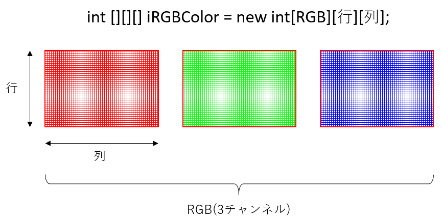

#### 例

```java
int iColorMax = 100;
size(400,400);
 
int[][][] iColor = new int[3][width][height];
 
// 初期化
for(int iRGB = 0; iRGB < iColor.length; iRGB++ )
{
  for(int iX = 0; iX < width; iX++ )
  {
    for(int iY = 0; iY < height; iY++ )
    {
      iColor[iRGB][iX][iY] = 0;
    }
  }
}
 
// 色決定
for(int iX = 0; iX < width; iX++ )
{
  for(int iY = 0; iY < height; iY++ )
  {
    if( iX < width / 3 )
    {
      iColor[0][iX][iY] = iColorMax; //R
    }
    
    if( iY < height / 3 )
    {
      iColor[1][iX][iY] = iColorMax; //G
    }
    
    if( iX + iY > height )
    {
      iColor[2][iX][iY] = iColorMax; //B 右下の三角形
    }
  }
}
 
// 全チャンネルを参照し，画素RGB描画
colorMode(RGB,iColorMax);
for(int iX = 0; iX < width; iX++ )
{
  for(int iY = 0; iY < height; iY++ )
  {
    stroke(iColor[0][iX][iY],
           iColor[1][iX][iY],
           iColor[2][iX][iY]);
    point(iX,iY);
  }
}
```


# 関数の基本

## 関数( function )とは

- 関数とは，データを処理し何らかの値を返すモジュールのこと．
  - **命令のまとまり**，と考えて差し支えない．


- 既に授業で使用している命令も関数の一種

```java
size(), colorMode(), point(), rect(), ellipse(), random(), sin(), cos(), tan()...
```

- 逆に，関数ではないもの

```java
for, if, else, else if, switch ...		// 主に制御文関連のもの
```

## 関数の使用

### 関数の呼び出し( call )

関数を使う際，

1. 関数にデータ（値）を渡す．
   この，渡すデータを**引数**という．
2. 関数内で，渡したデータを元に処理が行われる．
3. 処理の結果，値が返ってくる．
   この，返ってくる値を**戻り値**・**返り値**という．
   返ってこない関数もある（**void関数**）．

### 関数の呼び出し方

#### 値が返ってこない関数（void関数）

- `ellipse, colorMode, size`など
- 関数呼び出しだけで（命令）文となる．

***

##### 関数の挙動

引数の値を元に，関数の中で必要な処理は全て実行される．


***

#### 値が返ってくる関数

- `random, sin, cos, tan` など
- 関数を呼び出しを
  - 変数に代入する
  - 式に組み込む

***

##### 関数の挙動（変数に代入する）

返り値を変数に代入する場合は，受け取る変数を用意する．


***

##### 関数の挙動（式に組み込む）

関数を式に組み込んだ場合は，関数を呼び出した場所に返り値が代入され，値が式に組み込まれる．


***

#### 引数が無い関数

```java
noStroke();		// 引数が必要ない場合も () は必須．
```


### 関数の中身

Processingで用意されている関数は，中身を直接見ることはできない．

```java
返り値の型 関数名( 引数 )
{
   //（命令）文
   return 返り値;
}

// 関数の実体（返り値なし）
void 関数名( 引数 )
{
   //（命令）文
}
```


# アニメーション

## アニメーションの基礎知識

### 動画のフレームとは

- 動画を構成する一枚一枚の静止画（コマ）のこと
- 人間の目で動いているように見せるため，ごく短い時間間隔で切り替わっている．

### フレームレートとは

- 動画の滑らかさの指標．
- **fps** ( frames per second )
  - **1秒間に書き換えるフレームの数**，フレーム毎秒
  - Processing でもこれを指定することでフレームレートを指定できる．


## StaticモードとActiveモード

### Staticモード

- これまでの静止画を描画するモード

- プログラムが上から書いた順番に実行され，終了する．

### Activeモード

- アニメーションを行う場合，**Activeモードでプログラムを記述する必要**がある．
- プログラムのブロックが分かれる
  - 開始時に１度だけ行う初期設定命令
  - 毎フレーム行う描画命令
- プログラムは終了命令が下されるまで終了しない．
- 静止画の描画も行えるので，ほぼStaticモードの上位互換


## アニメーションの始め方(Activeモード)

### 1.　プログラム全体を`setup()`関数と`draw()`関数で構成する．

```java
void setup()
{
  // プログラムの開始時に１度だけ実行される（命令）文.
}
void draw()
{
  // 毎フレーム繰り返し実行される（命令）文.
}
```

### 2.　`setup()`内で最初の設定を行う．

プログラム実行時に，最初に１度だけ実行する（命令）文を記述する．

#### よく使われる命令

- 画面のサイズ`size()`
- 背景色`background()`
- カラーモード`colorMode()`
- フレームレート`frameRate()`

#### 例

```java
void setup()
{
  size( 128, 128 );
  frameRate( 8 );
  colorMode( HSB, 360, 1, 1 );
  background( 0, 0, 0 );
}
```

### 3. 　`draw()`内でフレーム毎の描画を行う．

`frameRate()`で指定した頻度で`draw()`の命令が繰り返し実行される．
例えば，`frameRate( 30 );// フレームレート30fps`なら，１秒間に30回実行される．

#### よく使われる命令

- 図形描画`point(), line(), rect(), ellipse()`など
- 繰り返しfor文
- 条件分岐if文
- 変数への代入，算術式など

#### 例

```java
void draw()
{
  for(int iIdx=0; iIdx<100; iIdx++)
  {
    fill( 170 + random(80), 100 + random(50), 200 );
    circle( random(width), random(height), 10 );
  }
  
  for(int iIdx=0; iIdx<100; iIdx++)
  {
    fill( 170 + random(80), 100 + random(50), 200 );
    rect( random(width), random(height), 10, 10 );
  }
}
```

### プログラム全体

```java
void setup()
{
  size( 128, 128 );
  frameRate( 8 );
  colorMode( HSB, 360, 1, 1 );
  background( 0, 0, 0 );
}
void draw()
{
  for(int iIdx=0; iIdx<10; iIdx++)
  {
    fill( 170 + random(80), 100 + random(50), 200 );
    circle( random(width), random(height), 10 );
  }
  
  for(int iIdx=0; iIdx<10; iIdx++)
  {
    fill( 170 + random(80), 100 + random(50), 200 );
    rect( random(width), random(height), 10, 10 );
  }
}
```


#### 静止画のみしか書かない場合

setup()関数内のみに描画命令を書く
この場合も，`draw()`の記述自体は必要

```java
void setup()
{
  size( 128, 128 );
  frameRate( 8 );
  colorMode( HSB, 360, 1, 1 );
  background( 0, 0, 0 );
  
  for(int iIdx=0; iIdx<10; iIdx++)
  {
    fill( 170 + random(80), 100 + random(50), 200 );
    circle( random(width), random(height), 10 );
  }
  
  for(int iIdx=0; iIdx<10; iIdx++)
  {
    fill( 170 + random(80), 100 + random(50), 200 );
    rect( random(width), random(height), 10, 10 );
  }
}
void draw()
{
}
```


### Activeモードまとめ

- 1回だけしか実行されない命令類
  → `setup()`関数内に書く
- アニメーションのように，何度も実行される命令
  →`draw()`関数内に書く
- 静止画の描画
  →`setup()`関数内のみに描画命令を書く


### 演習

#### ランダムな点描アニメーション


#### 1. 空の`setup()`と`draw()`を用意

できれば下の答えを見る前にやってみましょう．

```java
void setup()
{
    
}
void draw()
{
    
}
```

#### 2. `setup()`に以下の処理を追加

- スクリーンサイズ: 200×200
- カラーモード: `RGB, 1, 1, 1`
- 背景色: 黒 `0, 0, 0`

できれば下の答えを見る前にやってみましょう．

```java
void setup()
{
  size(200, 200);
  colorMode( RGB, 1, 1, 1 );
  background( 0, 0, 0 );
}
void draw()
{
    
}
```

#### 3. `draw()`に以下の処理を追加

- 線の太さ: 最大4のランダム
- 線の色: RGB全て最大1のランダム
- 点の描画: XY座標値はスクリーン上でランダム

できれば下の答えを見る前にやってみましょう．

```java
void setup()
{
  size(200, 200);
  colorMode( RGB, 1, 1, 1 );
  background( 0, 0, 0 );
}
void draw()
{
  strokeWeight( random(4) );
  stroke( random(1), random(1), random(1) );
  point( random(width), random(height) );
}
```


## アニメーションの基本

### フレームレートの設定

`setup()`のなかで，１秒間に描画を行う(`draw()`が実行される)回数を指定できる．
特に指定をしない場合，デフォルトは60fps．

```java
frameRate( fps );
```

##### 例

```java
frameRate( 30 );	// フレームレート30fps
```

### 画面のリフレッシュ

`draw()`は，基本的に前フレームの描画結果の上に新しい描画を重ねて行う．
フレームごとに，画面をリフレッシュしたい場合は，**backgroundと同じ色の四角を画面全体に貼付ける**事で行う．

##### 例

```java
void setup()
{
  size( 128, 128 );
  frameRate( 1 );
  colorMode( HSB, 360, 1, 1 );
  background( 0, 0, 0 );
}
void draw()
{
  // 画面のリフレッシュ.
  fill( 0, 0, 0 );
  rect( 0, 0, width, height );
  
  fill( 170 + random(80), 100 + random(50), 200 );
  rect( random(width), random(height), 20, 20 );
}
```


### グローバル変数の使用

#### ローカル変数

※詳しくは，演算と変数/変数/ローカル変数とグローバル変数のセクションを参照

#### グローバル変数

- 全ての範囲で有効


- `draw()`が実行される度にメモリ領域が初期化されることがなく，`draw()`の度に少しずつ数値を変更する等が可能．
- **アニメーションにおいて，変化をもたらすために特に重要**．

##### ブロック

`{ }`で囲まれた部分を**ブロック**という．
繰り返しfor文，条件分岐if文，関数で使用されている．

```java
for(/** 省略 */)
{
    // ブロック
}
```

```java
if(/** 省略 */)
{
    // ブロック
}
```

```java
void setup()
{
    // ブロック
}
void draw()
{
    // ブロック
}
```

##### 使い方

- **ブロック外で宣言すればグローバル変数**となる．
- プログラムのどこからでも変数を使うことができる．
- 通常，**プログラムの一番上に記述**する．

```java
int iX;			 // グローバル変数の宣言

void setup()
{
	iX = 0;		 // OK
}
void draw()
{
	iX = iX + 5; // OK
}
```

### 演習

#### 矩形の移動アニメーション


#### 1. 空の`setup()`と`draw()`を用意

できれば下の答えを見る前にやってみましょう．

```java
void setup()
{
    
}
void draw()
{
    
}
```

#### 2. `setup()`に以下の処理を追加

- スクリーンサイズ: 200×200
- カラーモード: `RGB, 1, 1, 1`
- 線(stroke)の表示をオフ
- フレームレート: 8 (fps)

できれば下の答えを見る前にやってみましょう．

```java
void setup()
{
  size( 200, 200 );
  colorMode( RGB, 1, 1, 1 );
  noStroke();
  frameRate( 8 );
}
void draw()
{
    
}
```
#### 3. グローバル変数の追加

- 横移動用グローバル変数を一つ宣言し，`setup()`で初期化しましょう．
  - 変数名: iPosX
  - 型: int
  - 初期値: 0

できれば下の答えを見る前にやってみましょう．

```java
int iPosX;             // グローバル変数iPosXの宣言
　
void setup()
{
  size( 200, 200 );
  colorMode( RGB, 1, 1, 1 );
  noStroke();
  frameRate( 8 );
    
  iPosX = 0;      // iPosXの初期化
}
void draw()
{
    
}
```

#### 4. `draw()`で矩形を描画

- `draw()`で矩形を描画しましょう．
  - X座標: iPosX
  - Y座標: ( スクリーンの高さの半分 - 10 )
  - 大きさ: 20, 20
  - 塗り色: 白( 1, 1, 1 )


できれば下の答えを見る前にやってみましょう．

```java
int iPosX;
 
void setup()
{
  size( 200, 200 );
  colorMode( RGB, 1, 1, 1 );
  noStroke();
  frameRate( 8 );
  
  iPosX = 0;
}
void draw()
{
  fill( 1, 1, 1 );						// White
  rect( iPosX, height/2-10, 20, 20 );	// 矩形描画
}
```

#### 5. 矩形を動かす

- `draw()`の中に，`iPosX`に4を足す（加算）処理を追加しましょう．

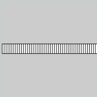

できれば下の答えを見る前にやってみましょう．

```java
int iPosX;
 
void setup()
{
  size( 200, 200 );
  colorMode( RGB, 1, 1, 1 );
  noStroke();
  frameRate( 8 );
  
  iPosX = 0;
}
void draw()
{
  iPosX += 4;	// フレーム毎に4を足す
  
  fill( 1, 1, 1 );
  rect( iPosX, height/2-10, 20, 20 );
}
```

#### 6. スクリーンのリフレッシュ処理の追加

前フレームの矩形描画が残ってしまっている．
`draw()`で，**新しい矩形を描画する前に**スクリーンをリフレッシュしましょう．

- 矩形を描画する
  - X座標: 0
  - Y座標: 0
  - 幅・高さ: スクリーンと同じ
  - 塗り色: 黒(  0, 0, 0  )


できれば下の答えを見る前にやってみましょう．

```java
int iPosX;
 
void setup()
{
  size( 200, 200 );
  colorMode( RGB, 1, 1, 1 );
  noStroke();
  frameRate( 8 );
  
  iPosX = 0;
}
void draw()
{
  fill( 0, 0, 0 );              // 白
  rect( 0, 0, width, height );  // スクリーンのリフレッシュ.
  
  iPosX += 4;
  
  fill( 1, 1, 1 );
  rect( iPosX, height/2-10, 20, 20 );
}
```

#### 7. スクリーンの外に出たら左端に戻す

矩形のX座標値は`iPosX`に保存されている．
以下の処理を適切な場所に追加してみましょう．

- もしX座標値がスクリーンの外ならX座標値を0に戻す


できれば下の答えを見る前にやってみましょう．

```java
int iPosX;

void setup()
{
  size( 200, 200 );
  colorMode( RGB, 1, 1, 1 );
  noStroke();
  frameRate( 8 );
  
  iPosX = 0;      // iPosXの初期化
}
void draw()
{
  fill( 0, 0, 0 );
  rect( 0, 0, width, height );
  
  iPosX += 4;
  
  if( iPosX > width ) // もしX座標値がスクリーンの外なら
  {
    iPosX = 0;        // X座標値を0に戻す
  }
  
  fill( 1, 1, 1 );
  rect( iPosX, height/2-10, 20, 20 );
}
```


## サンプル集

### 円の移動・跳ね返りアニメーション

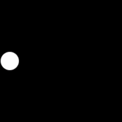

#### 1. 空の`setup()`と`draw()`を用意

できれば下の答えを見る前にやってみましょう．

```java
void setup()
{
    
}
void draw()
{
    
}
```

#### 2. `setup()`に以下の処理を追加

- スクリーンサイズ: 200×200
- カラーモード: `RGB, 1, 1, 1, 100`
- 線(stroke)を表示しない
- フレームレート(fps): 8

できれば下の答えを見る前にやってみましょう．

```java
void setup()
{
  size(200, 200);
  colorMode( RGB, 1, 1, 1 );
  noStroke();
  frameRate(8); // fps
}
void draw()
{
    
}
```

#### 3. グローバル変数の追加

- 横移動用グローバル変数を一つ宣言し，`setup()`で初期化しましょう．
  - 変数名: iPosX
  - 型: int
  - 初期値: 0

できれば下の答えを見る前にやってみましょう．

```java
int iPosX; // 楕円のX座標
 
void setup()
{
  size(200, 200);
  colorMode( RGB, 1, 1, 1 );
  noStroke();
  frameRate(8);
    
  iPosX = 0; // 初期化
}
void draw()
{
    
}
```

#### 4. `draw()`で楕円を描画

- `draw()`で楕円を描画しましょう．
  - X座標: iPosX
  - Y座標: スクリーンの高さの半分
  - 直径: 30, 30
  - 塗り色: 白( 1, 1, 1 )

できれば下の答えを見る前にやってみましょう．

```java
int iPosX;
 
void setup()
{
  size(200, 200);
  colorMode( RGB, 1, 1, 1 );
  noStroke();
  frameRate(8);
    
  iPosX = 0;
}
void draw()
{
  fill( 1, 1, 1 );						// White
  ellipse( iPosX, height/2, 30, 30 );	// 楕円描画
}
```

#### 5. 楕円を動かす

- `draw()`の中に，`iPosX`に4を足す（加算）処理を追加しましょう．


できれば下の答えを見る前にやってみましょう．

```java
int iPosX;
 
void setup()
{
  size(200, 200);
  colorMode( RGB, 1, 1, 1 );
  noStroke();
  frameRate(8);
  
  iPosX = 0;
}
void draw()
{
  fill( 1, 1, 1 );
  ellipse( iPosX, height/2, 30, 30 );
  
  iPosX += 4; // フレーム毎に4動かす
}
```

#### 6. スクリーンのリフレッシュ処理の追加

前フレームの楕円描画が残ってしまっている．
`draw()`で，**新しい楕円を描画する前に**スクリーンをリフレッシュしましょう．

- 矩形を描画する
  - X座標: 0
  - Y座標: 0
  - 幅・高さ: スクリーンと同じ
  - 塗り色: 黒(  0, 0, 0  )


```java
int iPosX;
 
void setup()
{
  size(200, 200);
  colorMode( RGB, 1, 1, 1 );
  noStroke();
  frameRate(8);
    
  iPosX = 0;
}
void draw()
{
  fill( 0, 0, 0 );				// Black
  rect( 0, 0, width, height );	// スクリーンリフレッシュ
  
  fill( 1, 1, 1 );
  ellipse( iPosX, height/2, 30, 30 );
  
  iPosX += 4;
}
```

#### 7. 跳ね返り（難易度高め）

今のままではスクリーン外に楕円が移動してしまう．
**スクリーンの右端と左端で進む向きが反転**するよう，改良方法を考えてみましょう．


##### ヒント

- 現在の<u>楕円進む向き</u>の情報を保存する**グローバル変数を追加**する．
- 条件分岐`if`を使い，<u>楕円がスクリーン端を超えたときに進む向きを変える</u>．
- 「向きが反転する」とはこの場合，(+)プラスが(-)マイナスになる，もしくは(-)マイナスが(+)プラスになる．

できれば下の答えを見る前にやってみましょう．

```java
int  iPosX;
int  iDirctionX; // 進む向き( 1:+X方向, -1:-X方向 )
 
void setup()
{
  size(200, 200);
  colorMode( RGB, 1, 1, 1 );
  noStroke();
  frameRate(8);
  
  iPosX = 0;
  iDirctionX  = 1;
}
 
void draw()
{
  fill( 0, 0, 0 );
  rect( 0, 0, width, height );
  
  fill( 1, 1, 1 );
  ellipse( iPosX, height/2, 30, 30 );

  iPosX += iDirctionX*4;             // iPosX = iPosX + iDirctionX*4; と同じ
  if( iPosX >= width || iPosX < 0 )  // もしX座標値がスクリーン幅以上もしくは0未満だったら
  {
    iDirctionX *= -1;  // 向きを逆方向に変える(-1をかける)
  }
}
```


### 直線の回転アニメーション

```java
int iRatateDeg;             // アニメーション用回転角度
 
void setup()
{
  size( 200, 200 );
  frameRate( 8 );
  
  int iRatateDeg = 0;      // グローバル変数初期化
}
void draw()
{
  // 画面のリフレッシュ.
  fill( 120, 120, 120 );
  noStroke();
  rect( 0, 0, width, height );
  
  iRatateDeg += 2;                 // 毎フレーム2°回転
  
  if( iRatateDeg > 360 )
  {
    iRatateDeg -= 360;             // 360°以上回転したら戻す.
  }
  
  translate( width/2, height/2 );  // 座標原点をスクリーン中心へ.
  rotate( radians(iRatateDeg) );   // 座標系回転.
  
  strokeWeight( 4 ); // 線の太さ.
  stroke( 0, 0, 0 );
  line( 0, 0, width/2, 0 );
}
```


### 波形の移動（位相変化）アニメーション

```java
int iAmplitudeL = 80;  // 振幅（大きな波の高さ）
 
// グローバル変数.
int iAnimPulseDeg = 0; // アニメーション用波の角度
 
void setup()
{
  size( 400,200 );
  colorMode( HSB, 90, 1.0, 1.0, 1.0 );
}
void draw()
{
  // スクリーンリセット.
  noStroke();
  fill( 0, 0, 0.4 );
  rect( 0, 0, width, height );
  
  
  iAnimPulseDeg += 2;                        // アニメーション用の角度を2°増やす.
  if( iAnimPulseDeg > 360 )                  // 360°を超えたらリセット.
  {
    iAnimPulseDeg -= 360;
  }
  
  // コサイン波形
  strokeWeight( 8 );
  for( int iX=0; iX < width; iX++ )
  {
    int iAngle0 = iX*4+iAnimPulseDeg;        // アニメーション用の角度を加算
    int iAngle1 = (iX+1)*4+iAnimPulseDeg;    // アニメーション用の角度を加算
     
    // X座標値によって色は固定
    stroke( iX%90, 1.0, 1.0 );
    
    line( iX, height/2 + iAmplitudeL*cos( radians(iAngle0) ),
          iX, height/2 + iAmplitudeL*cos( radians(iAngle1+1) ) );
  }
}
```


### 円弧の形状変化アニメーション

```java
int iArcAnimDeg;        // アニメーション用円弧の角度
 
void setup()
{
  size( 200, 200 );
  frameRate( 8 );
  
  iArcAnimDeg = 0;      // アニメーション用変数初期化
}
void draw()
{
  // 画面のリフレッシュ.
  fill( 120, 120, 120 );
  noStroke();
  rect( 0, 0, width, height );
  
  // アニメーション用変数更新.
  if( iArcAnimDeg < 180 )	// 180°以上変化したらリセット.
  {
    iArcAnimDeg += 4;		// 毎フレームの変化角度
  }
  else
  {
    iArcAnimDeg -= 180;		// リセット.
  }
  
  // 円弧の始まりの角度を計算.
  int iArcAnimDegBegin = iArcAnimDeg - 90;
  
  // 円弧の終わりの角度を計算.
  int iArcAnimDegEnd   = 270 - iArcAnimDeg;
  
  fill( 255, 255, 255 );
  stroke( 0,0,0 );
  arc(width/2, height/2, width, height, radians(iArcAnimDegBegin), radians(iArcAnimDegEnd), CHORD);
}
```

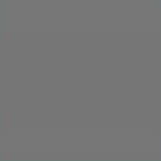


# ユーティリティ関数


## テキスト描画

### text()

スクリーンにテキストを描画する．
フォントの色の変更は`fill()`を使う．

#### 書式

```java
text( "描画する文字列", X座標値, Ｙ座標値 )	// 文字列を描画する場合（ダブルクォーテーションを使う）
```


```java
text( 描画する値, X座標値, Ｙ座標値 )		 // 数値を描画する場合
```


```java
text( 変数, X座標値, Ｙ座標値 )		 	   // 変数の値を描画する場合
```

#### 例

```java
text("word", 10, 30); 
 
fill(0, 102, 153);
text(3.14, 10, 60);
 
int iText = 123;
fill(0, 102, 153, 100);
text(iText, 10, 90); 
```


### textSize()

テキスト描画のフォントサイズを設定する．

#### 書式

```java
textSize( フォントサイズ )		// ピクセル単位
```

#### 例

```java
background(0);
 
fill(255);
textSize(26); // フォントサイズ:26
text("WORD", 10, 50); 
 
textSize(14); // フォントサイズ:14
text("WORD", 10, 70);
```


https://processing.org/reference/text_.html
https://processing.org/reference/textSize_.html


## 日付

現在の日，月，西暦を取得する．

### 書式

```java
day()		// 日(1 - 31)
month()		// 月(1 - 12)
Year()		// 年(2003, 2004, 2005, etc.)
```

### 例

```java
int iDay    = day();
int iMonth  = month();
int iYear   = year();
 
text(iDay,   10, 28);
text(iMonth, 10, 56); 
text(iYear,  10, 84);
```

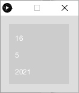

https://processing.org/reference/year_.html


## 時刻

現在の時刻における秒，分，時を取得する．
アニメーションに用いる場合，`draw()`を行うたびにこれらの関数を呼び，最新の時刻を取得する必要がある．

### 書式

```java
second()  // 秒(0 - 59)
minute()  // 分(0 - 59)
hour()    // 時(0 - 23)
```

### 例

```java
int iSecond = second();
int iMinute = minute();
int iHour   = hour();

text( iHour,   10, 56 );
text( ":",     25, 56 );
text( iMinute, 30, 56 );
text( ":",     45, 56 );
text( iSecond, 50, 56 );
```


https://processing.org/reference/hour_.html


## プログラムを開始してからの経過時間

### millis()

プログラムを開始してからの現在の経過時間を，ミリ(千分の一)秒単位で取得できる．
少し難しいが，**差分を取ることで**細かいアニメーションに応用できる．

#### 書式

```java
millis()	// 引数無し，1000分の1秒単位の値が返ってくる．
```

#### 例

```java
float fMillsPrevious = 0;  // 前回のdraw()における経過時間
 
void setup()
{
  frameRate( 5 );  // fps:5
}
void draw()
{
  // スクリーンリフレッシュ
  fill(0,0,0);
  rect(0,0,width,height);
  
  // 現在のdraw()における経過時間
  float fMillsCurrent = millis();
  
  // 前回のdraw()から経過した（差分）時間
  float fMillsDelta = fMillsCurrent - fMillsPrevious;
   
  textSize( 20 );
  fill(255,255,255);  
  text( fMillsDelta, 5, 20);    // 前回のdraw()から経過した時間を描画

  text( fMillsPrevious, 5, 50); // 前回のdraw()における経過時間を描画

  text( fMillsCurrent, 5, 80);  // 現在のdraw()における経過時間を描画

 // 現在の経過時間を保存.
  fMillsPrevious = fMillsCurrent;
}
```


https://processing.org/reference/millis_.html


# 画像・PDF出力

## 表示ウィンドウの画像を保存する．

- ファイル形式は tif, tga, png, jpg などが使用可能.
- **プログラムを実行すると**，プログラムが置かれているフォルダ（スケッチブック）内に画像が保存される.
- 通常はプログラムの最後に書くとよい．
### 書式
```java
save(“ファイル名.拡張子”); // ※ダブルクォーテーション（半角）を忘れずに.
```
### 例
```java
/**
	スケッチ名：sketch01.pde
	
	ルート90・セルオートマトンの描画プログラム
	~省略
*/

save( "sakuhin.png" );	// 表示ウィンドウを，"sakuhin.png"という名前で，pngファイルとして出力
```


## PDFへ出力

- **プログラムを実行すると**，プログラムが置かれているフォルダ（スケッチブック）内にpdfファイルが保存される.
- 少々ステップを踏む必要あり．

### 方法

1. 　ライブラリのインポート
   - （日本語）「スケッチ」メニュー ＞ 「ライブラリをインポート」 ＞ 「PDF Export」を選択
   - （英語版）「Sketch」メニュー ＞ 「import Library」 ＞ 「PDF Export」を選択 


​		上記を選択すると，プログラムの一行目に`import processing.pdf.*;`が追加される．
​		※**メニューを使わず，直に入力も可能．**


2. `size()`の記述変更

   ```java
   size( 横のサイズ, 縦のサイズ, PDF, “好きなファイル名.pdf” );
   ```


3. 　プログラム末尾に`exit();`を追加．


4. プログラムを実行すると，pdfファイルが出力される．
   この時，表示ウィンドウは表示されない．

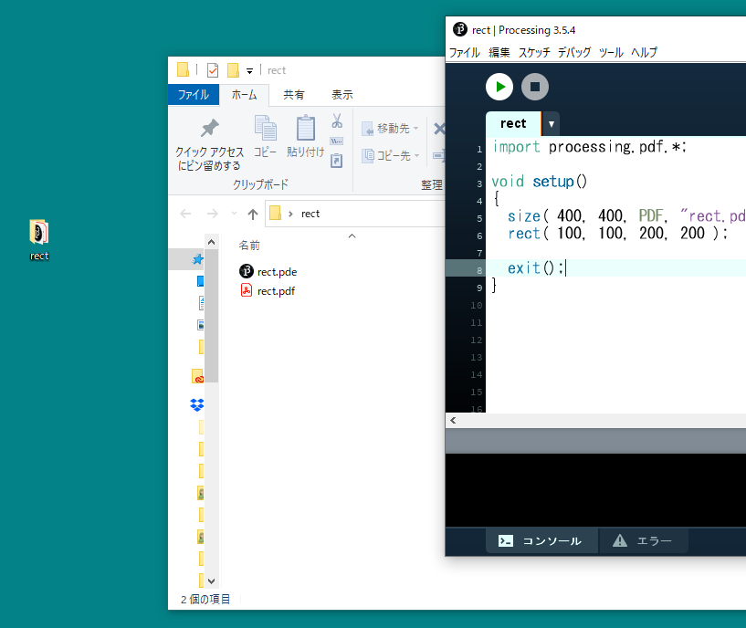


# ジャンクプログラム置き場

講師が作ってみたものの，難易度が高かったり，解説に不向きだったものを一応掲載しています．
ネタに困ったときなど参照してもらって構いませんが，コメントが少な目です．

### 二次元配列を使った，竹藪のような表現

```java
int iSectionTotal = 40;
int iRepeatTotal = 80;
float fScaleMin = 0.2;
float fScaleMax = 1.4;
float fRotateMax = 360;
 
size( 400, 400 );
colorMode( HSB, 360, fScaleMax, 1 );
background(0, 0, 0.4);
stroke(0, 0, 0.2);
 
float[][] fRectColor = new float[3][2];
for( int iRectIdx=0; iRectIdx < fRectColor.length; iRectIdx++ )
{
  fRectColor[iRectIdx][0] = random(360);  //色相
  fRectColor[iRectIdx][1] = random( 0.6, 1.0);    //明度 
}
 
for( int iRepeatIdx=0; iRepeatIdx < iRepeatTotal; iRepeatIdx++ )
{
  pushMatrix();
  
  translate( width/2, height/2 );
  rotate( radians( random( fRotateMax ) ) );
  
  float fScale =  fScaleMin + ( fScaleMax - fScaleMin ) * iRepeatIdx/iRepeatTotal;
  scale( fScale );
  translate( random(-width,width/2), random(-height/2,height/2) );
  
  for( int iSectionIdx=0; iSectionIdx < iSectionTotal; iSectionIdx++ )
  {
    int iRectColorIdx = iSectionIdx%fRectColor.length;
    
    fill( fRectColor[iRectColorIdx][0], fScale, fRectColor[iRectColorIdx][1]);
    rect( 0, 0, 20, 10 );
  
    translate( 20, 0 );
  }
  popMatrix();
}
```


### 二次元配列を使ったパッチの繰り返し

```java
int iRectTotal = 100;  // 矩形の数(１エリア内)
int iRectSize = 100;   // 矩形のサイズ
int iRowTotal = 2;     // 繰り返しの行数
int iColumnTotal = 6;  // 繰り返しの列数
 
size( 600, 200 );
colorMode(HSB,iRectTotal,1,1,1);
 
float[][] fEllipsePos = new float[iRectTotal][2];
 
for( int iEllipseIdx=0; iEllipseIdx < fEllipsePos.length; iEllipseIdx++ )
{
  fEllipsePos[iEllipseIdx][0] = random(100-iRectSize);
  fEllipsePos[iEllipseIdx][1] = random(100-iRectSize);
}
 
noStroke();
 
for( int iRowIdx=0; iRowIdx < iRowTotal; iRowIdx++ )
{
  pushMatrix();
  for( int iColumnIdx=0; iColumnIdx < iColumnTotal; iColumnIdx++ )
  {
    for( int iEllipseIdx=0; iEllipseIdx < fEllipsePos.length; iEllipseIdx++ )
    {
      fill(iEllipseIdx,1,1,0.5);
      rect( fEllipsePos[iEllipseIdx][0], fEllipsePos[iEllipseIdx][1], iRectSize, iRectSize );
    }
    translate( 100, 0 );
  }
  popMatrix();
  translate( 0, 100 );
}
```


### ランダムな楕円のフェードアニメーション


#### 1. 空の`setup()`と`draw()`を用意

できれば下の答えを見る前にやってみましょう．

```java
void setup()
{
    
}
void draw()
{
    
}
```

#### 2. `setup()`に以下の処理を追加

- スクリーンサイズ: 200×200
- カラーモード: `RGB, 1, 1, 1, 100`
- 線(stroke)を表示しない
- フレームレート(fps): 8

できれば下の答えを見る前にやってみましょう．

```java
void setup()
{
  size( 200, 200 );
  colorMode( RGB, 1, 1, 1, 100 );
  background( 1, 1, 1 );
  noStroke();
  frameRate(8); // fps
}

void draw()
{
 
}
```

#### 3. `draw()`に以下の処理を追加

- 楕円を一つ描画
  - X,Y座標：ランダム（最大X:スクリーン幅, 最大Y:スクリーン高さ）
  - 直径：ランダム(最大100)
  - 塗り色：RGB全てランダム(最大1)


できれば下の答えを見る前にやってみましょう．

```java
void setup()
{
  size( 200, 200 );
  colorMode( RGB, 1, 1, 1, 100 );
  background( 1, 1, 1 );
  noStroke();
  frameRate(8); // fps
}
 
void draw()
{
  fill( random(1), random(1), random(1) );
  ellipse( random(width), random(height), random(100), random(100) );
}
```

#### 4. スクリーンのリフレッシュ処理を追加

- スクリーン全体と同じサイズの矩形を背景色で描画する．


できれば下の答えを見る前にやってみましょう．

```java
void setup()
{
  size( 200, 200 );
  colorMode( RGB, 1, 1, 1, 100 );
  background( 1, 1, 1 );
  noStroke();
  frameRate(8); // fps
}
 
void draw()
{
  // スクリーンをリフレッシュ
  fill( 1, 1, 1 );
  rect( 0,0,width,height );
  
  fill( random(1), random(1), random(1) );
  ellipse( random(width), random(height), random(100), random(100) );
}

```

#### 5. スクリーンリフレッシュのアルファ値を50%に変更

- ステップ4で追加した矩形のアルファ値を50(%)に変更する．

できれば下の答えを見る前にやってみましょう．

```java
void setup()
{
  size( 200, 200 );
  colorMode( RGB, 1, 1, 1, 100 );
  background( 1, 1, 1 );
  noStroke();
  frameRate(8); // fps
}
 
void draw()
{
  // スクリーンをリフレッシュ
  // アルファ値:50%で前フレームの描画結果に重ねる．
  fill( 1, 1, 1, 50 );
  rect( 0,0,width,height );
  
  fill( random(1), random(1), random(1) );
  ellipse( random(width), random(height), random(100), random(100) );
}
```