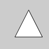
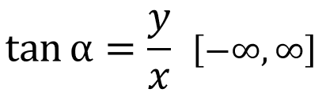
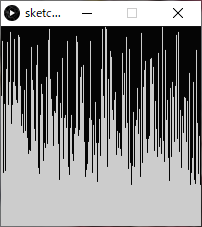

# Processingの基本

## Processingのデータ
ファイル形式（拡張子）: .pde
スケッチとも呼ばれる．
スケッチが格納された同名のフォルダをスケッチブックとも呼ぶ．
スケッチ(.pde)がフォルダ(スケッチブック)に格納されているファイル構造を壊さないよう注意．
（スケッチブックだけを移動させる等）

## フォント（エディタ・コンソール）の変更（任意）
変更方法：ファイル>設定>エディタとコンソールのフォント
デフォルトのフォント Source Code Pro は以下のことができない．
- プログラム及びコメントへの日本語（全角）入力
- コンソールへの日本語（全角）出力
- これらを有効にするには，日本語対応のフォントに変更してください．
	MS ゴシック など


## プログラムを書く際の最低限のルール
- 半角英数と数字を用いる
- 単語ごとにスペースを入れて区切る
- 文末にはセミコロン（;）を入れる（忘れがち！）
- 大文字と小文字の区別があるので注意

## Processingの命令
Processingには，線を描く命令や，円を描く命令，色を変える命令など，様々な命令が用意されている．
基本的にはプログラムは上から下へ，順番に逐次実行されていく．
命令の名前は一つの単語となっており，スペースを含まない．
基本的には小文字が命令の名前に用いられるが，二単語が複合した命令は，2単語目に大文字が用いられる．例：rectMode();
あらかじめ用意された命令を入力すると，エディタ上では色が変わる．
これらの命令は，プログラムにおける関数の一種である．

## コンソールへの出力 print()
- プログラム処理の内容を視覚化し，問題が起こった場合原因を特定しやすくする．
- 変数の中の値をトレース（監視）することができる．
### コンソールエリアに任意の値を出力する．
```java
print( "文字列" );
print( 値or変数 );
print( "文字列" + 値or変数 );  // 文字列と値や変数を+を用いてつなげることも可能
```
### 改行を含めたい場合
```java
println( 上記と同様のフォーマット );
```
### 例
```java
String s = "The size is ";
int w = 1920;
int h = 1080;
print(s);
print(w, "x", h);
// コンソールには以下のように出力される:
// The size is 1920 x 1080
```
```java
print("begin- ");
 
float f = 0.3;
int i = 1024;
print("f is " + f + " and i is " + i);
 
println("-end");
 
// コンソールには以下のように出力される:
// begin- f is 0.3 and i is 1024 -end
```
## 座標系について
画面はピクセルというモザイク状の点の集まりによって表現される．
Processingでは左上を原点（0, 0）とし，右下に向かって座標値が大きくなる．


https://processing.org/tutorials/drawing/

## 画面のサイズを決める

```java
size( 横のピクセル数, 縦のピクセル数 );
```
https://processing.org/reference/size_.html

## 画面のサイズを取得する

必ずsize()記述以後に記述する必要がある．
### 例
```java
width   // 横のピクセル数
height  // 縦のピクセル数
```


https://processing.org/reference/width.html
https://processing.org/reference/height.html


## 色を扱う

### カラーモードの設定
色を扱うにはまず、プログラムで使用するカラーモードを指定する必要がある．
プログラム中に明示的に指定が無ければ，RGBモードが使用される．
```java
colorMode(RGB, 最大値);
colorMode(HSB, 最大値);
colorMode(HSB, 色相の最大値, 彩度の最大値, 輝度の最大値);
```
### デフォルトのカラーモード
カラーモードを明示的に指定していない場合は，以下の初期設定が適用されている．
```java
// 使用するカラーモデルはRGB，最大値は255
colorMode( RGB, 256 );
```
例：
```java
// 使用するカラーモデルをRGBに設定，最大値を100とする．
colorMode( RGB, 100 );

// カラーモデルをHSBに設定し，色相の最大値を360とし，彩度と輝度の最大値1,0とする．
colorMode( HSB, 360, 1.0, 1.0 );
```
### 色の書式
各アルファベットの位置に具体的な数値が入る
RGB
```java
r, g, b
例：0.1, 0, 1.0
```
RGB, alpha
```
r, g, b, a
```
gray
```
g
```
gray, alpha
```
g, a
```
HSB
```
h, s, b
```
HSB, alpha
```
h, s, b, a
```
### 色相と彩度
```java
// 下のグラデーション図のプログラム
noStroke();
colorMode(HSB, 100); // カラーモード:HSB, 各値の最大値100
for (int i = 0; i < 100; i++)
{
    for (int j = 0; j < 100; j++)
    {
        stroke(i, j, 100);
        point(i, j);
    }
}
```


https://processing.org/reference/colorMode_.html

## 背景に色を付ける

```java
background( 色の書式 );  // colorMode設定に依存
```
例：
```java
background(255, 204, 0);
```


https://processing.org/reference/background_.html

## アンチエイリアスをかける

```java
smooth();
```
### アンチエイリアスを解除する
```java
noSmooth();
```
https://processing.org/reference/smooth_.html


***

# 図形描画
## 線の色を変える
```java
stroke( 色の書式 );  // colorMode設定に依存
```
### 例
```java
stroke(204, 102, 0);
rect(30, 20, 55, 55);
```


https://processing.org/reference/stroke_.html

## 線を消去する

```java
noStroke();
```
### 例
```java
noStroke();
rect(30, 20, 55, 55);
```


https://processing.org/reference/noStroke_.html

## 線の太さを設定する

```java
strokeWeight( 太さ );
```
### 例

```java
strokeWeight(1);  // Default
line(20, 20, 80, 20);
strokeWeight(4);  // Thicker
line(20, 40, 80, 40);
strokeWeight(10);  // Beastly
line(20, 70, 80, 70);
```


https://processing.org/reference/strokeWeight_.html

## 図形の塗りつぶし色を設定する

```java
fill( 色の書式 );　// colorMode設定に依存
```
### 例1
```java
colorMode(RGB, 256);
fill(204, 102, 0);
rect(30, 20, 55, 55);
```


### 例2

```java
colorMode( HSB, 360, 1.0, 1.0 );
fill(80, 0.8, 0.9);
rect(15, 10, 55, 55);
```


### 例3

```java
colorMode(RGB, 256);
 
fill(204, 102, 0);
rect(15, 10, 55, 55);
 
fill(0, 102, 200, 80);  // アルファ80
rect(30, 20, 55, 55);
```


https://processing.org/reference/fill_.html

## 塗りつぶしを消去する

```java
noFill();
例：
rect(15, 10, 55, 55);
noFill();
rect(30, 20, 55, 55);
```


https://processing.org/reference/noFill_.html

## 点を描画する

```java
point( x座標, y座標 );
```
### 例
```java
stroke( 255, 0, 0 );  // 色を指定する場合はstroke()を使う．
point( 50,50 );
point( 51,50 );
point( 50,51 );
point( 51,51 );
```


https://processing.org/reference/point_.html

## 線を描画する

```java
line( 始点x座標, 始点y座標, 終点x座標, 終点y座標 );
```
### 例1
```java
line(30, 20, 85, 75);
```


### 例2 連続した線

```java
stroke(255,0,0);        // R
line( 20, 20, 40, 40 );
 
stroke(0,255,0);        // G
line( 40, 40, 50, 70 );	// 一つ目の線の終わりの点からスタート
 
stroke(0,0,255);        // B
line( 50, 70, 80, 80 );	// 二つ目の線の終わりの点からスタート
```


https://processing.org/reference/line_.html

## 三角形を描画する

```java
triangle( 頂点1のx値, 頂点1のy値, 頂点2のx値, 頂点2のy値, 頂点3のx値, 頂点3のy値 );
```
### 例
```java
triangle(30, 75, 58, 20, 86, 75);
```


https://processing.org/reference/triangle_.html

## 矩形（長方形）を描画する

主に三種類のやり方があるが，自分の実現したいことに適した方法を選ぶとよい．

### 左上の座標と大きさを指定（初期設定）

```java
rectMode(CORNER); // 他にrectMode()を使用している箇所が無ければ，不要
rect( 左上x座標, 左上y座標, 矩形の幅, 矩形の高さ );
```


### 中心の座標を指定

```java
rectMode(CENTER);
rect( 中心x座標, 中心y座標, 矩形の幅, 矩形の高さ );
```


### 左上と右下の座標を指定

```java
rectMode(CORNERS);
rect( 左上x座標, 左上y座標, 右下x座標, 右下y座標 );
```


### 例

```java
rectMode(CORNER);
rect(30, 20, 55, 55);
```


https://processing.org/reference/rect_.html
関連する命令：正方形の描画
https://processing.org/reference/square_.html


## 四辺形を描画する
自由な四辺形を描くことができる．
```java
quad( 頂点1のx値, 頂点1のy値,
      頂点2のx値, 頂点2のy値,
      頂点3のx値, 頂点3のy値,
      頂点4のx値, 頂点4のy値 );
```
### 例
```java
quad(38, 31, 86, 20, 69, 63, 30, 76);
```


https://processing.org/reference/quad_.html


## 円・楕円を描画する

### 中心座標と直径を指定

```java
ellipseMode(CENTER); // 他にellipseMode()を使用している箇所が無ければ，不要
ellipse( 中心のx座標, 中心のy座標, 横の直径, 縦の直径 );
```
### 中心座標と半径を指定
```java
ellipseMode(RADIUS);
ellipse( 中心のx座標, 中心のy座標, 横の半径, 縦の半径 );
```
### 例
```java
ellipseMode(CENTER);
ellipse(56, 46, 55, 55);
```


https://processing.org/reference/ellipse_.html
関連する命令：正円の描画
https://processing.org/reference/circle_.html


## 円弧を描画する
度（度数法）をラジアン（弧度法）に変換する方法
指定する角度は，ラジアン単位である必要がある
```java
// θ = θ° × π / 180 [rad]
radians( 度 ); // この命令で任意の角度をラジアンに変換できる．
おおまかな度とラジアンの対応
QUARTER_PI : 45°
HALF_PI    : 90°
PI         : 180°
TWO_PI     : 360°
```
### オープンな弧を描画する
```java
arc( 中心のx座標, 中心のy座標, 横の直径, 縦の直径, 弧の始まりの角度, 弧の終わりの角度, OPEN );
```
#### 例
```java
arc(50, 50, 80, 80, 0, PI+QUARTER_PI, OPEN);
```


### 閉じた弧を描画する

```java
arc( 中心のx座標, 中心のy座標, 横の直径, 縦の直径, 弧の始まりの角度, 弧の終わりの角度, CHORD );
```
#### 例
```java
arc(50, 50, 80, 80, 0, PI+QUARTER_PI, CHORD);
```


### パイ状に描画する

```java
arc( 中心のx座標, 中心のy座標, 横の直径, 縦の直径, 弧の始まりの角度, 弧の終わりの角度, PIE );
```
#### 例
```java
arc(50, 50, 80, 80, 0, PI+QUARTER_PI, PIE);
```


https://processing.org/reference/radians_.html
https://processing.org/reference/PI.html
https://processing.org/reference/arc_.html

### 例: 月の満ち欠けのような描画

```java
size( 400, 200 );
 
arc( 50,     100, 80, 80, radians(120), radians(420), CHORD );
arc( 50+100, 100, 80, 80, radians(135), radians(405), CHORD );
arc( 50+200, 100, 80, 80, radians(175), radians(365), CHORD );
arc( 50+300, 100, 80, 80, radians(190), radians(350), CHORD );
```


## 曲線を描画する

4点を結ぶ曲線の中間2点間が描画される（スプライン曲線）
```java
curve( 点1のx値, 点1のy値,   // 制御点1
       点2のx値, 点2のy値,   // 描画点1
       点3のx値, 点3のy値,   // 描画点2
       点4のx値, 点4のy値 ); // 制御点2
```
### 例
```java
noFill();
stroke(255, 102, 0);
curve(5, 26, 5, 26, 73, 24, 73, 61);
stroke(0);
curve(5, 26, 73, 24, 73, 61, 15, 65);    // 中間2点間（黒）
stroke(255, 102, 0);
curve(73, 24, 73, 61, 15, 65, 15, 65);
```


https://processing.org/reference/curve_.html


## ベジェ曲線を描画する

```java
bezier( 点1のx値, 点1のy値,
        制御点1のx座標, 制御点1のy座標,
        点2のx値, 点2のy値,
        制御点2のx座標, 制御点2のy座標 );
```
### 例
```java
noFill();
stroke(255, 102, 0);
line(85, 20, 10, 10);    // 点1から制御点1への線（橙）
line(90, 90, 15, 80);    // 点2から制御点2への線（橙）
stroke(0, 0, 0);
bezier(85, 20, 10, 10, 90, 90, 15, 80);   // 得られた曲線(黒)
```


https://processing.org/reference/bezier_.html


## 多角形を描画する

複数の命令で構成される．
はじめにbeginShape();と書き，次いで必要な頂点数だけ vertex( x座標, y座標 ); を記述する．
最後に endShape(); で閉じる．
※なお、endShape(CLOSE)と指定すると、閉じた形状となる
```java
beginShape(); // 形状の開始宣言
vertex( x座標, y座標 ); // 頂点座標（頂点の数だけ書く。複数書いてよい）
endShape(); //形状の終了宣言
```
### 例
```java
beginShape();
vertex(20, 20);
vertex(40, 20);
vertex(40, 40);
vertex(60, 40);
vertex(60, 60);
vertex(20, 60);
endShape(CLOSE);
```


https://processing.org/reference/beginShape_.html
https://processing.org/reference/vertex_.html
https://processing.org/reference/endShape_.html


***

# 座標変換（平行移動，回転，拡大縮小）

## 前提知識
- 座標≒原点
- Processingでは初期座標がスクリーン左上(0,0)に設定されている．
- この座標を移動，回転，拡大縮小することを座標変換という．
公式チュートリアル
https://processing.org/tutorials/transform2d/

## 平行移動
```java
translate( x移動量, y移動量 );
```
### 例
```java
// 平行移動させる前
rect(20, 20, 40, 40 );
```


```java
translate(60, 80);	// 平行移動
rect(20, 20, 40, 40);
```


### 利点
入れ子状の構造の繰り返しがシンプルにできる
#### 例1　家のような図の描画（平行移動前）
```java
// 平行移動前
size(400, 100);
background(255); 
 
triangle(15, 0, 0, 15, 30, 15);
rect(0, 15, 30, 30);
rect(12, 30, 10, 15);
```


#### 例2　家のような図の複数描画（平行移動後）

```java
size(400, 100);
background(255); 
 
// 一つ目
triangle(15, 0, 0, 15, 30, 15);
rect(0, 15, 30, 30);
rect(12, 30, 10, 15);
 
translate(40, 0); // x軸方向に40移動
 
// 二つ目
triangle(15, 0, 0, 15, 30, 15);
rect(0, 15, 30, 30);
rect(12, 30, 10, 15);
 
translate(40, 0); // x軸方向にさらに40移動
 
// 三つ目
triangle(15, 0, 0, 15, 30, 15);
rect(0, 15, 30, 30);
rect(12, 30, 10, 15);
```


https://processing.org/reference/translate_.html


## 回転

座標を原点を中心に時計回りに回転する．
```java
rotate( 角度 );  // 単位：ラジアン
```
ラジアンに慣れていない人はこう書くとよい．
```java
rotate( radians( 角度 ) );  // 度数法をラジアンに変換
```
※図形描画の円弧のセクションも参照してください
### 例1
矩形を45°回転させる（スクリーン左上を中心に回転してしまっている例）
```java
size(200, 200);
background(255);
 
fill(192);
noStroke();
rect(40, 40, 40, 40);
 
rotate(radians(45));    // 45°時計回りに回転
fill(0);
rect(40, 40, 40, 40);
```


### 例2

矩形を45°回転させる(正しい例)
1. 原点座標を矩形の左上に移動させる
2. 座標を回転させる
3. 原点に矩形を描画する
```java
size(200, 200);
background(255); 
 
fill(192);
noStroke();
rect(40, 40, 40, 40);
 
translate(40, 40);  // 原点を矩形の左上に移動
rotate(radians(45));
 
fill(0);
rect(0, 0, 40, 40); // 原点に二つ目の矩形を描画
```


https://processing.org/reference/rotate_.html


## 拡大縮小

```java
scale( 拡大率 );
scale( x拡大率, y拡大率 );
```
### 例
矩形の大きさだけでなく，x,y座標値も拡大されていることに注目
```java
size(200,200);
background(255);
 
stroke(128);
rect(20, 20, 40, 40);
 
stroke(0);
scale(2.0);
rect(20, 20, 40, 40);
```


### 例: 時計の針のような描画
```java
size( 300, 300 );
 
translate( width/2, height/2 );  // 原点をスクリーン中心に移動.
 
strokeWeight(1);
line( 0, 0, 100, 0 );
 
rotate( radians(30) );    // 30度回転.
strokeWeight(4);
line( 0, 0, 100, 0 );
 
rotate( radians(50) );    // 50度回転.
strokeWeight(6);
line( 0, 0, 100, 0 );
 
rotate( radians(70) );    // 80度回転.
strokeWeight(8);
line( 0, 0, 100, 0 );
 
rotate( radians(80) );    // 90度回転.
strokeWeight(10);
line( 0, 0, 100, 0 );
```


https://processing.org/reference/scale_.html


## 座標系の保存と復帰

詳細は行列の計算が関連することもあり難解であり，本授業では掘り下げない．
任意の場所に記述し，使うことができれば問題ない．
### 座標系の保存
```java
pushMatrix();
```
### 座標系の復帰
```java
popMatrix();
```
### 例
```java
size(500, 500);
pushMatrix(); 			// 座標系の記憶
 
translate(250, 250);	// 座標系の移動
rect(0, 0, 50, 50);     // 平行移動後の位置に描画されるはず
 
popMatrix(); 			// 座標系を元に戻す
rect(0, 0, 50, 50);     // スクリーン左上に描画されるはず
```


https://processing.org/reference/pushMatrix_.html
https://processing.org/reference/popMatrix_.html


***

# 演算と変数

## 文と式
### 文 Statement
- 手続きを表す．
- プログラムは基本的に文から構成される．
- 逐次実行される(手続き型言語).
- セミコロン「；」 で区切られている部分が一つの文となる．
```java
size(200,200);          // 文
rectMode(CENTER);       // 文
rect(100,10020,100);    // 文
```
- 主に二種存在する．
	- 宣言文 Declarative Statement
	- 命令文 Imperative Statement
```java
int a;      // 宣言文
a = a + 1;  // 命令文
```

### 式 Expression
- コンピュータにとっての「計算」を表す表現
- 式は基本的には文の中に含まれている（存在する）．
- 主に以下の要素から構成される．
	- 値
	- 変数
	- 演算子 Operator
	- 関数

| line( 0, 0, 0, <u>a + 1</u> ); // 式<br/>line( <u>0</u>, <u>0</u>, <u>0,</u> a + <u>1</u> ); // 値<br/>line( 0, 0, 0, <u>a</u> + 1 ); // 変数<br/>line( 0, 0, 0, a <u>+</u> 1 ); // 演算子<br/><u>line(</u> 0, 0, 0, a + 1 <u>)</u>; // 関数<br/><u>line( 0, 0, 0, a + 1 )</u>; // 文 |
| ------------------------------------------------------------ |

## 算術式
### 四則演算（+-×÷）を表す式

|計算|種類|式|演算子|
| ---- | ---- | ---- | ---- |
|足し算|加算|`a + b`|プラス|
|引き算|減算|`a - b`|マイナス|
|かけ算|乗算|`a * b`|アスタリスク|
|割り算|除算|`a / b`|スラッシュ|
#### 例
```java
print("answer=");
println(1+2);
```
### 括弧を使った計算
#### 例
```java
(6-4)/(2+3)
(2*(3+7))/5     // 乗算*は省略できないことに注意
```
### 演算優先順位
算数の四則計算に準じる
左から逐次実行されるわけではない

|優先度| 種類|演算子|
| ---- | ---- | ---- |
|高い|括弧(カッコ)|`( )`|
||乗算|`*`|
||除算|`/`|
||加算|`+`|
|低|減算|`-`|

## 変数
- 変数とは，数値などのデータを入れて保持しておくための入れ物であり，現実世界の保管箱のようなものである．
- 関数や式に組み込むことで，中の値を参照したり書き換えたりすることができる．
### 変数の要素
- 型
- 変数名
- 値
### 型
データ型とも言う．
変数は決められた型を持ち，入れられるデータの種類が決まっている．
- 整数型 Integer
値として小数は持てない整数の型
```java
int     // 2,147,483,647 ~ -2,147,483,648
```
- 実数型  floating-point numbers
値として小数を持てる型
```java
float   // 3.40282347E+38 ~ -3.40282347E+38 32bit
double  // 3.40282347E+38 ~ -3.40282347E+38 64bit,  float型より広い範囲を保持できる
                                       E+38 は「10の38乗」の意
```
### 宣言
変数を使うには，宣言文によって変数の宣言を行う必要がある．
- (データ)型の指示
- 変数名の決定
- 初期値の代入（必須ではない）
```java
型␣変数名;              // 宣言のみ
型␣変数名 = 値 or 数式;  // 宣言+初期化型
```
### 変数名
- 変数は，変数名によって，その中に入っている値を参照することができる．
- 各変数は変数名により一意に定まる（ユニークである）必要がある．
#### 変数名の制限
変数名の１文字目は英字
```java
誤：55musabi, 2baisoku
正：musabi55, baisoku2
```
予約語は変数名として使用できない．
```java
background, beginShape, bezier, bezierVertex, case, colorMode, curve, curveVertex, default, , dist, draw, ellipse, ellipseMode, else, endShape, fill, frameRate, height, if, image, imageMode, keyPressed, keyReleased, line, loadFont, loadImage, loadPixels, min, mouseButton, mouseDraged, mouseMoved, mousePressed など
```
#### 例
```java
int a;      // 変数の型，スペースをあけて変数名を書く
int a, b;   // カンマで区切り，複数の変数を宣言できる
int a=5;    // 変数にいきなり値を代入してもよい（初期化）
int a=1+1;  // 数式を代入してもよい
```
### 代入文
特に宣言時に初期化されていない変数は代入文によって値を代入されなければならない．
代入文によって，変数に格納されている値を上書きすることができる．
```java
変数名 = 新しい値 or 数式;
```
#### 例
```java
int a;      // 変数aの宣言
int b = 3;  // 変数bの宣言と初期化
 
a = 5;      // 変数aへの値の代入（初期化）
a = b + 2;  // 変数aへの値の代入（上書き）
```

### 良い変数名をつける
プログラムを久しぶりに見たり，他人に見せたりする場合に円滑に理解できるための工夫．
企業等でチームでプログラムを行う際には，コーディング規約というものでルールが決められることが多い．
#### 複数単語の区切り
- キャメルケース
２つ目以降の単語の頭文字を大文字にする．
```java
hogeData
```
- スネークケース
アンダースコアで区切る．
```java
hoge_data
```
#### 頭文字にデータ型の頭文字を小文字で付ける
```java
int   iRadius, iLength;
float fWidth, fHeight;
````
#### プロパティ（性質）
名前の後ろの方につけるのが好ましい．
```java
// よく使われる記述
X            // X座標
Y            // Y座標
Width        // 幅
Height       // 高さ
Radius       // 半径
Diameter     // 直径
Degree, Deg  // 角度°
Radian, Rad  // 角度ラジアン
Minute       // 分
Second, Sec  // 秒
Ratio        // 比，率
R,G,B        // RGBカラー
```
#### 計算値による修飾子
名前の最後につけるのがよい．
```java
// よく使われる記述
Total        // 合計
Sum          // 和
Count        // 数え上げた数
Average      // 平均
Max          // 最大
Min          // 最小
Index, Idx   // (特定の)番号

// Number または Num は混乱しがちなので避けることを推奨
```

#### 例
変数によって各部のサイズ・色を変えられる家の描画
```java
int iHouseWidth  = 60;  // 家の幅
 
int iRoofHeight  = 15;  // 屋根の高さ
 
int iWallHeight  = 30;  // 壁の高さ
 
int iDoorWidth   = 10;  // 扉の幅
int iDoorHeight  = 15;  // 扉の高さ
int iDoorX       = 40;  // 扉のX座標
 
float fRoofR = 1.0;     //  屋根のRGB
float fRoofG = 0.1;
float fRoofB = 0.3;
 
size(100, 100);
background(255);
colorMode(RGB, 1.0);
 
// 屋根
fill( fRoofR, fRoofG, fRoofB );                // 屋根色
triangle( iHouseWidth/2, 0,                    // 上
          0,             iRoofHeight,          // 左下
          iHouseWidth,   iRoofHeight );        // 右下
 
// 壁
fill( 1.0 );
rect(0, iRoofHeight, iHouseWidth, iWallHeight);
 
// 扉
fill( 1.0 );
rect(iDoorX, iRoofHeight+iWallHeight-iDoorHeight, iDoorWidth, iDoorHeight);
```


## プログラミング独特の演算表現

### インクリメント
「変数aに1を足す」記述
```java
a++;
++a;
```
### デクリメント
「変数aから1を引く」記述
```java
a--;
--a;
```
### 剰余算
「割り算の余り」を求める記述
```java
a % b	// aをbで割ったときの余り
```
#### 例
```java
print( 445 % 200 );
// コンソール表示：45
```


「変数aに2を足す」記述

```java
a = a + 2;
a += 2;     // こちらも同じ意味
```
「変数aから2を引く」記述
```java
a = a - 2;
a -= 2;     // こちらも同じ意味
```
「変数aに2をかける」記述
```java
a = a * 2;
a *= 2;     // こちらも同じ意味
```
「変数aを2で割る」記述
```java
a = a / 2;
a /= 2;     // こちらも同じ意味
```
https://processing.org/reference/increment.html
https://processing.org/reference/decrement.html
https://processing.org/reference/addassign.html
https://processing.org/reference/subtractassign.html


### 計算を行う関数

変数や数値を参照する(渡す)ことにより，複雑な計算を行う命令．
#### べき乗，平方根の計算を行う関数

|関数名|算法|コード記述|算術表記|
| ---- | ---- | ---- | ---- |
|指数関数|べき乗算|`pow( n, e )`|  |
|平方根を求める関数|開平算|`sqrt( n )`|  |

#### 例1
```java
print( "2の4乗は" );
println( pow( 2, 4 ) );
// コンソール出力：2の4乗は16.0
```
#### 例2
```java
print( "4の平方根は" );
println( sqrt( 4 ) );
// コンソール出力：4の平方根は2.0
```
https://processing.org/reference/pow_.html
https://processing.org/reference/sqrt_.html


#### 三角関数

サイン、コサイン、タンジェントなどの値を求める関数
|算法|コード記述|算術表記|
| ---- | ---- | ---- |
|サイン（正弦）|`sin( α：角度のラジアン値 )`||
|コサイン（余弦）|`cos( α：角度のラジアン値 )`||
|タンジェント（正接）|`tan( α：角度のラジアン値 )`||

####　三角比と三角関数


#### 例1

```java
sin( radians(45) )  // 45度をラジアンに変換してサイン値を求める
```
#### 例2
座標変換を使わず，三角関数で回転を表す．
```java
size( 400, 400 );
 
strokeWeight(1);
line( width/2,
      height/2,
      width/2  + cos( radians(0) )*width/2,
      height/2 + sin( radians(0) )*height/2 );
 
strokeWeight(3);
line( width/2,
      height/2,
      width/2  + cos( radians(60) )*width/2,
      height/2 + sin( radians(60) )*height/2 );
 
strokeWeight(6);
line( width/2,
      height/2,
      width/2  + cos( radians(145) )*width/2,
      height/2 + sin( radians(145) )*height/2 );
 
strokeWeight(9);
line( width/2,
      height/2,
      width/2  + cos( radians(210) )*width/2,
      height/2 + sin( radians(210) )*height/2 );
 
strokeWeight(12);
line( width/2,
      height/2,
      width/2  + cos( radians(280) )*width/2,
      height/2 + sin( radians(280) )*height/2 );
```


#### 例３：三角関数と指数関数を使った螺旋状の表現

```java
size(400,400);
 
// 円の描画をiPointIdxをインクリメントしながら200回繰り返す.
for(int iPointIdx = 0; iPointIdx < 200; iPointIdx++ )
{
  circle( width/2  + pow( 1.1,iPointIdx*0.2 )*cos( radians(10*iPointIdx) )*10,   // X座標
          height/2 + pow( 1.1,iPointIdx*0.2 )*sin( radians(10*iPointIdx) )*10,   // Y座標
          pow( 1.1,iPointIdx*0.2)*1.7 );                                         // 円の大きさ

}
```


https://processing.org/reference/sin_.html
https://processing.org/reference/cos_.html
https://processing.org/reference/tan_.html


### その他便利関数

#### 絶対値を求める
```java
abs( 絶対値を求める数値 )
```
##### 例
```java
print( abs(-16) );   // コンソールに 16 が表示される．
```

#### 小数点以下を切り上げる
```java
ceil( 数値 )
```
##### 例
```java
print( ceil(8.22) );   // コンソールに 9 が表示される．
```
#### 小数点以下を切り捨てる
```java
floor( 数値 )
```
##### 例
```java
print( floor(2.88) );   // コンソールに 2 が表示される．
```
#### 小数点以下を四捨五入する
```java
round( 数値 )
```
##### 例
```java
print( round(9.2) );   // コンソールに 9 が表示される．
print( round(9.5) );   // コンソールに 10 が表示される．
print( round(9.9) );   // コンソールに 10 が表示される．
```
https://processing.org/reference/abs_.html
https://processing.org/reference/ceil_.html
https://processing.org/reference/floor_.html
https://processing.org/reference/round_.html

### 乱数を生成する関数
- 乱数とは，ランダムな値のことをいう．
- Processingでは`random()`という命令で乱数を用いることができる．
- 乱数は，あらゆる命令の引数として使用できる．
- この乱数をうまく組み合わせることで，人間の手作業では難しい事象を表現できる．
```java
random( 最大値 )      // 0~最大値で設定した値の間で，ランダムな値を生成する
```
#### 例1
```java
point(random(200), 50);  // X座標を0〜200の間の乱数で決定し，点をうつ
```
#### 例2
```java
size(200,200);
 
for (int iX = 0; iX < width; iX++)  // 以下の処理をiX:0~widthまで繰り返す．
{
  stroke(5);
  line( iX, 0, iX, 0.8*random(height)); // 黒線を描画する
}
```


#### 例3

```java
size(400,200);
colorMode(RGB,1.0);
 
for (int iX = 0; iX < width; iX+=15)  // 以下の処理をiX:0~widthまで15ピクセルおきに繰り返す．
{
  fill( 1.0, 0.3, 0.5, random(1.0) ); // 塗りつぶしのαをランダム.
  rect( iX, 100, 15, 15);
}
```


https://processing.org/reference/random_.html


***

# プログラムの実行(流れ)の制御

## フローチャート(流れ図)
プログラムの実行（手続き）の流れは，制御することができる．
これは，フローチャートによって図として表すことができる．


## 条件式
- プログラムの実行の流れを決める重要な要素，'判断'のパーツ．


ここで用いられるのが条件式．
- 式(Expression)の一種
- 要素
	- 値，変数
	- 比較演算子，論理演算子
- 計算結果（式が返す値）
	- 真(true)
	- 偽(false)
### 条件式（比較演算子）
以下の条件を満たしたとき，式の結果は真(true)となり，
そうでなければ偽(false)となる．

|条件式|条件|
| ---- | ---- |
|`a < b`|aがbより小さい|
|`a <= b`|aよりb以下|
|`a > b`|aがbより大きい|
|`a == b`|aとbが等しい|
|`a != b`|aがbが等しくない|

## 繰り返し文
### できること

- 大量の図形を描画する
```java
size(400, 400);

for(int iIdx=0; iIdx<400; iIdx++)
{
	circle( random(width), random(height), 20 );
}
```


- 大量のプロパティ(座標，サイズ，色など)を変更する

```java
  size(400, 400);
   
  for(int iIdx=0; iIdx<400; iIdx++)
  {
    fill( 170 + random(80), 100 + random(50), 200 );
    circle( random(width), random(height), 10 + random(15) );
  }
```


### for文
- 英語の前置詞for（〜の間）から由来．
- **指定した/回数**分．処理を繰り返す．
- あらかじめ繰り返す回数が決まっている場合に便利．

#### 書式
```java
for( 繰り返し用変数の宣言・初期化; 繰り返し条件式; 繰り返し用変数の更新式 )	 //セミコロン(；)無し
{
	(命令)文（複数書いてよい）;	// ←ここが繰り返される
    // インデント(字下げ)はエディタが自動で行ってくれる．
    // 手動で行う場合はTabキーを使う．
}
```

#### 処理の流れ

```java
// 点をランダムに100個打つ
for(int iPointIdx=0; iPointIdx<400; iPointIdx++)
{
  point( random(100), random(100) );
}
```


1. 繰り返し用変数の宣言と初期化．

```java
int iPointIdx=0;
```

2. 繰り返し条件式の評価（計算）.

```java
iPointIdx<400	// 変数iPointIdxの値が400未満か
```
	結果が '真' なら，手順3へ.
	結果が '偽' なら，**繰り返し終了**し，{}の次の行に処理を移す.

3. `{}`内の(命令)文を実行.
```java
point( random(100), random(100) );
```
4.  繰り返し用変数の更新

```java
iPointIdx++		// 変数iPointIdxの値をインクリメント(1を足す)
```
手順2へ戻る.

#### 星空のような図の描画
前述の点を打つプログラムを加工して星空を描いてみましょう．
ゼロから書くのが難しい場合，以下のサンプルをアレンジしてみましょう．

- 星の数を増やす.
- 色や明るさを変える
```java
size( 400, 400);
background( 0, 10, 20 );  // 背景.
 
for(int iPointIdx=0; iPointIdx<400; iPointIdx++)
{
  stroke( 255, 255, 255 );
  point( random(400), random(400) );
}
```


### 星空のような図の描画（point()の代わりにcircle()を使用）
```java
// 星空のような図の描画（point()の代わりにcircle()を使用）
size(400, 400);
colorMode( HSB, 360, 1.0, 1.0, 1.0 ); // HSBA
background( 220, 0.1, 0.1 );          // 背景色
noStroke();                           // 線無し
 
for(int iStarIdx=0; iStarIdx<400; iStarIdx++)     // 400回繰り返す.
{
  fill( random(360),          // H
        0.1 + random(0.4),    // S
        1.0,                  // B
        0.2 + random(0.8) );  // A
        
  circle( random(width), random(height), 1 + random(3) );
}
```


### for中における変数の使用
繰り返し用変数は{}の中でも使うことができる．
```java
// グラデーションの対角線を描画.
colorMode(RGB, 100);
for(int iX=0; iX<100; iX++)
{
  stroke(iX, iX, iX);
  point(iX, iX);
}
```


### for()の様々な書き方
```java
// iXにX座標の0~スクリーン端の座標値を(昇順で)代入しながら繰り返す
for( int iX=0; iX<width; iX++ )
{
    //（命令）文;
}
// iYにY座標の0~スクリーン端の座標値を(昇順で)代入しながら繰り返す
for( int iY=0; iY<height; iY++ )
{
    //（命令）文;
}
```
```java
// iXにX座標のスクリーン端~0座標値を(降順で)代入しながら繰り返す
for( int iX=width-1; iX>=0; iX-- )
{
    //（命令）文;
}
// iYにY座標のスクリーン端~0の座標値を(降順で)代入しながら繰り返す
for( int iY=height-1; iY>=0; iY-- )
{
    //（命令）文;
}
```
### forのネスティング
- forの中で，さらにforを使うことができる．
- これは何段階でも使用でき，増やすたびに次元が増えるイメージ．
  →2つのforで二次元的な表現に向く

```java
// グラデーションのカラーチャート(矩形)
size(200, 200);
colorMode(HSB, 100);
background(99);
 
for(int iSatIdx=0; iSatIdx<10; iSatIdx++)        // 彩度(Y軸方向)
{
  for(int iHueIdx=0; iHueIdx<10; iHueIdx++)      // 色相(X軸方向)
  {
    fill( iHueIdx*10, 10+iSatIdx*10, 99 );
    rect( iHueIdx*20, iSatIdx*20, 10, 10 );
  }
}
```


```java
// グラデーションのカラーチャート(ドット)
size(200,200);
noStroke();
colorMode(HSB, 200); // カラーモード:HSB, 各値の最大値200
 
for ( int iY = 0; iY < height; iY++ )    // 彩度(Y軸方向)
{
    for ( int iX = 0; iX < width; iX++ ) // 色相(X軸方向)
    {
        stroke( iX, iY, 200);
        point( iX, iY);
    }
}
```

### while文

- 英語の接続詞while（〜の間ずっと）から由来．

- 指定した条件満たす限り，処理を繰り返す．
- 何かの数を数え上げる場合などに便利．

#### 書式
```java
while (繰り返し条件式)
{
	繰り返したい命令;
}
```
#### 例
```java
size( 400, 200 );
 
int iCount = 0;
 
while( 40*iCount < width )  // スクリーン右端まで処理を続ける
{
  rect( 40*iCount, 80, 20, 20 );
 
  iCount++;  // iCountのインクリメント.
}
 
print( "描画した矩形の数は" + iCount + "個" );

// コンソール表示：描画した矩形の数は10個
```

**本授業では基本的にforを使うことを推奨**

### 繰り返しによる表現
***
#### 反復
```java
size(400,200);
noStroke();
colorMode( HSB,360, width-40, 1.0 );
 
for( int iX=0; iX<width; iX+=30 )
{
  fill( 180, iX+40, 1 );
  rect( iX,    50,    8, height );  // 矩形:長
  
  fill( 300, iX+40, 1 );
  rect( iX+10, 50+40, 8, height );  // 矩形:中
  
  fill( 60,  iX+40, 1 );
  rect( iX+20, 50+80, 8, height );  // 矩形:短
}
```

***
#### 振動
```java
int iAmplitudeL = 80;  // 振幅（大きな波の高さ）
int iAmplitudeS = 40;  // 振幅（小さな波の高さ）
 
size( 400,200 );
colorMode( HSB, 360, 1.0, 1.0, 1.0 );
 
// 大きな波形(cos).
strokeWeight( 8 );
for( int iX=0; iX < width; iX++ )
{
  int iAngle0 = iX*4;
  int iAngle1 = (iX+1)*4;
   
  stroke( iAngle0%360, 1.0, 1.0 );  // a%b:aをbで割った余り.
  line( iX, height/2 + iAmplitudeL*cos( radians(iAngle0) ),
        iX, height/2 + iAmplitudeL*cos( radians(iAngle1+1) ) );
}
 
// 小さな波形(sin).
strokeWeight( 8 );
for( int iX=0; iX < width; iX++ )
{
  int iAngle0 = iX*4;
  int iAngle1 = (iX+1)*4;
  
  stroke( iAngle0%360, 1.0, 1.0, 0.2 );
  line( iX, height/2 + iAmplitudeS*sin( radians(iAngle0) ),
        iX, height/2 + iAmplitudeS*sin( radians(iAngle1+1) ) );
}
```

***
#### 遷移
```java
size(400,200);
noStroke();
colorMode( HSB,width, 1.0, 1.0 );
 
for( int iX=0; iX<width; iX+=10 )
{
  fill( iX, 1, 1 );
  rect( iX, iX*height/width, 8, height );  // 矩形
}
```


***
#### 乱雑さ
```java
size(400,200);
noStroke();
colorMode( HSB, width, height, 1.0 );
 
for( int iX=0; iX<width; iX+=10 )
{
  float fY = 20 + random(height-20);  // Y座標値を表す変数．
  fill( iX, height-fY+20, 1 );
  rect( iX, fY, 8, height );  // 矩形
}
```


***
#### モアレ
```java
size(400,200);
background(0, 0, 0);
 
noStroke();
colorMode( HSB, width, height, 1.0 );
 
for( int iY=3; iY<height; iY+=12 )
{
  for( int iX=3; iX<width; iX+=12 )
  {
    fill( iX, height, 1 );
    circle( iX, iY, 6 );  // 円
  }
}
 
pushMatrix();  // 念のため移動する前の座標系を記憶.
 
translate( width/3, -height/2 );  // 座標系を平行移動
rotate( radians(45) );            // 座標系を45度回転
 
for( int iY=3; iY<height; iY+=12 )
{
  for( int iX=3; iX<width; iX+=12 )
  {
    fill( iX, height, 1 );
    circle( iX, iY, 6 );  // 円
  }
}
 
popMatrix();   // 座標系を戻す.
```


***

#### 回転対称

```java
int iDiamondTotal = 9;  // ひし形の数.
int iRotDeg = 40;       // 回転させる角度.
 
size(400,400);
colorMode( HSB, 3, 1, 1 );
 
translate( width/2, height/2 );  // 原点座標をスクリーン中心へ移動.
 
// ひし形の数だけ繰り返す.
for( int iDiamondIdx = 0; iDiamondIdx < iDiamondTotal; iDiamondIdx++ )
{
  fill( iDiamondIdx % 3, 1, 1 );  // 3種類の色相を交互に.
  
  quad( 0,     0,
        100, -15,
        200,   0,
        100,  15 );            // ひし形の描画.
  
  rotate( radians(iRotDeg) );  // 座標系の回転.
}
```


***
#### 並進対称
```java
int iColumnRepeat = 7; // 横に繰り返す回数.
 
size(400,400);
 
colorMode( HSB, 10, iColumnRepeat+2, 1 );
noStroke();
 
translate( -40, 0);  // スクリーンを充填するため，最初に少しずらす．
for( int iRowIdx = 0; iRowIdx < 10; iRowIdx++ )
{
  // 原点座標の位置(左端)を記憶.
  pushMatrix();
  
  // 横にiColumnRepeatセットの三角形ペアを描画.
  for( int iColumnIdx = 0; iColumnIdx < iColumnRepeat; iColumnIdx++ )
  {
    fill( iRowIdx, iColumnIdx+2, 1 );
    
    // 下向きの三角.
    triangle( 0, 0,
              80, 0,
              40, 40 );
    fill( iRowIdx+1, iColumnIdx+2, 1 );
    
    // 上向きの三角.
    triangle( 40, 40,
              80, 0,
              120, 40 );
    
    translate( 80, 0 );  // 右にずらす.
  }
  
  // 原点座標を左端に戻す.
  popMatrix();
  
  // 原点座標を一段下げる.
  translate( 0, 40 );
}
```

***
### その他，身近にある「繰り返し」を観察してみましょう


