# Processingの基本

## 開発環境

### ダウンロード

http://processing.org/

Mac版，Windows版，Linux版などあり

### アプリケーションの実行

#### Mac

「アプリケーション」から実行


##### Windows

Zipファイルを解凍し，フォルダ内の「processing.exe」 を実行


## GUIの見方

### エディタウィンドウ


### プログラムの実行と停止


### メッセージエリア


### コンソール


## Processingのデータ

ファイル形式（拡張子）: **.pde**

- スケッチとも呼ばれる．
- ファイルを保存すると，同名のフォルダが自動で作成され，その中にスケッチが保存される．


- スケッチが格納された同名のフォルダをスケッチブックとも呼ぶ．
- スケッチ(.pde)がフォルダ(スケッチブック)に格納されているファイル構造を壊さないよう注意．  （スケッチブックだけを移動させる等しないこと）


## フォント（エディタ・コンソール）の変更（任意）

- 変更方法：ファイル>設定>エディタとコンソールのフォント

- デフォルトのフォント Source Code Pro は以下のことができない．

  - プログラム及びコメントへの日本語（全角）入力

  - コンソールへの日本語（全角）出力

  - これらを有効にするには，日本語対応のフォントに変更してください．
    （MS ゴシック など）


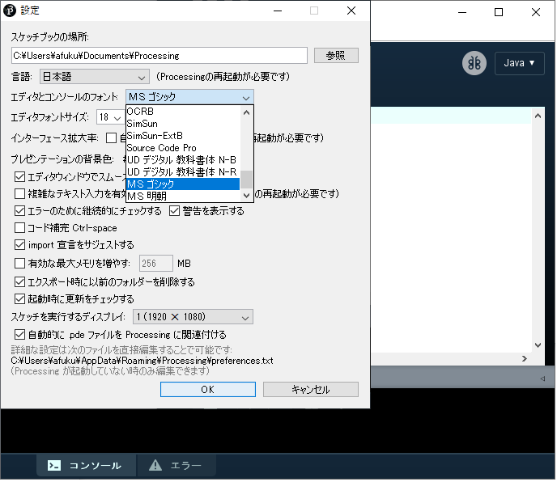


# プログラミングの基本

## プログラムの作成

- エディタウィンドウにプログラムを記述することでプログラミングを行う．
- プログラムは複数の「**文**」**Statement** から成る．
  - **セミコロン**(;)によって１つの文として区切る．
    下の図のように，それぞれの文の末尾にセミコロンを記述する必要がある．


- １つの文には，基本的には１つのProcessingの命令を記述する．
  - １つの文に複数の命令を記述することもある（後日解説）
- プログラム実行時，基本的には文が**上から下へ，順番に逐次実行**されていく．
  - プログラムの流れの制御は後日解説


## Processingの命令

- Processingには様々な命令が用意されている．

  - 例：線を描く，円を描く，色を変える
  - 公式リファレンス
    - https://processing.org/reference/
- 命令の名前は一つの単語となっており，スペースを含まない．

  - 例：`circle()`, `ellipse()`, `line()`, `point()`
- 2単語が複合した命令は，2単語目の頭文字に大文字が用いられる

  - 例：`rectMode()`, `colorMode()`, `noStroke()`

- 命令の後ろには命令に情報を渡すためのカッコ`()`が付く．

  - 付いていないものは命令ではなく，変数と呼ばれるものである．（後に解説）
  - カッコ`()`の中に**命令に渡す情報**を記述する．
    - 色，位置，大きさ，等
    - 渡せる情報の種類や数は命令によって異なる
  - 命令には複数の情報を渡すことができ，カンマ(,)で区切る
    - 例: `size( 400, 400 );` `fill( 100, 200, 100 );`

- これらの命令は，プログラムにおける**関数**の一種である．（後に解説）

- Processingにあらかじめ用意された命令を入力すると，エディタ上では色が変わる．
  この機能によりタイプミスの確認が容易になる．

  ​	下の図中の`size()`, `rect()` の単語部分の色が変わっていることに注目


## プログラムを書く際の最低限のルール

- 半角英数と数字を用いる（コメントは除く）
- 文末にはセミコロン（;）を入れる（忘れがち！）
- 大文字と小文字の区別があるので注意


## コンソールへの出力

`print()`

- コンソールエリアへ数値や文字列を出力する命令．

- プログラム処理の内容を視覚化し，問題が起こった場合原因を特定しやすくする．
  - 問題を特定し，修正を行うことをデバッグという
  - 詳しくはデバッグのページを参照のこと

- 変数の中の値をトレース（監視）することができる．

#### 書式

文字列はダブルクォーテーション「"」で囲むこと

```java
print( "文字列" );
```

```java
print( 値or変数 );
```

```java
print( "文字列" + 値or変数 );  // 文字列と値や変数を+を用いてつなげることも可能
```

##### 改行を含めたい場合

```java
println( 上記と同様のフォーマット );
```

#### 例

##### 文字列をコンソールに表示する

```java
print( "Hello Processing" );
```


##### 数値をコンソールに表示する

```java
println( 123 );
print( 4567 );
```


##### 数値と文字列をつなげて表示する

```java
print( "Answer is " + 12345 );
```

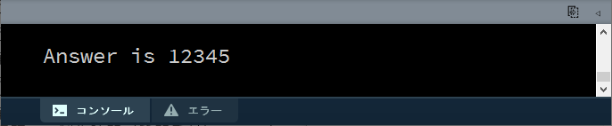


## 演習1

以下の出力を行うプログラムを書いてみましょう．
ただし，数（1,2,3）は文字列ではなく数値としてプログラムに記述すること．（""で囲まない）


## コメント

### コメントとは

- プログラムに影響を与えない影響を与えない文字列のこと
- 技術的には，コンパイル時に無視される部分

#### 書式

```java
//　←以降の１行がコメントとしてプログラムから無視される`
```
```java
/**
挟まれている複数の行が，
プログラムから無視される
*/
```

### 用途

- プログラムを（人が）読みやすくするメモとして用いる．
- プログラムの一部を一時的に実行しないように退避させるために用いる．

### 例

#### 複数命令の内容のメモとして用いる

```java
// ウィンドウを分割する
line(0, 50, 100, 50); // yoko
line(50, 0, 50, 100); // tate

// 円を描画する
circle(25, 25, 50);
```


#### プログラムの一部を無効にする

```java
/**

// ウィンドウを分割する
line(0, 50, 100, 50); // yoko
line(50, 0, 50, 100); // tate

*/

// 円を描画する
circle(25, 25, 50);
```


### 補足

#### 課題提出においてコメントは重要です

- プログラムの実行に影響を与えないと軽視しがちですが
- <u>コメントが含まれた状態のスケッチを提出</u>してもらい，それも加味して評価を行います．
  - <u>コメントを十分に含んだ分かりやすいスケッチ</u>が高く評価されます．
  - コメントがまったく含まれていない場合，作品がどれほど良質であっても評価が下方修正されます．

https://processing.org/reference/comment.html
https://processing.org/reference/doccomment.html


## コーディングに便利なキーボードの使い方

- エディタウィンドウでプログラムを記述するにあたり，以下のキーの使い分けを行えると便利です．

- コーディングの効率が上がります．
- できるだけ意識して使ってみましょう

### 文字消去

#### １文字先を消去: Delete

#### １文字前を消去: BackSpace

### カーソル移動

#### 行の先頭: Home

#### 行の末尾: End

#### 前のワードの先頭: Ctrl+←

#### 次の単語の末尾: Ctrl+→

#### ページ送り: PgUp

#### ページ戻り: PgDn

### 選択

#### カーソル位置から前後に選択範囲を延ばす: Shift+←or→

#### カーソル位置から行単位で選択範囲を延ばす: Shift+↑or↓

#### カーソル位置から前後の１単語を選択: Shift+Ctrl+←or→


## 演習2

1. Processing公式のExamplesをどれでもいいので実行してみましょう．

   https://processing.org/examples

- ソースコードをエディタウィンドウへコピー＆ペーストして実行してみましょう．
- 迷ったらColorカテゴリーのものが無難

2. 可能ならプログラムの一部の数値を書き換えて実行し，変化を確かめてみましょう．


## プログラミングの心構え

より高度な表現を追求すると，プログラムも必然的に複雑になる．
目的を達成するため，プランを練っても**何から手を付けていいか**分からなくなることも多い．
そのような状況は，<u>プログラミングの開始時に，完成までの道筋を立ててしまおう</u>という思考に陥ってしまっている可能性が高い．

実際，プログラミングを開始する時点では，完成までの道筋が見えていることは稀である．
トライアンドエラーを繰り返し，**少しずつ**プログラムを作っていくことが基本である．

### プログラミングの手順

プログラミングは以下の手順を繰り返すことで進めていく．

1. どんなコードをどこに追加するか考える．
2. コードを追加し，実行してみる．
3. 正しく動作した場合，ステップ1に戻る．
   正しく動作しなかった場合，<u>原因は何なのか推考</u>する．
4. 自分の推考を仮説ととらえ，それを元にプログラムに変更を加える．
   ステップ3に戻る．

特に上記手順の「原因が何なのか仮説を立て，変更を加え，それが正しいか確認する」プロセスによって**プログラミングへの理解**が深まることに留意すること．
一度に追加するコードは，自分のプログラミングスキルを加味し，最小限にすることが肝要である．
また，次に何のコードをどこに追加するかは，**追加するコードの優先度**を念頭に置くとよい．

### プログラムの記述優先度

1. 図形描画
   必要ならfor文を用いる
2. 座標変換
3. 変数を図形描画へ組み込む
4. 変数の値の更新式
   必要ならfor文やif文を用いる
5. 組み込んだ変数の宣言と初期化

上記の優先度を見ると，描画→初期化という順番であることが分かる．
つまり，<u>プログラムの処理の順番の逆順</u>にコードを優先的に記述することに留意．
なぜなら，**できるだけ早い段階で描画結果を見て確認できる**からである．

### まとめ

- プログラミングは少しずつプログラムを作っていくことが基本．
- 「少しプログラムを追加して実行し，確認する」の繰り返し．
- 描画のコードを優先的に追加し，早い段階で描画結果を見て確認できるようにする．


# 描画の基本

## 座標系について

- 画面はピクセルというモザイク状の点の集まりによって表現される．

- Processingでは左上を原点（0, 0）とし，右下に向かって座標値が大きくなる．
  - 下図は横680pixel, 縦480pixel の例


https://processing.org/tutorials/drawing/


## 画面のサイズを決める

`size()`

- 描画領域の大きさを指定する．
- プログラム冒頭に一度記述する．

### 書式

```java
size( 横のピクセル数, 縦のピクセル数 );
```

### 例

```java
size( 600, 200 );	// スクリーンサイズを横600ピクセル×縦200ピクセルに設定
```


https://processing.org/reference/size_.html


## 画面のサイズを取得する

`width` `height`

- 命令ではなく，変数と呼ばれるもの．
  - カッコ「()」が後ろに付かないことに注意．

- 必ずsize()記述以後に記述する必要がある．
- `size()` 命令以降に，画面サイズの数値の代わりに `width`, `height` を用いることができる．
  - 画面サイズの具体的な数値を繰り返し記述しなくてよい利点がある


### 書式
#### 横のピクセル数
`width`

#### 縦のピクセル数
`height`


### 例1

スクリーンの角から対角までの線を描画する．

```java
size(400,400);

// スクリーン右下へ線を描画する．
line(0, 0, width, height);
```

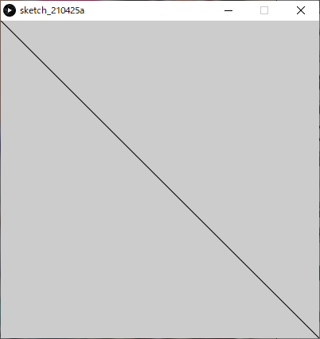

### 例2

- `width`, `height` を用いることで，スクリーンを元にした大きさの図形描画を行うことができる．
- 下の例では幅，高さともにスクリーンの２分の１の大きさの矩形（四角形）を描画している．

```java
size(600,400);

// 幅: 1/2, 高さ: 1/2 の矩形を描画する.
rect(0, 0, width/2, height/2);
```

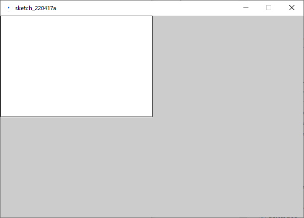

https://processing.org/reference/width.html
https://processing.org/reference/height.html


## 点を描画する

`point()`

- １つの点（ドット）を描画する．
- 色の指定が無ければデフォルトカラーのブラック(RGB:0,0,0)の色が描画される．
  - `stroke()` で指定したカラーが適用される．
    - ストローク（線）扱い

### 書式

```java
point( x座標値, y座標値 );
```

### 例

この例では６つの点の描画を行っている．
※ドットなので見えにくいです．

```java
point( 10, 25 );
point( 20, 25 );
point( 30, 25 );

point( 90, 75 );
point( 80, 75 );
point( 70, 75 );
```


https://processing.org/reference/point_.html


## 線を描画する

`line()`

- 始点と終点の２点それぞれのx,y座標値を記述する．
  - 順番は書式を参照のこと
- 色を指定する場合は`stroke()` で指定したカラーが適用される．

### 書式

```java
line( 始点x座標値, 始点y座標値, 終点x座標値, 終点y座標値 );
```

### 例1

始点x,y座標値:（30, 20）から終点x,y座標値: ( 85, 75)に線を描画する．

```java
line(30, 20, 85, 75);
```


### 例2 連続した線

下の例では`line()` を３つ記述することで連続した線の描画を行っている．

```java
stroke(255,0,0);        // R
line( 20, 20, 40, 40 );
stroke(0,255,0);        // G
line( 40, 40, 50, 70 ); // 一つ目の線の終わりの点からスタート
stroke(0,0,255);        // B
line( 50, 70, 80, 80 );	// 二つ目の線の終わりの点からスタート
```


https://processing.org/reference/line_.html

## 線を消去する

`noStroke()`

- 線の描画を行わないようにする．
- 命令に渡す情報は無いので，書式は下記のようになる
  - カッコ「()」の中に何も記述しない．

### 書式

```java
noStroke();
```

### 例

```java
noStroke();
rect(30, 20, 55, 55);
```


https://processing.org/reference/noStroke_.html

## 線の太さを設定する

`strokeWeight()`

- 線の太さをピクセル単位で設定する．

### 書式

```java
strokeWeight( 太さ );
```

### 例

```java
size(400, 400);

strokeWeight(4);   // 細
line(80, 80, 320, 80);

strokeWeight(16);  // 中
line(80, 160, 320, 160);

strokeWeight(40);  // 太
line(80, 280, 320, 280);
```


https://processing.org/reference/strokeWeight_.html


## 線の端の形状を設定する

`strokeCap()`

- 線の終端の形状スタイルを変更する．
- ３種類のスタイルを，定数を記述することで切り替えることができる．
  - デフォルトはROUND
  - ※定数：システムに事前に用意されている変更不可能な変数のようなもの

### ROUND

終端を丸くする．

#### 書式

```java
strokeCap(ROUND);
```

#### 例

```java
strokeWeight(12);
strokeCap(ROUND);
line(20, 50, 50, 50);
line(50, 50, 60, 80);
```


### SQUARE

終端を四角形にする．

#### 書式

```java
strokeCap(SQUARE);
```

#### 例

```java
strokeWeight(12);
strokeCap(SQUARE);
line(20, 50, 50, 50);
line(50, 50, 60, 80);
```


### PROJECT

終端を突き出し形状にする．

#### 書式

```java
strokeCap(PROJECT);
```

#### 例

```java
strokeWeight(12);
strokeCap(PROJECT);
line(20, 50, 50, 50);
line(50, 50, 60, 80);
```

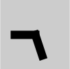

https://processing.org/reference/strokeCap_.html


## 演習1

1. `line()`を複数使用し，画面左端から始まり右端で終わる連続した線を自由に描画してみましょう．
   - 条件
     - スクリーンサイズ: 400, 400
     - 線の数や長さは自由
   - 下図は作成例
     - 8本の線で構成


2. 各線の太さや終端の形状を変化せ，より動きのある画面を作ってみましょう．（余裕がある人向け）
   - 以下は作成例


3. 作成したプログラムは後の演習で再利用するので，分かりやすい場所に保存しておきましょう．

※下に答えの一例がありますが，最初は見ずに自分でやってみましょう．

```java
size( 400, 400 );

strokeCap(PROJECT);
strokeWeight( 4 );
line( 0, 40, 50, 39 );

strokeWeight( 12 );
line( 50, 39, 100, 129 );

strokeWeight( 2 );
line( 100, 129, 150, 12 );

strokeWeight( 6 );
line( 150, 12, 200, 348 );

strokeCap(ROUND);
strokeWeight( 24 );
line( 200, 348, 250, 170 );

strokeCap(PROJECT);
strokeWeight( 18 );
line( 250, 170, 300, 48 );

strokeWeight( 2 );
line( 300, 48, 350, 178 );

strokeWeight( 1 );
line( 350, 178, 400, 189 );
```


## カラーモードの設定

`colorMode()`

- 色を扱うにはまず、プログラムで使用するカラーモードを指定する必要がある．
  - 基本的には**プログラム冒頭で一度だけ**行えばよい．

- カラーモードは図形や線，背景描画命令において，与えられた数値の解釈を変更するもの．
  - つまり，以後の「**色の指定のやり方**」を設定する．
  - 具体的な色の指定は別の命令で行う．
    - `fill()`, `stroke()` 等

- 具体的には以下の指定を行う必要がある．
  - カラーモデル（**RGB**, **HSB** 等）
  - 各チャンネルの最大値，**アルファ**（透明度）の最大値
    - 最大値の指定に迷ったら，255, 100, 1.0, 360(色相) 等のキリのいい値がおススメ．

#### 書式

いずれかを用いる．

##### RGBモードを指定
```java
colorMode(RGB, 最大値);
```
##### RGBモードを指定（各チャンネルの最大値を指定）

```java
colorMode(RGB, Rの最大値, Gの最大値, Bの最大値);
```

##### RGBモードを指定（各チャンネルとアルファの最大値を指定）

```java
colorMode(RGB, Rの最大値, Gの最大値, Bの最大値, アルファの最大値 );
```

##### HSBモードを指定

```java
colorMode(HSB, 最大値);
```
##### HSBモードを指定（各チャンネルの最大値を指定）
```java
colorMode(HSB, 色相の最大値, 彩度の最大値, 輝度の最大値);
```

##### HSBモードを指定（各チャンネルとアルファの最大値を指定）

```java
colorMode(HSB, 色相の最大値, 彩度の最大値, 輝度の最大値, アルファの最大値);
```

#### 例

##### 使用するカラーモデルをRGBに設定，各チャンネルの最大値を100とする．
```java
colorMode( RGB, 100 );
```
##### カラーモデルをHSBに設定し，色相の最大値を360とし，彩度と輝度の最大値を1,0とする．
```java
colorMode( HSB, 360, 1.0, 1.0 );
```

##### 使用するカラーモデルをRGBに設定，各チャンネルの最大値を255, アルファの最大値を100とする．

```java
colorMode( RGB, 255, 255, 255, 100 );
```

#### デフォルトのカラーモード

<u>カラーモードを明示的に指定していない場合</u>は，以下の初期設定が適用されている．

##### 使用するカラーモデルはRGB，最大値は255

```java
colorMode( RGB, 255 );
```


## 線の色を変える

`stroke()`

- 点，線，図形の（枠）線の色の変更を行う．
  - デフォルトはBlack(黒)色
- 図形描画を行う命令の前に記述する必要がある．
  - 直前の行である必要はない．
- もう一度`stroke()`が行われるまで，ここで指定した色が線色として使われ続ける．
  - 色を変更したい場合，別の色を`stroke()`を用いて再度指定する必要がある．

### 書式

```java
stroke( 色の書式 );  // colorMode設定に依存
```

### 例1

色を指定して線を描画する．

```java
// カラーモード; RGB，各チャンネルの最大値255
colorMode( RGB, 255 );

stroke( 250, 162, 20 );	// 線色指定
line(30, 20, 85, 75);		// 線の描画
```


### 例2

色を指定して図形の（枠）線を描画する．

```java
// カラーモード; HSB，色相最大値360, 彩度・明度最大値100
colorMode( RGB, 360, 100, 100 );

stroke( 300, 100, 50 );  // 線色の指定
rect(30, 20, 55, 55);    // 矩形の描画
```


https://processing.org/reference/stroke_.html


## 図形の塗りつぶし色を設定する

`fill()`

- 図形の塗りつぶし色の変更を行う．
  - デフォルトはWhite(白)色
- 図形描画を行う命令の前に記述する必要がある．
- `stroke()`と同じく，再度`fill()`が行われるまで，ここで指定した色が塗り色として使われ続ける．
  - 色を変更したい場合，別の色を`fill()`を用いて再度指定する必要がある．

### 書式

```java
fill( 色の書式 );　// colorMode設定に依存
```

### 例1

RGBモードで指定した例

```java
// カラーモード; RGB，各チャンネルの最大値255
colorMode(RGB, 255);

fill(204, 102, 0);		// 塗り色指定
rect(30, 20, 55, 55);	// 矩形描画
```


### 例2

HSBモードで指定した例

```java
// カラーモード; HSB，色相最大値360, 彩度・明度最大値1.0
colorMode( HSB, 360, 1.0, 1.0 );

fill(80, 0.8, 0.9);		// 塗り色指定
rect(15, 10, 55, 55);	// 矩形描画
```


### 例3

アルファを指定した例

```java
// カラーモード; RGB，各チャンネルの最大値255，アルファ最大値100
colorMode(RGB, 255, 255, 255, 100);

fill(204, 102, 0);			// 塗り色指定
rect(15, 10, 55, 55);	  // 左上の矩形描画

fill(0, 102, 200, 80);  // 塗り色（アルファ80）
rect(30, 20, 55, 55);	  // 右下の矩形描画
```


https://processing.org/reference/fill_.html


## 塗りつぶしを消去する

`noFill()`

塗りつぶしを無効にする．

```java
rect(15, 10, 55, 55);

noFill();							// 塗りつぶし無効
rect(30, 20, 55, 55);
```

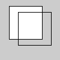

https://processing.org/reference/noFill_.html


## 色見本

### 色相と彩度のグラデーション

カラーモード指定において，カラーモデルとしてHSBを用いる場合，
色相と彩度の関係は下の図を参考にしてみてもよい．

```java
noStroke();
colorMode(HSB, 100); // カラーモード:HSB, 各値の最大値100
for (int i = 0; i < 100; i++)
{
  for (int j = 0; j < 100; j++)
  {
    stroke(i, j, 100);
    point(i, j);
  }
}
```


### R値とG値のグラデーション

```java
size(400,400);
noStroke();
colorMode(RGB, 400);	// カラーモード:RGB, 各値の最大値400
for (int i = 0; i < 400; i++)
{
  for (int j = 0; j < 400; j++)
  {
    stroke(i, j, 0);
    point(i, j);
  }
}
```


https://processing.org/reference/colorMode_.html


## 背景に色を付ける

`background()`

- 指定した色で**スクリーンの全体の塗りつぶし**描画を行う．
  - 背景として塗りつぶす場合，全ての描画命令の前に行う必要がある．
  - プログラムの最後の方に記述すると，それまで描画したものを塗りつぶしてしまう．
- この命令を使用しない場合の背景のデフォルトカラーはライトグレイ．
- アルファは基本的には使用できない．

### 書式

```java
background( 色の書式 );  // colorMode設定に依存
```

### 例

```java
// カラーモード; RGB，各チャンネルの最大値255，アルファ最大値100
colorMode(RGB, 255, 255, 255, 100);

background(255, 204, 0);  // 背景描画

fill(204, 102, 0);				// 塗り色指定
rect(15, 10, 55, 55);			// 左上の矩形描画

fill(0, 102, 200, 80);		// 塗り色（アルファ80）
rect(30, 20, 55, 55);			// 右下の矩形描画
```


https://processing.org/reference/background_.html

## グレーカラーを設定する

- グレーカラーを使用する場合，よりシンプルな方法がある．
  - 数値を一つだけ色設定命令に渡す．
  - `stroke()`, `fill()`, `background()`で同様に使える．
- `colorMode()`において指定した一つ目の最大値がグレーカラーの最大値として使用される．
  - colorMode(RGB, **100**, 100, 100 );
  - colorMode(HSB, **360**, 100, 100 )

### 書式

```java
stroke(数値);
```

```
fill(数値);
```

```
background(数値);
```

### 例

```java
size(400, 400);
colorMode( RGB, 255 );

background(10);          // 背景色

stroke(250);             // 矩形枠色
fill(153);               // 矩形塗り色

rect(120, 80, 220, 220);
```


## アンチエイリアスをかける

`smooth()`

### 書式

```java
smooth();
```

### アンチエイリアスを解除する

#### 書式

```java
noSmooth();
```

https://processing.org/reference/smooth_.html


## 演習2

前回の演習で作成したプログラムに色を付け，改良しましょう．

- 条件
  - `colorMode()`を用いてカラーモードを設定すること．
    - カラーモデルや各最大値は自由
  - できるだけ線毎に異なる色を設定すること．
  - 背景色も変更しましょう．
  - 以下，参考画像


※下に答えの一例がありますが，最初は見ずに自分でやってみましょう．

```java
size( 400, 400 );

colorMode( HSB, 360, 100, 100, 100 );

background( 60, 10, 100 );

strokeCap(PROJECT);
strokeWeight( 4 );
stroke( 7, 100, 80 );
line( 0, 40, 50, 39 );

strokeWeight( 12 );
stroke( 44, 100, 100 );
line( 50, 39, 100, 129 );

strokeWeight( 2 );
stroke( 202, 100, 60 );
line( 100, 129, 150, 12 );

strokeWeight( 6 );
stroke( 94, 100, 100 );
line( 150, 12, 200, 348 );

strokeCap(ROUND);
strokeWeight( 24 );
stroke( 298, 100, 60 );
line( 200, 348, 250, 170 );

strokeCap(PROJECT);
strokeWeight( 18 );
stroke( 233, 100, 100 );
line( 250, 170, 300, 48 );

strokeWeight( 2 );
stroke( 189, 100, 100 );
line( 300, 48, 350, 178 );

strokeWeight( 1 );
stroke( 237, 100, 100 );
line( 350, 178, 400, 189 );
```


# 図形描画

- 描画の基本において学習したのは，主に描画を実行する前の下準備の方法である．
  ここでは実際の描画を実行する命令について学習する．

- Processingにおいて，実際の描画を行う命令はこの章で述べる図形描画命令である．
  目標とする結果（画像）を達成するため，これらの命令を適切に組み合わせる必要がある．
- クイックスタートとしては，以下の図形を使用してみることを勧める．
  - 矩形描画 `rect()`
  - 楕円描画 `ellipse()`


## 三角形を描画する

`triangle()`

- 三角形を描画する．
- ３つの各頂点のx座標値，y座標値の情報を記述する．
  - 順番は下記の書式参考

### 書式

```java
triangle( 頂点1のx値, 頂点1のy値, 頂点2のx値, 頂点2のy値, 頂点3のx値, 頂点3のy値 );
```

### 例

```java
triangle(30, 75, 58, 20, 86, 75);
```


https://processing.org/reference/triangle_.html


## 矩形を描画する

`rect()`

- 矩形（長方形）を描画する．

- 渡す情報

  - 矩形の左上の頂点のx,y座標値

  - 矩形の幅，高さ

- 以下`rectMode()`の記述が無い場合のデフォルトの書式．


### 書式

```java
rect( 左上x座標, 左上y座標, 矩形の幅, 矩形の高さ );
```

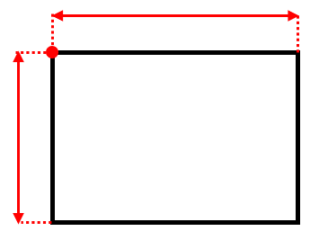

### 例

```java
size(400, 400);

rect( 20, 90, 300, 100 );
```


### 矩形（長方形）の描画方法を指定する

`rectMode()`

- 描画情報の指定方法は4種類あり，`rectMode()`で切り替えることができる．
  自分の実現したいことに適した方法を選ぶとよい．

- 4種類の定数を命令に渡す．
  - `CORNER`, `CORNERS`, `CENTER`, `RADIUS`
- `CORNER`モードを使用する場合は，rectMode()の記述は不要
  - 他のモードから`CORNER`モードへ変更する場合は必要


#### CORNER

- 詳細は前述の項を参照のこと．


- `rectMode()`の記述が無い場合のデフォルトのモード．

##### 書式

```java
rectMode(CORNER);
rect( 左上x座標, 左上y座標, 矩形の幅, 矩形の高さ );
```

#### CORNERS

渡す情報

- 矩形の左上の頂点のx,y座標値
- 矩形の右下の頂点のx,y座標値

##### 書式

```java
rectMode(CORNERS);
rect( 左上x座標, 左上y座標, 右下x座標, 右下y座標 );
```


#### CENTER

渡す情報

- 矩形の中心のx,y座標値
- 矩形の幅，高さ

##### 書式

```java
rectMode(CENTER);
rect( 中心x座標, 中心y座標, 矩形の幅, 矩形の高さ );
```


#### RADIUS

渡す情報

- 矩形の中心のx,y座標値
- 矩形の幅，高さの半分

##### 書式

```java
rectMode(RADIUS);
rect( 中心x座標, 中心y座標, 矩形の幅の半分, 矩形の高さの半分 );
```

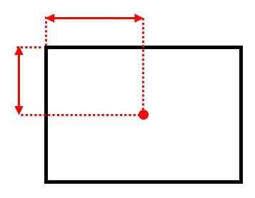

### 例1

`CORNER` と`CORNERS` を用いた例

```java
size(400, 400);
rectMode(CORNER);  				// Default rectMode is CORNER
fill(255);  							// Set fill to white
rect(100, 100, 200, 200); // Draw white rect using CORNER mode

rectMode(CORNERS);  			// Set rectMode to CORNERS
fill(100);  							// Set fill to gray
rect(100, 100, 200, 200); // Draw gray rect using CORNERS mode
```


### 例2

`RADIUS` と`CENTER` を用いた例

```java
size(400, 400);
rectMode(RADIUS); 				 // Set rectMode to RADIUS
fill(255);  							 // Set fill to white
rect(200, 200, 120, 120);  // Draw white rect using RADIUS mode

rectMode(CENTER); 				 // Set rectMode to CENTER
fill(100);  							 // Set fill to gray
rect(200, 200, 120, 120);  // Draw gray rect using CENTER mode
```


https://processing.org/reference/rect_.html


## 正方形を描画する

`square()`

- 正方形を描画する
- `rect()`の正方形バージョン
  - 正方形は幅と高さの大きさが同じであるので，大きさとして指定する数値が一つのみ
- `rect()`と同じく`rectMode()`の影響を受ける．
  - モード別の書式は割愛する．
  - `CORNERS`は機能しない
    - `CORNER`と同様の描画を行う？
  

### 書式

```java
square( 左上x座標, 左上y座標, 矩形の一辺の大きさ );
```

### 例

```java
size(400, 400);

square(120, 100, 220);
```


https://processing.org/reference/square_.html


## 四辺形を描画する

`quad()`

- 自由な四辺形を描くことができる．
- 4つの各頂点のx座標値，y座標値の情報を記述する．
  - 順番は下記の書式参考

### 書式

```java
quad( 頂点1のx値, 頂点1のy値, 頂点2のx値, 頂点2のy値, 頂点3のx値, 頂点3のy値, 頂点4のx値, 頂点4のy値 );
```

### 例

```java
quad(38, 31, 86, 20, 69, 63, 30, 76);
```


https://processing.org/reference/quad_.html


## 楕円を描画する

`ellipse()`

- 楕円を描画する．

- 渡す情報

  - 楕円の左上の頂点のx,y座標値

  - 楕円の幅，高さ

- 以下`ellipseMode()`の記述が無い場合のデフォルトの書式．


### 書式

```java
ellipse( 中心x座標, 中心y座標, 楕円の幅, 楕円の高さ );
```


### 例

```java
size(400, 400);

ellipse( 160, 190, 300, 200 );
```


### 楕円の描画方法を指定する

`ellipseMode()`

- 描画情報の指定方法は4種類あり，`ellipseMode()`で切り替えることができる．
  自分の実現したいことに適した方法を選ぶとよい．
  - `rectMode()` とほぼ同様

- 4種類の定数を命令に渡す．
  -  `CENTER`, `RADIUS`, `CORNER`, `CORNERS`
- `CENTER`モードを使用する場合は，`ellipseMode()`の記述は不要
  - 他のモードから`CENTER`モードへ変更する場合は必要

#### CENTER

- 詳細は前述の項を参照のこと．
- `ellipseMode()`の記述が無い場合のデフォルトのモード．

##### 書式

```java
ellipseMode(CENTER);
ellipse( 中心x座標, 中心y座標, 楕円の幅, 楕円の高さ );
```

#### RADIUS

渡す情報

- 楕円の中心のx,y座標値
- 楕円の幅，高さの半分

##### 書式

```java
ellipseMode(RADIUS);
ellipse( 中心x座標, 中心y座標, 楕円の幅の半分, 楕円の高さの半分 );
```


#### CORNER

- 詳細は前述の項を参照のこと．

- `ellipseMode()`の記述が無い場合のデフォルトのモード．


##### 書式

```java
ellipseMode(CORNER);
ellipse( 左上x座標, 左上y座標, 楕円の幅, 楕円の高さ );
```


#### CORNERS

渡す情報

- 楕円の左上の頂点のx,y座標値
- 楕円の右下の頂点のx,y座標値

##### 書式

```java
rectMode(CORNERS);
rect( 左上x座標, 左上y座標, 右下x座標, 右下y座標 );
```


### 例1

`CENTER` と`RADIUS` を用いた例

```java
size(400, 400);

ellipseMode(RADIUS);  				// Set ellipseMode to RADIUS
fill(255);  									// Set fill to white
ellipse(200, 200, 120, 120);  // Draw white ellipse using RADIUS mode

ellipseMode(CENTER);  				// Set ellipseMode to CENTER
fill(100);  									// Set fill to gray
ellipse(200, 200, 120, 120);  // Draw gray ellipse using CENTER mode
```


### 例2

`CORNER` と`CORNERS` を用いた例

```java
size(400, 400);

ellipseMode(CORNER);  				// Set ellipseMode is CORNER
fill(255);  									// Set fill to white
ellipse(100, 100, 200, 200);  // Draw white ellipse using CORNER mode

ellipseMode(CORNERS);  				// Set ellipseMode to CORNERS
fill(100);  									// Set fill to gray
ellipse(100, 100, 200, 200);  // Draw gray ellipse using CORNERS mode
```


https://processing.org/reference/ellipse_.html


## 正円を描画する

`circle()`

- 正円を描画する
- `ellipse()`の正円バージョン
  - 正円は幅と高さの大きさが同じであるので，大きさとして指定する数値が一つのみ
- `ellipse()`と同じく`ellipseMode()`の影響を受ける．
  - モード別の書式は割愛する．
  - `CORNERS`は機能しない
    - `CORNER`と同様の描画を行う？


### 書式

```java
circle( 中心x座標, 中心y座標, 円の直径 );
```

### 例

```java
size(400, 400);

circle(224, 184, 220);
```


https://processing.org/reference/circle_.html


## 度（度数法）をラジアン（弧度法）に変換する

`radians()`

- 円弧を描画したり，図形の回転を行う際に必要となる命令．
  - **角度**を指定する必要がある命令に必要．
- Processing で角度を用いるにあたり，おおくは角度をラジアン単位で指定する必要がある．
  - 我々が日常的に親しみのある単位は度数法「°」表記であるが，
    Processingではを**ラジアン（弧度法）単位へ変換**する必要がある．

#### 度⇒ラジアン　単位変換式

簡単な数式で書くと以下のようになる
$$
ラジアン=度 \times \frac{\pi}{180}
$$
この変換を簡単に実現する命令がProcessingには用意されている．
慣れない内はこの変換命令を使うと手っ取り早い．

#### 書式

```java
radians( 度 )
```

このような描画命令ではない**数値の変換のような命令**は，数値の代わりに他の命令へ組み込むことができる．
下の例では`print()`に組み込み，変換後の数値をコンソールに表示している．

#### 例1

45°をラジアンへ変換した値をコンソールに表示する．

```java
print( radians( 45 ) );
```


#### 例2

180°をラジアンへ変換した値をコンソールに表示する．

```java
print( radians( 180 ) );
```


https://processing.org/reference/radians_.html


## 円弧を描画する

`arc()`

- 以下の３種類の定数を使うことで，異なる円弧を描画できる．
  - `OPEN`, `CHORD`, `PIE`

### オープンな弧を描画する

`OPEN`

- 渡す情報

  - 弧の中心点のx,y座標値

  - 弧の幅，高さ

  - 弧の始まりと終わりの角度（ラジアン）

  - 定数 `OPEN`

#### 書式

角度の単位がラジアンだと以下のように記述する．

```java
arc( 中心のx座標, 中心のy座標, 横の直径, 縦の直径, 弧の始まりの角度rad, 弧の終わりの角度rad, OPEN );
```

角度をラジアンへ変換する命令を含めると以下のようになる

```java
arc( 中心のx座標, 中心のy座標, 横の直径, 縦の直径, radians( 弧の始まりの角度 ), radians( 弧の終わりの角度 ), OPEN );
```


#### 例

0°から始まり，225°で終わるオープンな弧

```java
arc(50, 50, 80, 80, radians( 0 ), radians( 225 ), OPEN);
```


### 閉じた弧を描画する

`CHORD`

- 弧上の始まりと終わりの点が弦のように線で結ばれる．

- 渡す情報
  - 定数以外は `OPEN`の場合と同様．

  - 定数 `CHORD`


#### 書式

角度の単位がラジアンだと以下のように記述する．

```java
arc( 中心のx座標, 中心のy座標, 横の直径, 縦の直径, 弧の始まりの角度rad, 弧の終わりの角度rad, CHORD );
```

角度をラジアンへ変換する命令を含めると以下のようになる

```java
arc( 中心のx座標, 中心のy座標, 横の直径, 縦の直径, radians( 弧の始まりの角度 ), radians( 弧の終わりの角度 ), CHORD );
```

#### 例

0°から始まり，225°で終わる閉じた弧

```java
arc(50, 50, 80, 80, radians( 0 ), radians( 225 ), CHORD);
```


### パイ状の弧を描画する

`PIE`

- 弧の中心から弧上の始まりと終わりのそれぞれの点へ線が結ばれる．

- 渡す情報
  - 定数以外は `OPEN`の場合と同様．

  - 定数 `PIE`

#### 書式

角度の単位がラジアンだと以下のように記述する．

```java
arc( 中心のx座標, 中心のy座標, 横の直径, 縦の直径, 弧の始まりの角度rad, 弧の終わりの角度rad, PIE );
```

角度をラジアンへ変換する命令を含めると以下のようになる

```java
arc( 中心のx座標, 中心のy座標, 横の直径, 縦の直径, radians( 弧の始まりの角度 ), radians( 弧の終わりの角度 ), PIE );
```

#### 例

0°から始まり，225°で終わるパイ状の弧

```java
arc(50, 50, 80, 80, radians( 0 ), radians( 225 ), PIE);
```


https://processing.org/reference/arc_.html


### 例

#### 円弧を用いた月の満ち欠けのような表現

```java
size( 400, 200 );
arc( 50, 100, 80, 80, radians(120), radians(420), CHORD );
arc( 50+100, 100, 80, 80, radians(135), radians(405), CHORD );
arc( 50+200, 100, 80, 80, radians(175), radians(365), CHORD );
arc( 50+300, 100, 80, 80, radians(190), radians(350), CHORD );
```

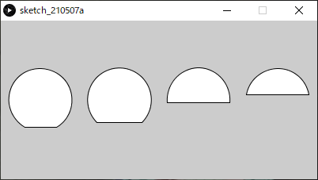


## 曲線を描画する

`curve()`

4点を結ぶ曲線の中間2点間が描画される．（スプライン曲線）

- 実際に描画されるのは描画点2点間のみ
- spline たわみ
  - 4点で囲まれた領域を丸く膨らませた曲線が生成される


### 用途

特定のある<u>囲まれた領域を丸く膨らませた図形</u>を生成したいとき

### 書式

```java
curve( 制御点1のx値, 制御点1のy値,
       描画点1のx値, 描画点1のy値,
       描画点2のx値, 描画点2のy値,
       制御点2のx値, 制御点2のy値 );
```

### 例

4点とを曲線で囲まれた領域

```java
size( 600, 600 );
background(255);

noFill();

// 濃い黒の曲線
stroke(0);
strokeWeight(4);
curve( 100, 100, 450, 200, 500, 350, 60, 500 );

// 薄い曲線
stroke(200);
strokeWeight(4);
curve( 450, 200, 500, 350, 60, 500, 100, 100 );
curve( 500, 350, 60, 500, 100, 100, 450, 200 );
curve( 60, 500, 100, 100, 450, 200, 500, 350 );

// 4つの点を赤く描画．
stroke(255,0,0);
strokeWeight(12);
point(100, 100);
point(450, 200);
point(500, 350);
point(60, 500);
```


https://processing.org/reference/curve_.html


## ベジェ曲線を描画する

`bezier()`

描画点（アンカーポイント）2点と制御点（スムーズポイント）2点から描画される曲線．

- 実際に描画されるのは描画点2点間のみ
- 制御点1から描画点1へ引いた直線が曲線に接する．
  制御点2から描画点2へ引いた直線が曲線に接する．
  - 以上の条件を満たす曲線が生成される．
  - これらの直線はIllustratorでいうハンドル
- Adobe Illustrator のパスとほぼ同様
  - アンカーポイント
  - スムーズポイント，コーナーポイント
  - ハンドル


### 書式

`curve()`の場合と描画点，制御点の記述順が異なることに注意．

```java
bezier( 描画点1のx値, 描画点1のy値,
        制御点1のx座標, 制御点1のy座標,
       	制御点2のx値, 制御点2のy値,
        描画点2のx座標, 描画点2のy座標 );
```

### 例

```java
size( 600, 600 );
background(255);

noFill();

// 薄い直線（ハンドル）
stroke(200);
strokeWeight(4);
line( 100, 100, 450, 200 );
line( 500, 350, 60, 500 );

// 濃い黒の曲線
stroke(0);
strokeWeight(4);
bezier( 450, 200, 100, 100, 60, 500, 500, 350 );

// 4つの点を赤く描画．
stroke(255,0,0);
strokeWeight(12);
point(100, 100);
point(450, 200);
point(500, 350);
point(60, 500);
```


https://processing.org/reference/bezier_.html


## 多角形を描画する

多角形描画は複数の文を記述する必要がある．

1. はじめに`beginShape();`と記述．
2. 必要な頂点の数だけ `vertex( x座標, y座標 );` を記述する．
3. 最後に `endShape();` を記述し，多角形描画を終了する．
   ※なお、`endShape(CLOSE);`と記述することで閉じた形状を描画できる．

### 書式

```java
beginShape();							// 形状の開始宣言

// 頂点座標（頂点の数だけ複数記述する必要がある）
vertex( 頂点1のx値, 頂点1のy値 );
vertex( 頂点2のx値, 頂点2のy値 );
vertex( 頂点3のx値, 頂点3のy値 );
vertex( 頂点4のx値, 頂点4のy値 );
vertex( 頂点5のx値, 頂点5のy値 );
vertex( 頂点6のx値, 頂点6のy値 );
vertex( 頂点7のx値, 頂点7のy値 );
vertex( 頂点8のx値, 頂点8のy値 );

endShape(CLOSE);					// 形状の終了宣言
```

### 例1

```java
beginShape();
vertex(20, 20);
vertex(40, 20);
vertex(40, 40);
vertex(60, 40);
vertex(60, 60);
vertex(20, 60);
endShape(CLOSE);
```


### 例2

矢印状の図形

複雑な形状は事前に方眼紙等に下書きをし，下図のような計画を立てるとよい．

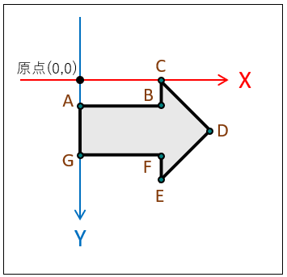

```java
beginShape();
vertex( 0, 20 );		// A
vertex( 60, 20 );		// B
vertex( 60, 0 );		// C
vertex( 100, 30 );	// D
vertex( 60, 60 );		// E
vertex( 60, 40 );		// F
vertex( 0, 40 );		// G
endShape(CLOSE);
```


https://processing.org/reference/beginShape_.html
https://processing.org/reference/vertex_.html
https://processing.org/reference/endShape_.html


## 演習

図形を一つ自由に描画してみましょう．

条件

- スクリーンサイズ: 400, 400
- 描画する図形は自由
- 少なくとも図形には塗りつぶし色を設定すること．
- 余裕があれば線の色や太さなど，自由に変更してみましょう．
- 下図は多角形を描画した場合の参考図


※下に答えの一例がありますが，最初は見ずに自分でやってみましょう．

```java
size( 400, 400 );

colorMode( RGB, 100, 100, 100 );

background( 89, 60, 60 );

// 色
stroke( 80, 2, 0 );
fill( 10, 9, 49 );

// 線の太さ
strokeWeight( 6 );

beginShape();

vertex( 20, 60 );
vertex( 220, 80 );
vertex( 340, 210 );
vertex( 280, 390 );
vertex( 190, 210 );

endShape(CLOSE);
```


# 座標変換（平行移動，回転，拡大縮小）

- 図形描画を用いてレイアウトを行うにあたり，図形を平行移動，回転，または拡大縮小させると，より表現の幅が広がる．
  このような操作をトランスフォーム( Transform )と呼ぶ．
- Processing においてトランスフォームを実現するには**座標変換**を用いる．

- 座標変換を理解する前に，Processingにおける**座標系**について学習する．

## 座標系( Coordinate system )

- 空間内の特定の位置を点で示す決まりごとのこと．
- 具体的には以下の要素を内包する
  - 原点
  - 単位
  - 各方向軸の向き( X軸, Y軸, Z軸 )
- ＣＧに関連する座標系はアプリケーションによって異なるものが導入されている．
  - 混乱を避けるためできるだけ合わせようという流れはあるが


### Processing の座標系

Processing のようなスクリーン（二次平面）上で図形の操作を行うアプリケーションにおいては，**2次元の座標系**が導入されている．

#### 2次元の座標系

- 描画を行うための基準．
- X軸とY軸が互いに直交し，交わるところに原点がある．

- <u>プログラム開始時点における</u>座標系を，シンプルな矩形を描画するプログラムと共に以下に示す．

```java
rect( 20, 20, 40, 40 );
```


## 座標変換とは

この座標系（X軸,Y軸,原点）を並行移動，回転，拡大縮小することを**座標変換**という．
<u>図形が変換されるのではない</u>ことに注意

### 平行移動


------

### 回転


------

### 拡大縮小


### 座標変換後の描画

<u>座標変換を実行した後に</u>図形描画を行うことにより，ウィンドウ上では図形が平行移動，回転または拡大縮小したように描画される．


## 平行移動

`translate()`

- 座標系をX,Y軸のプラス「+」方向へ平行移動させる．
  - マイナス「-」の値を与えると，逆のマイナス方向へ平行移動

- 同様の操作を`translate()`を使わずに行えるが，こちらを使った方が簡単な場合が多い．

### 書式

```java
translate( x移動量, y移動量 );
```

### 仕組み

#### 平行移動を<u>行わず</u>描画を行った場合


#### 平行移動を行った後に描画を行った場合


### 例

#### １つの家の図の描画

```java
size(400, 100);
background(255);

triangle(15, 0, 0, 15, 30, 15);
rect(0, 15, 30, 30);
rect(12, 30, 10, 15);
```


#### 平行移動後による複数の家の図の描画

同じ構造の図形を繰り返し描画する際，よりシンプルにできる．

```java
size(400, 100);
background(255);

// 一つ目
triangle(15, 0, 0, 15, 30, 15);
rect(0, 15, 30, 30);
rect(12, 30, 10, 15);

translate(40, 0); // x軸方向に40移動 

// 二つ目
triangle(15, 0, 0, 15, 30, 15);
rect(0, 15, 30, 30);
rect(12, 30, 10, 15);

translate(40, 0); // x軸方向にさらに40移動

// 三つ目
triangle(15, 0, 0, 15, 30, 15);
rect(0, 15, 30, 30);
rect(12, 30, 10, 15);
```


https://processing.org/reference/translate_.html


## 回転

`rotate()`

- 座標を<u>原点を中心に</u>時計回りに回転させる．
  - マイナス「-」の角度を指定すると反時計回りに回転

### 書式

```java
rotate( 角度 );  // 単位：ラジアン
```

ラジアンに慣れていない人はこう書くとよい．

```java
rotate( radians( 角度 ) );  // 度数法をラジアンに変換
```

### 仕組み

#### 回転


#### 描画


### 例1

原点を中心に15°回転させ，矩形描画を行う．

```java
size( 400, 400 );
background( 255 );

fill( 0, 0, 255 );
noStroke();

// 以下，回転と矩形描画の繰り返し．
rotate( radians(5) );
rect( 300, 0, 40, 20 );

rotate( radians(15) );
rect( 300, 0, 40, 20 );

rotate( radians(15) );
rect( 300, 0, 40, 20 );

rotate( radians(15) );
rect( 300, 0, 40, 20 );

rotate( radians(15) );
rect( 300, 0, 40, 20 );

rotate( radians(15) );
rect( 300, 0, 40, 20 );

rotate( radians(15) );
rect( 300, 0, 40, 20 );
```


### 例2

<u>スクリーン中央を中心に回転</u>させたい場合

1. スクリーン中心へ平行移動を行う．


2. 座標を回転させる．

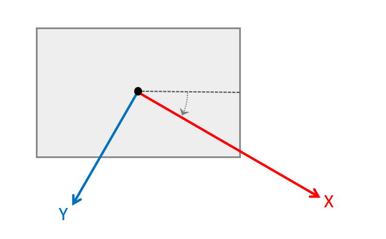

3. 図形の描画を行う．
   手順2に戻る．


```java
size( 400, 400 );
background( 255 );

fill( 0, 0, 255 );
noStroke();

// 原点をスクリーン中心へ移動
translate( width/2, height/2 );

// 以下，回転と矩形描画の繰り返し．

rect( 100, 0, 40, 20 );

rotate( radians(45) );
rect( 100, 0, 40, 20 );

rotate( radians(45) );
rect( 100, 0, 40, 20 );

rotate( radians(45) );
rect( 100, 0, 40, 20 );

rotate( radians(45) );
rect( 100, 0, 40, 20 );

rotate( radians(45) );
rect( 100, 0, 40, 20 );

rotate( radians(45) );
rect( 100, 0, 40, 20 );

rotate( radians(45) );
rect( 100, 0, 40, 20 );
```


https://processing.org/reference/rotate_.html


### 例3

時計の針のような描画

```java
size( 300, 300 );

translate( width/2, height/2 );  // 原点をスクリーン中心に移動. 

strokeWeight(1);
line( 0, 0, 100, 0 ); 
rotate( radians(30) );    // 30度回転.

strokeWeight(4);
line( 0, 0, 100, 0 ); 
rotate( radians(50) );    // 50度回転.

strokeWeight(6);
line( 0, 0, 100, 0 ); 
rotate( radians(70) );    // 80度回転.

strokeWeight(8);
line( 0, 0, 100, 0 ); 
rotate( radians(80) );    // 90度回転.

strokeWeight(10);
line( 0, 0, 100, 0 );
```


## 拡大縮小

`scale()`

原点を基点に空間の大きさをスケーリングする．

- 拡大すると原点から外側へ向けて，見た目の座標や大きさが引き延ばされる．
  - 縮小すると原点へ向けて，見た目の座標や大きさが縮められる．
- 命令へ渡す値は`1.0`が等倍である．
  - 例えば`2.0`を渡すと2倍に拡大される．

### 書式

```java
scale( 拡大率 );
scale( x拡大率, y拡大率 );
```

### 仕組み

#### 拡大縮小を<u>行わず</u>描画を行った場合


#### 拡大縮小を行った後に描画を行った場合

下の図では上図と同じ描画命令を行っている．
拡大を行ったことで，以下の変化に注目．

- 図形の大きさだけでなく，２つの図形の間隔も大きくなっている．
- 円が原点から遠ざかる方向へ移動している．


### 例

見た目の大きさはかわっているが，`rect()`に<u>渡している値は同じ</u>であることに注目

```java
size(200,200);
background(255);

stroke(128);
rect(20, 20, 40, 40);		// 小さい矩形

scale(2.0);							// 2倍に拡大

stroke(0);
rect(20, 20, 40, 40);		// 大きな矩形
```


https://processing.org/reference/scale_.html


## 座標系の保存と復帰

- 座標変換の命令を使用すると，変化した座標系はそのまま残り続ける．
  - 目的によってはこのことが不都合となる場合がある．
- Processingにはある時点の座標系を保存したり，保存した時点の座標系に戻したりする機能が存在する．
- 座標系の詳細は数学における行列が深くかかわっているが，本授業では掘り下げない．
- 以下の二つの命令を任意の場所に記述し，使うことができれば問題ない．

### 書式

#### 座標系を保存する

```java
pushMatrix();
```

#### 座標系を保存した時点に戻す

```java
popMatrix();
```

### 使い方

プログラムの処理の順を追って説明する．

1. **`pushMatrix()`**で座標系を保存しておく．
2. 座標変換と各種描画の命令
   - **`translate()`, `rotate()`, `scale()`**
   - 図形描画
3. **`popMatrix()`**で初期の座標系に戻す．

### 例

座標変換を行った後に白の矩形を描画し，
座標系を初期に戻した後に黒の矩形を描画する．

```java
size(500, 500);

pushMatrix(); 									// 座標系の記憶 

translate(250, 250);						// 移動
rotate( radians(30) );					// 回転
scale(2.0);											// 拡大

rect(0, 0, 50, 50);     				// 白の矩形

popMatrix(); 										// 座標系を元に戻す

fill(0);
rect(0, 0, 50, 50);     				// 黒の矩形
```


### 複数の座標系の保存

pushMatrix()とpopMatrix()は，座標系データをQueue形式で出し入れしている．
**複数の**座標系データを保存できる．

#### Queue（キュー）とは

- **先に入れたデータを先に取り出す**．FIFO( First In First Out )
- 追加(**push**)したデータをあたらしい順に取り出す(**pop**)仕組み．

したがって，pushMatrix()とpopMatrix()を入れ子構造で使用すると，新しく保存した座標系から古いものへ，
という順に取り出される．


#### 具体的なプログラム記述

Queueの仕組みがわかると理解しやすい．


### 例

角度と位置を変化させながら楕円を４つ描画する

```java
size( 400, 400 );

colorMode( RGB, 100, 100, 100 );

background( 60, 60, 80 );

// 色
stroke( 80, 62, 70 );
fill( 90, 90, 49 );

// 線の太さ
strokeWeight( 6 );

translate( 100, 60 );

pushMatrix();  // 座標系保存
rotate( radians(20) );
ellipse( 0, 0, 100, 20 );
popMatrix();   // 座標系を戻す

translate( 40, 80 );

pushMatrix();  // 座標系保存
rotate( radians(60) );
ellipse( 0, 0, 100, 20 );
popMatrix();   // 座標系を戻す

translate( 40, 110 );

pushMatrix();  // 座標系保存
rotate( radians(40) );
ellipse( 0, 0, 100, 20 );
popMatrix();   // 座標系を戻す

translate( 80, 80 );

pushMatrix();  // 座標系保存
rotate( radians(4) );
ellipse( 0, 0, 100, 20 );
popMatrix();   // 座標系を戻す
```


https://processing.org/reference/pushMatrix_.html
https://processing.org/reference/popMatrix_.html


## 平行移動と回転の組み合わせ

- 平行移動と回転を組み合わせると難解になる．

- スケッチブックや方眼紙に座標系の変換を**メモ**するなど，工夫してみましょう．

### 平行移動+回転

#### 1. 平行移動


***

#### 2. 回転


***

#### 3. 図形描画


***


### 回転+平行移動

あまり推奨しない

- 初めに回転を行うとその後の平行移動は感覚的に理解し難い．
- できるだけ先の「平行移動→回転」を用いることをすすめる．

#### 1. 回転


***

#### 回転後の平行移動の考え方

- 回転後の平行移動は特に注意
  - **回転後のX,Y軸を元に**移動する．


***

#### 2. 平行移動


### 例

３つの花のような図の描画

```java
size(400, 400);

pushMatrix();

// 左上の花の座標
translate( 60, 100 );

// 左上花の中央部
fill( 250, 100, 0 );
circle( 0, 0, 60 );

// 左上花弁
fill( 255, 255, 0 );
ellipse( 60, 0, 60, 10 );
rotate( radians(60) );
ellipse( 60, 0, 60, 10 );
rotate( radians(60) );
ellipse( 60, 0, 60, 10 );
rotate( radians(60) );
ellipse( 60, 0, 60, 10 );
rotate( radians(60) );
ellipse( 60, 0, 60, 10 );
rotate( radians(60) );
ellipse( 60, 0, 60, 10 );

// 座標系を戻す
popMatrix();
// 再度現在の座標系を保存
pushMatrix();

// 中央の花の座標
translate( 210, 200 );

// 中央の花の中央部
fill( 255, 20, 0 );
circle( 0, 0, 60 );

// 中央の花の花弁
fill( 245, 245, 0 );
rotate( radians(20) );
ellipse( 60, 0, 60, 10 );
rotate( radians(60) );
ellipse( 60, 0, 60, 10 );
rotate( radians(60) );
ellipse( 60, 0, 60, 10 );
rotate( radians(60) );
ellipse( 60, 0, 60, 10 );
rotate( radians(60) );
ellipse( 60, 0, 60, 10 );
rotate( radians(60) );
ellipse( 60, 0, 60, 10 );

// 座標系を戻す
popMatrix();

// 右下の花の座標
translate( 340, 320 );

// 右下の花の中央部
fill( 195, 180, 0 );
circle( 0, 0, 60 );

// 右下の花の花弁
fill( 255, 255, 0 );
rotate( radians(30) );
ellipse( 60, 0, 60, 10 );
rotate( radians(60) );
ellipse( 60, 0, 60, 10 );
rotate( radians(60) );
ellipse( 60, 0, 60, 10 );
rotate( radians(60) );
ellipse( 60, 0, 60, 10 );
rotate( radians(60) );
ellipse( 60, 0, 60, 10 );
rotate( radians(60) );
ellipse( 60, 0, 60, 10 );
```


## 演習1

図形を平行移動させて複数描画してみましょう．

条件

- スクリーンサイズ 400, 400
- 描画する図形の種類，数，位置や大きさなどは自由
- 余裕があれば
  - 色や線の太さの変更
  - 回転や縮小
- 下図は楕円を使用した場合の作成例


※下に答えの一例がありますが，最初は見ずに自分でやってみましょう．

```java
size( 400, 400 );

colorMode( RGB, 100, 100, 100 );

background( 80, 60, 80 );

// 色
stroke( 70, 62, 80 );
fill( 90, 90, 0 );

// 線の太さ
strokeWeight( 4 );

translate( 60, 160 );
ellipse( 0, 0, 20, 80 );

translate( 60, 60 );
ellipse( 0, 0, 20, 80 );

translate( 60, 100 );
ellipse( 0, 0, 20, 80 );

translate( 60, -220 );
ellipse( 0, 0, 20, 80 );

translate( 60, 100 );
ellipse( 0, 0, 20, 80 );

translate( 60, -30 );
ellipse( 0, 0, 20, 80 );

```


## 演習2

これまで学んだ命令を自由に使い，自由に画像を作成してみましょう．

条件

- 授業時間の間でできるだけ仕上げることを心がけましょう．
- 規模が大きくなってきたらコメントを適度に記述しましょう．
  - エラーが起こっても原因を特定しやすくなります．
- 作ったプログラムファイルは適切な場所に保存しておきましょう．


# 演算と変数

## 文と演算・変数

### 文とは

- Statement ．手続きを表す．

- プログラムは基本的に複数の文から構成される．
- 逐次実行される．(手続き型言語)
- セミコロン「；」 で区切られている部分が一つの文となる．

```java
size(200,200);          // 文
rectMode(CENTER);       // 文
rect(100,10020,100);    // 文
```

- 主に二種存在する．
  - 宣言文 Declarative Statement
    - データの記憶領域をメモリに作る指示
    - 変数に関連する．
  - 命令文 Imperative Statement
    - アルゴリズム（手続き）を指示.
    - これまで記述してきた分はこちら．
    - 通常の命令文の他に以下のようなものがある．
      - 代入文
      - 制御文（今後学習する．）

```java
int a;      						 // 宣言文

a = 20;									 // 命令文（代入文）
ellipse( 0, 0, a, 80 );  // 命令文
```

### 文を構成する要素

- 文を構成する要素を下の表のように分けることができる．
  - 今後学習を進めていく上で，<u>今自分が学んでいることがどこに当たるのか</u>度々振り返るとより理解が容易になる．
- この章では**式**，**演算子**，**変数**について学ぶ．
  - 値は前章まででも用いていたが，今後もより関係してくる．
- 関数は後の章で学ぶ

| 文の例                                                       |  要素  |
| ------------------------------------------------------------ | :----: |
| line( 0, 0, 0, <span style="color: red; ">**a + 1**</span> ); |   式   |
| line( <span style="color: red; ">**0**</span>, <span style="color: red; ">**0**</span>, <span style="color: red; ">**0**</span>, a + <span style="color: red; ">**1**</span> ); |   値   |
| line( 0, 0, 0, <span style="color: red; ">**a**</span> + 1 ); |  変数  |
| line( 0, 0, 0, a <span style="color: red; ">**+**</span> 1 ); | 演算子 |
| <span style="color: red; ">**line(**</span> 0<span style="color: red; ">,</span> 0<span style="color: red; ">,</span> 0<span style="color: red; ">,</span> a + 1 <span style="color: red; ">**)**</span>; |  関数  |
| <span style="color: red; ">**line( 0, 0, 0, a + 1 );**</span> |   文   |

## 何ができるのか

- 今後の学習内容の前提知識としての演算と変数

  - 制御文の記述

  - アニメーション

- 数値計算により造形ができる．

  - 演算，変数までの知識でも一定の表現が行える．
    - **座標**，**大きさ**，**色**といった情報を数値計算により求めることができる．
  - 下図は三角形の組み合わせた図を数値計算によって生成するプログラムの例
    - 各点に事前に番号を割り振り，それぞれの座標値を数値計算で求めておく．
    - 算出した座標値を元に，`triangle()`を使って各三角形を描画する．


```java
size(400,400);

// 各交点の座標値を事前に計算しておく．

int iPoint0X = width/2;
int iPoint0Y = 0;

int iPoint1X = 0;
int iPoint1Y = height;

int iPoint2X = width;
int iPoint2Y = height;

int iPoint3X = width/2;
int iPoint3Y = height;

int iPoint4X = width/4;
int iPoint4Y = height/2;

int iPoint5X = int(width*(3/4.0));
int iPoint5Y = height/2;

// 上の三角形を描画
fill( 255, 0, 0 );
triangle( iPoint0X, iPoint0Y, iPoint4X, iPoint4Y, iPoint5X, iPoint5Y );

// 左の三角形を描画
fill( 0, 255, 0 );
triangle( iPoint4X, iPoint4Y, iPoint1X, iPoint1Y, iPoint3X, iPoint3Y );

// 右の三角形を描画
fill( 0, 0, 255 );
triangle( iPoint5X, iPoint5Y, iPoint3X, iPoint3Y, iPoint2X, iPoint2Y );

// 真ん中の逆三角形を描画
fill( 255, 255, 255 );
triangle( iPoint3X, iPoint3Y, iPoint4X, iPoint4Y, iPoint5X, iPoint5Y );
```


## 演算とは

コンピュータにとっての計算のこと．
以下のような種類がある．

- 算術演算

  - 主に10進数を2つ以上用いて結果を得る．四則演算．
    - 加算：足し算 「+」
    - 減算：引き算 「−」
    - 乗算：掛け算 「×」
    - 除算：割り算 「÷」
- 論理演算

  - 真か偽のどちらか（２進数）を2つ以上用いて結果を得る．結果は真か偽．

  - 後に条件式の要素の一つとして学習する．
- 比較演算
  - 数値を2つ以上用いて結果を得る．結果は真か偽．
  - 後に条件式の要素の一つとして学習する．


演算を<u>プログラム上で表す表現方法が</u>**式**である．

本章では**算術演算**を表現する式について学習する．


## 値

### 値とは

- Value．数値のこと．
- 数学的には複雑だが，本授業では以下の二種類を抑えておく．
  - 変数の学習において重要になる．
- 整数

  - 以下のような数のこと．

  $$
  -1,\quad-2,\quad  0,\quad  1,\quad  2,\quad12,\quad345
  $$

  - 小数を含まない．
  - 負（−）の数を含む．
- 実数

  - 以下のような数のこと

  $$
  -1.23,\quad0,\quad2.34,\quad567.8,\quad123456.9
  $$

  - 整数に小数を含めたもの．

### プログラムにおける記述方法

#### 整数

- 負の値を表現する際はハイフン「`-`」を先頭に記述する．

`-12`

`-213`

`1234`

`2134567`

#### 実数

- 小数点としてドット「.」を記述する．
- 小数の桁数は任意の長さにできる．

`-12.3`

`-213.45`

`1234.567`

`2134567.89`


## 式

### 式とは

- Expression

- コンピュータにとっての「数式」を表す表現．

  - 以下，簡単な数式の例

  $$
  1 + 2 = 3 \\
  2 - 1 = 1 \\
  3 \times 2 = 6 \\
  6 \div 3 = 2
  $$

- 文と違い，**値**（答え）をもつ．

- 式は基本的には文の中の要素の一つ．
  - 式だけでは文として成り立たず，プログラムが実行できない．

### プログラムにおける記述方法

- 主に**値と演算子**を組み合わせたもの．
- 式により記述方法が異なる．
  - 以後，式の種類別に解説する．


## 算術式

### 算術式とは

- 数値を計算する式のこと．
- 計算結果を値として持つ．
- 四則演算が代表的な算術式による演算方法である．

### 四則演算

- 四則演算は算術計算において最も基本的な４つの計算方法．
- 下の数式は算数における四則演算の記述方法．

$$
a + b\\
a - b\\
a \times b\\
a \div b\\
$$

### 演算子

- 算術式において，演算記号（+,−,×,÷）を表現するもの．
- 算術式をプログラムで記述する場合，演算記号（+,−,×,÷）が一部異なることに注意．
  - 以下に演算記号とプログラムにおける演算子の対応表を記載する．

| 算数（演算記号） | プログラム（演算子） | 記号の読み方 | 日本語キーボードにおけるキーの場所の対応 |
| :---------------: | :------------------: | :------------------: | :------------------: |
| +                | `+`                  | プラス               | Shift + 「れ」 |
| −                | `-`                  | ハイフン            | 「ほ」       |
| ×                | `*`                  | アスタリスク            | Shift + 「け」 |
| ÷                | `/`                  | スラッシュ             | 「め」          |

### 四則演算を表す式

- 演算子と数値を組み合わせることで（算術）式を記述できる．
- 以下に計算の種類と式の記述方法の対応表を記載する．
  - 算数の式と違い，「=」を記述しないことに注意．

| 計算   | 種類 | 式      |
| ------ | ---- | ------- |
| 足し算 | 加算 | `a + b` |
| 引き算 | 減算 | `a - b` |
| かけ算 | 乗算 | `a * b` |
| 割り算 | 除算 | `a / b` |

### **四則**混合

- 四則演算が混じった計算のこと．

$$
( a + b ) - c \times d \div e
$$

- プログラムにおける算術式においても，もちろん表現できる．

  - 上記の数式を算術式で表現すると以下のようになる．

    ```java
    ( a + b ) - c * d / e
    ```

- 算数と同様に，計算する順番が決まっている．

  - 算数と同様の順番である．
  - 具体的な順番については，後の「算術演算子の優先順位」で説明する．

### 算術式の文への組み込み

左記に述べたように，式はそれだけでは機能しない．
文へ組み込む必要がある．

#### 主な組み込み方

- 式はこれまで具体的な値（数値）を記述していた場所に，値の代わりに記述することができる．
  - 式は計算結果を値としてもつ．
- 以下，文へ組み込む具体的な例を記載する．

#### 例1

`print()`で，計算の答えをコンソールへ表示する．

```java
print("answer=");
println( (5+4-2)*6/3 );
```


#### 例2

- `rect()`で，サイズの倍率が異なる矩形を複数描画する．
- 倍率を指定する数値として小数を使っている．

```java
size(200,200);

rect( 0, 0, 180, 180 );
rect( 0, 0, 180*0.9, 180*0.9 );
rect( 0, 0, 180*0.8, 180*0.8 );
rect( 0, 0, 180*0.6, 180*0.6 );
rect( 0, 0, 180*0.4, 180*0.4 );
```


### 除算（割り算）の注意点

- 除算において，割る数のことを**除数**という．

- 小数を含む値を求めたい場合，**除数（割る数）に小数点「．」を記述**する必要がある．
  - つまり，実数で割る必要がある．
  - 小数点を記述すれば値が実数として扱われる．


#### 例1

小数点以下まで算出される記述例．

```java
println( 255 / 200. );
```

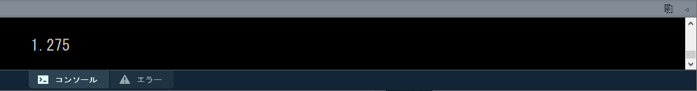

- 小数点を記述しない場合，**以下のように小数点以下が切り捨てられる**．

#### 例2

小数点以下が切り捨てられる記述例．

```java
println( 255 / 200 );
```


- 特に四則混合の場合，気を付けなければ計算結果が意図せぬ値になってしまう場合が多い．
- 除算の余りを求める記述方法もある．

### 剰余算

- 「割り算の余り」を求める記述．
- 割り算の余りを剰余という．

#### 式

| 計算           | 種類   | 式      |
| -------------- | ------ | ------- |
| 剰余を取得する | 剰余算 | `a % b` |

#### 演算子

| 算数（演算記号） | プログラム（演算子） | 記号の読み方 | 日本語キーボードにおけるキーの場所の対応 |
| :--------------: | :------------------: | :----------: | :--------------------------------------: |
|        ÷         |         `%`          |  パーセント  |              Shift +「え」               |

#### 例

ある数値が偶数か奇数かをコンソールに表示する．

```java
// 偶数なら0，奇数なら1を表示する
println("EVEN:0, ODD:1");

// 2で割った余りが0か1かで判定できる．
print( 641075319%2 );
```


### 算術演算子の優先順位

- ある一つの四則混合の計算が行われる際，内部の一つ一つの演算が順番に実行されていく．
- この順番は算数の四則計算に準じる．
  - 式の左から逐次実行されるわけではない．
  - 下の表において，優先度の高い演算子から順番に演算が行われる．

| 優先度 | 種類         | 演算子 |
| ------ | ------------ | ------ |
| 高い   | 括弧(カッコ) | `( )`  |
|        | 乗算         | `*`    |
|        | 除算         | `/`    |
|        | 剰余算       | `%`    |
|        | 加算         | `+`    |
| 低     | 減算         | `-`    |

## 演習1

以下の数式と同様の計算を行い，答えとなる値をコンソールに表示するプログラムを作成しましょう．
$$
(1.3 \times (-4.2+5.3) \div 2.5 \times ( -0.2 \times 6 )-2.8)\times3.9
$$

### ヒント

- 数式をそのまま算術式に置き換えればいい．
  - 演算優先度等は特に考える必要はない．
- コンソールに`-13.596961`と表示されれば正解．


## 変数

- 変数とは，数値などのデータを入れて保持しておくための入れ物であり，現実世界の保管箱のようなもの．
  - 値を保存するための名前付きスペース．

- データ構造において，もっともシンプルなもの．
- 1つの変数は1つのデータ（数値）をもつ．
  - データの記憶領域はメモリ上にある．

- 関数や式に組み込むことで，中の値を参照したり書き換えたりすることができる．
- 使う前に，準備（宣言）をする必要がある．

### 変数の要素

変数は以下の要素で構成される，以降それぞれ詳細を説明する．

- 型
  - 変数に入れられる値の種類
    - 整数型，実数型

- 変数名
  - 値を参照する（取り出す）ための名前

- 値
  - 保存されている値


### 型

- データ型とも言う．

- 変数は決められた型を持ち，**入れられるデータの種類が決まっている**．

#### int

- 整数型（ Integer ）
- 値として小数は持てない**整数**の型
  - 1, 2, 10,  23, 1028, 5270 など
- マイナスの数値も持てる
  - -1, -97, -254, -1097, -23819 など
- 最大で2,147,483,647，最小で-2,147,483,648までの値を持てる

#### float

- 実数型（  floating-point numbers ）
- 値として**小数**を持てる型
  - 1.02,  32.890, 403.98, 3109.37 など
- マイナスの数値も持てる
- 最大で3.40282347E+38，最小で-3.40282347E+38 の値を持てる
  - E+38 は「10の38乗」の意味

#### double

- ほとんどfloat型と同じだが，持てる値の範囲が広い
- 最大で1.797693e+308，最小で-1.797693e+308の値を持てる
- その代わり，メモリの使用量が倍となる(64bit)

#### char

- 文字型 Characters
- 1つの文字を持てる
  - q, w, e, r, t, y, 0, 1, 2 など
  - 大文字(日本語)も一応保持可能

### 宣言

- 変数を使うには，まず**宣言文**によって変数の宣言を行う必要がある．

  - 宣言文は命令文と比べ，構造が異なる点に注意．

- 宣言文によって以下の指示を行う．

  - (データ)型の指示

  - 変数名の決定

  - 初期値の代入（オプション）
    - できるだけ行うことを推奨．


#### 書式

宣言のみ．

```java
型 変数名;
```

宣言＋初期値の代入

```java
型 変数名 = 値 or 数式;
```

#### 例1

Aという名前のint型の変数を宣言する．

```java
int A;
```

#### 例2

Bという名前のfloat型の変数を宣言する．

```java
float B;
```

#### 例3

ABCという名前のfloat型の変数を宣言し，初期値を代入する．

```java
float ABC = 123.45;
```

#### 例4

カンマで区切り，複数の変数を宣言できる.

```java
int a, b;
```

#### 例5

初期値として数式（の計算結果）を代入．

```java
int a = 1+1;
```

#### 変数名

- 変数は，変数名によって，その中に入っている値を参照することができる．
- 各変数は変数名により一意に定まる（ユニークである）必要がある．
  - ある程度自由に決められる．


##### 変数名の制限

変数名の１文字目は英字

```java
int   55musabi; 		// 誤
float 2baisoku; 		// 誤
int musabi55;				// 正
float baisoku2;			// 正
```

予約語は変数名として使用できない．

```java
background, beginShape, bezier, bezierVertex, case, colorMode, curve, curveVertex, default, , dist, draw, ellipse, ellipseMode, else, endShape, fill, frameRate, height, if, image, imageMode, keyPressed, keyReleased, line, loadFont, loadImage, loadPixels, min, mouseButton, mouseDraged, mouseMoved, mousePressed など
```

### 代入文

- 変数に格納されている値は，後から上書きすることができる．
  - 上書きすることを代入という．
- 特に宣言時に初期化されていない変数は，代入文によって値を必ず代入すること．
  - 変数に値が入っていない状態はプログラム的によろしくない．

##### 書式

`=`を用いるが，数式における「=」と意味合いが異なる点に注意．

```java
変数名 = 新しい値 or 数式;
```

##### 例

数値型

```java
int a;      // 変数aの宣言
int b = 3;  // 変数bの宣言と値の代入

a = 5;      // 変数aへの値を代入（初期化）

a = b + 2;  // 変数aへ変数bの値を代入（上書き）
```

##### 例

文字型

```java
char c;		// 文字型の変数cの宣言
c = 'A';	// '(シングルクオーテーション)で代入する文字を囲む
```

### 文への組み込み

変数も算術式と同様に値を持つため，文の中に組み込むことができる．

#### 主な組み込み方

- 変数はこれまで具体的な値（数値）を記述していた場所に，値の代わりに記述することができる．
  - 変数は値を格納している．
- 以下，文へ組み込む具体的な例を記載する．

##### 例1

変数を使って図形を等間隔に並べて描画．

```java
size( 200, 200 );

int iCircleSize = 40;  // 円の大きさ
int iSquareSize = 38;  // 正方形の大きさ
int iIntervalY  = 50;  // 間隔

int iStartLeftX  = 20;  // 左の列のスタート位置X
int iStartRightX = 140; // 右の列のスタート位置X
int iStartY = 5;        // スタート位置Y

// 4つの円の描画．
ellipseMode(CORNER);
circle( iStartLeftX, iStartY, iCircleSize );
circle( iStartLeftX, iStartY + iIntervalY,   iCircleSize );
circle( iStartLeftX, iStartY + iIntervalY*2, iCircleSize );
circle( iStartLeftX, iStartY + iIntervalY*3, iCircleSize );

// 4つの正方形の描画．
square( iStartRightX, iStartY, iSquareSize );
square( iStartRightX, iStartY + iIntervalY,   iSquareSize );
square( iStartRightX, iStartY + iIntervalY*2, iSquareSize );
square( iStartRightX, iStartY + iIntervalY*3, iSquareSize );
```


##### 例2

例1に追加．変数を使って色の指定を行う．

```java
size( 200, 200 );

colorMode(HSB,360,1.0,1.0);

float fSaturation = 0.9;  // 彩度
float fBrightness = 0.75; // 輝度

int iCircleSize = 40;  // 円の大きさ
int iSquareSize = 38;  // 正方形の大きさ
int iIntervalY  = 50;  // 間隔

int iStartLeftX  = 20;  // 左の列のスタート位置X
int iStartRightX = 140; // 右の列のスタート位置X
int iStartY = 5;        // スタート位置Y

// 4つの円の描画．
ellipseMode(CORNER);
fill(  120 ,fSaturation, fBrightness );  // 塗り色
circle( iStartLeftX, iStartY, iCircleSize );
circle( iStartLeftX, iStartY + iIntervalY,   iCircleSize );
fill(  320 ,fSaturation, fBrightness );  // 塗り色
circle( iStartLeftX, iStartY + iIntervalY*2, iCircleSize );
circle( iStartLeftX, iStartY + iIntervalY*3, iCircleSize );

// 4つの正方形の描画．
fill(  220 ,fSaturation, fBrightness );  // 塗り色
square( iStartRightX, iStartY, iSquareSize );
square( iStartRightX, iStartY + iIntervalY,   iSquareSize );
fill(  20 ,fSaturation, fBrightness );   // 塗り色
square( iStartRightX, iStartY + iIntervalY*2, iSquareSize );
square( iStartRightX, iStartY + iIntervalY*3, iSquareSize );
```


### widthとheight

`width`

`height`

- 前述のウィンドウサイズを取得するこれらの変数はシステムに事前に用意されており，**システム変数**という．
- 通常の変数と同様に値が格納されており，式に組み込むことができる．
  - ただしシステム変数に値を代入することはできない．
    - 変数より定数に近い．


### 良い変数名をつける

- コメントと同様に，よい変数名をつけることは，分かりやすいプログラムを作成するうえで重要である．
-  企業等でチームでプログラムを行う際には，コーディング規約というものでルールが決められることが多い．
- 本授業のサンプルにおいて採用している変数名の命名規則を紹介する．

#### 複数単語の区切り

- キャメルケース ２つ目以降の単語の頭文字を大文字にする．
  - 本授業のサンプルは変数名にこちらを使っている．

```
hogeData
```

- スネークケース アンダースコアで区切る．
  - 本授業では定数名に使用している．

```
hoge_data
```

#### 頭文字にデータ型の頭文字を小文字で付ける

変数の型を変数名を見ただけで判別できる工夫

```
int   iRadius, iLength;
float fWidth, fHeight;
```

#### （固有）名詞

変数名の最初の方につけるのがよい．

```
Point					// 点
Line					// 線
Rect					// 矩形
Circle				// 円
ellipse				// 楕円
Triangle			// 三角形
Vertex				// 頂点
```

#### 単位・性質

変数名の後ろの方につけるのが好ましい．

```
// よく使われる記述
X             // X座標
Y             // Y座標
Position, Pos // 位置，座標
Width         // 幅
Height        // 高さ
Radius        // 半径
Diameter      // 直径
Degree, Deg   // 角度°
Radian, Rad   // 角度ラジアン
Minute        // 分
Second, Sec   // 秒
Ratio         // 比，率
R,G,B         // RGBカラー
```

#### 計算値による修飾子

変数名の最後につけるのがよい．

```
// よく使われる記述
Total        // 合計
Sum          // 和
Count        // 数え上げた数
Average      // 平均
Max          // 最大
Min          // 最小
Index, Idx   // (特定の)番号
// Number または Num は混乱しがちなので避けることを推奨
```

#### 例

変数によって各部のサイズ・色を変えられる家の描画．
変数名に注目．

```
int iHouseWidth  = 60;  // 家の幅
int iRoofHeight  = 15;  // 屋根の高さ
int iWallHeight  = 30;  // 壁の高さ
int iDoorWidth   = 10;  // 扉の幅
int iDoorHeight  = 15;  // 扉の高さ
int iDoorX       = 40;  // 扉のX座標
float fRoofR = 1.0;     // 屋根のRGB
float fRoofG = 0.1;
float fRoofB = 0.3;
size(100, 100);
background(255);
colorMode(RGB, 1.0); // 屋根
fill( fRoofR, fRoofG, fRoofB );                // 屋根色
triangle( iHouseWidth/2, 0,                    // 上
          0,             iRoofHeight,          // 左下
          iHouseWidth,   iRoofHeight );        // 右下
// 壁
fill( 1.0 );
rect(0, iRoofHeight, iHouseWidth, iWallHeight); // 扉
fill( 1.0 );
rect(iDoorX, iRoofHeight+iWallHeight-iDoorHeight, iDoorWidth, iDoorHeight);
```


## 演習2

変数を使って円を描画してみましょう．
大まかには，以下のような構造になります．

```
変数Aの宣言文;
変数Bの宣言文;
変数Cの宣言文;

circle( 変数A, 変数B, 変数C );
```

1. ３つの変数の宣言文を記述しましょう．

   - 宣言文中で初期値の代入も行いましょう．

   - 変数名，型，初期値は自由ですが，以下を加味しましょう．

     - 変数Aは円の中心座標のXの値となる．

     - 変数Bは円の中心座標のYの値となる．

     - 変数Cは円の大きさの値となる．

   - 初期値は後で変更可能なので，仮の値でも構いません．

2. 円の描画命令`circle()`に３つの変数を組み込みましょう．

3. 実行し，描画結果を確認しましょう．

4. 円がウィンドウ内に収まるように変数の値を調整しましょう．


## 数学的な計算を行う命令

- 変数や数値を参照する(渡す)ことにより，複雑な計算を行う命令．
  - 計算結果の値をもつ．
- これらの命令も算術式や変数のように文へ組み込む必要がある．

### べき乗の計算を行う命令

`pow()`

- べき乗の計算を行い，計算結果の値を返す命令．

- 指数関数ともいう．

- べき乗とは

  - 基数を指数の回数だけ掛け合わせる計算
$$
    基数：3，指数：5の例\\3 \times 3 \times 3 \times 3 \times 3
$$


#### 書式

```
pow( 基数, 指数 )
```

#### 書式と数式の対応

| 関数名   | 算法     | 書式          | 数式                                        |
| -------- | -------- | ------------- | ------------------------------------------- |
| 指数関数 | べき乗算 | `pow( n, e )` |  |

##### 例

```java
print( "2の4乗は" );
println( pow( 2, 4 ) );

// コンソール出力：2の4乗は16.0
```

https://processing.org/reference/pow_.html


### 平方根の計算を行う命令

`sqrt()`

- 平方根を求める計算を行い，計算結果の値を返す命令．

- 平方根とは

  - ある数値を正方形の面積とし，それを元に一辺の長さを求める計算．


#### 書式

```
sqrt( 面積とする数値 )
```

#### 書式と数式の対応

| 関数名             | 書式        | 数式                                             |
| ------------------ | ----------- | ------------------------------------------------ |
| 平方根を求める関数 | `sqrt( n )` |  |

##### 例

```java
print( "4の平方根は" );
println( sqrt( 4 ) );

// コンソール出力：4の平方根は2.0
```


https://processing.org/reference/sqrt_.html


### 三角関数

`sin()`

`cos()`

`tan()`

- サイン、コサイン、タンジェントなどの値を求める関数．
- 角度の値から周期的な値を求めることができる．
  - 波，振動
  - 特に `sin()`, `cos()`は必ず -1~1の間の実数を返すので，振幅を利用することで波形のような表現ができる．

#### 書式

```java
sin( 角度のラジアン値 )
cos( 角度のラジアン値 )
tan( 角度のラジアン値 )
```

角度をラジアンへ変換する命令を含めると以下のようになる

```java
sin( radians( 角度 ) )
cos( radians( 角度 ) )
tan( radians( 角度 ) )
```
#### 角度と計算結果の値の関係

| 関数名   | 書式       | 返す値の範囲                                 |                      角度と返す値の関係                      |
| -------- | ---------- | -------------------------------------------- | :----------------------------------------------------------: |
| 正弦関数 | `sin( α )` | `-1～1`の間                                  |  |
| 余弦関数 | `cos( α )` | `-1～1`の間                                  |  |
| 正接関数 | `tan( α )` | `-∞～-∞` 90°等，値が定義できない場合がある． |  |

####　三角関数と三角比

- 三角関数は三角比として使うこともできる．
  - 下図右のような直角三角形の各辺の長さと角度αは下図左のような式で表される．
  - 三角比を利用し，回転角αと距離rからある地点のX座標値とY座標値を算出することができる．


#### 例1

`sin()`を使ったシンプルな波形の描画．
※未修得の繰り返し文を用いています．

```java
size(400, 400);

background(255);
strokeWeight(4);

float fAngle = 0.0;                       // 初期の波の角度
float fAngleInterval = 360 / (400/16.0);  // 一回で進む波の角度

for (int iX = 0; iX < 400; iX +=16)       // 繰り返し文
{
  line( iX, 200, iX, 200 + sin( radians(fAngle) )*160.0 );  // 縦線の描画
  fAngle = fAngle + fAngleInterval;                         // 次の縦線の波の角度を計算
}
```


#### 例2

座標変換を使わず，三角比によって時計の針状の表現を行う．


```java
size( 400, 400 );

float fLength = 200;  // 針の長さ.

// 角度を指定しながら各針を描画.

strokeWeight(1);
line( width/2,      height/2,
      width/2  + fLength*cos( radians(0) ),
      height/2 + fLength*sin( radians(0) ) );
      
strokeWeight(3);
line( width/2,      height/2,
      width/2  + fLength*cos( radians(60) ),
      height/2 + fLength*sin( radians(60) ) );
      
strokeWeight(6);
line( width/2,      height/2,
      width/2  + fLength*cos( radians(145) ),
      height/2 + fLength*sin( radians(145) ) );
      
strokeWeight(9);
line( width/2,      height/2,
      width/2  + fLength*cos( radians(210) ),
      height/2 + fLength*sin( radians(210) ) );

strokeWeight(12);
line( width/2,      height/2,
      width/2  + fLength*cos( radians(280) ),
      height/2 + fLength*sin( radians(280) ) );
```


#### 例3

三角関数とべき乗の計算を使った螺旋状の表現
※未修得の繰り返し文を用いています．

```java
size(400,400); // 円の描画をiPointIdxをインクリメントしながら200回繰り返す.
for(int iPointIdx = 0; iPointIdx < 200; iPointIdx++ )
{
  circle( width/2  + pow( 1.1,iPointIdx*0.2 )*cos( radians(10*iPointIdx) )*10,   // X座標
          height/2 + pow( 1.1,iPointIdx*0.2 )*sin( radians(10*iPointIdx) )*10,   // Y座標
          pow( 1.1,iPointIdx*0.2)*1.7 );                                         // 円の大きさ
}
```


https://processing.org/reference/sin_.html
https://processing.org/reference/cos_.html
https://processing.org/reference/tan_.html


### 絶対値を求める

`abs()`

#### 書式

```java
abs( 絶対値を求める数値 )
```

#### 例

```java
print( abs(-16) );   // コンソールに 16 が表示される．
```

### 小数点以下を切り上げる

`ceil()`

#### 書式

```java
ceil( 数値 )
```

#### 例1

```java
print( ceil(8.22) ); print(iB);
```

#### 例2

**float型の値をint型の値に変換する**ために用いることができる．

```java
float fA = 123.456;   // 実数型の変数fA

int iB = ceil(fA);    // 整数型の変数iBに計算結果を代入．

print(iB);   // コンソールに 124 が表示される．
```

### 小数点以下を切り捨てる

`floor()`

#### 書式

```java
floor( 数値 )
```

#### 例1

```java
print( floor(2.88) );   // コンソールに 2 が表示される．
```

#### 例2

**float型の値をint型の値に変換する**ために用いることができる．

```java
float fA = 123.456;    // 実数型の変数fA

int iB = floor(fA);    // 整数型の変数iBに計算結果を代入．

print(iB);   // コンソールに 123 が表示される．
```

### 小数点以下を四捨五入する

`round()`

#### 書式

```java
round( 数値 )
```

#### 例1

```java
print( round(9.2) );   // コンソールに 9 が表示される．
print( round(9.5) );   // コンソールに 10 が表示される．
print( round(9.9) );   // コンソールに 10 が表示される．
```

**float型の値をint型の値に変換する**ために用いることができる．

#### 例2

```java
float fA = 123.456;    // 実数型の変数fA

int iB = round(fA);    // 整数型の変数iBに計算結果を代入．

print(iB);   // コンソールに 123 が表示される．
```

https://processing.org/reference/abs_.html
https://processing.org/reference/ceil_.html
https://processing.org/reference/floor_.html
https://processing.org/reference/round_.html


## 変数の特殊な操作

- 変数の値は代入文で上書きできることは学習した．


```java
int a = 0;
a = 100;	// 代入文
```

- 代入文以外にも変数の値を操作するやり方があるので説明する．

- プログラミングならではの書き方であるため，最初は違和感があるかもしれないが，後の制御文などで必須．

### インクリメント演算子

 `++`

- 値を**1ずつ増やす**操作に用いる．
- 前置・後置という書式があるが，本授業ではどちらを使っても構わない．

#### 書式

前置

```java
++変数
```

後置

```
変数++
```

これらは，基本的には以下と同じ結果が得られる.

```
変数a = 変数a + 1;
```

#### 例

「変数aに1を足す」記述．

```java
int a = 0;

++a;	// 変数aに1を足す．

a++;	// 変数aにさらに1を足す．
```

### デクリメント演算子

 `--`

値を**1ずつ減らす**操作に用いる．

#### 書式

前置

```java
--変数
```

後置

```
変数--
```

これらは，基本的には以下と同じ結果が得られる.

```
変数a = 変数a - 1;
```

#### 例

「変数aから1を引く」記述．

```java
int a = 100;

--a;	// 変数aから1を引く．

a--;	// 変数aからさらに1を引く．
```

### 代入演算子

- 代入演算子は，右辺の値に基づいて，値を左辺の変数に代入します．

- 通常の代入文を短縮したかのような書き方になります．
  - 変数名の記述回数が減る．

#### `+=`

##### 例


「変数aに2を足す」記述

```java
a += 2;
```

```java
a = a + 2;	// 通常の代入文，こちらと同じ意味
```

#### `-=`

##### 例

「変数aから3を引く」記述

```java
a -= 3;
```

```java
a = a - 3;	// 通常の代入文，こちらと同じ意味
```

#### `*=`

##### 例

「変数aに4をかける」記述

```java
a *= 4;
```

```java
a = a * 4;	// 通常の代入文，こちらと同じ意味
```

#### `/=`

##### 例

「変数aを5で割る」記述

```java
a /= 5;
```

```java
a = a / 5;	// 通常の代入文，こちらと同じ意味
```

https://processing.org/reference/increment.html
https://processing.org/reference/decrement.html
https://processing.org/reference/addassign.html
https://processing.org/reference/subtractassign.html


## 乱数を生成する

`random()`

- 乱数を生成する命令．
  - 乱数とは，ランダムな値のことをいう．
- この命令を実行する度に，新たなランダム値を返す．
- この乱数をうまく組み合わせることで，人間の手作業では「揺れ幅」を表現できる．
  - 効果的に使用するには，後日学習する「繰り返し文」の習得が必要．

### 書式

0~最大値で設定した値の間で，ランダムな値を1つ生成する

```java
random( 最大値 )
```

最小値~最大値で設定した値の間で，ランダムな値を1つ生成する

```java
random( 最小値， 最大値 )
```

### 例1

座標( ランダムX値, 50 )に点を1つ描画する．

```java
point( random(200), 50 );  // X座標を0〜200の間の乱数で決定し，点をうつ
```

### 例2

ランダムな長さの縦線を繰り返し描画する．
※未修得の繰り返し文を用いています．

```java
size(200,200);
for (int iX = 0; iX < width; iX++)  // 以下の処理をiX:0~widthまで繰り返す.
{
  stroke(5);
  line( iX, 0, iX, 0.8*random(height) ); // 黒線を描画する
}
```


### 例3

色をランダムに変化させ描画する．
※未修得の繰り返し文を用いています．

```java
size(400,200);
colorMode(RGB,1.0);
for (int iX = 0; iX < width; iX+=15)  // 以下の処理をiX:0~widthまで15ピクセルおきに繰り返す．
{
  fill( 1.0, 0.3, 0.5, random(1.0) ); // 塗りつぶしのαをランダム.
  rect( iX, 100, 15, 15);
}
```


### int型変数へ代入する際の注意点

- `int` 型の変数に`random()`の返り値を代入しようとするとエラーが発生する．

```java
int iRandom = random(100);	// Type mismatch, "float" does not match with "int"
```


- `random()`からは実数（小数有り）が得られるため，変数への代入の際は以下のいずれかの処理を行う．

  - **実数**`float`型の変数にランダム値を代入する．

  ```java
  float fRandom = random( 100 );
  ```

  - `floor()`などをつかって小数部を処理し，整数`int`型の変数に代入する．

  ```java
  int iRandom = floor( random(100) );
  ```

https://processing.org/reference/random_.html


## 型の変換を行う

- **整数型(int)と実数型(float)の値を同一の式の中に混合するケース**によく使う．
- できればこちらではなく，`floor()`, `ceil()`, `round()`を使うほうが好ましい．
- 慣れないうちはどうしてもエラーが発生したり，意図しない挙動を起こしてしまうので，適切に対処する必要がある．

#### int()

整数型に変換する．
小数点以下は切り捨てられる．

##### 書式

```java
int( 変換するfloat型変数や値 )
```

##### 例

```java
float   fA = 1.234;
int     iA = int(5/fA);	// iAに代入する直前に整数型に変換
```

#### float()

実数型に変換する．

##### 書式

```java
float(  変換するint型変数や値 )
```

##### 例

変換しなかった場合，計算結果の小数点以下が切り捨てられてしまう．

```java
float   fA = 10 / float(width);	// widthはint型のシステム変数なので変換が必要
```

変数でなく，数値の場合以下のような書き方もできる

```java
float   fA = 10 / float(1000);
```

````java
float   fA = 10 / 1000.0;	// 型変換を行わず，このような書き方もできる
````


## 定数

### final

- <u>変数の宣言文の先頭に記述</u>することで，変数ではなく定数を定義できる．
- 定数とは値が変化しない変数のこと．
  - 定数は値の代入はできない．
  - 変化させたくない固定のパラメータなどに用いる．

### 書式

宣言文

```java
final 変数型 定数名 = 初期値;
```

#### 例

- 矩形の大きさの調整用のパラメータなどに用いる例．
- 変数と区別しやすくするため，定数名を大文字のみで記述するなど工夫をすることを推奨．
- ※未修得の配列を使用しています．

```java
final float RECT_WIDTH = 400;					// float型の定数 RECT_WIDTH を定義
final float RECT_HEIGHT = 200;				// float型の定数 RECT_HEIGHT を定義
final int[] COLOR_RGB   = {0,20,100};	// int型の一次元配列 COLOR_RGB を定義
fill( COLOR_RGB[0],COLOR_RGB[1],COLOR_RGB[2] );
rect( 0,0,RECT_WIDTH,RECT_HEIGHT );
```

https://processing.org/reference/final.html

## 演習3

ストライプ模様の描画の改良
以下のサンプルは，ウィンドウ左から右へ縦長の矩形を25個描画するプログラムである．
※繰り返し文を使用

```java
size(500, 500);      // Window Size
colorMode(RGB, 1.0); // RGB(0.0~1.0)
float fR,fG,fB;      // Window RGB

noStroke();

for(int iX=0; iX<width; iX+=20)
{
  /* Example */
  fR = ( sin( radians(iX*2.0) ) + 1 )/2.0;
  fG = ( sin( radians(iX*2.0) ) + 1 )/2.0;
  fB = ( sin( radians(iX*2.0) ) + 1 )/2.0;

  // draw rect
  fill(fR, fG, fB);
  rect(iX,0,20,height);
}
```


1. 矩形の色を決定している部分の右辺の代入文を改良してみましょう．

```java
  /* Example */
	fR = ( sin( radians(iX*2.0) ) + 1 )/2.0;
  fG = ( sin( radians(iX*2.0) ) + 1 )/2.0;
  fB = ( sin( radians(iX*2.0) ) + 1 )/2.0;
```

- 矩形の座標値`iX`を活用する．
- 様々な式や数値を組み合わせる．（すべてを使用する必要はない）
  - 四則演算
  - 三角関数 `sin()`, `cos()`, `tan()`
  - ランダム値 `random()`


# 制御文

## 制御文とは

- プログラムの流れ（フロー）を制御するための特殊な文
  - プログラムは通常上から下へ逐次実行される．
    - 制御文を使い，変化を加えることができる．
  - 通常の文とは異なる特殊な書式をとる．
    - **条件式**
      -  `( )`の中に記述する．
      - 返り値が真(true)か偽(false)かで流れを切り替える．
    - **ブロック文**
      - `{ }`の中に記述する．
      - 複文（複数の文）を一まとめにしたもの．
- 主に以下の２種類がある．
  - 条件分岐 `if` `if-else` `switch`
  - 繰り返し `for` `while`
- プログラムの流れは古くからフローチャート等を用いて図として表される．

## フローチャート(流れ図)

- プログラムの実行（手続き）の流れは，制御することができる．

- これは，以下のようなフローチャートによって図として表すことができる．
  - フローチャートにはプロセスの各ステップを表すパーツが複数種類存在する．
    - 下図中の矩形やひし形等の図形など．
    - ある程度規格が統一されている．
- 下のフローチャートは課題1のプログラムをフローチャートで示したもの．


## 条件式

### 条件式とは

- プログラムの実行の流れを決める重要な要素，'判断'のパーツ．
  - フローチャート部品のひし形図形の中に記述されているのが条件式．


- 条件分岐，繰り返し**どちら**の記述にも用いられる．
- 二つの値や変数を比較し，計算結果を真(**true**)か偽(**false**)として返す．
  - 必ずどちらかの値が返る．
  - 真(true)と偽(false)二通りの状態をとる値を**ブール値**という．
  

### 書式

２つの値or変数の間にスペースをはさみ，比較演算子（後述）を中に記述する．

```java
値or変数 比較演算子 値or変数
```

### 条件式の種類

下表の条件を満たしたとき，条件式は真(true)を返し，満たさなければ偽(false)を返す．

| 条件式   | 比較演算子 | 条件                 |
| -------- | ---------- | -------------------- |
| `a < b`  | `<`        | aがbより小さい       |
| `a <= b` | `<=`       | aがb以下             |
| `a > b`  | `>`        | aがbより大きい       |
| `a >= b` | `>=`       | aがbと等しいか大きい |
| `a == b` | `==`       | aとbが等しい         |
| `a != b` | `!=`       | aがbが等しくない     |

### 計算結果（式が返す値）

条件を満たしたとき，式の結果は真(true)となり，そうでなければ偽(false)となる．

### 例1

条件式の計算結果を`print()`する例

```java
int iA = 100;		// 変数iAに100を代入

print( iA > 200 );	// 条件式の結果をそのままprint()
```


### 例2

算術式と組み合わせた例．
変数iAが**偶数**ならtrue，**奇数**ならfalseの計算結果を`print()`する．

```java
int iA = 100;		// 変数iAに値を代入

print( iA%2 == 0 );	// 条件式の結果をそのままprint()
```


#### 処理の順序


### 例3

変数の初期値に乱数を代入した例．
変数`iRandom`が**3の倍数**ならtrue，そうでないならfalseの計算結果を`print()`する．

```java
int iRandom = floor( random(100) );	// 0~100の整数（小数点以下切り捨て）

println( iRandom + " wa 3 no baisuu?" );
print( iRandom%3 == 0 );  // 条件式の結果をそのままprint()
```


https://processing.org/reference#control


### 演習1

`int`型の変数に乱数（0~100）を代入し，偶数ならtrue，奇数ならfalseの計算結果をコンソール出力する．

- 例1~3を参考にする．
- 時間は3分程度


## 条件分岐

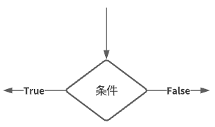

- フローチャートの判断のパーツと同等の処理を行う．
- ある条件（**条件式**）に基づき，<u>実行する命令を選択</u>し，プログラムの流れを分岐させる．
- ある状況下における変数の値に応じ，様々なふるまいが表現できる．
- 条件分岐には以下の種類がある．
  - if文
  - if-else文

### if文

- 下図のようなフローチャートにおける最もシンプルな分岐をプログラムで表現できる．


#### 書式

```java
if( 条件式 )	//  [条件]
{
  // ブロック文 　[処理]
  // 条件式が真(true)の場合に実行する(命令)文をこの中に記述する．
  // 2文字文インデント．（文の開始位置が右に2文字分ずれている）
}
```

- 条件式の結果が真(true)である場合，ブロック文の命令を実行する．
- 条件式の結果が偽(false)である場合，ブロック文の命令は実行されず，<u>ブロック文の次の文まで処理がスキップ</u>される．
- `if(  )`の行には行末にセミコロン「`;`」が不要であることに注意．

##### ブロック文

- `{  }`で囲まれた，複数の文をまとめた部分のこと．
- if文において，条件式の結果が真(true)である場合に実行される命令をこの中に記述する．
  - `if( )`の直後に記述する必要がる．
- ブロック文の中に記述する文は，**インデント**（字下げ）を行うこと．
  - 可読性のため，他のプログラム言語においても基本的な守りごと．
  - Processingの標準では半角2文字分．
    - 実は明確には決まっていない．
  - Processingがある程度自動的に行ってくれる．
    - 手動で行う場合は，Tabキー．


#### 処理の流れ

##### 条件式の結果が真(true)の場合


##### 条件式の結果が偽(false)の場合


#### 例1

乱数を使った例．
変数`iRandom`が50以上なら`print()`する．

```java
int iRandom = floor( random(100) );  // 0~100の乱数

print( iRandom );

if( iRandom >= 50 )
{
  println( " wa 50 ijou" );
}
```


#### 例2

if文を二つ使った例．
変数iRandomが偶数ならYesを，奇数ならNoを`print()`する．

```java
int iRandom = floor( random(100) );

println( iRandom + " wa even?" );

if( iRandom%2 == 0 )	// iRandomを2で割った余りが0だったら[条件式]
{
  println( "Yes" );
}

if( iRandom%2 == 1 )	// iRandomを2で割った余りが1だったら[条件式]
{
  println( "No" );
}
```


##### 処理の順序


https://processing.org/reference/if.html


#### 演習2

`int`型の変数に乱数（0~100）を代入し，3の倍数ならYesをコンソール出力する．

- 変数名は自由．
- 時間は3分程度


### if-else文

- if文に対し，<u>条件を満たさなかった場合にも</u>特定の処理を行わせる．
- 下図のようなフローチャートにおける，二つの処理への分岐をプログラムで表現できる．
  - 処理Aか処理Bのどちらかが必ず実行される．


#### 書式

```java
if( 条件式 )
{
  // ブロック文
  // 条件式が真(true)の場合に実行する(命令)文をこの中に記述する．
}
else
{
  // ブロック文
  // 条件式が偽(false)の場合に実行する(命令)文をこの中に記述する．
}
```

- `else` の後ろに二つ目のブロック文が追加される．
  - このブロックに条件式が偽(false)の場合に実行する(命令)文を記述する．
- `else{}`の部分は必ず`if(){}`とセットで記述すること．

#### 処理の流れ

if文においては，<u>いずれか１つのブロック文のみを実行</u>し，その後ブロック文の次の文へ処理が移行する．
（２つ以上のブロックを実行することはない．）

##### 条件式の結果が真(true)の場合


##### 条件式の結果が偽(false)の場合

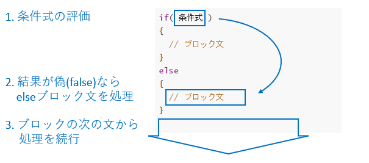

#### 例

if文の例2を改良した例．
変数`iRandom`が偶数ならYesを，奇数ならNoを`print()`する．
こちらの記述がより正しい．

```java
int iRandom = floor( random(100) );

println( iRandom + " wa even?" );

if( iRandom%2 == 0 )	// iRandomを2で割った余りが0だったら[条件式]
{
  println( "Yes" );
}
else
{
  println( "No" );
}
```


https://processing.org/reference/else.html


#### 演習3

`int`型の変数に乱数（0~100）を代入し，3の倍数ならYesを，そうでないならNoをコンソール出力する．

- 変数名は自由．
- 時間は3分程度


#### else if

- 一つ目の条件を満たさなかった場合にも，二つ目以降の条件を課し，それを満たした場合特定の処理を行わせる．
- `else if`は**複数加えることができ，細かく条件を加えて分岐させることができる**．
  - むやみに増やしすぎるのは推奨しない．
- 下図フローチャートのような分岐をプログラムで表現できる．


##### 書式

```java
if( 条件式A )	// [条件A]
{
  // ブロック文A
  // 条件Aを満たした場合実行する(命令)文; [処理A]
}
else if( 条件式B )	// [条件B]
{
  // ブロック文B
  // 条件Bを満たした場合実行する(命令)文; [処理B]
}
```

- 条件式Aの結果が真(true)である場合，ブロック文Aの命令を実行する．
- 条件式Bの結果が真(true)である場合，ブロック文Bの命令を実行する．
- どちらの条件式の結果も偽(false)である場合，<u>ブロック文の次の文まで処理がスキップ</u>される．

##### 処理の流れ

`else if` においても，<u>実行するブロック文は一つ以下</u>であることに注意．

###### １つ目の条件式の結果が真(true)の場合


------

###### １つ目の条件式の結果が偽(false)の場合


以下，２つ目の条件の評価へ続く．

###### 2つ目の条件式の結果が真(true)の場合


###### 2つ目の条件式の結果が偽(false)の場合


##### 例1

変数`iRandom`が3の倍数もしくは偶数の場合に`print()`する例．

```java
int iRandom = floor( random(100) );

print( iRandom );

if( iRandom % 3 == 0)
{
  println( " wa 3 no baisuu" );
}
else if( iRandom % 2 == 0 )
{
  println( " wa even" );
}
```


##### 例2

`else if` を複数用いた例．
変数`iRandom`が80以上もしくは60以上，40以上，20以上の場合に`print()`する．

```java
int iRandom = floor( random(100) );

print( iRandom );

if( iRandom >= 80 )
{
  println( " wa 80 ijou " );
}
else if( iRandom >= 60 )
{
  println( " wa 60 ijou" );
}
else if( iRandom >= 40 )
{
  println( " wa 40 ijou" );
}
else if( iRandom >= 20 )
{
  println( " wa 20 ijou" );
}
```


#### 演習4

`int`型の変数に乱数（0~100）を代入し，3の倍数もしくは4の倍数の場合にコンソール出力する．

- 変数名は自由．
- 時間は3分程度


#### else if + else

- 一見ややこしいが，`else if`の最後に`else`を加え，全ての条件を満たさなかった場合にも特定の処理を行わせる方式． 


##### 書式

`else if` と違い，`else`は一つのみ．

```java
if( 条件式 )	// [条件A]
{
  // 条件Aを満たした場合実行する(命令)文; [処理A]
  // for文の時と同様，インデントする．
}
else if( 条件式 )	// [条件B]
{
  // 条件Bを満たした場合実行する(命令)文; [処理B]
  // for文の時と同様，インデントする．
}
else
{
  // 条件を満たさなかった場合実行する(命令)文;   [処理C]
}
```

##### 処理の流れ

「条件式の評価→該当するブロック文の実行」という大きな流れを理解しておくとよい．


##### 例1

変数`iRandom`が3の倍数もしくは4の倍数の時に`baisuu`，
それ以外の場合に`sonota`を`print()`する例．

```java
int iRandom = floor( random(100) );

print( iRandom );

if( iRandom % 3 == 0 )
{
  println( " wa 3 no baisuu" );
}
else if( iRandom % 4 == 0 )
{
  println( " wa 4 no baisuu" );
}
else
{
  println( " wa sonota" );
}
```


##### 例2

`else if` を複数用いた例．
変数`iRandom`が80以上もしくは60以上，40以上，20以上の場合に`ijou`，
それ以外の場合に`20 miman`を`print()`する．

```java
int iRandom = floor( random(100) );

print( iRandom );

if( iRandom >= 80 )
{
  println( " wa 80 ijou " );
}
else if( iRandom >= 60 )
{
  println( " wa 60 ijou" );
}
else if( iRandom >= 40 )
{
  println( " wa 40 ijou" );
}
else if( iRandom >= 20 )
{
  println( " wa 20 ijou" );
}
else
{
	println( " wa 20 miman" ); 
}
```


#### 演習5

`int`型の変数に乱数（0~100）を代入し，3の倍数もしくは4の倍数，5の倍数の時に`baisuu`，
それ以外の場合に`sonota`をコンソール出力する．

- 変数名は自由．
- 時間は3分程度．


### switch文

- Switch文は分岐の判断に**変数や式**を用いる．
  - 条件式を用いない．
- 変数や式の返す値を読み取り，その値と等しい**ラベル**の箇所の処理が行われる．
  - if文の`else if`とほぼ同様の役割を果たすが，こちらのほうがより適している場合もある．
- <u>if-else文で代用可能</u>であるので，本授業では無理に使う必要はない．
  - 活用できる者は活用してもよい．

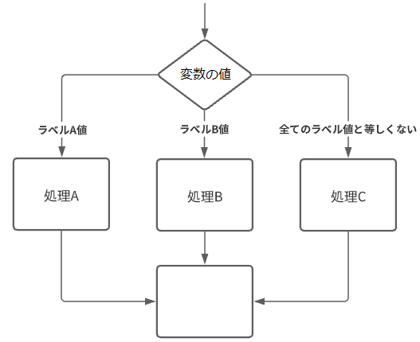

#### 書式

- ラベル`case 値;`は`else if`とほぼ同様の役割を果たし，**複数記述可能**．
  - ラベルの中は**二段階インデント**される．
- `default:`は`else`とほぼ同様の役割を果たし，記述は任意．

```java
switch( 変数or式 )
{
  case 値A:
    // 値が値Aと等しい場合，実行する(命令)文をここに記述する． [処理A]
    break;
  case 値B:
    // 値が値Bと等しい場合，実行する(命令)文をここに記述する． [処理B]
    break;
  default:
    // 値が全てのラベルの値と等しくなかった場合，実行する(命令)文をここに記述する． [処理C]
}
```

#### 処理の流れ

1. 変数or式の返す値と等しいラベルを検索

   

2. 該当するラベルの位置に記述されている処理を，`break;`の文の位置まで実行する．
   下図の例では，青枠で囲まれた命令文の<u>いずれか一つ</u>が実行される．

   

3. いずれかのラベル位置の処理が終了したら，ブロック文の次の文へ処理を移行する．

   

#### 例

4色が交互に出現するストライプの描画．

```java
int iLineWeight = 8;  // 一本の縦線の太さ.
size(400,200);
strokeWeight( iLineWeight );
for( int iLineIdx=0; iLineIdx < 50; iLineIdx++ )  // 50本の線を繰り返し描画.
{
  // 線番号を4で割った余り(剰余)(0~3)
  // 余りが0~3のどれであるかによって処理を変更する．
  switch( iLineIdx%4 )
  {
    case 0:
      stroke( 235, 50, 50 );      // R
      break;
    case 1:
      stroke( 50, 235, 50 );      // G
      break;
    case 2:
      stroke( 50, 50, 235 );      // b
      break;
    case 3:
      stroke( 235, 235, 235 );  // White
      break;
    default:
  }
  line( iLineIdx*iLineWeight, 0, iLineIdx*iLineWeight, height );
}
```


https://processing.org/reference/switch.html


## 繰り返し

### for文

- 英語の前置詞for（〜の間）から由来．
- **特定の回数**分．処理を繰り返す．
  - 厳密には，回数を指定するわけではない．

- あらかじめ繰り返す回数が決まっている場合に便利．

#### 書式

```java
for( 繰り返し用変数の宣言; 条件式; 変数の更新式 )
{
  // 繰り返し実行する(命令)文．
}
```

- for文は<u>繰り返し用の変数</u>を一つ使用する．「変数の宣言」で宣言と同時に初期値も代入する．
- 「条件式」で繰り返しを継続する条件式を記述する．
  - 条件式の結果が<u>真である場合</u>に繰り返しが継続される．
  - 前述の変数を組み込む．
  - 例：「変数の値が100以下」「変数の値が400以下」など．
- 「変数の更新式」<u>で繰り返しが一回行われる毎に変数の値を変化させる</u>式を記述する．

#### 例

変数の値をコンソール出力する処理を10回繰り返すfor文

```java
for( int iIdx = 0; iIdx < 10; iIdx++ )
{
  print( iIdx + ", " );
}
```


- f繰り返し用変数は`int`型の変数名`iIdx`を宣言．初期値0を代入.
  - 変数名の`iIdx`は`int`型の頭文字「i」 + 英語の「Index」の短縮「Idx」

- 条件式は「`iIdx`の値が10未満」．
  - 変数の値は0から始まるので，10回繰り返すために「未満」としている．
- 変数の更新式は繰り返しが一回行われる毎に「変数`iIdx`に1を加える」．
  - `++`はインクリメント演算子．変数の値に1を加える．

##### 処理の流れ

1. 変数の宣言

  

2. ブロック文の処理

  

3. 変数の更新式

   この更新式で`iIdx`に1が加えられる．

  

4. 条件式の評価

  

5. 条件式の結果によって分岐

  

   - trueの場合はステップ2.に戻る．
   - falseの場合はブロック文の次の文へ処理を移行．

https://processing.org/reference/for.html


#### 演習6

（for文用の）変数の値をコンソール出力する処理を<u>100回</u>繰り返すfor文を書いてみましょう．

- ゼロから書くのが難しい方は例1のコードをコピーし，変更を加えて仕上げましょう．
- 演習時間4分程度．


### for文を使った描画

#### 乱数を使った繰り返し

##### 例1

点をランダムな位置に400個描画する．

- ランダムな位置
  - 乱数`random()`にウィンドウのサイズ：縦400横400を渡すことで，<u>ウィンドウ内に収まる座標値の乱数</u>を取得している．

```java
size( 400, 400 );
for(int iPointIdx=0; iPointIdx<400; iPointIdx++)
{
  point( random(400), random(400) );
}
```


##### 例2

位置，大きさ，色がランダムな円400個描画する例．

- ランダムな大きさ，色
  - 塗り色指定`fill()`において，<u>170~250，100~150の乱数</u>を指定している．
  - 円描画`circle()`において，円の大きさとして<u>10~25の乱数</u>を指定している．
- ランダムな位置
  - 乱数`random()`にシステム変数`width`, `height`を渡すことで，<u>ウィンドウ内に収まる座標値の乱数</u>を取得している．

```java
size(400, 400);
for(int iCircleIdx=0; iCircleIdx<400; iCircleIdx++)
{
  fill( random(170,250), random(100,150), 200 );
  circle( random(width), random(height), random(10,25) );
}
```


##### 演習7

星空のような図の描画


- 前述の例1~2のいずれかのプログラムを加工して自分なりの星空を描いてみましょう．

  - 例3のプログラムのほうが多少難易度が高い．
  - 星の大きさを変えたい場合は例3を

- 条件

  - 背景色を暗くする．
    - `background()`で背景色を指定する．
  - 点の色を明るくする．
    - `point()`の場合は`stroke()`で色を指定する．

- 余裕があれば

  - 点の数を増やす.

  - 点の色や明るさをランダムに変える．

- 演習時間6分程．

  

##### 例3

演習7の星空のような図の描画の作例．

- 表現としてより手を加えたもの．
  - 不要な線を非表示，色やアルファ，大きさの細やかな調整．

- カラーモードHSBを使用．
- 変数名をより具体的な名前に変更．

```java
size(400, 400);
colorMode( HSB, 360, 1.0, 1.0, 1.0 ); // HSBA
background( 220, 0.1, 0.1 );          // 背景色
noStroke();                           // 線無し
for(int iStarIdx=0; iStarIdx<400; iStarIdx++)     // 400回繰り返す.
{
  fill( random(360),          // H
        0.1 + random(0.4),    // S
        1.0,                  // B
        0.2 + random(0.8) );  // A
  circle( random(width), random(height), 1 + random(3) );
}
```


#### X座標値0~ウィンドウ幅まで繰り返す

##### 例1

繰り返し用変数`iX`を座標値として使用し，100個の点描画行った例．

- グラデーション
  - 前準備として，`colorMode()`によってRGB値の最大値を100へ設定．
  - `stroke()`における点描画のRGB値として変数`iX`の値を使用する．
    - 繰り返し回数が増える（`iX`の値が大きくなる）ほど白色に近づく．
- 点の座標値
  - 変数`iX`にX座標の0~スクリーン端の座標値を(昇順で)代入しながら繰り返す．
  - 描画を行う点のX，Y座標値として変数`iX`の値を使用する．
    - 繰り返し回数が増える（`iX`の値が大きくなる）ほどウィンドウ右下へ移動する．

```java
colorMode(RGB, 100);		// RGB値の最大値を100に設定．
for(int iX=0; iX<100; iX++) // 繰り返し用変数:iX
{
  stroke(iX);						// iXの値をグレースケール値として使用．
  point(iX, iX);				// iXの値をそのままY座標値としても使用．
}
```


##### 例2

例4をシステム変数`width`,`height`を用い，ウィンドウを可変にした例．

- 例4の100の値の代わりにシステム変数`width`を用いる．
  - `colorMode()`のRGB値の最大値を`width`へ設定．
  - 条件式が`iX<width`という記述になる．
- ウィンドウサイズを変更しても描画が崩れない．

```java
size( 200, 200 );				// ウィンドウサイズ指定．
colorMode(RGB, width);  // RGB値の最大値をウィンドウ幅の値に設定．
for(int iX=0; iX<width; iX++) // 繰り返し用変数:iX
{
  stroke(iX);   				// iXの値をグレースケール値として使用．
  point(iX, iX);        // iXの値をそのままY座標値としても使用．
}
```


#### Y座標値0~ウィンドウ高まで繰り返す

##### 例1

繰り返し用変数`iY`を座標値として使用し，ウィンドウ上部から下部まで水平線を繰り返し描画した例．

```java
size( 100, 200 );
colorMode(RGB, height);  // RGB値の最大値をウィンドウ高の値に設定．

for( int iY=0; iY<height; iY++ ) // 繰り返し用変数:iY(0~height)
{
  stroke( iY );   							 // iYの値をグレースケール値として使用．
  line( 0, iY, width, iY );			 // 水平線の描画．Y座標値は変数iYの値．
}
```


##### 例2

例6を，線の間隔が<u>5ピクセル</u>になるよう変更した例．

- 「変数の更新式」に変更を加えるだけでよい．
  - `iY += 5`：代入演算子を使った算術式
    - 変数`iY`に5を加える

```java
size( 100, 200 );
colorMode(RGB, height);  // RGB値の最大値をウィンドウ高の値に設定．

for( int iY=0; iY<height; iY+=5 )
{
  stroke( iY );
  line( 0, iY, width, iY );
}
```


#### 降順で繰り返す

下のコードのように書くことで，これまでの昇順と逆順である降順で繰り返すことも可能．

```java
// iXにX座標のスクリーン端~0座標値を(降順で)代入しながら繰り返す

for( int iX=width-1; iX>=0; iX-- )
{
  //（命令）文;
}
```

```java
// iYにY座標のスクリーン端~0の座標値を(降順で)代入しながら繰り返す

for( int iY=height-1; iY>=0; iY-- )
{
  //（命令）文;
}
```

#### 演習8

下図のような縦線の繰り返しを描画するプログラムを書いてみましょう．

- 3分程度


### while文

- 英語の接続詞while（〜の間ずっと）から由来．

- <u>指定した条件を満たす限り</u>，処理を繰り返す．
  - 特に繰り返す回数が決まっていない場合などに有効．

- 何かの数を数え上げる場合などにも便利．
- **本授業では基本的にforを使うことを推奨**
  - 適切に終了条件を設定しなければ無限ループに陥る可能性がある．
  - `while()`でなければできない表現がほぼ無い．


#### 書式

```java
while( 繰り返し条件式 )
{
  // 繰り返したい命令;
}
```

#### 例

```java
size( 400, 200 );
int iCount = 0;
while( 40*iCount < width )  // スクリーン右端まで処理を続ける
{
  rect( 40*iCount, 80, 20, 20 );
  iCount++;  // iCountのインクリメント.
}
print( "描画した矩形の数は" + iCount + "個" );

// コンソール表示：描画した矩形の数は10個
```

https://processing.org/reference/while.html


## ブロック文のネスト

### ネストとは

- ブロック文の中にさらに<u>ブロック文が入れ子状に記述されている</u>構造をネストという．
- if文やfor文のブロック文を混ぜてネストを構成することもできる．
- 入れ子の階層が１段階深くなるたびに，インデントが必要．

###  if-else のネストの例

- `else if` を単純に追加するだけでは難しい処理も，ネストにすることで容易に行える場合がある．


上記のフローチャートをコード化したものが下のプログラム．

```java
if( 条件式A )	//   [条件A]
{
  // 条件Aを満たした場合,このブロックへ処理が移る．
  if( 条件式B )	// [条件B]
  {
    // 条件Bを満たした場合，実行する(命令)文;       [処理A]
    // 二段階インデントされる．
  }
  else
  {
    // 条件Bを満たさなかった場合，実行する(命令)文;  [処理B]
  }
}
else
{    // 条件Aを満たさなかった場合,このブロックへ処理が移る．
  if( 条件式C )	// [条件C]
  {
    // 条件Cを満たした場合，実行する(命令)文;       [処理C]
  }
  else
  {
    // 条件Cを満たさなかった場合，実行する(命令)文;  [処理D] 
  }
}
```

コメント無しだと以下のような形式．

```java
if( 条件式A )
{
  if( 条件式B )
  {
    
  }
  else
  {
    
  }
}
else
{
  if( 条件式C )
  {
    
  }
  else
  {
    
  }
}
```

### for文の中にif文を入れたネストの例

#### 例1

一定の領域にのみランダムで点を描画する例．

- if文はもちろんfor文の中に記述することができる．
- その場合，さらにインデントを追加する必要がある．

```java
// スクリーンの一定範囲にだけランダムドットを打つ．
size(400,200);
for( int iPointIdx=0; iPointIdx < 3000; iPointIdx++ )
{
  float fX = random( width );  // Xのランダム値.
  float fY = random( height ); // Yのランダム値.
  if( fX + fY < 300 )  // もしX値とY値の合計が300以下なら.
  {
    point( fX,fY );
  }
}
```


#### 例2

4つの領域へのランダム点描の例．
for文とif-else文のネストを使っている．

```java
size(400,200);
for( int iPointIdx=0; iPointIdx < 8000; iPointIdx++ )
{
  float fX = random( width );  // Xのランダム値.
  float fY = random( height ); // Yのランダム値.
  if( fX < 100 )
  {
    stroke( 255,0, 0 ); 	//R
  }
  else if( fX < 200 )
  {
    stroke( 0,255, 0 );  	//G
  }
  else if( fX < 300 )
  {
    stroke( 0,0, 255 );  	//B
  }
  else
  {
    stroke( 255,255, 255 );	//White
  }
  point( fX,fY );
}
```

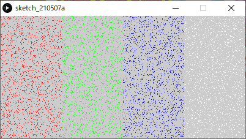

#### 演習9

例2をベースに，下図のような５つの領域へのランダム点描を行うプログラムを作成してみましょう．

- 演習時間3分程度


#### 例3

4つの領域へのランダム点描の例．(縦2×横2)
for文と２重のif-else文のネストを使っている．

```java
size(300,300);
for( int iPointIdx=0; iPointIdx < 8000; iPointIdx++ )
{
  float fX = random( width );  // Xのランダム値.
  float fY = random( height ); // Yのランダム値.
  if( fX < width/2 )
  {
    if( fY < height/2 )
    {
      stroke( 255,0, 0 );      //R
    }
    else
    {
      stroke( 0,255, 0 );      //G
    }
  }
  else
  {
    if( fY < height/2 )
    {
      stroke( 0,0, 255 );      //B
    }
    else
    {
      stroke( 255,255, 255 );  //White
    }
  }
  point( fX,fY );
}
```


#### 例4

if-else文を使った日の丸模様のランダム点描．

- if-else文の条件式として，円の公式を用いた算術式を記述している．

```java
size(400,200);
background( 0, 0, 0 );
translate( width/2, height/2 );  // 原点をスクリーン中心に移動．
for( int iPointIdx=0; iPointIdx < 5000; iPointIdx++ )
{
  float fX = random( -width/2,  width/2 );  // Xのランダム値( -width/2～width/2)
  float fY = random( -height/2, height/2 ); // Yのランダム値( -height/2～height/2)
  
  // (X,Y)座標値が円の内部に有れば.  
  if( pow(fX,2) + pow(fY,2) < pow(height/2,2) )   // 円の公式 Xの二乗 + yの二乗 = 半径の二乗  
  {
    stroke( 255,0, 0 );		// R
  }
  else	// 条件を満たさなかった場合．
  {
    stroke( 255,255, 255 );	// White
  }
  point( fX,fY );
}
```


### for文の中にfor文を入れたネストの例

- for文の中で，さらにfor文を使うこともできる．
- これは何段階でも使用でき，増やすたびに次元が増えるイメージ．
  →2つのforで二次元的な表現に向く

#### 例1

ウィンドウの全てのピクセルに対して描画を行うfor文のネスト．

```java
for( int iY=0; iY<height; iY++ )
{
  for( int iX=0; iX<width; iX++ )
  {
    point( iX, iY );
  }
}
```

#### 例2

ネストの中の繰り返し変数`iX`の値をコンソール出力する例．

```java
for( int iY=0; iY<10; iY++ )
{
  for( int iX=0; iX<10; iX++ )
  {
    print( iX + ", " );
  }
  println("");                            // 改行
}
```


- `iX`の値が0~9まで順番にコンソール出力され改行，という処理が繰り返されている．

  - ネストの中のfor文が１行分のコンソール出力を行っている．

  

#### 例3

ネストの中の繰り返し変数`iX`と`iY`の値をコンソール出力する例．

```java
for( int iY=0; iY<10; iY++ )
{
  for( int iX=0; iX<10; iX++ )
  {
    print( "X" + iX + "Y" + iY + ", " );
  }
  println("");                            // 改行
}
```


##### 処理の流れ

1. 外側，内側のfor文の繰り返し用変数に初期値が代入される．
   内側のブロック文が最初に実行される．
   


2. 内側のfor文が一巡する．（１巡目）
   コンソール出力のを見ると，変数`iX`値が1ずつ増えていることが確認できる．
   
   


3. 内側のfor文が終了し，次の文でコンソール出力を改行する．

   


4. 外側のfor文の変数の更新と条件式の評価が実行される．
   変数`iY`が1に増える．
   

5. 内側のfor文の繰り返し用変数に初期値が代入される．
   内側のブロック文が実行される．（２巡目開始）
   コンソール出力のを見ると，変数`iY`値が1に増えていることが確認できる．
   
   


6. 内側のfor文が一巡する．（２巡目）

   


以上のような処理を繰り返している．


#### 演習10

例3のプログラムをコピーして，以下のようにコンソール出力がされるよう<u>条件式を変更</u>してみましょう．

- 演習時間2分程度


#### 例4

ウィンドウに正円を並べて描画した例．
繰り返し変数の更新式が`iY+=20`，`iX+=20`であることに注意．

```java
size( 200, 200 );
background( 0 );

for( int iY = 10; iY < height; iY+=20 )
{
  for( int iX = 10; iX < width; iX+=20 )
  {
    fill( iX, iY, 0 );
    circle( iX, iY, 20 );
  }
}
```


#### 例5

グラデーションのカラーチャート(矩形)

- 繰り返し変数の初期値`int iY=5`，`int iX=5`で描画位置を微調整している．

```java
size( 200, 200 );                        // ウィンドウサイズを200×200．
colorMode( HSB, 200 );                   // HSB最大値を200に設定．
background( 200 );

for( int iY=5; iY<200; iY+=20 )
{
  for( int iX=5; iX<200; iX+=20 )
  {
    fill( iX, iY, 200 );    // 色相をiX, 彩度をiY, 輝度を200に設定．
    rect( iX, iY, 10, 10 ); // iX,iYの座標に10×10の大きさの矩形を描画．
  }
}
```

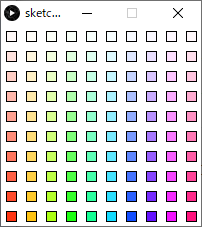

#### 例6

ネストの中のfor文で，複数の図形を回転させながら繰り返し描画を行う例．

- 座標変換の必要性を要確認．

```java
size( 200, 400 );

rectMode(CENTER);
for( int iY=10; iY<height; iY+=35 )	// 35ピクセルずつ下にずらす．
{
  pushMatrix();
  
  translate( random(20,180), iY );	// 5つの矩形の塊の中心へ座標系の中心を移動．
  
  // 5つの矩形の塊を１つ描画．
  for( int iRectIdx=0; iRectIdx<5; iRectIdx++ )
  {
    fill( 51+iY/2, 110, 20 );
    rect( 15, 0, 15, 10 );
    rotate( radians(72) );	// 72°回転
  }
  
  popMatrix();  // translate()とrotate()で変化した座標系をリセット．
}
```


#### 演習11

例6のプログラムに変更を加え，自由に花のような模様を作ってみましょう．

- 演習時間8分程度
- 下図は参考イメージとプログラム．
  難しい場合は参考にしましょう．


```java
size( 200, 400 );
background(20);

rectMode(CENTER);
for( int iY=10; iY<height; iY+=35 )
{
  pushMatrix();
  
  translate( random( 20,180 ), iY );		// 花の中心へ座標系の中心を移動．
  
  rotate( radians( random( 5,20 ) ) );  // 花弁の初期角度をランダムに．
  
  // 8枚の花弁を描画．
  for( int iRectIdx=0; iRectIdx<8; iRectIdx++ )
  {
    fill( random( 220, 250 ), 50+iY/4, 20 );
    ellipse( 15, 0, 15, 10 );
    rotate( radians(45) );
  }
  
  // 花の中心部分．
  fill( 220, 200+iY/8, 10 );
  circle( 0, 0, 16 );
  
  popMatrix();  // translate()とrotate()で変化した座標系をリセット．
}
```


## 条件式（論理演算）

### 論理演算（ブーリアン演算）

- <u>条件式を複数繋げ</u>，条件を重ねることで行う演算のこと．

- 1つの条件式は真(true)か偽(false)のどちらかの結果をかえすので，これらを2つ以上用いて結果を得ることになる．


- 論理演算を行うには，**論理演算子**を用いる．

### 論理演算子

- <u>比較演算式による条件式</u>と論理演算子を組み合わせ，<u>より複雑な条件</u>を課すことができる．
- 下表の条件を満たしたとき，式の結果は真(true)となり，そうでなければ偽(false)となる．

| 条件式               | 演算子 | 条件                             | ベン図                                                       | 演算       |
| -------------------- | ------ | -------------------------------- | ------------------------------------------------------------ | ---------- |
| `条件式A && 条件式B` | `&&`   | 条件式Aが真，かつ条件式Bが真     |  | 論理積 AND |
| `条件式A || 条件式B` | `||`   | 条件式Aが真，もしくは条件式Bが真 |  | 論理和 OR  |
| `! 条件式`           | `!`    | 条件式が偽                       |  | 否定 NOT   |

※論理演算，特に!は本授業では使用頻度は高くないため，．

### 例1

変数`iRandom`が偶数かつ3の倍数であるか調べるif文

```java
int iRandom = floor( random(100) );

if( iRandom%2 == 0 && iRandom%3 == 0 )
{
  print( iRandom );
}
```

### 例2

変数`iRandom`が偶数もしくは3の倍数であるか調べるif文

```java
int iRandom = floor( random(100) );

if( iRandom%2 == 0 || iRandom%3 == 0 )
{
  print( iRandom );
}
```

### 例3

変数`iRandom`が4の倍数ではない場合に真を返す条件式
条件式を`()`で囲む必要がある．

```java
int iRandom = floor( random(100) );

if( !(iRandom%4 == 0) )
{
  print( iRandom );
}
```

しかし，実はこの記述は適切ではない．
下のような記述が好ましい．

```
int iRandom = floor( random(100) );

if( iRandom%4 != 0 )
{
  print( iRandom );
}
```

この記述のように，論理演算子ではなく比較演算子`!=`を用いるほうが適切．

### 例4

論理演算を使った縦縞模様の描画．

- 論理演算とfor文を組み合わせることで，少し複雑な周期性を表現できる．

```java
size(400,200);
noStroke();
for( int iX = 0; iX < width; iX+=2 )  // 変数iXの値に2加えながら繰り返す．
{
  if( iX%3 == 0 || iX%5 == 0 )  // 変数iXの値が3か5の倍数なら
  {
    fill( 0 );  // 黒
  }
  else
  {
    fill( 250 );// 白
  }
  rect( iX, 10, 2, 180 );       // 縦に細い矩形を描画する．
}
```


### 演習12

例1のコードの`if( iX%3 == 0 && iX%5 == 0 )`の部分の3,5の数値を書き換え，
異なるパターンが生成される数値の組み合わせを探してみましょう．

- 演習時間3分ほど


### 例5

for文のネストと論理演算を使った，市松模様の描画

- 論理演算とfor文を組み合わせることで，緑の矩形による塗分けのパターンを生成している．

```java
size(800,320);
background(0);    // 背景色：黒
noStroke();

int iCellSize = 40;                  // セル(四角)の大きさ．
int iColumnTotal = width/iCellSize;  // 列(横軸)の総数.
int iRowTotal = height/iCellSize;    // 行(横軸)の総数.

for( int iColumnIdx=0; iColumnIdx < iColumnTotal; iColumnIdx++ )  // 列（縦方向）の繰り返し
{
  for( int iRowIdx=0; iRowIdx < iRowTotal; iRowIdx++ )            // 行（横方向）の繰り返し
  {
    if( iColumnIdx%2 == 0 && iRowIdx%2 == 0 || // 列番号が偶数かつ行番号が偶数の時，もしくは，
        iColumnIdx%2 == 1 && iRowIdx%2 == 1 )  // 列番号が奇数かつ行番号が奇数の時
    {
      fill(0, 124, 96);    // 緑
      
      // 行番号と列番号からXY座標値を算出する．
      rect( iColumnIdx*iCellSize, iRowIdx*iCellSize, iCellSize, iCellSize );
    }
  }
}
```


#### セルと番号の割り振り

- 各矩形に<u>列番号</u>及び<u>行番号</u>を割り振り，以下の条件を満たしたときにのみ緑の矩形を描画する．
  - 二つの番号がどちらとも偶数，もしくは，
  - 二つの番号がどちらとも奇数．
- 下のように，模様を表として考えると理解しやすくなる．


https://processing.org/reference/logicalAND.html
https://processing.org/reference/logicalNOT.html
https://processing.org/reference/logicalOR.html


## 繰り返し表現のサンプル

- 繰り返しの分類毎に，シンプルなプログラムを以下に記載する．
- プログラムの出発点として使用するのもよい．


#### 反復

```java
size(400,200);
noStroke();
colorMode( HSB,360, width-40, 1.0 ); 
for( int iX=0; iX<width; iX+=30 )
{
  fill( 180, iX+40, 1 );
  rect( iX,    50,    8, height );  // 矩形:長
  fill( 300, iX+40, 1 );
  rect( iX+10, 50+40, 8, height );  // 矩形:中
  fill( 60,  iX+40, 1 );
  rect( iX+20, 50+80, 8, height );  // 矩形:短
}
```


***

#### 振動

```java
int iAmplitudeL = 80;  // 振幅（大きな波の高さ）
int iAmplitudeS = 40;  // 振幅（小さな波の高さ） 
size( 400,200 );
colorMode( HSB, 360, 1.0, 1.0, 1.0 );

// 大きな波形(cos).
strokeWeight( 8 );
for( int iX=0; iX < width; iX++ )
{
  int iAngle0 = iX*4;
  int iAngle1 = (iX+1)*4;
  stroke( iAngle0%360, 1.0, 1.0 );  // a%b:aをbで割った余り.
  line( iX, height/2 + iAmplitudeL*cos( radians(iAngle0) ),
        iX, height/2 + iAmplitudeL*cos( radians(iAngle1+1) ) );
}

// 小さな波形(sin).
strokeWeight( 8 );
for( int iX=0; iX < width; iX++ )
{
  int iAngle0 = iX*4;
  int iAngle1 = (iX+1)*4;
  stroke( iAngle0%360, 1.0, 1.0, 0.2 );
  line( iX, height/2 + iAmplitudeS*sin( radians(iAngle0) ),
        iX, height/2 + iAmplitudeS*sin( radians(iAngle1+1) ) );
}
```


***

#### 遷移

```java
size(400,200);
noStroke();
colorMode( HSB,width, 1.0, 1.0 );
for( int iX=0; iX<width; iX+=10 )
{
  fill( iX, 1, 1 );
  rect( iX, iX*height/width, 8, height );  // 矩形
}
```


***

#### 乱雑さ

```java
size(400,200);
noStroke();
colorMode( HSB, width, height, 1.0 );
for( int iX=0; iX<width; iX+=10 )
{
  float fY = 20 + random(height-20);  // Y座標値を表す変数．
  fill( iX, height-fY+20, 1 );
  rect( iX, fY, 8, height );  // 矩形
}
```


***

#### モアレ

```java
size(400,200);
background(0, 0, 0);
noStroke();
colorMode( HSB, width, height, 1.0 );

// 正円を格子状に描画．
for( int iY=3; iY<height; iY+=12 )
{
  for( int iX=3; iX<width; iX+=12 )
  {
    fill( iX, height, 1 );
    circle( iX, iY, 6 );  // 円
  }
}

translate( width/3, -height/2 );  // 座標系を平行移動
rotate( radians(45) );            // 座標系を45度回転 

// 正円を格子状に描画．
for( int iY=3; iY<height; iY+=12 )
{
  for( int iX=3; iX<width; iX+=12 )
  {
    fill( iX, height, 1 );
    circle( iX, iY, 6 );  // 円
  }
}
```


***

#### 回転対称

ひし型の回転対称

```java
int iDiamondTotal = 9;  // ひし形の数.
int iRotDeg = 40;       // 回転させる角度.
size(400,400);
colorMode( HSB, 3, 1, 1 );

translate( width/2, height/2 );  // 原点座標をスクリーン中心へ移動.

// ひし形の数だけ繰り返す.
for( int iDiamondIdx = 0; iDiamondIdx < iDiamondTotal; iDiamondIdx++ )
{
  fill( iDiamondIdx % 3, 1, 1 );  // 3種類の色相を交互に.
  quad( 0, 0, 100, -15, 200, 0, 100,  15 );            // ひし形の描画.
  rotate( radians(iRotDeg) );  // 座標系の回転.
}
```


突起とくぼみが交互に現れる多角形

```java
float fRangeSpike = 40; // 突起部の頂点の距離
float fRangePit = 180;  // くぼみ部の頂点の距離
int   iSpikeTotal = 10;  // 突起の総数

size( 400,400 );

translate( width/2, height/2 );

int iDegreePerSpike = 360 / iSpikeTotal; // 1スパイク毎に進む角度

stroke(255,0,0);
strokeWeight(4);

// 多角形描画.
beginShape();
for( int iDegree = 0; iDegree < 360; iDegree+=iDegreePerSpike )
{
  float[] fDrawPointSpikeXY = { fRangeSpike*cos( radians( iDegree ) ),  fRangeSpike*sin( radians( iDegree  ) ) };
  
  int iDegreePit = iDegree+iDegreePerSpike/2;
  float[] fDrawPointPitXY = { fRangePit*cos( radians( iDegreePit ) ), fRangePit*sin( radians( iDegreePit ) ) };
  
  vertex( fDrawPointSpikeXY[0], fDrawPointSpikeXY[1] );  // 突起部の頂点座標
  vertex( fDrawPointPitXY[0], fDrawPointPitXY[1] );      // くぼみ部の頂点座標
}
endShape(CLOSE);
```


***

#### 並進対称

```java
int iColumnRepeat = 7; // 横に繰り返す回数.
size(400,400);
colorMode( HSB, 10, iColumnRepeat+2, 1 );
noStroke();
translate( -40, 0);  // スクリーンを充填するため，最初に少しずらす．
for( int iRowIdx = 0; iRowIdx < 10; iRowIdx++ )
{
  pushMatrix(); // 原点座標の位置(左端)を記憶.
  // 横にiColumnRepeatセットの三角形ペアを描画.
  for( int iColumnIdx = 0; iColumnIdx < iColumnRepeat; iColumnIdx++ )
  {
    fill( iRowIdx, iColumnIdx+2, 1 );        // 下向きの三角.
    triangle( 0, 0, 80, 0, 40, 40 );
    fill( iRowIdx+1, iColumnIdx+2, 1 );      // 上向きの三角.
    triangle( 40, 40, 80, 0, 120, 40 );
    translate( 80, 0 );  // 右にずらす.
  }
  popMatrix(); // 原点座標を左端に戻す.
  
  translate( 0, 40 );   // 原点座標を一段下げる.
}
```


# 配列

## 配列( array )とは

- データ構造の一種．
- 同種のデータを複数まとめて記述したい場合に有用．
- <u>ハートウェア上で</u>どのように実現されているかイメージで把握すると理解しやすい．

### 配列のハードウェア的イメージ


- **同一の型**のデータ（変数）をメモリ上に一列に並べた構造．
- 変数の場合と同じく，配列の**宣言**をおこなうことで，この領域がメモリ上に予約（確保）される．

### 配列のプログラムにおける利用


- 配列には，その配列全体を指すための名前である**配列名**がついている。
- 並んでいる各データ（変数）を**要素（element）**という．
- 各要素は，**配列名**と**要素番号**を使って読み書きができる．
- ある配列のもつ要素の総数を**要素数**という．
  - 配列の最後の要素番号は`要素数-1`であることに注意．

### 宣言

変数と同じく，配列も宣言文によって配列の宣言を行う必要がある．

#### 書式

```java
要素のデータ型[] 配列名 = new 要素のデータ型[要素数];
```

- 書式が変数の場合とかなり異なる点に注意．

#### 例1

int型（整数型）の要素を10個持つ，名前がiXの配列の宣言文

```java
int[] iX = new int[10];
```
##### 確保されるメモリのイメージ


#### 例2

 float型（実数型）の要素を4個持つ，名前がfRGBAの配列の宣言文

```java
float[] fRGBA = new float[4];
```

##### 確保されるメモリのイメージ


### 要素の値を取得する

ある配列の要素の値を取得するには，下のような書式を用いる．

```java
配列名[ 要素番号 ]
```

- 配列名と要素番号を組み合わせることで，配列の一つの要素を**変数と同じように使用できる**．
  - 格納されている値の読み書きが行える．
- 変数と同様に式に組み込むこともできる．

### 要素へ値を代入する

ある配列の要素へ値を代入するには，下のような書式の文を記述する．

```java
配列名[ 要素番号 ] = 値;
```

- 要素番号のアドレスの要素に値を代入する．
- 配列に初期化にもこの書式を用いる．

### 初期化

- 配列に値を代入するため，宣言文とは別に<u>初期化を行う命令文</u>を複数記述する必要がある．

- **配列の全ての要素へ値を代入する必要**があり，下の例のように一つ一つ代入を行う命令文を記述する方法がある．

```java
配列名[0] = 値;
配列名[1] = 値;
配列名[2] = 値;
配列名[3] = 値;
配列名[4] = 値;
配列名[5] = 値;
...
```

#### 例1

int型（整数型）の要素を10個持つ，名前がiXの配列の宣言・初期化

```java
int[] iX = new int[10]; // 配列を宣言

// 初期化
iRGBA[0] = 0;
iRGBA[1] = 10;
iRGBA[2] = 25;
iRGBA[3] = 100;
iRGBA[4] = 45;
iRGBA[5] = 68;
iRGBA[6] = 12;
iRGBA[7] = 20;
iRGBA[8] = 225;
iRGBA[9] = 255;
```

- 初期化を行う最後の要素の要素番号が**9**であることに注意．
  - `要素数 - 1`

##### メモリ上のイメージ

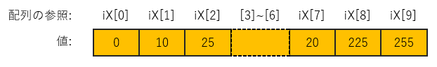

- 実際に<u>メモリ上に書き込まれるのはデータ（値）</u>である点に注意．
- 配列名と要素番号の組み合わせは，<u>プログラムから</u>各データの読み書きをおこなうために必要となる．

#### 例2

float型（実数型）の要素を4個持つ，名前がfRGBAの配列の宣言・初期化

```java
float[] fRGBA = new float[4]; // 配列を宣言

// 初期化
fRGBA[0] = 0;
fRGBA[1] = 0.1;
fRGBA[2] = 1.0;
fRGBA[3] = 0.8;
```

- 初期化を行う最後の要素の要素番号が**3**であることに注意．
  - `要素数 - 1`

##### メモリ上のイメージ

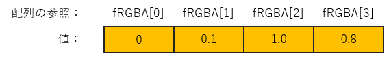


### 演習1

int型（整数型）の要素を4個持つ，名前が`iRGBA`の配列の宣言・初期化を行うプログラムを書いてみましょう．

- 初期値として，`0, 50, 100, 80`の値を代入すること．
- 実行しても何も表示されないが，エラーが表示されず実行が行えればよい．

- 演習時間3分


### 要素数の取得

- 配列は`length`という変数を持っており，**配列の要素数**がを値として格納されている．
- 下のような書式で変数として呼び出し，この値を取得することができる．

```java
配列名.length
```

- この変数に値を代入することはできない．
  - 読み取り専用

#### 例

配列iXの要素数をコンソール出力

```java
int[] iX = new int[10]; // 配列を宣言

print( iX.length );
```


#### なぜ必要なのか

例えば，以下の配列の宣言文の場合．

```java
float[] fRGBA = new float[4];
```

- 要素数は`4`であり，既に明らかであるのでわざわざ要素数の取得を行う記述は必要無いように感じられる．
- しかし，要素数の変更に柔軟に対応するためにも，可能な限り`配列名.length`を用いた方がよい．


### for文を使った初期化

- for文を使って初期化すると効率的な場合がある．
  - 全て同じ値．
  - 規則性のある数列．
    - ブロック文の中で算術式や条件式を使うことで，様々な数列を代入可能．
  
- for文の<u>条件式に要素数</u>を用いることで，繰り返し回数を要素数と同じ数にする．
  - 配列外の要素を間違って参照しようとしてしまうエラーの回避ができる．

#### for文を使った基本的な初期化

```java
for( int iElemIdx=0; iElemIdx < 配列名.length; iElemIdx++ )
{
  配列名[ iElemIdx ] = 値;
}
```

繰り返し用変数`iElemIdx`の変数名は，要素番号(  Element Index )を元に名付けている．

#### 例1

全ての要素に0の値を代入する．

```java
int[] iX = new int[10];

// 初期化
for( int iElemIdx=0; iElemIdx < iX.length; iElemIdx++ )
{
  iX[ iElemIdx ] = 0;
}
```

#### 例2

全ての要素に5の倍数の値を代入し，要素の値をコンソール出力．

```java
int[] iY = new int[10];

// 初期化
for( int iElemIdx=0; iElemIdx < iY.length; iElemIdx++ )
{
  iY[ iElemIdx ] = iElemIdx * 5;
  print( iY[iElemIdx] + ", " );		// コンソール出力
}
```

- 繰り返し変数を使った算術式`iIdx * 5`の演算結果を初期値として代入している．


### 宣言と同時に初期化を行う場合

- 宣言と同時に初期化を行う記述方法もある．
- こちらを使うと**後に初期化を行う命令文の記述が必要ない**ため，プログラムがシンプルになる．
  - 色や形の表現に関わる<u>要調整の値</u>を代入する場合などはこちらを推奨．

#### 書式

```java
要素のデータ型[] 配列名 = { 値0, 値1, 値2, 値3, , , , 値n };
```

- 宣言だけの時と違い，`new` や`要素数`の記述が無く，`{ }`の形式で記述する点に注意．
  - 文末に`;`も必要．
- 値の数は自由に設定することができ，記述した値の数から要素数が自動的に割り出される．

#### 例1

int型（整数型）の名前がiRGBの配列の宣言・初期化

```java
int[] iX = { 0, 10, 25, 100, 45, 68, 12, 20, 225, 255 };
```

#### 例2

float型（実数型）の名前がfRGBAの配列の宣言・初期化

```java
float[] fRGBA = { 0, 0.1, 1.0, 0.8 };
```


### 演習2

- int型（整数型）の名前が`iX`の配列の宣言・初期化をし，全ての要素の値をコンソール出力する．

- 初期化の値として，以下の6つの<u>2の倍数の数列</u>を代入する．

  `0, 2, 4, 6, 8, 10,`

- 演習時間3分


https://processing.org/reference/Array.html
https://processing.org/reference/arrayaccess.html


## 配列を使った描画

配列を使い，プログラムを効率化できる場合がある．
使い方毎に以下にまとめる．

### ランダム値を配列に保存する．

`random()`が返す値を配列に保存することで，同じ乱数の数列を繰り返し用いることができる．

#### 例

ランダムな線の長さをリストとして配列に保存し，回転対称の図を描画する．

```java
size(300,300);

float[] fLineLength = new float[12]; // 12本の線の長さを保存する配列

for( int iLineIdx = 0; iLineIdx<fLineLength.length; iLineIdx++ )   // 配列の初期化.
{
  fLineLength[iLineIdx] = random( 20, 120 );	// 長さランダム20~120
}

translate( width/2, height/2 ); // 原点をスクリーン中心に移動

for( int iRepIdx = 0; iRepIdx<6; iRepIdx++ )   // ６回繰り返す．
{
  for( int iLineIdx = 0; iLineIdx<fLineLength.length; iLineIdx++ )  // 線12本分繰り返す
  {
    line( 0, 0, fLineLength[iLineIdx], 0 );		   // 線を描画．
    rotate( radians(5) );                        // 5°回転
  }
}
```


### 要素番号をランダムに決定する．

- `random()`の返す値をそのまま描画に用いてしまうと，無秩序すぎる表現となる場合が多い．
- 事前に用意した数パターンの中からランダムに用いる値を決定することで，一定の秩序を持たせることができる．

1. 配列に，描画に関わる数パターンの数値を代入する．
2. 描画の際，**要素番号をランダムに決定**し，該当する配列の値を用いて描画を行う．

#### 例1

４種類の大きさをランダムに用いる正円の描画

```java
size( 200, 200 );

int[] iCircleSizes = { 6, 12, 18, 30 };  // Circle Size

for( int iCircleIdx = 0; iCircleIdx < 100; iCircleIdx++ )
{
  int iElemIdx = floor( random(4) ) % 4;	// 要素番号：0~3のランダム
  
  circle( random(width), random(height), iCircleSizes[iElemIdx] );
}
```


#### 例2

6種類のX座標値をランダムに用いる矩形の描画

```java
size( 200, 200 );

int[] iRectXs = { 0, 40, 80, 120, 160, 180 };  // Rect X

for( int iRectIdx = 0; iRectIdx < 100; iRectIdx++ )
{
  int iElemIdx = floor( random(6) ) % 6;	// 要素番号：0~5のランダム
  
  rect( iRectXs[iElemIdx], random(height), 20, 10 );
}
```


#### 例3

例2に，4種類の色情報(Gray値)の塗分けを加えた描画．

```java
size( 200, 200 );

int[] iRectXs = { 0, 40, 80, 120, 160, 180 };  // Rect X
int[] iColorGrays = { 40, 100, 180, 255 };     // Color Gray

for( int iRectIdx = 0; iRectIdx < 200; iRectIdx++ )
{
  int iRectElemIdx  = floor( random(iRectXs.length) ) % iRectXs.length;	 				// 配列iRectXsの要素番号
  int iColorElemIdx = floor( random(iColorGrays.length) ) % iColorGrays.length;	// 配列iColorGraysの要素番号
  
  fill( iColorGrays[iColorElemIdx] );
  rect( iRectXs[iRectElemIdx], random(height), 20, 10 );
}
```

この例のように，配列の要素数を取得する`random(iRectXs.length)`，`iColorGrays.length`を数値の代わりに用いるとより効率的．


### 演習3

下のプログラムはまだ未完成であり，完全にランダムな色の正方形を描画してしまっている．
このプログラムに変更を加え，<u>数パターンの色の組み合わせから</u>ランダムに色が描画されるように完成させてみましょう．

- 色のパターンは自由な値を入力してください．

- 演習時間：5分程度

```java
size(400,400);

int[] iColorR = { 0, 0, 0, 0 };	// 未完成：値が入力されていない．
int[] iColorG = { 0, 0, 0, 0 };	// 未完成：値が入力されていない．
int[] iColorB = { 0, 0, 0, 0 };	// 未完成：値が入力されていない．

for( int iY = 0; iY < height; iY+=20 )
{
  for( int iX = 0; iX < width; iX+=20 )
  {
    int iElemIdx = floor( random(4) ) % 4;	// 要素番号0~3の乱数．
    
    fill( random(255), random(255), random(255) );	// 未完成：ランダムな色になってしまっている．
    
    square( iX, iY, 20 );

  } 
}
```


#### 作例


### 配列に数列を代入し，描画に用いる．

1. 配列の初期化の際，for文において任意の数列を代入するよう記述する．
2. 描画の際，配列の要素番号によってパターンを選択する．

#### 例1

10で始まり，10ずつ増える数列を配列に代入し，
配列の要素を昇順矩形を描画する．

```java
int iRectWidth = 12;  // 矩形の幅.
size( 200, 200 ); 
int[] iRectHeight = new int[16]; // 配列iRectHeightを宣言(矩形の高さのリスト)
for( int iIdx=0; iIdx < iRectHeight.length; iIdx++ ) // 初期化
{
  iRectHeight[ iIdx ] = 10 + iIdx*10; // 10,20,30....と代入.
}
colorMode( HSB, 3, iRectHeight.length, 1 ); // 彩度のMaxを配列の要素数に 

// 矩形リストを昇順に描画.
for( int iIdx=0; iIdx < iRectHeight.length; iIdx++ ) // 要素番号順に繰り返し(0~max)
{
  fill( 0, iIdx, 1 );  // R,彩度=要素番号
  rect( 0, height-iRectHeight[iIdx], iRectWidth, iRectHeight[iIdx] );
  translate( iRectWidth, 0 );
}
```


#### 例2

例1で用いた配列を再利用し，降順とランダムのパターンの描画を行った例．

```java
// 矩形の高さリスト（配列）から，矩形を描画する．(3パターン)
int iRectWidth = 8;  // 矩形の幅.
size( 208, 100 ); 
int[] iRectHeight = new int[8]; // 配列iRectHeightを宣言(矩形の高さのリスト)
for( int iIdx=0; iIdx < iRectHeight.length; iIdx++ ) // 初期化
{
  iRectHeight[ iIdx ] = 10 + iIdx*10; // 10,20,30....と代入.
}

colorMode( HSB, 3, iRectHeight.length, 1 ); // 彩度のMaxを配列の要素数に

// 矩形リストを昇順に描画.
for( int iIdx=0; iIdx < iRectHeight.length; iIdx++ )
{
  fill( 0, iIdx, 1 );
  rect( 0, height-iRectHeight[iIdx], iRectWidth, iRectHeight[iIdx] );
  translate( iRectWidth, 0 );
}

translate( iRectWidth, 1 );

// 矩形リストを降順に描画.
for( int iIdx=iRectHeight.length - 1; iIdx >= 0; iIdx-- )
{
  fill( 1, iRectHeight.length-iIdx, 1 );
  rect( 0, height-iRectHeight[iIdx], iRectWidth, iRectHeight[iIdx] );
  translate( iRectWidth, 0 );
}

translate( iRectWidth, 1 );

// 矩形リストをランダム順に描画.
for( int iIdx=0; iIdx < iRectHeight.length; iIdx++ )
{
  int iRandIdx = floor( random( iRectHeight.length ) );
  fill( 2, iIdx, 1 );
  rect( 0, height-iRectHeight[iRandIdx], iRectWidth, iRectHeight[iRandIdx] );
  translate( iRectWidth, 0 );
}
```


## ２次元配列

- これまで説明したのは１次元の配列．

- ２次元配列の宣言は　以下のような記述となる．

```java
int[][] iArray = new int[3][4];
```

​	この記述は概念上は下図のようになる．


- メモリ上での配置は下図のようになる．


​	このようなメモリ上での配置は直観的に理解しづらいので，概念図で理解したほうが好ましい．

- ２次元配列は，配列名，**2つの要素番号**を使って指定のデータにアクセスする．


### 宣言

#### 書式

```java
要素のデータ型[][] 配列名 = new 要素のデータ型[行数][列数];
```

#### 例1

int型の行数4, 列数2の２次元配列iXYを宣言する．

```java
int[][] iXY = new int[4][2];
```


#### 例2

float型の行数6, 列数3の２次元配列fRGBを宣言する．

```java
float[][] fRGB = new float[6][4];
```


### 要素数の取得

#### 書式

##### 行の要素数の取得

```java
配列名.length
```

##### 列の要素数の取得

```java
配列名[行番号].length
```

列の要素数を取得するには，形式上は行番号を指定する必要があるが，
通常は以下のように，`0`でよい．

```java
配列名[0].length
```

#### 概念

例えば以下の記述は，概念上は下図のようになる．

```java
int[][] iArray = new int[3][4];
```


#### 例

int型の行数が3，列数が4である2次元配列iArrayの行と列の要素数をコンソール出力する．

```java
int[][] iArray = new int[3][4];

print( "iArray.length: "    +iArray.length + ",  " );
print( "iArray.length[0]: " +iArray[0].length );
```


### for文を使った初期化

- １次元配列と同様に，２次元配列も初期化が必要．
- ただし，for文を使う場合，for文のネストを記述する必要がある．

- 繰り返し回数として，**要素数を取得**し，使用するとより確実．

  - 行数と列数それぞれの要素数を取得する方法が多少紛らわしい点に注意．

#### for文を使った基本的な初期化

```java
要素のデータ型[][] 配列名 = new 要素のデータ型[行数][列数];
for( int iRowIdx=0; iRowIdx < 配列名.length; iRowIdx++ )
{
  for( int iColumnIdx=0; iColumnIdx < 配列名[iRowIdx].length; iColumnIdx++ )
  {
    配列名[iRowIdx][iColumnIdx] = 0;
  }
}
```

行はロウ（ Row ），列はカラム（Column）という．
繰り返し変数名はそれらに準じている．

#### 例1

int型の行数3,列数4である２次元配列iAを宣言し，全ての要素を0で初期化する例．

```java
int[][] iA = new int[3][4]; 
for( int iRowIdx=0; iRowIdx < iA.length; iRowIdx++ )
{
  for( int iColumnIdx=0; iColumnIdx < iA[iRowIdx].length; iColumnIdx++ )
  {
    iA[iRowIdx][iColumnIdx] = 0;
  }
}
```

#### 例2

int型の行数4,列数5である２次元配列iValuesを宣言し，全ての要素を4で初期化する．
さらに配列を表状にコンソール出力する．

```java
int[][] iValues = new int[4][5]; 

// 列の見出し表示.
print( "    " );
for( int iColumnIdx=0; iColumnIdx < iValues[0].length; iColumnIdx++ )
{
  print( "列"+iColumnIdx );
}
println("");

for( int iRowIdx=0; iRowIdx < iValues.length; iRowIdx++ )
{
  print( "行"+iRowIdx+": " );  // 行の見出し表示.
  
  for( int iColumnIdx=0; iColumnIdx < iValues[iRowIdx].length; iColumnIdx++ )
  {
    iValues[iRowIdx][iColumnIdx] = 4;
    print( iValues[iRowIdx][iColumnIdx]+", " );  // 値をそのまま表示.
  }
  println("");  // 改行するだけ．
}
```


### 演習4

`int`型の行数5,列数2である２次元配列`iXY`を宣言し，全ての要素を10で初期化するプログラムを書いてみましょう．

- 演習時間3分


### 宣言+初期化

- １次元配列と同様に，２次元配列も宣言と初期化を同時に行うことができる.
  - 要素数の記入は省略される．
- 少しややこしいが，`{}`内に列の値を列挙し，さらにそれを`{}`で入れ子にする．
- 行ごとに改行しながら入力すれば，表の概念図と対応する並びになるので理解しやすい．
- 行数3,列数4の２次元配列の場合，以下のように記述する．

```java
// 行数3,列数4の場合
要素のデータ型[][] 配列名 = { { 列0値, 列1値，列2値，列3値 },	  // 行0
													{ 列0値, 列1値，列2値，列3値 },		// 行1
                   				{ 列0値, 列1値，列2値，列3値 } };	// 行2
```

#### 例1

int型の行数4,列数2である２次元配列iXYの宣言と初期化．

```java
int[][] iA = { { 0,  0  },
               { 0,  12 },
               { 20, 40 },
               { 80, 90 } };
```

#### 例2

float型の行数3,列数4である２次元配列fRGBの宣言と初期化を行う．
さらに配列を表状にコンソール出力する．

```java
float[][] fRGB = { { 1.0, 0.5, 0.0 },
                   { 1.0, 0.6, 0.1 },
                   { 0.9, 0.6, 0.3 },
                   { 0.8, 0.5, 0.5 } };
// 列の見出し表示.
print( "     " );
for( int iColumnIdx=0; iColumnIdx < fRGB[0].length; iColumnIdx++ )
{
  print( "列"+iColumnIdx+"  " );
}
println("");

for( int iRowIdx=0; iRowIdx < fRGB.length; iRowIdx++ )
{
  print( "行"+iRowIdx+": " );  // 行の見出し表示.
  
  for( int iColumnIdx=0; iColumnIdx < fRGB[iRowIdx].length; iColumnIdx++ )
  {
    print( fRGB[iRowIdx][iColumnIdx]+", " );  // 値をそのまま表示.
  }
  println("");  // 改行するだけ．
}
```


### 演習5

`int`型の行数3,列数2である２次元配列`iXY`を宣言し，宣言と初期化を同時に行うプログラムを書いてみましょう．

- 初期化で代入する値は 0~99の間の値であれば何でもよい．

- 演習時間3分


## ２次元配列を使った描画

### 多角形描画

- 多角形は複数の頂点XY座標もつ．

- この値を２次元配列に格納すると，プログラムが効率化できる．

- 例えば以下の配列は，下図のように各頂点のXY座標値をもつ表として考えることができる．

  ```java
  int[][] iVertexes = { {  30,  40 },
                        { 110,  20 },
                        { 180,  80 },
                        { 140, 180 },
                        {  40, 150} };
  ```
  
  


- 各行が多角形それぞれの頂点を表す．
- 列0は各頂点のX座標値，列1は各頂点のY座標値を表す．
  - 例えば，`iVertexes[2][1]`には頂点1のY座標値を格納することになる．

#### 例1

五つの頂点をもつ多角形の描画．

```java
size( 200, 200 );

int[][] iVertexes = { {  30,  40 },
                      { 110,  20 },
                      { 180,  80 },
                      { 140, 180 },
                      {  40, 150} };

strokeWeight( 4 );

beginShape();
for( int iVertexIdx=0; iVertexIdx < iVertexes.length; iVertexIdx++ )
{
  vertex( iVertexes[iVertexIdx][0], iVertexes[iVertexIdx][1] );
}
endShape(CLOSE);
```


- 描画結果と頂点の対応は下図のようになる．

  

#### 例2

多角形を回転させながら複数描画する．
実行する度にランダムな図形が描画される.

```java
int iRepeatTotal = 12;  // 多角形繰り返しの数.

size( 300, 300 );

float[][] fVertexes = new float[4][2];

// 配列初期化
for( int iVertexIdx=0; iVertexIdx < fVertexes.length; iVertexIdx++ )
{
  fVertexes[iVertexIdx][0] = random( width/3 );  // スクリーンサイズの三分の一までの値からランダム.
  fVertexes[iVertexIdx][1] = random( height/3 );
}

// 色相の最大値を多角形繰り返しの数に設定
colorMode( HSB, iRepeatTotal, 1, 1 );

// 原点をスクリーン中心に移動
translate( width/2, height/2 );

// 回転しながら多角形の繰り返し描画.
for( int iRepIdx=0; iRepIdx < iRepeatTotal; iRepIdx++ )
{
  fill( iRepIdx, 1, 1 ); // 回転毎に色相を変える.
  beginShape();
  vertex( 0, 0 );        // スクリーン中心
  
  // 頂点の数分繰り返し
  for( int iVertexIdx=0; iVertexIdx < fVertexes.length; iVertexIdx++ )
  {
    vertex( fVertexes[iVertexIdx][0], fVertexes[iVertexIdx][1] );
  }
  endShape(CLOSE);
  
  // 座標系を回転．
  rotate( radians(360/iRepeatTotal) );
}
```


### 複数の色情報

- カラー値は複数チャンネルの値をもつ．
  - R値，G値，B値

  - H値，S値，B値

- これらの値を２次元配列に格納すると，プログラムが効率化できる．

#### RGB情報の記述

例えば以下の配列は，下図のようにR,G,B値をもつ表として考えることができる．

```java
int[][] iRGB = { { 255, 100, 100 },
                 { 230, 230, 230 },
                 {  80, 160,   0 },
                 { 230, 215,   0 },
                 { 180, 185,   0 } };
```

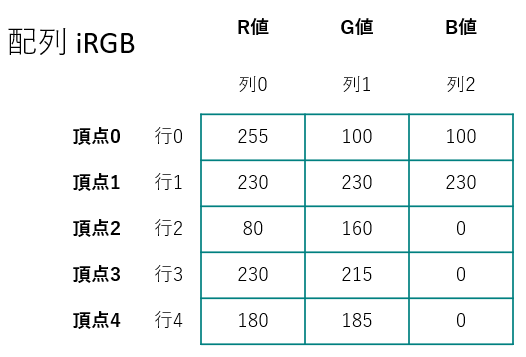

#### HSB情報の記述

例えば以下の配列は，下図のようにH,S,B値をもつ表として考えることができる．

```java
int[][] iHSB = { { 0,  80, 80 },
                 { 60, 80, 80 },
                 { 230,60, 80 },
                 { 300,15, 80 } };
```


#### 例1

HSB配列を使った格子形状の描画．

```java
size( 400,400 );
background(0);

int[][] iHSB = { { 0,  80, 80 },
                 { 60, 80, 80 },
                 { 230,60, 80 },
                 { 300, 1, 90 } };

colorMode( HSB, 360, 100, 100 );

for( int iY = 0; iY < height; iY+=20 )
{
  for( int iX = 0; iX < width; iX+=20 )
  {
    int iColorIdx = floor( random( iHSB.length ) );	// 行番号をランダムで選択:0~3
    
    fill( iHSB[iColorIdx][0], iHSB[iColorIdx][1], iHSB[iColorIdx][2] );
    
    square( iX, iY, 20 );
  }
}
```


#### 例2

RGB配列を使った様々な図形の描画．

```java
size( 400,400 );
background(0);

int[][] iRGB = { { 255, 100, 100 },
                 { 230, 230, 230 },
                 {  80, 160,   0 },
                 { 230, 215,   0 },
                 { 180, 185,   0 } };

translate( 40, 40 );

// 矩形描画
rectMode(CENTER);
for( int iRectIdx = 0; iRectIdx < 5; iRectIdx++ )
{
  fill( iRGB[iRectIdx][0], iRGB[iRectIdx][1], iRGB[iRectIdx][2] );
  square( iRectIdx*80, 0, 80 );
}

translate( 0, 80 );

// 正円描画
for( int iCircleIdx = 0; iCircleIdx < 5; iCircleIdx++ )
{
  fill( iRGB[iCircleIdx][0], iRGB[iCircleIdx][1], iRGB[iCircleIdx][2] );
  circle( iCircleIdx*80, 0, 80 );
}

translate( 0, 80 );

// 三角形描画
for( int iTriangleIdx = 0; iTriangleIdx < 5; iTriangleIdx++ )
{
  fill( iRGB[iTriangleIdx][0], iRGB[iTriangleIdx][1], iRGB[iTriangleIdx][2] );
  triangle( iTriangleIdx*80,   -40,
            iTriangleIdx*80-40, 40,
            iTriangleIdx*80+40, 40 );
}

translate( 0, 80 );

// 弧描画
for( int iArcIdx = 0; iArcIdx < 5; iArcIdx++ )
{
  fill( iRGB[iArcIdx][0], iRGB[iArcIdx][1], iRGB[iArcIdx][2] );
  arc( iArcIdx*80, 0, 80, 80, radians(45), radians(270), PIE );
}

translate( 0, 80 );

// 多角形描画
for( int iPolygonIdx = 0; iPolygonIdx < 5; iPolygonIdx++ )
{
  fill( iRGB[iPolygonIdx][0], iRGB[iPolygonIdx][1], iRGB[iPolygonIdx][2] );
  beginShape();
  vertex( iPolygonIdx*80-40, -40 );
  vertex( iPolygonIdx*80+40, -40 );
  vertex( iPolygonIdx*80+40,  40 );
  endShape(CLOSE);
}
```


### 演習6

以下のサンプルを改良し，より豊かな表現を行ってみましょう．

- 色のパターンを増やす．
- 背景や線に色を指定する．
- if文を使って図形の大きさを変化させる．
- 演習時間

HSB配列を使った正円を格子状に並べた描画．

```
size( 400,400 );

int[][] iHSB = { { 0,  0,   0 },
                 { 0,  0, 100 } };

colorMode( HSB, 360, 100, 100 );

ellipseMode(CORNER);
for( int iY = 0; iY < height; iY+=20 )
{
  for( int iX = 0; iX < width; iX+=20 )
  {
    int iColorIdx = floor( random( iHSB.length ) );  // 行番号をランダムで選択:0~3
    
    fill( iHSB[iColorIdx][0], iHSB[iColorIdx][1], iHSB[iColorIdx][2] );
    
    circle( iX, iY, 20 );
  }
}
```


#### 作例

- 16分の1の確率で円を大きくする．
- 円の大きさに比例して枠線を太くする．

```java
size( 400,400 );
background( 0, 0, 20 );

int[][] iHSB = { { 10,   40,  80 },
                 { 120,  80,  70 },
                 { 280,  60,  60 },
                 { 90,   90,  60 },
                 { 340,  70, 100 } };

colorMode( HSB, 360, 100, 100, 100 );

for( int iY = 10; iY < height; iY+=20 )
{
  for( int iX = 10; iX < width; iX+=20 )
  {
    int iColorIdx = floor( random( iHSB.length ) );  // 行番号をランダムで選択
    
    fill( iHSB[iColorIdx][0], iHSB[iColorIdx][1], iHSB[iColorIdx][2], 60 );
    
    int iCircleSize =  floor( random(12,28));
    
    if( floor(random(16))%16 == 0 )    // 16分の1の確率で円を大きくする．
    {
      iCircleSize = floor( random(60,260));
      stroke( 10, 2, 2 );
      strokeWeight(iCircleSize/14);    // 円の大きさに比例して枠線も太くする．
    }
    else
    {
      noStroke();
    }
    
    strokeWeight(iCircleSize/14);    // 円の大きさに比例して枠線も太くする．
    circle( iX, iY, iCircleSize );
  }
}
```


### 参考: ルール９０セル・オートマトン

- セル・オートマトンとは，格子状に配置されたセルがそれぞれ状態を持ち，隣接している周囲のセルの状態をもとに，時間とともに状態を遷移させていくモデル．
- ２次元配列を使って表現することができる．
- 一定のルールを与えることで，単純な規則から複雑な結果を得ることができる．

#### 初期状態

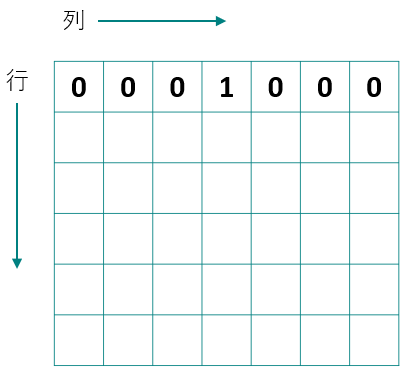

#### 隣接するセルの合計が次の(行の)値になる

このルールをさらに次の行へと進めていく．

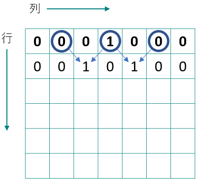

#### 奇数のセルを描画する

プログラム中では奇数を1，偶数を0として配列に格納している．


#### 制作手順

今回制作するプログラムでは，セル=ピクセルと考える．

1. 二次元配列の宣言，初期化
   格子状のセルを表す配列を用意する．

   ```java
   size(500,500);
   
   int[][] cell = new int[width][height]; // スクリーンサイズ分の配列.
   
   for(int iY=0; iY<height; iY++)  	   // 列の繰り返し
   {
     for(int iX=0; iX<width; iX++)      // 行の繰り返し
     {
       cell[iX][iY]=0;
     }
   }
   ```

2. 初期状態の入力

   - 最初の行の中心のセルを1，それ以外は0
   - 初期状態の唯一のセルを描画

   ※以上の処理をステップ1のプログラムの後に追加する．

   

   ```java
   size(500,500);
   
   int[][] cell=new int[width][height]; // スクリーンサイズ分の配列.
   
   for(int iY=0; iY<height; iY++)  	   // 列の繰り返し
   {
     for(int iX=0; iX<width; iX++)      // 行の繰り返し
     {
       cell[iX][iY]=0;
     }
   }
   
   cell[width/2][0]= 1;  // 初期状態：最初の行の中心のセルを1，それ以外は0
   point( width/2, 0 );  // 描画.
   ```

3. 隣接するセルの合計が次の(行の)値になる．

   - for文のネストによる繰り返し

   ※以上の処理をステップ2のプログラムの後に追加する．

   

   ```java
   size(500,500);
   
   int[][] cell=new int[width][height]; // スクリーンサイズ分の配列.
   for(int iY=0; iY<height; iY++)  	   // 列の繰り返し
   {
     for(int iX=0; iX<width; iX++)      // 行の繰り返し
     {
       cell[iX][iY]=0;
     }
   }
   
   cell[width/2][0]= 1;  // 初期状態：最初の行の中心のセルを1，それ以外は0
   point( width/2, 0 );  // 描画.
   
   for(int iY=1; iY<height; iY++)  // ２行目から繰り返し開始．
   {
     for(int iX=0; iX<width; iX++)	// 列0から繰り返し．
     {
       // 隣接するセルの合計が偶数なら0,奇数なら1をセルの値に代入.
       cell[iX][iY] = ( cell[iX-1][iY-1] + cell[iX+1][iY-1] )%2;
       if( cell[iX][iY] == 1 )    // もしもセルの値が1なら.
       {
         point( iX, iY );
       }
     }
   }
   ```

   

4. スクリーン両端の処理
   ステップ3のままだと`iX-1`の値がマイナスになったり，`iX+1`の値が配列の要素番号の最大を超えてしまう．
   ※ステップ3までのプログラムを書き換えると以下のようになる．

#### 完成したプログラム


```java
size(500, 500);

int[][] cell=new int[width][height]; // スクリーンサイズ分の配列.
for(int iY=0; iY<height; iY++)  	   // 列の繰り返し
{
  for(int iX=0; iX<width; iX++)      // 行の繰り返し
  {
    cell[iX][iY]=0;
  }
}

cell[width/2][0]= 1;  // 初期状態：最初の行の中心のセルを1，それ以外は0
point( width/2, 0 );  // 初期状態の唯一のセルを描画. 

for(int iY=1; iY<height; iY++)  // ２行目から繰り返し開始．
{
  for(int iX=0; iX<width; iX++)	// 列0から繰り返し．
  {
    if( iX == 0 )             // スクリーン左端の処理.
    {
      cell[iX][iY] = ( 0 + cell[iX+1][iY-1] )%2;
    }
    else if( iX == width-1 )  // スクリーン右端の処理.
    {
      cell[iX][iY] = ( cell[iX-1][iY-1] + 0 )%2;
    }
    else
    {
      // 隣接するセルの合計が偶数なら0,奇数なら1をセルの値に代入.
      cell[iX][iY] = ( cell[iX-1][iY-1] + cell[iX+1][iY-1] )%2;
    }
    if( cell[iX][iY] == 1 )    // もしもセルの値が1なら.
    {
      point( iX, iY );
    }
  }
}
```


#### 初期状態（一行目のセルの状態）を変える

巻貝の表面模様のような画像が生成される．
この例では最初の行のセルの値が0か1かを全てランダムに決定している．

```java
size(500,500);

int[][] cell=new int[width][height]; // スクリーンサイズ分の配列.

for(int iY=0; iY<height; iY++)  	   // 列の繰り返し
{
  for(int iX=0; iX<width; iX++)      // 行の繰り返し
  {
    cell[iX][iY]=0;
  }
}

// 初期状態：最初の行のセルの値を全てランダム
for(int iX=0; iX<width; iX++)
{
  cell[iX][0]= floor( random( 100 ) )%2;
  if( cell[iX][0] == 1 )    // もしもセルの値が1なら，1行目を描画.
  {
    point( iX, 0 );
  }
}

for(int iY=1; iY<height; iY++)  // ２行目から繰り返し開始．
{
  for(int iX=0; iX<width; iX++)
  {
    if( iX == 0 )             // スクリーン左端の処理.
    {
      cell[iX][iY] = ( 0 + cell[iX+1][iY-1] )%2;
    }
    else if( iX == width-1 )  // スクリーン右端の処理.
    {
      cell[iX][iY] = ( cell[iX-1][iY-1] + 0 )%2;
    }
    else
    {
      // 隣接するセルの合計が偶数なら0,奇数なら1をセルの値に代入.
      cell[iX][iY] = ( cell[iX-1][iY-1] + cell[iX+1][iY-1] )%2;
    }
    if( cell[iX][iY] == 1 )    // もしもセルの値が1なら.
    {
      point( iX, iY );
    }
  }
}
```

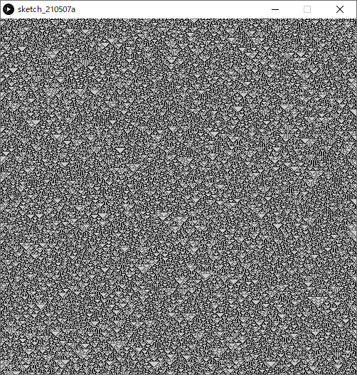


## 多次元配列

- 配列の次元数は二次元以上にも増やすことができる．

- しかし，次元が増えるほど人にとっては直感的に理解しにくくなる．
  - 使用頻度も少ない．

### int型の３次元配列の宣言文の例

```java
int [][][] iRGBColor = new int[3][640][480];
```


#### 例1

ピクセル毎のRGB値を持つ３次元配列を使った描画．

```java
int iColorMax = 100;

size(400,400);

int[][][] iColor = new int[3][width][height]; // 初期化

for(int iRGB = 0; iRGB < iColor.length; iRGB++ )
{
  for(int iX = 0; iX < width; iX++ )
  {
    for(int iY = 0; iY < height; iY++ )
    {
      iColor[iRGB][iX][iY] = 0;
    }
  }
}

// 色決定
for(int iX = 0; iX < width; iX++ )
{
  for(int iY = 0; iY < height; iY++ )
  {
    if( iX < width / 3 )
    {
      iColor[0][iX][iY] = iColorMax; //R
    }
    if( iY < height / 3 )
    {
      iColor[1][iX][iY] = iColorMax; //G
    }
    if( iX + iY > height )
    {
      iColor[2][iX][iY] = iColorMax; //B 右下の三角形
    }
  }
}

// 全チャンネルを参照し，画素RGB描画
colorMode(RGB,iColorMax);
for(int iX = 0; iX < width; iX++ )
{
  for(int iY = 0; iY < height; iY++ )
  {
    stroke(iColor[0][iX][iY],
           iColor[1][iX][iY],
           iColor[2][iX][iY]);
    point(iX,iY);
  }
}
```


# アニメーション

## アニメーションの基礎知識

### 動画のフレームとは

- 動画を構成する一枚一枚の静止画（コマ）のこと
- 人間の目で動いているように見せるため，ごく短い時間間隔で切り替わっている．

### フレームレートとは

- 動画の滑らかさの指標．
- **fps** ( frames per second )
  - **1秒間に書き換えるフレームの数**，フレーム毎秒．
  - Processing でもこれを指定することでフレームレートを指定できる．

## StaticモードとActiveモード

### Staticモード

- これまでの静止画を描画するモード．

- プログラムが上から書いた順番に実行され，終了する．

### Activeモード

- アニメーションを行う場合，**Activeモードでプログラムを記述する必要**がある．
- 全体のプログラムを二つのブロックに分けて記述する．
  - 初期設定
    - 開始時に１度だけ処理を行う．
  - 描画
    - 毎フレーム処理を行う．
- プログラムは終了命令が下されるまで終了しない．
- 静止画の描画も行えるので，ほぼStaticモードの上位互換．


## アニメーション入門

Activeモードを使い，アニメーションを行うプログラムの作成を始めてみましょう．

### 1.　空の`setup()`と`draw()`を記述する．

```java
void setup()
{

}

void draw()
{

}
```

プログラミングの開始時に，このような枠を記述してしまいましょう．

### 2.　`setup()`ブロック内で初期化を行う．

プログラム実行時に，最初に１度だけ実行する（命令）文を記述する．

#### よく使われる命令

- 画面のサイズ`size()`
- 背景色`background()`
- カラーモード`colorMode()`
- フレームレート`frameRate()`

#### 例

`setup()`ブロック内で初期化を行う記述例．

```java
void setup()
{
  size( 200, 200 );
  frameRate( 4 );
  colorMode( RGB, 255 );
  background( 211, 211, 211 );
}

void draw()
{

}
```

ブロック内のインデントをしっかり行うこと．

### 3. 　`draw()`ブロック内で描画を行う．

- ブロックの中の命令文が繰り返し実行される．
  - `setup()`が実行された直後．

- `frameRate()`で指定した頻度で繰り返される．
  - 例えば，`frameRate( 30 );// フレームレート30fps`なら，１秒間に30回実行される．

- `draw()`の終了時にスクリーン（描画）を更新する．

#### よく使われる命令

- 図形描画`point(), line(), rect(), ellipse()`など
- 繰り返しfor文
- 条件分岐if文
- 変数への代入，算術式など

#### 例

ランダムな大きさ，色の正円を描画するアニメーション

```java
void setup()
{
  size( 200, 200 );
  frameRate( 4 );
  colorMode( RGB, 255 );
  background( 211, 211, 211 );
}

void draw()
{
  // ランダムな大きさ，色の正円を描画する．
  fill( random(255), random(255), random(255) );
  circle( width/2, height/2, random(10, 180) );
}

```


### 演習1

#### ランダムな点描アニメーション

下の動画のように，ランダムな位置・色の点（ドット）の描画アニメーションを作成してみましょう．

- 演習時間8分程度


以下の手順を参考にしてください．

#### 1. 空の`setup()`と`draw()`を記述する．

```java
void setup()
{
}
void draw()
{
}
```

#### 2. 初期化処理．

`setup()`ブロックに以下の処理を記述する．

- 「スクリーンサイズ: 200×200」
- 「背景色: 黒 `0, 0, 0`」

```java
void setup()
{
  size(200, 200);
  background( 0, 0, 0 );
}
void draw()
{
}
```

#### 3. 点を描画する．

`draw()`ブロックに以下の処理を記述する．

- 「線の太さ: 0~4のランダム」
- 「線の色: RGB全て0~255のランダム」
- 「点の描画: XY座標値がスクリーン上のランダムな位置」

```java
void setup()
{
  size(200, 200);
  background( 0, 0, 0 );
}
void draw()
{
  strokeWeight( random(4) );
  stroke( random(255), random(255), random(255) );
  point( random(width), random(height) );		// 点の描画
}
```


### Activeモードで静止画のプログラム書く場合

setup()ブロック内に描画命令を書くだけ．
draw()は必要ない．

```java
void setup()
{
  size( 200, 200 );
  frameRate( 4 );
  colorMode( RGB, 255 );
  background( 211, 211, 211 );

  // ランダムな大きさ，色の正円を描画する．
  fill( random(255), random(255), random(255) );
  circle( width/2, height/2, random(10, 180) );
}
```

### Activeモードまとめ

- 1回だけしか実行されない命令
  → `setup()`ブロック内に記述する．
- アニメーションのように，毎フレーム実行される命令
  →`draw()`ブロック内に記述する．
- 静止画の描画
  →`setup()`ブロック内に描画命令を書く

https://processing.org/reference/setup_.html
https://processing.org/reference/draw_.html


## アニメーションの基本

### フレームレートの設定

１秒間に描画を行う（`draw()`が実行される）回数を指定できる．
特に指定をしない場合，デフォルトは**60**fpsとなる．

#### 書式

```java
frameRate( fps );
```

#### 例

フレームレート30fps

```java
void setup()
{
	frameRate( 30 );
}
```

https://processing.org/reference/frameRate_.html


### 画面のリフレッシュ

- `draw()`は，<u>前フレームの描画結果の上に</u>新しい描画を重ねて行ってしまう．
- フレームごとに画面をリフレッシュしたい場合は，以下のコードのように，**背景と同じ色の矩形を画面全体に描画する**事で行う．

```java
void draw()
{
  // 画面のリフレッシュ.  
  fill( 0, 0, 0 );	// 背景色
  rect( 0, 0, width, height );
}
```

##### 例

ランダムな矩形を１つ描画するアニメーション

```java
void setup()
{
  size( 128, 128 );
  frameRate( 1 );
  background( 0, 0, 0 );
}
void draw()
{
  // 画面のリフレッシュ.  
  fill( 0, 0, 0 );
  rect( 0, 0, width, height );
  
  // ランダム矩形の描画.
  fill( random( 170, 250 ), random( 100, 150 ), 200 );
  rect( random( width ), random( height ), 20, 20 );
}
```

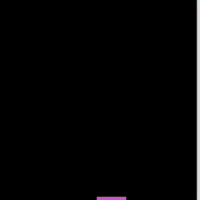

#### アルファ値を使った画面リフレッシュ

以下のコードのように，**半透明の矩形**を用いて画面をリフレッシュすることで，<u>少しずつ古い図形が消えていくような表現</u>が実現できる．

```java
void draw()
{
  // 画面のリフレッシュ.  
  fill( 0, 0, 0, 100 );        // アルファ値：100
  rect( 0, 0, width, height );
}
```

##### 例

ランダムな矩形を１つずつ描画し，徐々に消えていくアニメーション

```java
void setup()
{
  size( 128, 128 );
  frameRate( 1 );
  colorMode( HSB, 360, 1, 1 );
  background( 0, 0, 0 );
}
void draw()
{
  // 画面のリフレッシュ.  
  fill( 0, 0, 0, 100 );        // アルファ値：100
  rect( 0, 0, width, height );
  
  // ランダム矩形の描画.
  fill( 170 + random(80), 100 + random(50), 200 );
  rect( random(width), random(height), 20, 20 );
}
```


### 演習2

演習1で作成したプログラムに，以下の処理を追加してみましょう．

- フレームレートを 4 に設定する．
- 画面を黒色`( 0, 0, 0 )`で毎フレームリフレッシュする．

演習時間5分程度


以下，演習1のプログラム．

```java
void setup()
{
  size(200, 200);
  background( 0, 0, 0 );
}
void draw()
{
  strokeWeight( random(4) );
  stroke( random(255), random(255), random(255) );
  point( random(width), random(height) );		// 点の描画
}
```


### 変数によるアニメーション

- <u>描画フレーム毎に</u>変数の値を変化させることで，アニメーションの表現の幅が広がる．
- その際の変数として，**グローバル変数**を用いる．

#### グローバル変数

- **ブロックの外で宣言すればグローバル変数**となる．

  - `setup()`や`draw()`のブロックに入れないこと．

- グローバル変数に対して，ローカル変数も存在する．

  ※詳しくは，後の「変数のスコープ」のセクションで解説する．

#### 例

グローバル変数iXを使い，矩形のX座標値を変化させるアニメーション

```java
int iX;			 // グローバル変数の宣言

void setup()
{
  iX = 0;		 // グローバル変数の初期化
}
void draw()
{
  iX = iX + 5;
  square( iX, 40, 20 );
}
```


グローバル変数`iX`の宣言文が，`setup()`や`draw()`のブロックの外に記述されていることを確認してください．
グローバル変数の宣言文は，基本的には**プログラムの一番上に記述**する．


### 演習3

正方形がウィンドウ左から右へ移動を繰り返すアニメーションを作成してみましょう．

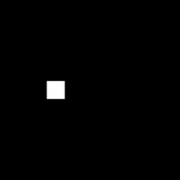

以下の手順を参考にしてください．

#### 1. 空の`setup()`と`draw()`を記述する．

`setup()`と`draw()`，及びそれらのブロックを記述する．

```java
void setup()
{
}
void draw()
{
}
```

#### 2. 初期化処理を追加する．

`setup()`ブロックに以下の処理を記述する．

- 「スクリーンサイズ: 200×200」
- 「フレームレート: 8 (fps)」

```java
void setup()
{
  size( 200, 200 );
  frameRate( 8 );
}

void draw()
{
}
```

#### 3. グローバル変数を追加する．

- `int`型のグローバル変数`iX`の宣言文を記述する．

- `setup()`ブロックに以下の処理を記述する．

  「`iX`に0を代入して初期化する．」

```java
int iX;          // グローバル変数の宣言

void setup()
{
  size( 200, 200 );
  frameRate( 8 );
  iX = 0;        // iXの初期化
}

void draw()
{
}
```

#### 4. 正方形を描画する．

`draw()`ブロックに以下の処理を記述する．

「大きさが20である白色の正方形を，座標`( iX, height/2-10 )`に描画する．」


```java
int iX;

void setup()
{
  size( 200, 200 );
  frameRate( 8 );
  iX = 0;
}

void draw()
{
  fill( 255, 255, 255 );					// White
  square( iX, height/2-10, 20 );	// 正方形描画
}
```

#### 5. 正方形を動かす．

`draw()`ブロックに以下の処理を記述する．

「`iX`に4を足す．（加算）」


```java
int iX;

void setup()
{
  size( 200, 200 );
  frameRate( 8 );
  iX = 0;
}

void draw()
{
  iX += 4;	// フレーム毎に4を足す
  
  fill( 255, 255, 255 );
  square( iX, height/2-10, 20 );
}
```

#### 6. スクリーンのリフレッシュ処理の追加

`draw()`ブロックに以下の処理を記述する．

「スクリーンを黒でリフレッシュする．」


```java
int iX;

void setup()
{
  size( 200, 200 );
  frameRate( 8 );
  iX = 0;
}

void draw()
{
  fill( 0, 0, 0 );              // 黒
  rect( 0, 0, width, height );  // スクリーンのリフレッシュ
  
  iX += 4;

  fill( 255, 255, 255 );
  square( iX, height/2-10, 20 );
}
```

#### 7. スクリーンの外に出たら左端に戻す．

`draw()`ブロックに以下の処理を記述する．

「もしiX値がスクリーン幅の値より大きかったらiX値を0に戻す．」


```java
int iX;

void setup()
{
  size( 200, 200 );
  frameRate( 8 );
  iX = 0;
}

void draw()
{
  fill( 0, 0, 0 );
  rect( 0, 0, width, height );
  
  iX += 4;
  if( iX > width ) // もしX座標値がスクリーンの外なら
  {
    iX = 0;        // X座標値を0に戻す
  }

  fill( 255, 255, 255 );
  square( iX, height/2-10, 20 );
}
```


### 演習4

`sin()`を用いた単振動アニメーションを作成してみましょう．


以下の手順を参考にしてください．

#### 1. 空の`setup()`と`draw()`を記述する．

`setup()`と`draw()`，及びそれらのブロックを記述する．

```java
void setup()
{
}

void draw()
{
}
```

#### 2. 初期化処理を追加する．

`setup()`ブロックに以下の処理を記述する．

- 「スクリーンサイズ: 200×200」
- 「フレームレート: 20 (fps)」

```java
void setup()
{
  size( 200, 200 );
  frameRate( 20 );
}

void draw()
{
}
```

#### 3. グローバル変数を追加する．

- `int`型のグローバル変数`iDegree`の宣言文を記述する．

- `setup()`ブロックに以下の処理を記述する．

  「`iDegree`に0を代入して初期化する．」

```java
int iDegree;          // グローバル変数の宣言

void setup()
{
  size( 200, 200 );
  frameRate( 20 );
  iDegree = 0;        // iDegreeの初期化
}

void draw()
{
}
```

グローバル変数`iDegree`は，単振動における角度[**0~360**]°を保存するために用いる．

#### 4. 正円を描画する．

`draw()`ブロックに以下の処理を記述する．

「大きさが20である白色の正円を，座標`( 0, 90 * sin( radians(iDegree) ), 20 )`に描画する．」


```java
int iDegree;

void setup()
{
  size( 200, 200 );
  frameRate( 20 );
  iDegree = 0;
}

void draw()
{ 
  // 正円の描画
  fill( 255, 255, 255 );
  circle( 0,
          90 * sin( radians(iDegree) ),
          20 );
}
```

以上の記述により，正円の描画Y座標値が[**-90~90**]の間で変化する．
`sin()`自体は[**-1~1**]の間の値を返す．

#### 5. 正円を動かす．

`draw()`ブロックに以下の処理を記述する．

「`iDegree`に4を足す．（加算）」


```java
int iDegree;

void setup()
{
  size( 200, 200 );
  frameRate( 20 );
  iDegree = 0;
}

void draw()
{
  iDegree += 4;	// iDegreeに4を足す
  
  // 正円の描画
  fill( 255, 255, 255 );
  circle( 0,
          90 * sin( radians(iDegree) ),
          20 );
}
```

以上の記述により，グローバル変数`iDegree`に毎フレーム4が足される．

#### 6. 座標系の原点をスクリーン中心に移動する．

現在は，スクリーン左上の座標原点を基準に単振動をしてしまっている．
スクリーン中心を基準に単振動を行いたい．
`draw()`ブロックに以下の処理を記述する．

「座標系をスクリーン中心へ平行移動する．」


```java
int iDegree;

void setup()
{
  size( 200, 200 );
  frameRate( 20 );
  iDegree = 0;
}

void draw()
{ 
  iDegree += 4;
  
  translate( width/2, height/2 );    // 座標系の原点をスクリーン中心へ移動．
  
  // 正円の描画
  fill( 255, 255, 255 );	// 白
  circle( 0,
          90 * sin( radians(iDegree) ),
          20 );
}
```

#### 8. スクリーンのリフレッシュ処理の追加

`draw()`ブロックに以下の処理を記述する．

「スクリーンを**アルファ値120**の黒色：`( 0, 0, 0, 120 )`でリフレッシュする．」


```java
int iDegree;

void setup()
{
  size( 200, 200 );
  frameRate( 20 );
  iDegree = 0;
}

void draw()
{
  fill( 0, 0, 0, 120 );						// アルファ値120の黒
  rect( 0, 0, width, height );		// スクリーンリフレッシュ

  iDegree += 4;
  
  translate( width/2, height/2 );
  
  // 正円の描画
  fill( 255, 255, 255 );
  circle( 0,
          90 * sin( radians(iDegree) ),
          20 );
}
```

半透明の矩形で画面リフレッシュを行っているため，残像のような表現が生成されている．

#### 9. iDegreeの値が360を超えたら0に戻す．

`draw()`ブロックに以下の処理を記述する．

「もしiDegree値が360より大きかったら値を0に戻す．」


```java
int iDegree;

void setup()
{
  size( 200, 200 );
  frameRate( 20 );
  iDegree = 0;
}

void draw()
{
  fill( 0, 0, 0, 120 );						// アルファ値120の黒
  rect( 0, 0, width, height );		// スクリーンリフレッシュ

  iDegree += 4;
  if( iDegree > 360 )		// 360を超えたら0に戻す
  {
    iDegree = 0;
  }
  
  translate( width/2, height/2 );
  
  // 正円の描画
  fill( 255, 255, 255 );
  circle( 0,
          90 * sin( radians(iDegree) ),
          20 );
}
```


## アニメーション応用

### 移動の向きを変えるアニメーション

```java
int  iPosX;			 // 正円の現在のX座標値
int  iDirctionX; // 進む向き( 1:+X方向, -1:-X方向 )

void setup()
{
  size(200, 200);
  colorMode( RGB, 1, 1, 1 );
  noStroke();
  frameRate(8);
  iPosX = 0;
  iDirctionX  = 1;
}

void draw()
{
  fill( 0, 0, 0 );
  rect( 0, 0, width, height );	// 画面リフレッシュ
  
  fill( 1, 1, 1 );
  ellipse( iPosX, height/2, 30, 30 );	// 正円の描画
  
  iPosX += iDirctionX*4;             // 現在のX座標値を更新する
  if( iPosX >= width || iPosX < 0 )  // もしX座標値がスクリーン幅以上もしくは0未満だったら
  {
    iDirctionX *= -1;  // 向きを逆方向に変える(-1をかける)
  }
}
```


スクリーンの右端と左端で進む向きを反転させる必要がある．

- 現在の<u>楕円進む向き</u>の情報を保存する**グローバル変数**`iDirctionX`
- 条件分岐`if`を使い，<u>楕円がスクリーン端を超えたときに進む向きを変える</u>．
- 「向きが反転する」とはこの場合，(+)プラスが(-)マイナスになる，もしくは(-)マイナスが(+)プラスになること．

### 回転アニメーション

```java
int iRatateDeg;             // 現在の回転角度

void setup()
{
  size( 200, 200 );
  frameRate( 8 );
  iRatateDeg = 0;
}
void draw()
{
  // 画面のリフレッシュ.
  noStroke();
  fill( 120, 120, 120 );
  rect( 0, 0, width, height );
  
  iRatateDeg += 2;                 // 毎フレーム2°回転
  if( iRatateDeg > 360 )
  {
    iRatateDeg -= 360;             // 360°以上回転したら戻す.
  }
  
  translate( width/2, height/2 );  // 座標原点をスクリーン中心へ.
  rotate( radians(iRatateDeg) );   // 座標系回転.
  
  strokeWeight( 4 ); // 線の太さ.
  stroke( 0, 0, 0 );
  line( 0, 0, width/2, 0 );				 // 線描画
}
```


### 親子関係の入れ子アニメーション

惑星の公転のような回転アニメーション

```java
int iRatateDegL;             // 大型の星の現在の回転角
int iRatateDegM;             // 中型の星の現在の回転角
int iRatateDegS;             // 小型の星の現在の回転角

void setup()
{
  size( 300, 300 );
  frameRate( 20 );
  iRatateDegL = 0;
  iRatateDegM = 0;
  iRatateDegS = 0;
}
void draw()
{
  // 画面のリフレッシュ.
  fill( 10, 10, 10 );
  noStroke();
  rect( 0, 0, width, height );
  
  // 大型の星回転
  iRatateDegL += 2;                 // 毎フレーム2°回転
  if( iRatateDegL > 360 )
  {
    iRatateDegL -= 360;             // 360°以上回転したら戻す.
  }

  // 中型の星回転
  iRatateDegM += 2;                 // 毎フレーム2°回転
  if( iRatateDegS > 360 )
  {
    iRatateDegM -= 360;             // 360°以上回転したら戻す.
  }

  // 小型の星回転
  iRatateDegS += 2;                 // 毎フレーム2°回転
  if( iRatateDegS > 360 )
  {
    iRatateDegS -= 360;             // 360°以上回転したら戻す.
  }
  
  translate( width/2, height/2 );   // 座標原点をスクリーン中心へ.
 
  // 大型の星描画
  rotate( radians(iRatateDegL) );   // 座標系回転(大型の星)
  translate( width/8, 0 );          // 座標原点を大型の星の中心へ
  fill( 255, 0, 0 );
  ellipse( 0, 0, 50, 50 );
    
  // 中型の星描画
  rotate( radians(iRatateDegM) );   // 座標系回転(中型の星)
  translate( width/4, 0 );          // 座標原点を中型の星の中心へ
  fill( 0, 255, 0 );
  ellipse( 0, 0, 30, 30 );
  
  // 小さい星描画
  rotate( radians(iRatateDegS) );   // 座標系回転(小さい星)
  translate( width/10, 0 );         // 座標原点を小さい星の中心へ
  fill( 0, 0, 255 );
  ellipse( 0, 0, 16, 16 );
}
```


### 波形の移動（位相変化）アニメーション

```java
int iAmplitudeL = 80;  // 振幅（大きな波の高さ）
int iAnimPulseDeg = 0; // 波の角度

void setup()
{
  size( 400,200 );
  colorMode( HSB, 90, 1.0, 1.0, 1.0 );
}

void draw()
{
  noStroke();
  fill( 0, 0, 0.4 );
  rect( 0, 0, width, height );						// スクリーンリフレッシュ
  
  iAnimPulseDeg += 2; 										// アニメーション用の角度を2°増やす.
  if( iAnimPulseDeg > 360 )               // 360°を超えたらリセット.
  {
    iAnimPulseDeg -= 360;
  }
  
  // コサイン波形の描画
  // X座標値を1増やしながらlineを繰り返し描画する．
  strokeWeight( 8 );
  for( int iX=0; iX < width; iX++ )
  {
    int iAngle0 = iX*4+iAnimPulseDeg;        // アニメーション用の角度を加算
    int iAngle1 = (iX+1)*4+iAnimPulseDeg;    // アニメーション用の角度を加算

    stroke( iX%90, 1.0, 1.0 );
    line( iX, height/2 + iAmplitudeL*cos( radians(iAngle0) ),
          iX, height/2 + iAmplitudeL*cos( radians(iAngle1+1) ) );
  }
}
```


### 円弧のアニメーション

```java
int iArcAnimDeg;        // アニメーション用円弧の角度

void setup()
{
  size( 200, 200 );
  frameRate( 8 );
  iArcAnimDeg = 0;      // アニメーション用変数初期化
}
void draw()
{
  fill( 120, 120, 120 );
  noStroke();
  rect( 0, 0, width, height ); // 画面のリフレッシュ.
  
  if( iArcAnimDeg < 180 )	// 180°以上変化したらリセット.
  {
    iArcAnimDeg += 4;		// 毎フレームの変化角度
  }
  else
  {
    iArcAnimDeg -= 180;		// リセット.
  }
  
  int iArcAnimDegBegin = iArcAnimDeg - 90;		 // 円弧の始まりの角度を計算.
  int iArcAnimDegEnd   = 270 - iArcAnimDeg;    // 円弧の終わりの角度を計算.
  
  // 円弧描画
  fill( 255, 255, 255 );
  stroke( 0,0,0 );
  arc(width/2, height/2, width, height, radians(iArcAnimDegBegin), radians(iArcAnimDegEnd), CHORD);
}
```


## 変数のスコープ

変数にはローカル変数とグローバル変数の二種類の変数がある．

### ローカル変数

- **ブロック文の中で宣言した変数**のこと．
- ブロック内の処理が開始される度にメモリ領域が初期化されるため，<u>フレームをまたいで値を保存することができない</u>．
  - アニメーションにおいては局所的な使用に限られる．


#### 例1

様々なローカル変数の宣言文

```java
if(/** 省略 */)
{    
  int iA;	// ローカル変数
}
```

```java
for(/** 省略 */)
{
  int iB;	// ローカル変数
}
```

```java
void setup()
{
  int iC;	// ローカル変数
}
void draw()
{
  int iD;	// ローカル変数
  
  for(/** 省略 */)
  {
     int iE;	// ローカル変数
  }
}
```

- ローカル変数・配列は，**宣言文のあるブロック内**でのみ有効．
  - 有効な範囲を**スコープ**という．
- 宣言文のあるブロック内にさらに**ネストされているブロック内**でも有効．

#### 例2

`for{}`ブロック内に`for{}`をネストした例

```java
for(/** 省略 */)
{
  int iX = 0;
  int iY = 0;
  point( iX, iY );
  
  for(/** 省略 */)
  {
    point( iX, iY );	// ローカル変数 iX,iY が使える
  }
}
```

#### 例3

`for{}`ブロック内に`if{}`をネストした例

```java
if(/** 省略 */)
{
  int iX = 0;
  int iY = 0;
  point( iX, iY );
  
  if(/** 省略 */)
  {
    int iZ = 0;
    point( iX, iY );  // ローカル変数 iX,iY が使える
  }
  
  iZ = iZ +1;				  // エラー：変数iZは存在しません
}
point( iX, iY );			// エラー：変数iX,iYは存在しません
```

#### 例4

`setup{}`ブロック内に`if{}`をネストした例

```java
void setup()
{
  int iX = 0;
  int iY = 0;
  point( iX, iY );		// ローカル変数 iX,iY が使える
  
  if(/** 省略 */)
  {
    point( iX, iY );	// ローカル変数 iX,iY が使える
  }
}
void draw()
{
  point( iX, iY );		// エラー：変数iX,iYは存在しません
}
```

### グローバル変数

- グローバル変数のスコープはプログラム文全体であり，全ての範囲で有効．


- プログラムが終了するまで，メモリ領域が初期化されることなく残る．

#### 使い方

- **ブロック外で宣言すればグローバル変数**となる．
- 通常，**プログラムの一番上に記述**する．

```java
int iX;			 // 宣言
void setup()
{
  iX = 0;		 // OK
}
void draw()
{
  iX = iX + 5; // OK
}
```


# 関数の作成

## 関数( function )とは

既に授業で使用している命令のこと．

```java
size(), colorMode(), point(), rect(), ellipse(), random(), sin(), cos(), tan()...
```

`( )`が後ろに付くものはほぼ全て関数であると考えてよい．

逆に，関数ではないもの

```java
for, if, else, else if, switch ...		// 主に制御文関連のもの
```

## 関数の呼び出し

関数を使用することを，関数を呼び出す（ **コール**する）という．

関数は，与えられた値（**引数**）を元に複数の命令を実行し，何らかの値（**返り値**）を返す．
フローチャートにおいて，下図のような図形で表現される．

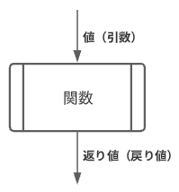

実は関数のコールは既にこれまでに行っている．
例えば，`random()`や`ellipse()`等を用いた命令文の記述では，関数のコールを行っている．
それらの命令文は下図のような要素から成り立っている．


上図の`ellipse()`のように，値を返さない（返り値が無い）関数も存在する．
そのような値を返さない関数を**void関数**という．

このようなことから，関数のコールは以下のような書式で行えることが分かる．

```java
関数名( 引数 )
```

関数はコールされることで，初めてプログラム実行に影響を与える．
これから学ぶ<u>自作の関数</u>についても，これまで使ってきた様々な関数と同じように，`setup()`や`draw()`ブロック内でコールすればよい．

## 関数の定義

関数がどのような処理をおこなうか記述することを，**関数の定義**を行うという．
もっと簡単に言うと，関数を作成することを「関数の定義を行う」という．
関数の定義を行うことで，**独自の関数**を作ることができる．

### Processingのシステム関数

Processingに用意されている関数は，Javaというプログラミング言語で関数の定義が行われており，以下のリンクから関数の定義を調べることができる．

https://github.com/processing/processing
ソースプログラムのディレクトリ：processing-master\core\src\processing\core

例えば，三角形を描画する関数`triangle()`の関数の定義は以下のように記述されている．
※分かりやすくするため，多少修正している．

```java
void triangle( float x1, float y1, float x2, float y2, float x3, float y3 )
{
	beginShape(TRIANGLES);
	vertex(x1, y1);
	vertex(x2, y2);
	vertex(x3, y3);
	endShape();
}
```

この関数の定義を観察すると，ブロックの中で3つの頂点を用いた多角形の描画を行っていることがわかる．

このように，関数の定義に関しても，<u>これまで記述していたようなプログラムと同じような記述方法</u>で実現ができる．

### setup(),draw()との関連性

アニメーションのセクションでは`setup()`や`draw()`ブロックへの記述を行った．
これは，実はsetup()とdraw()の関数の定義を行っている．

```java
void setup()
{
  // (命令)文
}

void draw()
{
  // (命令)文
}
```

これらの先頭にある`void`の記述は，`setup()`や`draw()`関数が返り値を持たないvoid関数であることを示している．

### 返り値のある関数の書式

関数の定義は，返り値のある関数と返り値のないvoid関数で，多少異なる．

```java
返り値の型 関数名( 引数の型 仮引数 )
{
  // 命令(文);
  return 返り値；
}
```

引数は「,」区切りで複数記述でき，記述しない(0個)こともできる．
定義された関数のブロック内で，**仮引数**を用いて計算等を行う．
また，return文という命令文で関数が返す値（**返り値**）を指定する．

##### 例1

3つの引数を受け取り，それらの平均値を返す関数．

```java
float calcAverage( int iVal0, int iVal1, int iVal2 )
{
  float fAverage = ( iVal0 + iVal1 + iVal2 ) / 3.0;
  return fAverage;
}
```


##### 例2

1つの引数を受け取り，その値を半径とした円の面積を返す関数．

```java
int calcArea( int iRadius )
{
  int iArea = floor( PI * iRadius * iRadius );  // PI:円周率3.14...をもつシステム定数
  return iArea;
}
```


### 演習1

4つの引数を受け取り，それらの合計値を返す関数`calcSum()`を定義してみましょう．


### 返り値のない関数(void関数)の書式

```java
void 関数名( 引数の型 仮引数 ) // 引数は','区切りで複数可
{
  // 命令(文);
}
```

値を返すreturn文`return 返り値;`が無いことに注意．
void関数は，**複数の描画命令をまとめる**ことに主に用いる．

##### 例1

引数によってX,Y座標値を指定し，正方形と正円を描画する関数．

```java
void drawSquareCircle( int iX, int iY )
{
  square( iX, iY, 40 );
  circle( iX, iY, 40 );
}
```

##### 例2

引数によって描画する点の数を指定し，複数の点をランダムに描画する関数．

```java
void drawRandomDots( int iDotTotal )
{
  for( int iDotIdx = 0; iDotIdx < iDotTotal; iDotIdx++ )
  {
    point( random(width), random(height) );
  }
}
```


### 演習2

引数によってX,Y座標と大きさを指定し，正方形と正円を描画する関数を定義してみましょう．


### 関数定義の記述場所

関数定義は，**setup(), draw()のブロック外**に書く．
通常は，プログラムの後ろに記述することを推奨．

```java
void setup()
{
  myFunc1();			// 関数のコール
}

void draw()
{
  myVoidfunc1();	// 関数のコール
}

// 関数定義
int myFunc1()
{

}

void myVoidFunc1()
{

}
```

### 実引数と仮引数

関数の定義においては，引数ではなく「仮引数」となっていることに注意．
引数は**実引数**と**仮引数**の二種類がある．
例えば下図のプログラムにおいて，それぞれの対応を確認できる．


- 実引数
  - **関数の呼び出しの際に記述する引数**のこと．
  - 具体的な値．

- **仮引数**

  - **関数定義時に記述する引数**のこと．

  - 関数に渡された実引数の値を受け取る．
  - 関数内の命令を，仮引数を元に行う．
  - スコープは関数内のみ．

### return文

関数が値を返すための命令文をreturn文という．
以下のような書式で具体的な値を返す．

```java
return a;	  // 変数aの値を返す.
```

```java
return 1;	  // 値を直接記述してもよい．
```

```java
return a+b;	// 数式を書いてもよい．計算結果の値が返される．
```


## 描画：返り値のある関数

**複雑な計算**を行う処理を関数にまとめることができる．

- 表現の本質に直結しない複雑な計算を切り分け，`draw()`ブロックを見やすくする．
- 「円の面積を求める」「複数の値の平均値を求める」など

void関数の定義の方が使用頻度は高い．

### 例1

円の面積を元に，異なるアルファ値を持つ正円をランダム描画するアニメーション
円の面積が大きいほど，小さいアルファ値となる．

```java
void setup()
{
  size( 200, 200 );
  colorMode( RGB, 255, 255, 255, 40000 );  
  frameRate(4);
  background( 0, 0, 0 );
}
void draw()
{
  fill( 0, 0, 0, 5000 );
  rect( 0, 0, width, height );        // スクリーンリフレッシュ
  
  float fRadius = random( 20, 100 );  // 半径
    
  float fArea = calcArea( fRadius );  // 関数をコール
    
  fill( 255, 0, 0, 40000 - fArea );
  circle( random(width), random(height), fRadius*2 );  // 正円描画
}

/**
 * 円の面積を求める
 *
 * @param fRadius 半径
 * @return float 戻り値の説明
 */
float calcArea( float fRadius )
{
  float fArea = PI * fRadius * fRadius;
  return fArea;
}
```


### 例2

ランダムな大きさの矩形の並列描画．
関数の定義の中で描画を行いつつ，値を返すこともできる．

```java
void setup()
{
  size( 200, 200 );
  frameRate( 1 );
}
void draw()
{
  noStroke();
  fill( 201, 201, 201 );
  rect( 0, 0, width, height );  // スクリーンリフレッシュ
  
  int iX = 0;  // 矩形を描画するX座標値．
  
  for( int iRectIdx = 0; iRectIdx < 10; iRectIdx++ )
  {
    iX += drawRandomRect( iX );
  }
}

/**
 * 大きさがランダムな矩形を描画し，横幅の値を返す．
 *
 * @param iX X座標値
 * @return int 横幅の大きさ
 */
int drawRandomRect( int iX )
{
  int iHeight = floor( random( 20, 200 ) );
  int iWidth = floor( random( 8, 40 ) );

  stroke( 0 );
  fill( 100 );
  rect( iX, height/2-iHeight/2, iWidth, iHeight );
  return iWidth;
}
```


### if文で返り値を分岐させる

if文などで条件分岐を行うと，**return文を複数記述**できる．

#### 例

2つの引数を受け取り，大きい方の値を返す関数．

```java
int getBigger( int iA, int iB )
{
  if( iA > iB )	// iAがiBより大きければ
  {
    return iA;	// iAの値を返す
  }
  else
  {
    return iB;	// iBの値を返す
  }
}
```

ただし，必ずいずれかのreturn が実行されるように記述しなければならない．
以下，不可な例

```java
int func( int iA, int iB )
{
  if( iA > iB )
  {
    return iA;
  }
  else if( iB == 0 )
  {
    return iB;
  }
  // エラー．ここにreturnが必要．
}
```


## 描画：Void関数

**複雑な図形の描画**を関数にまとめることができる．

- `draw()`ブロックを見やすくする．
- 「まとまった複数の図形の組み合わせ」を用いたレイアウトを行いやすくなる．
- 詳細な描画命令文が関数定義に集中するため，描画の調整がしやすくなる．
- 独自の図形描画命令が作れる．

### 例1

2つの値（ X座標値, Y座標値 ）を受け取り，その座標に入れ子状に正方形を描画する．

```java
int iNestX;

void setup()
{
  size( 200, 200 );
  iNestX = -30;
}

void draw()
{ 
  rectMode( CORNER );
  noStroke();
  fill( 201, 201, 201 );
  rect( 0, 0, width, height );         // スクリーンリフレッシュ．

  rectMode( CENTER );
  stroke( 0 );
  fill( 255 );
  drawSquareNest( iNestX, height/2 );  // 関数コール
  
  iNestX++;
  if( iNestX > width+30 )
  {
    iNestX = -30;  // 入れ子のX座標値を左端に戻す
  }
}

/**
 * 入れ子状に正方形を描画する
 *
 * @param iX,iY 正方形の中心座標
 * @return 無し
 */
void drawSquareNest( int iX, int iY )
{
  // 正方形の大きさを60からスタートし，10ずつ小さくしながら繰り返す．
  for( int iSquareSize = 80; iSquareSize > 0; iSquareSize -= 10 )
  {
    square( iX, iY, iSquareSize );
  }
}
```


### 例2

現在の原点を中心に18個の楕円を描画する関数を使った花火のようなアニメーション．

```java
void setup()
{
  size( 200, 200 );
  frameRate(1);
  background( 0, 0, 0 );
}
void draw()
{
  fill( 0, 0, 0, 180 );
  rect( 0, 0, width, height );                        // スクリーンリフレッシュ
  
  translate( random( 20, 180 ), random( 20, 180 ) );  // ランダムな位置に座標原点を平行移動
  
  float fDistance = random( 20, 100 );	// 中心から広がる距離
  float fCircleSize = random( 4, 16 );	// １つの正円の大きさ
  
  noStroke();
  fill( random( 100, 255 ), random( 100, 255 ), random( 100, 255 ) );
  draw18Circles( fDistance, fCircleSize );            // 関数コール
}

/**
 * 現在の原点を中心に18個の正円を描画する
 *
 * @param fDistance 原点からの距離
 * @param fCircleSize 正円の大きさ
 * @return 無し
 */
void draw18Circles( float fDistance, float fCircleSize )
{
  for( int iCircleIdx = 0; iCircleIdx < 18; iCircleIdx++ )
  {
    circle( fDistance, 0, fCircleSize );
    rotate( radians(20) );
  }
}
```


### 演習1

例2に変更を加えて自由に花火のようなアニメーションを作ってみましょう．

- 演習時間8分程度
- 以下，作例

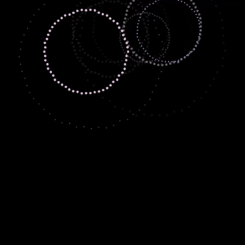

```java
void setup()
{
  size( 400, 400 );
  frameRate(4);
  background( 0, 0, 0 );
}
void draw()
{
  fill( 0, 0, 0, 80 );
  rect( 0, 0, width, height );                        // スクリーンリフレッシュ
  
  translate( random( 120, 280 ), random( 40, 120 ) );  // ランダムな位置に座標原点を平行移動
  
  float fDistance = random( 10, 120 );
  float fCircleSize = random( 2, 4 );
  
  noStroke();
  
  
  // 3種の色のパターンからランダム．
  
  int iColorPattern = floor(random(3));  // 0~2のランダム
  
  if( iColorPattern == 0 )
  {
    fill( random( 220, 255 ), random( 220, 255 ), random( 220, 255 ) );
  }
  else if( iColorPattern == 1 )
  {
    fill( random( 180, 255 ), random( 180, 255 ), random( 180, 255 ) );
  }
  else if( iColorPattern == 2 )
  {
    fill( random( 160, 255 ), random( 160, 255 ), random( 160, 255 ) );
  }
  
  draw60Circles( fDistance, fCircleSize );            // 関数コール
}

/**
 * 現在の原点を中心に60個の正円を描画する
 *
 * @param fDistance 原点からの距離
 * @param fCircleSize 正円の大きさ
 * @return 無し
 */
void draw60Circles( float fDistance, float fCircleSize )
{
  for( int iCircleIdx = 0; iCircleIdx < 60; iCircleIdx++ )
  {
    circle( random( 0.98, 1.02 )*fDistance, 0, fCircleSize );  // 円の距離に振れ幅をもたせる．
    rotate( radians(6) );
  }
}
```


### 例3

花のような模様を複数描画する．

```java
void setup()
{
  size(400,400);
  colorMode(HSB, 360, 100, 100, 100 );
  
  // 28個の花をランダムな位置に描画する．
  for( int iFlowerIdx = 0; iFlowerIdx < 28; iFlowerIdx++ )	
  {
    drawFlower( floor(random(6,12)), random(20,width-20), random(20,height-20) );  // 関数コール
  }
}
void draw()
{
}

/**
 * 指定の座標に花を描画する
 *
 * @param iPetalTotal 花弁（楕円）の数
 * @param fCenterX 中心点X
 * @param fCenterY  中心点Y
 * @return 無し
 */
void drawFlower( int iPetalTotal, float fCenterX, float fCenterY )
{
  pushMatrix();// 座標系の保存
  
  int iRotDegPerPetal = 360 / iPetalTotal;  // 花弁毎の回転角度
  
  translate( fCenterX, fCenterY );
  
  // 花弁描画
  fill( random( 360 ), 100, 100, 60 );
  for( int iPetalIdx = 0; iPetalIdx < iPetalTotal; iPetalIdx++ )
  {
    ellipse( 20, 0, 20, 10 );
    rotate( radians(iRotDegPerPetal) );  //回転
  }
  
  // 軸描画
  fill( random( 50, 70 ), 100, 100, 60 );
  circle( 0, 0, 20 );
  
  popMatrix();// 座標系の復帰
}
```

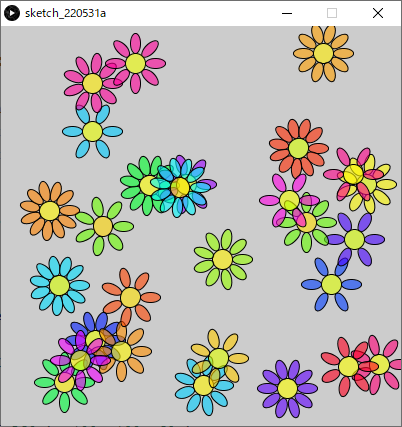

### 演習2

下図のような多角形描画行う関数を定義してみましょう．


下の手順を参考にしてください．

#### 1.ウィンドウを表示する．

Activeモードでウィンドウを表示させるところまで記述しましょう．

- スクリーンサイズ：400×400

```java
void setup()
{
  size( 400, 400 );
}

void draw()
{
}
```

#### 2. 矢印を描画する関数定義を準備する．

void関数`drawArrow()`を定義しましょう．

- ブロック内の記述はまだ不要．
- 関数名：drawArrow

- 仮引数
  - int型のiX					: 矢印の始点のX座標
  - int型のiY                    : 矢印の始点のY座標
  - int型のiRotDeg         : 矢印の回転（°）

```java
void setup()
{
  size( 400, 400 );
}

void draw()
{
}

void drawArrow( int iX, int iY, int iRotDeg )
{
}
```

#### 3.drawArrow()を画面中心でコールする．

`draw()`に以下の記述を追加しましょう．

- 座標原点をスクリーン中心に移動する．
- `drawArrow( 0, 0, 0 );`

```java
void setup()
{
  size( 400, 400 );
}

void draw()
{
  translate( width/2, height/2 );
	drawArrow( 0, 0, 0 );
}

void drawArrow( int iX, int iY, int iRotDeg )
{
}
```

#### 4.矢印のプロポーション用グローバル変数を定義する．

矢印の各プロポーションを以下のようにグローバル変数で定義し，初期値を入力してください．
（アニメーションではなく，定数として用いる）

```java
int iArrowBaseWidth = 10;    // 矢印の基部の幅
int iArrowBaseHeight = 35;   // 矢印の基部の高さ
int iArrowHeadWidth = 30;    // 矢印の頭部の幅
int iArrowHeadHeight = 20;   // 矢印の頭部の高さ
```

それぞれのグローバル変数の値は，下図のように矢印各部の大きさに対応する．


```java
int iArrowBaseWidth = 10;    // 矢印の基部の幅
int iArrowBaseHeight = 35;   // 矢印の基部の高さ
int iArrowHeadWidth = 30;    // 矢印の頭部の幅
int iArrowHeadHeight = 20;   // 矢印の頭部の高さ

void setup()
{
  size( 400, 400 );
}

void draw()
{
  translate( width/2, height/2 );		  // スクリーン中心に移動
	drawArrow( 0, 0, 0 );								// 関数コール
}

void drawArrow( int iX, int iY, int iRotDeg )
{
}
```

#### 5. 多角形描画を用いて矢印の描画を行う．

多角形描画を使って矢印を描画する命令を**drawArrow関数に追加**する．

- 多角形描画の命令

  ```java
  beginShape();		   		  // 多角形描画を開始する．
  vertex( X座標値, Y座標値 );	// 頂点0
  vertex( X座標値, Y座標値 );	// 頂点1
  vertex( X座標値, Y座標値 );	// 頂点2
  vertex( X座標値, Y座標値 );	// 頂点3
  vertex( X座標値, Y座標値 );	// 頂点4
  vertex( X座標値, Y座標値 );	// 頂点5
  vertex( X座標値, Y座標値 );	// 頂点6
  endShape(CLOSE);		    // 多角形を閉じる．
  ```

  - 各頂点の座標は先ほど定義したグローバル変数を元に，下図を参考に算出する必要がある．

    

  - ここでは時間短縮のため，頂点のリストは以下のコードをコピーして用いるとよい．

    ```java
    vertex( 0, -iArrowBaseWidth/2 );
    vertex( iArrowBaseHeight, -iArrowBaseWidth/2 );
    vertex( iArrowBaseHeight, -iArrowHeadWidth/2 );
    vertex( iArrowBaseHeight + iArrowHeadHeight, 0 );
    vertex( iArrowBaseHeight,  iArrowHeadWidth/2 );
    vertex( iArrowBaseHeight,  iArrowBaseWidth/2 );
    vertex( 0,  iArrowBaseWidth/2 );

- 多角形の色

    - 線（ストローク）：なし

    - 塗色：黒(0,0,0)


```java
int iArrowBaseWidth = 10;    // 矢印の基部の幅
int iArrowBaseHeight = 35;   // 矢印の基部の高さ
int iArrowHeadWidth = 30;    // 矢印の頭部の幅
int iArrowHeadHeight = 20;   // 矢印の頭部の高さ

void setup()
{
  size( 400, 400 );
}

void draw()
{
  translate( width/2, height/2 );
  drawArrow( 0, 0, 0 );
}

void drawArrow( int iX, int iY, int iRotDeg )
{
  noStroke();
  fill(0,0,0);
  
  // 多角形描画
  beginShape();
  vertex( 0, -iArrowBaseWidth/2 );
  vertex( iArrowBaseHeight, -iArrowBaseWidth/2 );
  vertex( iArrowBaseHeight, -iArrowHeadWidth/2 );
  vertex( iArrowBaseHeight + iArrowHeadHeight, 0 );
  vertex( iArrowBaseHeight,  iArrowHeadWidth/2 );
  vertex( iArrowBaseHeight,  iArrowBaseWidth/2 );
  vertex( 0,  iArrowBaseWidth/2 );
  endShape(CLOSE);
}
```

#### 6. 仮引数を元に座標変換を行う．

今のままでは仮引数が使われていないので，これらを使って座標変換を行いましょう．
以下の記述を`drawArrow()`に追加しましょう．

- 平行移動: `iX, iY`
- 回転: `iRotDeg` (ラジアン値に変換する)

- 正しくできたかテストする方法
  関数呼び出しの**実引数を色々変更**してみる．

  ```java
  drawArrow( 100, 0, 90 );	// 変更例( X値:100, Y値:0, 回転90° )


```java
int iArrowBaseWidth = 10;    // 矢印の基部の幅
int iArrowBaseHeight = 35;   // 矢印の基部の高さ
int iArrowHeadWidth = 30;    // 矢印の頭部の幅
int iArrowHeadHeight = 20;   // 矢印の頭部の高さ

void setup()
{
  size( 400, 400 );
}

void draw()
{
  translate( width/2, height/2 );
  drawArrow( 100, 0, 90 );
}

void drawArrow( int iX, int iY, int iRotDeg )
{
  translate( iX, iY );
  rotate( radians( iRotDeg ) );
  
  noStroke();
  fill( 0, 0, 0 );
  
  // 多角形描画
  beginShape();
  vertex( 0, -iArrowBaseWidth/2 );
  vertex( iArrowBaseHeight, -iArrowBaseWidth/2 );
  vertex( iArrowBaseHeight, -iArrowHeadWidth/2 );
  vertex( iArrowBaseHeight + iArrowHeadHeight, 0 );
  vertex( iArrowBaseHeight, iArrowHeadWidth/2 );
  vertex( iArrowBaseHeight, iArrowBaseWidth/2 );
  vertex( 0, iArrowBaseWidth/2 );
  endShape( CLOSE );
}
```

#### 7. 座標変換のリセット

実はステップ6のままでは，関数実行後も**変換された座標系が残ったまま**である．
基本的には**関数内で行った座標変換は，関数内で戻しておいた方がよい．**
`drawArrow()`に以下の記述を追加する．

- `pushMatrix()`
- `popMatrix()`

```java
int iArrowBaseWidth = 10;    // 矢印の基部の幅
int iArrowBaseHeight = 35;   // 矢印の基部の高さ
int iArrowHeadWidth = 30;    // 矢印の頭部の幅
int iArrowHeadHeight = 20;   // 矢印の頭部の高さ

void setup()
{
  size( 400, 400 );
}

void draw()
{
  translate( width/2, height/2 );
  drawArrow( 100, 0, 90 );
}

void drawArrow( int iX, int iY, int iRotDeg )
{
  pushMatrix();  // 変換前の座標系を保存
  
  translate( iX, iY );
  rotate( radians( iRotDeg ) );
  
  noStroke();
  fill( 0,0,0 );
  
  // 多角形描画
  beginShape();
  vertex( 0, -iArrowBaseWidth/2 );
  vertex( iArrowBaseHeight, -iArrowBaseWidth/2 );
  vertex( iArrowBaseHeight, -iArrowHeadWidth/2 );
  vertex( iArrowBaseHeight + iArrowHeadHeight, 0 );
  vertex( iArrowBaseHeight, iArrowHeadWidth/2 );
  vertex( iArrowBaseHeight, iArrowBaseWidth/2 );
  vertex( 0, iArrowBaseWidth/2 );
  endShape( CLOSE );
  
  popMatrix();  // 変換前の座標系へ戻す．
}
```

以上の手順で，`drawArrow()`という独自の矢印図形を描画する関数を作成することができた．


### 演習3

演習2のプログラムを元に，拡大縮小機能を追加し，`drawArrow()`を呼び出してレイアウトを行う．

#### 1. drawArrow()に拡大縮小用の引数を追加する．

矢印の大きさを変更（拡大縮小）できるよう，以下のように`drawArrow()`を書きかえる．

- スケール値（拡大縮小率）を渡すための仮引数を１つ追加する．
  - 仮引数名: fScale
  - 引数の型: float

また，関数コールの記述を以下のように書き換える．

```java
drawArrow( 0, 0, 0, 0.5 );	// スケール値:0.5(50%)
```


```java
int iArrowBaseWidth = 10;    // 矢印の基部の幅
int iArrowBaseHeight = 35;   // 矢印の基部の高さ
int iArrowHeadWidth = 30;    // 矢印の頭部の幅
int iArrowHeadHeight = 20;   // 矢印の頭部の高さ

void setup()
{
  size( 400, 400 );
}

void draw()
{
  translate( width/2, height/2 );
  drawArrow( 0, 0, 0, 0.5 );  // スケール値:0.5(50%)
}

void drawArrow( int iX, int iY, int iRotDeg, float fScale )
{
  pushMatrix();  // 変換前の座標系を保存
  
  translate( iX, iY );
  rotate( radians( iRotDeg ) );
  
  noStroke();
  fill( 0,0,0 );
  
  // 多角形描画
  beginShape();
  vertex( 0, -iArrowBaseWidth/2 );
  vertex( iArrowBaseHeight, -iArrowBaseWidth/2 );
  vertex( iArrowBaseHeight, -iArrowHeadWidth/2 );
  vertex( iArrowBaseHeight + iArrowHeadHeight, 0 );
  vertex( iArrowBaseHeight, iArrowHeadWidth/2 );
  vertex( iArrowBaseHeight, iArrowBaseWidth/2 );
  vertex( 0, iArrowBaseWidth/2 );
  endShape( CLOSE );
  
  popMatrix();  // 変換前の座標系へ戻す．
}
```

#### 2. 仮引数fScaleを用いて座標系を拡大縮小する．

`drawArrow()`に以下の記述を追加する．

- `scale( fScale );`


```java
int iArrowBaseWidth = 10;    // 矢印の基部の幅
int iArrowBaseHeight = 35;   // 矢印の基部の高さ
int iArrowHeadWidth = 30;    // 矢印の頭部の幅
int iArrowHeadHeight = 20;   // 矢印の頭部の高さ

void setup()
{
  size(400,400);
}

void draw()
{
  translate(width/2,height/2);
  drawArrow( 0, 0, 0, 0.5 );  // スケール値:0.5(50%)
}

void drawArrow( int iX, int iY, int iRotDeg, float fScale )
{
  pushMatrix();  // 変換前の座標系を保存
  
  translate( iX, iY );
  rotate( radians( iRotDeg ) );
  scale( fScale );
  
  noStroke();
  fill( 0, 0, 0 );
  
  // 多角形描画
  beginShape();
  vertex( 0, -iArrowBaseWidth/2 );
  vertex( iArrowBaseHeight, -iArrowBaseWidth/2 );
  vertex( iArrowBaseHeight, -iArrowHeadWidth/2 );
  vertex( iArrowBaseHeight + iArrowHeadHeight, 0 );
  vertex( iArrowBaseHeight, iArrowHeadWidth/2 );
  vertex( iArrowBaseHeight, iArrowBaseWidth/2 );
  vertex( 0, iArrowBaseWidth/2 );
  endShape( CLOSE );
  
  popMatrix();  // 変換前の座標系へ戻す．
}
```

これで`drawArrow()`は完成した．

#### 3. drawArrow()を使った様々な表現

`drawArrow()`を使って色々な描画を試してみましょう．
静止画ならsetup()内，アニメーションさせたいならdraw()内で呼び出しましょう．

- for文で矢印を繰り返し描画
- 回転させながら複数の矢印を描画
- draw()内で呼び出し，アニメーションを行う．

また，以下の部分の数値を変更することで矢印のプロポーションを変更できる．

```java
int iArrowBaseWidth = 10;    // 矢印の基部の幅
int iArrowBaseHeight = 35;   // 矢印の基部の高さ
int iArrowHeadWidth = 30;    // 矢印の頭部の幅
int iArrowHeadHeight = 20;   // 矢印の頭部の高さ
```

##### 作例1

40°ずつ回転させながら描画する．

※`draw()`のみ記載

```java
void draw()
{
  for( int iRotDeg = 0; iRotDeg < 360; iRotDeg+=40 )
  {
    drawArrow( width/2,height/2,iRotDeg, 1.0 );
  }
}
```

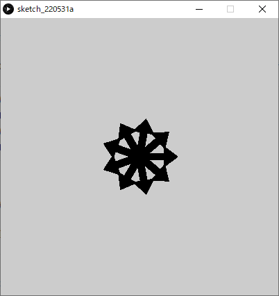

##### 作例2

円周上に並べる

※`draw()`のみ記載

```java
void draw()
{
  translate(width/2,height/2);
  for( int iRotDeg = 0; iRotDeg < 360; iRotDeg+=18 )
  {
    drawArrow( 185, 0, 95, 1.0 );
    rotate( radians( 18 ) );     //座標系を18°回転
  }
}
```

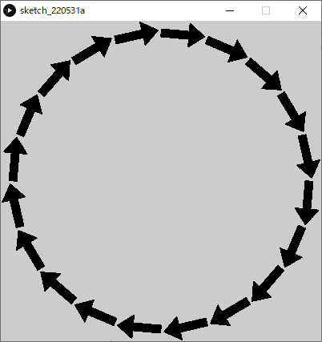

##### 作例3

並進

※`draw()`のみ記載

```java
void draw()
{
  for( int iArrowIdx = 0; iArrowIdx < 48; iArrowIdx++ )  // 48回繰り返す
  {
    int iColumn = iArrowIdx%6;          // 列番号
    int iRow = iArrowIdx/6;             // 行番号
    int iX = 20 + 60 * iColumn + 50 * ( iRow%2 ); // 奇数の行番号は50右にずらす
    int iY = 20 + 50 * iRow;
    int iRotDeg = 180 * ( iRow%2 );               // 奇数の行番号は180°回転
    drawArrow( iX, iY,iRotDeg, 1.0 );
  }
}
```


##### 作例4

並進（拡大縮小あり）

※`draw()`のみ記載

```java
void draw()
{
  for( int iArrowIdx = 0; iArrowIdx < 48; iArrowIdx++ )  // 48回繰り返す
  {
    int iColumn = iArrowIdx%6;          // 列番号
    int iRow = iArrowIdx/6;             // 行番号
    int iX = 20 + 60 * iColumn + 50 * ( iRow%2 ); // 奇数の行番号は50右にずらす
    int iY = 20 + 50 * iRow;
    int iRotDeg = 180 * ( iRow%2 );               // 奇数の行番号は180°回転
    float fScale = 0.2 + iRow/8.0;                // スケール値
    drawArrow( iX, iY,iRotDeg, fScale );
  }
}
```

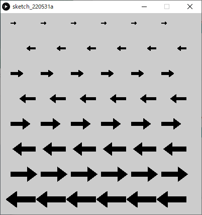

##### 作例5

移動と跳ね返りアニメーション

※`drawArrow()`の関数定義以外を記載

```java
int iArrowBaseWidth = 10;    // 矢印の基部の幅
int iArrowBaseHeight = 35;   // 矢印の基部の高さ
int iArrowHeadWidth = 30;    // 矢印の頭部の幅
int iArrowHeadHeight = 20;   // 矢印の頭部の高さ

int  iPosX;      // 矢印の座標
int  iDirctionX; // 進む向き( 1:+X方向, -1:-X方向 )

void setup()
{
  size(400,400);
  frameRate(8);
  iPosX = 0;
  iDirctionX  = 1;
}

void draw()
{
  noStroke();
  fill( 201, 201, 201 );
  rect( 0, 0, width, height );// スクリーンリフレッシュ
  
  stroke( 0 );
  drawArrow( iPosX, height/2, 90 *( 1 - iDirctionX ), 1.0 );  // 進む方向によって矢印を回転
  
  iPosX += iDirctionX * 8;
  if( iDirctionX == 1  && iPosX > width-50 ||  // もし，右向きかつ矢印頭がスクリーン端をこえる
      iDirctionX == -1 && iPosX < 50 )         // もしくは，左向きかつ矢印頭スクリーン端を超えたら
  {
    iDirctionX *= -1;  // 向きを逆方向に変える(-1をかける)
  }
}
```


## 関数から別の関数を呼び出す

関数の中で別の関数を呼び出すことも可能．
詳しくは，後の「再帰」のセクションで．

```java
void setup()
{

}

void draw()
{
  function1();
}

void function1()
{
  function2();
}

void function2()
{

}
```


## より高度な表現

### 演習

顔のような描画


#### 1.setup(),draw()を記述

- スクリーンサイズ：400×400
- カラーモード：RGB, 100
- 背景色：白(100,100,100)

```java
void setup()
{
  size(400,400);
  colorMode(RGB,100);
  background(100,100,100);
}

void draw()
{
}
```

#### 2.顔を描画する関数を定義

ブロック内の命令以外の枠だけ用意しましょう．

- 関数名：drawFace
- 仮引数
  - `int型 iX`					// 顔のX座標
  - `int型 iY`                    // 顔のY座標
- 返り値：なし

```java
void setup()
{
  size(400,400);
  colorMode(RGB,100);
  background(100,100,100);
}

void draw()
{
}

void drawFace( int iX, int iY )
{
}
```

#### 3.drawFace関数をsetup()内で呼ぶ

- **setup()**のブロック内でdrawFace()関数を呼び出す記述を追加してみましょう．
  - 引数:  `0, 0`
  - 今回は静止画なので，setup()内へ．

- さらに，drawFace()関数の呼び出し前に，原点をスクリーン中心に移動しましょう．
  - 平行移動 `width/2, height/2`
  - 顔を作りやすくする便宜上，この処理を入れる．

これで関数drawFace()は実行されるようになります．

```java
void setup()
{
  size(400,400);
  colorMode(RGB,100);
  background(100,100,100);
  translate(width/2,height/2);	// スクリーン中心へ平行移動
  drawFace( 0, 0 );							// 関数のコール
}

void draw()
{ 
}

void drawFace( int iX, int iY )
{
}
```

#### 4.drawFace関数内に図形描画命令を追加

**drawFace()のブロック内に**ellipseやlineなどの命令を使い，思い思いに自由に顔を描いてみましょう．
<u>座標原点がスクリーン中心に移動して</u>いることに注意．

- 仮引数はまだ使わなくてかまいません．
- 余裕があれば色関連も変更してOK.


```java
void setup()
{
  size(400,400);
  colorMode(RGB,100);
  background(100,100,100);
  translate(width/2,height/2);
  drawFace( 0, 0 );
}

void draw()
{ 
}

void drawFace( int iX, int iY )
{
  ellipse( 0, 0, 100, 100 );// 輪郭
  ellipse( -20, -20, 8, 8 );// 目
  ellipse(  20, -20, 8, 8 );
  line( -20, 20, 20, 20 );	//口
}
```

#### 5.仮引数を元に座標変換

仮引数iX,iYは顔の座標の平行移動に使いたい．
drawFace()の中で，ステップ4で作成した**顔描画の前**に，座標変換：平行を追加しましょう．

- 平行移動 `iX, iY`

この方法だとたくさんある図形描画の命令にひとつひとつ追加するより楽．

```java
void setup()
{
  size(400,400);
  colorMode(RGB,100);
  background(100,100,100);
  translate(width/2,height/2);
  drawFace( 0, 0 );
}

void draw()
{
}

void drawFace( int iX, int iY )
{
  translate( iX, iY );			// 顔描画位置へ平行移動
  
  ellipse( 0, 0, 100, 100 );// 輪郭
  ellipse( -20, -20, 8, 8 );// 目
  ellipse(  20, -20, 8, 8 );
  line( -20, 20, 20, 20 );  //口
}
```

#### 6.座標系の保存・戻しを関数に追加

ステップ5のように関数内での座標変換は便利だが，**関数内で行った座標変換は関数内で戻しておく**のが安全．
戻さない場合，プログラムの他の部分に影響がでる．

以下のように`pushMatrix()`, `popMatrix()`を追加しましょう．

```java
void setup()
{
  size(400,400);
  colorMode(RGB,100);
  background(100,100,100);
  translate(width/2,height/2);
  drawFace( 0, 0 );
}

void draw()
{
}

void drawFace( int iX, int iY )
{
  pushMatrix();// 座標系の保存
  
  translate( iX, iY );
  
  ellipse( 0, 0, 100, 100 );// 輪郭
  ellipse( -20, -20, 8, 8 );// 目
  ellipse(  20, -20, 8, 8 );
  line( -20, 20, 20, 20 );  // 口
  
  popMatrix();// 座標系を戻す
}
```

#### 7.drawFace()を複数呼び出す

まず，setup()内の**translate()文はもう不要なので，削除**しましょう．
setup()内の**drawFace()呼び出しを，引数を変えながら複数**書いてみましょう．

- 引数
  - iX: 顔の中心座標値X
  - iY: 顔の中心座標値Y 

余裕があれば，**for文**を使い，さらに大量に書いてみましょう．

```java
void setup()
{
  size(400,400);
  colorMode(RGB,100);
  background(100,100,100);
  
  // 関数のコール
  drawFace( 60,  80 );
  drawFace( 180, 120 );
  drawFace( 320, 330 );
  drawFace( 80,  320 );
  drawFace( 220, 240 );
}

void draw()
{
}

void drawFace( int iX, int iY )
{
  pushMatrix();
  
  translate( iX, iY );
  
  ellipse( 0, 0, 100, 100 );// 輪郭
  ellipse( -20, -20, 8, 8 );// 目
  ellipse(  20, -20, 8, 8 );
  line( -20, 20, 20, 20 );  // 口
  
  popMatrix();
}
```


### アニメーション複製描画

前述の顔を描画する関数を応用し，アニメーションを行う．

```java
int iFPS = 20;
int iAnimMouthDeg; // 0~360

void setup()
{
  size( 400, 400 );
  frameRate(iFPS);
  iAnimMouthDeg = 0;
}
void draw()
{
  fill(60,60,60);
  noStroke();
  rect(0,0,width,height);
  
  // 口の開き具合(cos,sin)
  float fMouthOpenCos = (1 + cos(radians(iAnimMouthDeg)))/2.0; //cos単振動(0~1)
  float fMouthOpenSin = (1 + sin(radians(iAnimMouthDeg)))/2.0; //sin単振動(0~1)
  
  // 顔を並べて描画
  translate( 40, 40 );
  for( int iFaceIdx=0; iFaceIdx<25; iFaceIdx++)// 25回繰り返し
  {
    int iColumn = iFaceIdx%5;
    int iRow    = iFaceIdx/5;        // 口の開き具合(cos,sin)どちらの値を使うか
    float fMouthOpen = 0.0;
    if( iRow%2==0 )// 行番号が奇数なら
    {
      fMouthOpen = fMouthOpenCos;
    }
    else
    {
      fMouthOpen = fMouthOpenSin;
    }
    // 顔の描画
    drawFace( 80*iColumn,80*iRow,fMouthOpen );
  }
  
  //アニメーション用変数更新
  if( iAnimMouthDeg > 360 )
  {
    iAnimMouthDeg-= 360;
  }
  else
  {
    iAnimMouthDeg +=4;// 4°進める
  }
}

void drawFace( float fX, float fY, float fMouthOpen )
{
  pushMatrix();//座標系保存
  
  stroke(0,0,0);
  fill(255,255,255);
  ellipse( fX, fY, 80, 80 );  // 輪郭
  
  fill(255,255,255);
  ellipse( fX-20, fY-20, 8, 8 );// 目
  ellipse( fX+20, fY-20, 8, 8 );
  
  //   位置調整のため，細かい数値が入っています．
  float fBeginDeg = 60 - 60*fMouthOpen;
  float fEndDeg = 120 + 60*fMouthOpen;
  float fMouthY = fY-10+16*fMouthOpen;
  float fEllipseWidth = 60-20*fMouthOpen;
  
  // 口の描画
  fill(255,0,0);
  arc( fX, fMouthY, fEllipseWidth, 40, radians(fBeginDeg), radians(fEndDeg), CHORD );
  
  popMatrix();//座標系戻す
}
```


### 共通する処理の関数化

サイン波とコサイ波のアニメーション

```java
int iAnimDegree;  // アニメーション用

void setup()
{
  size( 400, 200 );
  strokeWeight( 4 );
  frameRate(20);
  iAnimDegree = 0;
}

void draw()
{
  noStroke();
  fill(0,0,0);
  rect(0,0,width,height);
  
  // 波長アニメーション
  float fAnimPhaseShift = radians(iAnimDegree);
  
  // 振幅アニメーション
  float fAnimAmplitudeSin = 50+50*sin(radians(iAnimDegree));
  float fAnimAmplitudeCos = 50+50*cos(radians(iAnimDegree));
  
  // cos波
  stroke(255,0,0);
  drawWaveCos( fAnimPhaseShift, fAnimAmplitudeCos, 400 );
  
  // sin波
  stroke(0,0,255);
  drawWaveSin( fAnimPhaseShift, fAnimAmplitudeSin, 400 );
  
  if( iAnimDegree > 360 )// 360超えたらリセット
  {
    iAnimDegree-=360;
  }
  else
  {
    iAnimDegree+=8;//毎フレーム8加算
  }
}
/** 波をスクリーン全体に描画する
	params
  	fPhaseShift: 位相のズレ(ラジアン)
    fAmplitude:  振幅
    fWaveLength: 波長
*/
void drawWaveCos( float fPhaseShift, float fAmplitude, float fWaveLength )
{
  for( int iX=0; iX < width; iX++ )
  {
    float fPhaseRad0 = calcWavePhase( iX, fWaveLength )+fPhaseShift;
    float fPhaseRad1 = calcWavePhase( iX+1, fWaveLength )+fPhaseShift;
    line( iX, height/2 + fAmplitude*cos( fPhaseRad0 ),iX+1, height/2 + fAmplitude*cos( fPhaseRad1 ) );  
  }
}
void drawWaveSin( float fPhaseShift, float fAmplitude, float fWaveLength )
{
  for( int iX=0; iX < width; iX++ )
  {
    float fPhaseRad0 = calcWavePhase( iX, fWaveLength )+fPhaseShift;
    float fPhaseRad1 = calcWavePhase( iX+1, fWaveLength )+fPhaseShift;
    line( iX, height/2 + fAmplitude*sin( fPhaseRad0 ), iX+1, height/2 + fAmplitude*sin( fPhaseRad1 ) );  
  }
}
/** 波の位相を計算し，返す
	params
  	iX:スクリーンのX座標値
    fWaveLength:波長
    return:位相(ラジアン値)
*/
float calcWavePhase( int iX, float fWaveLength )
{
  return TWO_PI * iX / fWaveLength;	// TWO_PI: 360°のラジアン値
}
```


# ユーティリティ関数

Processingにあらかじめ用意されている便利な関数をいくつか紹介する．


## テキスト描画

### text()

スクリーンにテキストを描画する．
フォントの色の変更は`fill()`を使う．

#### 書式

文字列の描画を行う場合ダブルクォーテーションを使う「""」で囲む．

```java
text( "描画する文字列", X座標値, Ｙ座標値 )	// 文字列を描画する場合
```


```java
text( 描画する値, X座標値, Ｙ座標値 )		   // 数値を描画する場合
```


```java
text( 変数, X座標値, Ｙ座標値 )		 	     // 変数の値を描画する場合
```

#### 例

```java
text( "word", 10, 30 );

fill( 0, 102, 153 );
text( 3.14, 10, 60 );

int iText = 123;

fill( 0, 102, 153, 100 );
text( iText, 10, 90 ); 
```


### textSize()

テキスト描画のフォントサイズを設定する．

#### 書式

```java
textSize( フォントサイズ )		// ピクセル単位
```

#### 例

```java
background( 0 ); 
fill( 255 );

textSize( 26 ); // フォントサイズ:26
text( "WORD", 10, 50 );

textSize(14); // フォントサイズ:14
text( "WORD", 10, 70 );
```


https://processing.org/reference/text_.html
https://processing.org/reference/textSize_.html


## 日付

現在の日，月，西暦を取得する．

### 書式

```java
day()		  // 日(1 - 31)
month()		// 月(1 - 12)
Year()		// 年(2003, 2004, 2005, etc.)
```

### 例

```java
int iDay    = day();
int iMonth  = month();
int iYear   = year();
text( iDay,   10, 28 );
text( iMonth, 10, 56 );
text( iYear,  10, 84 );
```


https://processing.org/reference/year_.html


## 時刻

現在の時刻における秒，分，時を取得する．
アニメーションに用いる場合，`draw()`を行うたびにこれらの関数を呼び，最新の時刻を取得する必要がある．

### 書式

```java
second()  // 秒(0 - 59)
minute()  // 分(0 - 59)
hour()    // 時(0 - 23)
```

### 例1

```java
int iSecond = second();
int iMinute = minute();
int iHour   = hour();
text( iHour,   10, 56 );
text( ":",     25, 56 );
text( iMinute, 30, 56 );
text( ":",     45, 56 );
text( iSecond, 50, 56 );
```


https://processing.org/reference/hour_.html


### 例2

#### オーソドックスな時計

```java
void setup()
{
  size(1000, 1000);
  colorMode(RGB, 256);
  frameRate(1);
}

void draw()
{
  fill(255, 255, 255);
  rect(0, 0, 1000, 1000);	// スクリーンリフレッシュ
  
  // 1~12テキスト描画
  fill(0.0, 0.0, 0.0);
  textAlign(CENTER);
  textSize(60);
  for(int iHour=0; iHour<12; iHour++)
  {
    text(iHour+1, 450*cos(radians(30*(iHour+1)-90))+500, 450*sin(radians(30*(iHour+1)-90))+500);
  }
  
  translate(500, 500);	// 原点をスクリーン中心へ
  
  pushMatrix();			// 現在の座標系を保存
  
  // 時針描画
  int iHour = hour();
  rotate(radians(30*iHour-90));
  rect(0, 0, 240, 15);
  
  popMatrix();			// 回転をリセット
  
  pushMatrix();			// 現在の座標系を保存
  
  // 分針描画
  int iMinute = minute();
  rotate(radians(6*iMinute-90));
  rect(0, 0, 320, 10);
  
  popMatrix();			// 回転をリセット
  
  // 秒針描画
  int iSecond = second();
  rotate(radians(6*iSecond-90));
  rect(0, 0, 360, 5);
}
```


## フレーム単位の変化（※非関数）

秒より小さい単位の変化のアニメーションは，**フレーム単位の変化**のアニメーションとして実現できる．
この場合，時間を取得する関数は用いない．
例えば，「1秒周期で繰り返すアニメーション」は，**現在のフレーム番号をグローバル変数として保存**し，参照することで実現できる．

### 演習1

1秒で1回転する矩形のアニメーション


以下の手順を参考にしてください．

#### 1. ウィンドウを表示する．

- `setup()`と`draw()`，及びそれらのブロックを記述する．
- `setup()`ブロックに以下の処理を記述する．
  - 「スクリーンサイズ: 300×300」

```java
void setup()
{
  size( 300, 300 );
}

void draw()
{
}
```

#### 2. 1秒で1回転する矩形の初期描画．

`draw()`ブロックに以下の処理を記述する．

- 「矩形描画：XY ( 0, 0 ), WH( 60, 4 )」

```java
void setup()
{
  size( 300, 300 );
}

void draw()
{
  
  // 1秒間で1回転する矩形の描画
  fill( 0 );
  rect( 0, 0, 60, 4 );
}
```


#### 3. 画面の中心に移動させる．

`draw()`ブロックに以下の処理を記述する．

- 「平行移動：`( width/2, height/2 )`」

```java
void setup()
{
  size( 300, 300 );
}

void draw()
{
  translate( width/2, height/2 );	// 座標原点を中心に移動
  
  // 1秒間で1回転する矩形の描画
  fill( 0 );
  rect( 0, 0, 60, 4 );
}
```


これを回転させたい，`rotate()`を追加したいが，その前に回転アニメーション用のグローバル変数を追加する．

#### 4. 現在のフレーム番号を保存するグローバル変数を追加する．

- `int`型のグローバル変数`iFrameCur`の宣言文を記述する．

- `setup()`ブロックに以下の処理を記述する．

  「`iFrameCur`に0を代入して初期化する．」

- `draw()`ブロックに以下の処理を記述する．

  「`iFrameCur`に1を足す．」

```java
int iFrameCur;		// 現在のフレーム番号

void setup()
{
  size( 300, 300 );
  iFrameCur = 0;	// 初期化
}

void draw()
{
  translate( width/2, height/2 );
  
  // 1秒間で1回転する矩形の描画
  fill( 0 );
  rect( 0, 0, 60, 4 );
  
  iFrameCur++;		// フレーム番号を進める．
}
```

#### 5. iFrameCurを用いて回転させる．

- `draw()`ブロックに以下の処理を記述する．
  - 「回転：iFrameCur （度）」

```java
int iFrameCur;

void setup()
{
  size( 300, 300 );
  iFrameCur = 0;
}

void draw()
{
  translate( width/2, height/2 );
  
  rotate( radians( iFrameCur ) );	// 回転
  
  // 1秒間で1回転する矩形の描画
  fill( 0 );
  rect( 0, 0, 60, 4 );
  
  iFrameCur++;
}
```


#### 6. 画面をリフレッシュさせる．

- `draw()`ブロックに以下の処理を記述する．

  「画面をリフレッシュする」

  - カラー： ( `201, 201, 201, 128 )`
  - 線描画無し

```java
int iFrameCur;

void setup()
{
  size( 300, 300 );
  iFrameCur = 0;
}

void draw()
{
  noStroke();
  fill( 201, 201, 201, 128 );
  rect( 0, 0, width, height );  // 画面をリフレッシュ
  
  translate( width/2, height/2 );
  
  rotate( radians( iFrameCur ) );
  
  // 1秒間で1回転する矩形の描画
  fill( 0 );
  rect( 0, 0, 60, 4 );
  
  iFrameCur++;
}
```


どう見ても1秒で1回転していない．
現在のフレームレートは60なので，<u>1秒間で60°しか回転していない</u>．
1秒間で360°回転させるには，毎フレーム**6°**回転させる必要がある．
この割合はフレームレートによって変わる点に注意．

#### 7. フレーム毎の回転量を6倍にする．

- `draw()`ブロックの回転の処理を以下のように変更する．
- 「 ( 現在のフレーム番号 × 6 ) °回転する」

```java
int iFrameCur;

void setup()
{
  size( 300, 300 );
  iFrameCur = 0;
}

void draw()
{
  noStroke();
  fill( 201, 201, 201 );
  rect( 0, 0, width, height );
  
  translate( width/2, height/2 );
   
  rotate( radians( iFrameCur*6 ) );	// 毎フレーム6°回転
  
  // 1秒間で1回転する矩形の描画
  fill( 0 );
  rect( 0, 0, 60, 4 );
  
  iFrameCur++;
}
```


見た目はこれで完成だが，将来性を考え，フレーム番号を正しく0~59の間に収める処理を加える．

#### 8. 1秒経ったらフレーム番号を0に戻す．

- `draw()`ブロックに以下の処理を追加する．
  - iFrameCur が60以上なら0に戻す．

```java
int iFrameCur;

void setup()
{
  size( 300, 300 );
  iFrameCur = 0;
}

void draw()
{
  noStroke();
  fill( 201, 201, 201 );
  rect( 0, 0, width, height );
  
  translate( width/2, height/2 );
  
  rotate( radians( iFrameCur*6 ) );
  
  // 1秒間で1回転する矩形の描画
  fill( 0 );
  rect( 0, 0, 60, 4 );
  
  iFrameCur++;
  if( iFrameCur >= 60 )
  {
    iFrameCur = 0;	// フレーム番号リセット
  }
}
```


### 例1

1秒間で画面を横切る矩形の描画

```java
int iFrameCur;

void setup()
{
  size( 300, 300 );
  frameRate( 20 );    // フレームレート:20
  iFrameCur = 0;
}

void draw()
{
  noStroke();
  fill( 201, 201, 201 );
  rect( 0, 0, width, height );
  
  // 1秒間で横切る矩形の描画
  fill( 0 );
  rect( iFrameCur*15, 0, 5, 300 );
  
  iFrameCur++;
  if( iFrameCur >= 20 )
  {
    iFrameCur = 0;  // フレーム番号リセット
  }
}
```


### 例2

1秒間で色相環を一周する矩形の描画

```java
int iFrameCur;

void setup()
{
  size( 300, 300 );
  colorMode( HSB, 30, 100, 100 );   // Hue:0~30
  frameRate( 30 );                  // フレームレート:30
  iFrameCur = 0;
}

void draw()
{
  noStroke();
  fill( 0, 0, 100 );
  rect( 0, 0, width, height );
  
  // 1秒間で色相環を一周する矩形の描画
  stroke( 0, 0, 0 );
  fill( iFrameCur, 100, 100 );
  rect( 50, 50, 200, 200 );
  
  iFrameCur++;
  if( iFrameCur >= 30 )
  {
    iFrameCur = 0;  // フレーム番号リセット
  }
}
```


### 例3

演習1を元に，秒とフレームをリンクさせた例

※関数を使用

```java
int iFrameCur;   // 現在のフレーム番号
int iSecondCur;  // 現在の秒

void setup()
{
  size( 300, 300 );
  iFrameCur = 0;
  iSecondCur = second();
}

void draw()
{
  noStroke();
  fill( 201, 201, 201 );
  rect( 0, 0, width, height );
  
  // 現在の秒をテキスト表示
  textSize( 20 );
  fill( 255 );
  text( iSecondCur, 40, 40 );
  
  translate( width/2, height/2 );

  rotate( radians( iFrameCur*6 ) );
  
  // 1秒間で1回転する矩形の描画
  fill( 40+iFrameCur*3 );
  rect( 0, 0, 60, 4 );
  
  updateTime();
}

// 現在の秒とフレーム番号を更新する関数
void updateTime()
{
  int iSecondNew = second();
  
  if( iSecondCur != iSecondNew )
  {
    iSecondCur = iSecondNew;  // 現在の秒更新
    iFrameCur = 0;            // フレーム番号を0に戻す
  }
  else
  {
    iFrameCur++;
  }
}
```


## プログラムを開始してからの経過時間

### millis()

プログラムを開始してからの現在の経過時間を，ミリ(千分の一)秒単位で取得できる．
少し難しいが，**差分を取ることで**細かいアニメーションに応用できる．

#### 書式

```java
millis()	// 引数無し，1000分の1秒単位の値が返ってくる．
```

#### 例

ミリ秒単位で３種の時間を表示する

- 前回のフレームから現在のフレーム間の経過時間
- プログラムを開始してからの前フレームの経過時間
- プログラムを開始してからの現在のフレームの経過時間

```java
float fMillsPrevious = 0;  // 前回のdraw()における経過時間

void setup()
{
  frameRate( 5 );  // fps:5
}

void draw()
{
  // スクリーンリフレッシュ
  fill(0,0,0);
  rect(0,0,width,height);
  // 現在のdraw()における経過時間
  float fMillsCurrent = millis();
  // 前回のdraw()から経過した（差分）時間
  float fMillsDelta = fMillsCurrent - fMillsPrevious;
  textSize( 20 );
  fill(255,255,255);
  text( fMillsDelta, 5, 20);    // 前回のdraw()から経過した時間を描画
  text( fMillsPrevious, 5, 50); // 前回のdraw()における経過時間を描画
  text( fMillsCurrent, 5, 80);  // 現在のdraw()における経過時間を描画
  // 現在の経過時間を保存.
  fMillsPrevious = fMillsCurrent;
}
```


https://processing.org/reference/millis_.html


### 例

#### 秒が変わるまでのミリ秒単位のアニメーション

```java
int   iSecondCurrent;      // 現在の時刻(秒)
float fMillsAtSecChanged;  // 現在の時刻(秒)になった時の経過時間
void setup()
{
  size(200,200);
  colorMode(HSB,1,1,1);
  frameRate( 30 );  // fps:30
  iSecondCurrent = second();// 最新の時刻(秒)で初期化.
  fMillsAtSecChanged = 0;
}
void draw()
{
  // スクリーンリフレッシュ
  fill(0,0,0);
  rect(0,0,width,height);
  float fMillsInSec = 0;  // 秒間のミリ秒タイマー
  int iSecondNew = second();           // 最新の時刻(秒)取得.
  if( iSecondCurrent != iSecondNew )   // もし時刻(秒)が変わったら
  {
    iSecondCurrent = iSecondNew;       // 現在の時刻(秒)を更新
    fMillsAtSecChanged = millis();     // 現在の時刻(秒)になった時の経過時間を更新
  }
  else
  {
    fMillsInSec = millis() - fMillsAtSecChanged; // 秒間のミリ秒タイマー更新
  }
  float fArcBeginDegree = 360 * fMillsInSec / 1000 - 90;  // 円弧の始まりの角度
  // 円弧描画
  fill( 1, 0, 1 );
  arc( width/2, height/2, width/2, height/2, radians(fArcBeginDegree), radians(270), PIE );
  // 時刻テキスト描画
  textSize( 20 );
  text( hour(), width/2 - 60, height );
  text( ":", width/2 - 35, height );
  text( minute(), width/2 - 30, height );
  text( ":", width/2 - 5,  height );
  text( iSecondCurrent, width/2, height );
  text( ":", width/2 + 25, height );
  text( floor(fMillsInSec), width/2 + 30, height );
}
```


# 再帰

## 再帰とは

再帰的であることを英語で「Recursive」と書く．
自身が，自分自身を参照してしまうような状態．

## 再帰呼び出しとは

英語で「Recursive Call」と書く．

**関数内で自分自身の関数を呼び出す**こと．

```java
void function( int iValue )
{
  function( iValue - 1 );
}
// ※この関数をコールすると無限ループに陥るので実行しないこと．
```

上記のような再帰呼び出しを行っている関数のことを**再帰関数**という．
再帰関数は最初の呼び出しを１度行うだけで，何度も繰り返し関数の処理を繰り返す．
ただし，再帰関数に渡す**引数の値を変化**させていく必要がある．

無限ループを避けるため，if式と仮引数を用いて**再帰呼び出しを適切に終了させる**必要がある．

```java
void function( int iValue )
{
  if( iValue > 0 )
  {
  	function( iValue - 1 );
  }
}
```

仮引数`iValue`は再帰呼び出しの繰り返しにより，いつか必ず0の値をとる．
それゆえ，上記のようにif文を加えることで，再帰呼び出しを終了させることができる．

## 再帰void関数の定義

再帰関数は関数の一種であるので，まず関数の定義を行う必要がある．
再帰関数の定義を記述したら，`setup()`や`draw()`内で再帰関数をコールする．

ここではvoid関数を用いた書式を学習する．
条件式の種類によっておおまかに二通りの書式に分けられる．

### 書式1

再帰呼び出しを<u>続ける</u>条件式を記述する書式

```java
void 関数名( 仮引数の型 仮引数 )
{
  if( 条件式 )				// 真(true)なら再帰を続ける．
  {
    関数名( 実引数 ); // 再帰呼び出し
  }
}
```

### 書式2

再帰呼び出しを<u>終了する</u>条件式を記述する書式

```java
void 関数名( 仮引数の型 仮引数 )
{
  if( 条件式 )				// 真(true)なら再帰を終了する．
  {
    return;					// 関数の処理をここで終了する．
  }
  関数名( 実引数 );		// 再帰呼び出し
}
```

上記の二通りの書式は，実は本質的には違いがあまり無い．
目的や好みに応じて書式を使い分ければよい．
return文に抵抗があるなら書式1を推奨する．

### 例1

引数の値の回数だけ再帰呼び出しを行う再帰関数の定義．

```java
void recursiveCount( int iCount )
{
  if( iCount > 0 )		 // 真(true)なら再帰を続ける．
  {
    recursiveCount( iCount - 1 );	// 再帰呼び出し
  }
}
```

仮引数`iCount`から1を引いた値を，次の再帰呼び出しの際に実引数として渡している．
再帰の続行条件は，仮引数`iCount`が0より大きいこと．

### 例2

引数の値を2で割り，割った後の値を引数として再帰呼び出しを行う再帰関数

```java
void recursiveDivide( float fValue )
{
  if( fValue > 5 )         // 仮引数fValueが5より大きければ再帰をつづける．
  {
    recursiveDivide( fValue / 2 );  // fValueを2で割った値を引数として再帰呼び出し．
  }
}
```

仮引数`fValue`を2で割った値を，次の再帰呼び出しの際に実引数として渡している．
再帰の続行条件は，仮引数`fValue`が5より大きいこと．


## 演習1

下図の①，②に何を記述すればよいか考えてみましょう．

再帰関数`recursiveScale()`の要件

- 引数`fValue`の値に`1.2`をかけ，かけた後の値を実引数として再帰呼び出しを行う．
- 再帰の続行条件は，仮引数`fValue`が1000より<u>小さい</u>こと．


演習時間：1分程度


## 再帰関数の呼び出し

前述の例1で定義した再帰関数を使用したプログラムを元に，再帰呼び出しの流れを見ていく．
以下のプログラムでは，再帰関数`recursiveCount()`を`setup()`から呼び出している．

```java
void setup()
{
  recursiveCount( 4 );	// 4を引数として渡す
}

void recursiveCount( int iCount )
{
  print( iCount + ", " );
  if( iCount > 0 )		 // 真(true)なら再帰を続ける．
  {
    recursiveCount( iCount - 1 );	// 再帰呼び出し
  }
}
```


この再帰関数は結果として，最初に渡した実引数「4」の回数だけ再帰呼び出しを繰り返していることがわかる．

### 最初の呼び出しの流れ

#### 1. setup()から関数recursiveCount(4)を呼び出す．

print()命令は削除しています．


※**コールスタック**とは，関数呼び出しの情報を保存したメモリ領域．
　呼び出された関数は，それぞれの仮引数やローカル変数などのデータを保持している．

#### 2. 仮引数に値が渡される．


#### 3. 条件式の評価．

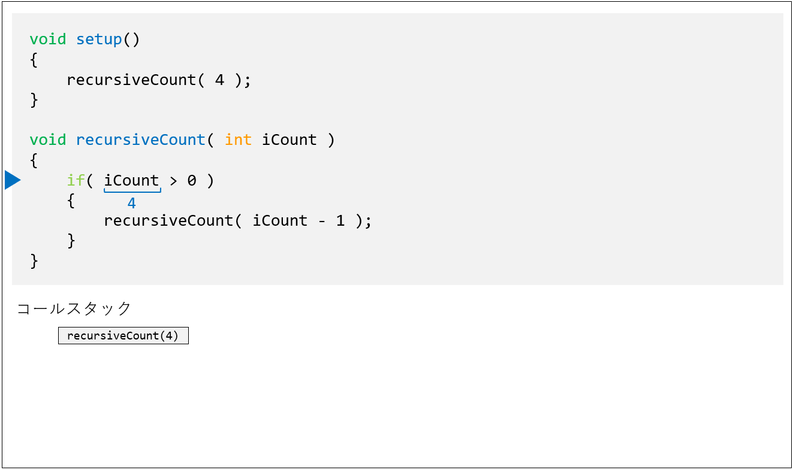

#### 4. recursiveCount( 3 )の呼び出し．

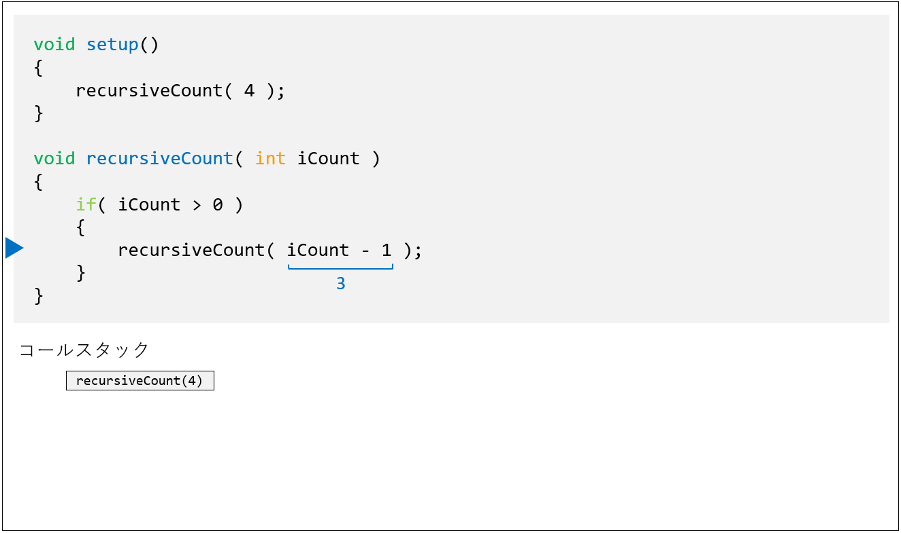

#### 5. 仮引数に値が渡される．


#### 6. 条件式の評価．


#### 7. recursiveCount( 2 )の呼び出し．


#### 8. 仮引数に値が渡される．


#### 9. このような再帰呼び出しが，引数が0になるまで繰り返される．


#### 10. recursiveCount( 0 ) の呼び出し．


#### 11. 条件式の評価．

条件式が偽となるため，if文のブロックは実行されない．


#### 12. recursiveCount( 0 ) の終了．

その後にも，recursiveCount( 0 )ブロックには特に命令が記述されていない．


#### 13. 呼び出し元のrecursiveCount( 1 )へ戻る．

recursiveCount( 0 ) の呼び出し元の位置はif文のブロック内．


#### 14. recursiveCount( 1 )の終了．

その後，recursiveCount( 1 )ブロックには特に命令が記述されていない．


#### 15. 逆順にrecursiveCount()が終了していく．

このように，呼び出された順番と逆順にrecursiveCount()が終了していく．


#### 16. 最初の呼び出し元に戻る．


#### 例3

例2で定義した再帰関数`recursiveDivide()`を`setup()`から実行した例．

```java
void setup()
{
  recursiveDivide( 100 );  // 100を引数として渡す
}

void recursiveDivide( float fValue )
{
  print( fValue + ", " );
  
  if( fValue > 5 )         // 仮引数fValueが5より大きければ再帰をつづける．
  {
    recursiveDivide( fValue / 2 );  // fValueを2で割った値を引数として再帰呼び出し．
  }
}
```


このような再帰関数は図形を分割して描画する等の表現に応用できる．


## 演習2

演習1と同じ再帰関数`recursiveScale()`を定義し，引数の値`1`を渡して`setup()`から呼び出してみましょう．
また，例3を参考にprint()命令を記述し，下図のようにコンソール出力を行いましょう．

再帰関数`recursiveScale()`の要件（演習1と同じ）

- 仮引数はfloat型の`fValue`．

- 仮引数`fValue`の値に`1.2`をかけ，かけた後の値を実引数として再帰呼び出しを行う．
- 再帰の続行条件は，仮引数`fValue`が1000より<u>小さい</u>こと．

演習時間：4分


## スタックオーバーフローエラー

終了条件を正しく記述しないと，プログラムがフリーズし，ProcessingのGUIから終了することができなくなる．
以下のようなエラーが表示される．


仮にその状況に陥って知った場合の解決先を以下に示す．

### windowsの場合

ウィンドウ右上の×ボタンをクリックし，プログラムを強制終了させる．


### Macの場合

※未記載

## 返り値のある再帰関数の定義と呼び出し

返り値のある関数を用いて再帰関数を定義することもできる．
本授業で用いるにはあまり適していないので，書式等は割愛する．

### 例1

1から始まり，ある数nまでの数の和を求める再帰関数．
$$
1 + 2 + 3 + 4 + 5 + \cdots + n
$$

```java
int recursiveSum( int iN )
{
  if( iN > 0 )
  {
    int iSumM = recursiveSum( iN-1 );	// 再帰呼び出し
    return iN + iSumM;
  }
  else
  {
    return 0;
  }
}
```

### 例2

例1の再帰関数を用い，1から始まり10までの数の和を求める．

```java
void setup()
{
  int iSum = recursiveSum( 10 );			// 最初の呼び出し
  print( iSum );
}

int recursiveSum( int iN )
{
  if( iN > 0 )
  {
    print( iN + " + " );
    int iSumM = recursiveSum( iN-1 );	// 再帰呼び出し
    return iN + iSumM;
  }
  else
  {
    print( "0" );
    return 0;
  }
}
```


## 再帰関数を使った描画基礎

### 描画命令を記述する位置

「再帰関数の呼び出し-例2」のプログラムに描画命令を加える場合を考える．
以下，変更を加える前のプログラム．

```java
void setup()
{
  recursiveDivide( 100 );  // 100を引数として渡す
}

void recursiveDivide( float fValue )
{
  print( fValue + ", " );
  
  if( fValue > 5 )         					// 仮引数fValueが5より大きければ再帰をつづける．
  {
    recursiveDivide( fValue / 2 );  // fValueを2で割った値を引数として再帰呼び出し．
  }
}
```


このプログラムに描画命令を加える位置は下図の通り．（`print()`命令を記述していた部分）


上図のように，再帰呼び出しを終了させるif文の前に記述するのが一般的．

### 描画命令の記述の仕方

仮引数`fValue`を用いて描画命令を記述することになる．
再帰呼び出しの度に仮引数`fValue`の値は２分の１に変化している．

この特性を使って，描画領域を再帰的に分割するプログラムを記述できる．

```java
void setup()
{
  recursiveDivide( 100 );
}

void recursiveDivide( float fValue )
{
  // 矩形描画
  rect( 0, 0, fValue, height );
  
  if( fValue > 5 )
  {
    recursiveDivide( fValue / 2 );
  }
}
```


このプログラムでは，矩形の横幅の大きさの指定に，仮引数`fValue`を用いている．

### さらに命令を追加する．

下のプログラムではスクリーンサイズを200×100，塗り色の指定を加えている．

```java
void setup()
{
  size( 200, 100 );
  recursiveDivide( width );      // 実引数を200に
}

void recursiveDivide( float fValue )
{
  // 矩形描画
  fill( fValue + 100 );          // 塗り色
  rect( 0, 0, fValue, height );
  
  if( fValue > 5 )
  {
    recursiveDivide( fValue / 2 );
  }
}
```


## 演習3

正方形を再帰的に4分割する再帰関数を定義する．


### 1.ウィンドウを表示する．

Activeモードでウィンドウを表示させるところまで記述しましょう．
※静止画なのでdraw()は不要

- スクリーンサイズ：400×400

```java
void setup()
{
  size( 400, 400 );
}
```

### 2. 再帰関数定義を準備する．

void関数`draw4Squares()`を定義しましょう．

- ブロック内の記述はまだ不要．
- 関数名：draw4Squares
- 仮引数
  - float型の fSize

```java
void setup()
{
  size( 400, 400 );
}

void draw4Squares( float fSize )
{
}
```

仮引数`fSize`は**これから分割する領域全体の大きさ**の情報を表す．

### 3. 再帰関数を呼び出す．

描画結果がいち早く確認できるよう，再帰関数の呼び出しを記述してしまいましょう．
`setup()`に以下の処理を追加しましょう．

- `draw4Squares()`に引数`400`を渡して呼び出す．

```java
void setup()
{
  size( 400, 400 );
  draw4Squares( 400 );
}

void draw4Squares( float fSize )
{
}
```

この引数`400`が再帰呼び出しにより，２分の１に分割されていくことを念頭に置いておく．

### 4. 3つの正方形を描画する．

void関数`draw4Squares()`に正方形の描画命令を追加する．
下図を参考に，仮引数`fSize`を用い，右上，左下，右下に３つの正方形を描画する．（左上は空白）


```java
void setup()
{
  size( 400, 400 );
  draw4Squares( 400 );
}

void draw4Squares( float fSize )
{
  // 右上の正方形
  fill( 255, 0, 0 );
  square( fSize/2, 0, fSize/2 );
  
  // 左下の正方形
  fill( 0, 255, 0 );
  square( 0, fSize/2, fSize/2 );
  
  // 右下の正方形
  fill( 255, 255, 255 );
  square( fSize/2, fSize/2, fSize/2 );
}
```


この描画を再帰呼び出しにより繰り返すことになる．

### 5. 再帰を続行するif文を記述する．

void関数`draw4Squares()`の最後に以下のif文と空のブロックを追加する．

- もし`fSize`が4以上だったら

```java
void setup()
{
  size( 400, 400 );

  draw4Squares( 400 );
}

void draw4Squares( float fSize )
{
  // 右上の正方形
  fill( 255, 0, 0 );
  square( fSize/2, 0, fSize/2 );
  
  // 左下の正方形
  fill( 0, 255, 0 );
  square( 0, fSize/2, fSize/2 );
  
  // 右下の正方形
  fill( 255, 255, 255 );
  square( fSize/2, fSize/2, fSize/2 );
  
  // 左上の正方形（再帰）
  if( fSize > 4 )
  {
  }
}
```

再帰の続行条件を`fSize > 4`としたのは，分割する領域の大きさが4以下の場合，それ以上分割しても視覚的には無意味であるため．

### 6.再帰呼び出しを記述する．

ステップ5.で追加したif文のブロックに，以下の再帰呼び出しを記述しましょう．

- `fSize`を2で割った値を引数として渡し，`draw4Squares()`の再帰呼び出しを行う．

```java
void setup()
{
  size( 400, 400 );

  draw4Squares( 400 );
}

void draw4Squares( float fSize )
{
  // 右上の正方形
  fill( 255, 0, 0 );
  square( fSize/2, 0, fSize/2 );
  
  // 左下の正方形
  fill( 0, 255, 0 );
  square( 0, fSize/2, fSize/2 );
  
  // 右下の正方形
  fill( 255, 255, 255 );
  square( fSize/2, fSize/2, fSize/2 );
  
  // 左上の正方形（再帰）
  if( fSize > 4 )
  {
    draw4Squares( fSize / 2 );
  }
}
```


この再帰呼び出しによって，<u>左上の正方形のエリア</u>に再帰的に描画が行われる．

右下に再帰的に描画を行いたい場合，以下のように平行移動の命令を追加する必要がある．

```java
void setup()
{
  size( 400, 400 );

  pushMatrix();  // 再帰関数の呼び出しで座標系が変換されるので，念のため保存．
  draw4Squares( 400 );
  popMatrix();
}

void draw4Squares( float fSize  )
{
  // 左上の正方形
  fill( 255, 255, 255 );
  square( 0, 0, fSize/2 );

  // 右上の正方形
  fill( 255, 0, 0 );
  square( fSize/2, 0, fSize/2 );
  
  // 左下の正方形
  fill( 0, 255, 0 );
  square( 0, fSize/2, fSize/2 );
  
  // 右下の正方形（再帰）
  if( fSize > 4 )
  {
    translate( fSize / 2, fSize / 2 );	// 平行移動
    draw4Squares( fSize / 2 );
  }
}
```


## 複数の引数をもつ再帰呼び出し

再帰関数の引数を複数にすると難易度が上がるが，再帰による描画の表現の幅が広がる．

例えば，以下のような再帰関数．

```java
void drawLines( float fBeginX, float fBeginY, float fLength, float fDegree )
{
  
}
```

## 演習4

螺旋状の連続した線を再帰呼び出しで描画する．


### 1.ウィンドウを表示する．

Activeモードでウィンドウを表示させるところまで記述する．
※静止画なのでdraw()は不要

```java
void setup()
{
  size( 400, 400 );
}
```

### 2. 再帰関数定義を準備する．

void関数`drawLines()`を定義する．

```java
void setup()
{
  size( 400, 400 );
}

void drawLines( float fLength )
{
}
```

仮引数`fLength`は**線の長さ**の情報を表す．

### 3. 最初の再帰関数の呼び出しを記述する．

描画結果がいち早く確認できるよう，再帰関数の呼び出しを記述する．

```java
void setup()
{
  size( 400, 400 );
  drawLines( 160 );	// 再帰関数の呼び出し
}

void drawLines( float fLength )
{
}
```

実引数`160`は，**最初の線の長さ**の情報を`drawLines()`に渡す．

### 4. 再帰呼び出しを記述する．

下図のように，最初の線の長さ`160`が再帰呼び出しの度に0.85倍されていくように，記述を行う．


`drawLines()`に，以下のように再帰呼び出しを記述する．

```java
void setup()
{
  size( 400, 400 );
  drawLines( 160 );
}

void drawLines( float fLength )
{ 
  if( fLength > 2 )	// 再帰の継続条件
  {
    drawLines( fLength * 0.85 );	// 再帰呼び出し
  }
}
```

この段階では，描画が行われていない．

### 5. 線描画命令を記述する．

`drawLines()`に，以下のように線の描画命令を記述する．

```java
void setup()
{
  size( 400, 400 );
  drawLines( 160 );
}

void drawLines( float fLength )
{
  // 線の描画
  line( 0, 0, fLength, 0 );
  
  if( fLength > 2 )
  {
    drawLines( fLength * 0.85 );
  }
}
```


現状では再帰的に線を描画するための情報が足りていない．
これからしばらくは，<u>必要となる変数や仮引数の用意</u>を行っていく．

### 6. 角度を受け取る仮引数を追加する．

下図のように，再帰呼び出しの度に線が30°回転されていく．


下のように，角度を示す仮引数`fDegree`を追加し，関連する関数呼び出しの記述も書き換える．

```java
void setup()
{
  size( 400, 400 );
  drawLines( 160, 4 );	// 初期角度4
}

void drawLines( float fLength, float fDegree )	// 仮引数fDegreeを追加
{
  // 線の描画
  line( 0, 0, fLength, 0 );
  
  if( fLength > 2 )
  {
    drawLines( fLength * 0.85, fDegree + 30 );	// 30°ずつ変化
  }
}
```

### 7. 線を開始する点の座標値を受け取る仮引数を追加する．

これまでの段階で，線の長さと角度の情報が得られたが，**線を開始する点**の情報が不足している．
下図のように，最終的には4つの引数が必要となる．


下のように仮引数`fBeginX, fBeginY`を追加し，関連する記述も書き換える．

```java
void setup()
{
  size( 400, 400 );
  drawLines( 0, 0, 160, 4 );  // 開始点 0, 0
}

void drawLines( float fBeginX, float fBeginY, float fLength, float fDegree )  // 仮引数fBeginX, fBeginYを追加
{
  // 線の描画
  line( 0, 0, fLength, 0 );
  
  if( fLength > 2 )
  {
    drawLines( fBeginX, fBeginY, fLength * 0.85, fDegree + 30 );  // とりあえずの実引数 fBeginX, fBeginY
  }
}
```

再帰呼び出しにおいて，本来なら**次の線の開始点**のXY座標値を渡す必要があるが，一時的に`fBeginX, fBeginY`をそのまま渡している．

### 8. 線が終了する点の座標を求める．

`line()`を用いて描画を行うには，線を開始する点のXY座標値に加え，**線を終了する点のXY座標値**が必要となる．
ある点から伸びる線のXY成分値は三角関数を用いて下図のように算出することができ，これを元に必要なXY座標値が得られる．


#### 三角比

※演算と変数で学習済み


下のように記述し，線の終端の点のXY座標値をローカル変数`fEndX, fEndY`に代入する．

```java
void setup()
{
  size( 400, 400 );
  drawLines( 0, 0, 160, 4 );
}

void drawLines( float fBeginX, float fBeginY, float fLength, float fDegree )
{
    // 線の終端
  float fEndX = fBeginX + fLength * cos( radians( fDegree ) );
  float fEndY = fBeginY + fLength * sin( radians( fDegree ) );
  
  // 線の描画
  line( 0, 0, fLength, 0 );
  
  if( fLength > 2 )
  {
    drawLines( fBeginX, fBeginY, fLength * 0.85, fDegree + 30 );
  }
}
```

線を開始する点の座標値`fBeginX, fBeginY`に，三角比の計算で得られた値を加えていることに留意．
この段階で変数及び仮引数の準備が整ったので，以降はそれらを描画命令や再帰呼び出しに組み込んでいく．

### 9. 描画命令や再帰呼び出しの書き換え．

下のように，描画命令と再帰呼び出しを書き換える．

```java
void setup()
{
  size( 400, 400 );
  drawLines( 0, 0, 160, 4 );
}

void drawLines( float fBeginX, float fBeginY, float fLength, float fDegree )
{
  // 線の終端
  float fEndX = fBeginX + fLength * cos( radians( fDegree ) );
  float fEndY = fBeginY + fLength * sin( radians( fDegree ) );
  
  // 線の描画
  line( fBeginX, fBeginY, fEndX, fEndY );	// 書き換え
  
  if( fLength > 2 )
  {
    drawLines( fEndX, fEndY, fLength * 0.85, fDegree + 30 );	// 書き換え
  }
}
```


線を終了する点の座標値`fEndX, fEndY`は，次の線における**線を開始する点の座標値**となるため，再帰呼び出しの引数として記述する．

### 10. 描画を整える．

下では，線の終端の円の描画や線の太さの設定などの記述を追加している．

```java
void setup()
{
  size( 400, 400 );
  drawLines( 0, 0, 160, 4 );
}

void drawLines( float fBeginX, float fBeginY, float fLength, float fDegree )
{
  // 線の終端
  float fEndX = fBeginX + fLength * cos( radians( fDegree ) );
  float fEndY = fBeginY + fLength * sin( radians( fDegree ) );
  
  // 線の描画
  strokeWeight( 2 );
  line( fBeginX, fBeginY, fEndX, fEndY );
  
  // 終端の円描画
  fill( 0 );
  circle( fEndX, fEndY, 4 );
  
  if( fLength > 2 )
  {
    drawLines( fEndX, fEndY, fLength * 0.85, fDegree + 30 );  // 再帰呼び出し
  }
}
```


## 再帰呼び出しを複数回行う

**再帰呼び出しを複数回**同時に行うことで，再帰を枝分かれさせることができる．
より複雑な模様が生成できる．

```java
void drawMandara( float fCenterX, float fCenterY, float fWidth, float fHeight )
{
  if( fWidth > 4 )
  {
    drawMandara( fCenterX, fCenterY-fHeight, fWidth/3, fHeight/3 );
    drawMandara( fCenterX, fCenterY+fHeight, fWidth/3, fHeight/3 );
    drawMandara( fCenterX-fWidth, fCenterY, fWidth/3, fHeight/3 ); 
    drawMandara( fCenterX+fWidth, fCenterY, fWidth/3, fHeight/3 ); 
    drawMandara( fCenterX-fWidth, fCenterY-fHeight, fWidth/3, fHeight/3 );
    drawMandara( fCenterX+fWidth, fCenterY-fHeight, fWidth/3, fHeight/3 );
    drawMandara( fCenterX-fWidth, fCenterY+fHeight, fWidth/3, fHeight/3 ); 
    drawMandara( fCenterX+fWidth, fCenterY+fHeight, fWidth/3, fHeight/3 );
  }
}
```


## 演習5

曼荼羅のような図形の描画を行う．
シェルピンスキーのカーペットともいう．


### 1.ウィンドウを表示する．

Activeモードでウィンドウを表示させるところまで記述する．
※静止画なのでdraw()は不要

```java
void setup()
{
  size( 1000, 1000 );
}
```

### 2. 再帰関数を定義し，コールする．

void関数`drawMandara()`を定義する．

```java
void setup()
{
  size( 1000, 1000 );
  drawMandara();	// 再帰関数のコール
}

void drawMandara()
{
}
```

仮引数は現段階では記述しない．

### 3. 描画内容を考える．

目標となる模様は，よく観察すると下図のような再帰的な構造になっていることがわかる．


一見複雑な模様に見えるが，**１度の再帰呼び出し中に１つの矩形のみ描画**を行えばよい．
再帰呼び出しの度に，その矩形の周囲８か所に新たに矩形が出現しているが，それらは**8回再帰呼び出しを行う**ことで表現できる．

### 4. 仮引数を記述する．

ステップ3の図を元に考えると，描画に必要な仮引数は下図のように考えることができる．

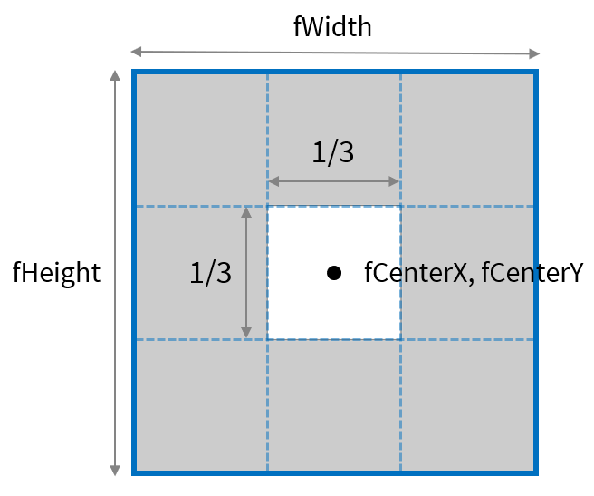

下のように記述する．

```java
void setup()
{
  size( 1000, 1000 );
  drawMandara( width/2, height/2, width, height );	// スクリーンの中心座標とスクリーン幅，高さを渡す
}

void drawMandara( float fCenterX, float fCenterY, float fWidth, float fHeight )	// 仮引数を記述
{
}
```

再帰関数の最初の呼び出しの記述も変更しなければならないことに留意．

### 5. 再帰呼び出し０回目の描画命令を記述する．

最初の矩形の幅と高さは領域全体の1/3である．


下のように記述する．

```java
void setup()
{
  size( 1000, 1000 );
  drawMandara( width/2, height/2, width, height );
}

void drawMandara( float fCenterX, float fCenterY, float fWidth, float fHeight )
{
  rectMode( CENTER );	// 矩形の座標をを中心点で指定する
  
  // 矩形描画
  rect( fCenterX, fCenterY, fWidth/3, fWidth/3 );
}
```


### 6. 左上の再帰呼び出しを検討する．

左上の再帰呼び出し1回目（左上の矩形描画）は，下図のように考えることができる．


上図を参考に，仮引数を使って次の再帰呼び出しの引数を計算する必要がある．

### 7. 左上の再帰呼び出しを記述する．

ステップ6を参考に，以下のように記述する．

```java
void setup()
{
  size( 1000, 1000 );
  drawMandara( width/2, height/2, width, height );
}

void drawMandara( float fCenterX, float fCenterY, float fWidth, float fHeight )
{
  rectMode( CENTER );
  rect( fCenterX, fCenterY, fWidth/3, fWidth/3 );
  
  // 再帰呼び出し
  if( fWidth > 8 )
  {   
    drawMandara( fCenterX - fWidth/3, fCenterY - fHeight/3, fWidth/3, fHeight/3 );  // 左上
  }
}
```

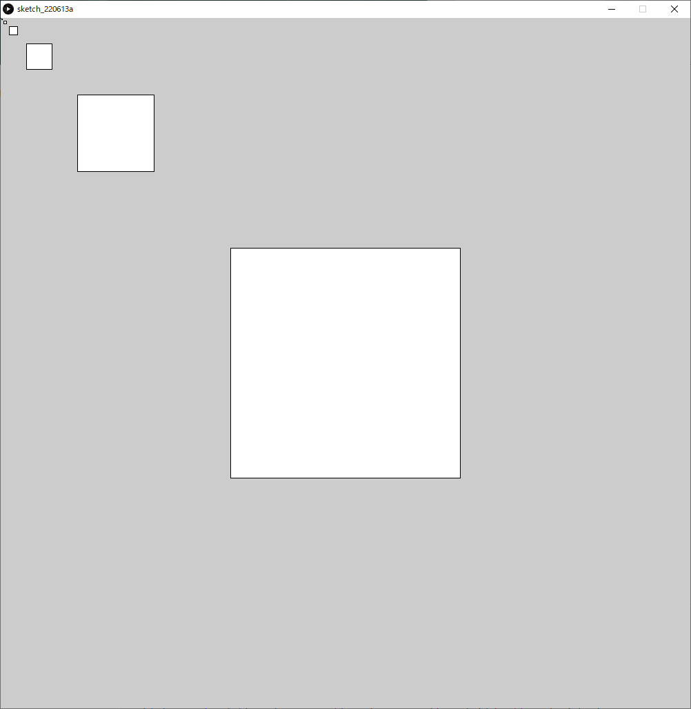

矩形の中心座標`fCenterX, fCenterY`から相対的に次の矩形の座標を算出していることに留意．

### 8.  その他周囲の7つ分の再帰呼び出しを記述する．

残りの７つの再帰呼び出しもステップ7と同様の考えで，下図を参考に考えることができる．


下のように，再帰呼び出しを7つ追加しましょう．
演習中に全て考えて記述するには時間が足りないので，意味が分かればよい．

```java
void setup()
{
  size( 1000, 1000 );
  drawMandara( width/2, height/2, width, height );
}

void drawMandara( float fCenterX, float fCenterY, float fWidth, float fHeight )
{
  rectMode( CENTER );
  rect( fCenterX, fCenterY, fWidth/3, fWidth/3 );
  
  // 再帰呼び出し
  if( fWidth > 8 )
  {   
    drawMandara( fCenterX - fWidth/3, fCenterY - fHeight/3, fWidth/3, fHeight/3 );  // 左上
    drawMandara( fCenterX, fCenterY - fHeight/3, fWidth/3, fHeight/3 );             // 上
    drawMandara( fCenterX + fWidth/3, fCenterY - fHeight/3, fWidth/3, fHeight/3 );  // 右上
    drawMandara( fCenterX - fWidth/3, fCenterY, fWidth/3, fHeight/3 );              // 左
    drawMandara( fCenterX + fWidth/3, fCenterY, fWidth/3, fHeight/3 );              // 右
    drawMandara( fCenterX - fWidth/3, fCenterY + fHeight/3, fWidth/3, fHeight/3 );  // 左下
    drawMandara( fCenterX, fCenterY + fHeight/3, fWidth/3, fHeight/3 );             // 下
    drawMandara( fCenterX + fWidth/3, fCenterY + fHeight/3, fWidth/3, fHeight/3 );  // 右下
  }
}
```


## 演習6

木のような図形の描画
L System と呼ばれるアルゴリズムの一種


### 1.ウィンドウを表示する．

Activeモードでウィンドウを表示させるところまで記述する．
※静止画なのでdraw()は不要

```java
void setup()
{
  size( 1000, 1000 );
}
```

### 2. 再帰関数を定義し，コールする．

void関数`drawTree()`を定義する．

```java
void setup()
{
  size( 1000, 1000 );
  drawTree( 200 );	// 再帰関数のコール
}

void drawTree( float fLength )
{
}
```

仮引数`fLength`は**線の長さ**の情報を表す．
実引数`200`は，**最初の線の長さ**の情報を`drawTree()`に渡す．

### 4. 再帰呼び出しを記述する．

再帰呼び出しの度に仮引数`fLength`を小さくしていく予定なので，以下のように記述する．

```java
void setup()
{
  size( 1000, 1000 );
  drawTree( 200 );
}

void drawTree( float fLength )
{
  if( fLength > 4 )	// 再帰を続行する条件
  {
    drawTree( fLength * 0.75 );
  }
}
```

再帰呼び出しの度に，線（枝）の長さを0.75倍していく．

### 5. 必要な仮引数を追加する．

線を描画するためには，下図の青色の仮引数が必要となる．
黒色の変数は，仮引数を元に三角比を用いることで算出できる．


また，これらの仮引数に渡す最初の実引数は下図のようになる．


以上を元に，記述を追加する．

```java
void setup()
{
  size( 1000, 1000 );
  drawTree( width/2, height, 200, -90 );  // 実引数を追加
}

void drawTree( float fBeginX, float fBeginY, float fLength, float fDegree )  // 仮引数を追加
{
  if( fLength > 4 )
  {
    drawTree( fBeginX, fBeginY, fLength * 0.75, fDegree );	// 一時的にfBeginX, fBeginY, fDegreeを記述
  }
}

```

### 6. 終端のXY座標値を記述する．

ステップ5でも述べたが，ある線の始点と角度，線の長さの情報があれば，三角比を用いることで終点のXY座標値を算出できる．

```java
void setup()
{
  size( 1000, 1000 );
  drawTree( width/2, height, 200, -90 );
}

void drawTree( float fBeginX, float fBeginY, float fLength, float fDegree )
{
  // 終端のXY座標値
  float fEndX = fBeginX + fLength * cos( radians( fDegree ) );
  float fEndY = fBeginY + fLength * sin( radians( fDegree ) );
  
  if( fLength > 4 )
  {
    drawTree( fEndX, fEndY, fLength * 0.75, fDegree );  // fEndX, fEndYに書き換える
  }
}
```

### 7. 線の描画命令を記述する．

線の描画命令を記述する．

```java
void setup()
{
  size( 1000, 1000 );
  drawTree( width/2, height, 200, -90 );
}

void drawTree( float fBeginX, float fBeginY, float fLength, float fDegree )
{
  // 終端のXY座標値
  float fEndX = fBeginX + fLength * cos( radians( fDegree ) );
  float fEndY = fBeginY + fLength * sin( radians( fDegree ) );
  
  // 線の描画
  line( fBeginX, fBeginY, fEndX, fEndY );
  
  if( fLength > 4 )
  {
    drawTree( fEndX, fEndY, fLength * 0.75, fDegree );
  }
}
```


### 8. 枝の角度を変える．

再帰呼び出しの度に，角度を20°増やす．

```java
void setup()
{
  size( 1000, 1000 );
  drawTree( width/2, height, 200, -90 );
}

void drawTree( float fBeginX, float fBeginY, float fLength, float fDegree )
{
  // 終端のXY座標値
  float fEndX = fBeginX + fLength * cos( radians( fDegree ) );
  float fEndY = fBeginY + fLength * sin( radians( fDegree ) );
  
  // 線の描画
  line( fBeginX, fBeginY, fEndX, fEndY );
  
  if( fLength > 4 )
  {
    drawTree( fEndX, fEndY, fLength * 0.75, fDegree + 20 );  // fDegree + 20
  }
}
```


### 9. 枝分かれさせる．

再帰呼び出しをもう一つ追加することで，枝を分けることができる．
下図のように，もう一本の枝は角度を-20°するとよい．

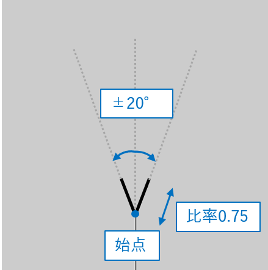


```java
void setup()
{
  size( 1000, 1000 );
  drawTree( width/2, height, 200, -90 );
}

void drawTree( float fBeginX, float fBeginY, float fLength, float fDegree )
{
  // 終端のXY座標値
  float fEndX = fBeginX + fLength * cos( radians( fDegree ) );
  float fEndY = fBeginY + fLength * sin( radians( fDegree ) );
  
  // 線の描画
  line( fBeginX, fBeginY, fEndX, fEndY );
  
  if( fLength > 4 )
  {
    drawTree( fEndX, fEndY, fLength * 0.75, fDegree + 20 );
    drawTree( fEndX, fEndY, fLength * 0.75, fDegree - 20 );  // 枝分かれ
  }
}
```


### 10. 形状の変化

以下の値を変えることで，形状の変化を操作できる．
いろいろ試してみましょう．

- 最初の始点の座標値
  - 初期値: `width/2, height`
- 最初の枝の角度
  - 初期値: `90°`
- 枝の基本の長さ
  - 初期値: `200`
- 再帰呼び出し毎にかける長さの倍率
  - 初期値: `0.75`
- 再帰呼び出し毎に加算する角度
  - 初期値: `+20°`, `-20°`
- 再帰のを続ける条件
  - 初期値: `iLength > 2`

#### 例

```java
void setup()
{
  size( 1000, 1000 );
  drawTree( 0, height, 400, -40 );
}

void drawTree( float fBeginX, float fBeginY, float fLength, float fDegree )
{
  // 終端のXY座標値
  float fEndX = fBeginX + fLength * cos( radians( fDegree ) );
  float fEndY = fBeginY + fLength * sin( radians( fDegree ) );
  
  // 線の描画
  line( fBeginX, fBeginY, fEndX, fEndY );
  
  if( fLength > 2 )
  {
    drawTree( fEndX, fEndY, fLength * 0.65, fDegree + 10 );
    drawTree( fEndX, fEndY, fLength * 0.6, fDegree - 40 );  // 枝分かれ
  }
}
```


## 身の回りの再帰的現象


### フラクタル

フラクタルは再帰的であり，かつ部分と全体が同じ構造となっている．（自己相似）


### レイトレーシング

CGにおける描画法の一種であるレイトレーシングも再帰呼び出しを用いる．


## サンプル集

### シェルピンスキーのギャスケット

正三角形で構成される模様．

```java
void setup()
{
  size(400,400);
  recursiveTriangle( width/2, height/1.7, width );
}
void draw()
{  
}
void recursiveTriangle( float fX, float fY, float fWidth )
{
  if( fWidth < 4 )
  {
    return;
  }
  
  float fIncircleRadius = (fWidth/2.0) * tan(radians(30));// 三角形の内接円の半径
  float fHeight = fWidth * sin(radians(60));// 三角形の高さ
  
  // 三角形の描画
  triangle( fX, fY-(fHeight-fIncircleRadius),
            fX+fWidth/2.0, fY+fIncircleRadius,
            fX-fWidth/2.0, fY+fIncircleRadius );
  
  // 上，左下，右下に新たに描画.
  recursiveTriangle( fX, fY- fIncircleRadius, fWidth/2.0 );
  recursiveTriangle( fX+fIncircleRadius*cos(radians(30)), fY+fIncircleRadius*sin(radians(30)), fWidth/2.0);   recursiveTriangle( fX-fIncircleRadius*cos(radians(30)), fY+fIncircleRadius*sin(radians(30)), fWidth/2.0);
}
```

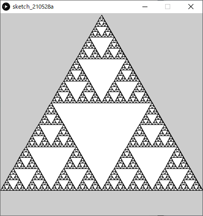

### 黄金比

矩形を再帰的に黄金比に分割しつつ，弧を描画する．

```java
void setup()
{
  size(810,500);
  drawGoldenRect( height );
}
void draw( )
{
}

void drawGoldenRect( float fRectSize )
{
  // 正方形
  stroke( 0, 0, 0 );
  rect( 0, 0, fRectSize, fRectSize );

  // 円弧描画
  stroke( 0, 0, 255 );
  arc( fRectSize, fRectSize, 2*fRectSize, 2*fRectSize, radians(180), radians(270), OPEN );
  
  if( fRectSize > 8 )
  {
    // 座標変換
    translate(fRectSize*1.618,0); // X軸方向に正方形のサイズの1.618倍移動する
    rotate(radians(90));          // 90°回転
    
    drawGoldenRect( fRectSize*0.618 );  // 再帰呼び出し
  }
}
```


### 矩形の再帰的分割描画

矩形の長辺を再帰的にランダム分割する．

```java
final float DIVIDE_RANGE = 0.6;  // 分割の振れ幅(0~1)
final int OFS_X = 10;            // スクリーン左右の空白
final int OFS_Y = 10;
void setup()
{
  size(600, 600);
  background(255);
  noFill();
  drawRectDivided( OFS_X, OFS_Y, width - 2 * OFS_X, height - 2 * OFS_Y );
}

void drawRectDivided( float iX, float iY, float fWidth, float fHeight )
{
  rect( iX, iY, fWidth, fHeight );
  
  if ( fWidth > 30 )
  {
    if ( fWidth > fHeight )
    {
      // 左右に二つに割る
      
      // 割った後の左の矩形の幅
      float fWidthLRect = fWidth * random( ( 1 - DIVIDE_RANGE )/2.0, 1 - ( 1 - DIVIDE_RANGE )/2.0 );
      
      drawRectDivided( iX, iY, fWidthLRect, fHeight);                             //左側の矩形
      drawRectDivided( iX + fWidthLRect, iY, fWidth - fWidthLRect, fHeight );     //右側の矩形
    }
    else 
    {
      // 上下に二つに割る
      
      // 割った後の上の矩形の高さ
      float fHeightUpper = fHeight * random( ( 1 - DIVIDE_RANGE )/2.0, 1 - ( 1 - DIVIDE_RANGE )/2.0 );
      
      drawRectDivided( iX, iY, fWidth, fHeightUpper );                           //上側の矩形
      drawRectDivided( iX, iY + fHeightUpper, fWidth, fHeight - fHeightUpper );  //下側の矩形
    }
  }
}
```

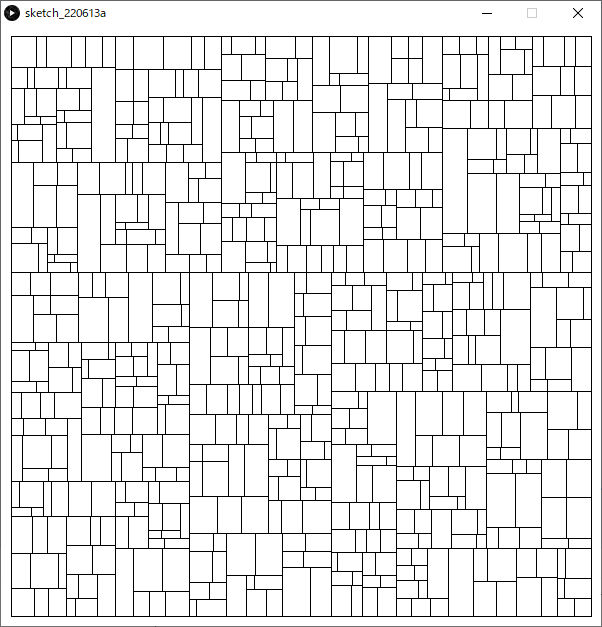


### マンデルブロ集合の描画

フラクタル図形の一種

```java
final float DRAW_OFS_X = -0.7;                           // 描く領域のオフセットX
final float DRAW_OFS_Y = 0;                              // 描く領域のオフセットY
final float DRAW_SCALE = 1.4;                            // 描く領域のスケール
final int RECURSIVE_MAX = 50;                            // 繰り返し上限回数
final float DRAW_SIZE = 4;                               // 描く領域の一辺の長さ

void setup()
{
  size(600,600);
  colorMode(HSB,RECURSIVE_MAX,1,1);
  background(0,0,0);
  
  // マンデルブロ集合の描画
  for (int iPixelX = 0; iPixelX < width; iPixelX++)  // x（実部）方向のループ
  {
    // 定数Cの実部
    float fCReal = iPixelX * DRAW_SIZE/( width*DRAW_SCALE) - DRAW_SIZE/(2*DRAW_SCALE) + DRAW_OFS_X; 
    
    for (int iPixelY = 0; iPixelY < height; iPixelY++)  // y（虚部）方向のループ
    {
      // 定数Cの虚部
      float fCImaginary = iPixelY * DRAW_SIZE/( height*DRAW_SCALE) - DRAW_SIZE/(2*DRAW_SCALE) + DRAW_OFS_Y; 
      
      drawFractal( 0, 0, fCReal, fCImaginary, iPixelX, iPixelY, RECURSIVE_MAX ) ;
    }
  }
}

void drawFractal( float fZReal, float fZImaginary, float fCReal, float fCImaginary, int iPixelX, int iPixelY, int iLevel )
{
  float fZRealNew = pow(fZReal,2) - pow(fZImaginary,2) + fCReal;     // z^2+Cの計算（実部）
  float fZImaginaryNew = 2 * fZReal * fZImaginary + fCImaginary;     // z^2+Cの計算（虚部）
  
  if( pow(fZRealNew,2)+pow(fZImaginaryNew,2) > 4 )  // もし絶対値が2を（絶対値の2乗が4を）超えていたら
  {
    stroke( iLevel, 1, 1 );             // 再帰の回数を色相へ
    point(iPixelX,iPixelY);             // (iPixelX,iPixelY)の位置のピクセルをで塗る
    return;                             // 再帰終了
  }
  else if( iLevel > 0 )
  {
    drawFractal( fZRealNew, fZImaginaryNew, fCReal, fCImaginary, iPixelX, iPixelY, iLevel-1 );
  }
}
```


### ジュリア集合の描画

フラクタル図形の一種

```java
final float DRAW_OFS_X = 0;                             // 描く領域のオフセットXf
inal float DRAW_OFS_Y = 0;                              // 描く領域のオフセットY
final float DRAW_SCALE = 1.4;                           // 描く領域のスケール
final int RECURSIVE_MAX = 200;                          // 繰り返し上限回数
final float DRAW_SIZE = 4;                              // 描く領域の一辺の長さ
final float C_REAL = -0.3;                              // 定数Cの実部
final float C_IMAGINARY = -0.63;                        // 定数Cの虚部

void setup()
{
  size(600,600);
  colorMode(HSB,RECURSIVE_MAX,1,1);
  background(0,0,0);
  
  // ジュリア集合の描画
  for (int iPixelX = 0; iPixelX < width; iPixelX++)  // x（実部）方向のループ
  {
    // 変数Zの実部
    float fZReal = iPixelX * DRAW_SIZE/( width*DRAW_SCALE ) - DRAW_SIZE/( 2*DRAW_SCALE ) + DRAW_OFS_X;
    
    for (int iPixelY = 0; iPixelY < height; iPixelY++)  // y（虚部）方向のループ
    {
      // 変数Zの虚部
      float fZImaginary = iPixelY * DRAW_SIZE/( height*DRAW_SCALE ) - DRAW_SIZE/( 2*DRAW_SCALE ) + DRAW_OFS_Y;
      drawFractal( fZReal, fZImaginary, C_REAL, C_IMAGINARY, iPixelX, iPixelY, RECURSIVE_MAX ) ;
    }
  }
}

void drawFractal( float fZReal, float fZImaginary, float fCReal, float fCImaginary, int iPixelX, int iPixelY, int iLevel )
{
  float fZRealNew = pow(fZReal,2) - pow(fZImaginary,2) + fCReal;     // z^2+Cの計算（実部）
  float fZImaginaryNew = 2 * fZReal * fZImaginary + fCImaginary;     // z^2+Cの計算（虚部）
  if( pow(fZRealNew,2)+pow(fZImaginaryNew,2) > 4 )  // もし絶対値が2を（絶対値の2乗が4を）超えていたら
  {
    stroke( iLevel, 1, 1 );             // 再帰の回数を色相へ
    point(iPixelX,iPixelY);             // (iPixelX,iPixelY)の位置のピクセルをで塗る
    return;                             // 再帰終了
  }
  else if( iLevel > 0 )
  {
    drawFractal( fZRealNew, fZImaginaryNew, fCReal, fCImaginary, iPixelX, iPixelY, iLevel-1 );
  }
}
```


# 画像・PDF出力

## 表示ウィンドウの画像を保存する．

- ファイル形式は tif, tga, png, jpg などが使用可能.
- **プログラムを実行すると**，プログラムが置かれているフォルダ（スケッチブック）内に画像が保存される.
- 通常はプログラムの最後に書くとよい．

### 書式

```java
save(“ファイル名.拡張子”); // ※ダブルクォーテーション（半角）を忘れずに.
```

### 例

```java
/**	スケッチ名：sketch01.pde		ルート90・セルオートマトンの描画プログラム	~省略*/

save( "sakuhin.png" );	// 表示ウィンドウを，"sakuhin.png"という名前で，pngファイルとして出力
```


## PDFへ出力

- **プログラムを実行すると**，プログラムが置かれているフォルダ（スケッチブック）内にpdfファイルが保存される.
- 少々ステップを踏む必要あり．

### 方法

1. 　ライブラリのインポート
    - （日本語）「スケッチ」メニュー ＞ 「ライブラリをインポート」 ＞ 「PDF Export」を選択
    - （英語版）「Sketch」メニュー ＞ 「import Library」 ＞ 「PDF Export」を選択 


​		上記を選択すると，プログラムの一行目に`import processing.pdf.*;`が追加される．
​		※**メニューを使わず，直に入力も可能．**


2. `size()`の記述変更

   ```java
   size( 横のサイズ, 縦のサイズ, PDF, “好きなファイル名.pdf” );
   ```

   


3. 　プログラム末尾に`exit();`を追加．


4. プログラムを実行すると，pdfファイルが出力される．
   この時，表示ウィンドウは表示されない．


# 入力

## マウス

### mouseX, mouseY

- システム変数
- 現在のマウスポインタの座標値が格納されている．

#### 例

```java
void setup(){  size(400, 400);}void draw(){  background(126);  ellipse(mouseX, mouseY, 33, 33);}
```


https://processing.org/reference/mouseX.html
https://processing.org/reference/mouseY.html

### pmouseX, pmouseY

- 直前の描画フレームにおけるマウスポインタの座標値が格納されている．
- マウスポインタを素早く動かすと，`mouseX`, `mouseY` の値との差が大きくなる
  - マウスポインタの移動の**速さ**と**方向**を取得できる

#### 例

```java
void setup({  size(400,400);  strokeWeight(8);  frameRate(20);}void draw(){  background(204);  line(mouseX, mouseY, pmouseX, pmouseY);}
```


https://processing.org/reference/pmouseX.html
https://processing.org/reference/pmouseY.html

### mousePressed

- マウスボタンが押されているか，押されていないかの情報が格納されている．
  - `true` : いずれかのボタンが押されている
  - `false` : どのボタンも押されていない

#### 例

```java
void draw(){  if (mousePressed == true)  {    fill(0);  }  else  {    fill(255);  }  rect(25, 25, 50, 50);}
```


https://processing.org/reference/mousePressed.html

### mouseButton

- マウスボタンが押されると，`LEFT`, `RIGHT`, `CENTER`のいずれかの値が格納される．
- `mousePressed`と組み合わせて使用することが多い
  - 格納された値はマウスの状態が変化するまで残るため

#### 例

```java
void setup(){  size(200, 100);}void draw(){  if( mousePressed == true && mouseButton == LEFT )  {    fill(0);  }  else  {    fill(255);  }  rect(20, 25, 50, 50);  // 左    if( mousePressed == true && mouseButton == CENTER )  {    fill(0);  }  else  {    fill(255);  }  rect(75, 25, 50, 50);  // 中  if( mousePressed == true && mouseButton == RIGHT )  {    fill(0);  }  else  {    fill(255);  }  rect(130, 25, 50, 50);  // 右}
```


https://processing.org/reference/mouseButton.html

https://processing.org/tutorials/interactivity/


## キーボード

### keyPressed

キーが押されているか，押されていないかの情報が格納されている．

- `true` : いずれかのボタンが押されている
- `false` : どのキーも押されていない

### key

- 直前に使用されたキーの値(英数字)が格納される．
- 英数字以外の特別なキー（矢印，Alt, Ctrl, Shift など ）が使用された場合，`CODED`の値が格納される．

#### 例

```java
void setup(){  textSize(60);}void draw(){  background(0);  text(key, 20, 75);}
```


### keyCode

- 英数字以外の特別なキーが押されると，押されたキーの値が格納される．
  - `UP`, `DOWN`, `LEFT`, `RIGHT`, `ALT`, `CONTROL`, `SHIFT` など
- 通常，`if( Key == CODED )`を組み合わせて使用することが多い．

#### 例

```java
int iX = 100;int iY = 100;char cKey;void setup(){  size(200,200);  textSize(60);}void draw(){  background(0);    if( keyPressed == true && key == CODED )  {    switch( keyCode )    {      case LEFT:        cKey = '<';        iX--;        break;      case RIGHT:        cKey = '>';        iX++;        break;      case UP:        cKey = '^';        iY--;        break;      case DOWN:        cKey = 'v';        iY++;        break;    }  }  else  {    cKey = 'o';  }    text(cKey, iX, iY);}
```


# ライブラリの使用

## ライブラリ（Libraries）とは

便利なプログラムの集まりをまとめ，他のプログラムで再利用できるようにしたもの

Processingのライブラリは以下の二種類に分けられる

- Core Libraries
  - Processingに標準でインストールされているライブラリ
  - インポートすればすぐに使用できる．
  - PDF Export, Network, SVG Export, Serial, DXF Export, Video, Sound, Hardware I/O

- Contributed Libraries
  - Processingに標準ではインストールされていない外部ライブラリ
  - インポートの前に，別途インストールが必要

https://processing.org/reference/libraries/

## インストールとインポート

Contributed Librariesを使用するには，事前にインストールする必要があります．
Core Librariesを使用する際は，「1.ライブラリのインストール」の手順はスキップできます．

1. ライブラリのインストール

   - 「スケッチ 」> 「ライブラリをインポート」 > 「ライブラリを追加」

     

   - 「Contribution Manager」から，ライブラリを検索

     

   - インストールしたいライブラリを選択し，インストール開始

     


2. ライブラリのインポート

   - 「スケッチ」メニュー ＞ 「ライブラリをインポート」 ＞ インポートしたいライブラリを選択

   - 上記を選択すると，プログラムの一行目に`import ライブラリ名.*;`の一文が追加される．

     


https://processing.org/reference/libraries/


## GUI

### 概要

- Graphical User Interface
- コンピュータの画面上に表示されるグラフィックスを元に操作を行うインターフェースのこと
- 基本の入力（マウスやキーボード）で実現するのは難しいので，ライブラリを頼る

### 必要なライブラリ

数種類あるのだが，ここでは日本語ドキュメントが豊富なControlP5を使用する．

田所淳（たどころあつし）先生のドキュメントが有名
[yoppa org](https://yoppa.org/)

- ライブラリ名：ControlP5
  - Contributed libraries（インストールの必要あり）

### 導入方法

クラスの概念を理解していないと難しいので，完全に理解する必要はありません．

1. ControlP5を宣言
   GUIのすべてのパーツを管理するオブジェクト

   `ControlP5 cp5;`

2. GUIパーツを宣言
   パーツの種類によって宣言の**型**が異なる

   - `Slider slider; // スライダー `
   - `Slider2D slider2d; // 2Dスライダー `
   - `Toggle toggle; // トグルスイッチ `
   - `ColorWheel colowWheel; // カラーホイール `

3. setup関数内で，ControlP5を初期化

   ` cp5 = new ControlP5(this);`

4. setup関数内で，ControlP5にGUIパーツを追加
   パーツの種類によって書式が異なる

   ```java
   slider = cp5.addSlider("ID")	// スライダー    .setRange(0, 255)   		//値の範囲    .setValue(0)        		//初期値    .setPosition(50, 50)		//表示位置    .setSize(200, 24);  		//スライダの大きさ 
   ```

   ```java
   slider2d = cp5.addSlider2D("ID") // スライダー2D    .setMinMax(0, 5, 255, 250)   //値の範囲    .setValue(0,250)             //初期値    .setPosition(50, 50)         //位置    .setSize(100, 100);          //スライダの大きさ }
   ```

   ```java
   toggle = cp5.addToggle("ANIM") // トグルスイッチ    .setPosition(20, 20)		   //位置    .setSize(24, 24);			   //大きさ
   ```

   ```java
   colWheel = cp5.addColorWheel("RECT COLOR") // カラーホイール    .setPosition(10, 10)     //位置    .setRGB(color(0,0,0));   //初期値 
   ```

### GUIパーツ別の実装方法

#### スライダー

１つのパラメータを制御できる．

##### 例: 矩形の色を変更

```java
import controlP5.*; // ControlP5をcp5として宣言ControlP5 cp5; // スライダーを宣言Slider sliderRectColor; // 矩形の色 void setup(){  size(500, 500);    // ControlP5を初期化  cp5 = new ControlP5(this);    // スライダーを追加  sliderRectColor = cp5.addSlider("RECT COLOR")    .setRange(0, 255)   //0~255の間    .setValue(0)        //初期値    .setPosition(50, 50)//位置    .setSize(200, 24);  //スライダの大きさ } void draw(){  background(255);    // スライダーの値を取得し，fill値を設定  fill(sliderRectColor.getValue());  rect(125, 125, 250, 250);}
```


##### 例: 矩形の色と大きさを変更

```java
import controlP5.*; // ControlP5をcp5として宣言ControlP5 cp5; // スライダーを宣言Slider sliderRectColor; // 矩形の色Slider sliderRectSize; // 矩形の大きさ void setup(){  size(500, 500);    // ControlP5を初期化  cp5 = new ControlP5(this);    // スライダーを追加  sliderRectColor = cp5.addSlider("RECT COLOR")    .setRange(0, 255)   //0~255の間    .setValue(0)        //初期値    .setPosition(50, 50)//位置    .setSize(200, 24);  //スライダの大きさ    sliderRectSize = cp5.addSlider("RECT SIZE")    .setRange(5, 250)   //5~250の間    .setValue(250)      //初期値    .setPosition(50, 80)//位置    .setSize(200, 24);  //スライダの大きさ } void draw(){  background(255);    rectMode(CENTER);  // スライダーの値を取得し，fill値を設定  fill(sliderRectColor.getValue());  // スライダーの値を取得し，矩形の大きさを設定  rect(width/2, height/2, sliderRectSize.getValue(), sliderRectSize.getValue());}
```


#### 2Dスライダー

２つのパラメータを制御できる．

##### 例: 矩形の色と大きさを変更

```java
import controlP5.*; // ControlP5をcp5として宣言ControlP5 cp5; // 2Dスライダーを宣言Slider2D sliderRect; // 矩形の色と大きさ void setup(){  size(500, 500);    // ControlP5を初期化  cp5 = new ControlP5(this);    // スライダーを追加  sliderRect = cp5.addSlider2D("RECT COLOR SIZE")    .setMinMax(0, 5, 255, 250)   // 0~255の間及び5~250の間    .setValue(0,250)             //初期値    .setPosition(50, 50)         //位置    .setSize(100, 100);          //スライダの大きさ } void draw(){  background(255);    rectMode(CENTER);  // スライダーの値を取得し，fill値を設定  fill(sliderRect.getArrayValue()[0]);  // スライダーの値を取得し，矩形の大きさを設定  rect(width/1.5, height/2, sliderRect.getArrayValue()[1], sliderRect.getArrayValue()[1]);}
```


#### トグルスイッチ（Toggle）

スイッチのように，オンかオフかの２値を取得できる．

##### 例: 矩形の移動アニメーションのオンオフ

```java
import controlP5.*; // ControlP5をcp5として宣言ControlP5 cp5; // トグルボタンを宣言Toggle toggleAnim; // アニメーションのon,off int iPosX; void setup(){  size( 400, 400 );  colorMode( RGB, 1, 1, 1 );  noStroke();  frameRate( 20 );    // ControlP5を初期化  cp5 = new ControlP5(this);    // トグルスイッチを追加  toggleAnim = cp5.addToggle("ANIM")    .setPosition(20, 20)//位置    .setSize(24, 24);  //大きさ    iPosX = 0;      // iPosXの初期化}void draw(){  fill( 1, 1, 1 );  rect( 0, 0, width, height );    // もしトグルスイッチがONだったら  if(toggleAnim.getState() )  {    iPosX += 4;  }    if( iPosX > width ) // もしX座標値がスクリーンの外なら  {    iPosX = 0;        // X座標値を0に戻す  }    fill( 0, 0, 0 );  rect( iPosX, height/2-10, 20, 20 );}
```


#### カラーホイール(ColorWheel)

2Dスライダーに近い感覚でカラー値をコントロールできる．

##### 例: 

```java
import controlP5.*; // ControlP5をcp5として宣言ControlP5 cp5; // カラーホイールを宣言ColorWheel colWheelRect; // 矩形の色 void setup(){  size(400, 400);    // ControlP5を初期化  cp5 = new ControlP5(this);    // カラーホイールを追加  colWheelRect = cp5.addColorWheel("RECT COLOR")    .setPosition(10, 10)     //位置    .setRGB(color(0,0,0));   //初期値 } void draw(){  background(155);    // カラーホイールの値を取得し，fill値を設定  fill(colWheelRect.getRGB());  rect(width/1.8, height/1.8, 150, 150);}
```


## キャプチャー

### 概要

コンピューターに接続したキャプチャーデバイス（カメラ）からビデオデータを取得し，ムービーを再生する．

### 必要なライブラリ

- ライブラリ名：Video

  - Core libraries（インストールの必要なし）

#### 対応デバイス

USB Cameras, IEEE 1394 (Firewire) Cameras

### 導入方法

1. キャプチャーデバイス（USBカメラ）をコンピューターに接続する．
   - コンピュータ内蔵カメラの場合は不要
2. 以下のプログラムをProcessingで実行

```java
import processing.video.*; Capture cam; void setup(){  size(640, 480);   String[] cameras = Capture.list();    if (cameras.length == 0)  {    println("There are no cameras available for capture.");    exit();  }  else  {    println("Available cameras:");    for (int i = 0; i < cameras.length; i++)    {      print( "cameras["+i+"]: " );      println(cameras[i]);    }        // The camera can be initialized directly using an     // element from the array returned by list():    cam = new Capture(this, cameras[0]);    cam.start();       }      } void draw(){  if (cam.available() == true)  {    cam.read();  }  image(cam, 0, 0);  // The following does the same, and is faster when just drawing the image  // without any additional resizing, transformations, or tint.  //set(0, 0, cam);}
```


3. 映像が表示されなかった場合，以下のコンソールの表示を確認
   使用したいカメラの要素番号（`cameras[要素番号]`）を確認する．

  

4. 使用したいカメラの要素番号をキャプチャー初期化時に指定するよう，プログラムを書き換える．


  - このサンプルの場合，HD Pro Webcam C920を使いたいので，`cameras[1]`

    

5. 実行して正しくキャプチャーできているか確認する


https://processing.org/reference/libraries/video/Capture.html


### 例

カメラ画像のピクセル情報を取得してモザイク状に描画する．

```java
import processing.video.*; Capture cam; void setup(){  size(640, 480);   String[] cameras = Capture.list();    if (cameras.length == 0)  {    println("There are no cameras available for capture.");    exit();  }  else  {    println("Available cameras:");    for (int i = 0; i < cameras.length; i++)    {      print( "cameras["+i+"]: " );      println(cameras[i]);    }        // The camera can be initialized directly using an     // element from the array returned by list():    cam = new Capture(this, cameras[1]);    cam.start();       }    smooth();  noStroke();} void draw(){  if (cam.available() == true)  {    cam.read();        background(0);    cam.loadPixels();         //カメラ画像のpixel情報をロード    int iDiameter = 20;       //円の直径    // カメラの映像から、円の直径の間隔ごとに色情報を取得し、その色で円を描画    for(int iPixelY = iDiameter / 2 ; iPixelY < height ; iPixelY += iDiameter)    {      for(int iPixelX = iDiameter / 2 ; iPixelX < width ; iPixelX += iDiameter)      {        fill(cam.pixels[iPixelY*width + iPixelX]);        ellipse(iPixelX, iPixelY, iDiameter, iDiameter);      }    }  }}
```


# クラス

## クラスとは

プログラムにおいて，現実世界の物体（オブジェクト）を抽象化した設計図のようなもの

## なぜクラスを学ぶのか

- 現在のソフトウェア開発のメインストリーム
  - **オブジェクト指向プログラミング**
  - C++, C#, Java, Delphi, Smalltalkなど
  
- Processingに限らず，ライブラリの多くはクラスを使用している
  - ControlP5, Capture はクラスである
- プログラミングで，より高度なことを洗練された方法で行いたいなら推奨
  - クラスを使わなければ，プログラムがより複雑に見づらくなっていく

## オブジェクト指向プログラミング

 object-oriented programming (OOP)

### 概念

「犬」を対象とした例

1. （現実世界における）オブジェクトのひな型を定義する．（抽象化）
   - 状態
   
     - 毛並み
   
     - 耳の形
   
     - 尻尾の形
   
   - 振る舞い
   
     - 走る
   
     - 吠える
   
     - 食べる
   
     - 寝る


2. インスタンスを作成（具象化）する．
   - 状態
     - 毛並み：イエロー，クリーム，ブラウン，ブラック
     - 耳の形：立ち耳，垂れ耳，折れ耳
     - 尻尾の形：巻き尾，立ち尾，垂れ尾，リス尾，ボブ


3. インスタンスの振る舞いを実行する．
   - 振る舞い
     - 走る
     - 吠える
     - 食べる
     - 寝る


### キーワード

以下がクラスを習得するのに理解しなければならないキーワード．

- **クラス** `Class`
  - **フィールド** `Field`
  - **メソッド** `Method`
    - **コンストラクタ** `Constructor`

- **インスタンス** `Instance`

### 概念とキーワードの対応

各キーワードは，前述の概念と下記のように対応している．

- **クラス** `Class`：<u>オブジェクトのひな型</u>
  - **フィールド** `Field`：<u>状態</u>
  - **メソッド** `Method`：<u>振る舞い</u>
    - **コンストラクタ** `Constructor`：<u>状態の初期化</u>

- **インスタンス** `Instance`：<u>具象化されたオブジェクト</u>


### クラス「人」の例

#### クラス「人」を定義


##### フィールド

- 身長
- 体重
- 性別
- 血液型．．．

##### メソッド

- 喜ぶ，褒める，照れる，指さす，書く．．．

#### インスタンスを作成

インスタンスは，具象化された特定の人を指す.


##### フィールド

- 身長: 168cm
- 体重: 62kg
- 性別: 男
- 血液型: A

#### インスタンスのメソッドを実行

メインプログラムから任意のタイミングでメソッドを実行する．

##### メソッド

- 喜ぶ，褒める，照れる，指さす，書く．．．


https://processing.org/tutorials/objects/
https://docs.oracle.com/javase/tutorial/java/concepts/index.html


## class

### 概要

- クラスを宣言，定義するためのキーワード．

- クラスは以下のもので構成される
  - フィールド
    - データ（変数や配列）
  - メソッド
    - 関数
    - コンストラクタ（初期化用関数）
- クラスを使うための手順
  1. クラスの定義を行う
  2. クラスのインスタンスを作成する．
  3. インスタンスを初期化する．
  4. インスタンスのメソッドを呼ぶ（Call）

### クラスの定義

##### 書式（全体）

クラス名は**一文字目を必ず大文字**に

```java
class クラス名
{
  /* フィールドの変数を宣言 */
  変数の型 変数名;
 	
  /* コンストラクタの定義 */
  クラス名( 仮引数 )
  {
    // すべてのフィールドの変数を初期化する命令
  }
  
  /* メソッドの定義 */
  void メソッド名( 仮引数 )
  {
    // (命令)文
    //   フィールドの変数にアクセス可  
  }
  返り値の型 メソッド名( 仮引数 )
  {
    // (命令)文
    //   フィールドの変数にアクセス可
  
    return 返り値;
  }
}
```

##### フィールドの変数を宣言

- 従来の変数や配列の宣言文と同様
- 複数の変数を宣言可能

```java
変数の型 変数名;
```

##### コンストラクタの定義

- **クラス名をそのまま関数名**として関数を定義する．
- 関数の**返り値**（voidなど）**の記述を行わない**．

- フィールドの全ての変数を初期化する命令文を記述する．
- 仮引数は任意の数(0個もOK)を指定できる．

```java
クラス名( 仮引数 )
{
  // すべてのフィールドの変数を初期化する命令
}
```

##### メソッドの定義

- 従来の関数の定義と同様

- フィールドの変数にアクセスできる．
- 仮引数は任意の数(0個もOK)を指定できる．
- メソッドの複数定義可

```java
void メソッド名( 仮引数 )
{
  // (命令)文
  //   フィールドの変数にアクセス可  
}

返り値の型 メソッド名( 仮引数 )
{
  // (命令)文
  //   フィールドの変数にアクセス可
    
  return 返り値;
}
```

#### 「Car」クラスの例

##### 定義全体

```java
class Car
{ 
  float m_fPosX;    // 座標値X
  float m_fPosY;    // 座標値Y
  float m_fSpeedX;  // スピードX
  int   m_iColorHue;// 色(Hue)
  
  // コンストラクタ（初期化）
  Car ( int iColorHue )
  {  
    m_fPosX = width/2;
    m_fPosY = height/2;
    m_iColorHue = iColorHue;
    m_fSpeedX = 1;
  } 
  
  // 車を表示する
  void display()
  { 
    pushMatrix();
    translate( m_fPosX, m_fPosY );
    
    // body
    fill( m_iColorHue, 255, 255 );
    rect( 0, 0, 40, 20 );
    
    // tires
    fill( 0, 0, 20 );
    circle( 5, 20, 10 );
    circle( 35, 20, 10 );
    
    popMatrix();
  }
  
  // 車を進める
  void drive()
  {
    m_fPosX += m_fSpeedX;
    if( m_fPosX > width )
    {
      m_fPosX = 0;
    }
  }
} 
```

##### フィールド

- 従来の変数や配列の定義と同様
- この例ではフィールドを通常の変数と区別しやすくするため，初めに`m_`を付けている．

```java
  float m_fPosX;    // 座標値X
  float m_fPosY;    // 座標値Y
  float m_fSpeedX;  // スピードX
  int   m_iColorHue;// 色(Hue)
```

##### メソッド（コンストラクタ）

- **クラス名をそのまま関数名**として関数を定義する．
- 関数の**返り値**（voidなど）**の記述を行わない**．

- フィールドの全ての変数を初期化する必要がある．
- 仮引数は任意の数(0個もOK)を指定できる．
  - この例では `int iColorHue`の１つ

```java
  // コンストラクタ（初期化）
  Car ( int iColorHue )
  {  
    m_fPosX = width/2;
    m_fPosY = height/2;
    m_iColorHue = iColorHue;
    m_fSpeedX = 1;
  }
```

##### メソッド

- フィールドの変数にアクセスできる．
- 仮引数は任意の数(0個もOK)を指定できる．

```java
  // 車を表示する
  void display()
  { 
    pushMatrix();
    translate( m_fPosX, m_fPosY );
    
    // body
    fill( m_iColorHue, 255, 255 );
    rect( 0, 0, 40, 20 );
    
    // tires
    fill( 0, 0, 20 );
    circle( 5, 20, 10 );
    circle( 35, 20, 10 );
    
    popMatrix();
  }
  
  // 車を進める
  void drive()
  {
    m_fPosX += m_fSpeedX;
    if( m_fPosX > width )
    {
      m_fPosX = 0;
    }
  }
```

### クラスのインスタンスを作成する

- クラスを使うには，クラスのインスタンスを作成し，さらに初期化する必要がある．
  - クラスの定義はあくまでひな型の作成

#### インスタンスの作成

基本的には関数ブロックの外（プログラムの最初）に記述する．

##### 書式

```java
クラス名 インスタンスの名前;
```

```java
クラス名[] インスタンス配列の名前 = new クラス名[要素数];	// １次元配列に複数のインスタンスを作成
```

- インスタンス名は任意の名前を付けることができる
  - 変数名の時と同様
- クラス名が，<u>変数宣言時における型と同じような働きをしている</u>ことに注目
- この手順により，**コンピュータのメモリ上にインスタンス毎のデータ（フィールドの変数）が保持**される．
  - インスタンス毎に固有のデータを持つことになる．

##### 「Car」クラスの例

```java
Car myCar;	// Carインスタンスを宣言
```

```java
Car[] myCars = new Car[8];	// Carインスタンス配列を宣言（8つ）
```

### インスタンスの初期化

基本的にはsetup関数内に記述する．

#### 書式

```java
インスタンス名 = new クラス名( 引数 );
```

- インスタンスに対し，**コンストラクタが実行される**．
  - コンストラクタ内でフィールドの変数が初期化される．
- 引数は，コンストラクタの仮引数に渡される．
  - 引数の数は，コンストラクタの仮引数の数に合わせる必要がある．
  - 引数がフィールドの初期値に今日を与える．

##### 「Car」クラスの例

```java
myCar = new Car( 240 );	// マイカーを初期化
```

- 引数の240は，車の色（色相）の指定を行っている．

### インスタンスのメソッドを呼ぶ

基本的にはdraw関数内に記述する．

#### 書式

```java
インスタンス名.メソッド名( 引数 );							// メソッドを実行

/*  式に */ インスタンス名.メソッド名( 引数 ) /* 組み込む */	// メソッド(返り値あり)を実行
```

- インスタンス名に続き'.'（ドット）+メソッド名( 引数 ) というように記述する．
- インスタンスに対し，メソッドが実行される．
- 返り値のあるメソッドは，関数の時と同様に式に組み込むことができる．

##### 「Car」クラスの例

```java
// マイカーのメソッドを呼ぶ 
myCar.drive();  // 車を進める
myCar.display();// 車を描画する
```

### クラスの使用の例

#### 「Car」クラスの例

```java
// マイカー（インスタンス）を作成
Car myCar;
 
void setup()
{
  size(400,200);
  colorMode(HSB);
  
  // マイカーを初期化
  myCar = new Car( 240 );	// 240:色相
}    
void draw()
{    
  background(255);
  
  // マイカーのメソッドを呼ぶ 
  myCar.drive();  // 車を進める
  myCar.display();// 車を描画する
}      
/** Carクラスの定義 */
class Car
{ 
  // フィールド
  float m_fPosX;    // 座標値X
  float m_fPosY;    // 座標値Y
  float m_fSpeedX;  // スピードX
  int   m_iColorHue;// 色(Hue)
  
  // コンストラクタ（初期化）
  Car( int iColorHue )
  {  
    m_fPosX = width/2;
    m_fPosY = height/2;
    m_iColorHue = iColorHue;
    m_fSpeedX = 1;
  }
  
  /* 以下，メソッド */
  
  // 車を表示する
  void display()
  { 
    pushMatrix();
    translate( m_fPosX, m_fPosY );
    
    // body
    fill( m_iColorHue, 255, 255 );
    rect( 0, 0, 40, 20 );
    
    // tires
    fill( 0, 0, 20 );
    circle( 5, 20, 10 );
    circle( 35, 20, 10 );
    
    popMatrix();
  }
  
  // 車を進める
  void drive()
  {
    m_fPosX += m_fSpeedX;
    if( m_fPosX > width )
    {
      m_fPosX = 0;
    }
  }
} 
```


演習

## クラスファイルの分割

- クラスを用いるとさらにプログラムが長くなる．
- **クラス毎に，クラス定義を別のpdeファイルへ分割**して記述すると，プログラムが見やすくなる．
  - クラス名をそのままファイル名とすると分かりやすい．

### 「Car」クラスの例

1. （分割する前の）スケッチを保存する


2. タブの横の「▽」をクリック


3. 新規タブを選択


4. 新しく作成するクラス用のファイル名を入力
   この例では「Car」


5. 新しく作った空のタブが開かれる


6. ここにクラス定義の記述を追加する．
   Car_drive.pde(メインプログラム)に元々記述していたクラス定義は削除する．


7. ファイル分割後のディレクトリは以下のようになる
   - スケッチフォルダ名「Car_drive」と同名の「Car_drive.pde」がメインプログラムファイルとなる
     - setup関数やdraw関数を記述する．
   - 「Car.pde」がクラスファイル
     - Carクラスのクラス定義を記述する．


## オブジェクト指向プログラミングの利点

- モジュール性（再利用性）
  - クラス定義ファイルの流用
- 情報の隠蔽
  - メインプログラムから行えることが制限されている
    - メソッドの使用（コール）のみ
    - クラスのフィールドには直接アクセスできない
- 不具合の発見，修正の容易さ
  - クラスの挙動に不具合があった場合，クラスファイルのみを調査すればよい

## オブジェクト指向分析・設計

複数のクラスを用いた，より複雑なプログラムの設計を行う際は，オブジェクト指向的な設計能力が求められる．
実装（プログラミング）の前準備だが，重要な工程

#### クラスの設計

- 何をクラスにするのか
- 何をフィールドにするのか
- 何をメソッドにするか

#### 重要な考え方，心構え

クラスの設計を行う際に重要な考え方，心構えは従来のエンジニア的な思考とは異なる．

- オブジェクト指向的にシステムの仕様をとらえる
- それをどのようにコードに落としていくかという方針を決定する

#### 求められる資質

**物事の構造や本質を見抜き，洞察する能力** > 旧来のエンジニアリング知識，コーディング能力

## 演習

### 概要

- Faceクラスを定義する．

- 4つのインスタンスを作成し，描画を行う．


### 1. setup関数を用意する

```java
void setup()
{
  size(400,300);
}
```

### 2. Faceクラス定義の枠を作る

「Face」の一文字目は大文字であることに注意

下の答えを見ながらでいいので，書いてみましょう．

```java
void setup()
{
  size(400,300);
}
class Face
{
}
```

### 3. フィールドを宣言する

顔ごとに個性が現れるデータを変数として宣言する．

- 目の大きさ
- 目の間隔
- 目と口の距離
- 口の幅

下の答えから，正しい範囲をコピーしてプログラムに挿入しましょう．

```java
void setup()
{
  size(400,300);
}
class Face
{
  float m_fEyeSize;            // 目の大きさ
  float m_fEyeInterval;        // 目の間隔
  float m_fEyeToMouthDistance; // 目と口の距離
  float m_fMouthWidth;         // 口の幅
}
```

### 4. コンストラクタの枠を作成する

コンストラクタはフィールドを初期化するための特別なメソッド．

下の答えを見ながらでいいので，書いてみましょう．

```java
void setup()
{
  size(400,300);
}
class Face
{
  float m_fEyeSize;            // 目の大きさ
  float m_fEyeInterval;        // 目の間隔
  float m_fEyeToMouthDistance; // 目と口の距離
  float m_fMouthWidth;         // 口の幅
  
  Face()
  {
  }
}
```

### 5. コンストラクタを定義する

コンストラクタの中でフィールドをランダム値で初期化します．

下の答えから，正しい範囲をコピーしてプログラムに挿入しましょう．

```java
void setup()
{
  size(400,300);
}
class Face
{
  float m_fEyeSize;            // 目の大きさ
  float m_fEyeInterval;        // 目の間隔
  float m_fEyeToMouthDistance; // 目と口の距離
  float m_fMouthWidth;         // 口の幅
  
  Face()
  {
    m_fEyeSize = random( 2, 8 );
    m_fEyeInterval = random( 16, 28 ); 
    m_fEyeToMouthDistance = random( 20, 36 );
    m_fMouthWidth = random( 8, 24 );
  }
}
```

### 6. テスト用Faceインスタンスを作成する

テスト用なので「faceTest」という名前

下の答えを見ながらでいいので，書いてみましょう．

```java
Face faceTest; // テスト用Faceインスタンスを作成

void setup()
{
  size(400,300);
}
class Face
{
  float m_fEyeSize;            // 目の大きさ
  float m_fEyeInterval;        // 目の間隔
  float m_fEyeToMouthDistance; // 目と口の距離
  float m_fMouthWidth;         // 口の幅
  
  Face()
  {
    m_fEyeSize = random( 2, 8 );
    m_fEyeInterval = random( 16, 28 ); 
    m_fEyeToMouthDistance = random( 20, 36 );
    m_fMouthWidth = random( 8, 24 );
  }
}
```

### 7. Faceインスタンスを初期化する

仮引数は無いので，引数の記述は必要無し

下の答えを見ながらでいいので，書いてみましょう．

```java
Face faceTest; // テスト用Faceインスタンスを作成

void setup()
{
  size(400,300);
  
  faceTest = new Face(); // Faceインスタンスを初期化
}
class Face
{
  float m_fEyeSize;            // 目の大きさ
  float m_fEyeInterval;        // 目の間隔
  float m_fEyeToMouthDistance; // 目と口の距離
  float m_fMouthWidth;         // 口の幅
  
  Face()
  {
    m_fEyeSize = random( 4, 8 );
    m_fEyeInterval = random( 16, 28 ); 
    m_fEyeToMouthDistance = random( 16, 30 );
    m_fMouthWidth = random( 8, 24 );
  }
}
```

### 8. 描画のためのメソッドの枠を作成する

「display」という名前でFaceクラスにメソッドを定義する．
ブロック内の命令は空のまま

下の答えを見ながらでいいので，書いてみましょう．

```java
Face faceTest; // テスト用Faceインスタンスを作成
 
void setup()
{
  size(400,300);
  
  faceTest = new Face(); // Faceインスタンスを初期化
}
class Face
{
  float m_fEyeSize;            // 目の大きさ
  float m_fEyeInterval;        // 目の間隔
  float m_fEyeToMouthDistance; // 目と口の距離
  float m_fMouthWidth;         // 口の幅
  
  Face()
  {
    m_fEyeSize = random( 4, 8 );
    m_fEyeInterval = random( 16, 28 ); 
    m_fEyeToMouthDistance = random( 16, 30 );
    m_fMouthWidth = random( 8, 24 );
  }
  
  void display()
  {
  }
}
```

### 9. displayメソッドを使う

setup関数の中でテスト用インスタンスのメソッドを使ってみましょう．
また，顔を画面中心に描画するために座標変換命令も追加します．

下の答えを見ながらでいいので，書いてみましょう．

```java
Face faceTest; // テスト用Faceインスタンスを作成
 
void setup()
{
  size(400,300);
  
  faceTest = new Face(); // Faceインスタンスを初期化
  
  translate(width/2,height/2);
  faceTest.display(); // Faceインスタンスの描画
}
class Face
{
  float m_fEyeSize;            // 目の大きさ
  float m_fEyeInterval;        // 目の間隔
  float m_fEyeToMouthDistance; // 目と口の距離
  float m_fMouthWidth;         // 口の幅
  
  Face()
  {
    m_fEyeSize = random( 4, 8 );
    m_fEyeInterval = random( 16, 28 ); 
    m_fEyeToMouthDistance = random( 16, 30 );
    m_fMouthWidth = random( 8, 24 );
  }
  
  void display()
  {
  }
}
```

### 10. displayメソッドに描画命令を追加

displayメソッドの中でフィールドの変数を使い，描画を行います．

下の答えから，正しい範囲をコピーしてプログラムに挿入しましょう．

```java
Face faceTest; // テスト用Faceインスタンスを作成

void setup()
{
  size(400,300);
  
  faceTest = new Face(); // Faceインスタンスを初期化
  
  translate(width/2,height/2);
  faceTest.display(); // Faceインスタンスの描画
}
class Face
{
  float m_fEyeSize;            // 目の大きさ
  float m_fEyeInterval;        // 目の間隔
  float m_fEyeToMouthDistance; // 目と口の距離
  float m_fMouthWidth;         // 口の幅
  
  Face()
  {
    m_fEyeSize = random( 2, 8 );
    m_fEyeInterval = random( 16, 28 ); 
    m_fEyeToMouthDistance = random( 20, 36 );
    m_fMouthWidth = random( 8, 24 );
  }
  
  void display()
  {
    // 輪郭
    circle( 0, 0, 60 );
    // 左目
    circle( -m_fEyeInterval/2.0, -m_fEyeToMouthDistance/2.0, m_fEyeSize );
    // 右目
    circle(  m_fEyeInterval/2.0, -m_fEyeToMouthDistance/2.0, m_fEyeSize );
    // 口
    line( -m_fMouthWidth/2.0, m_fEyeToMouthDistance/2.0, m_fMouthWidth/2.0, m_fEyeToMouthDistance/2.0 );
  }
}
```


### 11. インスタンスを4つ作成

1. 以下はテスト用だったので削除します．
   - `Face faceTest; // テスト用Faceインスタンスを作成`
   - `translate(width/2,height/2);`
2. Faceクラスのインスタンス配列を作成します．
   - 配列名: `faces`
   - 要素数: 4

下の答えを見ながらでいいので，書いてみましょう．
※この段階ではエラーでプログラムは未だ実行できません．

```java
Face[] faces = new Face[4]; // Faceインスタンスを4つ作成

void setup()
{
  size(400,300);
  
  faceTest = new Face(); // Faceインスタンスを初期化
  
  faceTest.display(); // Faceインスタンスの描画
}
class Face
{
  float m_fEyeSize;            // 目の大きさ
  float m_fEyeInterval;        // 目の間隔
  float m_fEyeToMouthDistance; // 目と口の距離
  float m_fMouthWidth;         // 口の幅
  
  Face()
  {
    m_fEyeSize = random( 2, 8 );
    m_fEyeInterval = random( 16, 28 ); 
    m_fEyeToMouthDistance = random( 20, 36 );
    m_fMouthWidth = random( 8, 24 );
  }
  
  void display()
  {
    // 輪郭
    circle( 0, 0, 60 );
    
    // 左目
    circle( -m_fEyeInterval/2.0, -m_fEyeToMouthDistance/2.0, m_fEyeSize );
    // 右目
    circle(  m_fEyeInterval/2.0, -m_fEyeToMouthDistance/2.0, m_fEyeSize );
    // 口
    line( -m_fMouthWidth/2.0, m_fEyeToMouthDistance/2.0, m_fMouthWidth/2.0, m_fEyeToMouthDistance/2.0 );
  }
}
```

### 12. インスタンスの初期化を書き換える

4つのインスタンスは配列に格納されているので，初期化の記述も書き換えましょう．
配列の初期化方法を思い出してください．

下の答えを見ながらでいいので，書いてみましょう．
※この段階ではエラーでプログラムは未だ実行できません．

```java
Face[] faces = new Face[4]; // Faceインスタンスを4つ作成

void setup()
{
  size(400,300);
  
  // Faceインスタンスを初期化
  for( int iFaceIdx=0; iFaceIdx < faces.length; iFaceIdx++ )
  {
    faces[iFaceIdx] = new Face();
  }
  
  faceTest.display();
}
class Face
{
  float m_fEyeSize;            // 目の大きさ
  float m_fEyeInterval;        // 目の間隔
  float m_fEyeToMouthDistance; // 目と口の距離
  float m_fMouthWidth;         // 口の幅
  
  Face()
  {
    m_fEyeSize = random( 2, 8 );
    m_fEyeInterval = random( 16, 28 ); 
    m_fEyeToMouthDistance = random( 20, 36 );
    m_fMouthWidth = random( 8, 24 );
  }
  
  void display()
  {
    // 輪郭
    circle( 0, 0, 60 );
    
    // 左目
    circle( -m_fEyeInterval/2.0, -m_fEyeToMouthDistance/2.0, m_fEyeSize );
    // 右目
    circle(  m_fEyeInterval/2.0, -m_fEyeToMouthDistance/2.0, m_fEyeSize );
    // 口
    line( -m_fMouthWidth/2.0, m_fEyeToMouthDistance/2.0, m_fMouthWidth/2.0, m_fEyeToMouthDistance/2.0 );
  }
}
```

### 13. メソッドを使う命令を書き換える

下の答えを見ながらでいいので，書いてみましょう．

```java
Face[] faces = new Face[4]; // Faceインスタンスを4つ作成

void setup()
{
  size(400,300);
  
  // Faceインスタンスを初期化
  for( int iFaceIdx=0; iFaceIdx < faces.length; iFaceIdx++ )
  {
    faces[iFaceIdx] = new Face();
  }
  
  // Faceインスタンスの描画
  for( int iFaceIdx=0; iFaceIdx < faces.length; iFaceIdx++ )
  {
    faces[iFaceIdx].display();
  }
}
class Face
{
  float m_fEyeSize;            // 目の大きさ
  float m_fEyeInterval;        // 目の間隔
  float m_fEyeToMouthDistance; // 目と口の距離
  float m_fMouthWidth;         // 口の幅
  
  Face()
  {
    m_fEyeSize = random( 4, 8 );
    m_fEyeInterval = random( 16, 28 ); 
    m_fEyeToMouthDistance = random( 16, 30 );
    m_fMouthWidth = random( 8, 24 );
  }
  
  void display()
  {
    // 輪郭
    circle( 0, 0, 60 );
    
    // 左目
    circle( -m_fEyeInterval/2.0, -m_fEyeToMouthDistance/2.0, m_fEyeSize );
    // 右目
    circle(  m_fEyeInterval/2.0, -m_fEyeToMouthDistance/2.0, m_fEyeSize );
    // 口
    line( -m_fMouthWidth/2.0, m_fEyeToMouthDistance/2.0, m_fMouthWidth/2.0, m_fEyeToMouthDistance/2.0 );
  }
}
```

### 14. 4つのインスタンスを並べて表示する

Faceインスタンスの描画命令周りに座標変換を使い，並べて表示するよう変更します．

下の答えから，正しい範囲をコピーしてプログラムに挿入しましょう．

```java
Face[] faces = new Face[4]; // Faceインスタンスを4つ作成
 
void setup()
{
  size(400,300);
  
  // Faceインスタンスを初期化
  for( int iFaceIdx=0; iFaceIdx < faces.length; iFaceIdx++ )
  {
    faces[iFaceIdx] = new Face();
  }
  
  // Faceインスタンスの描画
  translate( width/8, height/2 ); // １つ目の顔の描画位置に移動.
  for( int iFaceIdx=0; iFaceIdx < faces.length; iFaceIdx++ )
  {
    faces[iFaceIdx].display();
    translate( width/faces.length, 0 ); // X軸方向に顔の間隔分移動
  }
}
class Face
{
  float m_fEyeSize;            // 目の大きさ
  float m_fEyeInterval;        // 目の間隔
  float m_fEyeToMouthDistance; // 目と口の距離
  float m_fMouthWidth;         // 口の幅
  
  Face()
  {
    m_fEyeSize = random( 4, 8 );
    m_fEyeInterval = random( 16, 28 ); 
    m_fEyeToMouthDistance = random( 16, 30 );
    m_fMouthWidth = random( 8, 24 );
  }
  
  void display()
  {
    // 輪郭
    circle( 0, 0, 60 );
    
    // 左目
    circle( -m_fEyeInterval/2.0, -m_fEyeToMouthDistance/2.0, m_fEyeSize );
    // 右目
    circle(  m_fEyeInterval/2.0, -m_fEyeToMouthDistance/2.0, m_fEyeSize );
    // 口
    line( -m_fMouthWidth/2.0, m_fEyeToMouthDistance/2.0, m_fMouthWidth/2.0, m_fEyeToMouthDistance/2.0 );
  }
}
```


## サンプル集

### 複数の犬が走るアニメーション

- 個体ごとに個性を持たせる
  - 色，尻尾の長さ，耳の角度，走る速さ
- インスタンスを配列で複数作成する．

#### dog_run.pde (メインプログラム)

```java
final float MARGIN_TOP_BOTTOM = 10;  // 犬の配置の上下マージン
 
// マイドッグインスタンスを宣言
Dog[] myDogs = new Dog[6];
 
void setup()
{
  size(400,400);
  colorMode(HSB);
  
  float fStartY = MARGIN_TOP_BOTTOM;
  float fIntervalY = ( height - 2*MARGIN_TOP_BOTTOM ) / float( myDogs.length );
  
  // Dogを初期化
  for( int iDogIdx = 0; iDogIdx < myDogs.length; iDogIdx++ )
  {
    myDogs[iDogIdx] = new Dog( fStartY + iDogIdx*fIntervalY );
  }
}    
void draw()
{    
  background(200);
  
  // Dogのメソッドを呼ぶ 
  for( int iDogIdx = 0; iDogIdx < myDogs.length; iDogIdx++ )
  {
    myDogs[iDogIdx].run();    // 犬を進める
    myDogs[iDogIdx].display();// 犬を描画する
  }
}
```
#### dog.pde
```java
/** Dogクラスの定義 */
class Dog
{ 
  float m_fPosX;      // 座標値X
  float m_fPosY;      // 座標値Y
  float m_fSpeedX;    // スピードX
  float m_fAnimPhase; // アニメーションの動作位相(0~360)
  int   m_iColorHue;  // 色(Hue)
  float m_fTailLength;// 尻尾の長さ
  float m_fEarDeg;    // 耳の角度
  
  // コンストラクタ（初期化）
  Dog ( float fPosY )
  {  
    m_fPosX = random(width);
    m_fPosY = fPosY;
    m_iColorHue = int( random(255) );
    m_fSpeedX = random( 1, 2 );
    m_fAnimPhase = random(360);
    m_fTailLength = random( 6, 20 );
    m_fEarDeg = random(140);
  } 
  
  // 表示する
  void display()
  { 
    pushMatrix();
    translate( m_fPosX, m_fPosY );
    
    // body
    fill( m_iColorHue, 255, 255 );
    rect( 0, 15, 35, 20 );
    
    // head
    fill( m_iColorHue, 255, 255 );
    rect( 30, 0, 20, 20 );
 
    // ears
    pushMatrix();
    translate( 32, 0 );
    rotate( radians(m_fEarDeg)+QUARTER_PI*sin(radians(m_fAnimPhase/2.0)) );
    rect( -2, 0, 4, 8 );
    popMatrix();
 
    // legs
    pushMatrix();
    translate( 4, 35 );
    rotate( QUARTER_PI*sin(radians(m_fAnimPhase)) );
    rect( -4, 0, 8, 20 );
    popMatrix();
    
    // arms
    pushMatrix();
    translate( 32, 35 );
    rotate( -QUARTER_PI*sin(radians(m_fAnimPhase)) );
    rect( -4, 0, 8, 20 );
    popMatrix();
 
    // tail
    pushMatrix();
    translate( 0, 17 );
    rotate( radians(225)-HALF_PI*sin(radians(m_fAnimPhase/2.0)) );
    rect( 0, -2, m_fTailLength, 4 );
    popMatrix();
 
    popMatrix();
  }
  
  // 走る
  void run()
  {
    m_fPosX += m_fSpeedX*abs(sin(radians(m_fAnimPhase/2.0)-QUARTER_PI));
    if( m_fPosX > width )
    {
      m_fPosX = 0;
    }
    m_fAnimPhase += 6;
    if( m_fAnimPhase > 360 )
    {
      m_fAnimPhase = 0;
    }
  }
}
```


# デバッグ

## デバッグとは

- Debug

- プログラムの問題を診断すること

## デバッガ

- Debugger

- デバッグを行うためのツール

### プロセッシング デバッガ

- Processing Debuggar
- プロセッシングのPDE（アプリケーション）に標準で用意されているデバッガ

#### デバッガの有効と無効の切り替え


#### ブレークポイントで止まる

デバッガが有効にされている間は，プログラムの実行は必ず**ブレークポイント**が設定されている行で一時停止する．
デバッグを行う上で，この操作が基本で起点となる．

#### ブレークポイントの設定方法

ブレークポイントの設定は**デバッガが有効にされている間にしか行えない**ことに注意．

設定方法は３つある

- プログラムを一時停止したい行をクリックし，カーソルを移動させ
  - デバッグ > ブレークポイントを切り替え
- プログラムを一時停止したい行をクリックし，カーソルを移動させ
  - Ctrl + B （キーワードショートカット）
- プログラムを一時停止したい行の行番号をクリックする

ブレークポイントが設定された行は以下のように行番号の表示が変化する．


#### ブレークポイントの削除方法

ブレークポイントが設定されている行にて，ブレークポイントの設定と**同様の操作を行うとブレークポイントを削除できる**．

#### 変数ウィンドウ

デバッガが有効な間にプログラムを実行すると，ブレークポイントが設定されているすべての行でプログラムが一時停止する．

一時停止中に「Variables」という別ウィンドウに**現在の変数の値**が表示される．


#### ステップ

一時停止中にステップアイコンをクリックすると，現在一時停止している行が実行され，次の行でプログラムが一時停止する．
**一行ずつプログラムを進める**ことができる．

通常のステップ以外にも，ステップイン，ステップアウトという機能もある．


##### ステップイン

関数が含まれる行において，ステップインを行うと，**関数の中にステップを行う**．
通常のステップは，関数を含む行から次の行にプログラムの実行を進めるのみ．
関数内のプログラムの実行を詳細に観察したい場合に用いる．

##### ステップアウト

現在一時停止している位置が関数の中であれば，ステップアウトは**関数の呼び出し元に処理を移す**．
ステップインで関数内にステップを進めた後に，関数の呼び出し元に処理を戻す場合などに用いる．


#### 続行

一時停止中に続行アイコンをクリックすると，現在一時停止している行からプログラム実行が再開される．
次のブレークポイントまでプログラムは停止しない．


#### 停止

一時停止中に停止アイコンをクリックすると，プログラムの実行を終了できる．
デバッガの使用を終了し，デバッガを無効にしたい場合などに使用する．


# ジャンクプログラム置き場

講師が作ってみたものの，難易度が高かったり，解説に不向きだったものを保管しています．
ネタに困ったときなど参照してもらって構いませんが，コメントが少な目です．


## 演習

1. 100個の円をランダムな位置に描画 (※if else の演習ステップ1と同じ )

```java
size(200,200);
for( int iEllipseIdx=0; iEllipseIdx < 100; iEllipseIdx++ )
{
  float fX = random(width);
  float fY = random(height);
  ellipse( fX, fY, 20, 20 );
}
```


2. 条件分岐を追加．

   - もしXの値が100未満で，

     - Yの値が100未満なら，色を赤に設定
     - そうでなければ，黒に設定

   - Xの値が100未満ではなく，

     - Yの値が100未満なら色を青に設定
     - そうでなければ白に設定

     下の答えを見る前にまずやってみましょう．

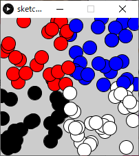

```java
size(200,200);
for( int iEllipseIdx=0; iEllipseIdx < 100; iEllipseIdx++ )
{
  float fX = random(width);
  float fY = random(height);
  if( fX < 100 )  // もしfXの値が100未満なら
  {
    if( fY < 100 )
    {
      fill( 255, 0, 0);      // R
    }
    else
    {
      fill( 0, 0, 0 );       // Black
    }
  }
  else        // そうでなければ
  {
    if( fY < 100 )
    {
      fill( 0, 0, 255);      // B
    }
    else
    {
      fill( 255, 255, 255);  // White
    }
  }
  ellipse( fX, fY, 20, 20 );
}
```


## 演習

1. 100個の円をランダムな位置に描画

```java
size(200,200);
for( int iEllipseIdx=0; iEllipseIdx < 100; iEllipseIdx++ )
{
  float fX = random(width);
  float fY = random(height);
  ellipse( fX, fY, 20, 20 );
}
```


2. 条件分岐を追加．

   - もしXの値が100未満であれば色を赤に設定
   - そうでなければ色を青に設定．

   下の答えを見る前にまずやってみましょう．

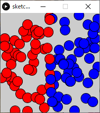

```java
size(200,200);
for( int iEllipseIdx=0; iEllipseIdx < 100; iEllipseIdx++ )
{
  float fX = random(width);
  float fY = random(height);
  if( fX < 100 )	// もしfXの値が100未満なら
  {
    fill( 255, 0, 0);  // R
  }
  else				// そうでなければ
  {
    fill( 0, 0, 255);  // B
  }
  ellipse( fX, fY, 20, 20 );
}
```


##### 演習

1. 100個の円をランダムな位置に描画 (※ウィンドウサイズ300*200)

```java
size(300,200);
for( int iEllipseIdx=0; iEllipseIdx < 100; iEllipseIdx++ )
{
  float fX = random(width);
  float fY = random(height);
  ellipse( fX, fY, 20, 20 );
}
```


2. 条件分岐を追加．

   - もしXの値が100未満であれば色を赤に設定

   - もしXの値が200未満であれば色を緑に設定

   - そうでなければ色を青に設定．

     下の答えを見る前にまずやってみましょう．

```java
size(300,200);
for( int iEllipseIdx=0; iEllipseIdx < 100; iEllipseIdx++ )
{
  float fX = random(width);
  float fY = random(height);
  if( fX < 100 )  		// もしfXの値が100未満なら
  {
    fill( 255, 0, 0);   // R
  }
  else if( fX < 200 )	// もしfXの値が200未満なら
  {
    fill( 0, 255, 0);   // G
  }
  else        			// そうでなければ
  {
    fill( 0, 0, 255);   // B
  }
  ellipse( fX, fY, 20, 20 );
}
```


#### 

### 二次元配列を使った，竹藪のような表現

```java
int iSectionTotal = 40;int iRepeatTotal = 80;float fScaleMin = 0.2;float fScaleMax = 1.4;float fRotateMax = 360; size( 400, 400 );colorMode( HSB, 360, fScaleMax, 1 );background(0, 0, 0.4);stroke(0, 0, 0.2); float[][] fRectColor = new float[3][2];for( int iRectIdx=0; iRectIdx < fRectColor.length; iRectIdx++ ){  fRectColor[iRectIdx][0] = random(360);  //色相  fRectColor[iRectIdx][1] = random( 0.6, 1.0);    //明度 } for( int iRepeatIdx=0; iRepeatIdx < iRepeatTotal; iRepeatIdx++ ){  pushMatrix();    translate( width/2, height/2 );  rotate( radians( random( fRotateMax ) ) );    float fScale =  fScaleMin + ( fScaleMax - fScaleMin ) * iRepeatIdx/iRepeatTotal;  scale( fScale );  translate( random(-width,width/2), random(-height/2,height/2) );    for( int iSectionIdx=0; iSectionIdx < iSectionTotal; iSectionIdx++ )  {    int iRectColorIdx = iSectionIdx%fRectColor.length;        fill( fRectColor[iRectColorIdx][0], fScale, fRectColor[iRectColorIdx][1]);    rect( 0, 0, 20, 10 );      translate( 20, 0 );  }  popMatrix();}
```

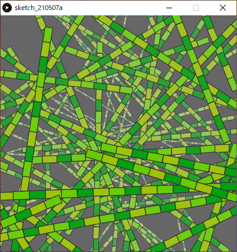

### 二次元配列を使ったパッチの繰り返し

```java
int iRectTotal = 100;  // 矩形の数(１エリア内)int iRectSize = 100;   // 矩形のサイズint iRowTotal = 2;     // 繰り返しの行数int iColumnTotal = 6;  // 繰り返しの列数 size( 600, 200 );colorMode(HSB,iRectTotal,1,1,1); float[][] fEllipsePos = new float[iRectTotal][2]; for( int iEllipseIdx=0; iEllipseIdx < fEllipsePos.length; iEllipseIdx++ ){  fEllipsePos[iEllipseIdx][0] = random(100-iRectSize);  fEllipsePos[iEllipseIdx][1] = random(100-iRectSize);} noStroke(); for( int iRowIdx=0; iRowIdx < iRowTotal; iRowIdx++ ){  pushMatrix();  for( int iColumnIdx=0; iColumnIdx < iColumnTotal; iColumnIdx++ )  {    for( int iEllipseIdx=0; iEllipseIdx < fEllipsePos.length; iEllipseIdx++ )    {      fill(iEllipseIdx,1,1,0.5);      rect( fEllipsePos[iEllipseIdx][0], fEllipsePos[iEllipseIdx][1], iRectSize, iRectSize );    }    translate( 100, 0 );  }  popMatrix();  translate( 0, 100 );}
```

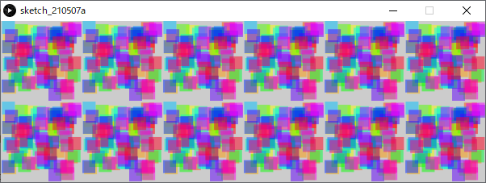


### ランダムな楕円のフェードアニメーション


#### 1. 空の`setup()`と`draw()`を用意

できれば下の答えを見る前にやってみましょう．

```java
void setup(){    }void draw(){    }
```

#### 2. `setup()`に以下の処理を追加

- スクリーンサイズ: 200×200
- カラーモード: `RGB, 1, 1, 1, 100`
- 線(stroke)を表示しない
- フレームレート(fps): 8

できれば下の答えを見る前にやってみましょう．

```java
void setup(){  size( 200, 200 );  colorMode( RGB, 1, 1, 1, 100 );  background( 1, 1, 1 );  noStroke();  frameRate(8); // fps}void draw(){ }
```

#### 3. `draw()`に以下の処理を追加

- 楕円を一つ描画
  - X,Y座標：ランダム（最大X:スクリーン幅, 最大Y:スクリーン高さ）
  - 直径：ランダム(最大100)
  - 塗り色：RGB全てランダム(最大1)


できれば下の答えを見る前にやってみましょう．

```java
void setup(){  size( 200, 200 );  colorMode( RGB, 1, 1, 1, 100 );  background( 1, 1, 1 );  noStroke();  frameRate(8); // fps} void draw(){  fill( random(1), random(1), random(1) );  ellipse( random(width), random(height), random(100), random(100) );}
```

#### 4. スクリーンのリフレッシュ処理を追加

- スクリーン全体と同じサイズの矩形を背景色で描画する．


できれば下の答えを見る前にやってみましょう．

```java
void setup(){  size( 200, 200 );  colorMode( RGB, 1, 1, 1, 100 );  background( 1, 1, 1 );  noStroke();  frameRate(8); // fps} void draw(){  // スクリーンをリフレッシュ  fill( 1, 1, 1 );  rect( 0,0,width,height );    fill( random(1), random(1), random(1) );  ellipse( random(width), random(height), random(100), random(100) );}
```

#### 5. スクリーンリフレッシュのアルファ値を50%に変更

- ステップ4で追加した矩形のアルファ値を50(%)に変更する．

できれば下の答えを見る前にやってみましょう．

```java
void setup(){  size( 200, 200 );  colorMode( RGB, 1, 1, 1, 100 );  background( 1, 1, 1 );  noStroke();  frameRate(8); // fps} void draw(){  // スクリーンをリフレッシュ  // アルファ値:50%で前フレームの描画結果に重ねる．  fill( 1, 1, 1, 50 );  rect( 0,0,width,height );    fill( random(1), random(1), random(1) );  ellipse( random(width), random(height), random(100), random(100) );}
```


### curveによる螺旋描画

```java
int iNodeTotal = 200;	   // ノード(点)総数float fDegPerNode = 20.0;　// 1ノード(点)につき回転する角度int iFPS = 20; int iFrameIdx; void setup(){  size(400, 400);  colorMode(HSB, 1);  frameRate(iFPS);  iFrameIdx = 0;}void draw(){  fill(0, 0, 1);  noStroke();  rect(0, 0, width, height);  // スクリーンリフレッシュ  translate(width/2, height/2);  noFill();  strokeWeight(4);  stroke(0,0,0);  for ( int iNodeIdx=1; iNodeIdx<iNodeTotal; iNodeIdx++)  {     // 4つ分のノード(点)からカーブ生成    curve( getNodeX(iNodeIdx-1), getNodeY(iNodeIdx-1),      	   getNodeX(iNodeIdx),   getNodeY(iNodeIdx),            getNodeX(iNodeIdx+1), getNodeY(iNodeIdx+1),            getNodeX(iNodeIdx+2), getNodeY(iNodeIdx+2));  }  fDegPerNode *= random(0.99,1.01);  // 脈動}// ノード(点)の座標値を取得// 　引数 iNodeIdx:ノード番号float getNodeX( int iNodeIdx ){  float fRadius = (width/1.5)*(iNodeIdx/float(iNodeTotal));  float fDegree = iNodeIdx*fDegPerNode;  return fRadius*cos(radians(fDegree));}float getNodeY( int iNodeIdx ){  float fRadius = (width/1.5)*(iNodeIdx/float(iNodeTotal));  float fDegree = iNodeIdx*fDegPerNode;  return fRadius*sin(radians(fDegree));}
```


### 円周上に花を描画する

```java
/** 円周上に花を描画する*/ int iDegInterval = 40;    int iGroupDistance = 100; void setup(){  size(400,400);  colorMode(HSB, 8, 1, 1, 8);  background(0,0,1);    translate( width/2, height/2 );    // 9個花を描画.  for( int iRotateDeg = 0; iRotateDeg < 360; iRotateDeg+=iDegInterval )  {    pushMatrix();// 画面の中央の原点を保存        translate( iGroupDistance, 0 );  // 中心から原点移動    for( int iEllipseGroupIdx = 0; iEllipseGroupIdx < 4; iEllipseGroupIdx++ )    {      // 現在の原点を中心に複数花弁を描画      drawPetals( floor(random(8,12)), random(8,20) );    }        popMatrix();// 画面の中央の原点を復活    rotate( radians(iDegInterval) );// 画面の中央中心に回転  }} void draw(){}/** 現在の原点を中心に花弁を描画する  引数    iPetalsTotal: 描画する花弁の数    fDistance:    原点からの距離  返り値： なし*/void drawPetals( int iPetalsTotal, float fDistance ){  pushMatrix();    int iRotDegPerEllipse = 360 / iPetalsTotal;    // 花弁を描画  fill( random(8), 1, 1, 4 );  for( int iEllipseIdx = 0; iEllipseIdx < iPetalsTotal; iEllipseIdx++ )  {    ellipse( fDistance, 0, 20, 10 );    rotate( radians(iRotDegPerEllipse) );  }    popMatrix();}
```


### 惑星クラスによる太陽系の描画

```java
final float SCALE = 1 / 450.0;
 
Planet planetMercury;  // 水星
Planet planetVenus;    // 金星
Planet planetEarth;    // 地球
Planet planetMars;     // 火星
Planet planetJupiter;  // 木星
Planet planetSaturn;   // 土星
Planet planetUranus;   // 天王星
Planet planetNeptune;  // 海王星
 
void setup()
{
  size(1200,500);
  background(20,20,30);

  planetMercury = new Planet( 4879,   0.01,  0,    color(196,194,182), color(50,49,54) );
  planetVenus   = new Planet( 12104,  177,   0,    color(173,111,74),  color(215,169,118) );
  planetEarth   = new Planet( 12742,  23.4,  0,    color(37,39,177),    color(32,91,17) );
  planetMars    = new Planet( 6779,   25.2,  0,    color(202,118,22),  color(147,31,18) );
  planetJupiter = new Planet( 139820, 3.12,  129000, color(201,172,130), color(162,112,41) );
  planetSaturn  = new Planet( 116460, 26.7,  120000,color(201,187,148), color(184,170,141) );
  planetUranus  = new Planet( 50724,  84,    39500,  color(219,212,204), color(190,206,206) );
  planetNeptune = new Planet( 49244,  165,   0,   color(39,50,191),   color(59,175,212) );
  
  translate(width/40,height/10);
  planetMercury.display();
  translate(0,40);
  planetVenus.display();
  translate(0,40);
  planetEarth.display();
  translate(0,40);
  planetMars.display();
  translate(270,100);
  planetJupiter.display();
  translate(430,0);
  planetSaturn.display();
  translate(260,0);
  planetUranus.display();
  translate(140,0);
  planetNeptune.display();
}
class Planet
{
  float m_fDiameter;  // 直径
  float m_fAxialTilt;  // 赤道傾斜角
  float m_fRingRadius; // リングの厚さ(0:無し)
  color m_colorMain;  // 色
  color m_colorSub;
  
  Planet( float fDiameterKm, float fAxialTilt, float fRingRadiusKm, color colorMain, color colorSub )
  {
    m_fDiameter = fDiameterKm * SCALE;
    m_fAxialTilt = fAxialTilt;
    m_fRingRadius = fRingRadiusKm * SCALE;
    m_colorMain = colorMain;
    m_colorSub = colorSub;
  }
  
  void display()
  {
    noStroke();
    
    // 緯度ごとにストライプ状に描画.
    float fLatitudeInterval = 600 / m_fDiameter;
    for( float fLatitude=0; fLatitude <= 180; fLatitude +=1 )
    {
      if( floor(fLatitude)%2==0 )
      {
        fill(m_colorSub);
      }
      else
      {
        fill(m_colorMain);
      }
      arc( 0, 0, m_fDiameter, m_fDiameter, HALF_PI + radians(fLatitude+m_fAxialTilt), TWO_PI+HALF_PI - radians(fLatitude-m_fAxialTilt), CHORD );
    }
    // ランダムに円を乗算
    for( int iDotIdx = 0; iDotIdx < floor(m_fDiameter*2.0); iDotIdx++ )
    {
      float fPointSize = m_fDiameter/20.0;
      float fRadian = radians(random(360));
      float fDistance = random(m_fDiameter/2.0)-fPointSize/2.5;
      strokeWeight(fPointSize);
      stroke(m_colorSub,40);
      point(fDistance*cos(fRadian),fDistance*sin(fRadian));
    }
    
    // リングの描画
    if( m_fRingRadius > 0 )
    {
      stroke(m_colorMain,220);
      strokeWeight(4);
      line(-m_fRingRadius*cos(radians(m_fAxialTilt)),-m_fRingRadius*sin(radians(m_fAxialTilt)),
            m_fRingRadius*cos(radians(m_fAxialTilt)), m_fRingRadius*sin(radians(m_fAxialTilt)));
    }
  }
}
```


## ハノイの塔

以下のルールに従ってすべての円盤を右端の杭に移動させられれば完成．

- 3本の杭と，中央に穴の開いた大きさの異なる複数の円盤から構成される．
- 最初はすべての円盤が左端の杭に小さいものが上になるように順に積み重ねられている．
- 円盤を一回に一枚ずつどれかの杭に移動させることができるが，小さな円盤の上に大きな円盤を乗せることはできない．

```java
int iDiscHeight = 20;                       // ディスクの高さ.
int[] iDiscWidth = { 20, 40, 60, 80, 100 }; // 各ディスクの幅.
int iWaitFrames = 6;                  // アニメーション開始までの待機フレーム数.
int[][] iQueueDiscs = new int[3][5];  // アニメーション用現在のディスクの位置.
int[][] iAnimMove = new int[100][2];  // ハノイの塔の動かす手順(回答).
int iAnimMoveIdx;  // 現在の手順番号.
int iMoveCount;    // 手順の数. 
void setup()
{
  size(600,400); 
  colorMode( HSB, 5, 1, 1 );
  frameRate(1);
  for( int iABC = 0; iABC<iQueueDiscs.length; iABC++ )
  {
    for( int iDepth = 0; iDepth<iQueueDiscs[iABC].length; iDepth++ )
    {
      iQueueDiscs[iABC][iDepth] = 0;
    }
  }
  iQueueDiscs[0][0] = 5;
  iQueueDiscs[0][1] = 4;
  iQueueDiscs[0][2] = 3;
  iQueueDiscs[0][3] = 2;
  iQueueDiscs[0][4] = 1;
  iAnimMoveIdx = 0;
  iMoveCount = 0;    // 事前にハノイの塔の回答手順を計算.
  //   iAnimMove[][]に手順を保存.
  hanoi( 5, 0, 1, 2 );
}
void draw( )
{
  // スクリーンリフレッシュ
  fill(1,0,1);
  noStroke();
  rectMode(CORNER);
  rect(0,0,width,height);
  // ハノイの塔を描画
  //  現在の配列iQueueDiscs[][]を元に描画を行う.
  drawHanoi();
  if( iWaitFrames > 0 )
  {
    // しばらく動かさずに待つ.
    iWaitFrames--;
  }
  else if( iAnimMoveIdx < iMoveCount )// 手順がまだ残っていたら
  {
    // ディスクの移動
    //  実際に配列iQueueDiscs[][]を操作
    moveDisc( iAnimMove[iAnimMoveIdx][0], iAnimMove[iAnimMoveIdx][1] );        // 手順をすすめる.
    iAnimMoveIdx++;
  }
}
/** ハノイの塔再帰呼び出し関数
params      iDiscSizeMove: 動かすディスクサイズ(1~5)
iFrom:         移動元  左:0, 中:1, 右:2
iWork:         中継地
iDest:         目的地
*/
int hanoi( int iDiscSizeMove, int iFrom, int iWork, int iDest )
{
  // ディスクをiFromからiDest経由でiWorkへ移動させる
  if(iDiscSizeMove>=2)
  {
    hanoi(iDiscSizeMove-1, iFrom, iDest, iWork );
  }
  // 手順確定
  //   ディスクをiFromからiDestへ移動させる
  iAnimMove[iMoveCount][0]= iFrom;
  iAnimMove[iMoveCount][1]= iDest;
  iMoveCount++;      // Move n-1 desks from "work" to "dest" via "from".
  // ディスクをiWorkからiFrom経由でiDestへ移動させる
  if(iDiscSizeMove>=2)
  {
    hanoi(iDiscSizeMove-1, iWork, iFrom, iDest);
  }
  return iMoveCount;
}
void drawHanoi()
{
  translate( width/4, height/1.5 );
  rectMode(CENTER);
  for( int iABC = 0; iABC<iQueueDiscs.length; iABC++ )
  {
    stroke(0,0,0);
    strokeWeight(4);
    line( 0, -iDiscHeight*iDiscWidth.length, 0, iDiscHeight/2-2 );
    for( int iDepth = 0; iDepth<iQueueDiscs[iABC].length; iDepth++ )
    {
      int iDiscSize = iQueueDiscs[iABC][iDepth];
      if( iDiscSize > 0 )
      {
        fill(iDiscSize,1,1);
        stroke(0,0,0);
        strokeWeight(2);
        rect( 0, 0-iDepth*iDiscHeight, iDiscWidth[iDiscSize-1], iDiscHeight );
      } 
    } 
    translate(width/4,0);
  }
}
void moveDisc( int iABCfrom, int iABCto )
{
  int iDiscSizeMoved = 0;    // 動かすディスクを取り外す.
  int iDepthFrom = iQueueDiscs[iABCfrom].length-1;
  while( iDepthFrom>=0 )
  {
    if( iQueueDiscs[iABCfrom][iDepthFrom] > 0 )
    {
      iDiscSizeMoved = iQueueDiscs[iABCfrom][iDepthFrom];
      iQueueDiscs[iABCfrom][iDepthFrom] = 0;
      break;
    }
    else
    {
      iDepthFrom--;
    }
  }
  // ディスクを置く
  int iDepthTo = iQueueDiscs[iABCto].length-1;
  while( iDepthTo>=0 )
  {
    if( iQueueDiscs[iABCto][iDepthTo] > 0 )
    {
      break;
    }
    else
    {
      iDepthTo--;
    }
  }
  iQueueDiscs[iABCto][iDepthTo+1] = iDiscSizeMoved;
  for( int iABC = 0; iABC<iQueueDiscs.length; iABC++ )
  {
    for( int iDepth = 0; iDepth<iQueueDiscs[iABC].length; iDepth++ )
    {
      print( iQueueDiscs[iABC][iDepth] + ", ");
    }
    println("");
  }
  println("");
}
```

