# Processingの基本

## 開発環境

### ダウンロード

http://processing.org/

Mac版，Windows版，Linux版などあり

### アプリケーションの実行

#### Mac

「アプリケーション」から実行


##### Windows

Zipファイルを解凍し，フォルダ内の「processing.exe」 を実行


## GUIの見方

### エディタウィンドウ


### プログラムの実行と停止


### メッセージエリア


### コンソール


## Processingのデータ

ファイル形式（拡張子）: **.pde**

- スケッチとも呼ばれる．
- ファイルを保存すると，同名のフォルダが自動で作成され，その中にスケッチが保存される．


- スケッチが格納された同名のフォルダをスケッチブックとも呼ぶ．
- スケッチ(.pde)がフォルダ(スケッチブック)に格納されているファイル構造を壊さないよう注意．  （スケッチブックだけを移動させる等しないこと）


## フォント（エディタ・コンソール）の変更（任意）

- 変更方法：ファイル>設定>エディタとコンソールのフォント

- デフォルトのフォント Source Code Pro は以下のことができない．

  - プログラム及びコメントへの日本語（全角）入力

  - コンソールへの日本語（全角）出力

  - これらを有効にするには，日本語対応のフォントに変更してください．
    （MS ゴシック など）


# プログラミングの基本

## プログラムの作成

- エディタウィンドウにプログラムを記述することでプログラミングを行う．
- プログラムは複数の「**文**」**Statement** から成る．
  - **セミコロン**(;)によって１つの文として区切る．
    下の図のように，それぞれの文の末尾にセミコロンを記述する必要がある．


- １つの文には，基本的には１つのProcessingの命令を記述する．
  - １つの文に複数の命令を記述することもある（後日解説）
- プログラム実行時，基本的には文が**上から下へ，順番に逐次実行**されていく．
  - プログラムの流れの制御は後日解説


## Processingの命令

- Processingには様々な命令が用意されている．

  - 例：線を描く，円を描く，色を変える
  - 公式リファレンス
    - https://processing.org/reference/
- 命令の名前は一つの単語となっており，スペースを含まない．

  - 例：`circle()`, `ellipse()`, `line()`, `point()`
- 2単語が複合した命令は，2単語目の頭文字に大文字が用いられる

  - 例：`rectMode()`, `colorMode()`, `noStroke()`

- 命令の後ろには命令に情報を渡すためのカッコ`()`が付く．

  - 付いていないものは命令ではなく，変数と呼ばれるものである．（後に解説）
  - カッコ`()`の中に**命令に渡す情報**を記述する．
    - 色，位置，大きさ，等
    - 渡せる情報の種類や数は命令によって異なる
  - 命令には複数の情報を渡すことができ，カンマ(,)で区切る
    - 例: `size( 400, 400 );` `fill( 100, 200, 100 );`

- これらの命令は，プログラムにおける**関数**の一種である．（後に解説）

- Processingにあらかじめ用意された命令を入力すると，エディタ上では色が変わる．
  この機能によりタイプミスの確認が容易になる．

  ​	下の図中の`size()`, `rect()` の単語部分の色が変わっていることに注目


## プログラムを書く際の最低限のルール

- 半角英数と数字を用いる（コメントは除く）
- 文末にはセミコロン（;）を入れる（忘れがち！）
- 大文字と小文字の区別があるので注意


## コンソールへの出力

`print()`

- コンソールエリアへ数値や文字列を出力する命令．

- プログラム処理の内容を視覚化し，問題が起こった場合原因を特定しやすくする．
  - 問題を特定し，修正を行うことをデバッグという
  - 詳しくはデバッグのページを参照のこと

- 変数の中の値をトレース（監視）することができる．

#### 書式

文字列はダブルクォーテーション「"」で囲むこと

```java
print( "文字列" );
```

```java
print( 値or変数 );
```

```java
print( "文字列" + 値or変数 );  // 文字列と値や変数を+を用いてつなげることも可能
```

##### 改行を含めたい場合

```java
println( 上記と同様のフォーマット );
```

#### 例

##### 文字列をコンソールに表示する

```java
print( "Hello Processing" );
```


##### 数値をコンソールに表示する

```java
println( 123 );
print( 4567 );
```


##### 数値と文字列をつなげて表示する

```java
print( "Answer is " + 12345 );
```


## 演習1

以下の出力を行うプログラムを書いてみましょう．
ただし，数（1,2,3）は文字列ではなく数値としてプログラムに記述すること．（""で囲まない）


## コメント

### コメントとは

- プログラムに影響を与えない影響を与えない文字列のこと
- 技術的には，コンパイル時に無視される部分

#### 書式

```java
//　←以降の１行がコメントとしてプログラムから無視される`
```
```java
/**
挟まれている複数の行が，
プログラムから無視される
*/
```

### 用途

- プログラムを（人が）読みやすくするメモとして用いる．
- プログラムの一部を一時的に実行しないように退避させるために用いる．

### 例

#### 複数命令の内容のメモとして用いる

```
// ウィンドウを分割する
line(0, 50, 100, 50); // yoko
line(50, 0, 50, 100); // tate

// 円を描画する
circle(25, 25, 50);
```


#### プログラムの一部を無効にする

```
/**

// ウィンドウを分割する
line(0, 50, 100, 50); // yoko
line(50, 0, 50, 100); // tate

*/

// 円を描画する
circle(25, 25, 50);
```


### 補足

#### 課題提出においてコメントは重要です

- プログラムの実行に影響を与えないと軽視しがちですが
- <u>コメントが含まれた状態のスケッチを提出</u>してもらい，それも加味して評価を行います．
  - <u>コメントを十分に含んだ分かりやすいスケッチ</u>が高く評価されます．
  - コメントがまったく含まれていない場合，作品がどれほど良質であっても評価が下方修正されます．


## コーディングに便利なキーボードの使い方

- エディタウィンドウでプログラムを記述するにあたり，以下のキーの使い分けを行えると便利です．

- コーディングの効率が上がります．
- できるだけ意識して使ってみましょう

### 文字消去

#### １文字先を消去: Delete

#### １文字前を消去: BackSpace

### カーソル移動

#### 行の先頭: Home

#### 行の末尾: End

#### 前のワードの先頭: Ctrl+←

#### 次の単語の末尾: Ctrl+→

#### ページ送り: PgUp

#### ページ戻り: PgDn

### 選択

#### カーソル位置から前後に選択範囲を延ばす: Shift+←or→

#### カーソル位置から行単位で選択範囲を延ばす: Shift+↑or↓

#### カーソル位置から前後の１単語を選択: Shift+Ctrl+←or→


## 演習2

1. Processing公式のExamplesをどれでもいいので実行してみましょう．

   https://processing.org/examples

- ソースコードをエディタウィンドウへコピー＆ペーストして実行してみましょう．
- 迷ったらColorカテゴリーのものが無難

2. 可能ならプログラムの一部の数値を書き換えて実行し，変化を確かめてみましょう．


# 描画の基本

## 座標系について

- 画面はピクセルというモザイク状の点の集まりによって表現される．

- Processingでは左上を原点（0, 0）とし，右下に向かって座標値が大きくなる．
  - 下図は横680pixel, 縦480pixel の例


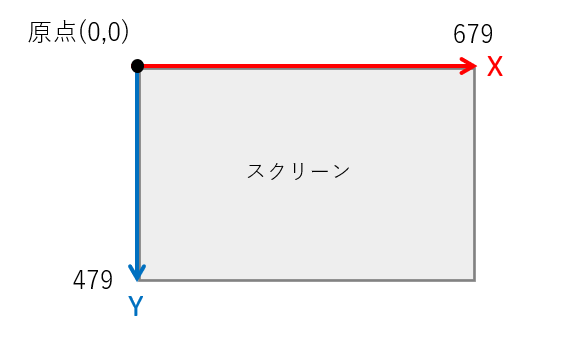


https://processing.org/tutorials/drawing/


## 画面のサイズを決める

`size()`

- 描画領域の大きさを指定する．
- プログラム冒頭に一度記述する．

### 書式

```java
size( 横のピクセル数, 縦のピクセル数 );
```

### 例

```java
size( 600, 200 );	// スクリーンサイズを横600ピクセル×縦200ピクセルに設定
```

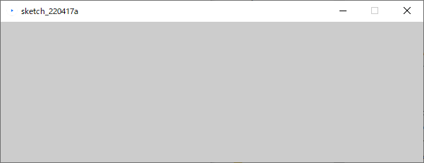

https://processing.org/reference/size_.html


## 画面のサイズを取得する

`width` `height`

- 命令ではなく，変数と呼ばれるもの．
  - カッコ「()」が後ろに付かないことに注意．

- 必ずsize()記述以後に記述する必要がある．
- `size()` 命令以降に，画面サイズの数値の代わりに `width`, `height` を用いることができる．
  - 画面サイズの具体的な数値を繰り返し記述しなくてよい利点がある


### 書式
#### 横のピクセル数
`width`

#### 縦のピクセル数
`height`


### 例1

スクリーンの角から対角までの線を描画する．

```java
size(400,400);

// スクリーン右下へ線を描画する．
line(0, 0, width, height);
```


### 例2

- `width`, `height` を用いることで，スクリーンを元にした大きさの図形描画を行うことができる．
- 下の例では幅，高さともにスクリーンの２分の１の大きさの矩形（四角形）を描画している．

```java
size(600,400);

// 幅: 1/2, 高さ: 1/2 の矩形を描画する.
rect(0, 0, width/2, height/2);
```


https://processing.org/reference/width.html
https://processing.org/reference/height.html


## 点を描画する

`point()`

- １つの点（ドット）を描画する．
- 色の指定が無ければデフォルトカラーのブラック(RGB:0,0,0)の色が描画される．
  - `stroke()` で指定したカラーが適用される．
    - ストローク（線）扱い

### 書式

```java
point( x座標値, y座標値 );
```

### 例

この例では６つの点の描画を行っている．
※ドットなので見えにくいです．

```java
point( 10, 25 );
point( 20, 25 );
point( 30, 25 );

point( 90, 75 );
point( 80, 75 );
point( 70, 75 );
```


https://processing.org/reference/point_.html


## 線を描画する

`line()`

- 始点と終点の２点それぞれのx,y座標値を記述する．
  - 順番は書式を参照のこと
- 色を指定する場合は`stroke()` で指定したカラーが適用される．

### 書式

```java
line( 始点x座標値, 始点y座標値, 終点x座標値, 終点y座標値 );
```

### 例1

始点x,y座標値:（30, 20）から終点x,y座標値: ( 85, 75)に線を描画する．

```java
line(30, 20, 85, 75);
```


### 例2 連続した線

下の例では`line()` を３つ記述することで連続した線の描画を行っている．

```java
stroke(255,0,0);        // R
line( 20, 20, 40, 40 );
stroke(0,255,0);        // G
line( 40, 40, 50, 70 ); // 一つ目の線の終わりの点からスタート
stroke(0,0,255);        // B
line( 50, 70, 80, 80 );	// 二つ目の線の終わりの点からスタート
```


https://processing.org/reference/line_.html

## 線を消去する

`noStroke()`

- 線の描画を行わないようにする．
- 命令に渡す情報は無いので，書式は下記のようになる
  - カッコ「()」の中に何も記述しない．

### 書式

```java
noStroke();
```

### 例

```java
noStroke();
rect(30, 20, 55, 55);
```


https://processing.org/reference/noStroke_.html

## 線の太さを設定する

`strokeWeight()`

- 線の太さをピクセル単位で設定する．

### 書式

```java
strokeWeight( 太さ );
```

### 例

```java
size(400, 400);

strokeWeight(4);   // 細
line(80, 80, 320, 80);

strokeWeight(16);  // 中
line(80, 160, 320, 160);

strokeWeight(40);  // 太
line(80, 280, 320, 280);
```

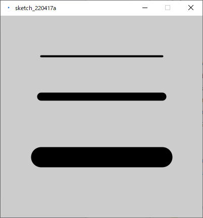

https://processing.org/reference/strokeWeight_.html


## 線の端の形状を設定する

`strokeCap()`

- 線の終端の形状スタイルを変更する．
- ３種類のスタイルを，定数を記述することで切り替えることができる．
  - デフォルトはROUND
  - ※定数：システムに事前に用意されている変更不可能な変数のようなもの

### ROUND

終端を丸くする．

#### 書式

```java
strokeCap(ROUND);
```

#### 例

```java
strokeWeight(12);
strokeCap(ROUND);
line(20, 50, 50, 50);
line(50, 50, 60, 80);
```


### SQUARE

終端を四角形にする．

#### 書式

```java
strokeCap(SQUARE);
```

#### 例

```java
strokeWeight(12);
strokeCap(SQUARE);
line(20, 50, 50, 50);
line(50, 50, 60, 80);
```

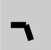

### PROJECT

終端を突き出し形状にする．

#### 書式

```java
strokeCap(PROJECT);
```

#### 例

```java
strokeWeight(12);
strokeCap(PROJECT);
line(20, 50, 50, 50);
line(50, 50, 60, 80);
```


https://processing.org/reference/strokeCap_.html


## 演習1

1. `line()`を複数使用し，画面左端から始まり右端で終わる連続した線を自由に描画してみましょう．
   - 条件
     - スクリーンサイズ: 400, 400
     - 線の数や長さは自由
   - 下図は作成例
     - 8本の線で構成


2. 各線の太さや終端の形状を変化せ，より動きのある画面を作ってみましょう．（余裕がある人向け）
   - 以下は作成例


3. 作成したプログラムは後の演習で再利用するので，分かりやすい場所に保存しておきましょう．

※下に答えの一例がありますが，最初は見ずに自分でやってみましょう．

```java
size( 400, 400 );

strokeCap(PROJECT);
strokeWeight( 4 );
line( 0, 40, 50, 39 );

strokeWeight( 12 );
line( 50, 39, 100, 129 );

strokeWeight( 2 );
line( 100, 129, 150, 12 );

strokeWeight( 6 );
line( 150, 12, 200, 348 );

strokeCap(ROUND);
strokeWeight( 24 );
line( 200, 348, 250, 170 );

strokeCap(PROJECT);
strokeWeight( 18 );
line( 250, 170, 300, 48 );

strokeWeight( 2 );
line( 300, 48, 350, 178 );

strokeWeight( 1 );
line( 350, 178, 400, 189 );
```


## カラーモードの設定

`colorMode()`

- 色を扱うにはまず、プログラムで使用するカラーモードを指定する必要がある．
  - 基本的には**プログラム冒頭で一度だけ**行えばよい．

- カラーモードは図形や線，背景描画命令において，与えられた数値の解釈を変更するもの．
  - つまり，以後の「**色の指定のやり方**」を設定する．
  - 具体的な色の指定は別の命令で行う．
    - `fill()`, `stroke()` 等

- 具体的には以下の指定を行う必要がある．
  - カラーモデル（**RGB**, **HSB** 等）
  - 各チャンネルの最大値，**アルファ**（透明度）の最大値
    - 最大値の指定に迷ったら，255, 100, 1.0, 360(色相) 等のキリのいい値がおススメ．

#### 書式

いずれかを用いる．

##### RGBモードを指定
```java
colorMode(RGB, 最大値);
```
##### RGBモードを指定（各チャンネルの最大値を指定）

```java
colorMode(RGB, Rの最大値, Gの最大値, Bの最大値);
```

##### RGBモードを指定（各チャンネルとアルファの最大値を指定）

```java
colorMode(RGB, Rの最大値, Gの最大値, Bの最大値, アルファの最大値 );
```

##### HSBモードを指定

```java
colorMode(HSB, 最大値);
```
##### HSBモードを指定（各チャンネルの最大値を指定）
```java
colorMode(HSB, 色相の最大値, 彩度の最大値, 輝度の最大値);
```

##### HSBモードを指定（各チャンネルとアルファの最大値を指定）

```java
colorMode(HSB, 色相の最大値, 彩度の最大値, 輝度の最大値, アルファの最大値);
```

#### 例

##### 使用するカラーモデルをRGBに設定，各チャンネルの最大値を100とする．
```java
colorMode( RGB, 100 );
```
##### カラーモデルをHSBに設定し，色相の最大値を360とし，彩度と輝度の最大値を1,0とする．
```java
colorMode( HSB, 360, 1.0, 1.0 );
```

##### 使用するカラーモデルをRGBに設定，各チャンネルの最大値を255, アルファの最大値を100とする．

```java
colorMode( RGB, 255, 255, 255, 100 );
```

#### デフォルトのカラーモード

<u>カラーモードを明示的に指定していない場合</u>は，以下の初期設定が適用されている．

##### 使用するカラーモデルはRGB，最大値は255

```java
colorMode( RGB, 255 );
```


## 線の色を変える

`stroke()`

- 点，線，図形の（枠）線の色の変更を行う．
  - デフォルトはBlack(黒)色
- 図形描画を行う命令の前に記述する必要がある．
  - 直前の行である必要はない．
- もう一度`stroke()`が行われるまで，ここで指定した色が線色として使われ続ける．
  - 色を変更したい場合，別の色を`stroke()`を用いて再度指定する必要がある．

### 書式

```java
stroke( 色の書式 );  // colorMode設定に依存
```

### 例1

色を指定して線を描画する．

```java
// カラーモード; RGB，各チャンネルの最大値255
colorMode( RGB, 255 );

stroke( 250, 162, 20 );	// 線色指定
line(30, 20, 85, 75);		// 線の描画
```


### 例2

色を指定して図形の（枠）線を描画する．

```java
// カラーモード; HSB，色相最大値360, 彩度・明度最大値100
colorMode( RGB, 360, 100, 100 );

stroke( 300, 100, 50 );  // 線色の指定
rect(30, 20, 55, 55);    // 矩形の描画
```


https://processing.org/reference/stroke_.html


## 図形の塗りつぶし色を設定する

`fill()`

- 図形の塗りつぶし色の変更を行う．
  - デフォルトはWhite(白)色
- 図形描画を行う命令の前に記述する必要がある．
- `stroke()`と同じく，再度`fill()`が行われるまで，ここで指定した色が塗り色として使われ続ける．
  - 色を変更したい場合，別の色を`fill()`を用いて再度指定する必要がある．

### 書式

```java
fill( 色の書式 );　// colorMode設定に依存
```

### 例1

RGBモードで指定した例

```java
// カラーモード; RGB，各チャンネルの最大値255
colorMode(RGB, 255);

fill(204, 102, 0);		// 塗り色指定
rect(30, 20, 55, 55);	// 矩形描画
```


### 例2

HSBモードで指定した例

```java
// カラーモード; HSB，色相最大値360, 彩度・明度最大値1.0
colorMode( HSB, 360, 1.0, 1.0 );

fill(80, 0.8, 0.9);		// 塗り色指定
rect(15, 10, 55, 55);	// 矩形描画
```


### 例3

アルファを指定した例

```java
// カラーモード; RGB，各チャンネルの最大値255，アルファ最大値100
colorMode(RGB, 255, 255, 255, 100);

fill(204, 102, 0);			// 塗り色指定
rect(15, 10, 55, 55);	  // 左上の矩形描画

fill(0, 102, 200, 80);  // 塗り色（アルファ80）
rect(30, 20, 55, 55);	  // 右下の矩形描画
```

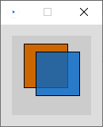

https://processing.org/reference/fill_.html


## 塗りつぶしを消去する

`noFill()`

塗りつぶしを無効にする．

```java
rect(15, 10, 55, 55);

noFill();							// 塗りつぶし無効
rect(30, 20, 55, 55);
```


https://processing.org/reference/noFill_.html


## 色見本

### 色相と彩度のグラデーション

カラーモード指定において，カラーモデルとしてHSBを用いる場合，
色相と彩度の関係は下の図を参考にしてみてもよい．

```java
noStroke();
colorMode(HSB, 100); // カラーモード:HSB, 各値の最大値100
for (int i = 0; i < 100; i++)
{
  for (int j = 0; j < 100; j++)
  {
    stroke(i, j, 100);
    point(i, j);
  }
}
```


### R値とG値のグラデーション

```java
size(400,400);
noStroke();
colorMode(RGB, 400);	// カラーモード:RGB, 各値の最大値400
for (int i = 0; i < 400; i++)
{
  for (int j = 0; j < 400; j++)
  {
    stroke(i, j, 0);
    point(i, j);
  }
}
```


https://processing.org/reference/colorMode_.html


## 背景に色を付ける

`background()`

- 指定した色で**スクリーンの全体の塗りつぶし**描画を行う．
  - 背景として塗りつぶす場合，全ての描画命令の前に行う必要がある．
  - プログラムの最後の方に記述すると，それまで描画したものを塗りつぶしてしまう．
- この命令を使用しない場合の背景のデフォルトカラーはライトグレイ．
- アルファは基本的には使用できない．

### 書式

```java
background( 色の書式 );  // colorMode設定に依存
```

### 例

```java
// カラーモード; RGB，各チャンネルの最大値255，アルファ最大値100
colorMode(RGB, 255, 255, 255, 100);

background(255, 204, 0);  // 背景描画

fill(204, 102, 0);				// 塗り色指定
rect(15, 10, 55, 55);			// 左上の矩形描画

fill(0, 102, 200, 80);		// 塗り色（アルファ80）
rect(30, 20, 55, 55);			// 右下の矩形描画
```


https://processing.org/reference/background_.html

## グレーカラーを設定する

- グレーカラーを使用する場合，よりシンプルな方法がある．
  - 数値を一つだけ色設定命令に渡す．
  - `stroke()`, `fill()`, `background()`で同様に使える．
- `colorMode()`において指定した一つ目の最大値がグレーカラーの最大値として使用される．
  - colorMode(RGB, **100**, 100, 100 );
  - colorMode(HSB, **360**, 100, 100 )

### 書式

```java
stroke(数値);
```

```
fill(数値);
```

```
background(数値);
```

### 例

```java
size(400, 400);
colorMode( RGB, 255 );

background(10);          // 背景色

stroke(250);             // 矩形枠色
fill(153);               // 矩形塗り色

rect(120, 80, 220, 220);
```


## アンチエイリアスをかける

`smooth()`

### 書式

```java
smooth();
```

### アンチエイリアスを解除する

#### 書式

```java
noSmooth();
```

https://processing.org/reference/smooth_.html


## 演習2

前回の演習で作成したプログラムに色を付け，改良しましょう．

- 条件
  - `colorMode()`を用いてカラーモードを設定すること．
    - カラーモデルや各最大値は自由
  - できるだけ線毎に異なる色を設定すること．
  - 背景色も変更しましょう．
  - 以下，参考画像


※下に答えの一例がありますが，最初は見ずに自分でやってみましょう．

```java
size( 400, 400 );

colorMode( HSB, 360, 100, 100, 100 );

background( 60, 10, 100 );

strokeCap(PROJECT);
strokeWeight( 4 );
stroke( 7, 100, 80 );
line( 0, 40, 50, 39 );

strokeWeight( 12 );
stroke( 44, 100, 100 );
line( 50, 39, 100, 129 );

strokeWeight( 2 );
stroke( 202, 100, 60 );
line( 100, 129, 150, 12 );

strokeWeight( 6 );
stroke( 94, 100, 100 );
line( 150, 12, 200, 348 );

strokeCap(ROUND);
strokeWeight( 24 );
stroke( 298, 100, 60 );
line( 200, 348, 250, 170 );

strokeCap(PROJECT);
strokeWeight( 18 );
stroke( 233, 100, 100 );
line( 250, 170, 300, 48 );

strokeWeight( 2 );
stroke( 189, 100, 100 );
line( 300, 48, 350, 178 );

strokeWeight( 1 );
stroke( 237, 100, 100 );
line( 350, 178, 400, 189 );
```


# 図形描画

- 描画の基本において学習したのは，主に描画を実行する前の下準備の方法である．
  ここでは実際の描画を実行する命令について学習する．

- Processingにおいて，実際の描画を行う命令はこの章で述べる図形描画命令である．
  目標とする結果（画像）を達成するため，これらの命令を適切に組み合わせる必要がある．
- クイックスタートとしては，以下の図形を使用してみることを勧める．
  - 矩形描画 `rect()`
  - 楕円描画 `ellipse()`


## 三角形を描画する

`triangle()`

- 三角形を描画する．
- ３つの各頂点のx座標値，y座標値の情報を記述する．
  - 順番は下記の書式参考

### 書式

```java
triangle( 頂点1のx値, 頂点1のy値, 頂点2のx値, 頂点2のy値, 頂点3のx値, 頂点3のy値 );
```

### 例

```java
triangle(30, 75, 58, 20, 86, 75);
```


https://processing.org/reference/triangle_.html


## 矩形を描画する

`rect()`

- 矩形（長方形）を描画する．

- 渡す情報

  - 矩形の左上の頂点のx,y座標値

  - 矩形の幅，高さ

- 以下`rectMode()`の記述が無い場合のデフォルトの書式．


### 書式

```java
rect( 左上x座標, 左上y座標, 矩形の幅, 矩形の高さ );
```


### 例

```java
size(400, 400);

rect( 20, 90, 300, 100 );
```


### 矩形（長方形）の描画方法を指定する

`rectMode()`

- 描画情報の指定方法は4種類あり，`rectMode()`で切り替えることができる．
  自分の実現したいことに適した方法を選ぶとよい．

- 4種類の定数を命令に渡す．
  - `CORNER`, `CORNERS`, `CENTER`, `RADIUS`
- `CORNER`モードを使用する場合は，rectMode()の記述は不要
  - 他のモードから`CORNER`モードへ変更する場合は必要


#### CORNER

- 詳細は前述の項を参照のこと．


- `rectMode()`の記述が無い場合のデフォルトのモード．

##### 書式

```java
rectMode(CORNER);
rect( 左上x座標, 左上y座標, 矩形の幅, 矩形の高さ );
```

#### CORNERS

渡す情報

- 矩形の左上の頂点のx,y座標値
- 矩形の右下の頂点のx,y座標値

##### 書式

```java
rectMode(CORNERS);
rect( 左上x座標, 左上y座標, 右下x座標, 右下y座標 );
```


#### CENTER

渡す情報

- 矩形の中心のx,y座標値
- 矩形の幅，高さ

##### 書式

```java
rectMode(CENTER);
rect( 中心x座標, 中心y座標, 矩形の幅, 矩形の高さ );
```


#### RADIUS

渡す情報

- 矩形の中心のx,y座標値
- 矩形の幅，高さの半分

##### 書式

```java
rectMode(RADIUS);
rect( 中心x座標, 中心y座標, 矩形の幅の半分, 矩形の高さの半分 );
```


### 例1

`CORNER` と`CORNERS` を用いた例

```java
size(400, 400);
rectMode(CORNER);  				// Default rectMode is CORNER
fill(255);  							// Set fill to white
rect(100, 100, 200, 200); // Draw white rect using CORNER mode

rectMode(CORNERS);  			// Set rectMode to CORNERS
fill(100);  							// Set fill to gray
rect(100, 100, 200, 200); // Draw gray rect using CORNERS mode
```


### 例2

`RADIUS` と`CENTER` を用いた例

```java
size(400, 400);
rectMode(RADIUS); 				 // Set rectMode to RADIUS
fill(255);  							 // Set fill to white
rect(200, 200, 120, 120);  // Draw white rect using RADIUS mode

rectMode(CENTER); 				 // Set rectMode to CENTER
fill(100);  							 // Set fill to gray
rect(200, 200, 120, 120);  // Draw gray rect using CENTER mode
```


https://processing.org/reference/rect_.html


## 正方形を描画する

`square()`

- 正方形を描画する
- `rect()`の正方形バージョン
  - 正方形は幅と高さの大きさが同じであるので，大きさとして指定する数値が一つのみ
- `rect()`と同じく`rectMode()`の影響を受ける．
  - モード別の書式は割愛する．
  - `CORNERS`は機能しない
    - `CORNER`と同様の描画を行う？
  

### 書式

```java
square( 左上x座標, 左上y座標, 矩形の一辺の大きさ );
```

### 例

```java
size(400, 400);

square(120, 100, 220);
```


https://processing.org/reference/square_.html


## 四辺形を描画する

`quad()`

- 自由な四辺形を描くことができる．
- 4つの各頂点のx座標値，y座標値の情報を記述する．
  - 順番は下記の書式参考

### 書式

```java
quad( 頂点1のx値, 頂点1のy値, 頂点2のx値, 頂点2のy値, 頂点3のx値, 頂点3のy値, 頂点4のx値, 頂点4のy値 );
```

### 例

```java
quad(38, 31, 86, 20, 69, 63, 30, 76);
```


https://processing.org/reference/quad_.html


## 楕円を描画する

`ellipse()`

- 楕円を描画する．

- 渡す情報

  - 楕円の左上の頂点のx,y座標値

  - 楕円の幅，高さ

- 以下`ellipseMode()`の記述が無い場合のデフォルトの書式．


### 書式

```java
ellipse( 中心x座標, 中心y座標, 楕円の幅, 楕円の高さ );
```


### 例

```java
size(400, 400);

ellipse( 160, 190, 300, 200 );
```


### 楕円の描画方法を指定する

`ellipseMode()`

- 描画情報の指定方法は4種類あり，`ellipseMode()`で切り替えることができる．
  自分の実現したいことに適した方法を選ぶとよい．
  - `rectMode()` とほぼ同様

- 4種類の定数を命令に渡す．
  -  `CENTER`, `RADIUS`, `CORNER`, `CORNERS`
- `CENTER`モードを使用する場合は，`ellipseMode()`の記述は不要
  - 他のモードから`CENTER`モードへ変更する場合は必要

#### CENTER

- 詳細は前述の項を参照のこと．
- `ellipseMode()`の記述が無い場合のデフォルトのモード．

##### 書式

```java
ellipseMode(CENTER);
ellipse( 中心x座標, 中心y座標, 楕円の幅, 楕円の高さ );
```

#### RADIUS

渡す情報

- 楕円の中心のx,y座標値
- 楕円の幅，高さの半分

##### 書式

```java
ellipseMode(RADIUS);
ellipse( 中心x座標, 中心y座標, 楕円の幅の半分, 楕円の高さの半分 );
```


#### CORNER

- 詳細は前述の項を参照のこと．

- `ellipseMode()`の記述が無い場合のデフォルトのモード．


##### 書式

```java
ellipseMode(CORNER);
ellipse( 左上x座標, 左上y座標, 楕円の幅, 楕円の高さ );
```

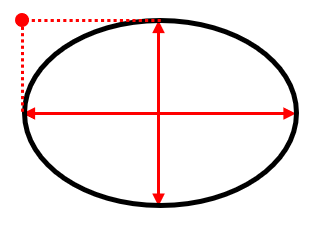

#### CORNERS

渡す情報

- 楕円の左上の頂点のx,y座標値
- 楕円の右下の頂点のx,y座標値

##### 書式

```java
rectMode(CORNERS);
rect( 左上x座標, 左上y座標, 右下x座標, 右下y座標 );
```


### 例1

`CENTER` と`RADIUS` を用いた例

```java
size(400, 400);

ellipseMode(RADIUS);  				// Set ellipseMode to RADIUS
fill(255);  									// Set fill to white
ellipse(200, 200, 120, 120);  // Draw white ellipse using RADIUS mode

ellipseMode(CENTER);  				// Set ellipseMode to CENTER
fill(100);  									// Set fill to gray
ellipse(200, 200, 120, 120);  // Draw gray ellipse using CENTER mode
```


### 例2

`CORNER` と`CORNERS` を用いた例

```java
size(400, 400);

ellipseMode(CORNER);  				// Set ellipseMode is CORNER
fill(255);  									// Set fill to white
ellipse(100, 100, 200, 200);  // Draw white ellipse using CORNER mode

ellipseMode(CORNERS);  				// Set ellipseMode to CORNERS
fill(100);  									// Set fill to gray
ellipse(100, 100, 200, 200);  // Draw gray ellipse using CORNERS mode
```


https://processing.org/reference/ellipse_.html


## 正円を描画する

`circle()`

- 正円を描画する
- `ellipse()`の正円バージョン
  - 正円は幅と高さの大きさが同じであるので，大きさとして指定する数値が一つのみ
- `ellipse()`と同じく`ellipseMode()`の影響を受ける．
  - モード別の書式は割愛する．
  - `CORNERS`は機能しない
    - `CORNER`と同様の描画を行う？


### 書式

```java
circle( 中心x座標, 中心y座標, 円の直径 );
```

### 例

```java
size(400, 400);

circle(224, 184, 220);
```


https://processing.org/reference/circle_.html


## 度（度数法）をラジアン（弧度法）に変換する

`radians()`

- 円弧を描画したり，図形の回転を行う際に必要となる命令．
  - **角度**を指定する必要がある命令に必要．
- Processing で角度を用いるにあたり，おおくは角度をラジアン単位で指定する必要がある．
  - 我々が日常的に親しみのある単位は度数法「°」表記であるが，
    Processingではを**ラジアン（弧度法）単位へ変換**する必要がある．

#### 度⇒ラジアン　単位変換式

簡単な数式で書くと以下のようになる
$$
ラジアン=度 \times \frac{\pi}{180}
$$
この変換を簡単に実現する命令がProcessingには用意されている．
慣れない内はこの変換命令を使うと手っ取り早い．

#### 書式

```java
radians( 度 )
```

このような描画命令ではない**数値の変換のような命令**は，数値の代わりに他の命令へ組み込むことができる．
下の例では`print()`に組み込み，変換後の数値をコンソールに表示している．

#### 例1

45°をラジアンへ変換した値をコンソールに表示する．

```java
print( radians( 45 ) );
```


#### 例2

180°をラジアンへ変換した値をコンソールに表示する．

```java
print( radians( 180 ) );
```


https://processing.org/reference/radians_.html


## 円弧を描画する

`arc()`

- 以下の３種類の定数を使うことで，異なる円弧を描画できる．
  - `OPEN`, `CHORD`, `PIE`

### オープンな弧を描画する

`OPEN`

- 渡す情報

  - 弧の中心点のx,y座標値

  - 弧の幅，高さ

  - 弧の始まりと終わりの角度（ラジアン）

  - 定数 `OPEN`

#### 書式

角度の単位がラジアンだと以下のように記述する．

```java
arc( 中心のx座標, 中心のy座標, 横の直径, 縦の直径, 弧の始まりの角度rad, 弧の終わりの角度rad, OPEN );
```

角度をラジアンへ変換する命令を含めると以下のようになる

```java
arc( 中心のx座標, 中心のy座標, 横の直径, 縦の直径, radians( 弧の始まりの角度 ), radians( 弧の終わりの角度 ), OPEN );
```


#### 例

0°から始まり，225°で終わるオープンな弧

```java
arc(50, 50, 80, 80, radians( 0 ), radians( 225 ), OPEN);
```

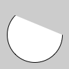

### 閉じた弧を描画する

`CHORD`

- 弧上の始まりと終わりの点が弦のように線で結ばれる．

- 渡す情報
  - 定数以外は `OPEN`の場合と同様．

  - 定数 `CHORD`


#### 書式

角度の単位がラジアンだと以下のように記述する．

```java
arc( 中心のx座標, 中心のy座標, 横の直径, 縦の直径, 弧の始まりの角度rad, 弧の終わりの角度rad, CHORD );
```

角度をラジアンへ変換する命令を含めると以下のようになる

```java
arc( 中心のx座標, 中心のy座標, 横の直径, 縦の直径, radians( 弧の始まりの角度 ), radians( 弧の終わりの角度 ), CHORD );
```

#### 例

0°から始まり，225°で終わる閉じた弧

```java
arc(50, 50, 80, 80, radians( 0 ), radians( 225 ), CHORD);
```

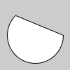

### パイ状の弧を描画する

`PIE`

- 弧の中心から弧上の始まりと終わりのそれぞれの点へ線が結ばれる．

- 渡す情報
  - 定数以外は `OPEN`の場合と同様．

  - 定数 `PIE`

#### 書式

角度の単位がラジアンだと以下のように記述する．

```java
arc( 中心のx座標, 中心のy座標, 横の直径, 縦の直径, 弧の始まりの角度rad, 弧の終わりの角度rad, PIE );
```

角度をラジアンへ変換する命令を含めると以下のようになる

```java
arc( 中心のx座標, 中心のy座標, 横の直径, 縦の直径, radians( 弧の始まりの角度 ), radians( 弧の終わりの角度 ), PIE );
```

#### 例

0°から始まり，225°で終わるパイ状の弧

```java
arc(50, 50, 80, 80, radians( 0 ), radians( 225 ), PIE);
```


https://processing.org/reference/arc_.html


### 例

#### 円弧を用いた月の満ち欠けのような表現

```java
size( 400, 200 );
arc( 50, 100, 80, 80, radians(120), radians(420), CHORD );
arc( 50+100, 100, 80, 80, radians(135), radians(405), CHORD );
arc( 50+200, 100, 80, 80, radians(175), radians(365), CHORD );
arc( 50+300, 100, 80, 80, radians(190), radians(350), CHORD );
```


## 曲線を描画する

`curve()`

4点を結ぶ曲線の中間2点間が描画される．（スプライン曲線）

- 実際に描画されるのは描画点2点間のみ
- spline たわみ
  - 4点で囲まれた領域を丸く膨らませた曲線が生成される


### 用途

特定のある<u>囲まれた領域を丸く膨らませた図形</u>を生成したいとき

### 書式

```java
curve( 制御点1のx値, 制御点1のy値,
       描画点1のx値, 描画点1のy値,
       描画点2のx値, 描画点2のy値,
       制御点2のx値, 制御点2のy値 );
```

### 例

4点とを曲線で囲まれた領域

```java
size( 600, 600 );
background(255);

noFill();

// 濃い黒の曲線
stroke(0);
strokeWeight(4);
curve( 100, 100, 450, 200, 500, 350, 60, 500 );

// 薄い曲線
stroke(200);
strokeWeight(4);
curve( 450, 200, 500, 350, 60, 500, 100, 100 );
curve( 500, 350, 60, 500, 100, 100, 450, 200 );
curve( 60, 500, 100, 100, 450, 200, 500, 350 );

// 4つの点を赤く描画．
stroke(255,0,0);
strokeWeight(12);
point(100, 100);
point(450, 200);
point(500, 350);
point(60, 500);
```


https://processing.org/reference/curve_.html


## ベジェ曲線を描画する

`bezier()`

描画点（アンカーポイント）2点と制御点（スムーズポイント）2点から描画される曲線．

- 実際に描画されるのは描画点2点間のみ
- 制御点1から描画点1へ引いた直線が曲線に接する．
  制御点2から描画点2へ引いた直線が曲線に接する．
  - 以上の条件を満たす曲線が生成される．
  - これらの直線はIllustratorでいうハンドル
- Adobe Illustrator のパスとほぼ同様
  - アンカーポイント
  - スムーズポイント，コーナーポイント
  - ハンドル


### 書式

`curve()`の場合と描画点，制御点の記述順が異なることに注意．

```java
bezier( 描画点1のx値, 描画点1のy値,
        制御点1のx座標, 制御点1のy座標,
       	制御点2のx値, 制御点2のy値,
        描画点2のx座標, 描画点2のy座標 );
```

### 例

```java
size( 600, 600 );
background(255);

noFill();

// 薄い直線（ハンドル）
stroke(200);
strokeWeight(4);
line( 100, 100, 450, 200 );
line( 500, 350, 60, 500 );

// 濃い黒の曲線
stroke(0);
strokeWeight(4);
bezier( 450, 200, 100, 100, 60, 500, 500, 350 );

// 4つの点を赤く描画．
stroke(255,0,0);
strokeWeight(12);
point(100, 100);
point(450, 200);
point(500, 350);
point(60, 500);
```


https://processing.org/reference/bezier_.html


## 多角形を描画する

多角形描画は複数の文を記述する必要がある．

1. はじめに`beginShape();`と記述．
2. 必要な頂点の数だけ `vertex( x座標, y座標 );` を記述する．
3. 最後に `endShape();` を記述し，多角形描画を終了する．
   ※なお、`endShape(CLOSE);`と記述することで閉じた形状を描画できる．

### 書式

```java
beginShape();							// 形状の開始宣言

// 頂点座標（頂点の数だけ複数記述する必要がある）
vertex( 頂点1のx値, 頂点1のy値 );
vertex( 頂点2のx値, 頂点2のy値 );
vertex( 頂点3のx値, 頂点3のy値 );
vertex( 頂点4のx値, 頂点4のy値 );
vertex( 頂点5のx値, 頂点5のy値 );
vertex( 頂点6のx値, 頂点6のy値 );
vertex( 頂点7のx値, 頂点7のy値 );
vertex( 頂点8のx値, 頂点8のy値 );

endShape(CLOSE);					// 形状の終了宣言
```

### 例1

```java
beginShape();
vertex(20, 20);
vertex(40, 20);
vertex(40, 40);
vertex(60, 40);
vertex(60, 60);
vertex(20, 60);
endShape(CLOSE);
```


### 例2

矢印状の図形

複雑な形状は事前に方眼紙等に下書きをし，下図のような計画を立てるとよい．


```java
beginShape();
vertex( 0, 20 );		// A
vertex( 60, 20 );		// B
vertex( 60, 0 );		// C
vertex( 100, 30 );	// D
vertex( 60, 60 );		// E
vertex( 60, 40 );		// F
vertex( 0, 40 );		// G
endShape(CLOSE);
```


https://processing.org/reference/beginShape_.html
https://processing.org/reference/vertex_.html
https://processing.org/reference/endShape_.html


## 演習

図形を一つ自由に描画してみましょう．

条件

- スクリーンサイズ: 400, 400
- 描画する図形は自由
- 少なくとも図形には塗りつぶし色を設定すること．
- 余裕があれば線の色や太さなど，自由に変更してみましょう．
- 下図は多角形を描画した場合の参考図


※下に答えの一例がありますが，最初は見ずに自分でやってみましょう．

```java
size( 400, 400 );

colorMode( RGB, 100, 100, 100 );

background( 89, 60, 60 );

// 色
stroke( 80, 2, 0 );
fill( 10, 9, 49 );

// 線の太さ
strokeWeight( 6 );

beginShape();

vertex( 20, 60 );
vertex( 220, 80 );
vertex( 340, 210 );
vertex( 280, 390 );
vertex( 190, 210 );

endShape(CLOSE);
```


# 座標変換（平行移動，回転，拡大縮小）

- 図形描画を用いてレイアウトを行うにあたり，図形を平行移動，回転，または拡大縮小させると，より表現の幅が広がる．
  このような操作をトランスフォーム( Transform )と呼ぶ．
- Processing においてトランスフォームを実現するには**座標変換**を用いる．

- 座標変換を理解する前に，Processingにおける**座標系**について学習する．

## 座標系( Coordinate system )

- 空間内の特定の位置を点で示す決まりごとのこと．
- 具体的には以下の要素を内包する
  - 原点
  - 単位
  - 各方向軸の向き( X軸, Y軸, Z軸 )
- ＣＧに関連する座標系はアプリケーションによって異なるものが導入されている．
  - 混乱を避けるためできるだけ合わせようという流れはあるが


### Processing の座標系

Processing のようなスクリーン（二次平面）上で図形の操作を行うアプリケーションにおいては，**2次元の座標系**が導入されている．

#### 2次元の座標系

- 描画を行うための基準．
- X軸とY軸が互いに直交し，交わるところに原点がある．

- <u>プログラム開始時点における</u>座標系を，シンプルな矩形を描画するプログラムと共に以下に示す．

```java
rect( 20, 20, 40, 40 );
```

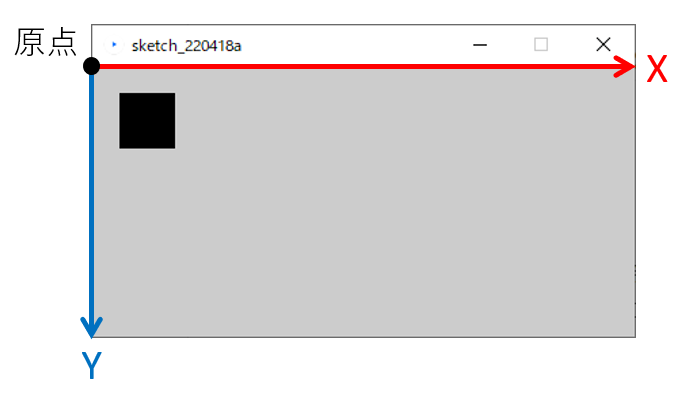


## 座標変換とは

この座標系（X軸,Y軸,原点）を並行移動，回転，拡大縮小することを**座標変換**という．
<u>図形が変換されるのではない</u>ことに注意

### 平行移動

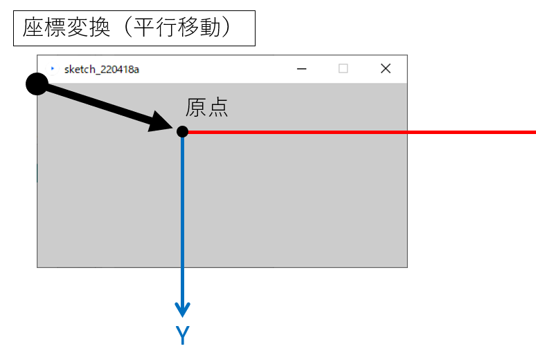

------

### 回転

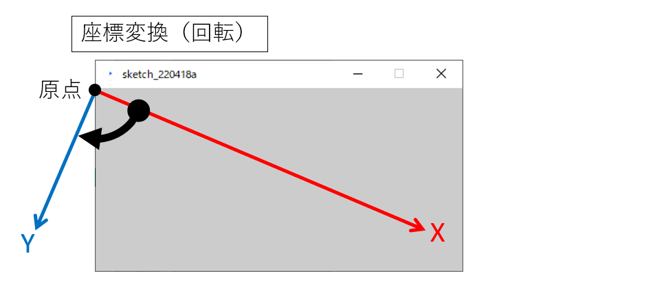

------

### 拡大縮小


### 座標変換後の描画

<u>座標変換を実行した後に</u>図形描画を行うことにより，ウィンドウ上では図形が平行移動，回転または拡大縮小したように描画される．


## 平行移動

`translate()`

- 座標系をX,Y軸のプラス「+」方向へ平行移動させる．
  - マイナス「-」の値を与えると，逆のマイナス方向へ平行移動

- 同様の操作を`translate()`を使わずに行えるが，こちらを使った方が簡単な場合が多い．

### 書式

```java
translate( x移動量, y移動量 );
```

### 仕組み

#### 平行移動を<u>行わず</u>描画を行った場合


#### 平行移動を行った後に描画を行った場合


### 例

#### １つの家の図の描画

```java
size(400, 100);
background(255);

triangle(15, 0, 0, 15, 30, 15);
rect(0, 15, 30, 30);
rect(12, 30, 10, 15);
```


#### 平行移動後による複数の家の図の描画

同じ構造の図形を繰り返し描画する際，よりシンプルにできる．

```java
size(400, 100);
background(255);

// 一つ目
triangle(15, 0, 0, 15, 30, 15);
rect(0, 15, 30, 30);
rect(12, 30, 10, 15);

translate(40, 0); // x軸方向に40移動 

// 二つ目
triangle(15, 0, 0, 15, 30, 15);
rect(0, 15, 30, 30);
rect(12, 30, 10, 15);

translate(40, 0); // x軸方向にさらに40移動

// 三つ目
triangle(15, 0, 0, 15, 30, 15);
rect(0, 15, 30, 30);
rect(12, 30, 10, 15);
```

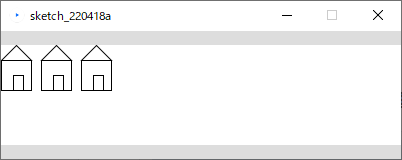

https://processing.org/reference/translate_.html


## 回転

`rotate()`

- 座標を<u>原点を中心に</u>時計回りに回転させる．
  - マイナス「-」の角度を指定すると反時計回りに回転

### 書式

```java
rotate( 角度 );  // 単位：ラジアン
```

ラジアンに慣れていない人はこう書くとよい．

```java
rotate( radians( 角度 ) );  // 度数法をラジアンに変換
```

### 仕組み

#### 回転


#### 描画


### 例1

原点を中心に15°回転させ，矩形描画を行う．

```java
size( 400, 400 );
background( 255 );

fill( 0, 0, 255 );
noStroke();

// 以下，回転と矩形描画の繰り返し．
rotate( radians(5) );
rect( 300, 0, 40, 20 );

rotate( radians(15) );
rect( 300, 0, 40, 20 );

rotate( radians(15) );
rect( 300, 0, 40, 20 );

rotate( radians(15) );
rect( 300, 0, 40, 20 );

rotate( radians(15) );
rect( 300, 0, 40, 20 );

rotate( radians(15) );
rect( 300, 0, 40, 20 );

rotate( radians(15) );
rect( 300, 0, 40, 20 );
```

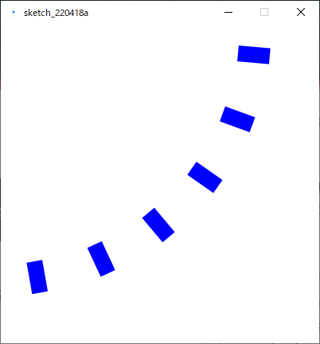


### 例2

<u>スクリーン中央を中心に回転</u>させたい場合

1. スクリーン中心へ平行移動を行う．


2. 座標を回転させる．


3. 図形の描画を行う．
   手順2に戻る．


```java
size( 400, 400 );
background( 255 );

fill( 0, 0, 255 );
noStroke();

// 原点をスクリーン中心へ移動
translate( width/2, height/2 );

// 以下，回転と矩形描画の繰り返し．

rect( 100, 0, 40, 20 );

rotate( radians(45) );
rect( 100, 0, 40, 20 );

rotate( radians(45) );
rect( 100, 0, 40, 20 );

rotate( radians(45) );
rect( 100, 0, 40, 20 );

rotate( radians(45) );
rect( 100, 0, 40, 20 );

rotate( radians(45) );
rect( 100, 0, 40, 20 );

rotate( radians(45) );
rect( 100, 0, 40, 20 );

rotate( radians(45) );
rect( 100, 0, 40, 20 );
```


https://processing.org/reference/rotate_.html


### 例3

時計の針のような描画

```java
size( 300, 300 );

translate( width/2, height/2 );  // 原点をスクリーン中心に移動. 

strokeWeight(1);
line( 0, 0, 100, 0 ); 
rotate( radians(30) );    // 30度回転.

strokeWeight(4);
line( 0, 0, 100, 0 ); 
rotate( radians(50) );    // 50度回転.

strokeWeight(6);
line( 0, 0, 100, 0 ); 
rotate( radians(70) );    // 80度回転.

strokeWeight(8);
line( 0, 0, 100, 0 ); 
rotate( radians(80) );    // 90度回転.

strokeWeight(10);
line( 0, 0, 100, 0 );
```


## 拡大縮小

`scale()`

原点を基点に空間の大きさをスケーリングする．

- 拡大すると原点から外側へ向けて，見た目の座標や大きさが引き延ばされる．
  - 縮小すると原点へ向けて，見た目の座標や大きさが縮められる．
- 命令へ渡す値は`1.0`が等倍である．
  - 例えば`2.0`を渡すと2倍に拡大される．

### 書式

```java
scale( 拡大率 );
scale( x拡大率, y拡大率 );
```

### 仕組み

#### 拡大縮小を<u>行わず</u>描画を行った場合


#### 拡大縮小を行った後に描画を行った場合

下の図では上図と同じ描画命令を行っている．
拡大を行ったことで，以下の変化に注目．

- 図形の大きさだけでなく，２つの図形の間隔も大きくなっている．
- 円が原点から遠ざかる方向へ移動している．


### 例

見た目の大きさはかわっているが，`rect()`に<u>渡している値は同じ</u>であることに注目

```java
size(200,200);
background(255);

stroke(128);
rect(20, 20, 40, 40);		// 小さい矩形

scale(2.0);							// 2倍に拡大

stroke(0);
rect(20, 20, 40, 40);		// 大きな矩形
```

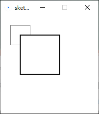


https://processing.org/reference/scale_.html


## 座標系の保存と復帰

- 座標変換の命令を使用すると，変化した座標系はそのまま残り続ける．
  - 目的によってはこのことが不都合となる場合がある．
- Processingにはある時点の座標系を保存したり，保存した時点の座標系に戻したりする機能が存在する．
- 座標系の詳細は数学における行列が深くかかわっているが，本授業では掘り下げない．
- 以下の二つの命令を任意の場所に記述し，使うことができれば問題ない．

### 書式

#### 座標系を保存する

```java
pushMatrix();
```

#### 座標系を保存した時点に戻す

```java
popMatrix();
```

### 使い方

プログラムの処理の順を追って説明する．

1. **`pushMatrix()`**で座標系を保存しておく．
2. 座標変換と各種描画の命令
   - **`translate()`, `rotate()`, `scale()`**
   - 図形描画
3. **`popMatrix()`**で初期の座標系に戻す．

### 例

座標変換を行った後に白の矩形を描画し，
座標系を初期に戻した後に黒の矩形を描画する．

```java
size(500, 500);

pushMatrix(); 									// 座標系の記憶 

translate(250, 250);						// 移動
rotate( radians(30) );					// 回転
scale(2.0);											// 拡大

rect(0, 0, 50, 50);     				// 白の矩形

popMatrix(); 										// 座標系を元に戻す

fill(0);
rect(0, 0, 50, 50);     				// 黒の矩形
```


### 複数の座標系の保存

pushMatrix()とpopMatrix()は，座標系データをQueue形式で出し入れしている．
**複数の**座標系データを保存できる．

#### Queue（キュー）とは

- **先に入れたデータを先に取り出す**．FIFO( First In First Out )
- 追加(**push**)したデータをあたらしい順に取り出す(**pop**)仕組み．

したがって，pushMatrix()とpopMatrix()を入れ子構造で使用すると，新しく保存した座標系から古いものへ，
という順に取り出される．


#### 具体的なプログラム記述

Queueの仕組みがわかると理解しやすい．


### 例

角度と位置を変化させながら楕円を４つ描画する

```java
size( 400, 400 );

colorMode( RGB, 100, 100, 100 );

background( 60, 60, 80 );

// 色
stroke( 80, 62, 70 );
fill( 90, 90, 49 );

// 線の太さ
strokeWeight( 6 );

translate( 100, 60 );

pushMatrix();  // 座標系保存
rotate( radians(20) );
ellipse( 0, 0, 100, 20 );
popMatrix();   // 座標系を戻す

translate( 40, 80 );

pushMatrix();  // 座標系保存
rotate( radians(60) );
ellipse( 0, 0, 100, 20 );
popMatrix();   // 座標系を戻す

translate( 40, 110 );

pushMatrix();  // 座標系保存
rotate( radians(40) );
ellipse( 0, 0, 100, 20 );
popMatrix();   // 座標系を戻す

translate( 80, 80 );

pushMatrix();  // 座標系保存
rotate( radians(4) );
ellipse( 0, 0, 100, 20 );
popMatrix();   // 座標系を戻す
```


https://processing.org/reference/pushMatrix_.html
https://processing.org/reference/popMatrix_.html


## 平行移動と回転の組み合わせ

- 平行移動と回転を組み合わせると難解になる．

- スケッチブックや方眼紙に座標系の変換を**メモ**するなど，工夫してみましょう．

### 平行移動+回転

#### 1. 平行移動


***

#### 2. 回転


***

#### 3. 図形描画


***


### 回転+平行移動

あまり推奨しない

- 初めに回転を行うとその後の平行移動は感覚的に理解し難い．
- できるだけ先の「平行移動→回転」を用いることをすすめる．

#### 1. 回転


***

#### 回転後の平行移動の考え方

- 回転後の平行移動は特に注意
  - **回転後のX,Y軸を元に**移動する．


***

#### 2. 平行移動

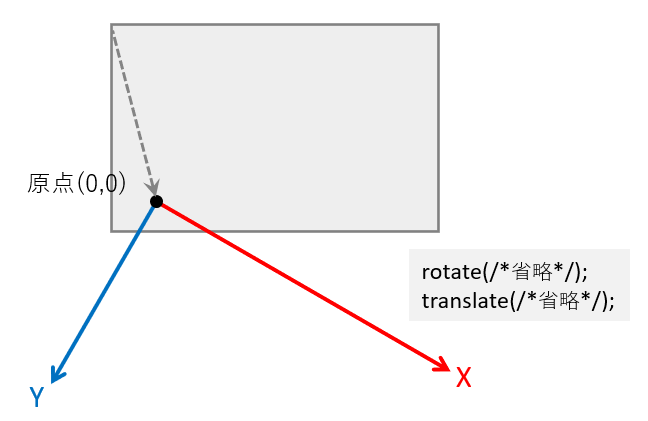

### 例

３つの花のような図の描画

```java
size(400, 400);

pushMatrix();

// 左上の花の座標
translate( 60, 100 );

// 左上花の中央部
fill( 250, 100, 0 );
circle( 0, 0, 60 );

// 左上花弁
fill( 255, 255, 0 );
ellipse( 60, 0, 60, 10 );
rotate( radians(60) );
ellipse( 60, 0, 60, 10 );
rotate( radians(60) );
ellipse( 60, 0, 60, 10 );
rotate( radians(60) );
ellipse( 60, 0, 60, 10 );
rotate( radians(60) );
ellipse( 60, 0, 60, 10 );
rotate( radians(60) );
ellipse( 60, 0, 60, 10 );

// 座標系を戻す
popMatrix();
// 再度現在の座標系を保存
pushMatrix();

// 中央の花の座標
translate( 210, 200 );

// 中央の花の中央部
fill( 255, 20, 0 );
circle( 0, 0, 60 );

// 中央の花の花弁
fill( 245, 245, 0 );
rotate( radians(20) );
ellipse( 60, 0, 60, 10 );
rotate( radians(60) );
ellipse( 60, 0, 60, 10 );
rotate( radians(60) );
ellipse( 60, 0, 60, 10 );
rotate( radians(60) );
ellipse( 60, 0, 60, 10 );
rotate( radians(60) );
ellipse( 60, 0, 60, 10 );
rotate( radians(60) );
ellipse( 60, 0, 60, 10 );

// 座標系を戻す
popMatrix();

// 右下の花の座標
translate( 340, 320 );

// 右下の花の中央部
fill( 195, 180, 0 );
circle( 0, 0, 60 );

// 右下の花の花弁
fill( 255, 255, 0 );
rotate( radians(30) );
ellipse( 60, 0, 60, 10 );
rotate( radians(60) );
ellipse( 60, 0, 60, 10 );
rotate( radians(60) );
ellipse( 60, 0, 60, 10 );
rotate( radians(60) );
ellipse( 60, 0, 60, 10 );
rotate( radians(60) );
ellipse( 60, 0, 60, 10 );
rotate( radians(60) );
ellipse( 60, 0, 60, 10 );
```


## 演習1

図形を平行移動させて複数描画してみましょう．

条件

- スクリーンサイズ 400, 400
- 描画する図形の種類，数，位置や大きさなどは自由
- 余裕があれば
  - 色や線の太さの変更
  - 回転や縮小
- 下図は楕円を使用した場合の作成例


※下に答えの一例がありますが，最初は見ずに自分でやってみましょう．

```java
size( 400, 400 );

colorMode( RGB, 100, 100, 100 );

background( 80, 60, 80 );

// 色
stroke( 70, 62, 80 );
fill( 90, 90, 0 );

// 線の太さ
strokeWeight( 4 );

translate( 60, 160 );
ellipse( 0, 0, 20, 80 );

translate( 60, 60 );
ellipse( 0, 0, 20, 80 );

translate( 60, 100 );
ellipse( 0, 0, 20, 80 );

translate( 60, -220 );
ellipse( 0, 0, 20, 80 );

translate( 60, 100 );
ellipse( 0, 0, 20, 80 );

translate( 60, -30 );
ellipse( 0, 0, 20, 80 );

```


## 演習2

これまで学んだ命令を自由に使い，自由に画像を作成してみましょう．

条件

- 授業時間の間でできるだけ仕上げることを心がけましょう．
- 規模が大きくなってきたらコメントを適度に記述しましょう．
  - エラーが起こっても原因を特定しやすくなります．
- 作ったプログラムファイルは適切な場所に保存しておきましょう．


# 演算と変数

## 文と演算・変数

### 文とは

- Statement ．手続きを表す．

- プログラムは基本的に複数の文から構成される．
- 逐次実行される．(手続き型言語)
- セミコロン「；」 で区切られている部分が一つの文となる．

```java
size(200,200);          // 文
rectMode(CENTER);       // 文
rect(100,10020,100);    // 文
```

- 主に二種存在する．
  - 宣言文 Declarative Statement
    - データの記憶領域をメモリに作る指示
    - 変数に関連する．
  - 命令文 Imperative Statement
    - アルゴリズム（手続き）を指示.
    - これまで記述してきた分はこちら．
    - 通常の命令文の他に以下のようなものがある．
      - 代入文
      - 制御文（今後学習する．）

```java
int a;      						 // 宣言文

a = 20;									 // 命令文（代入文）
ellipse( 0, 0, a, 80 );  // 命令文
```

### 文を構成する要素

- 文を構成する要素を下の表のように分けることができる．
  - 今後学習を進めていく上で，<u>今自分が学んでいることがどこに当たるのか</u>度々振り返るとより理解が容易になる．
- この章では**式**，**演算子**，**変数**について学ぶ．
  - 値は前章まででも用いていたが，今後もより関係してくる．
- 関数は後の章で学ぶ

| 文の例                                                       |  要素  |
| ------------------------------------------------------------ | :----: |
| line( 0, 0, 0, <span style="color: red; ">**a + 1**</span> ); |   式   |
| line( <span style="color: red; ">**0**</span>, <span style="color: red; ">**0**</span>, <span style="color: red; ">**0**</span>, a + <span style="color: red; ">**1**</span> ); |   値   |
| line( 0, 0, 0, <span style="color: red; ">**a**</span> + 1 ); |  変数  |
| line( 0, 0, 0, a <span style="color: red; ">**+**</span> 1 ); | 演算子 |
| <span style="color: red; ">**line(**</span> 0<span style="color: red; ">,</span> 0<span style="color: red; ">,</span> 0<span style="color: red; ">,</span> a + 1 <span style="color: red; ">**)**</span>; |  関数  |
| <span style="color: red; ">**line( 0, 0, 0, a + 1 );**</span> |   文   |

## 何ができるのか

- 今後の学習内容の前提知識としての演算と変数

  - 制御文の記述

  - アニメーション

- 数値計算により造形ができる．

  - 演算，変数までの知識でも一定の表現が行える．
    - **座標**，**大きさ**，**色**といった情報を数値計算により求めることができる．
  - 下図は三角形の組み合わせた図を数値計算によって生成するプログラムの例
    - 各点に事前に番号を割り振り，それぞれの座標値を数値計算で求めておく．
    - 算出した座標値を元に，`triangle()`を使って各三角形を描画する．


```java
size(400,400);

// 各交点の座標値を事前に計算しておく．

int iPoint0X = width/2;
int iPoint0Y = 0;

int iPoint1X = 0;
int iPoint1Y = height;

int iPoint2X = width;
int iPoint2Y = height;

int iPoint3X = width/2;
int iPoint3Y = height;

int iPoint4X = width/4;
int iPoint4Y = height/2;

int iPoint5X = int(width*(3/4.0));
int iPoint5Y = height/2;

// 上の三角形を描画
fill( 255, 0, 0 );
triangle( iPoint0X, iPoint0Y, iPoint4X, iPoint4Y, iPoint5X, iPoint5Y );

// 左の三角形を描画
fill( 0, 255, 0 );
triangle( iPoint4X, iPoint4Y, iPoint1X, iPoint1Y, iPoint3X, iPoint3Y );

// 右の三角形を描画
fill( 0, 0, 255 );
triangle( iPoint5X, iPoint5Y, iPoint3X, iPoint3Y, iPoint2X, iPoint2Y );

// 真ん中の逆三角形を描画
fill( 255, 255, 255 );
triangle( iPoint3X, iPoint3Y, iPoint4X, iPoint4Y, iPoint5X, iPoint5Y );
```


## 演算とは

コンピュータにとっての計算のこと．
以下のような種類がある．

- 算術演算

  - 主に10進数を2つ以上用いて結果を得る．四則演算．
    - 加算：足し算 「+」
    - 減算：引き算 「−」
    - 乗算：掛け算 「×」
    - 除算：割り算 「÷」
- 論理演算

  - 真か偽のどちらか（２進数）を2つ以上用いて結果を得る．結果は真か偽．

  - 後に条件式の要素の一つとして学習する．
- 比較演算
  - 数値を2つ以上用いて結果を得る．結果は真か偽．
  - 後に条件式の要素の一つとして学習する．


演算を<u>プログラム上で表す表現方法が</u>**式**である．

本章では**算術演算**を表現する式について学習する．


## 値

### 値とは

- Value．数値のこと．
- 数学的には複雑だが，本授業では以下の二種類を抑えておく．
  - 変数の学習において重要になる．
- 整数
  - -1,  -2,  0,  1,  2 ... といった数．
  - 小数を含まない．
  - 負（−）の数を含む．
- 実数
  - -1.23,  0.12,   2.13 といった数．
  - 整数に小数を含めたもの．

### プログラムにおける記述方法

#### 整数

- 負の値を表現する際はハイフン「`-`」を先頭に記述する．

`-12`

`-213`

`1234`

`2134567`

#### 実数

- 小数点としてドット「.」を記述する．
- 小数の桁数は任意の長さにできる．

`-12.3`

`-213.45`

`1234.567`

`2134567.89`


## 式

### 式とは

- Expression
- コンピュータにとっての「計算」を表す表現．
- 文と違い，**値**（答え）をもつ．
- 式は基本的には文の中の要素の一つ．
  - 式だけでは文として成り立たず，プログラムが実行できない．

- 主に以下の要素から構成される．
  - 値
  - 変数
  - 演算子 Operator
  - 関数

## 算術式

### 算術式とは

- 数値を計算する式のこと．
- 計算結果を値として持つ．
- 四則演算が代表的な算術式による演算方法である．

### 四則演算

- 四則演算は算術計算において最も基本的な４つの計算方法．
- 下の数式は算数における四則演算の記述方法．

$$
a + b\\
a - b\\
a \times b\\
a \div b\\
$$

### 演算子

- 算術式において，演算記号（+,−,×,÷）を表現するもの．
- 算術式をプログラムで記述する場合，演算記号（+,−,×,÷）が一部異なることに注意．
  - 以下に演算記号とプログラムにおける演算子の対応表を記載する．

| 算数（演算記号） | プログラム（演算子） | 記号の読み方 | 日本語キーボードにおけるキーの場所の対応 |
| :---------------: | :------------------: | :------------------: | :------------------: |
| +                | `+`                  | プラス               | Shift + 「れ」 |
| −                | `-`                  | ハイフン            | 「ほ」       |
| ×                | `*`                  | アスタリスク            | Shift + 「け」 |
| ÷                | `/`                  | スラッシュ             | 「め」          |

### 四則演算を表す式

- 演算子と数値を組み合わせることで（算術）式を記述できる．
- 以下に計算の種類と式の記述方法の対応表を記載する．
  - 算数の式と違い，「=」を記述しないことに注意．

| 計算   | 種類 | 式      |
| ------ | ---- | ------- |
| 足し算 | 加算 | `a + b` |
| 引き算 | 減算 | `a - b` |
| かけ算 | 乗算 | `a * b` |
| 割り算 | 除算 | `a / b` |

### **四則**混合

- 四則演算が混じった計算のこと．

$$
( a + b ) - c \times d \div e
$$

- プログラムにおける算術式においても，もちろん表現できる．

  - 上記の数式を算術式で表現すると以下のようになる．

    ```java
    ( a + b ) - c * d / e
    ```

- 算数と同様に，計算する順番が決まっている．

  - 算数と同様の順番である．
  - 具体的な順番については，後の「算術演算子の優先順位」で説明する．

### 算術式の文への組み込み

左記に述べたように，式はそれだけでは機能しない．
文へ組み込む必要がある．

#### 主な組み込み方

- 式はこれまで具体的な値（数値）を記述していた場所に，値の代わりに記述することができる．
  - 式は計算結果を値としてもつ．
- 以下，文へ組み込む具体的な例を記載する．

#### 例1

`print()`で，計算の答えをコンソールへ表示する．

```java
print("answer=");
println( (5+4-2)*6/3 );
```


#### 例2

- `rect()`で，サイズの倍率が異なる矩形を複数描画する．
- 倍率を指定する数値として小数を使っている．

```java
size(200,200);

rect( 0, 0, 180, 180 );
rect( 0, 0, 180*0.9, 180*0.9 );
rect( 0, 0, 180*0.8, 180*0.8 );
rect( 0, 0, 180*0.6, 180*0.6 );
rect( 0, 0, 180*0.4, 180*0.4 );
```


### 除算（割り算）の注意点

- 除算において，割る数のことを**除数**という．

- 小数を含む値を求めたい場合，**除数（割る数）に小数点「．」を記述**する必要がある．
  - つまり，実数で割る必要がある．
  - 小数点を記述すれば値が実数として扱われる．


#### 例1

小数点以下まで算出される記述例．

```java
println( 255 / 200. );
```


- 小数点を記述しない場合，**以下のように小数点以下が切り捨てられる**．

#### 例2

小数点以下が切り捨てられる記述例．

```java
println( 255 / 200 );
```


- 特に四則混合の場合，気を付けなければ計算結果が意図せぬ値になってしまう場合が多い．
- 除算の余りを求める記述方法もある．

### 剰余算

- 「割り算の余り」を求める記述．
- 割り算の余りを剰余という．

#### 式

| 計算           | 種類   | 式      |
| -------------- | ------ | ------- |
| 剰余を取得する | 剰余算 | `a % b` |

#### 演算子

| 算数（演算記号） | プログラム（演算子） | 記号の読み方 | 日本語キーボードにおけるキーの場所の対応 |
| :--------------: | :------------------: | :----------: | :--------------------------------------: |
|        ÷         |         `%`          |  パーセント  |              Shift +「え」               |

#### 例

ある数値が偶数か奇数かをコンソールに表示する．

```java
// 偶数なら0，奇数なら1を表示する
println("EVEN:0, ODD:1");

// 2で割った余りが0か1かで判定できる．
print( 641075319%2 );
```


### 算術演算子の優先順位

- ある一つの四則混合の計算が行われる際，内部の一つ一つの演算が順番に実行されていく．
- この順番は算数の四則計算に準じる．
  - 式の左から逐次実行されるわけではない．
  - 下の表において，優先度の高い演算子から順番に演算が行われる．

| 優先度 | 種類         | 演算子 |
| ------ | ------------ | ------ |
| 高い   | 括弧(カッコ) | `( )`  |
|        | 乗算         | `*`    |
|        | 除算         | `/`    |
|        | 剰余算       | `%`    |
|        | 加算         | `+`    |
| 低     | 減算         | `-`    |

## 演習1

以下の数式と同様の計算を行い，答えとなる値をコンソールに表示するプログラムを作成しましょう．
$$
(1.3 \times (-4.2+5.3) \div 2.5 \times ( -0.2 \times 6 )-2.8)\times3.9
$$

### ヒント

- 数式をそのまま算術式に置き換えればいい．
  - 演算優先度等は特に考える必要はない．
- コンソールに`-13.596961`と表示されれば正解．


## 変数

- 変数とは，数値などのデータを入れて保持しておくための入れ物であり，現実世界の保管箱のようなもの．
  - 値を保存するための名前付きスペース．

- データ構造において，もっともシンプルなもの．
- 1つの変数は1つのデータ（数値）をもつ．
  - データの記憶領域はメモリ上にある．

- 関数や式に組み込むことで，中の値を参照したり書き換えたりすることができる．
- 使う前に，準備（宣言）をする必要がある．

### 変数の要素

変数は以下の要素で構成される，以降それぞれ詳細を説明する．

- 型
  - 変数に入れられる値の種類
    - 整数型，実数型

- 変数名
  - 値を参照する（取り出す）ための名前

- 値
  - 保存されている値


### 型

- データ型とも言う．

- 変数は決められた型を持ち，**入れられるデータの種類が決まっている**．

#### int

- 整数型（ Integer ）
- 値として小数は持てない**整数**の型
  - 1, 2, 10,  23, 1028, 5270 など
- マイナスの数値も持てる
  - -1, -97, -254, -1097, -23819 など
- 最大で2,147,483,647，最小で-2,147,483,648までの値を持てる

#### float

- 実数型（  floating-point numbers ）
- 値として**小数**を持てる型
  - 1.02,  32.890, 403.98, 3109.37 など
- マイナスの数値も持てる
- 最大で3.40282347E+38，最小で-3.40282347E+38 の値を持てる
  - E+38 は「10の38乗」の意味

#### double

- ほとんどfloat型と同じだが，持てる値の範囲が広い
- 最大で1.797693e+308，最小で-1.797693e+308の値を持てる
- その代わり，メモリの使用量が倍となる(64bit)

#### char

- 文字型 Characters
- 1つの文字を持てる
  - q, w, e, r, t, y, 0, 1, 2 など
  - 大文字(日本語)も一応保持可能

### 宣言

- 変数を使うには，まず**宣言文**によって変数の宣言を行う必要がある．

  - 宣言文は命令文と比べ，構造が異なる点に注意．

- 宣言文によって以下の指示を行う．

  - (データ)型の指示

  - 変数名の決定

  - 初期値の代入（オプション）
    - できるだけ行うことを推奨．


#### 書式

宣言のみ．

```java
型 変数名;
```

宣言＋初期値の代入

```java
型 変数名 = 値 or 数式;
```

#### 例1

Aという名前のint型の変数を宣言する．

```java
int A;
```

#### 例2

Bという名前のfloat型の変数を宣言する．

```java
float B;
```

#### 例3

ABCという名前のfloat型の変数を宣言し，初期値を代入する．

```java
float ABC = 123.45;
```

#### 例4

カンマで区切り，複数の変数を宣言できる.

```java
int a, b;
```

#### 例5

初期値として数式（の計算結果）を代入．

```java
int a = 1+1;
```

#### 変数名

- 変数は，変数名によって，その中に入っている値を参照することができる．
- 各変数は変数名により一意に定まる（ユニークである）必要がある．
  - ある程度自由に決められる．


##### 変数名の制限

変数名の１文字目は英字

```java
int   55musabi; 		// 誤
float 2baisoku; 		// 誤
int musabi55;				// 正
float baisoku2;			// 正
```

予約語は変数名として使用できない．

```java
background, beginShape, bezier, bezierVertex, case, colorMode, curve, curveVertex, default, , dist, draw, ellipse, ellipseMode, else, endShape, fill, frameRate, height, if, image, imageMode, keyPressed, keyReleased, line, loadFont, loadImage, loadPixels, min, mouseButton, mouseDraged, mouseMoved, mousePressed など
```

### 代入文

- 変数に格納されている値は，後から上書きすることができる．
  - 上書きすることを代入という．
- 特に宣言時に初期化されていない変数は，代入文によって値を必ず代入すること．
  - 変数に値が入っていない状態はプログラム的によろしくない．

##### 書式

`=`を用いるが，数式における「=」と意味合いが異なる点に注意．

```java
変数名 = 新しい値 or 数式;
```

##### 例

数値型

```java
int a;      // 変数aの宣言
int b = 3;  // 変数bの宣言と値の代入

a = 5;      // 変数aへの値を代入（初期化）

a = b + 2;  // 変数aへ変数bの値を代入（上書き）
```

##### 例

文字型

```java
char c;		// 文字型の変数cの宣言
c = 'A';	// '(シングルクオーテーション)で代入する文字を囲む
```

### 文への組み込み

変数も算術式と同様に値を持つため，文の中に組み込むことができる．

#### 主な組み込み方

- 変数はこれまで具体的な値（数値）を記述していた場所に，値の代わりに記述することができる．
  - 変数は値を格納している．
- 以下，文へ組み込む具体的な例を記載する．

##### 例1

変数を使って図形を等間隔に並べて描画．

```java
size( 200, 200 );

int iCircleSize = 40;  // 円の大きさ
int iSquareSize = 38;  // 正方形の大きさ
int iIntervalY  = 50;  // 間隔

int iStartLeftX  = 20;  // 左の列のスタート位置X
int iStartRightX = 140; // 右の列のスタート位置X
int iStartY = 5;        // スタート位置Y

// 4つの円の描画．
ellipseMode(CORNER);
circle( iStartLeftX, iStartY, iCircleSize );
circle( iStartLeftX, iStartY + iIntervalY,   iCircleSize );
circle( iStartLeftX, iStartY + iIntervalY*2, iCircleSize );
circle( iStartLeftX, iStartY + iIntervalY*3, iCircleSize );

// 4つの正方形の描画．
square( iStartRightX, iStartY, iSquareSize );
square( iStartRightX, iStartY + iIntervalY,   iSquareSize );
square( iStartRightX, iStartY + iIntervalY*2, iSquareSize );
square( iStartRightX, iStartY + iIntervalY*3, iSquareSize );
```


##### 例2

例1に追加．変数を使って色の指定を行う．

```java
size( 200, 200 );

colorMode(HSB,360,1.0,1.0);

float fSaturation = 0.9;  // 彩度
float fBrightness = 0.75; // 輝度

int iCircleSize = 40;  // 円の大きさ
int iSquareSize = 38;  // 正方形の大きさ
int iIntervalY  = 50;  // 間隔

int iStartLeftX  = 20;  // 左の列のスタート位置X
int iStartRightX = 140; // 右の列のスタート位置X
int iStartY = 5;        // スタート位置Y

// 4つの円の描画．
ellipseMode(CORNER);
fill(  120 ,fSaturation, fBrightness );  // 塗り色
circle( iStartLeftX, iStartY, iCircleSize );
circle( iStartLeftX, iStartY + iIntervalY,   iCircleSize );
fill(  320 ,fSaturation, fBrightness );  // 塗り色
circle( iStartLeftX, iStartY + iIntervalY*2, iCircleSize );
circle( iStartLeftX, iStartY + iIntervalY*3, iCircleSize );

// 4つの正方形の描画．
fill(  220 ,fSaturation, fBrightness );  // 塗り色
square( iStartRightX, iStartY, iSquareSize );
square( iStartRightX, iStartY + iIntervalY,   iSquareSize );
fill(  20 ,fSaturation, fBrightness );   // 塗り色
square( iStartRightX, iStartY + iIntervalY*2, iSquareSize );
square( iStartRightX, iStartY + iIntervalY*3, iSquareSize );
```


### widthとheight

`width`

`height`

- 前述のウィンドウサイズを取得するこれらの変数はシステムに事前に用意されており，**システム変数**という．
- 通常の変数と同様に値が格納されており，式に組み込むことができる．
  - ただしシステム変数に値を代入することはできない．
    - 変数より定数に近い．


### 良い変数名をつける

- コメントと同様に，よい変数名をつけることは，分かりやすいプログラムを作成するうえで重要である．
-  企業等でチームでプログラムを行う際には，コーディング規約というものでルールが決められることが多い．
- 本授業のサンプルにおいて採用している変数名の命名規則を紹介する．

#### 複数単語の区切り

- キャメルケース ２つ目以降の単語の頭文字を大文字にする．
  - 本授業のサンプルは変数名にこちらを使っている．

```
hogeData
```

- スネークケース アンダースコアで区切る．
  - 本授業では定数名に使用している．

```
hoge_data
```

#### 頭文字にデータ型の頭文字を小文字で付ける

変数の型を変数名を見ただけで判別できる工夫

```
int   iRadius, iLength;
float fWidth, fHeight;
```

#### （固有）名詞

変数名の最初の方につけるのがよい．

```
Point					// 点
Line					// 線
Rect					// 矩形
Circle				// 円
ellipse				// 楕円
Triangle			// 三角形
Vertex				// 頂点
```

#### 単位・性質

変数名の後ろの方につけるのが好ましい．

```
// よく使われる記述
X             // X座標
Y             // Y座標
Position, Pos // 位置，座標
Width         // 幅
Height        // 高さ
Radius        // 半径
Diameter      // 直径
Degree, Deg   // 角度°
Radian, Rad   // 角度ラジアン
Minute        // 分
Second, Sec   // 秒
Ratio         // 比，率
R,G,B         // RGBカラー
```

#### 計算値による修飾子

変数名の最後につけるのがよい．

```
// よく使われる記述
Total        // 合計
Sum          // 和
Count        // 数え上げた数
Average      // 平均
Max          // 最大
Min          // 最小
Index, Idx   // (特定の)番号
// Number または Num は混乱しがちなので避けることを推奨
```

#### 例

変数によって各部のサイズ・色を変えられる家の描画．
変数名に注目．

```
int iHouseWidth  = 60;  // 家の幅
int iRoofHeight  = 15;  // 屋根の高さ
int iWallHeight  = 30;  // 壁の高さ
int iDoorWidth   = 10;  // 扉の幅
int iDoorHeight  = 15;  // 扉の高さ
int iDoorX       = 40;  // 扉のX座標
float fRoofR = 1.0;     // 屋根のRGB
float fRoofG = 0.1;
float fRoofB = 0.3;
size(100, 100);
background(255);
colorMode(RGB, 1.0); // 屋根
fill( fRoofR, fRoofG, fRoofB );                // 屋根色
triangle( iHouseWidth/2, 0,                    // 上
          0,             iRoofHeight,          // 左下
          iHouseWidth,   iRoofHeight );        // 右下
// 壁
fill( 1.0 );
rect(0, iRoofHeight, iHouseWidth, iWallHeight); // 扉
fill( 1.0 );
rect(iDoorX, iRoofHeight+iWallHeight-iDoorHeight, iDoorWidth, iDoorHeight);
```


## 演習2

変数を使って円を描画してみましょう．
大まかには，以下のような構造になります．

```
変数Aの宣言文;
変数Bの宣言文;
変数Cの宣言文;

circle( 変数A, 変数B, 変数C );
```

1. ３つの変数の宣言文を記述しましょう．

   - 宣言文中で初期値の代入も行いましょう．

   - 変数名，型，初期値は自由ですが，以下を加味しましょう．

     - 変数Aは円の中心座標のXの値となる．

     - 変数Bは円の中心座標のYの値となる．

     - 変数Cは円の大きさの値となる．

   - 初期値は後で変更可能なので，仮の値でも構いません．

2. 円の描画命令`circle()`に３つの変数を組み込みましょう．

3. 実行し，描画結果を確認しましょう．

4. 円がウィンドウ内に収まるように変数の値を調整しましょう．


## 数学的な計算を行う命令

- 変数や数値を参照する(渡す)ことにより，複雑な計算を行う命令．
  - 計算結果の値をもつ．
- これらの命令も算術式や変数のように文へ組み込む必要がある．

### べき乗の計算を行う命令

`pow()`

- べき乗の計算を行い，計算結果の値を返す命令．

- 指数関数ともいう．

- べき乗とは

  - 基数を指数の回数だけ掛け合わせる計算
$$
    基数：3，指数：5の例\\3 \times 3 \times 3 \times 3 \times 3
$$


#### 書式

```
pow( 基数, 指数 )
```

#### 書式と数式の対応

| 関数名   | 算法     | 書式          | 数式                                        |
| -------- | -------- | ------------- | ------------------------------------------- |
| 指数関数 | べき乗算 | `pow( n, e )` | 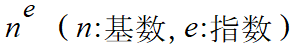 |

##### 例

```java
print( "2の4乗は" );
println( pow( 2, 4 ) );

// コンソール出力：2の4乗は16.0
```

https://processing.org/reference/pow_.html


### 平方根の計算を行う命令

`sqrt()`

- 平方根を求める計算を行い，計算結果の値を返す命令．

- 平方根とは

  - ある数値を正方形の面積とし，それを元に一辺の長さを求める計算．


#### 書式

```
sqrt( 面積とする数値 )
```

#### 書式と数式の対応

| 関数名             | 書式        | 数式                                             |
| ------------------ | ----------- | ------------------------------------------------ |
| 平方根を求める関数 | `sqrt( n )` |  |

##### 例

```java
print( "4の平方根は" );
println( sqrt( 4 ) );

// コンソール出力：4の平方根は2.0
```


https://processing.org/reference/sqrt_.html


### 三角関数

`sin()`

`cos()`

`tan()`

- サイン、コサイン、タンジェントなどの値を求める関数．
- 角度の値から周期的な値を求めることができる．
  - 波，振動
  - 特に `sin()`, `cos()`は必ず -1~1の間の実数を返すので，振幅を利用することで波形のような表現ができる．

#### 書式

```java
sin( 角度のラジアン値 )
cos( 角度のラジアン値 )
tan( 角度のラジアン値 )
```

角度をラジアンへ変換する命令を含めると以下のようになる

```java
sin( radians( 角度 ) )
cos( radians( 角度 ) )
tan( radians( 角度 ) )
```
#### 角度と計算結果の値の関係

| 関数名   | 書式       | 返す値の範囲                                 |                      角度と返す値の関係                      |
| -------- | ---------- | -------------------------------------------- | :----------------------------------------------------------: |
| 正弦関数 | `sin( α )` | `-1～1`の間                                  | 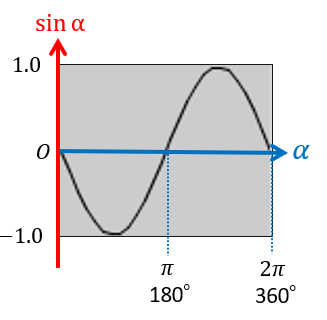 |
| 余弦関数 | `cos( α )` | `-1～1`の間                                  |  |
| 正接関数 | `tan( α )` | `-∞～-∞` 90°等，値が定義できない場合がある． |  |

####　三角関数と三角比

- 三角関数は三角比として使うこともできる．
  - 下図右のような直角三角形の各辺の長さと角度αは下図左のような式で表される．
  - 三角比を利用し，回転角αと距離rからある地点のX座標値とY座標値を算出することができる．


#### 例1

`sin()`を使ったシンプルな波形の描画．
※未修得の繰り返し文を用いています．

```java
size(400, 400);

background(255);
strokeWeight(4);

float fAngle = 0.0;                       // 初期の波の角度
float fAngleInterval = 360 / (400/16.0);  // 一回で進む波の角度

for (int iX = 0; iX < 400; iX +=16)       // 繰り返し文
{
  line( iX, 200, iX, 200 + sin( radians(fAngle) )*160.0 );  // 縦線の描画
  fAngle = fAngle + fAngleInterval;                         // 次の縦線の波の角度を計算
}
```


#### 例2

座標変換を使わず，三角比によって時計の針状の表現を行う．


```java
size( 400, 400 );

float fLength = 200;  // 針の長さ.

// 角度を指定しながら各針を描画.

strokeWeight(1);
line( width/2,      height/2,
      width/2  + fLength*cos( radians(0) ),
      height/2 + fLength*sin( radians(0) ) );
      
strokeWeight(3);
line( width/2,      height/2,
      width/2  + fLength*cos( radians(60) ),
      height/2 + fLength*sin( radians(60) ) );
      
strokeWeight(6);
line( width/2,      height/2,
      width/2  + fLength*cos( radians(145) ),
      height/2 + fLength*sin( radians(145) ) );
      
strokeWeight(9);
line( width/2,      height/2,
      width/2  + fLength*cos( radians(210) ),
      height/2 + fLength*sin( radians(210) ) );

strokeWeight(12);
line( width/2,      height/2,
      width/2  + fLength*cos( radians(280) ),
      height/2 + fLength*sin( radians(280) ) );
```


#### 例3

三角関数とべき乗の計算を使った螺旋状の表現
※未修得の繰り返し文を用いています．

```java
size(400,400); // 円の描画をiPointIdxをインクリメントしながら200回繰り返す.
for(int iPointIdx = 0; iPointIdx < 200; iPointIdx++ )
{
  circle( width/2  + pow( 1.1,iPointIdx*0.2 )*cos( radians(10*iPointIdx) )*10,   // X座標
          height/2 + pow( 1.1,iPointIdx*0.2 )*sin( radians(10*iPointIdx) )*10,   // Y座標
          pow( 1.1,iPointIdx*0.2)*1.7 );                                         // 円の大きさ
}
```


https://processing.org/reference/sin_.html
https://processing.org/reference/cos_.html
https://processing.org/reference/tan_.html


### 絶対値を求める

`abs()`

#### 書式

```java
abs( 絶対値を求める数値 )
```

#### 例

```java
print( abs(-16) );   // コンソールに 16 が表示される．
```

### 小数点以下を切り上げる

`ceil()`

#### 書式

```java
ceil( 数値 )
```

#### 例1

```java
print( ceil(8.22) ); print(iB);
```

#### 例2

**float型の値をint型の値に変換する**ために用いることができる．

```java
float fA = 123.456;   // 実数型の変数fA

int iB = ceil(fA);    // 整数型の変数iBに計算結果を代入．

print(iB);   // コンソールに 124 が表示される．
```

### 小数点以下を切り捨てる

`floor()`

#### 書式

```java
floor( 数値 )
```

#### 例1

```java
print( floor(2.88) );   // コンソールに 2 が表示される．
```

#### 例2

**float型の値をint型の値に変換する**ために用いることができる．

```java
float fA = 123.456;    // 実数型の変数fA

int iB = floor(fA);    // 整数型の変数iBに計算結果を代入．

print(iB);   // コンソールに 123 が表示される．
```

### 小数点以下を四捨五入する

`round()`

#### 書式

```java
round( 数値 )
```

#### 例1

```java
print( round(9.2) );   // コンソールに 9 が表示される．
print( round(9.5) );   // コンソールに 10 が表示される．
print( round(9.9) );   // コンソールに 10 が表示される．
```

**float型の値をint型の値に変換する**ために用いることができる．

#### 例2

```java
float fA = 123.456;    // 実数型の変数fA

int iB = round(fA);    // 整数型の変数iBに計算結果を代入．

print(iB);   // コンソールに 123 が表示される．
```

https://processing.org/reference/abs_.html
https://processing.org/reference/ceil_.html
https://processing.org/reference/floor_.html
https://processing.org/reference/round_.html


## 変数の特殊な操作

- 変数の値は代入文で上書きできることは学習した．


```java
int a = 0;
a = 100;	// 代入文
```

- 代入文以外にも変数の値を操作するやり方があるので説明する．

- プログラミングならではの書き方であるため，最初は違和感があるかもしれないが，後の制御文などで必須．

### インクリメント演算子

 `++`

- 値を**1ずつ増やす**操作に用いる．
- 前置・後置という書式があるが，本授業ではどちらを使っても構わない．

#### 書式

前置

```java
++変数
```

後置

```
変数++
```

これらは，基本的には以下と同じ結果が得られる.

```
変数a = 変数a + 1;
```

#### 例

「変数aに1を足す」記述．

```java
int a = 0;

++a;	// 変数aに1を足す．

a++;	// 変数aにさらに1を足す．
```

### デクリメント演算子

 `--`

値を**1ずつ減らす**操作に用いる．

#### 書式

前置

```java
--変数
```

後置

```
変数--
```

これらは，基本的には以下と同じ結果が得られる.

```
変数a = 変数a - 1;
```

#### 例

「変数aから1を引く」記述．

```java
int a = 100;

--a;	// 変数aから1を引く．

a--;	// 変数aからさらに1を引く．
```

### 代入演算子

- 代入演算子は，右辺の値に基づいて，値を左辺の変数に代入します．

- 通常の代入文を短縮したかのような書き方になります．
  - 変数名の記述回数が減る．

#### `+=`

##### 例


「変数aに2を足す」記述

```java
a += 2;
```

```java
a = a + 2;	// 通常の代入文，こちらと同じ意味
```

#### `-=`

##### 例

「変数aから3を引く」記述

```java
a -= 3;
```

```java
a = a - 3;	// 通常の代入文，こちらと同じ意味
```

#### `*=`

##### 例

「変数aに4をかける」記述

```java
a *= 4;
```

```java
a = a * 4;	// 通常の代入文，こちらと同じ意味
```

#### `/=`

##### 例

「変数aを5で割る」記述

```java
a /= 5;
```

```java
a = a / 5;	// 通常の代入文，こちらと同じ意味
```

https://processing.org/reference/increment.html
https://processing.org/reference/decrement.html
https://processing.org/reference/addassign.html
https://processing.org/reference/subtractassign.html


## 乱数を生成する

`random()`

- 乱数を生成する命令．
  - 乱数とは，ランダムな値のことをいう．
- この命令を実行する度に，新たなランダム値を返す．
- この乱数をうまく組み合わせることで，人間の手作業では「揺れ幅」を表現できる．
  - 効果的に使用するには，後日学習する「繰り返し文」の習得が必要．

### 書式

0~最大値で設定した値の間で，ランダムな値を1つ生成する

```java
random( 最大値 )
```

最小値~最大値で設定した値の間で，ランダムな値を1つ生成する

```java
random( 最小値， 最大値 )
```

### 例1

座標( ランダムX値, 50 )に点を1つ描画する．

```java
point( random(200), 50 );  // X座標を0〜200の間の乱数で決定し，点をうつ
```

### 例2

ランダムな長さの縦線を繰り返し描画する．
※未修得の繰り返し文を用いています．

```java
size(200,200);
for (int iX = 0; iX < width; iX++)  // 以下の処理をiX:0~widthまで繰り返す.
{
  stroke(5);
  line( iX, 0, iX, 0.8*random(height) ); // 黒線を描画する
}
```


### 例3

色をランダムに変化させ描画する．
※未修得の繰り返し文を用いています．

```java
size(400,200);
colorMode(RGB,1.0);
for (int iX = 0; iX < width; iX+=15)  // 以下の処理をiX:0~widthまで15ピクセルおきに繰り返す．
{
  fill( 1.0, 0.3, 0.5, random(1.0) ); // 塗りつぶしのαをランダム.
  rect( iX, 100, 15, 15);
}
```


### 変数への代入する際の注意点

`random()`からは実数（小数有り）が得られるため，変数への代入の際は以下のどちらかの処理を行う．

- **実数**`float`型の変数にランダム値を代入する．
- `floor()`などをつかって小数部を処理し，整数`int`型の変数に代入する．
  - そのままではエラーで代入不可．


##### 例

```java
float fRandom = random( 100 );	// float型の変数fRandomにランダムな値を代入.

int iRandom = random( 100 );		// これだとエラーが出る

iRandom = floor( random(100) );	// int型の変数iRandomにランダムな値を小数点以下を切り捨てて代入する．
```


https://processing.org/reference/random_.html


## 型の変換を行う

- **整数型(int)と実数型(float)の値を同一の式の中に混合するケース**によく使う．
- できればこちらではなく，`floor()`, `ceil()`, `round()`を使うほうが好ましい．
- 慣れないうちはどうしてもエラーが発生したり，意図しない挙動を起こしてしまうので，適切に対処する必要がある．

#### int()

整数型に変換する．
小数点以下は切り捨てられる．

##### 書式

```java
int( 変換するfloat型変数や値 )
```

##### 例

```java
float   fA = 1.234;
int     iA = int(5/fA);	// iAに代入する直前に整数型に変換
```

#### float()

実数型に変換する．

##### 書式

```java
float(  変換するint型変数や値 )
```

##### 例

変換しなかった場合，計算結果の小数点以下が切り捨てられてしまう．

```java
float   fA = 10 / float(width);	// widthはint型のシステム変数なので変換が必要
```

変数でなく，数値の場合以下のような書き方もできる

```java
float   fA = 10 / float(1000);
```

````java
float   fA = 10 / 1000.0;	// 型変換を行わず，このような書き方もできる
````


## 定数

### final

- <u>変数の宣言文の先頭に記述</u>することで，変数ではなく定数を定義できる．
- 定数とは値が変化しない変数のこと．
  - 定数は値の代入はできない．
  - 変化させたくない固定のパラメータなどに用いる．

### 書式

宣言文

```java
final 変数型 定数名 = 初期値;
```

#### 例

- 矩形の大きさの調整用のパラメータなどに用いる例．
- 変数と区別しやすくするため，定数名を大文字のみで記述するなど工夫をすることを推奨．
- ※未修得の配列を使用しています．

```java
final float RECT_WIDTH = 400;					// float型の定数 RECT_WIDTH を定義
final float RECT_HEIGHT = 200;				// float型の定数 RECT_HEIGHT を定義
final int[] COLOR_RGB   = {0,20,100};	// int型の一次元配列 COLOR_RGB を定義
fill( COLOR_RGB[0],COLOR_RGB[1],COLOR_RGB[2] );
rect( 0,0,RECT_WIDTH,RECT_HEIGHT );
```

https://processing.org/reference/final.html

## 演習3

ストライプ模様の描画の改良
以下のサンプルは，ウィンドウ左から右へ縦長の矩形を25個描画するプログラムである．
※繰り返し文を使用

```java
size(500, 500);      // Window Size
colorMode(RGB, 1.0); // RGB(0.0~1.0)
float fR,fG,fB;      // Window RGB

noStroke();

for(int iX=0; iX<width; iX+=20)
{
  /* Example */
  fR = ( sin( radians(iX*2.0) ) + 1 )/2.0;
  fG = ( sin( radians(iX*2.0) ) + 1 )/2.0;
  fB = ( sin( radians(iX*2.0) ) + 1 )/2.0;

  // draw rect
  fill(fR, fG, fB);
  rect(iX,0,20,height);
}
```


1. 矩形の色を決定している部分の右辺の代入文を改良してみましょう．

```java
  /* Example */
	fR = ( sin( radians(iX*2.0) ) + 1 )/2.0;
  fG = ( sin( radians(iX*2.0) ) + 1 )/2.0;
  fB = ( sin( radians(iX*2.0) ) + 1 )/2.0;
```

- 矩形の座標値`iX`を活用する．
- 様々な式や数値を組み合わせる．（すべてを使用する必要はない）
  - 四則演算
  - 三角関数 `sin()`, `cos()`, `tan()`
  - ランダム値 `random()`


# 制御文

## 制御文とは

- プログラムの流れ（フロー）を制御するための特殊な文
  - プログラムは通常上から下へ逐次実行される．
  - 通常の文とは異なる特殊な書式をとる．
- 主に以下の２種類がある．
  - 繰り返し
  - 条件分岐
- プログラムの流れは古くからフローチャート等を用いて図として表される．

## フローチャート(流れ図)

- プログラムの実行（手続き）の流れは，制御することができる．

- これは，以下のようなフローチャートによって図として表すことができる．
  - フローチャートにはプロセスの各ステップを表すパーツが複数種類存在する．
    - 下図中の矩形やひし形等の図形
    - ある程度規格が統一されている．


## 条件式

### 条件式とは

- プログラムの実行の流れを決める重要な要素，'判断'のパーツ．
  

ここで用いられるのが条件式．

- 式(Expression)の一種
- 要素
  - 値，変数
  - 比較演算子，論理演算子
- 計算結果（式が返す値）
  - 真(true)
  - 偽(false)

### 条件式に用いる演算

- 論理演算（ブーリアン演算）

  - 真か偽のどちらか（２進数）を2つ以上用いて結果を得る．

    |  真  |  偽   |
    | :--: | :---: |
    | true | false |
    |  1   |   0   |

    - 論理積 AND
    - 論理和 OR
    - 排他的論理和 XOR
    - 否定 NOT

- 比較演算

  - 厳密には論理演算の一種．

### 条件式（比較演算子）

以下の条件を満たしたとき，式の結果は真(true)となり，
そうでなければ偽(false)となる．

| 条件式   | 演算子 | 条件             |
| -------- | ------ | ---------------- |
| `a < b`  | `<`    | aがbより小さい   |
| `a <= b` | `<=`   | aがb以下         |
| `a > b`  | `>`    | aがbより大きい   |
| `a == b` | `==`   | aとbが等しい     |
| `a != b` | `!=`   | aがbが等しくない |

### 条件式（論理演算子）

基本的には比較演算式による条件式を組み合わせ，より複雑な条件を課す場合に用いる．
以下の条件を満たしたとき，式の結果は真(true)となり，
そうでなければ偽(false)となる．

| 条件式               | 演算子 | 条件                             |
| -------------------- | ------ | -------------------------------- |
| `条件式A && 条件式B` | `&&`   | 条件式Aが真，なおかつ条件式Bが真 |
| `条件式A || 条件式B` | `||`   | 条件式Aが真，もしくは条件式Bが真 |

------


## 繰り返し

### できること

- 大量の図形を描画する

```java
size(400, 400);
for(int iIdx=0; iIdx<400; iIdx++)
{
  circle( random(width), random(height), 20 );
}
```


- 大量のプロパティ(座標，サイズ，色など)を変更する

```java
size(400, 400);
for(int iIdx=0; iIdx<400; iIdx++)
{
  fill( 170 + random(80), 100 + random(50), 200 );
  circle( random(width), random(height), 10 + random(15) );
}
```


### for文

- 英語の前置詞for（〜の間）から由来．
- **指定した/回数**分．処理を繰り返す．
- あらかじめ繰り返す回数が決まっている場合に便利．

#### 書式

```java
for( 繰り返し用変数の宣言・初期化; 繰り返し条件式; 繰り返し用変数の更新式 )	 //セミコロン(；)無し
{
  (命令)文（複数書いてよい）;	// ←ここが繰り返される
  // インデント(字下げ)はエディタが自動で行ってくれる． 手動で行う場合はTabキーを使う．
}
```

#### 処理の流れ

```java
// 点をランダムに100個打つ
for(int iPointIdx=0; iPointIdx<400; iPointIdx++)
{
  point( random(100), random(100) );
}
```


1. 繰り返し用変数の宣言と初期化．

```java
int iPointIdx=0;
```

2. 繰り返し条件式の評価（計算）.

```java
iPointIdx<400	// 変数iPointIdxの値が400未満か
```

	結果が '真' なら，手順3へ.結果が '偽' なら，**繰り返し終了**し，{}の次の行に処理を移す.

3. `{}`内の(命令)文を実行.

```java
point( random(100), random(100) );
```

4.  繰り返し用変数の更新

```java
iPointIdx++		// 変数iPointIdxの値をインクリメント(1を足す)
```

手順2へ戻る.

##### 処理の流れまとめ


#### 星空のような図の描画

前述の点を打つプログラムを加工して星空を描いてみましょう．
ゼロから書くのが難しい場合，以下のサンプルをアレンジしてみましょう．

- 星の数を増やす.
- 色や明るさを変える

```java
size( 400, 400);
background( 0, 10, 20 );  // 背景.
for(int iPointIdx=0; iPointIdx<400; iPointIdx++)
{
  stroke( 255, 255, 255 );
  point( random(400), random(400) );
}
```


### 星空のような図の描画（point()の代わりにcircle()を使用）

```java
// 星空のような図の描画（point()の代わりにcircle()を使用）
size(400, 400);colorMode( HSB, 360, 1.0, 1.0, 1.0 ); // HSBA
background( 220, 0.1, 0.1 );          // 背景色
noStroke();                           // 線無し
for(int iStarIdx=0; iStarIdx<400; iStarIdx++)     // 400回繰り返す.
{
  fill( random(360),          // H
        0.1 + random(0.4),    // S
        1.0,                  // B
        0.2 + random(0.8) );  // A
  circle( random(width), random(height), 1 + random(3) );
}
```


### for中における変数の使用

繰り返し用変数は{}の中でも使うことができる．

```java
// グラデーションの対角線を描画.
colorMode(RGB, 100);
for(int iX=0; iX<100; iX++)
{
  stroke(iX, iX, iX);
  point(iX, iX);
}
```


### for()の様々な書き方

```java
// iXにX座標の0~スクリーン端の座標値を(昇順で)代入しながら繰り返す

for( int iX=0; iX<width; iX++ )
{
  //（命令）文;
}
```
```java
// iYにY座標の0~スクリーン端の座標値を(昇順で)代入しながら繰り返す

for( int iY=0; iY<height; iY++ )
{
  //（命令）文;
}
```

```java
// iXにX座標のスクリーン端~0座標値を(降順で)代入しながら繰り返す

for( int iX=width-1; iX>=0; iX-- )
{
  //（命令）文;
}
```
```java
// iYにY座標のスクリーン端~0の座標値を(降順で)代入しながら繰り返す

for( int iY=height-1; iY>=0; iY-- )
{
  //（命令）文;
}
```

### forのネスティング

- forの中で，さらにforを使うことができる．
- これは何段階でも使用でき，増やすたびに次元が増えるイメージ．
  →2つのforで二次元的な表現に向く

```java
// グラデーションのカラーチャート(矩形)
size(200, 200);
colorMode(HSB, 100);
background(99);
for(int iSatIdx=0; iSatIdx<10; iSatIdx++)        // 彩度(Y軸方向)
{
  for(int iHueIdx=0; iHueIdx<10; iHueIdx++)      // 色相(X軸方向)
  {
    fill( iHueIdx*10, 10+iSatIdx*10, 99 );
    rect( iHueIdx*20, iSatIdx*20, 10, 10 );
  }
}
```


```java
// グラデーションのカラーチャート(ドット)
size(200,200);
noStroke();
colorMode(HSB, 200); // カラーモード:HSB, 各値の最大値200
for ( int iY = 0; iY < height; iY++ )    // 彩度(Y軸方向)
{
  for ( int iX = 0; iX < width; iX++ ) // 色相(X軸方向)
  {
    stroke( iX, iY, 200);
    point( iX, iY);
  }
}
```


### while文

- 英語の接続詞while（〜の間ずっと）から由来．

- 指定した条件満たす限り，処理を繰り返す．
- 何かの数を数え上げる場合などに便利．

#### 書式

```java
while (繰り返し条件式){	繰り返したい命令;}
```

#### 例

```java
size( 400, 200 );
int iCount = 0;
while( 40*iCount < width )  // スクリーン右端まで処理を続ける
{
  rect( 40*iCount, 80, 20, 20 );
  iCount++;  // iCountのインクリメント.
}
print( "描画した矩形の数は" + iCount + "個" );

// コンソール表示：描画した矩形の数は10個
```

**本授業では基本的にforを使うことを推奨**

### 繰り返しによる表現

***

#### 反復

```java
size(400,200);
noStroke();
colorMode( HSB,360, width-40, 1.0 ); 
for( int iX=0; iX<width; iX+=30 )
{
  fill( 180, iX+40, 1 );
  rect( iX,    50,    8, height );  // 矩形:長
  fill( 300, iX+40, 1 );
  rect( iX+10, 50+40, 8, height );  // 矩形:中
  fill( 60,  iX+40, 1 );
  rect( iX+20, 50+80, 8, height );  // 矩形:短
}
```


***

#### 振動

```java
int iAmplitudeL = 80;  // 振幅（大きな波の高さ）
int iAmplitudeS = 40;  // 振幅（小さな波の高さ） 
size( 400,200 );
colorMode( HSB, 360, 1.0, 1.0, 1.0 );

// 大きな波形(cos).
strokeWeight( 8 );
for( int iX=0; iX < width; iX++ )
{
  int iAngle0 = iX*4;
  int iAngle1 = (iX+1)*4;
  stroke( iAngle0%360, 1.0, 1.0 );  // a%b:aをbで割った余り.
  line( iX, height/2 + iAmplitudeL*cos( radians(iAngle0) ),
        iX, height/2 + iAmplitudeL*cos( radians(iAngle1+1) ) );
}

// 小さな波形(sin).
strokeWeight( 8 );
for( int iX=0; iX < width; iX++ )
{
  int iAngle0 = iX*4;
  int iAngle1 = (iX+1)*4;
  stroke( iAngle0%360, 1.0, 1.0, 0.2 );
  line( iX, height/2 + iAmplitudeS*sin( radians(iAngle0) ),
        iX, height/2 + iAmplitudeS*sin( radians(iAngle1+1) ) );
}
```


***

#### 遷移

```java
size(400,200);
noStroke();
colorMode( HSB,width, 1.0, 1.0 );
for( int iX=0; iX<width; iX+=10 )
{
  fill( iX, 1, 1 );
  rect( iX, iX*height/width, 8, height );  // 矩形
}
```


***

#### 乱雑さ

```java
size(400,200);
noStroke();
colorMode( HSB, width, height, 1.0 );
for( int iX=0; iX<width; iX+=10 )
{
  float fY = 20 + random(height-20);  // Y座標値を表す変数．
  fill( iX, height-fY+20, 1 );
  rect( iX, fY, 8, height );  // 矩形
}
```


***

#### モアレ

```java
size(400,200);
background(0, 0, 0);
noStroke();
colorMode( HSB, width, height, 1.0 );
for( int iY=3; iY<height; iY+=12 )
{
  for( int iX=3; iX<width; iX+=12 )
  {
    fill( iX, height, 1 );
    circle( iX, iY, 6 );  // 円
  }
}

pushMatrix();  // 念のため移動する前の座標系を記憶. 
translate( width/3, -height/2 );  // 座標系を平行移動
rotate( radians(45) );            // 座標系を45度回転 

for( int iY=3; iY<height; iY+=12 )
{
  for( int iX=3; iX<width; iX+=12 )
  {
    fill( iX, height, 1 );
    circle( iX, iY, 6 );  // 円
  }
}

popMatrix();   // 座標系を戻す.
```


***

#### 回転対称

```java
int iDiamondTotal = 9;  // ひし形の数.
int iRotDeg = 40;       // 回転させる角度.
size(400,400);
colorMode( HSB, 3, 1, 1 );

translate( width/2, height/2 );  // 原点座標をスクリーン中心へ移動.

// ひし形の数だけ繰り返す.
for( int iDiamondIdx = 0; iDiamondIdx < iDiamondTotal; iDiamondIdx++ )
{
  fill( iDiamondIdx % 3, 1, 1 );  // 3種類の色相を交互に.
  quad( 0, 0, 100, -15, 200, 0, 100,  15 );            // ひし形の描画.
  rotate( radians(iRotDeg) );  // 座標系の回転.
}
```

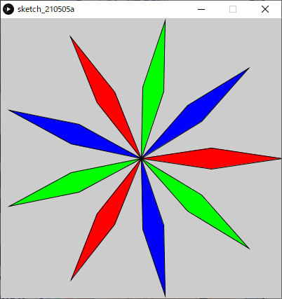

***

#### 並進対称

```java
int iColumnRepeat = 7; // 横に繰り返す回数.
size(400,400);
colorMode( HSB, 10, iColumnRepeat+2, 1 );
noStroke();
translate( -40, 0);  // スクリーンを充填するため，最初に少しずらす．
for( int iRowIdx = 0; iRowIdx < 10; iRowIdx++ )
{
  pushMatrix(); // 原点座標の位置(左端)を記憶.
  // 横にiColumnRepeatセットの三角形ペアを描画.
  for( int iColumnIdx = 0; iColumnIdx < iColumnRepeat; iColumnIdx++ )
  {
    fill( iRowIdx, iColumnIdx+2, 1 );        // 下向きの三角.
    triangle( 0, 0, 80, 0, 40, 40 );
    fill( iRowIdx+1, iColumnIdx+2, 1 );      // 上向きの三角.
    triangle( 40, 40, 80, 0, 120, 40 );
    translate( 80, 0 );  // 右にずらす.
  }
  popMatrix(); // 原点座標を左端に戻す.
  
  translate( 0, 40 );   // 原点座標を一段下げる.
}
```


***

### その他，身近にある「繰り返し」を観察してみましょう


------


## 条件分岐

フローチャートの判断のパーツと同等の処理を行う．
ある条件に基づき，実行する命令を選択し，プログラムの流れを分岐させる．
これを用いることで，現在の状況に応じ，様々なふるまいが表現できる．


### if文

#### if

特定の条件を満たした場合，結果は真(True)となり，特定の（命令）文を実行する．
満たさなかった場合，結果は偽(False)となり，命令は実行されない．
for文と違い，繰り返しは起きない．
条件として，基本的には**条件式**を用いる．


##### 書式

```java
if( 条件式 ) // [条件]
{
  // 条件を満たした場合実行する(命令)文;			[処理]
  // for文の時と同様，インデントする．
}
```

##### 例

if文はもちろんfor文の中に記述することができる．
その場合，さらにインデントを追加する必要がある．

```java
// スクリーンの一定範囲にだけランダムドットを打つ．
size(400,200);
for( int iPointIdx=0; iPointIdx < 3000; iPointIdx++ )
{
  float fX = random( width );  // Xのランダム値.
  float fY = random( height ); // Yのランダム値.
  if( fX + fY < 300 )  // もしX値とY値の合計が300以下なら.
  {
    point( fX,fY );
  }
}
```

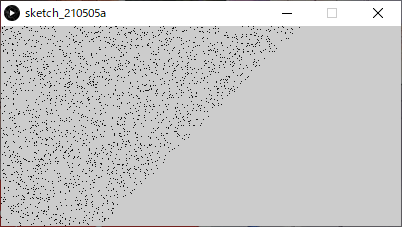

### よく使われる技術

#### 剰余算

※演算と変数/算術式のセクションにも記載済み．
「割り算の余り」を求める記述

```java
a % b	// aをbで割ったときの余り
```

```java
// 偶数と奇数を判別する．
int iA = 234;
if( iA%2 == 0 )	// もし変数iAが偶数だったら．
{
  // 命令
}
```

#### 論理演算子

※制御文/条件式のセクションにも記載済み．
基本的には比較演算式による条件式を組み合わせ，より複雑な条件を課す場合に用いる．
以下の条件を満たしたとき，式の結果は真(true)となり，
そうでなければ偽(false)となる．

| 条件式               | 演算子 | 条件                                   |
| -------------------- | ------ | -------------------------------------- |
| `条件式A && 条件式B` | `&&`   | 条件式Aが真，なおかつ条件式Bが真( and) |
| `条件式A || 条件式B` | `||`   | 条件式Aが真，もしくは条件式Bが真(or)   |


### if else

if文に対し，条件を満たさなかった場合にも特定の処理を行わせる．


##### 書式

`else{}`の部分は必ず`if(){}`とセットで記述すること．

```java
if( 条件 ) // [条件]
{
  // 条件を満たした場合実行する(命令)文; [処理A]
  // for文の時と同様，インデントする．
}
else
{
  // 条件を満たさなかった場合実行する(命令)文;  [処理B]
}
```

##### 例1: ランダムドット日の丸模様

```java
size(400,200);
background( 0, 0, 0 );
translate( width/2, height/2 );  // 原点をスクリーン中心に移動．
for( int iPointIdx=0; iPointIdx < 5000; iPointIdx++ )
{
  float fX = random( -width/2,  width/2 );  // Xのランダム値( -width/2～width/2)
  float fY = random( -height/2, height/2 ); // Yのランダム値( -height/2～height/2)
  
  // (X,Y)座標値が円の内部に有れば.  
  if( pow(fX,2) + pow(fY,2) < pow(height/2,2) )   // 円の公式 Xの二乗 + yの二乗 = 半径の二乗  
  {
    stroke( 255,0, 0 );		// R
  }
  else	// 条件を満たさなかった場合．
  {
    stroke( 255,255, 255 );	// White
  }
  point( fX,fY );
}
```

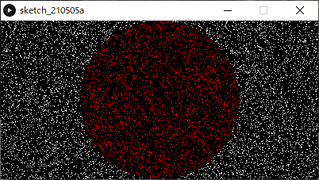

##### 例2: 市松模様

```java
int iCellSize = 40; // セル(四角)のサイズ
size(400,400);
colorMode(RGB,16,16,16);
int iColumnTotal = width/iCellSize;  // 列(横軸)の総数.
int iRowTotal = height/iCellSize;    // 行(横軸)の総数.
noStroke();
for( int iColumnIdx=0; iColumnIdx < iColumnTotal; iColumnIdx++ )  // 列の繰り返し
{
  for( int iRowIdx=0; iRowIdx < iRowTotal; iRowIdx++ ) // 行の繰り返し
  {
    int iX = iColumnIdx*iCellSize; // 矩形の座標iX,iY
    int iY = iRowIdx*iCellSize;
    if( iColumnIdx%2 == 0 && iRowIdx%2 == 0 || // 列番号が偶数かつ行番号が偶数の時，もしくは，
        iColumnIdx%2 == 1 && iRowIdx%2 == 1 )  // 列番号が奇数かつ行番号が奇数の時
    {
      fill(0, 8, 6);      // 緑模様
    }
    else
    {
      fill(0, 0, 0 );     // 黒
    }
    rect( iX, iY, iCellSize, iCellSize );
  }
}
```


##### 演習

1. 100個の円をランダムな位置に描画

```java
size(200,200);
for( int iEllipseIdx=0; iEllipseIdx < 100; iEllipseIdx++ )
{
  float fX = random(width);
  float fY = random(height);
  ellipse( fX, fY, 20, 20 );
}
```


2. 条件分岐を追加．

   - もしXの値が100未満であれば色を赤に設定
   - そうでなければ色を青に設定．

   下の答えを見る前にまずやってみましょう．


```java
size(200,200);
for( int iEllipseIdx=0; iEllipseIdx < 100; iEllipseIdx++ )
{
  float fX = random(width);
  float fY = random(height);
  if( fX < 100 )	// もしfXの値が100未満なら
  {
    fill( 255, 0, 0);  // R
  }
  else				// そうでなければ
  {
    fill( 0, 0, 255);  // B
  }
  ellipse( fX, fY, 20, 20 );
}
```


### else if

最初の条件を満たさなかった場合にも，二つ目以降の条件を課し，それを満たした場合特定の処理を行わせる．
`else␣if`は**複数加えることができ，細かく条件を加えて分岐させることができる**．

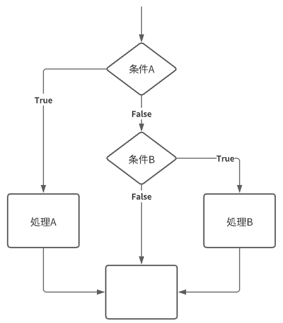

##### 書式

```java
if( 条件式 )	// [条件A]
{
  // 条件Aを満たした場合実行する(命令)文; [処理A]
  // for文の時と同様，インデントする．
}
else if( 条件式 )	// [条件B]
{
  // 条件Bを満たした場合実行する(命令)文; [処理B]
  // for文の時と同様，インデントする．
}
```

### else if else

一見ややこしいが，`else if`の最後に`else{}`を加え，全ての条件を満たさなかった場合にも特定の処理を行わせる方式． 


##### 書式

```java
if( 条件式 )	// [条件A]
{
  // 条件Aを満たした場合実行する(命令)文; [処理A]
  // for文の時と同様，インデントする．
}
else if( 条件式 )	// [条件B]
{
  // 条件Bを満たした場合実行する(命令)文; [処理B]
  // for文の時と同様，インデントする．
}
else
{
  // 条件を満たさなかった場合実行する(命令)文;   [処理C]
}
```

##### 例: ランダムドット4つの領域分け

```java
size(400,200);
for( int iPointIdx=0; iPointIdx < 8000; iPointIdx++ )
{
  float fX = random( width );  // Xのランダム値.
  float fY = random( height ); // Yのランダム値.
  if( fX < 100 )
  {
    stroke( 255,0, 0 ); 	//R
  }
  else if( fX < 200 )
  {
    stroke( 0,255, 0 );  	//G
  }
  else if( fX < 300 )
  {
    stroke( 0,0, 255 );  	//B
  }
  else
  {
    stroke( 255,255, 255 );	//White
  }
  point( fX,fY );
}
```


##### 演習

1. 100個の円をランダムな位置に描画 (※ウィンドウサイズ300*200)

```java
size(300,200);
for( int iEllipseIdx=0; iEllipseIdx < 100; iEllipseIdx++ )
{
  float fX = random(width);
  float fY = random(height);
  ellipse( fX, fY, 20, 20 );
}
```


2. 条件分岐を追加．

   - もしXの値が100未満であれば色を赤に設定

   - もしXの値が200未満であれば色を緑に設定

   - そうでなければ色を青に設定．

     下の答えを見る前にまずやってみましょう．

```java
size(300,200);
for( int iEllipseIdx=0; iEllipseIdx < 100; iEllipseIdx++ )
{
  float fX = random(width);
  float fY = random(height);
  if( fX < 100 )  		// もしfXの値が100未満なら
  {
    fill( 255, 0, 0);   // R
  }
  else if( fX < 200 )	// もしfXの値が200未満なら
  {
    fill( 0, 255, 0);   // G
  }
  else        			// そうでなければ
  {
    fill( 0, 0, 255);   // B
  }
  ellipse( fX, fY, 20, 20 );
}
```


#### ifのネスティング

if文はfor文と同様に，入れ子に（ネスティング）することができる．
`else if` を単純に追加するだけでは難しい処理も，こちらで容易に行える場合がある．

##### 例: if else のネスティング


```java
if( 条件式 )	//   [条件A]
{
  // 条件Aを満たした場合,このブロックへ処理が移る．
  if( 条件式 )	// [条件B]
  {
    // 条件Bを満たした場合，実行する(命令)文;       [処理A]
    // 二段階インデントされる．
  }
  else
  {
    // 条件Bを満たさなかった場合，実行する(命令)文;  [処理B]
  }
}
else
{    // 条件Aを満たさなかった場合,このブロックへ処理が移る．
  if( 条件式 )	// [条件C]
  {
    // 条件Cを満たした場合，実行する(命令)文;       [処理C]
  }
  else
  {
    // 条件Cを満たさなかった場合，実行する(命令)文;  [処理D] 
  }
}
```

##### 例

```java
// ランダムドットを4つの領域で塗り分ける．(縦2×横2)
size(300,300);
for( int iPointIdx=0; iPointIdx < 8000; iPointIdx++ )
{
  float fX = random( width );  // Xのランダム値.
  float fY = random( height ); // Yのランダム値.
  if( fX < width/2 )
  {
    if( fY < height/2 )
    {
      stroke( 255,0, 0 );      //R
    }
    else
    {
      stroke( 0,255, 0 );      //G
    }
  }
  else
  {
    if( fY < height/2 )
    {
      stroke( 0,0, 255 );      //B
    }
    else
    {
      stroke( 255,255, 255 );  //White
    }
  }
  point( fX,fY );
}
```

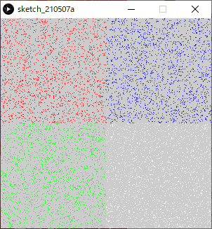

##### 演習

1. 100個の円をランダムな位置に描画 (※if else の演習ステップ1と同じ )

```java
size(200,200);
for( int iEllipseIdx=0; iEllipseIdx < 100; iEllipseIdx++ )
{
  float fX = random(width);
  float fY = random(height);
  ellipse( fX, fY, 20, 20 );
}
```


2. 条件分岐を追加．

   - もしXの値が100未満で，

     - Yの値が100未満なら，色を赤に設定
     - そうでなければ，黒に設定

   - Xの値が100未満ではなく，

     - Yの値が100未満なら色を青に設定
     - そうでなければ白に設定

     下の答えを見る前にまずやってみましょう．


```java
size(200,200);
for( int iEllipseIdx=0; iEllipseIdx < 100; iEllipseIdx++ )
{
  float fX = random(width);
  float fY = random(height);
  if( fX < 100 )  // もしfXの値が100未満なら
  {
    if( fY < 100 )
    {
      fill( 255, 0, 0);      // R
    }
    else
    {
      fill( 0, 0, 0 );       // Black
    }
  }
  else        // そうでなければ
  {
    if( fY < 100 )
    {
      fill( 0, 0, 255);      // B
    }
    else
    {
      fill( 255, 255, 255);  // White
    }
  }
  ellipse( fX, fY, 20, 20 );
}
```


### switch文

Switch文は分岐の判断に**条件式を用いない**．
ある式（変数も可）の返す値を読み取り，その値と等しいラベルの箇所の処理が行われる．
if文の`else if`とほぼ同様の役割を果たすが，こちらのほうがより適している場合もある．

比較的難解であるので，本授業では無理に使う必要はない．
活用できる者は活用してもよい．


#### 書式

ラベル(`case 値;`)は`else if`とほぼ同様の役割を果たし，複数記述可能．
`default:`は`else`とほぼ同様の役割を果たし，記述は任意．

```java
switch( 式 )	//	[式]
{
  case 値A:	// [ラベルA]
    // 式の値が値Aと等しい場合，実行する(命令)文; [処理A]
    // 二段階インデントされる．
    break;	// break; が有れば，即Switch文の処理を終了し，ブロックの外へ処理を移す．
    // ※break; が無ければ，続けて下のラベルB内の処理へと進む．
  case 値B:	// [ラベルB]
    // 式の値が値Bと等しい場合，実行する(命令)文; [処理B]
    break; // break;の記述は任意.
  default: // 式の値が全てのラベルの値と等しくなかった場合，実行する(命令)文; [処理C]
}
```

#### 例

```java
// 4色が交互に出現するストライプの描画．
int iLineWeight = 8;  // 一本の縦線の太さ.
size(400,200);
strokeWeight( iLineWeight );
for( int iLineIdx=0; iLineIdx < 50; iLineIdx++ )  // 50本の線を繰り返し描画.
{
  int iModLineIdx4 = iLineIdx%4;                  // iLineIdxを4で割った余り(剰余)(0~3)
  switch( iModLineIdx4 )
  {
    case 0:
      stroke( 255, 0, 0 );      // R
      break;
    case 1:
      stroke( 0, 255, 0 );      // G
      break;
    case 2:
      stroke( 0, 0, 255 );      // b
      break;
    case 3:
      stroke( 255, 255, 255 );  // White
      break;
    default:
  }
  line( iLineIdx*iLineWeight, 0, iLineIdx*iLineWeight, height );
}
```


## 変数のスコープ

変数にはローカル変数とグローバル変数の二種類の変数がある．

### ローカル変数

- 特定の範囲でのみ有効
- `draw()`の度にメモリ領域が初期化されるため，フレームをまたいで値を保存することができない．
- アニメーションでは局所的な使用に限られる．

#### ブロック

`{ }`で囲まれた部分を**ブロック**という．
繰り返しfor文，条件分岐if文，関数で使用されている．

```java
for(/** 省略 */)
{    
  // ブロック
}
```

```java
if(/** 省略 */)
{
  // ブロック
}
```

```java
void setup()
{
  // ブロック
}
void draw()
{
  // ブロック
}
```

#### 使い方

- **ブロック内で宣言された変数がローカル変数**となる．配列も同様．
- ローカル変数・配列は，**宣言文のあるブロック内**でのみ有効（**スコープ**）．
- 宣言文のあるブロック内にさらに**ネスティングされているブロック内**でも有効．

##### `for{}`ブロック内に`for{}`をネスティングした例

```java
for(/** 省略 */)
{
  int iX = 0;				  // ローカル変数 iX,iY宣言
  int iY = 0;
  point( iX, iY );		// ローカル変数 iX,iY が使える
  for(/** 省略 */)
  {
    point( iX, iY );	// ローカル変数 iX,iY が使える
  }
}
point( iX, iY );			// エラー：変数iX,iYは存在しません
```

##### `for{}`ブロック内に`if{}`をネスティングした例

```java
if(/** 省略 */)
{
  int iX = 0;				  // ローカル変数 iX,iY宣言
  int iY = 0;
  point( iX, iY );		// ローカル変数 iX,iY が使える
  if(/** 省略 */)
  {
    int iZ = 0;			  // ローカル変数 iZ宣言
    point( iX, iY );  // ローカル変数 iX,iY が使える
  }
  iZ = iZ +1;				  // エラー：変数iZは存在しません
}
point( iX, iY );			// エラー：変数iX,iYは存在しません
```

##### `setup{}`ブロック内に`if{}`をネスティングした例

```java
void setup()
{
  int iX = 0;				  // ローカル変数 iX,iY宣言
  int iY = 0;
  point( iX, iY );		// ローカル変数 iX,iY が使える
  if(/** 省略 */)
  {
    point( iX, iY );	// ローカル変数 iX,iY が使える
  }
}
void draw()
{
  point( iX, iY );		// エラー：変数iX,iYは存在しません
}
```

### グローバル変数

- 全ての範囲で有効


- `draw()`の度にメモリ領域が初期化されることなく残るため，`draw()`の度に少しずつ数値を変更する等が可能．
- **アニメーションにおいて，変化をもたらすために特に重要**．

#### 使い方

- **ブロック外で宣言すればグローバル変数**となる．
- 通常，**プログラムの一番上に記述**する．

```java
int iX;			 // 宣言
void setup()
{
  iX = 0;		 // OK
}
void draw()
{
  iX = iX + 5; // OK
}
```


# 配列

## 配列( array )とは

- **同一の型**のデータ（変数）をメモリ上に並べたもの．
- 違う型のデータは混在できない．


- 並んでいる各データ（変数）を**要素（element）**という．
- 各要素は，**要素番号（index）**という番号で参照できる．
- 配列には，その配列全体を指すための名前（**配列名**）がついている。
- 配列のもつ要素の総数を**要素数**という．
  - 配列の最後の要素番号は`要素数-1`であることに注意．


### 宣言

変数と同じく，配列も宣言文によって配列の宣言を行う必要がある．
書式が変数の場合とかなり異なる点に注意．

```java
要素のデータ型[] 配列名 = new 要素のデータ型[要素数];              // 宣言のみ
```

##### 例

```java
int[] iA = new int[10];		  // int型（整数型）の要素を10個持つ，名前がiAの配列の宣言
```
```java
float[] fB = new float[4];	// float型（実数型）の要素を4個持つ，名前がfBの配列の宣言
```

### 宣言＋初期化

宣言と同時に初期化することもできる．
調整用のパラメータなど，値を手入力する場合などに有効．

```java
int[] iParams = { 0, 106, 24, 16, 8, 112 };	// int型（整数型）の名前がiParamsの配列の宣言・初期化
```

### 初期化

基本的に**全ての要素にアクセスし，一つ一つ値を代入**する必要がある．

#### 一つの要素への値の代入

```java
配列名[ 要素番号 ] = 値;	// 要素番号のアドレスの要素に値を代入する．
```

##### 例

```java
int[] iA = new int[4]; // 配列iAを宣言
iA[0] = 0;	// 要素番号0に値0を代入．
iA[1] = 0;	// 要素番号1に値0を代入．
iA[2] = 0;	// 要素番号2に値0を代入．
iA[3] = 0;	// 要素番号3に値0を代入．
```

#### for文を使った初期化

特に要素数が多い場合，for文を使って初期化すると楽．
その際，繰り返し回数として，**要素数を取得**し設定するとより確実．
（配列外の要素を間違って参照しようとしてしまうエラーの回避）

##### 要素数の取得

```java
配列名.length
```

##### for文を使った基本的な初期化

```java
for( int iIdx=0; iIdx < 変数名.length; iIdx++ ){	配列名[ iIdx ] = 値;}
```

##### 例

```java
int[] iA = new int[10];						// 配列iAを宣言
for( int iIdx=0; iIdx < iA.length; iIdx++ )	// 初期化(全ての要素に0を代入)
{
  iA[ iIdx ] = 0;
}
```

### 要素の参照

配列名と要素番号を組み合わせることで，配列の一つの要素を**変数と同じように使用できる**．
変数と同様に式に組み込むこともできる．

```java
配列名[ 要素番号 ]			 // 一つの要素の参照.
```

初期化の項で述べたように，ある配列の要素へは以下の書式で値を代入でき，これは初期化後もいつでも行える．

##### 一つの要素への値の代入

```java
配列名[ 要素番号 ] = 値;	// 要素番号のアドレスの要素に値を代入する．
```

### 例1

```java
// 矩形の高さリスト（配列）から，矩形を描画する．
int iRectWidth = 12;  // 矩形の幅.
size( 200, 200 ); 
int[] iRectHeight = new int[16]; // 配列iRectHeightを宣言(矩形の高さのリスト)
for( int iIdx=0; iIdx < iRectHeight.length; iIdx++ ) // 初期化
{
  iRectHeight[ iIdx ] = 10 + iIdx*10; // 10,20,30....と代入.
}
colorMode( HSB, 3, iRectHeight.length, 1 ); // 彩度のMaxを配列の要素数に 

// 矩形リストを昇順に描画.
for( int iIdx=0; iIdx < iRectHeight.length; iIdx++ ) // 要素番号順に繰り返し(0~max)
{
  fill( 0, iIdx, 1 );  // R,彩度=要素番号
  rect( 0, height-iRectHeight[iIdx], iRectWidth, iRectHeight[iIdx] );
  translate( iRectWidth, 0 );
}
```


### 例2
```java
// 矩形の高さリスト（配列）から，矩形を描画する．(3パターン)
int iRectWidth = 8;  // 矩形の幅.
size( 208, 100 ); 
int[] iRectHeight = new int[8]; // 配列iRectHeightを宣言(矩形の高さのリスト)
for( int iIdx=0; iIdx < iRectHeight.length; iIdx++ ) // 初期化
{
  iRectHeight[ iIdx ] = 10 + iIdx*10; // 10,20,30....と代入.
}
colorMode( HSB, 3, iRectHeight.length, 1 ); // 彩度のMaxを配列の要素数に
// 矩形リストを昇順に描画.
for( int iIdx=0; iIdx < iRectHeight.length; iIdx++ ) // 要素番号順に繰り返し(0~max)
{
  fill( 0, iIdx, 1 );  // R,彩度=要素番号
  rect( 0, height-iRectHeight[iIdx], iRectWidth, iRectHeight[iIdx] );
  translate( iRectWidth, 0 );
}

translate( iRectWidth, 1 );

// 矩形リストを降順に描画.
for( int iIdx=0; iIdx < iRectHeight.length; iIdx++ )
{
  int iReverseIdx = iRectHeight.length - iIdx - 1; // 要素番号を逆転(max~0)
  fill( 1, iIdx, 1 );  // G,彩度=要素番号
  rect( 0, height-iRectHeight[iReverseIdx], iRectWidth, iRectHeight[iReverseIdx] );
  translate( iRectWidth, 0 );
}
translate( iRectWidth, 1 ); // 矩形リストをランダム順に描画.
for( int iIdx=0; iIdx < iRectHeight.length; iIdx++ )
{
  int iRandIdx = floor( random( iRectHeight.length ) );   // 要素番号をランダムに, floor():小数点切り捨て
  fill( 2, iIdx, 1 );  // B,彩度=要素番号
  rect( 0, height-iRectHeight[iRandIdx], iRectWidth, iRectHeight[iRandIdx] );
  translate( iRectWidth, 0 );
}
```


### 演習

1. 　角度を5°ずつ足しながら，スクリーン中心からランダムな長さの線を12本描画

```java
size(300,300);
translate( width/2, height/2 );
// 原点をスクリーン中心に移動 
for( int iLineIdx = 0; iLineIdx<12; iLineIdx++ )  // 線12本分繰り返す
{
  line( 0, 0, 20 + random( 100 ), 0 );            // 長さランダム20~120
  rotate( radians(5) );                           // 5°回転
}
```


2. 　12本の線の長さを`float`で保存する配列を用意する（宣言だけ）．
    下の答えを見る前にやってみましょう．

```java
size(300,300); 
float[] fLineLength = new float[12];   // 12本の線の長さを保存する配列
translate( width/2, height/2 );        // 原点をスクリーン中心に移動
for( int iLineIdx = 0; iLineIdx<12; iLineIdx++ )  // 線12本分繰り返す
{
  line( 0, 0, 20 + random( 100 ), 0 );            // 長さランダム20~120
  rotate( radians(5) );                           // 5°回転
}
```

3. 配列に線の長さの値を代入し，初期化しましょう．
     	線の長さ: ` 20 + random( 100 ) `

   下の答えを見る前にやってみましょう．

```java
size(300,300);
float[] fLineLength = new float[12]; // 12本の線の長さを保存する配列
for( int iLineIdx = 0; iLineIdx<fLineLength.length; iLineIdx++ )   // 配列の初期化.
{
  fLineLength[iLineIdx] = 20 + random( 100 );
}
translate( width/2, height/2 );        // 原点をスクリーン中心に移動 
for( int iLineIdx = 0; iLineIdx<12; iLineIdx++ )  // 線12本分繰り返す
{
  line( 0, 0, 20 + random( 100 ), 0 );            // 長さランダム20~120
  rotate( radians(5) );                           // 5°回転
}
```

4. 線の描画命令`line()`を，配列の要素を参照するよう変更し，
   12本繰り返すfor文全体を，さらに6回繰り返すよう変更しましょう（for文のネスティング）．

   正しく完成すると下の図のようになる．


   下のプログラムの答えを見る前にやってみましょう．


```java
size(300,300);
float[] fLineLength = new float[12]; // 12本の線の長さを保存する配列
for( int iLineIdx = 0; iLineIdx<fLineLength.length; iLineIdx++ )   // 配列の初期化.
{
  fLineLength[iLineIdx] = 20 + random( 100 );
}
translate( width/2, height/2 ); // 原点をスクリーン中心に移動

for( int iRepIdx = 0; iRepIdx<6; iRepIdx++ )   // ６回繰り返す．
{
  for( int iLineIdx = 0; iLineIdx<fLineLength.length; iLineIdx++ )  // 線12本分繰り返す
  {
    line( 0, 0, fLineLength[iLineIdx], 0 );		   // 配列を参照.
    rotate( radians(5) );                          // 5°回転
  }
}
```


## ２次元配列

これまで説明したのは１次元の配列．
２次元の配列は特に画像を扱うのに適している．
実際のメモリ上での配置は以下の図の通り．


しかし，人にとっては表のイメージで考えた方が分かりやすい場合がある．


### 宣言

```java
要素のデータ型[][] 配列名 = new 要素のデータ型[行数][列数];              // 宣言のみ
```

#### 例

```java
int[][] iA = new int[3][4];							// 行数3,列数4の２次元配列iAの宣言
float[][] fColor = new float[300][200];	// 行数300,列数200の２次元配列iColorの宣言
```

### 初期化+宣言

１次元配列と同様に，２次元配列も初期化と宣言を同時に行うことができる.
少しややこしいが，`{}`内に列の値を列挙し，さらにそれを`{}`で入れ子にし，
行ごとに改行しながら行数文増やしていけば理解しやすい．

```java
// 行数3,列数4の場合
要素のデータ型[][] 配列名 = { { 列0値, 列1値，列2値，列3値 },	  // 行0
													{ 列0値, 列1値，列2値，列3値 },		// 行1
                   				{ 列0値, 列1値，列2値，列3値 } };	// 行2
```

#### 例

```java
int[][] iA = { { 0,   1， 2， 3 },
              　{ 10, 11，12，13 },
              　{ 20, 21，22，23 } };

float[][] fColor = { { 1.0, 0.5, 0.0 },
                    　{ 1.0, 0.6, 0.1 },
                    　{ 0.9, 0.6, 0.3 },
                　    { 0.8, 0.5, 0.5} };
```

### 初期化

１次元配列と同様に，２次元配列も初期化に際し，基本的にはfor文を使うのが楽．
ただし，２次元配列を初期化するには，for文のネスティングを行う必要がある．

繰り返し回数として，**要素数を取得**し設定するとより確実だが，
行数と列数それぞれの要素数を取得する方法が多少紛らわしい点に注意．

#### 要素数の取得

```java
配列名.length		  　// 行の要素数の取得.
配列名[行番号].length	// 列の要素数の取得(取得する列の行番号を指定する必要がある).
```

#### for文を使った基本的な初期化

```java
要素のデータ型[][] 配列名 = new 要素のデータ型[行数][列数];
for( int iRowIdx=0; iRowIdx < 配列名.length; iRowIdx++ )	//行数分繰り返す.
{
  for( int iColumnIdx=0; iColumnIdx < 配列名[iRowIdx].length; iColumnIdx++ )	//列数分繰り返す.
  {
    配列名[iRowIdx][iColumnIdx] = 0;
  }
}
```

##### 例

```java
int[][] iA = new int[3][4]; 
for( int iRowIdx=0; iRowIdx < iA.length; iRowIdx++ )
{
  for( int iColumnIdx=0; iColumnIdx < iA[iRowIdx].length; iColumnIdx++ )
  {
    iA[iRowIdx][iColumnIdx] = 0;
  }
}
```

### 例: 回転対称ランダム多角形

```java
/*　fVertexPos配列のイメージ.

多角形の頂点座標を格納する．

|　 | 列0 | 列1 |
|行0| x値 | y値 |
|行1| x値 | y値 |
|行2| x値 | y値 |
|行3| x値 | y値 |

*/

// 実行する度にランダムな図形が描画される.
int iRepeatTotal = 12;  // 多角形繰り返しの数.
size( 300, 300 );
float[][] fVertexPos = new float[4][2];　// 配列[頂点][座標値x,y]
for( int iVertexIdx=0; iVertexIdx < fVertexPos.length; iVertexIdx++ )  // 配列初期化
{
  fVertexPos[iVertexIdx][0] = random( width/3 );	// スクリーンサイズの三分の一までの値からランダム.
  fVertexPos[iVertexIdx][1] = random( height/3 );
}
colorMode( HSB, iRepeatTotal, 1, 1 );　// 色相の最大値を多角形繰り返しの数に設定
translate( width/2, height/2 );　// 原点をスクリーン中心に移動
for( int iRepIdx=0; iRepIdx < iRepeatTotal; iRepIdx++ )　// 回転しながら多角形の繰り返し
{
  fill( iRepIdx, 1, 1 );  // 回転毎に色相を変える.
  beginShape();　// 多角形スタート
  vertex( 0, 0 );　// 頂点0
  for( int iVertexIdx=0; iVertexIdx < fVertexPos.length; iVertexIdx++ )  // 頂点の数分繰り返し
  {
    vertex( fVertexPos[iVertexIdx][0], fVertexPos[iVertexIdx][1] );      // 頂点
  }
  endShape(CLOSE);　// 多角形閉じる.
  rotate( radians(360/iRepeatTotal) );                                 // 座標系回転
}
```

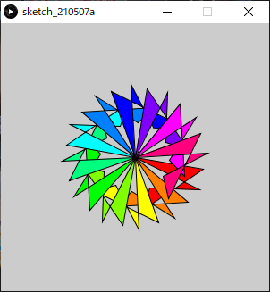

### 演習: ルール９０セル・オートマトン

セル・オートマトンとは，格子状に配置されたセルがそれぞれ状態を持ち，隣接している周囲のセルの状態をもとに，時間とともに状態を遷移させていくモデルです．
一定のルールを与えることで，規則が単純でも，豊かな結果を得ることができます．

#### 初期状態


#### 隣接するセルの合計が次の(行の)値になる

このルールをさらに次の行へと進めていく．


#### 奇数のセルを描画する

プログラム中では奇数を1，偶数を0として配列に格納している．


#### 制作手順

今回制作するプログラムでは，セル=ピクセルと考える．

1. 二次元配列の宣言，初期化
   格子状のセルを表す配列を用意しましょう．

```java
size(500,500);
int[][] cell=new int[width][height];     // スクリーンサイズ分の配列.
for(int iY=0; iY<cell.length; iY++)  	   // 列の繰り返し
{
  for(int iX=0; iX<cell[iY].length; iX++)  // 行の繰り返し
  {
    cell[iX][iY]=0;  }
}
```

2. 初期状態の入力

   - 最初の行の中心のセルを1，それ以外は0
   - 初期状態の唯一のセルを描画

   ※ステップ1のプログラムの後に追加

```java
cell[width/2][0]= 1;  // 初期状態：最初の行の中心のセルを1，それ以外は0
point( width/2, 0 );  // 描画.
```

3. 一行ずつセルの内容を更新して描画
   ※ステップ2のプログラムの後に追加

```java
for(int iY=1; iY<height; iY++)  // ２行目から繰り返し開始．
{
  for(int iX=0; iX<width; iX++)	// 列0から繰り返し．
  {
    // 隣接するセルの合計が偶数なら0,奇数なら1をセルの値に代入.
    cell[iX][iY] = ( cell[iX-1][iY-1] + cell[iX+1][iY-1] )%2;
    if( cell[iX][iY] == 1 )    // もしもセルの値が1なら.
    {
      point( iX, iY );
    }
  }
}
```

4. スクリーン両端の処理
   ステップ3のままだと`iX-1`の値がマイナスになったり，`iX+1`の値が配列の要素番号の最大を超えてしまう．
   ※ステップ3のプログラムを書き換える．

```java
for(int iY=1; iY<height; iY++)  // ２行目から繰り返し開始．
{
  for(int iX=0; iX<width; iX++)	// 列0から繰り返し．
  {
    if( iX == 0 )             // スクリーン左端の処理.
    {
      cell[iX][iY] = ( 0 + cell[iX+1][iY-1] )%2;
    }
    else if( iX == width-1 )  // スクリーン右端の処理.
    {
      cell[iX][iY] = ( cell[iX-1][iY-1] + 0 )%2;
    }
    else
    {
      // 隣接するセルの合計が偶数なら0,奇数なら1をセルの値に代入.
      cell[iX][iY] = ( cell[iX-1][iY-1] + cell[iX+1][iY-1] )%2;
    }
    if( cell[iX][iY] == 1 )    // もしもセルの値が1なら.
    {
      point( iX, iY );
    }
  }
}
```

#### 完成したプログラム


```java
// シェルピンスキーのギャスケット.

// 初期状態：最初の行の中心のセルを1，それ以外は0

size(500, 500);

int[][] cell=new int[width][height];       // スクリーンサイズ分の配列. 
for(int iY=0; iY<cell.length; iY++)  // 列の繰り返し
{
  for(int iX=0; iX<cell[iY].length; iX++) // 行の繰り返し
  {
    cell[iX][iY]=0;
  }
}
cell[width/2][0]= 1;  // 初期状態：最初の行の中心のセルを1，それ以外は0
point( width/2, 0 );  // 初期状態の唯一のセルを描画. 
for(int iY=1; iY<height; iY++)  // ２行目から繰り返し開始．
{
  for(int iX=0; iX<width; iX++)	// 列0から繰り返し．
  {
    if( iX == 0 )             // スクリーン左端の処理.
    {
      cell[iX][iY] = ( 0 + cell[iX+1][iY-1] )%2;
    }
    else if( iX == width-1 )  // スクリーン右端の処理.
    {
      cell[iX][iY] = ( cell[iX-1][iY-1] + 0 )%2;
    }
    else
    {
      // 隣接するセルの合計が偶数なら0,奇数なら1をセルの値に代入.
      cell[iX][iY] = ( cell[iX-1][iY-1] + cell[iX+1][iY-1] )%2;
    }
    if( cell[iX][iY] == 1 )    // もしもセルの値が1なら.
    {
      point( iX, iY );
    }
  }
}
```


#### 初期状態（一行目のセルの状態）を変える

```java
// シェルピンスキーのギャスケット.

// 初期状態：最初の行のセルの値を全てランダム

size(500, 500);
int[][] cell=new int[width][height];       // スクリーンサイズ分の配列. 
for(int iY=0; iY<cell.length; iY++)  // 列の繰り返し
{
  for(int iX=0; iX<cell[iY].length; iX++)        // 行の繰り返し
  {
    cell[iX][iY]=0;
  }
} // 初期状態：最初の行のセルの値を全てランダム
for(int iX=0; iX<width; iX++)
{
  cell[iX][0]= floor( random( 100 ) )%2;
  if( cell[iX][0] == 1 )    // もしもセルの値が1なら，1行目を描画.
  {
    point( iX, 0 );
  }
}
for(int iY=1; iY<height; iY++)  // ２行目から繰り返し開始．
{
  for(int iX=0; iX<width; iX++)
  {
    if( iX == 0 )             // スクリーン左端の処理.
    {
      cell[iX][iY] = ( 0 + cell[iX+1][iY-1] )%2;
    }
    else if( iX == width-1 )  // スクリーン右端の処理.
    {
      cell[iX][iY] = ( cell[iX-1][iY-1] + 0 )%2;
    }
    else
    {
      // 隣接するセルの合計が偶数なら0,奇数なら1をセルの値に代入.
      cell[iX][iY] = ( cell[iX-1][iY-1] + cell[iX+1][iY-1] )%2;
    }
    if( cell[iX][iY] == 1 )    // もしもセルの値が1なら.
    {
      point( iX, iY );
    }
  }
}
```


## 多次元配列

配列の次元数は二次元以上にも増やすことができる．
しかし，次元が増えるほど人にとっては直感的に理解しにくくなる．
よって，せいぜい２次元配列までに留めることを推奨．

```java
int [][][] iRGBColor = new int[3][640][480];		// RGBそれぞれのバッファ.
```


#### 例

```java
int iColorMax = 100;size(400,400);
int[][][] iColor = new int[3][width][height]; // 初期化
for(int iRGB = 0; iRGB < iColor.length; iRGB++ )
{
  for(int iX = 0; iX < width; iX++ )
  {
    for(int iY = 0; iY < height; iY++ )
    {
      iColor[iRGB][iX][iY] = 0;
    }
  }
}
// 色決定
for(int iX = 0; iX < width; iX++ )
{
  for(int iY = 0; iY < height; iY++ )
  {
    if( iX < width / 3 )
    {
      iColor[0][iX][iY] = iColorMax; //R
    }
    if( iY < height / 3 )
    {
      iColor[1][iX][iY] = iColorMax; //G
    }
    if( iX + iY > height )
    {
      iColor[2][iX][iY] = iColorMax; //B 右下の三角形
    }
  }
}
// 全チャンネルを参照し，画素RGB描画
colorMode(RGB,iColorMax);
for(int iX = 0; iX < width; iX++ )
{
  for(int iY = 0; iY < height; iY++ )
  {
    stroke(iColor[0][iX][iY],
           iColor[1][iX][iY],
           iColor[2][iX][iY]);
    point(iX,iY);
  }
}
```


# 関数の基本

## 関数( function )とは

- 関数とは，データを処理し何らかの値を返すモジュールのこと．
  - **命令のまとまり**，と考えて差し支えない．


- 既に授業で使用している命令も関数の一種

```java
size(), colorMode(), point(), rect(), ellipse(), random(), sin(), cos(), tan()...
```

- 逆に，関数ではないもの

```java
for, if, else, else if, switch ...		// 主に制御文関連のもの
```

## 関数の使用

### 関数の呼び出し( call )

関数を使う際，

1. 関数にデータ（値）を渡す．
   この，渡すデータを**引数**という．
2. 関数内で，渡したデータを元に処理が行われる．
3. 処理の結果，値が返ってくる．
   この，返ってくる値を**戻り値**・**返り値**という．
   返ってこない関数もある（**void関数**）．

### 関数の呼び出し方

#### 値が返ってこない関数（void関数）

- `ellipse, colorMode, size`など
- 関数呼び出しだけで（命令）文となる．

***

##### 関数の挙動

引数の値を元に，関数の中で必要な処理は全て実行される．


***

#### 値が返ってくる関数

- `random, sin, cos, tan` など
- 関数を呼び出しを
  - 変数に代入する
  - 式に組み込む

***

##### 関数の挙動（変数に代入する）

返り値を変数に代入する場合は，受け取る変数を用意する．


***

##### 関数の挙動（式に組み込む）

関数を式に組み込んだ場合は，関数を呼び出した場所に返り値が代入され，値が式に組み込まれる．


***

#### 引数が無い関数

```java
noStroke();		// 引数が必要ない場合も () は必須．
```


### 関数の中身

Processingで用意されている関数は，中身を直接見ることはできない．

```java
返り値の型 関数名( 引数 )
{   //（命令）文
  return 返り値;
}

// 関数の実体（返り値なし）
void 関数名( 引数 )
{
  //（命令）文
}
```


# ユーティリティ関数


## テキスト描画

### text()

スクリーンにテキストを描画する．
フォントの色の変更は`fill()`を使う．

#### 書式

```java
text( "描画する文字列", X座標値, Ｙ座標値 )	// 文字列を描画する場合（ダブルクォーテーションを使う）
```


```java
text( 描画する値, X座標値, Ｙ座標値 )		 // 数値を描画する場合
```


```java
text( 変数, X座標値, Ｙ座標値 )		 	   // 変数の値を描画する場合
```

#### 例

```java
text("word", 10, 30);

fill(0, 102, 153);
text(3.14, 10, 60);

int iText = 123;

fill(0, 102, 153, 100);
text(iText, 10, 90); 
```


### textSize()

テキスト描画のフォントサイズを設定する．

#### 書式

```java
textSize( フォントサイズ )		// ピクセル単位
```

#### 例

```java
background(0); 
fill(255);

textSize(26); // フォントサイズ:26
text("WORD", 10, 50);

textSize(14); // フォントサイズ:14
text("WORD", 10, 70);
```


https://processing.org/reference/text_.html
https://processing.org/reference/textSize_.html


## 日付

現在の日，月，西暦を取得する．

### 書式

```java
day()		  // 日(1 - 31)
month()		// 月(1 - 12)
Year()		// 年(2003, 2004, 2005, etc.)
```

### 例

```java
int iDay    = day();
int iMonth  = month();
int iYear   = year();
text(iDay,   10, 28);
text(iMonth, 10, 56);
text(iYear,  10, 84);
```


https://processing.org/reference/year_.html


## 時刻

現在の時刻における秒，分，時を取得する．
アニメーションに用いる場合，`draw()`を行うたびにこれらの関数を呼び，最新の時刻を取得する必要がある．

### 書式

```java
second()  // 秒(0 - 59)
minute()  // 分(0 - 59)
hour()    // 時(0 - 23)
```

### 例1

```java
int iSecond = second();
int iMinute = minute();
int iHour   = hour();
text( iHour,   10, 56 );
text( ":",     25, 56 );
text( iMinute, 30, 56 );
text( ":",     45, 56 );
text( iSecond, 50, 56 );
```


https://processing.org/reference/hour_.html


### 例2

#### オーソドックスな時計

```java
void setup()
{
  size(1000, 1000);
  colorMode(RGB, 256);
  frameRate(1);
}
void draw()
{
  fill(255, 255, 255);
  rect(0, 0, 1000, 1000);	// スクリーンリフレッシュ
  fill(0.0, 0.0, 0.0);
  textAlign(CENTER);
  textSize(60);
  for(int iHour=0; iHour<12; iHour++)
  {
    text(iHour+1, 450*cos(radians(30*(iHour+1)-90))+500, 450*sin(radians(30*(iHour+1)-90))+500);
  }  translate(500, 500);	// 原点をスクリーン中心へ
  pushMatrix();			// ↑この座標系を保存
  int iHour = hour();
  rotate(radians(30*iHour-90));
  rect(0, 0, 240, 15);
  popMatrix();			// 原点をスクリーン中心へ戻す
  pushMatrix();			// ↑この座標系を保存
  int iMinute = minute();
  rotate(radians(6*iMinute-90));
  rect(0, 0, 320, 10);
  popMatrix();			// 原点をスクリーン中心へ戻す
  int iSecond = second();
  rotate(radians(6*iSecond-90));
  rect(0, 0, 360, 5);
}
```


## プログラムを開始してからの経過時間

### millis()

プログラムを開始してからの現在の経過時間を，ミリ(千分の一)秒単位で取得できる．
少し難しいが，**差分を取ることで**細かいアニメーションに応用できる．

#### 書式

```java
millis()	// 引数無し，1000分の1秒単位の値が返ってくる．
```

#### 例

```java
float fMillsPrevious = 0;  // 前回のdraw()における経過時間 
void setup()
{
  frameRate( 5 );  // fps:5
}
void draw()
{
  // スクリーンリフレッシュ
  fill(0,0,0);
  rect(0,0,width,height);
  // 現在のdraw()における経過時間
  float fMillsCurrent = millis();
  // 前回のdraw()から経過した（差分）時間
  float fMillsDelta = fMillsCurrent - fMillsPrevious;
  textSize( 20 );
  fill(255,255,255);
  text( fMillsDelta, 5, 20);    // 前回のdraw()から経過した時間を描画
  text( fMillsPrevious, 5, 50); // 前回のdraw()における経過時間を描画
  text( fMillsCurrent, 5, 80);  // 現在のdraw()における経過時間を描画
  // 現在の経過時間を保存.
  fMillsPrevious = fMillsCurrent;
}
```


https://processing.org/reference/millis_.html


### 例

#### 秒が変わるまでのミリ秒単位のアニメーション

```java
int   iSecondCurrent;      // 現在の時刻(秒)
float fMillsAtSecChanged;  // 現在の時刻(秒)になった時の経過時間
void setup()
{
  size(200,200);
  colorMode(HSB,1,1,1);
  frameRate( 30 );  // fps:30
  iSecondCurrent = second();// 最新の時刻(秒)で初期化.
  fMillsAtSecChanged = 0;
}
void draw()
{
  // スクリーンリフレッシュ
  fill(0,0,0);
  rect(0,0,width,height);
  float fMillsInSec = 0;  // 秒間のミリ秒タイマー
  int iSecondNew = second();           // 最新の時刻(秒)取得.
  if( iSecondCurrent != iSecondNew )   // もし時刻(秒)が変わったら
  {
    iSecondCurrent = iSecondNew;       // 現在の時刻(秒)を更新
    fMillsAtSecChanged = millis();     // 現在の時刻(秒)になった時の経過時間を更新
  }
  else
  {
    fMillsInSec = millis() - fMillsAtSecChanged; // 秒間のミリ秒タイマー更新
  }
  float fArcBeginDegree = 360 * fMillsInSec / 1000 - 90;  // 円弧の始まりの角度
  // 円弧描画
  fill( 1, 0, 1 );
  arc( width/2, height/2, width/2, height/2, radians(fArcBeginDegree), radians(270), PIE );
  // 時刻テキスト描画
  textSize( 20 );
  text( hour(), width/2 - 60, height );
  text( ":", width/2 - 35, height );
  text( minute(), width/2 - 30, height );
  text( ":", width/2 - 5,  height );
  text( iSecondCurrent, width/2, height );
  text( ":", width/2 + 25, height );
  text( floor(fMillsInSec), width/2 + 30, height );
}
```


# 画像・PDF出力

## 表示ウィンドウの画像を保存する．

- ファイル形式は tif, tga, png, jpg などが使用可能.
- **プログラムを実行すると**，プログラムが置かれているフォルダ（スケッチブック）内に画像が保存される.
- 通常はプログラムの最後に書くとよい．

### 書式

```java
save(“ファイル名.拡張子”); // ※ダブルクォーテーション（半角）を忘れずに.
```

### 例

```java
/**	スケッチ名：sketch01.pde		ルート90・セルオートマトンの描画プログラム	~省略*/

save( "sakuhin.png" );	// 表示ウィンドウを，"sakuhin.png"という名前で，pngファイルとして出力
```

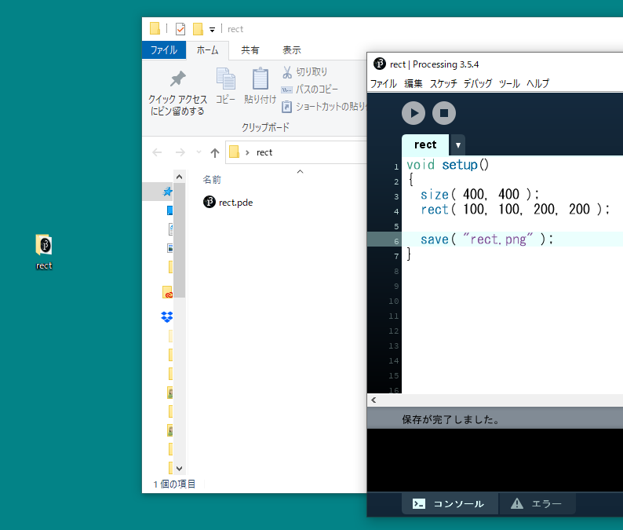


## PDFへ出力

- **プログラムを実行すると**，プログラムが置かれているフォルダ（スケッチブック）内にpdfファイルが保存される.
- 少々ステップを踏む必要あり．

### 方法

1. 　ライブラリのインポート
    - （日本語）「スケッチ」メニュー ＞ 「ライブラリをインポート」 ＞ 「PDF Export」を選択
    - （英語版）「Sketch」メニュー ＞ 「import Library」 ＞ 「PDF Export」を選択 


​		上記を選択すると，プログラムの一行目に`import processing.pdf.*;`が追加される．
​		※**メニューを使わず，直に入力も可能．**

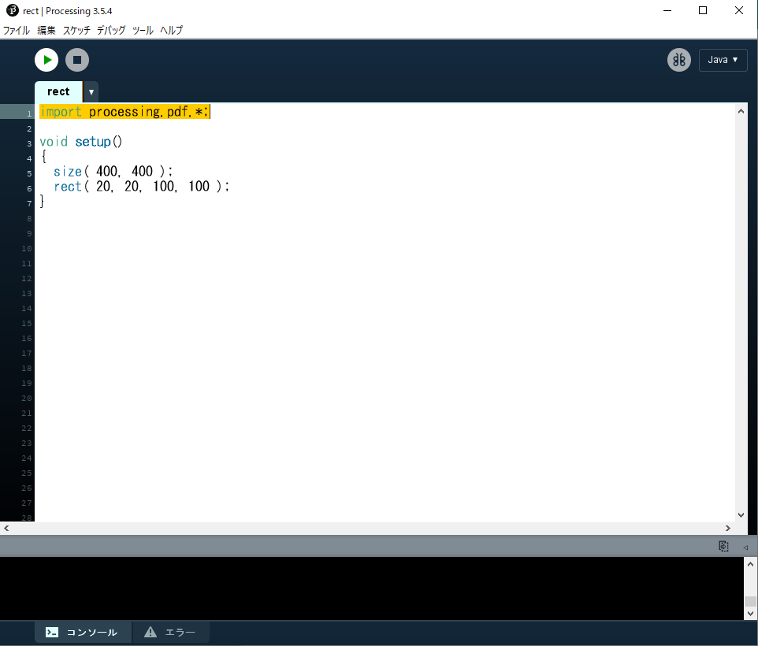

2. `size()`の記述変更

   ```java
   size( 横のサイズ, 縦のサイズ, PDF, “好きなファイル名.pdf” );
   ```

   


3. 　プログラム末尾に`exit();`を追加．


4. プログラムを実行すると，pdfファイルが出力される．
   この時，表示ウィンドウは表示されない．


# アニメーション

## アニメーションの基礎知識

### 動画のフレームとは

- 動画を構成する一枚一枚の静止画（コマ）のこと
- 人間の目で動いているように見せるため，ごく短い時間間隔で切り替わっている．

### フレームレートとは

- 動画の滑らかさの指標．
- **fps** ( frames per second )
  - **1秒間に書き換えるフレームの数**，フレーム毎秒
  - Processing でもこれを指定することでフレームレートを指定できる．


## StaticモードとActiveモード

### Staticモード

- これまでの静止画を描画するモード

- プログラムが上から書いた順番に実行され，終了する．

### Activeモード

- アニメーションを行う場合，**Activeモードでプログラムを記述する必要**がある．
- プログラムのブロックが分かれる
  - 開始時に１度だけ行う初期設定命令
  - 毎フレーム行う描画命令
- プログラムは終了命令が下されるまで終了しない．
- 静止画の描画も行えるので，ほぼStaticモードの上位互換


## アニメーションの始め方(Activeモード)

### 1.　プログラム全体を`setup()`関数と`draw()`関数で構成する．

```java
void setup()
{
  // プログラムの開始時に１度だけ実行される（命令）文.
}
void draw()
{
  // 毎フレーム繰り返し実行される（命令）文.
}
```

### 2.　`setup()`内で最初の設定を行う．

プログラム実行時に，最初に１度だけ実行する（命令）文を記述する．

#### よく使われる命令

- 画面のサイズ`size()`
- 背景色`background()`
- カラーモード`colorMode()`
- フレームレート`frameRate()`

#### 例

```java
void setup()
{
  size( 128, 128 );
  frameRate( 8 );
  colorMode( HSB, 360, 1, 1 );
  background( 0, 0, 0 );
}
```

### 3. 　`draw()`内でフレーム毎の描画を行う．

`frameRate()`で指定した頻度で`draw()`の命令が繰り返し実行される．
例えば，`frameRate( 30 );// フレームレート30fps`なら，１秒間に30回実行される．

#### よく使われる命令

- 図形描画`point(), line(), rect(), ellipse()`など
- 繰り返しfor文
- 条件分岐if文
- 変数への代入，算術式など

#### 例

```java
void draw()
{
  for(int iIdx=0; iIdx<100; iIdx++)
  {
    fill( 170 + random(80), 100 + random(50), 200 );
    circle( random(width), random(height), 10 );
  }
  for(int iIdx=0; iIdx<100; iIdx++)
  {
    fill( 170 + random(80), 100 + random(50), 200 );
    rect( random(width), random(height), 10, 10 );
  }
}
```

### プログラム全体

```java
void setup()
{
  size( 128, 128 );
  frameRate( 8 );
  colorMode( HSB, 360, 1, 1 );
  background( 0, 0, 0 );
}
void draw()
{
  for(int iIdx=0; iIdx<10; iIdx++)
  {
    fill( 170 + random(80), 100 + random(50), 200 );
    circle( random(width), random(height), 10 );
  }
  for(int iIdx=0; iIdx<10; iIdx++)
  {
    fill( 170 + random(80), 100 + random(50), 200 );
    rect( random(width), random(height), 10, 10 );
  }
}
```


#### 静止画のみしか書かない場合

setup()関数内のみに描画命令を書く
この場合も，`draw()`の記述自体は必要

```java
void setup()
{
  size( 128, 128 );
  frameRate( 8 );
  colorMode( HSB, 360, 1, 1 );
  background( 0, 0, 0 );
  for(int iIdx=0; iIdx<10; iIdx++)
  {
    fill( 170 + random(80), 100 + random(50), 200 );
    circle( random(width), random(height), 10 );
  }
  for(int iIdx=0; iIdx<10; iIdx++)
  {
    fill( 170 + random(80), 100 + random(50), 200 );
    rect( random(width), random(height), 10, 10 );
  }
}
void draw()
{
}
```


### Activeモードまとめ

- 1回だけしか実行されない命令類
  → `setup()`関数内に書く
- アニメーションのように，何度も実行される命令
  →`draw()`関数内に書く
- 静止画の描画
  →`setup()`関数内のみに描画命令を書く


### 演習

#### ランダムな点描アニメーション

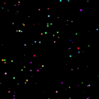

#### 1. 空の`setup()`と`draw()`を用意

できれば下の答えを見る前にやってみましょう．

```java
void setup()
{
}
void draw()
{
}
```

#### 2. `setup()`に以下の処理を追加

- スクリーンサイズ: 200×200
- カラーモード: `RGB, 1, 1, 1`
- 背景色: 黒 `0, 0, 0`

できれば下の答えを見る前にやってみましょう．

```java
void setup()
{
  size(200, 200);
  colorMode( RGB, 1, 1, 1 );
  background( 0, 0, 0 );
}
void draw()
{
}
```

#### 3. `draw()`に以下の処理を追加

- 線の太さ: 最大4のランダム
- 線の色: RGB全て最大1のランダム
- 点の描画: XY座標値はスクリーン上でランダム

できれば下の答えを見る前にやってみましょう．

```java
void setup()
{
  size(200, 200);
  colorMode( RGB, 1, 1, 1 );
  background( 0, 0, 0 );
}
void draw()
{
  strokeWeight( random(4) );
  stroke( random(1), random(1), random(1) );
  point( random(width), random(height) );
}
```


## アニメーションの基本

### フレームレートの設定

`setup()`のなかで，１秒間に描画を行う(`draw()`が実行される)回数を指定できる．
特に指定をしない場合，デフォルトは60fps．

```java
frameRate( fps );
```

##### 例

```java
frameRate( 30 );	// フレームレート30fps
```

### 画面のリフレッシュ

`draw()`は，基本的に前フレームの描画結果の上に新しい描画を重ねて行う．
フレームごとに，画面をリフレッシュしたい場合は，**backgroundと同じ色の四角を画面全体に貼付ける**事で行う．

##### 例

```java
void setup()
{
  size( 128, 128 );
  frameRate( 1 );
  colorMode( HSB, 360, 1, 1 );
  background( 0, 0, 0 );
}
void draw()
{
  // 画面のリフレッシュ.  
  fill( 0, 0, 0 );
  rect( 0, 0, width, height );
  fill( 170 + random(80), 100 + random(50), 200 );
  rect( random(width), random(height), 20, 20 );
}
```


### グローバル変数の使用

#### ローカル変数

※詳しくは，演算と変数/変数/ローカル変数とグローバル変数のセクションを参照

#### グローバル変数

- 全ての範囲で有効


- `draw()`が実行される度にメモリ領域が初期化されることがなく，`draw()`の度に少しずつ数値を変更する等が可能．
- **アニメーションにおいて，変化をもたらすために特に重要**．

##### ブロック

`{ }`で囲まれた部分を**ブロック**という．
繰り返しfor文，条件分岐if文，関数で使用されている．

```java
for(/** 省略 */)
{
  // ブロック
}
```

```java
if(/** 省略 */)
{
  // ブロック
}
```

```java
void setup()
{
  // ブロック
}
void draw()
{
  // ブロック
}
```

##### 使い方

- **ブロック外で宣言すればグローバル変数**となる．
- プログラムのどこからでも変数を使うことができる．
- 通常，**プログラムの一番上に記述**する．

```java
int iX;			 // グローバル変数の宣言
void setup()
{
  iX = 0;		 // OK
}
void draw()
{
  iX = iX + 5; // OK
}
```

### 演習

#### 矩形の移動アニメーション


#### 1. 空の`setup()`と`draw()`を用意

できれば下の答えを見る前にやってみましょう．

```java
void setup()
{
}
void draw()
{
}
```

#### 2. `setup()`に以下の処理を追加

- スクリーンサイズ: 200×200
- カラーモード: `RGB, 1, 1, 1`
- 線(stroke)の表示をオフ
- フレームレート: 8 (fps)

できれば下の答えを見る前にやってみましょう．

```java
void setup()
{
  size( 200, 200 );
  colorMode( RGB, 1, 1, 1 );
  noStroke();
  frameRate( 8 );
}
void draw()
{
}
```

#### 3. グローバル変数の追加

- 横移動用グローバル変数を一つ宣言し，`setup()`で初期化しましょう．
  - 変数名: iPosX
  - 型: int
  - 初期値: 0

できれば下の答えを見る前にやってみましょう．

```java
int iPosX;             // グローバル変数iPosXの宣言
void setup()
{
  size( 200, 200 );
  colorMode( RGB, 1, 1, 1 );
  noStroke();
  frameRate( 8 );
  iPosX = 0;      // iPosXの初期化
}
void draw()
{
}
```

#### 4. `draw()`で矩形を描画

- `draw()`で矩形を描画しましょう．
  - X座標: iPosX
  - Y座標: ( スクリーンの高さの半分 - 10 )
  - 大きさ: 20, 20
  - 塗り色: 白( 1, 1, 1 )


できれば下の答えを見る前にやってみましょう．

```java
int iPosX;
void setup()
{
  size( 200, 200 );
  colorMode( RGB, 1, 1, 1 );
  noStroke();
  frameRate( 8 );
  iPosX = 0;
}
void draw()
{
  fill( 1, 1, 1 );						// White
  rect( iPosX, height/2-10, 20, 20 );	// 矩形描画
}
```

#### 5. 矩形を動かす

- `draw()`の中に，`iPosX`に4を足す（加算）処理を追加しましょう．


できれば下の答えを見る前にやってみましょう．

```java
int iPosX;
void setup()
{
  size( 200, 200 );
  colorMode( RGB, 1, 1, 1 );
  noStroke();
  frameRate( 8 );
  iPosX = 0;
}
void draw()
{
  iPosX += 4;	// フレーム毎に4を足す
  fill( 1, 1, 1 );
  rect( iPosX, height/2-10, 20, 20 );
}
```

#### 6. スクリーンのリフレッシュ処理の追加

前フレームの矩形描画が残ってしまっている．
`draw()`で，**新しい矩形を描画する前に**スクリーンをリフレッシュしましょう．

- 矩形を描画する
  - X座標: 0
  - Y座標: 0
  - 幅・高さ: スクリーンと同じ
  - 塗り色: 黒(  0, 0, 0  )


できれば下の答えを見る前にやってみましょう．

```java
int iPosX;
void setup()
{
  size( 200, 200 );
  colorMode( RGB, 1, 1, 1 );
  noStroke();
  frameRate( 8 );
  iPosX = 0;
}
void draw()
{
  fill( 0, 0, 0 );              // 白
  rect( 0, 0, width, height );  // スクリーンのリフレッシュ.
  iPosX += 4;
  fill( 1, 1, 1 );
  rect( iPosX, height/2-10, 20, 20 );
}
```

#### 7. スクリーンの外に出たら左端に戻す

矩形のX座標値は`iPosX`に保存されている．
以下の処理を適切な場所に追加してみましょう．

- もしX座標値がスクリーンの外ならX座標値を0に戻す


できれば下の答えを見る前にやってみましょう．

```java
int iPosX;
void setup()
{
  size( 200, 200 );
  colorMode( RGB, 1, 1, 1 );
  noStroke();
  frameRate( 8 );
  iPosX = 0;      // iPosXの初期化
}
void draw()
{
  fill( 0, 0, 0 );
  rect( 0, 0, width, height );
  iPosX += 4;
  if( iPosX > width ) // もしX座標値がスクリーンの外なら
  {
    iPosX = 0;        // X座標値を0に戻す
  }
  fill( 1, 1, 1 );
  rect( iPosX, height/2-10, 20, 20 );
}
```


## サンプル集

### 円の移動・跳ね返りアニメーション


#### 1. 空の`setup()`と`draw()`を用意

できれば下の答えを見る前にやってみましょう．

```java
void setup()
{
}
void draw()
{
}
```

#### 2. `setup()`に以下の処理を追加

- スクリーンサイズ: 200×200
- カラーモード: `RGB, 1, 1, 1, 100`
- 線(stroke)を表示しない
- フレームレート(fps): 8

できれば下の答えを見る前にやってみましょう．

```java
void setup()
{
  size(200, 200);
  colorMode( RGB, 1, 1, 1 );
  noStroke();
  frameRate(8); // fps
}
void draw()
{
}
```

#### 3. グローバル変数の追加

- 横移動用グローバル変数を一つ宣言し，`setup()`で初期化しましょう．
  - 変数名: iPosX
  - 型: int
  - 初期値: 0

できれば下の答えを見る前にやってみましょう．

```java
int iPosX; // 楕円のX座標
void setup()
{
  size(200, 200);
  colorMode( RGB, 1, 1, 1 );
  noStroke();
  frameRate(8);
  iPosX = 0; // 初期化
}
void draw()
{
}
```

#### 4. `draw()`で楕円を描画

- `draw()`で楕円を描画しましょう．
  - X座標: iPosX
  - Y座標: スクリーンの高さの半分
  - 直径: 30, 30
  - 塗り色: 白( 1, 1, 1 )

できれば下の答えを見る前にやってみましょう．

```java
int iPosX;
void setup()
{
  size(200, 200);
  colorMode( RGB, 1, 1, 1 );
  noStroke();
  frameRate(8);
  iPosX = 0;
}
void draw()
{
  fill( 1, 1, 1 );						// White
  ellipse( iPosX, height/2, 30, 30 );	// 楕円描画
}
```

#### 5. 楕円を動かす

- `draw()`の中に，`iPosX`に4を足す（加算）処理を追加しましょう．


できれば下の答えを見る前にやってみましょう．

```java
int iPosX;
void setup()
{
  size(200, 200);
  colorMode( RGB, 1, 1, 1 );
  noStroke();
  frameRate(8);
  iPosX = 0;
}
void draw()
{
  fill( 1, 1, 1 );
  ellipse( iPosX, height/2, 30, 30 );
  iPosX += 4; // フレーム毎に4動かす
}
```

#### 6. スクリーンのリフレッシュ処理の追加

前フレームの楕円描画が残ってしまっている．
`draw()`で，**新しい楕円を描画する前に**スクリーンをリフレッシュしましょう．

- 矩形を描画する
  - X座標: 0
  - Y座標: 0
  - 幅・高さ: スクリーンと同じ
  - 塗り色: 黒(  0, 0, 0  )


```java
int iPosX;
void setup()
{
  size(200, 200);
  colorMode( RGB, 1, 1, 1 );
  noStroke();
  frameRate(8);
  iPosX = 0;
}
void draw()
{
  fill( 0, 0, 0 );							// Black
  rect( 0, 0, width, height );	// スクリーンリフレッシュ
  fill( 1, 1, 1 );
  ellipse( iPosX, height/2, 30, 30 );
  iPosX += 4;
}
```

#### 7. 跳ね返り（難易度高め）

今のままではスクリーン外に楕円が移動してしまう．
**スクリーンの右端と左端で進む向きが反転**するよう，改良方法を考えてみましょう．


##### ヒント

- 現在の<u>楕円進む向き</u>の情報を保存する**グローバル変数を追加**する．
- 条件分岐`if`を使い，<u>楕円がスクリーン端を超えたときに進む向きを変える</u>．
- 「向きが反転する」とはこの場合，(+)プラスが(-)マイナスになる，もしくは(-)マイナスが(+)プラスになる．

できれば下の答えを見る前にやってみましょう．

```java
int  iPosX;
int  iDirctionX; // 進む向き( 1:+X方向, -1:-X方向 )
void setup()
{
  size(200, 200);
  colorMode( RGB, 1, 1, 1 );
  noStroke();
  frameRate(8);
  iPosX = 0;
  iDirctionX  = 1;
}
void draw()
{
  fill( 0, 0, 0 );
  rect( 0, 0, width, height );
  fill( 1, 1, 1 );
  ellipse( iPosX, height/2, 30, 30 );
  iPosX += iDirctionX*4;             // iPosX = iPosX + iDirctionX*4; と同じ
  if( iPosX >= width || iPosX < 0 )  // もしX座標値がスクリーン幅以上もしくは0未満だったら
  {
    iDirctionX *= -1;  // 向きを逆方向に変える(-1をかける)
  }
}
```


### 直線の回転アニメーション

```java
int iRatateDeg;             // アニメーション用回転角度
void setup()
{
  size( 200, 200 );
  frameRate( 8 );
  iRatateDeg = 0;      // グローバル変数初期化
}
void draw()
{
  // 画面のリフレッシュ.
  fill( 120, 120, 120 );
  noStroke();
  rect( 0, 0, width, height );
  iRatateDeg += 2;                 // 毎フレーム2°回転
  if( iRatateDeg > 360 )
  {
    iRatateDeg -= 360;             // 360°以上回転したら戻す.
  }
  translate( width/2, height/2 );  // 座標原点をスクリーン中心へ.
  rotate( radians(iRatateDeg) );   // 座標系回転.
  strokeWeight( 4 ); // 線の太さ.
  stroke( 0, 0, 0 );
  line( 0, 0, width/2, 0 );
}
```


### 惑星の公転のような回転アニメーション

```java
int iRatateDegL;             // アニメーション用回転角度
int iRatateDegS;             // アニメーション用回転角度
void setup()
{
  size( 300, 300 );
  colorMode(HSB, 4, 1, 4);
  frameRate( 20 );
  iRatateDegL = 0;
  // グローバル変数初期化
  iRatateDegS = 0;
}
void draw()
{
  // 画面のリフレッシュ.
  fill( 0, 0, 1 );
  noStroke();
  rect( 0, 0, width, height );    // 大きい星回転.
  iRatateDegL += 2;               // 毎フレーム2°回転
  if( iRatateDegL > 360 )
  {
    iRatateDegL -= 360;             // 360°以上回転したら戻す.
  }
  // 小さい星回転.
  iRatateDegS += 4;                 // 毎フレーム2°回転
  if( iRatateDegS > 360 )
  {
    iRatateDegS -= 360;             // 360°以上回転したら戻す.
  }
  translate( width/2, height/2 );   // 座標原点をスクリーン中心へ.
  pushMatrix();
  rotate( radians(iRatateDegL) );   // 座標系回転(大きい星)
  translate( width/3, 0 );          // 公転半径分移動.
  // 大きい星描画
  stroke( 0, 0, 0 );
  fill(0, 1, 4);
  ellipse(0,0,40,40);  // 原点に描画.
  rotate( radians(-iRatateDegL) );  // 回転戻す.
  rotate( radians(iRatateDegS) );   // 座標系回転(小さい星)
  translate( width/8, 0 );          // 公転半径分移動.
  // 小さい星描画
  stroke( 0, 0, 0 );
  fill(1, 1, 4);
  ellipse(0,0,20,20);
  popMatrix();
}
```


### 波形の移動（位相変化）アニメーション

```java
int iAmplitudeL = 80;  // 振幅（大きな波の高さ）
// グローバル変数.
int iAnimPulseDeg = 0; // アニメーション用波の角度
void setup()
{
  size( 400,200 );
  colorMode( HSB, 90, 1.0, 1.0, 1.0 );
}
void draw()
{
  // スクリーンリセット.
  noStroke();
  fill( 0, 0, 0.4 );
  rect( 0, 0, width, height );
  iAnimPulseDeg += 2; // アニメーション用の角度を2°増やす.
  if( iAnimPulseDeg > 360 )                  // 360°を超えたらリセット.
  {
    iAnimPulseDeg -= 360;
  }
  // コサイン波形
  strokeWeight( 8 );
  for( int iX=0; iX < width; iX++ )
  {
    int iAngle0 = iX*4+iAnimPulseDeg;        // アニメーション用の角度を加算
    int iAngle1 = (iX+1)*4+iAnimPulseDeg;    // アニメーション用の角度を加算
    // X座標値によって色は固定
    stroke( iX%90, 1.0, 1.0 );
    line( iX, height/2 + iAmplitudeL*cos( radians(iAngle0) ),
          iX, height/2 + iAmplitudeL*cos( radians(iAngle1+1) ) );
  }
}
```


### 円弧の形状変化アニメーション

```java
int iArcAnimDeg;        // アニメーション用円弧の角度
void setup()
{
  size( 200, 200 );
  frameRate( 8 );
  iArcAnimDeg = 0;      // アニメーション用変数初期化
}
void draw()
{
  // 画面のリフレッシュ.
  fill( 120, 120, 120 );
  noStroke();
  rect( 0, 0, width, height );    // アニメーション用変数更新.
  if( iArcAnimDeg < 180 )	// 180°以上変化したらリセット.
  {
    iArcAnimDeg += 4;		// 毎フレームの変化角度
  }
  else
  {
    iArcAnimDeg -= 180;		// リセット.
  }
  // 円弧の始まりの角度を計算.
  int iArcAnimDegBegin = iArcAnimDeg - 90;    // 円弧の終わりの角度を計算.
  int iArcAnimDegEnd   = 270 - iArcAnimDeg;
  fill( 255, 255, 255 );
  stroke( 0,0,0 );
  arc(width/2, height/2, width, height, radians(iArcAnimDegBegin), radians(iArcAnimDegEnd), CHORD);
}
```


# 関数の作成

### 概要

関数は命令がまとまったプログラムのモジュールである．

- **関数の定義**
  - 関数が行う処理（命令）を決めること

- **関数の使用**
  - 作った関数を使う（callする）こと

### 関数の定義

- 自分で独自の関数を作ることができる．
- 関数を作ることを，**関数の定義を行う**という．


#### setup関数とdraw関数の定義

アニメーションのセクションでsetup関数やdraw関数の中身を書いたが，
実はこの時，関数の定義を行っている.

```java
// 関数setupの定義
void setup()
{
  // (命令)文
}
// 関数drawの定義
void draw()
{
  // (命令)文
}
```

- つまり，関数の定義を行うとは，
  **関数が行う処理（命令）をプログラムとして書く**こと．


#### 書式

返り値のある関数と返り値のない(void)関数で，異なる．

##### 返り値のある関数

```java
返り値の型 関数名( 引数の型 仮引数 ) // 引数は','区切りで複数可
{
  // 変数等の宣言文（必要なら）;
  // 命令(文);
  return 返り値；
}
```

##### 返り値のない関数(void関数)

```java
void 関数名( 引数の型 仮引数 ) // 引数は','区切りで複数可
{
  // 変数等の宣言文（必要なら）;
  // 命令(文);
}
```

##### 引数について

- 実引数
  - 関数を呼び出しているところに記述する引数のこと．
  - これまで使ってきた引数．

- **仮引数**

  - 関数定義時に記述する引数のこと．

  - 関数に渡された**実引数の値を受け取る**．
  - 関数内の命令は，仮引数を元に行う．
  - 関数内でのみ有効．


##### 例1

```java
// 円の面積を求める関数//   引数 fRadius : 円の半径//   返り値  	   : 円の面積float calcArea( float fRadius ){    float fArea = PI * fRadius * fRadius;    return fArea;}
```


##### 例2

```java
/** 現在の原点を中心に18個の楕円を描画する関数
引数
	fDistance:原点からの距離
  fRadius:  楕円の半径
  返り値：   なし
*/
void draw18Ellipses( float fDistance, float fRadius )
{
  for( int iEllipseIdx = 0; iEllipseIdx < 16; iEllipseIdx++ )
  {
    ellipse( fDistance, 0, fRadius, fRadius );
    rotate( radians(20) );
  }
}
```


#### 記述場所

関数定義は，**setup(), draw()のブロック外**に書く．

```java
void setup()
{
  // ブロック
}
void draw()
{
  // ブロック
}
// 関数定義
int myFunc1()
{
  // (命令)文.
  return int型の値or変数;
}
float myFunc2()
{
  // (命令)文.
  return float型の値or変数;
}
void myVoidFunc1()
{
  // (命令)文.
}
```

### return文の記述方法

##### 基本

```java
return a;	  // 変数aの値を返す.
return 1;	  // 値を直接記述してもよい．
return a+b;	// 数式を書いてもよい．計算結果の値が返される．
```

##### if文で返り値を分岐させる

if文などで条件分岐を行うと，**return文を複数記述**できる．

```java
int func( int iA, int iB )
{
  if( iA > iB )	// iAがiBより大きければ
  {
    return iA;	// iAの値を返す
  }
  else
  {
    return iB;	// iBの値を返す
  }
}
```

ただし，必ずいずれかのreturn が実行されるように記述しなければならない．
ダメな例

```java
int func( int iA, int iB )
{
  if( iA > iB )
  {
    return iA;
  }
  else if( iB == 0 )
  {
    return iB;
  }
  // エラー．ここにreturnが必要．
}
```


### 関数の呼び出し（使用）

- 定義を行った関数は，使わなければ意味がない．
- これまで使ってきた様々な関数と同じように，`setup()`や`draw()`内で使えばよい．
  ※セクション／関数の基本を参照

#### 関数から関数の呼び出し

関数の中で別の関数を呼び出すことももちろん可能．

```java
void setup()
{
  //（命令）文；
}
void draw()
{
  function1();
}
void function1()
{
  function2(); // function1の中でfunction2を呼び出し
}
void function2()
{
  //（命令）文；
}
```

### 使いどころ

- **複雑な図形の描画を関数にまとめる**
  - メインのプログラム(setup,draw)から切り離し，見やすくする．
  - それを使って様々なレイアウトを行いやすくなる．
  - 機能の追加がしやすくなる．
  - 関数定義部分を移植（コピペ）することで，使い回しができる．
- **同じようなプログラムがあったら，関数にまとめる**
  - 関数として一か所にまとめ，setupやdrawからそれを呼び出すようにする
  - メンテナンスがしやすくなり，プログラムも見やすくになる．
- 再帰的な処理を行いたいとき
  ※再帰のセクションを参照

### 例

#### 円周上に花弁（楕円）を描画する関数．

```java
void setup()
{
  size(400,400);
  colorMode(HSB, 8, 1, 1, 8);
  for( int iFlowerIdx = 0; iFlowerIdx < 28; iFlowerIdx++ )
  {
    // 自分で定義した関数をここで呼び出している．
    // ランダム値を引数として渡している．
    drawFlower( floor(random(6,14)), random(20,width-20), random(20,height-20) );
  }
}
void draw()
{
 }
/** 指定の座標に花を描画する 関数定義
引数
	iPetalTotal:   花弁（楕円）の数
	fCenterX:      中心点X
  fCenterY:      中心点Y
  返り値： なし
*/
void drawFlower( int iPetalTotal, float fCenterX, float fCenterY )
{
  int iRotDegPerPetal = 360 / iPetalTotal;// 花弁毎の回転角度
  pushMatrix();// 座標系の保存
  translate( fCenterX, fCenterY );
  fill( random(8), 1, 1, 6 );
  for( int iPetalIdx = 0; iPetalIdx < iPetalTotal; iPetalIdx++ )
  {
    ellipse( 20, 0, 20, 10 );
    rotate( radians(iRotDegPerPetal) );//回転
  }
  popMatrix();// 座標系の復帰
}
```

##### 処理の流れ


### 演習1:複数の図形描画をまとめる


#### 1.setup(),draw()を記述

- スクリーンサイズ：400×400
- カラーモード：RGB, 100
- 背景色：白(100,100,100)

下の答えを見る前にやってみましょう．

```java
void setup()
{
  size(400,400);
  colorMode(RGB,100);
  background(100,100,100);
}
void draw()
{
}
```

#### 2.矢印を描画する関数を定義

ブロック内の命令以外の枠だけ用意しましょう．

- 関数名：drawFace
- 仮引数
  - `int型 iX`					// 顔のX座標
  - `int型 iY`                    // 顔のY座標
- 返り値：なし

下の答えを見る前にやってみましょう．

```java
void setup()
{
  size(400,400);
  colorMode(RGB,100);
  background(100,100,100);
}
void draw()
{
}
void drawFace( int iX, int iY )
{
}
```

#### 3.drawFace関数をsetup()内で呼ぶ

- **setup()**のブロック内でdrawFace()関数を呼び出す記述を追加してみましょう．
  - 引数:  `0, 0`
  - 今回は静止画なので，setup()内へ．

- さらに，drawFace()関数の呼び出し前に，原点をスクリーン中心に移動しましょう．
  - 平行移動 `width/2, height/2`
  - 顔を作りやすくする便宜上，この処理を入れる．

これで関数drawFace()は実行されるようになります．

下の答えを見る前にやってみましょう．

```java
void setup()
{
  size(400,400);
  colorMode(RGB,100);
  background(100,100,100);
  translate(width/2,height/2);
  drawFace( 0, 0 );
}
void draw()
{ 
}
void drawFace( int iX, int iY )
{
}
```

#### 4.drawFace関数内に図形描画命令を追加

**drawFace()のブロック内に**ellipseやlineなどの命令を使い，思い思いに自由に顔を描いてみましょう．
座標原点がスクリーン中心に移動していることに注意．

- 仮引数はまだ使わなくてかまいません．

- 最大サイズは200×200程度
- 色関連も変更してOK.


```java
void setup()
{
  size(400,400);
  colorMode(RGB,100);
  background(100,100,100);
  translate(width/2,height/2);
  drawFace( 0, 0 );
}
void draw()
{ 
}
void drawFace( int iX, int iY )
{
  ellipse( 0, 0, 100, 100 );// 輪郭
  ellipse( -20, -20, 8, 8 );// 目
  ellipse(  20, -20, 8, 8 );
  line( -20, 20, 20, 20 );//口
}
```

#### 5.仮引数を元に座標変換

仮引数iX,iYは顔の座標の平行移動に使いたい．
drawFace()の中で，ステップ4で作成した**顔描画の前**に，座標変換：平行を追加しましょう．

- 平行移動 `iX, iY`

この方法だとたくさんある図形描画の命令にひとつひとつ追加するより楽．

下の答えを見る前にやってみましょう．

```java
void setup()
{
  size(400,400);
  colorMode(RGB,100);
  background(100,100,100);
  translate(width/2,height/2);
  drawFace( 0, 0 );
}
void draw()
{
}
void drawFace( int iX, int iY )
{
  translate( iX, iY );
  ellipse( 0, 0, 100, 100 );// 輪郭
  ellipse( -20, -20, 8, 8 );// 目
  ellipse(  20, -20, 8, 8 );
  line( -20, 20, 20, 20 );  //口
}
```

#### 6.座標系の保存・戻しを関数に追加

ステップ5のように関数内での座標変換は便利だが，**関数内で行った座標変換は関数内で戻しておく**のが安全．
戻さない場合，プログラムの他の部分に影響がでる．

以下のように`pushMatrix()`, `popMatrix()`を追加しましょう．

```java
void setup()
{
  size(400,400);
  colorMode(RGB,100);
  background(100,100,100);
  translate(width/2,height/2);
  drawFace( 0, 0 );
}
void draw()
{
}
void drawFace( int iX, int iY )
{
  pushMatrix();// 座標系の保存
  translate( iX, iY );
  ellipse( 0, 0, 100, 100 );// 輪郭
  ellipse( -20, -20, 8, 8 );// 目
  ellipse(  20, -20, 8, 8 );
  line( -20, 20, 20, 20 );  // 口
  popMatrix();// 座標系を戻す
}
```

#### 7.drawFace()を複数呼び出す

まず，setup()内の**translate()文はもう不要なので，削除**しましょう．

setup()内の**drawFace()呼び出しを，引数を変えながら複数**書いてみましょう．

- 引数
  - iX: 顔の中心座標値X
  - iY: 顔の中心座標値Y 

余裕があれば，**for文**を使い，さらに大量に書いてみましょう．

```java
void setup()
{
  size(400,400);
  colorMode(RGB,100);
  background(100,100,100);
  drawFace( 60,  80 );
  drawFace( 180, 120 );
  drawFace( 320, 330 );
  drawFace( 80,  320 );
  drawFace( 220, 240 );
}
void draw()
{
}
void drawFace( int iX, int iY )
{
  pushMatrix();
  translate( iX, iY );
  ellipse( 0, 0, 100, 100 );// 輪郭
  ellipse( -20, -20, 8, 8 );// 目
  ellipse(  20, -20, 8, 8 );
  line( -20, 20, 20, 20 );  // 口
  popMatrix();
}
```


### 演習2:複雑な図形を描画する関数


#### 1.setup,drawを記述

- スクリーンサイズ：400×400
- カラーモード：RGB, 100
- 背景色：白(100,100,100)

下の答えを見る前にやってみましょう．

```java
void setup()
{
  size(400,400);
  colorMode(RGB,100);
  background(100,100,100);
}
void draw()
{
}
```

#### 2.矢印を描画する関数を定義

ブロック内の命令以外の枠だけ用意しましょう．

- 関数名：drawArrow
- 仮引数
  - int型のiX					// 矢印の始点のX座標
  - int型のiY                    // 矢印の始点のY座標
  - int型のiRotateDeg   // 矢印の回転（°）
- 返り値：なし

下の答えを見る前にやってみましょう．

```java
void setup()
{
  size(400,400);
  colorMode(RGB,100);
  background(100,100,100);
}
void draw()
{
}
/** 矢印を描画する      回転0だと：'→'のように右向き
引数
	iX:矢印の始点のX座標値
  iY:矢印の始点のY座標値
  iRotateDeg:矢印の回転（°）
*/
void drawArrow( int iX, int iY, int iRotateDeg )
{
}
```

#### 3.矢印のプロポーション

矢印の各プロポーションを以下のようにグローバル変数で定義し，初期値を入力してください．
グローバル変数は**プログラムの最初**に追加します．

```java
int iArrowBaseWidth = 10;    // 矢印の基部の幅
int iArrowBaseHeight = 35;   // 矢印の基部の高さ
int iArrowHeadWidth = 30;    // 矢印の頭部の幅
int iArrowHeadHeight = 20;   // 矢印の頭部の高さ
```


```java
int iArrowBaseWidth = 10;    // 矢印の基部の幅
int iArrowBaseHeight = 35;   // 矢印の基部の高さ
int iArrowHeadWidth = 30;    // 矢印の頭部の幅
int iArrowHeadHeight = 20;   // 矢印の頭部の高さ
void setup()
{
  size(400,400);
  colorMode(RGB,100);
  background(100,100,100);
}
void draw()
{
}
void drawArrow( int iX, int iY, int iRotateDeg )
{
}
```


#### 4.多角形描画による矢印の描画

多角形描画を使って矢印を描画する命令を**drawArrow関数に追加**しましょう．

- 多角形描画の命令

```java
beginShape();		   		  // 多角形描画を開始する．
vertex( X座標値, Y座標値 );	// 頂点0
vertex( X座標値, Y座標値 );	// 頂点1
vertex( X座標値, Y座標値 );	// 頂点2
vertex( X座標値, Y座標値 );	// 頂点3
vertex( X座標値, Y座標値 );	// 頂点4
vertex( X座標値, Y座標値 );	// 頂点5
vertex( X座標値, Y座標値 );	// 頂点6
endShape(CLOSE);		    // 多角形を閉じる．
```

- 多角形の色
  - 線（ストローク）：なし
  - 塗色：黒(0,0,0)
- 各頂点の座標は先ほど定義したグローバル変数を元に算出してください


- 正しくできたかテストする方法
  setup()に以下の関数呼び出し文を追加する．

```java
translate(width/2,height/2);
drawArrow(0,0,0);
```


以下の答えを見る前にやってみましょう．

```java
int iArrowBaseWidth = 10;    // 矢印の基部の幅
int iArrowBaseHeight = 35;   // 矢印の基部の高さ
int iArrowHeadWidth = 30;    // 矢印の頭部の幅
int iArrowHeadHeight = 20;   // 矢印の頭部の高さ
void setup()
{
  size(400,400);
  colorMode(RGB,100);
  background(100,100,100);
  translate(width/2,height/2);
  drawArrow(0,0,0);
}
void draw()
{
}
void drawArrow( int iX, int iY, int iRotateDeg )
{
  noStroke();
  fill(0,0,0);    // 多角形描画
  beginShape();
  vertex( 0, -iArrowBaseWidth/2 );
  vertex( iArrowBaseHeight, -iArrowBaseWidth/2 );
  vertex( iArrowBaseHeight, -iArrowHeadWidth/2 );
  vertex( iArrowBaseHeight + iArrowHeadHeight, 0 );
  vertex( iArrowBaseHeight, iArrowHeadWidth/2 );
  vertex( iArrowBaseHeight, iArrowBaseWidth/2 );
  vertex( 0, iArrowBaseWidth/2 );
  endShape(CLOSE);
}
```

#### 5.仮引数を元に座標変換

今のままでは仮引数が使われていないので，これらを使って座標変換を行いましょう．
drawArrow関数内に追加しましょう．

- 平行移動: `iX, iY`
- 回転: `iRotateDeg` (ラジアン値に変換する)

- 正しくできたかテストする方法
  setup()の関数呼び出しの**引数を色々変更**してみる．

```java
drawArrow(100,0,90);	// 変更例( X値:100, Y値:0, 回転90° )
```


以下の答えを見る前にやってみましょう．

```java
void drawArrow( int iX, int iY, int iRotateDeg )
{
  translate( iX, iY );　　　　　　// 座標系を移動
  rotate( radians(iRotateDeg) );// 座標系を回転
  noStroke();
  fill(0,0,0);    // 多角形描画
  beginShape();
  vertex( 0, -iArrowBaseWidth/2 );
  vertex( iArrowBaseHeight, -iArrowBaseWidth/2 );
  vertex( iArrowBaseHeight, -iArrowHeadWidth/2 );
  vertex( iArrowBaseHeight + iArrowHeadHeight, 0 );
  vertex( iArrowBaseHeight, iArrowHeadWidth/2 );
  vertex( iArrowBaseHeight, iArrowBaseWidth/2 );
  vertex( 0, iArrowBaseWidth/2 );
  endShape(CLOSE);
}
```

#### 6.座標変換のリセット

実はステップ5のままでは，関数実行後も**座標変換が残ったまま**である．
基本的には**関数内で行った変換は，関数内で戻した方がよい．**
`drawArrow()`に，`pushMattix()`と`popMatrix()`を追加しましょう．
※詳しくは座標変換セクションを参照

```java
int iArrowBaseWidth = 10;    // 矢印の基部の幅
int iArrowBaseHeight = 35;   // 矢印の基部の高さ
int iArrowHeadWidth = 30;    // 矢印の頭部の幅
int iArrowHeadHeight = 20;   // 矢印の頭部の高さ
void setup()
{
  size(400,400);
  colorMode(RGB,100);
  background(100,100,100);
  translate(width/2,height/2);
  drawArrow(100,0,90);
}
void draw()
{
}
/** 矢印を描画する      回転0だと：'→'のように右向き
	引数
  	iX:矢印の始点のX座標値
    iY:矢印の始点のY座標値
    iRotateDeg;矢印の回転（°）
*/
void drawArrow( int iX, int iY, int iRotateDeg )
{
  pushMatrix();// 座標系を保存
  translate( iX, iY );// 座標系を移動
  rotate( radians(iRotateDeg) );// 座標系を回転
  noStroke();
  fill(0,0,0);    // 多角形描画
  beginShape();
  vertex( 0, -iArrowBaseWidth/2 );
  vertex( iArrowBaseHeight, -iArrowBaseWidth/2 );
  vertex( iArrowBaseHeight, -iArrowHeadWidth/2 );
  vertex( iArrowBaseHeight + iArrowHeadHeight, 0 );
  vertex( iArrowBaseHeight, iArrowHeadWidth/2 );
  vertex( iArrowBaseHeight, iArrowBaseWidth/2 );
  vertex( 0, iArrowBaseWidth/2 );
  endShape(CLOSE);
  popMatrix();// 座標系を戻す
}
```


### 演習3:演習2の応用

#### 1. 矢印を描画する（演習1の完成プログラム）

演習2の最後のプログラムをコピー＆ペースト．

#### 2.関数に拡大縮小機能を追加

矢印の大きさを変更（拡大縮小）できるよう，
drawArrow()を書きかえてみましょう．

- スケール値（拡大縮小率）を渡すための仮引数を１つ追加する．
  - 仮引数名: fScale
  - 引数の型: float
  - 100%の時，fScaleの値：1.0
- 仮引数を使い，矢印の拡大縮小処理を追加する．
- 関数呼び出し部(setup内)を変更
  setup()の関数呼び出しに，**引数を追加**．

```java
drawArrow(0, 0, 0, 0.5);	// スケール値:0.5(50%)
```

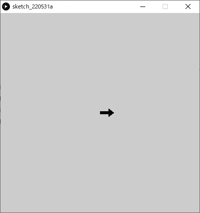

下の答えを見る前にやってみましょう．

```java
/** 矢印を描画する      回転0だと：'→'のように右向き
	引数
		iX:矢印の始点のX座標値
    iY:矢印の始点のY座標値
    iRotateDeg;矢印の回転（°）
    fScale:矢印のスケール値 100%==1.0
*/
void drawArrow( int iX, int iY, int iRotateDeg, float fScale )
{
  pushMatrix();// 座標系を保存
  translate( iX, iY );// 座標系を移動
  rotate( radians(iRotateDeg) );// 座標系を回転
  scale( fScale );// 座標を拡大縮小
  noStroke();
  fill(0,0,0);    // 多角形描画
  beginShape();
  vertex( 0, -iArrowBaseWidth/2 );
  vertex( iArrowBaseHeight, -iArrowBaseWidth/2 );
  vertex( iArrowBaseHeight, -iArrowHeadWidth/2 );
  vertex( iArrowBaseHeight + iArrowHeadHeight, 0 );
  vertex( iArrowBaseHeight, iArrowHeadWidth/2 );
  vertex( iArrowBaseHeight, iArrowBaseWidth/2 );
  vertex( 0, iArrowBaseWidth/2 );
  endShape(CLOSE);
  popMatrix();// 座標系を戻す
}
```

#### 3.矢印を使った様々な表現

関数`drawArrow()`を使って色々な描画を試してみましょう．
静止画ならsetup()内，アニメーションさせたいならdraw()内で呼び出しましょう．

- for文で矢印を繰り返し描画
- 回転させながら複数の矢印を描画
- draw()内で呼び出し，アニメーションを行う．

また，以下の部分の数値を変更することで矢印のプロポーションを変更できる．

```java
int iArrowBaseWidth = 10;    // 矢印の基部の幅
int iArrowBaseHeight = 35;   // 矢印の基部の高さ
int iArrowHeadWidth = 30;    // 矢印の頭部の幅
int iArrowHeadHeight = 20;   // 矢印の頭部の高さ
```


##### 例:回転

```java
// seup()かdraw()に以下を記述
for( int iRotateDeg = 0; iRotateDeg < 360; iRotateDeg+=40 ) // 40°ずつ回転させながら360°描画
{
  drawArrow(width/2,height/2,iRotateDeg);// 回転した角度だけ矢印の向きを回転させる.
}
```


##### 例:円周上に並べる

```java
// seup()かdraw()に以下を記述
translate(width/2,height/2);
for( int iRotateDeg = 0; iRotateDeg < 360; iRotateDeg+=18 )	// 20回繰り返す
{
  drawArrow(185,0,95); //中心からの距離:185, 矢印の向き95°
  rotate(radians(18)); //座標系を18°回転
}
```


##### 例:並進

```java
// seup()かdraw()に以下を記述
for( int iArrowIdx = 0; iArrowIdx < 48; iArrowIdx++ )	// 48回繰り返す
{
  int iColumn = iArrowIdx%6;	// 列番号0~	%:割り算の余り
  int iRow = iArrowIdx/6;		  // 行番号0~
  int iX = 20+60*iColumn+50*(iRow%2);	// 奇数の行番号は50右にずらす
  int iY = 20+50*iRow;
  int iRotateDegree = 180*(iRow%2);		// 奇数の行番号は180°回転
  drawArrow(iX,iY,iRotateDegree);
}
```

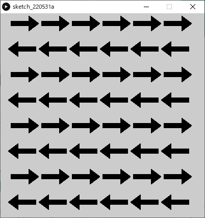

##### 例:並進（拡大縮小あり）

```java
// seup()かdraw()に以下を記述
for( int iArrowIdx = 0; iArrowIdx < 48; iArrowIdx++ )  // 48回繰り返す
{
  int iColumn = iArrowIdx%6; // 列番号0~  %:割り算の余り
  int iRow = iArrowIdx/6;    // 行番号0~
  float fScale = 0.2+iRow/8.0; // スケール値
  int iX = 20+60*iColumn+floor(fScale*50*(iRow%2));  // 奇数の行番号はfScale*50右にずらす
  int iY = 20+50*iRow;
  int iRotateDegree = 180*(iRow%2);                  // 奇数の行番号は180°回転  	
  drawArrow(iX,iY,iRotateDegree,fScale);
}
```


##### 例:移動と跳ね返りアニメーション

```java
// 関数定義以外を以下のように変更する．
int iArrowBaseWidth = 10;    // 矢印の基部の幅
int iArrowBaseHeight = 35;   // 矢印の基部の高さ
int iArrowHeadWidth = 30;    // 矢印の頭部の幅
int iArrowHeadHeight = 20;   // 矢印の頭部の高さ
int  iPosX;      // 矢印の座標
int  iDirctionX; // 進む向き( 1:+X方向, -1:-X方向 )
void setup()
{
  size(400,400);
  colorMode(RGB,100);
  background(100,100,100);
  frameRate(8);
  iPosX = 0;
  iDirctionX  = 1;
}
void draw()
{
  fill( 100, 100, 100 );
  rect( 0, 0, width, height );// スクリーンリフレッシュ
  drawArrow( iPosX, height/2, 90*( 1 - iDirctionX ) );  // 進む方向によって矢印を回転
  iPosX += iDirctionX*8;             // iPosX = iPosX + iDirctionX*4; と同じ
  if( iDirctionX == 1  && iPosX > width-50 ||  // もし，右向きかつ矢印頭がスクリーン端をこえる
      iDirctionX == -1 && iPosX < 50 )         // もしくは，左向きかつ矢印頭スクリーン端を超えたら
  {
    iDirctionX *= -1;  // 向きを逆方向に変える(-1をかける)
  }
}
```

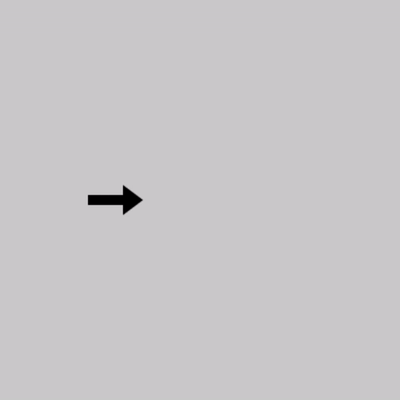


#### まとめ

関数に複雑な図形描画をまとめると，

- それを使って様々なレイアウトを行いやすくなる．
- 機能の追加がしやすくなる．
- 関数定義部分を移植（コピペ）することで，使い回しができる．


### サンプル集

#### アニメーション複製描画

```java
int iFPS = 20; // アニメーション用変数
int iAnimMouthDeg; // 0~360
void setup()
{
  size( 400, 400 );
  frameRate(iFPS);
  iAnimMouthDeg = 0;
}
void draw()
{
  fill(60,60,60);
  noStroke();
  rect(0,0,width,height); // 口の開き具合(cos,sin)
  float fMouthOpenCos = (1 + cos(radians(iAnimMouthDeg)))/2.0; //cos単振動(0~1)
  float fMouthOpenSin = (1 + sin(radians(iAnimMouthDeg)))/2.0; //sin単振動(0~1)
  // 顔を並べて描画
  translate( 40, 40 );
  for( int iFaceIdx=0; iFaceIdx<25; iFaceIdx++)// 25回繰り返し
  {
    int iColumn = iFaceIdx%5;
    int iRow    = iFaceIdx/5;        // 口の開き具合(cos,sin)どちらの値を使うか
    float fMouthOpen = 0.0;
    if( iRow%2==0 )// 行番号が奇数なら
    {
      fMouthOpen = fMouthOpenCos;
    }
    else
    {
      fMouthOpen = fMouthOpenSin;
    }
    // 顔の描画
    drawFace( 80*iColumn,80*iRow,fMouthOpen );
  }
  //アニメーション用変数更新
  if( iAnimMouthDeg > 360 )
  {
    iAnimMouthDeg-= 360;
  }
  else
  {
    iAnimMouthDeg +=4;// 4°進める
  }
}
/**    顔を描画する
	引数
  	fX:顔の中心の座標値
    fY:
    fMouthOpen:口の開き具合(0~1)
    fScale;スケール値
*/
void drawFace( float fX, float fY, float fMouthOpen )
{
  pushMatrix();//座標系保存
  stroke(0,0,0);
  fill(255,255,255);
  ellipse( fX, fY, 80, 80 );  // 輪郭
  fill(255,255,255);
  ellipse( fX-20, fY-20, 8, 8 );// 目
  ellipse( fX+20, fY-20, 8, 8 );// 口
  //   位置調整のため，細かい数値が入っています．
  float fBeginDeg = 60 - 60*fMouthOpen;
  float fEndDeg = 120 + 60*fMouthOpen;
  float fMouthY = fY-10+16*fMouthOpen;
  float fEllipseWidth = 60-20*fMouthOpen;
  fill(255,0,0);
  arc( fX, fMouthY, fEllipseWidth, 40, radians(fBeginDeg), radians(fEndDeg), CHORD );
  popMatrix();//座標系戻す
}
```


#### 共通する処理の関数化

サイン波とコサイ波のアニメーション

```java
int iAnimDegree;  // アニメーション用
void setup()
{
  size( 400, 200 );
  strokeWeight( 4 );
  frameRate(20);
  iAnimDegree = 0;
}
void draw()
{
  noStroke();
  fill(0,0,0);
  rect(0,0,width,height);    // 波長アニメーション
  float fAnimPhaseShift = radians(iAnimDegree);  // 振幅アニメーション
  float fAnimAmplitudeSin = 50+50*sin(radians(iAnimDegree));
  float fAnimAmplitudeCos = 50+50*cos(radians(iAnimDegree));    // cos波
  stroke(255,0,0);
  drawWaveCos( fAnimPhaseShift, fAnimAmplitudeCos, 400 );    // sin波
  stroke(0,0,255);
  drawWaveSin( fAnimPhaseShift, fAnimAmplitudeSin, 400 );
  if( iAnimDegree > 360 )// 360超えたらリセット
  {
    iAnimDegree-=360;
  }
  else
  {
    iAnimDegree+=8;//毎フレーム8加算
  }
}
/** 波をスクリーン全体に描画する
	params
  	fPhaseShift: 位相のズレ(ラジアン)
    fAmplitude:  振幅
    fWaveLength: 波長
*/
void drawWaveCos( float fPhaseShift, float fAmplitude, float fWaveLength )
{
  for( int iX=0; iX < width; iX++ )
  {
    float fPhaseRad0 = calcWavePhase( iX, fWaveLength )+fPhaseShift;
    float fPhaseRad1 = calcWavePhase( iX+1, fWaveLength )+fPhaseShift;
    line( iX, height/2 + fAmplitude*cos( fPhaseRad0 ),iX+1, height/2 + fAmplitude*cos( fPhaseRad1 ) );  
  }
}
void drawWaveSin( float fPhaseShift, float fAmplitude, float fWaveLength )
{
  for( int iX=0; iX < width; iX++ )
  {
    float fPhaseRad0 = calcWavePhase( iX, fWaveLength )+fPhaseShift;
    float fPhaseRad1 = calcWavePhase( iX+1, fWaveLength )+fPhaseShift;
    line( iX, height/2 + fAmplitude*sin( fPhaseRad0 ), iX+1, height/2 + fAmplitude*sin( fPhaseRad1 ) );  
  }
}
/** 波の位相を計算し，返す
	params
  	iX:スクリーンのX座標値
    fWaveLength:波長
    return:　位相(ラジアン値)
*/
float calcWavePhase( int iX, float fWaveLength )
{
  return TWO_PI * iX / fWaveLength;
}
```


# 再帰

## 再帰 Recursive

自身が，自分自身を参照してしまうような状態．

### 身の回りの再帰的現象


### フラクタル

フラクタルは再帰的であり，かつ部分と全体が同じ構造となっている．（自己相似）


### レイトレーシング

CGにおける描画法の一種であるレイトレーシングも再帰呼び出しを用いる．


## 再帰呼び出し Recursive Call

- **関数内で自分自身の関数を呼び出す**こと．
- 無限ループを避けるため，呼び出しを終える**条件式**が必要．
  - **仮引数**を使って，適切に条件式を記述する必要がある．

### 利点

繰り返し処理をスマートに記述する．

### 大切なこと

- イメージをつかむこと．
  - 事前に全てを把握して作ることは難しい．
- シンプルに，どういう処理を繰り返したいかを考える．

### 再帰呼び出し関数の定義

#### 書式1

再帰を**続ける**条件式を記述する方法．

```java
void 関数名( 仮引数の型 仮引数 ){    // ※ここに図形描画命令文(仮引数を使う)        if( 再帰を続ける条件式 )	// 真(True)なら再帰を続ける    {        関数名( 引数 );	// 関数function内で同じfunctionを呼び出す．    }}
```

#### 書式2

再帰を**終える**条件式を記述する方法．

```java
void 関数名( 仮引数の型 仮引数 ){    // ※ここに図形描画命令文(仮引数を使う)        if( 再帰を終える条件式 )	// 真(True)なら再帰を終える    {        return; // return文をこのように書くことで，ここで関数処理を終了できる．    }    関数名( 引数 );	// 関数function内で同じfunctionを呼び出す．}
```

#### 例

- 関数recursiveFuncが繰り返されるたび，引数が1ずつ減っていく
- 仮引数が0のとき，再帰呼び出しが終了する．

```java
/** 関数recursiveFuncの定義 */void recursiveFunc(int iLevel){  if( iLevel>0 )  //もしiLevelの数値が0より大きければ  {    recursiveFunc(iLevel-1);  //関数recursiveFuncの再帰呼び出し（引数iLevel-1）  }}
```

#### 再帰呼び出しを複数回行う

関数内で，再帰呼び出しを複数回同時に行ってもよい．
**再帰を枝分かれ**させることができる．

```java
/** 関数recursiveFuncの定義 */void recursiveFunc(int iLevel){  if( iLevel>0 )  //もしiLevelの数値が0より大きければ  {    recursiveFunc(iLevel-1);  //関数recursiveFuncの再帰呼び出し（引数iLevel-1）    recursiveFunc(iLevel-1);  //関数recursiveFuncの再帰呼び出し（引数iLevel-1）    recursiveFunc(iLevel-1);  //関数recursiveFuncの再帰呼び出し（引数iLevel-1）  }}
```


### 再帰呼び出し関数の使用

再帰呼び出し関数も関数であるので，setup関数やdraw関数から呼びだして使う必要がある．
この時の**引数**により，**再帰呼び出しの回数**を変えることができる．
以下の例だと，**5回**再帰呼び出しを行う．

```java
void setup(){  recursiveFunc(5);  //関数recursiveFuncの呼び出し（引数5を渡す）}/** 関数recursiveFuncの定義 */void recursiveFunc(int iLevel){  if( iLevel>0 )  //もしiLevelの数値が0より大きければ  {    recursiveFunc(iLevel-1);  //関数recursiveFuncの再帰呼び出し（引数iLevel-1）  }}
```

### ダメな例

再帰を続ける，または終える**条件式を適切に記述しなければ**，
**無限ループとなりプログラムが暴走してしまう**ので，注意．

```java
// ※このまま実行するとプログラムが暴走するので，実行しないようにvoid setup(){  recursiveRect(5);}/** 関数recursiveFuncの定義 */void recursiveRect(int iLevel){  rect( 0, 0, 10*iLevel, 10*iLevel ); // 矩形描画    // ※注意　再帰を続ける，または終える条件式を書いていない    recursiveRect();}
```

### 例

**5段階**まで再帰呼び出しを行う指定をした例である。

```java
void setup(){  recursiveFunc(5);  //関数recursiveFuncの呼び出し（引数5を渡す）}/** 関数recursiveFuncの定義 */void recursiveFunc(int iLevel){  if( iLevel>0 )  //もしiLevelの数値が0より大きければ  {    recursiveFunc(iLevel-1);  //関数recursiveFuncの再帰呼び出し（引数iLevel-1）  }}
```

#### 1. setup()から関数recursiveFunc(5)の呼び出し．

※**コールスタック**とは，関数呼び出しの階層状態を表示したもの．


#### 2. recursiveFunc(5)内の処理．


#### 3. recursiveFunc(4)の呼び出し．


#### 4. recursiveFunc(4)内の処理．


#### 5. recursiveFunc(3)の呼び出し．


#### 6. 関数recursiveFuncの呼び出しを繰り返す．（引数~0まで）


#### 7. recursiveFunc(0)内の処理


#### 8. recursiveFunc(0)の終了


#### 9. recursiveFunc(1)~recursiveFunc(5)が順次終了していく．


#### 10. setup()内の呼び出し元に戻る


## 例

### 矩形の再帰的描画

```java
void setup(){  size(400,400);    recursiveRects(5);  //関数recursiveFuncの呼び出し（引数5を渡す）}/** 関数recursiveRectsの定義 */void recursiveRects(int iLevel){  // iLevelに応じて大きさを変える.  rect( 50, 50, 50*iLevel, 50*iLevel );// 矩形描画.    if( iLevel>0 )  //もしiLevelの数値が0より大きければ  {    recursiveRects(iLevel-1);  //関数recursiveRectsの再帰呼び出し（引数iLevel-1）  }}
```


### 楕円の再帰的描画

```java
void setup(){  background(255);  size(400,400);    translate(width/2,height/2); // 原点をスクリーン中心に移動  recursiveEllipses(18);       // 関数recursiveEllipsesの呼び出し（引数16を渡す）}/** 関数recursiveEllipsesの定義 */void recursiveEllipses(int iLevel){  fill( 60+10*iLevel ); // 色    // iLevelに応じて指数的な増加.  ellipse( pow(1.4,iLevel), 0, 4+pow(1.5,iLevel), 4+pow(1.5,iLevel) );// 楕円描画.    if( iLevel>0 )  //もしiLevelの数値が0より大きければ  {    recursiveEllipses(iLevel-1);  //関数recursiveRectsの再帰呼び出し（引数iLevel-1）  }}
```


## 演習1

深度レベル5まで繰り返す再帰呼び出し関数を作り，簡単な描画を試す．

### 1. setup()を記述

- **draw()は今回不要**

- スクリーンサイズ：400×400

下の答えを見る前にやってみましょう．

```java
void setup(){  size( 400, 400 );}
```

### 2. 再帰関数の定義

再帰関数の定義は，関数定義と同じ書式です．
ブロック内の命令以外の枠だけ用意しましょう．

- 関数名：drawRecursive
- 仮引数：iLevel
- 返り値：なし

下の答えを見る前にやってみましょう．

```java
void setup(){  size( 400, 400 );}void drawRecursive( int iLevel ){}
```

### 3. setup()から再帰関数を呼ぶ(使う)

- setup()内で，作成した再帰関数drawRecursive()を呼びましょう．
  - 引数：`5`

```java
void setup(){  size( 400, 400 );    drawRecursive( 5 );}void drawRecursive( int iLevel ){}
```

### 4.再帰の続行条件を設定する

- 関数drawRecursive()内で，**再帰呼び出し**を行いましょう．
  - 引数：`iLevel-1`

- また，この再帰呼び出しを以下の条件の時にしか行わないようにしましょう．
  - 仮引数`iLevel`の値が0より大きいとき

下の答えを見る前にやってみましょう．

```java
// 再帰呼び出しの最もシンプルなテンプレート.void setup(){  size( 400, 400 );      drawRecursive(5);  //関数recursiveFuncの呼び出し（引数5を渡す）}/** 関数drawRecursiveの定義 */void drawRecursive(int iLevel){  // ここで(仮引数を使った)描画を行う.      if( iLevel>0 )  //もしiLevelの数値が0より大きければ  {    drawRecursive(iLevel-1);  //drawRecursiveの再帰呼び出し（引数iLevel-1）  }}
```

### 5.描画

drawRecursive内に何か自由に描画を行ってみましょう．

- 仮引数`iLevel`を座標や大きさの指示に使う．
- 再帰最大レベルを(5から)より大きな値に変更する．

余裕がある人は

- 仮引数を増やして表現の幅を広げてみましょう
- 再帰呼び出しを複数行ってみましょう.
  - drawRecursive内のdrawRecursive呼び出しを複数行う．

#### 例

```java
void setup(){  size( 400, 400 );  colorMode(HSB,4, 40, 40 );  background( 0, 0, 0 );  drawRecursive(80);  //関数recursiveFuncの呼び出し（引数80を渡す）}void drawRecursive(int iLevel){  // ここで(仮引数を使った)描画を行う.  noStroke();  fill( 2, 40, 50-iLevel );  rectMode(CENTER);  rect( 150+pow( 1.13, iLevel), 50+pow( 1.15, iLevel), 2+pow( 1.16, iLevel), 2+pow( 1.15,iLevel) );      if( iLevel>0 )  //もしiLevelの数値が0より大きければ  {    drawRecursive(iLevel-1);  //drawRecursiveの再帰呼び出し（引数iLevel-1）  }}
```


## 演習2

曼荼羅のような図形の描画
シェルピンスキーのカーペット


### 描画を単位で考える

左の図が再帰的に繰り返される．


### 1. setup()を記述

- **draw()は今回不要**

- スクリーンサイズ：1000×1000
- **矩形の座標を中心点で指定**
  - `rectMode(CENTER)`

下の答えを見る前にやってみましょう．

```java
void setup(){  size(1000, 1000);  rectMode(CENTER); // 矩形の座標を中心点で指定}
```

### 2. 再帰関数の定義

再帰関数の定義は，関数定義と同じ書式です．
ブロック内の命令以外の枠だけ用意しましょう．

- 関数名：drawMandara
- 仮引数：iLevel
- 返り値：なし

下の答えを見る前にやってみましょう．

```java
void setup(){  size(1000, 1000);  rectMode(CENTER); // 矩形の座標を中心点で指定}void drawMandara( int iLevel ){  }
```

### 3. setup()から再帰関数を呼ぶ(使う)

setup()内で，作成した再帰関数drawMandara()を呼びましょう．

- 引数：`5`

```java
void setup(){  size(1000, 1000);  rectMode(CENTER); // 矩形の座標を中心点で指定      drawMandara(5);}void drawMandara( int iLevel ){  }
```

### 4. 再帰の続行条件を設定する

- 関数drawMandara()内で，**再帰呼び出し**を行いましょう．
  - 引数：`iLevel-1`

- また，この再帰呼び出しを以下の条件の時にしか行わないようにしましょう．
  - 仮引数`iLevel`の値が0より大きいとき

下の答えを見る前にやってみましょう．

```java
void setup(){  size(1000, 1000);  rectMode(CENTER); // 矩形の座標を中心点で指定      drawMandara(5);}void drawMandara( int iLevel ){    if( iLevel>0 )  //もしiLevelの数値が0より大きければ  {    drawMandara(iLevel-1);  //drawMandaraの再帰呼び出し（引数iLevel-1）  }}
```

### 5. 中心の大きな矩形の描画


スクリーン中心の大きな矩形を描画しましょう．
スクリーンをX軸方向とY軸方向にそれぞれ**三等分**した領域の真ん中に描画．

**drawMandara()内に記述**

- 変数を用意
  - `float fRectX = width/2;   // 中央の矩形のX座標値`
  - ` float fRectY = height/2;   // 中央の矩形のY座標値`
  - `float fRectWidth = width/3;   // 中央の矩形の幅`
  - `float fRectHeight = height/3  // 中央の矩形の高さ`
- 座標，大きさを上記の変数で表しましょう．
- 矩形の座標を中心点で指定していることに注意
  - `rectMode(CENTER)`

下の答えを見る前にやってみましょう．

```java
void setup(){  size(1000, 1000);  rectMode(CENTER); // 矩形の座標を中心点で指定    drawMandara(5);}void drawMandara( int iLevel ){   float fRectX = width/2;  float fRectY = height/2;  float fRectWidth = width/3;  float fRectHeight = height/3;    rect(fRectX, fRectY, fRectWidth, fRectHeight); // 中央    if( iLevel>0 )  //もしiLevelの数値が0より大きければ  {    drawMandara(iLevel-1);  //drawMandaraの再帰呼び出し（引数iLevel-1）  }}
```

### 6.  周囲の8つの矩形描画

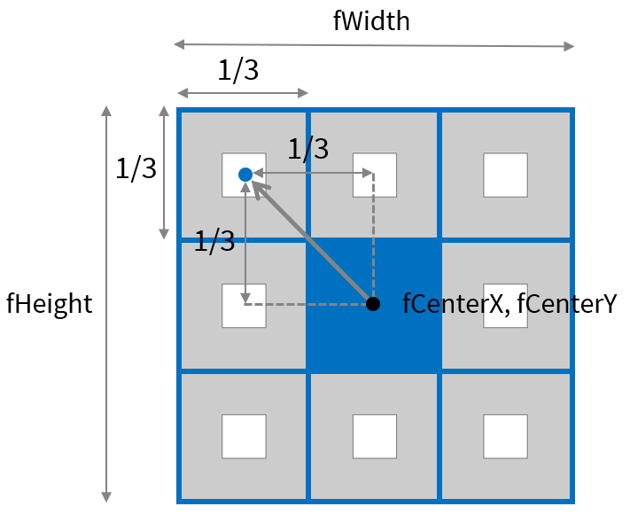

周りの8つの矩形を描画しましょう．
大きな矩形の範囲を，さらにX軸方向とY軸方向にそれぞれ**三等分**した領域の真ん中に描画．

**drawMandara()内に記述**

- 座標，大きさを先ほどの変数と簡単な数値で表しましょう．
  - 大きな矩形と相対的な座標・サイズ
- X軸とY軸のマイナス方向へ向かう際は，値がマイナスになる．
  - 例: `- fRectWidth` , `- fRectHeight`
- 難しい人は，紙にメモやグラフ書きながら．

下の答えを見る前にやってみましょう．

```java
void setup(){  size(1000, 1000);  rectMode(CENTER); // 矩形の座標を中心点で指定    drawMandara(5);}void drawMandara( int iLevel ){  float fRectX = width/2;  float fRectY = height/2;  float fRectWidth = width/3;  float fRectHeight = height/3;    rect(fRectX, fRectY, fRectWidth, fRectHeight); // 中央    // 周りの8つの矩形の描画  rect(fRectX, fRectY-fRectHeight, fRectWidth /3, fRectHeight/3);           //上  rect(fRectX, fRectY+fRectHeight, fRectWidth/3, fRectHeight/3);            //下  rect(fRectX-fRectWidth, fRectY, fRectWidth/3, fRectHeight/3);             //左  rect(fRectX+fRectWidth, fRectY, fRectWidth/3, fRectHeight/3);             //右  rect(fRectX-fRectWidth, fRectY-fRectHeight, fRectWidth/3, fRectHeight/3); //左上  rect(fRectX+fRectWidth, fRectY-fRectHeight, fRectWidth/3, fRectHeight/3); //右上  rect(fRectX-fRectWidth, fRectY+fRectHeight, fRectWidth/3, fRectHeight/3); //左下  rect(fRectX+fRectWidth, fRectY+fRectHeight, fRectWidth/3, fRectHeight/3); //右下      if( iLevel>0 )  //もしiLevelの数値が0より大きければ  {    drawMandara(iLevel-1);  //drawMandaraの再帰呼び出し（引数iLevel-1）  }}
```

### 7. 再帰呼び出し化の考え方

ここから本格的に再帰呼び出しの仕方を考える．

- 実は小さい矩形描画は，大きい矩形描画の繰り返し

- <u>座標</u>と<u>大きさ</u>が違う
  - `fRectX`, `fRectY`, `fRectWidth`, `fRectHeight`
- **（小さな矩形の）座標と大きさを引数として渡す再帰呼び出し**を行えばいいのでは？
  というように，**イメージできればよい**．
  - 細かいところまで全て計算済みである必要はない．


### 8. 再帰関数の引数を追加

- 関数drawMandaraに仮引数を追加．

以下のように書き換えましょう．

```java
void drawMandara( float fRectX, float fRectY, float fRectWidth, float fRectHeight, int iLevel )
```

これに伴い，以下の部分は消去．

```java
  float fRectX = width/2;  float fRectY = height/2;  float fRectWidth = width/3;  float fRectHeight = height/3;
```

- また，これらに代入していた初期値（`width/2`など）を， setup()内の関数drawMandara()呼び出しの引数に設定しましょう．

以下のように書き換えましょう．

```java
drawMandara( width/2, height/2, width/3, height/3, 5);
```

- 以上の変更を行うと実行ができなくなるので，早めに次のステップに進みましょう．

### 9. 再帰呼び出しの変更

**関数drawMandara内で**

- 周りの8つの矩形の描画を`if( iLevel > 0 )`のブロックに移動させましょう．
  同時に，`drawMandara(iLevel-1)`は消去しましょう．

```java
void drawMandara( float fRectX, float fRectY, float fRectWidth, float fRectHeight, int iLevel ){  rect(fRectX, fRectY, fRectWidth, fRectHeight); // 中央        if( iLevel>0 )  //もしiLevelの数値が0より大きければ  {    // 周りの8つの矩形の描画    rect(fRectX, fRectY-fRectHeight, fRectWidth /3, fRectHeight/3);           //上    rect(fRectX, fRectY+fRectHeight, fRectWidth/3, fRectHeight/3);            //下    rect(fRectX-fRectWidth, fRectY, fRectWidth/3, fRectHeight/3);             //左    rect(fRectX+fRectWidth, fRectY, fRectWidth/3, fRectHeight/3);             //右    rect(fRectX-fRectWidth, fRectY-fRectHeight, fRectWidth/3, fRectHeight/3); //左上    rect(fRectX+fRectWidth, fRectY-fRectHeight, fRectWidth/3, fRectHeight/3); //右上    rect(fRectX-fRectWidth, fRectY+fRectHeight, fRectWidth/3, fRectHeight/3); //左下    rect(fRectX+fRectWidth, fRectY+fRectHeight, fRectWidth/3, fRectHeight/3); //右下  }}
```

- 周りの8つの矩形の描画におけるrect関数の呼び出しを，drawMandara関数の呼び出しに置き換えましょう
  - `rect`を`drawMandara`に書き換える
  - 引数の最後に，仮引数`iLevel`に渡す引数を追加
    - 値：`iLevel-1`

下の答えを見る前にやってみましょう．

```java
void setup(){  size(1000, 1000);  rectMode(CENTER); // 矩形の座標を中心点で指定    drawMandara( width/2, height/2, width/3, height/3, 5);}void drawMandara( float fRectX, float fRectY, float fRectWidth, float fRectHeight, int iLevel ){    rect(fRectX, fRectY, fRectWidth, fRectHeight); // 中央  if( iLevel > 0 )  {       // 周りの8つの矩形の描画     drawMandara(fRectX, fRectY-fRectHeight, fRectWidth /3, fRectHeight/3, iLevel-1);           //上    drawMandara(fRectX, fRectY+fRectHeight, fRectWidth/3, fRectHeight/3, iLevel-1);            //下    drawMandara(fRectX-fRectWidth, fRectY, fRectWidth/3, fRectHeight/3, iLevel-1);             //左    drawMandara(fRectX+fRectWidth, fRectY, fRectWidth/3, fRectHeight/3, iLevel-1);             //右    drawMandara(fRectX-fRectWidth, fRectY-fRectHeight, fRectWidth/3, fRectHeight/3, iLevel-1); //左上    drawMandara(fRectX+fRectWidth, fRectY-fRectHeight, fRectWidth/3, fRectHeight/3, iLevel-1); //右上    drawMandara(fRectX-fRectWidth, fRectY+fRectHeight, fRectWidth/3, fRectHeight/3, iLevel-1); //左下    drawMandara(fRectX+fRectWidth, fRectY+fRectHeight, fRectWidth/3, fRectHeight/3, iLevel-1); //右下  }}
```


## 演習3

木のような図形の描画


### 1. setup()を記述

- **draw()は今回不要**

- スクリーンサイズ：1000×1000

下の答えを見る前にやってみましょう．

```java
void setup(){  size(1000, 1000);}
```

### 2. 再帰関数の定義

再帰関数の定義は，関数定義と同じ書式です．
ブロック内の命令以外の枠だけ用意しましょう．

- 関数名：drawTree
- 仮引数：iLevel
- 返り値：なし

下の答えを見る前にやってみましょう．

```java
void setup(){  size(1000, 1000);}void drawTree( int iLevel ){  }
```

### 3. setup()から再帰関数を呼ぶ(使う)

setup()内で，作成した再帰関数drawTree()を呼びましょう．

- 引数：`10`

```java
void setup(){  size(1000, 1000);      drawTree(10);}void drawTree( int iLevel ){  }
```

### 4. 再帰の続行条件を設定する

- 関数drawTree()内で，**再帰呼び出し**を行いましょう．
  - 引数：`iLevel-1`

- また，この再帰呼び出しを以下の条件の時にしか行わないようにしましょう．
  - 仮引数`iLevel`の値が0より大きいとき

下の答えを見る前にやってみましょう．

```java
void setup(){  size(1000, 1000);      drawTree(10);}void drawTree( int iLevel ){    if( iLevel>0 )  {    drawTree(iLevel-1);  }}
```

### 5. 最初の枝を描画する

#### sin,cos関数を使った線の回転

今回は座標変換よりこちらのほうがシンプルに書けるので，こちらを使います．


#### 最初の枝の考え方


- 変数を作る

以下のコードを関数drawTree内に記述しましょう．

```java
  float fStartX = width/2;	// 始点X  float fStartY = height;	// 始点Y  float fLength = 200;		// 長さ   float fAngle = -90;		// 角度
```

- 終点の座標を考える．

以下のように終点座標の変数を用意し，上記の変数を使って座標値の計算式を書いてみましょう．

```JAVA
float fEndX = /* ここの部分を考えて書いてみましょう */;	// 終点Xfloat fEndY = /* ここの部分を考えて書いてみましょう */;	// 終点Y
```

- 描画関数lineを記述

始点と終点の変数を使って，以下のように描画処理を記述しましょう．

```java
line( fStartX, fStartY, fEndX, fEndY );
```

以下の答えを見る前にやってみましょう．

```java
void setup(){  size(1000, 1000);      drawTree(10);}void drawTree( int iLevel ){  float fStartX = width/2;  float fStartY = height;  float fLength = 200;  float fAngle = -90;    float fEndX = fStartX+fLength*cos(radians(fAngle));  float fEndY = fStartY+fLength*sin(radians(fAngle));    line( fStartX, fStartY, fEndX, fEndY );    if( iLevel>0 )  {    drawTree(iLevel-1);  }}
```

### 6. 2本目以降の枝描画を考える


- 前回の枝の終点が次の枝の始点になる
- 長さが0.75倍になる
- 角度が±20°

以下のように，変数を関数の仮引数へ変更する．

```java
drawTree( float fStartX, float fStartY, float fLength, float fAngle, int iLevel )
```

これに伴い，以下の変数の宣言を消去する．

```java
  float fStartX = width/2;  float fStartY = height;  float fLength = 200;  float fAngle = -90;
```

変数の初期値として代入していた値を，setup関数内での関数呼び出しの引数にする．

```java
drawTree( width/2, height, 200, -90, 10);
```

以上の手順により，以下のようになります．
このままだとエラーで実行できないので，次の手順に進みましょう．

```java
void setup(){  size(1000, 1000);      drawTree( width/2, height, 200, -90, 10);}void drawTree( float fStartX, float fStartY, float fLength, float fAngle, int iLevel ){  float fEndX = fStartX+fLength*cos(radians(fAngle));  float fEndY = fStartY+fLength*sin(radians(fAngle));    line( fStartX, fStartY, fEndX, fEndY );        if( iLevel>0 )  {    drawTree( iLevel-1 );  }}
```

### 7. 再帰呼び出しの変更

以下の再帰呼び出しの部分も書き換えなければいけないが，どのように書き換えればいいか考えてみましょう．

```java
drawTree( iLevel-1 );
```

ヒントとしては

- 再帰呼び出しにより，２本に枝分かれさせる

  - 前回の枝の終点が，次の枝の始点になる．
  - 長さが0.75倍になる．
  - 角度が+20°の枝と，-20°の枝に分かれる．

  

下の答えを見る前にやってみましょう．

```java
void setup(){  size(1000, 1000);      // 角度:-90°  // 長さ:200  // 始点X:スクリーンの半分  // 始点Y:スクリーン下端  // 再帰の深さ:10まで  drawTree( width/2, height, 200, -90, 10);}/** 木の描画    params    	fStartX :枝の始点座標        fStartY :        fLength :枝の長さ        fAngle  :枝の角度        iLevel  ;再帰の深さ*/void drawTree( float fStartX, float fStartY, float fLength, float fAngle, int iLevel ){  float fEndX = fStartX+fLength*cos(radians(fAngle));  float fEndY = fStartY+fLength*sin(radians(fAngle));    line( fStartX, fStartY, fEndX, fEndY );        if( iLevel>0 )  {    drawTree( fEndX, fEndY, fLength*0.75, fAngle+20, iLevel-1);    drawTree( fEndX, fEndY, fLength*0.75, fAngle-20, iLevel-1);  }}
```

### 8. 形状の変化

以下の値を変えることで，形状の変化を操作できる．
いろいろ試してみましょう．

- 最初の始点の座標値
  - 初期値: `width/2, height`
- 最初の枝の角度
  - 初期値: `90°`
- 枝の基本の長さ
  - 初期値: `200`
- 再帰呼び出し毎にかける長さの倍率
  - 初期値: `0.75`
- 再帰呼び出し毎に加算する角度
  - 初期値: `+20°`, `-20°`
- 再帰の最大の深さ
  - 初期値: `10`

#### 例

```java
void setup(){  size(1000, 1000);      // 角度:-40°  // 長さ:400  // 始点X:0  // 始点Y:スクリーン下端  // 再帰の深さ:12まで  drawTree( 0, height, 400, -40, 12);}/** 木の描画    params      fStartX :枝の始点座標        fStartY :        fLength :枝の長さ        fAngle  :枝の角度        iLevel  ;再帰の深さ*/void drawTree( float fStartX, float fStartY, float fLength, float fAngle, int iLevel ){  float fEndX = fStartX+fLength*cos(radians(fAngle));  float fEndY = fStartY+fLength*sin(radians(fAngle));    line( fStartX, fStartY, fEndX, fEndY );        if( iLevel>0 )  {    drawTree( fEndX, fEndY, fLength*0.65, fAngle+10, iLevel-1);    drawTree( fEndX, fEndY, fLength*0.6, fAngle-40, iLevel-1);  }}
```


## サンプル集

### 三角形

シェルピンスキーのギャスケットと同様の模様が生成される．

```java
void setup(){  size(400,400);    recursiveTriangle( width/2, height/1.7, width );}void draw(){}void recursiveTriangle( float fX, float fY, float fWidth ){  if( fWidth < 4 )  {    return;  }    float fIncircleRadius = (fWidth/2.0) * tan(radians(30));// 三角形の内接円の半径  float fHeight = fWidth * sin(radians(60));// 三角形の高さ    triangle( fX, fY-(fHeight-fIncircleRadius),            fX+fWidth/2.0, fY+fIncircleRadius,            fX-fWidth/2.0, fY+fIncircleRadius );    // 上，左下，右下に新たに描画.  recursiveTriangle( fX, fY- fIncircleRadius, fWidth/2.0 );  recursiveTriangle( fX+fIncircleRadius*cos(radians(30)), fY+fIncircleRadius*sin(radians(30)), fWidth/2.0);  recursiveTriangle( fX-fIncircleRadius*cos(radians(30)), fY+fIncircleRadius*sin(radians(30)), fWidth/2.0);}
```


### 黄金比

```java
void setup(){  size(810,500);  drawGoldenRect( height, 10 );  }void draw( ){}/**    黄金長方形を再帰的に描画する        黄金比 1:1.618        params          fRectSize: 正方形のサイズ          iLevel   ; 再帰を行う深さ*/void drawGoldenRect( float fRectSize, int iLevel ){  stroke(0,0,0);  rect( 0, 0, fRectSize, fRectSize );// 正方形    // 90°円弧  stroke(0,0,255);  arc( fRectSize, fRectSize, 2*fRectSize, 2*fRectSize, radians(180), radians(270), PIE);    if( iLevel > 0 )  {    // 座標変換    translate(fRectSize*1.618,0); // X軸方向に正方形のサイズの1.618倍移動する    rotate(radians(90));          // 90°回転        drawGoldenRect( fRectSize*0.618, iLevel-1 );  }}
```

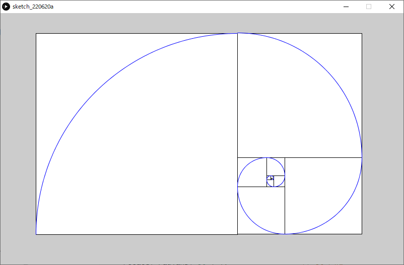

### ハノイの塔

以下のルールに従ってすべての円盤を右端の杭に移動させられれば完成．

- 3本の杭と，中央に穴の開いた大きさの異なる複数の円盤から構成される．
- 最初はすべての円盤が左端の杭に小さいものが上になるように順に積み重ねられている．
- 円盤を一回に一枚ずつどれかの杭に移動させることができるが，小さな円盤の上に大きな円盤を乗せることはできない．

```java
int iDiscHeight = 20;                       // ディスクの高さ.int[] iDiscWidth = { 20, 40, 60, 80, 100 }; // 各ディスクの幅.int iWaitFrames = 6;                  // アニメーション開始までの待機フレーム数. int[][] iQueueDiscs = new int[3][5];  // アニメーション用現在のディスクの位置.int[][] iAnimMove = new int[100][2];  // ハノイの塔の動かす手順(回答).int iAnimMoveIdx;  // 現在の手順番号.int iMoveCount;    // 手順の数. void setup(){  size(600,400);  colorMode( HSB, 5, 1, 1 );  frameRate(1);    for( int iABC = 0; iABC<iQueueDiscs.length; iABC++ )  {    for( int iDepth = 0; iDepth<iQueueDiscs[iABC].length; iDepth++ )    {      iQueueDiscs[iABC][iDepth] = 0;    }  }  iQueueDiscs[0][0] = 5;  iQueueDiscs[0][1] = 4;  iQueueDiscs[0][2] = 3;  iQueueDiscs[0][3] = 2;  iQueueDiscs[0][4] = 1;    iAnimMoveIdx = 0;  iMoveCount = 0;    // 事前にハノイの塔の回答手順を計算.  //   iAnimMove[][]に手順を保存.  hanoi( 5, 0, 1, 2 );  }void draw( ){    // スクリーンリフレッシュ  fill(1,0,1);  noStroke();  rectMode(CORNER);  rect(0,0,width,height);  // ハノイの塔を描画  //  現在の配列iQueueDiscs[][]を元に描画を行う.  drawHanoi();   if( iWaitFrames > 0 )  {    // しばらく動かさずに待つ.         iWaitFrames--;  }  else if( iAnimMoveIdx < iMoveCount )// 手順がまだ残っていたら  {    // ディスクの移動    //  実際に配列iQueueDiscs[][]を操作    moveDisc( iAnimMove[iAnimMoveIdx][0], iAnimMove[iAnimMoveIdx][1] );        // 手順をすすめる.    iAnimMoveIdx++;  }}/** ハノイの塔再帰呼び出し関数        params      iDiscSizeMove: 動かすディスクサイズ(1~5)      iFrom:         移動元  左:0, 中:1, 右:2      iWork:         中継地      iDest:         目的地*/int hanoi( int iDiscSizeMove, int iFrom, int iWork, int iDest ){  // ディスクをiFromからiDest経由でiWorkへ移動させる  if(iDiscSizeMove>=2)  {    hanoi(iDiscSizeMove-1, iFrom, iDest, iWork );  }    // 手順確定  //   ディスクをiFromからiDestへ移動させる  iAnimMove[iMoveCount][0]= iFrom;  iAnimMove[iMoveCount][1]= iDest;  iMoveCount++;      // Move n-1 desks from "work" to "dest" via "from".  // ディスクをiWorkからiFrom経由でiDestへ移動させる  if(iDiscSizeMove>=2)  {    hanoi(iDiscSizeMove-1, iWork, iFrom, iDest);  }    return iMoveCount;}void drawHanoi(){  translate( width/4, height/1.5 );  rectMode(CENTER);  for( int iABC = 0; iABC<iQueueDiscs.length; iABC++ )  {    stroke(0,0,0);    strokeWeight(4);    line( 0, -iDiscHeight*iDiscWidth.length, 0, iDiscHeight/2-2 );        for( int iDepth = 0; iDepth<iQueueDiscs[iABC].length; iDepth++ )    {      int iDiscSize = iQueueDiscs[iABC][iDepth];      if( iDiscSize > 0 )      {        fill(iDiscSize,1,1);        stroke(0,0,0);        strokeWeight(2);        rect( 0, 0-iDepth*iDiscHeight, iDiscWidth[iDiscSize-1], iDiscHeight );      }    }    translate(width/4,0);  }  }void moveDisc( int iABCfrom, int iABCto ){  int iDiscSizeMoved = 0;    // 動かすディスクを取り外す.  int iDepthFrom = iQueueDiscs[iABCfrom].length-1;    while( iDepthFrom>=0 )  {    if( iQueueDiscs[iABCfrom][iDepthFrom] > 0 )    {      iDiscSizeMoved = iQueueDiscs[iABCfrom][iDepthFrom];      iQueueDiscs[iABCfrom][iDepthFrom] = 0;      break;    }    else    {      iDepthFrom--;    }  }    // ディスクを置く  int iDepthTo = iQueueDiscs[iABCto].length-1;  while( iDepthTo>=0 )  {    if( iQueueDiscs[iABCto][iDepthTo] > 0 )    {      break;    }    else    {      iDepthTo--;    }  }  iQueueDiscs[iABCto][iDepthTo+1] = iDiscSizeMoved;  for( int iABC = 0; iABC<iQueueDiscs.length; iABC++ )  {    for( int iDepth = 0; iDepth<iQueueDiscs[iABC].length; iDepth++ )    {      print( iQueueDiscs[iABC][iDepth] + ", ");    }    println("");  }  println("");}
```


### 矩形の再帰的分割描画

```java
final int RECURSIVE_MAX = 10;    // 再帰の最大の深さfinal float DIVIDE_RANGE = 0.6;  // 分割の振れ幅(0~1)final int OFS_X = 10;final int OFS_Y = 10; void setup(){  size(600, 600);  background(255);  noFill();    drawRectDivided( OFS_X, OFS_Y, width-2*OFS_X, height-2*OFS_Y, RECURSIVE_MAX );}// 矩形を分割しながら再帰的に描画void drawRectDivided(float iX, float iY, float fWidth, float fHeight, int iLevel ){   rect( iX, iY, fWidth, fHeight);    if (iLevel>0)  {        if (fWidth>fHeight)    {      //幅が高さよりも大きい、または幅と高さが等しい場合      // 左右に二つに割る            // 割った後の左の矩形の幅      float fWidthLRect = fWidth*random( ( 1 - DIVIDE_RANGE )/2.0, 1 - ( 1 - DIVIDE_RANGE )/2.0 );      drawRectDivided(iX, iY, fWidthLRect, fHeight, iLevel-1);                    //左側の矩形      drawRectDivided(iX+fWidthLRect, iY, fWidth-fWidthLRect, fHeight, iLevel-1); //右側の矩形    }    else    {      //幅が高さよりも小さい場合      // 上下に二つに割る            // 割った後の上の矩形の高さ      float fHeightUpper = fHeight*random( ( 1 - DIVIDE_RANGE )/2.0, 1 - ( 1 - DIVIDE_RANGE )/2.0 );      drawRectDivided(iX, iY, fWidth, fHeightUpper, iLevel-1);                    //上側の矩形      drawRectDivided(iX, iY+fHeightUpper, fWidth, fHeight-fHeightUpper, iLevel-1);    //下側の矩形    }  }}
```


### マンデルブロ集合の描画

フラクタル図形の一種

```java
final float DRAW_OFS_X = -0.7;                           // 描く領域のオフセットXfinal float DRAW_OFS_Y = 0;                              // 描く領域のオフセットYfinal float DRAW_SCALE = 1.4;                            // 描く領域のスケール final int RECURSIVE_MAX = 50;                            // 繰り返し上限回数final float DRAW_SIZE = 4;                               // 描く領域の一辺の長さ void setup(){  size(600,600);  colorMode(HSB,RECURSIVE_MAX,1,1);  background(0,0,0);    // マンデルブロ集合の描画  for (int iPixelX = 0; iPixelX < width; iPixelX++)  // x（実部）方向のループ  {    float fCReal = iPixelX * DRAW_SIZE/( width*DRAW_SCALE) - DRAW_SIZE/(2*DRAW_SCALE) + DRAW_OFS_X;     // 定数Cの実部        for (int iPixelY = 0; iPixelY < height; iPixelY++)  // y（虚部）方向のループ    {      float fCImaginary = iPixelY * DRAW_SIZE/( height*DRAW_SCALE) - DRAW_SIZE/(2*DRAW_SCALE) + DRAW_OFS_Y; // 定数Cの虚部              drawFractal( 0, 0, fCReal, fCImaginary, iPixelX, iPixelY, RECURSIVE_MAX ) ;    }  }}/**  フラクタル図形の描画      内部でZ^2+Cの計算を行い，絶対値が4を超えたピクセルを描画する.  */void drawFractal( float fZReal, float fZImaginary, float fCReal, float fCImaginary, int iPixelX, int iPixelY, int iLevel ){  float fZRealNew = pow(fZReal,2) - pow(fZImaginary,2) + fCReal;     // z^2+Cの計算（実部）  float fZImaginaryNew = 2 * fZReal * fZImaginary + fCImaginary;     // z^2+Cの計算（虚部）    if( pow(fZRealNew,2)+pow(fZImaginaryNew,2) > 4 )  // もし絶対値が2を（絶対値の2乗が4を）超えていたら  {      stroke( iLevel, 1, 1 );             // 再帰の回数を色相へ      point(iPixelX,iPixelY);             // (iPixelX,iPixelY)の位置のピクセルをで塗る      return;                             // 再帰終了  }  else if( iLevel > 0 )  {    drawFractal( fZRealNew, fZImaginaryNew, fCReal, fCImaginary, iPixelX, iPixelY, iLevel-1 );  }}
```


### ジュリア集合の描画

フラクタル図形の一種

```java
final float DRAW_OFS_X = 0;                              // 描く領域のオフセットXfinal float DRAW_OFS_Y = 0;                              // 描く領域のオフセットYfinal float DRAW_SCALE = 1.4;                            // 描く領域のスケール final int RECURSIVE_MAX = 200;                           // 繰り返し上限回数final float DRAW_SIZE = 4;                               // 描く領域の一辺の長さfinal float C_REAL = -0.3;                               // 定数Cの実部final float C_IMAGINARY = -0.63;                         // 定数Cの虚部 void setup(){  size(600,600);  colorMode(HSB,RECURSIVE_MAX,1,1);  background(0,0,0);   // ジュリア集合の描画  for (int iPixelX = 0; iPixelX < width; iPixelX++)  // x（実部）方向のループ  {    float fZReal = iPixelX * DRAW_SIZE/( width*DRAW_SCALE ) - DRAW_SIZE/( 2*DRAW_SCALE ) + DRAW_OFS_X;     // 変数Zの実部        for (int iPixelY = 0; iPixelY < height; iPixelY++)  // y（虚部）方向のループ    {      float fZImaginary = iPixelY * DRAW_SIZE/( height*DRAW_SCALE ) - DRAW_SIZE/( 2*DRAW_SCALE ) + DRAW_OFS_Y; // 変数Zの虚部              drawFractal( fZReal, fZImaginary, C_REAL, C_IMAGINARY, iPixelX, iPixelY, RECURSIVE_MAX ) ;    }  }  }/**  フラクタル図形の描画      内部でZ^2+Cの計算を行い，絶対値が4を超えたピクセルを描画する.  */void drawFractal( float fZReal, float fZImaginary, float fCReal, float fCImaginary, int iPixelX, int iPixelY, int iLevel ){  float fZRealNew = pow(fZReal,2) - pow(fZImaginary,2) + fCReal;     // z^2+Cの計算（実部）  float fZImaginaryNew = 2 * fZReal * fZImaginary + fCImaginary;     // z^2+Cの計算（虚部）    if( pow(fZRealNew,2)+pow(fZImaginaryNew,2) > 4 )  // もし絶対値が2を（絶対値の2乗が4を）超えていたら  {      stroke( iLevel, 1, 1 );             // 再帰の回数を色相へ      point(iPixelX,iPixelY);             // (iPixelX,iPixelY)の位置のピクセルをで塗る      return;                             // 再帰終了  }  else if( iLevel > 0 )  {    drawFractal( fZRealNew, fZImaginaryNew, fCReal, fCImaginary, iPixelX, iPixelY, iLevel-1 );  }}
```


# 入力

## マウス

### mouseX, mouseY

- システム変数
- 現在のマウスポインタの座標値が格納されている．

#### 例

```java
void setup(){  size(400, 400);}void draw(){  background(126);  ellipse(mouseX, mouseY, 33, 33);}
```


https://processing.org/reference/mouseX.html
https://processing.org/reference/mouseY.html

### pmouseX, pmouseY

- 直前の描画フレームにおけるマウスポインタの座標値が格納されている．
- マウスポインタを素早く動かすと，`mouseX`, `mouseY` の値との差が大きくなる
  - マウスポインタの移動の**速さ**と**方向**を取得できる

#### 例

```java
void setup({  size(400,400);  strokeWeight(8);  frameRate(20);}void draw(){  background(204);  line(mouseX, mouseY, pmouseX, pmouseY);}
```


https://processing.org/reference/pmouseX.html
https://processing.org/reference/pmouseY.html

### mousePressed

- マウスボタンが押されているか，押されていないかの情報が格納されている．
  - `true` : いずれかのボタンが押されている
  - `false` : どのボタンも押されていない

#### 例

```java
void draw(){  if (mousePressed == true)  {    fill(0);  }  else  {    fill(255);  }  rect(25, 25, 50, 50);}
```


https://processing.org/reference/mousePressed.html

### mouseButton

- マウスボタンが押されると，`LEFT`, `RIGHT`, `CENTER`のいずれかの値が格納される．
- `mousePressed`と組み合わせて使用することが多い
  - 格納された値はマウスの状態が変化するまで残るため

#### 例

```java
void setup(){  size(200, 100);}void draw(){  if( mousePressed == true && mouseButton == LEFT )  {    fill(0);  }  else  {    fill(255);  }  rect(20, 25, 50, 50);  // 左    if( mousePressed == true && mouseButton == CENTER )  {    fill(0);  }  else  {    fill(255);  }  rect(75, 25, 50, 50);  // 中  if( mousePressed == true && mouseButton == RIGHT )  {    fill(0);  }  else  {    fill(255);  }  rect(130, 25, 50, 50);  // 右}
```


https://processing.org/reference/mouseButton.html

https://processing.org/tutorials/interactivity/


## キーボード

### keyPressed

キーが押されているか，押されていないかの情報が格納されている．

- `true` : いずれかのボタンが押されている
- `false` : どのキーも押されていない

### key

- 直前に使用されたキーの値(英数字)が格納される．
- 英数字以外の特別なキー（矢印，Alt, Ctrl, Shift など ）が使用された場合，`CODED`の値が格納される．

#### 例

```java
void setup(){  textSize(60);}void draw(){  background(0);  text(key, 20, 75);}
```


### keyCode

- 英数字以外の特別なキーが押されると，押されたキーの値が格納される．
  - `UP`, `DOWN`, `LEFT`, `RIGHT`, `ALT`, `CONTROL`, `SHIFT` など
- 通常，`if( Key == CODED )`を組み合わせて使用することが多い．

#### 例

```java
int iX = 100;int iY = 100;char cKey;void setup(){  size(200,200);  textSize(60);}void draw(){  background(0);    if( keyPressed == true && key == CODED )  {    switch( keyCode )    {      case LEFT:        cKey = '<';        iX--;        break;      case RIGHT:        cKey = '>';        iX++;        break;      case UP:        cKey = '^';        iY--;        break;      case DOWN:        cKey = 'v';        iY++;        break;    }  }  else  {    cKey = 'o';  }    text(cKey, iX, iY);}
```


# ライブラリの使用

## ライブラリ（Libraries）とは

便利なプログラムの集まりをまとめ，他のプログラムで再利用できるようにしたもの

Processingのライブラリは以下の二種類に分けられる

- Core Libraries
  - Processingに標準でインストールされているライブラリ
  - インポートすればすぐに使用できる．
  - PDF Export, Network, SVG Export, Serial, DXF Export, Video, Sound, Hardware I/O

- Contributed Libraries
  - Processingに標準ではインストールされていない外部ライブラリ
  - インポートの前に，別途インストールが必要

https://processing.org/reference/libraries/

## インストールとインポート

Contributed Librariesを使用するには，事前にインストールする必要があります．
Core Librariesを使用する際は，「1.ライブラリのインストール」の手順はスキップできます．

1. ライブラリのインストール

   - 「スケッチ 」> 「ライブラリをインポート」 > 「ライブラリを追加」

     

   - 「Contribution Manager」から，ライブラリを検索

     

   - インストールしたいライブラリを選択し，インストール開始

     


2. ライブラリのインポート

   - 「スケッチ」メニュー ＞ 「ライブラリをインポート」 ＞ インポートしたいライブラリを選択

   - 上記を選択すると，プログラムの一行目に`import ライブラリ名.*;`の一文が追加される．

     


https://processing.org/reference/libraries/


## GUI

### 概要

- Graphical User Interface
- コンピュータの画面上に表示されるグラフィックスを元に操作を行うインターフェースのこと
- 基本の入力（マウスやキーボード）で実現するのは難しいので，ライブラリを頼る

### 必要なライブラリ

数種類あるのだが，ここでは日本語ドキュメントが豊富なControlP5を使用する．

田所淳（たどころあつし）先生のドキュメントが有名
[yoppa org](https://yoppa.org/)

- ライブラリ名：ControlP5
  - Contributed libraries（インストールの必要あり）

### 導入方法

クラスの概念を理解していないと難しいので，完全に理解する必要はありません．

1. ControlP5を宣言
   GUIのすべてのパーツを管理するオブジェクト

   `ControlP5 cp5;`

2. GUIパーツを宣言
   パーツの種類によって宣言の**型**が異なる

   - `Slider slider; // スライダー `
   - `Slider2D slider2d; // 2Dスライダー `
   - `Toggle toggle; // トグルスイッチ `
   - `ColorWheel colowWheel; // カラーホイール `

3. setup関数内で，ControlP5を初期化

   ` cp5 = new ControlP5(this);`

4. setup関数内で，ControlP5にGUIパーツを追加
   パーツの種類によって書式が異なる

   ```java
   slider = cp5.addSlider("ID")	// スライダー    .setRange(0, 255)   		//値の範囲    .setValue(0)        		//初期値    .setPosition(50, 50)		//表示位置    .setSize(200, 24);  		//スライダの大きさ 
   ```

   ```java
   slider2d = cp5.addSlider2D("ID") // スライダー2D    .setMinMax(0, 5, 255, 250)   //値の範囲    .setValue(0,250)             //初期値    .setPosition(50, 50)         //位置    .setSize(100, 100);          //スライダの大きさ }
   ```

   ```java
   toggle = cp5.addToggle("ANIM") // トグルスイッチ    .setPosition(20, 20)		   //位置    .setSize(24, 24);			   //大きさ
   ```

   ```java
   colWheel = cp5.addColorWheel("RECT COLOR") // カラーホイール    .setPosition(10, 10)     //位置    .setRGB(color(0,0,0));   //初期値 
   ```

### GUIパーツ別の実装方法

#### スライダー

１つのパラメータを制御できる．

##### 例: 矩形の色を変更

```java
import controlP5.*; // ControlP5をcp5として宣言ControlP5 cp5; // スライダーを宣言Slider sliderRectColor; // 矩形の色 void setup(){  size(500, 500);    // ControlP5を初期化  cp5 = new ControlP5(this);    // スライダーを追加  sliderRectColor = cp5.addSlider("RECT COLOR")    .setRange(0, 255)   //0~255の間    .setValue(0)        //初期値    .setPosition(50, 50)//位置    .setSize(200, 24);  //スライダの大きさ } void draw(){  background(255);    // スライダーの値を取得し，fill値を設定  fill(sliderRectColor.getValue());  rect(125, 125, 250, 250);}
```


##### 例: 矩形の色と大きさを変更

```java
import controlP5.*; // ControlP5をcp5として宣言ControlP5 cp5; // スライダーを宣言Slider sliderRectColor; // 矩形の色Slider sliderRectSize; // 矩形の大きさ void setup(){  size(500, 500);    // ControlP5を初期化  cp5 = new ControlP5(this);    // スライダーを追加  sliderRectColor = cp5.addSlider("RECT COLOR")    .setRange(0, 255)   //0~255の間    .setValue(0)        //初期値    .setPosition(50, 50)//位置    .setSize(200, 24);  //スライダの大きさ    sliderRectSize = cp5.addSlider("RECT SIZE")    .setRange(5, 250)   //5~250の間    .setValue(250)      //初期値    .setPosition(50, 80)//位置    .setSize(200, 24);  //スライダの大きさ } void draw(){  background(255);    rectMode(CENTER);  // スライダーの値を取得し，fill値を設定  fill(sliderRectColor.getValue());  // スライダーの値を取得し，矩形の大きさを設定  rect(width/2, height/2, sliderRectSize.getValue(), sliderRectSize.getValue());}
```


#### 2Dスライダー

２つのパラメータを制御できる．

##### 例: 矩形の色と大きさを変更

```java
import controlP5.*; // ControlP5をcp5として宣言ControlP5 cp5; // 2Dスライダーを宣言Slider2D sliderRect; // 矩形の色と大きさ void setup(){  size(500, 500);    // ControlP5を初期化  cp5 = new ControlP5(this);    // スライダーを追加  sliderRect = cp5.addSlider2D("RECT COLOR SIZE")    .setMinMax(0, 5, 255, 250)   // 0~255の間及び5~250の間    .setValue(0,250)             //初期値    .setPosition(50, 50)         //位置    .setSize(100, 100);          //スライダの大きさ } void draw(){  background(255);    rectMode(CENTER);  // スライダーの値を取得し，fill値を設定  fill(sliderRect.getArrayValue()[0]);  // スライダーの値を取得し，矩形の大きさを設定  rect(width/1.5, height/2, sliderRect.getArrayValue()[1], sliderRect.getArrayValue()[1]);}
```


#### トグルスイッチ（Toggle）

スイッチのように，オンかオフかの２値を取得できる．

##### 例: 矩形の移動アニメーションのオンオフ

```java
import controlP5.*; // ControlP5をcp5として宣言ControlP5 cp5; // トグルボタンを宣言Toggle toggleAnim; // アニメーションのon,off int iPosX; void setup(){  size( 400, 400 );  colorMode( RGB, 1, 1, 1 );  noStroke();  frameRate( 20 );    // ControlP5を初期化  cp5 = new ControlP5(this);    // トグルスイッチを追加  toggleAnim = cp5.addToggle("ANIM")    .setPosition(20, 20)//位置    .setSize(24, 24);  //大きさ    iPosX = 0;      // iPosXの初期化}void draw(){  fill( 1, 1, 1 );  rect( 0, 0, width, height );    // もしトグルスイッチがONだったら  if(toggleAnim.getState() )  {    iPosX += 4;  }    if( iPosX > width ) // もしX座標値がスクリーンの外なら  {    iPosX = 0;        // X座標値を0に戻す  }    fill( 0, 0, 0 );  rect( iPosX, height/2-10, 20, 20 );}
```


#### カラーホイール(ColorWheel)

2Dスライダーに近い感覚でカラー値をコントロールできる．

##### 例: 

```java
import controlP5.*; // ControlP5をcp5として宣言ControlP5 cp5; // カラーホイールを宣言ColorWheel colWheelRect; // 矩形の色 void setup(){  size(400, 400);    // ControlP5を初期化  cp5 = new ControlP5(this);    // カラーホイールを追加  colWheelRect = cp5.addColorWheel("RECT COLOR")    .setPosition(10, 10)     //位置    .setRGB(color(0,0,0));   //初期値 } void draw(){  background(155);    // カラーホイールの値を取得し，fill値を設定  fill(colWheelRect.getRGB());  rect(width/1.8, height/1.8, 150, 150);}
```


## キャプチャー

### 概要

コンピューターに接続したキャプチャーデバイス（カメラ）からビデオデータを取得し，ムービーを再生する．

### 必要なライブラリ

- ライブラリ名：Video

  - Core libraries（インストールの必要なし）

#### 対応デバイス

USB Cameras, IEEE 1394 (Firewire) Cameras

### 導入方法

1. キャプチャーデバイス（USBカメラ）をコンピューターに接続する．
   - コンピュータ内蔵カメラの場合は不要
2. 以下のプログラムをProcessingで実行

```java
import processing.video.*; Capture cam; void setup(){  size(640, 480);   String[] cameras = Capture.list();    if (cameras.length == 0)  {    println("There are no cameras available for capture.");    exit();  }  else  {    println("Available cameras:");    for (int i = 0; i < cameras.length; i++)    {      print( "cameras["+i+"]: " );      println(cameras[i]);    }        // The camera can be initialized directly using an     // element from the array returned by list():    cam = new Capture(this, cameras[0]);    cam.start();       }      } void draw(){  if (cam.available() == true)  {    cam.read();  }  image(cam, 0, 0);  // The following does the same, and is faster when just drawing the image  // without any additional resizing, transformations, or tint.  //set(0, 0, cam);}
```


3. 映像が表示されなかった場合，以下のコンソールの表示を確認
   使用したいカメラの要素番号（`cameras[要素番号]`）を確認する．

  

4. 使用したいカメラの要素番号をキャプチャー初期化時に指定するよう，プログラムを書き換える．


  - このサンプルの場合，HD Pro Webcam C920を使いたいので，`cameras[1]`

    

5. 実行して正しくキャプチャーできているか確認する


https://processing.org/reference/libraries/video/Capture.html


### 例

カメラ画像のピクセル情報を取得してモザイク状に描画する．

```java
import processing.video.*; Capture cam; void setup(){  size(640, 480);   String[] cameras = Capture.list();    if (cameras.length == 0)  {    println("There are no cameras available for capture.");    exit();  }  else  {    println("Available cameras:");    for (int i = 0; i < cameras.length; i++)    {      print( "cameras["+i+"]: " );      println(cameras[i]);    }        // The camera can be initialized directly using an     // element from the array returned by list():    cam = new Capture(this, cameras[1]);    cam.start();       }    smooth();  noStroke();} void draw(){  if (cam.available() == true)  {    cam.read();        background(0);    cam.loadPixels();         //カメラ画像のpixel情報をロード    int iDiameter = 20;       //円の直径    // カメラの映像から、円の直径の間隔ごとに色情報を取得し、その色で円を描画    for(int iPixelY = iDiameter / 2 ; iPixelY < height ; iPixelY += iDiameter)    {      for(int iPixelX = iDiameter / 2 ; iPixelX < width ; iPixelX += iDiameter)      {        fill(cam.pixels[iPixelY*width + iPixelX]);        ellipse(iPixelX, iPixelY, iDiameter, iDiameter);      }    }  }}
```


# クラス

## クラスとは

プログラムにおいて，現実世界の物体（オブジェクト）を抽象化した設計図のようなもの

## なぜクラスを学ぶのか

- 現在のソフトウェア開発のメインストリーム
  - **オブジェクト指向プログラミング**
  - C++, C#, Java, Delphi, Smalltalkなど
  
- Processingに限らず，ライブラリの多くはクラスを使用している
  - ControlP5, Capture はクラスである
- プログラミングで，より高度なことを洗練された方法で行いたいなら推奨
  - クラスを使わなければ，プログラムがより複雑に見づらくなっていく

## オブジェクト指向プログラミング

 object-oriented programming (OOP)

### 概念

「犬」を対象とした例

1. （現実世界における）オブジェクトのひな型を定義する．（抽象化）
   - 状態
   
     - 毛並み
   
     - 耳の形
   
     - 尻尾の形
   
   - 振る舞い
   
     - 走る
   
     - 吠える
   
     - 食べる
   
     - 寝る


2. インスタンスを作成（具象化）する．
   - 状態
     - 毛並み：イエロー，クリーム，ブラウン，ブラック
     - 耳の形：立ち耳，垂れ耳，折れ耳
     - 尻尾の形：巻き尾，立ち尾，垂れ尾，リス尾，ボブ


3. インスタンスの振る舞いを実行する．
   - 振る舞い
     - 走る
     - 吠える
     - 食べる
     - 寝る


### キーワード

以下がクラスを習得するのに理解しなければならないキーワード．

- **クラス** `Class`
  - **フィールド** `Field`
  - **メソッド** `Method`
    - **コンストラクタ** `Constructor`

- **インスタンス** `Instance`

### 概念とキーワードの対応

各キーワードは，前述の概念と下記のように対応している．

- **クラス** `Class`：<u>オブジェクトのひな型</u>
  - **フィールド** `Field`：<u>状態</u>
  - **メソッド** `Method`：<u>振る舞い</u>
    - **コンストラクタ** `Constructor`：<u>状態の初期化</u>

- **インスタンス** `Instance`：<u>具象化されたオブジェクト</u>


### クラス「人」の例

#### クラス「人」を定義


##### フィールド

- 身長
- 体重
- 性別
- 血液型．．．

##### メソッド

- 喜ぶ，褒める，照れる，指さす，書く．．．

#### インスタンスを作成

インスタンスは，具象化された特定の人を指す.


##### フィールド

- 身長: 168cm
- 体重: 62kg
- 性別: 男
- 血液型: A

#### インスタンスのメソッドを実行

メインプログラムから任意のタイミングでメソッドを実行する．

##### メソッド

- 喜ぶ，褒める，照れる，指さす，書く．．．


https://processing.org/tutorials/objects/
https://docs.oracle.com/javase/tutorial/java/concepts/index.html


## class

### 概要

- クラスを宣言，定義するためのキーワード．

- クラスは以下のもので構成される
  - フィールド
    - データ（変数や配列）
  - メソッド
    - 関数
    - コンストラクタ（初期化用関数）
- クラスを使うための手順
  1. クラスの定義を行う
  2. クラスのインスタンスを作成する．
  3. インスタンスを初期化する．
  4. インスタンスのメソッドを呼ぶ（Call）

### クラスの定義

##### 書式（全体）

クラス名は**一文字目を必ず大文字**に

```java
class クラス名
{
  /* フィールドの変数を宣言 */
  変数の型 変数名;
 	
  /* コンストラクタの定義 */
  クラス名( 仮引数 )
  {
    // すべてのフィールドの変数を初期化する命令
  }
  
  /* メソッドの定義 */
  void メソッド名( 仮引数 )
  {
    // (命令)文
    //   フィールドの変数にアクセス可  
  }
  返り値の型 メソッド名( 仮引数 )
  {
    // (命令)文
    //   フィールドの変数にアクセス可
  
    return 返り値;
  }
}
```

##### フィールドの変数を宣言

- 従来の変数や配列の宣言文と同様
- 複数の変数を宣言可能

```java
変数の型 変数名;
```

##### コンストラクタの定義

- **クラス名をそのまま関数名**として関数を定義する．
- 関数の**返り値**（voidなど）**の記述を行わない**．

- フィールドの全ての変数を初期化する命令文を記述する．
- 仮引数は任意の数(0個もOK)を指定できる．

```java
クラス名( 仮引数 )
{
  // すべてのフィールドの変数を初期化する命令
}
```

##### メソッドの定義

- 従来の関数の定義と同様

- フィールドの変数にアクセスできる．
- 仮引数は任意の数(0個もOK)を指定できる．
- メソッドの複数定義可

```java
void メソッド名( 仮引数 )
{
  // (命令)文
  //   フィールドの変数にアクセス可  
}

返り値の型 メソッド名( 仮引数 )
{
  // (命令)文
  //   フィールドの変数にアクセス可
    
  return 返り値;
}
```

#### 「Car」クラスの例

##### 定義全体

```java
class Car
{ 
  float m_fPosX;    // 座標値X
  float m_fPosY;    // 座標値Y
  float m_fSpeedX;  // スピードX
  int   m_iColorHue;// 色(Hue)
  
  // コンストラクタ（初期化）
  Car ( int iColorHue )
  {  
    m_fPosX = width/2;
    m_fPosY = height/2;
    m_iColorHue = iColorHue;
    m_fSpeedX = 1;
  } 
  
  // 車を表示する
  void display()
  { 
    pushMatrix();
    translate( m_fPosX, m_fPosY );
    
    // body
    fill( m_iColorHue, 255, 255 );
    rect( 0, 0, 40, 20 );
    
    // tires
    fill( 0, 0, 20 );
    circle( 5, 20, 10 );
    circle( 35, 20, 10 );
    
    popMatrix();
  }
  
  // 車を進める
  void drive()
  {
    m_fPosX += m_fSpeedX;
    if( m_fPosX > width )
    {
      m_fPosX = 0;
    }
  }
} 
```

##### フィールド

- 従来の変数や配列の定義と同様
- この例ではフィールドを通常の変数と区別しやすくするため，初めに`m_`を付けている．

```java
  float m_fPosX;    // 座標値X
  float m_fPosY;    // 座標値Y
  float m_fSpeedX;  // スピードX
  int   m_iColorHue;// 色(Hue)
```

##### メソッド（コンストラクタ）

- **クラス名をそのまま関数名**として関数を定義する．
- 関数の**返り値**（voidなど）**の記述を行わない**．

- フィールドの全ての変数を初期化する必要がある．
- 仮引数は任意の数(0個もOK)を指定できる．
  - この例では `int iColorHue`の１つ

```java
  // コンストラクタ（初期化）
  Car ( int iColorHue )
  {  
    m_fPosX = width/2;
    m_fPosY = height/2;
    m_iColorHue = iColorHue;
    m_fSpeedX = 1;
  }
```

##### メソッド

- フィールドの変数にアクセスできる．
- 仮引数は任意の数(0個もOK)を指定できる．

```java
  // 車を表示する
  void display()
  { 
    pushMatrix();
    translate( m_fPosX, m_fPosY );
    
    // body
    fill( m_iColorHue, 255, 255 );
    rect( 0, 0, 40, 20 );
    
    // tires
    fill( 0, 0, 20 );
    circle( 5, 20, 10 );
    circle( 35, 20, 10 );
    
    popMatrix();
  }
  
  // 車を進める
  void drive()
  {
    m_fPosX += m_fSpeedX;
    if( m_fPosX > width )
    {
      m_fPosX = 0;
    }
  }
```

### クラスのインスタンスを作成する

- クラスを使うには，クラスのインスタンスを作成し，さらに初期化する必要がある．
  - クラスの定義はあくまでひな型の作成

#### インスタンスの作成

基本的には関数ブロックの外（プログラムの最初）に記述する．

##### 書式

```java
クラス名 インスタンスの名前;
```

```java
クラス名[] インスタンス配列の名前 = new クラス名[要素数];	// １次元配列に複数のインスタンスを作成
```

- インスタンス名は任意の名前を付けることができる
  - 変数名の時と同様
- クラス名が，<u>変数宣言時における型と同じような働きをしている</u>ことに注目
- この手順により，**コンピュータのメモリ上にインスタンス毎のデータ（フィールドの変数）が保持**される．
  - インスタンス毎に固有のデータを持つことになる．

##### 「Car」クラスの例

```java
Car myCar;	// Carインスタンスを宣言
```

```java
Car[] myCars = new Car[8];	// Carインスタンス配列を宣言（8つ）
```

### インスタンスの初期化

基本的にはsetup関数内に記述する．

#### 書式

```java
インスタンス名 = new クラス名( 引数 );
```

- インスタンスに対し，**コンストラクタが実行される**．
  - コンストラクタ内でフィールドの変数が初期化される．
- 引数は，コンストラクタの仮引数に渡される．
  - 引数の数は，コンストラクタの仮引数の数に合わせる必要がある．
  - 引数がフィールドの初期値に今日を与える．

##### 「Car」クラスの例

```java
myCar = new Car( 240 );	// マイカーを初期化
```

- 引数の240は，車の色（色相）の指定を行っている．

### インスタンスのメソッドを呼ぶ

基本的にはdraw関数内に記述する．

#### 書式

```java
インスタンス名.メソッド名( 引数 );							// メソッドを実行

/*  式に */ インスタンス名.メソッド名( 引数 ) /* 組み込む */	// メソッド(返り値あり)を実行
```

- インスタンス名に続き'.'（ドット）+メソッド名( 引数 ) というように記述する．
- インスタンスに対し，メソッドが実行される．
- 返り値のあるメソッドは，関数の時と同様に式に組み込むことができる．

##### 「Car」クラスの例

```java
// マイカーのメソッドを呼ぶ 
myCar.drive();  // 車を進める
myCar.display();// 車を描画する
```

### クラスの使用の例

#### 「Car」クラスの例

```java
// マイカー（インスタンス）を作成
Car myCar;
 
void setup()
{
  size(400,200);
  colorMode(HSB);
  
  // マイカーを初期化
  myCar = new Car( 240 );	// 240:色相
}    
void draw()
{    
  background(255);
  
  // マイカーのメソッドを呼ぶ 
  myCar.drive();  // 車を進める
  myCar.display();// 車を描画する
}      
/** Carクラスの定義 */
class Car
{ 
  // フィールド
  float m_fPosX;    // 座標値X
  float m_fPosY;    // 座標値Y
  float m_fSpeedX;  // スピードX
  int   m_iColorHue;// 色(Hue)
  
  // コンストラクタ（初期化）
  Car( int iColorHue )
  {  
    m_fPosX = width/2;
    m_fPosY = height/2;
    m_iColorHue = iColorHue;
    m_fSpeedX = 1;
  }
  
  /* 以下，メソッド */
  
  // 車を表示する
  void display()
  { 
    pushMatrix();
    translate( m_fPosX, m_fPosY );
    
    // body
    fill( m_iColorHue, 255, 255 );
    rect( 0, 0, 40, 20 );
    
    // tires
    fill( 0, 0, 20 );
    circle( 5, 20, 10 );
    circle( 35, 20, 10 );
    
    popMatrix();
  }
  
  // 車を進める
  void drive()
  {
    m_fPosX += m_fSpeedX;
    if( m_fPosX > width )
    {
      m_fPosX = 0;
    }
  }
} 
```


演習

## クラスファイルの分割

- クラスを用いるとさらにプログラムが長くなる．
- **クラス毎に，クラス定義を別のpdeファイルへ分割**して記述すると，プログラムが見やすくなる．
  - クラス名をそのままファイル名とすると分かりやすい．

### 「Car」クラスの例

1. （分割する前の）スケッチを保存する


2. タブの横の「▽」をクリック


3. 新規タブを選択


4. 新しく作成するクラス用のファイル名を入力
   この例では「Car」


5. 新しく作った空のタブが開かれる


6. ここにクラス定義の記述を追加する．
   Car_drive.pde(メインプログラム)に元々記述していたクラス定義は削除する．


7. ファイル分割後のディレクトリは以下のようになる
   - スケッチフォルダ名「Car_drive」と同名の「Car_drive.pde」がメインプログラムファイルとなる
     - setup関数やdraw関数を記述する．
   - 「Car.pde」がクラスファイル
     - Carクラスのクラス定義を記述する．


## オブジェクト指向プログラミングの利点

- モジュール性（再利用性）
  - クラス定義ファイルの流用
- 情報の隠蔽
  - メインプログラムから行えることが制限されている
    - メソッドの使用（コール）のみ
    - クラスのフィールドには直接アクセスできない
- 不具合の発見，修正の容易さ
  - クラスの挙動に不具合があった場合，クラスファイルのみを調査すればよい

## オブジェクト指向分析・設計

複数のクラスを用いた，より複雑なプログラムの設計を行う際は，オブジェクト指向的な設計能力が求められる．
実装（プログラミング）の前準備だが，重要な工程

#### クラスの設計

- 何をクラスにするのか
- 何をフィールドにするのか
- 何をメソッドにするか

#### 重要な考え方，心構え

クラスの設計を行う際に重要な考え方，心構えは従来のエンジニア的な思考とは異なる．

- オブジェクト指向的にシステムの仕様をとらえる
- それをどのようにコードに落としていくかという方針を決定する

#### 求められる資質

**物事の構造や本質を見抜き，洞察する能力** > 旧来のエンジニアリング知識，コーディング能力

## 演習

### 概要

- Faceクラスを定義する．

- 4つのインスタンスを作成し，描画を行う．


### 1. setup関数を用意する

```java
void setup()
{
  size(400,300);
}
```

### 2. Faceクラス定義の枠を作る

「Face」の一文字目は大文字であることに注意

下の答えを見ながらでいいので，書いてみましょう．

```java
void setup()
{
  size(400,300);
}
class Face
{
}
```

### 3. フィールドを宣言する

顔ごとに個性が現れるデータを変数として宣言する．

- 目の大きさ
- 目の間隔
- 目と口の距離
- 口の幅

下の答えから，正しい範囲をコピーしてプログラムに挿入しましょう．

```java
void setup()
{
  size(400,300);
}
class Face
{
  float m_fEyeSize;            // 目の大きさ
  float m_fEyeInterval;        // 目の間隔
  float m_fEyeToMouthDistance; // 目と口の距離
  float m_fMouthWidth;         // 口の幅
}
```

### 4. コンストラクタの枠を作成する

コンストラクタはフィールドを初期化するための特別なメソッド．

下の答えを見ながらでいいので，書いてみましょう．

```java
void setup()
{
  size(400,300);
}
class Face
{
  float m_fEyeSize;            // 目の大きさ
  float m_fEyeInterval;        // 目の間隔
  float m_fEyeToMouthDistance; // 目と口の距離
  float m_fMouthWidth;         // 口の幅
  
  Face()
  {
  }
}
```

### 5. コンストラクタを定義する

コンストラクタの中でフィールドをランダム値で初期化します．

下の答えから，正しい範囲をコピーしてプログラムに挿入しましょう．

```java
void setup()
{
  size(400,300);
}
class Face
{
  float m_fEyeSize;            // 目の大きさ
  float m_fEyeInterval;        // 目の間隔
  float m_fEyeToMouthDistance; // 目と口の距離
  float m_fMouthWidth;         // 口の幅
  
  Face()
  {
    m_fEyeSize = random( 2, 8 );
    m_fEyeInterval = random( 16, 28 ); 
    m_fEyeToMouthDistance = random( 20, 36 );
    m_fMouthWidth = random( 8, 24 );
  }
}
```

### 6. テスト用Faceインスタンスを作成する

テスト用なので「faceTest」という名前

下の答えを見ながらでいいので，書いてみましょう．

```java
Face faceTest; // テスト用Faceインスタンスを作成

void setup()
{
  size(400,300);
}
class Face
{
  float m_fEyeSize;            // 目の大きさ
  float m_fEyeInterval;        // 目の間隔
  float m_fEyeToMouthDistance; // 目と口の距離
  float m_fMouthWidth;         // 口の幅
  
  Face()
  {
    m_fEyeSize = random( 2, 8 );
    m_fEyeInterval = random( 16, 28 ); 
    m_fEyeToMouthDistance = random( 20, 36 );
    m_fMouthWidth = random( 8, 24 );
  }
}
```

### 7. Faceインスタンスを初期化する

仮引数は無いので，引数の記述は必要無し

下の答えを見ながらでいいので，書いてみましょう．

```java
Face faceTest; // テスト用Faceインスタンスを作成

void setup()
{
  size(400,300);
  
  faceTest = new Face(); // Faceインスタンスを初期化
}
class Face
{
  float m_fEyeSize;            // 目の大きさ
  float m_fEyeInterval;        // 目の間隔
  float m_fEyeToMouthDistance; // 目と口の距離
  float m_fMouthWidth;         // 口の幅
  
  Face()
  {
    m_fEyeSize = random( 4, 8 );
    m_fEyeInterval = random( 16, 28 ); 
    m_fEyeToMouthDistance = random( 16, 30 );
    m_fMouthWidth = random( 8, 24 );
  }
}
```

### 8. 描画のためのメソッドの枠を作成する

「display」という名前でFaceクラスにメソッドを定義する．
ブロック内の命令は空のまま

下の答えを見ながらでいいので，書いてみましょう．

```java
Face faceTest; // テスト用Faceインスタンスを作成
 
void setup()
{
  size(400,300);
  
  faceTest = new Face(); // Faceインスタンスを初期化
}
class Face
{
  float m_fEyeSize;            // 目の大きさ
  float m_fEyeInterval;        // 目の間隔
  float m_fEyeToMouthDistance; // 目と口の距離
  float m_fMouthWidth;         // 口の幅
  
  Face()
  {
    m_fEyeSize = random( 4, 8 );
    m_fEyeInterval = random( 16, 28 ); 
    m_fEyeToMouthDistance = random( 16, 30 );
    m_fMouthWidth = random( 8, 24 );
  }
  
  void display()
  {
  }
}
```

### 9. displayメソッドを使う

setup関数の中でテスト用インスタンスのメソッドを使ってみましょう．
また，顔を画面中心に描画するために座標変換命令も追加します．

下の答えを見ながらでいいので，書いてみましょう．

```java
Face faceTest; // テスト用Faceインスタンスを作成
 
void setup()
{
  size(400,300);
  
  faceTest = new Face(); // Faceインスタンスを初期化
  
  translate(width/2,height/2);
  faceTest.display(); // Faceインスタンスの描画
}
class Face
{
  float m_fEyeSize;            // 目の大きさ
  float m_fEyeInterval;        // 目の間隔
  float m_fEyeToMouthDistance; // 目と口の距離
  float m_fMouthWidth;         // 口の幅
  
  Face()
  {
    m_fEyeSize = random( 4, 8 );
    m_fEyeInterval = random( 16, 28 ); 
    m_fEyeToMouthDistance = random( 16, 30 );
    m_fMouthWidth = random( 8, 24 );
  }
  
  void display()
  {
  }
}
```

### 10. displayメソッドに描画命令を追加

displayメソッドの中でフィールドの変数を使い，描画を行います．

下の答えから，正しい範囲をコピーしてプログラムに挿入しましょう．

```java
Face faceTest; // テスト用Faceインスタンスを作成

void setup()
{
  size(400,300);
  
  faceTest = new Face(); // Faceインスタンスを初期化
  
  translate(width/2,height/2);
  faceTest.display(); // Faceインスタンスの描画
}
class Face
{
  float m_fEyeSize;            // 目の大きさ
  float m_fEyeInterval;        // 目の間隔
  float m_fEyeToMouthDistance; // 目と口の距離
  float m_fMouthWidth;         // 口の幅
  
  Face()
  {
    m_fEyeSize = random( 2, 8 );
    m_fEyeInterval = random( 16, 28 ); 
    m_fEyeToMouthDistance = random( 20, 36 );
    m_fMouthWidth = random( 8, 24 );
  }
  
  void display()
  {
    // 輪郭
    circle( 0, 0, 60 );
    // 左目
    circle( -m_fEyeInterval/2.0, -m_fEyeToMouthDistance/2.0, m_fEyeSize );
    // 右目
    circle(  m_fEyeInterval/2.0, -m_fEyeToMouthDistance/2.0, m_fEyeSize );
    // 口
    line( -m_fMouthWidth/2.0, m_fEyeToMouthDistance/2.0, m_fMouthWidth/2.0, m_fEyeToMouthDistance/2.0 );
  }
}
```


### 11. インスタンスを4つ作成

1. 以下はテスト用だったので削除します．
   - `Face faceTest; // テスト用Faceインスタンスを作成`
   - `translate(width/2,height/2);`
2. Faceクラスのインスタンス配列を作成します．
   - 配列名: `faces`
   - 要素数: 4

下の答えを見ながらでいいので，書いてみましょう．
※この段階ではエラーでプログラムは未だ実行できません．

```java
Face[] faces = new Face[4]; // Faceインスタンスを4つ作成

void setup()
{
  size(400,300);
  
  faceTest = new Face(); // Faceインスタンスを初期化
  
  faceTest.display(); // Faceインスタンスの描画
}
class Face
{
  float m_fEyeSize;            // 目の大きさ
  float m_fEyeInterval;        // 目の間隔
  float m_fEyeToMouthDistance; // 目と口の距離
  float m_fMouthWidth;         // 口の幅
  
  Face()
  {
    m_fEyeSize = random( 2, 8 );
    m_fEyeInterval = random( 16, 28 ); 
    m_fEyeToMouthDistance = random( 20, 36 );
    m_fMouthWidth = random( 8, 24 );
  }
  
  void display()
  {
    // 輪郭
    circle( 0, 0, 60 );
    
    // 左目
    circle( -m_fEyeInterval/2.0, -m_fEyeToMouthDistance/2.0, m_fEyeSize );
    // 右目
    circle(  m_fEyeInterval/2.0, -m_fEyeToMouthDistance/2.0, m_fEyeSize );
    // 口
    line( -m_fMouthWidth/2.0, m_fEyeToMouthDistance/2.0, m_fMouthWidth/2.0, m_fEyeToMouthDistance/2.0 );
  }
}
```

### 12. インスタンスの初期化を書き換える

4つのインスタンスは配列に格納されているので，初期化の記述も書き換えましょう．
配列の初期化方法を思い出してください．

下の答えを見ながらでいいので，書いてみましょう．
※この段階ではエラーでプログラムは未だ実行できません．

```java
Face[] faces = new Face[4]; // Faceインスタンスを4つ作成

void setup()
{
  size(400,300);
  
  // Faceインスタンスを初期化
  for( int iFaceIdx=0; iFaceIdx < faces.length; iFaceIdx++ )
  {
    faces[iFaceIdx] = new Face();
  }
  
  faceTest.display();
}
class Face
{
  float m_fEyeSize;            // 目の大きさ
  float m_fEyeInterval;        // 目の間隔
  float m_fEyeToMouthDistance; // 目と口の距離
  float m_fMouthWidth;         // 口の幅
  
  Face()
  {
    m_fEyeSize = random( 2, 8 );
    m_fEyeInterval = random( 16, 28 ); 
    m_fEyeToMouthDistance = random( 20, 36 );
    m_fMouthWidth = random( 8, 24 );
  }
  
  void display()
  {
    // 輪郭
    circle( 0, 0, 60 );
    
    // 左目
    circle( -m_fEyeInterval/2.0, -m_fEyeToMouthDistance/2.0, m_fEyeSize );
    // 右目
    circle(  m_fEyeInterval/2.0, -m_fEyeToMouthDistance/2.0, m_fEyeSize );
    // 口
    line( -m_fMouthWidth/2.0, m_fEyeToMouthDistance/2.0, m_fMouthWidth/2.0, m_fEyeToMouthDistance/2.0 );
  }
}
```

### 13. メソッドを使う命令を書き換える

下の答えを見ながらでいいので，書いてみましょう．

```java
Face[] faces = new Face[4]; // Faceインスタンスを4つ作成

void setup()
{
  size(400,300);
  
  // Faceインスタンスを初期化
  for( int iFaceIdx=0; iFaceIdx < faces.length; iFaceIdx++ )
  {
    faces[iFaceIdx] = new Face();
  }
  
  // Faceインスタンスの描画
  for( int iFaceIdx=0; iFaceIdx < faces.length; iFaceIdx++ )
  {
    faces[iFaceIdx].display();
  }
}
class Face
{
  float m_fEyeSize;            // 目の大きさ
  float m_fEyeInterval;        // 目の間隔
  float m_fEyeToMouthDistance; // 目と口の距離
  float m_fMouthWidth;         // 口の幅
  
  Face()
  {
    m_fEyeSize = random( 4, 8 );
    m_fEyeInterval = random( 16, 28 ); 
    m_fEyeToMouthDistance = random( 16, 30 );
    m_fMouthWidth = random( 8, 24 );
  }
  
  void display()
  {
    // 輪郭
    circle( 0, 0, 60 );
    
    // 左目
    circle( -m_fEyeInterval/2.0, -m_fEyeToMouthDistance/2.0, m_fEyeSize );
    // 右目
    circle(  m_fEyeInterval/2.0, -m_fEyeToMouthDistance/2.0, m_fEyeSize );
    // 口
    line( -m_fMouthWidth/2.0, m_fEyeToMouthDistance/2.0, m_fMouthWidth/2.0, m_fEyeToMouthDistance/2.0 );
  }
}
```

### 14. 4つのインスタンスを並べて表示する

Faceインスタンスの描画命令周りに座標変換を使い，並べて表示するよう変更します．

下の答えから，正しい範囲をコピーしてプログラムに挿入しましょう．

```java
Face[] faces = new Face[4]; // Faceインスタンスを4つ作成
 
void setup()
{
  size(400,300);
  
  // Faceインスタンスを初期化
  for( int iFaceIdx=0; iFaceIdx < faces.length; iFaceIdx++ )
  {
    faces[iFaceIdx] = new Face();
  }
  
  // Faceインスタンスの描画
  translate( width/8, height/2 ); // １つ目の顔の描画位置に移動.
  for( int iFaceIdx=0; iFaceIdx < faces.length; iFaceIdx++ )
  {
    faces[iFaceIdx].display();
    translate( width/faces.length, 0 ); // X軸方向に顔の間隔分移動
  }
}
class Face
{
  float m_fEyeSize;            // 目の大きさ
  float m_fEyeInterval;        // 目の間隔
  float m_fEyeToMouthDistance; // 目と口の距離
  float m_fMouthWidth;         // 口の幅
  
  Face()
  {
    m_fEyeSize = random( 4, 8 );
    m_fEyeInterval = random( 16, 28 ); 
    m_fEyeToMouthDistance = random( 16, 30 );
    m_fMouthWidth = random( 8, 24 );
  }
  
  void display()
  {
    // 輪郭
    circle( 0, 0, 60 );
    
    // 左目
    circle( -m_fEyeInterval/2.0, -m_fEyeToMouthDistance/2.0, m_fEyeSize );
    // 右目
    circle(  m_fEyeInterval/2.0, -m_fEyeToMouthDistance/2.0, m_fEyeSize );
    // 口
    line( -m_fMouthWidth/2.0, m_fEyeToMouthDistance/2.0, m_fMouthWidth/2.0, m_fEyeToMouthDistance/2.0 );
  }
}
```


## サンプル集

### 複数の犬が走るアニメーション

- 個体ごとに個性を持たせる
  - 色，尻尾の長さ，耳の角度，走る速さ
- インスタンスを配列で複数作成する．

#### dog_run.pde (メインプログラム)

```java
final float MARGIN_TOP_BOTTOM = 10;  // 犬の配置の上下マージン
 
// マイドッグインスタンスを宣言
Dog[] myDogs = new Dog[6];
 
void setup()
{
  size(400,400);
  colorMode(HSB);
  
  float fStartY = MARGIN_TOP_BOTTOM;
  float fIntervalY = ( height - 2*MARGIN_TOP_BOTTOM ) / float( myDogs.length );
  
  // Dogを初期化
  for( int iDogIdx = 0; iDogIdx < myDogs.length; iDogIdx++ )
  {
    myDogs[iDogIdx] = new Dog( fStartY + iDogIdx*fIntervalY );
  }
}    
void draw()
{    
  background(200);
  
  // Dogのメソッドを呼ぶ 
  for( int iDogIdx = 0; iDogIdx < myDogs.length; iDogIdx++ )
  {
    myDogs[iDogIdx].run();    // 犬を進める
    myDogs[iDogIdx].display();// 犬を描画する
  }
}
```
#### dog.pde
```java
/** Dogクラスの定義 */
class Dog
{ 
  float m_fPosX;      // 座標値X
  float m_fPosY;      // 座標値Y
  float m_fSpeedX;    // スピードX
  float m_fAnimPhase; // アニメーションの動作位相(0~360)
  int   m_iColorHue;  // 色(Hue)
  float m_fTailLength;// 尻尾の長さ
  float m_fEarDeg;    // 耳の角度
  
  // コンストラクタ（初期化）
  Dog ( float fPosY )
  {  
    m_fPosX = random(width);
    m_fPosY = fPosY;
    m_iColorHue = int( random(255) );
    m_fSpeedX = random( 1, 2 );
    m_fAnimPhase = random(360);
    m_fTailLength = random( 6, 20 );
    m_fEarDeg = random(140);
  } 
  
  // 表示する
  void display()
  { 
    pushMatrix();
    translate( m_fPosX, m_fPosY );
    
    // body
    fill( m_iColorHue, 255, 255 );
    rect( 0, 15, 35, 20 );
    
    // head
    fill( m_iColorHue, 255, 255 );
    rect( 30, 0, 20, 20 );
 
    // ears
    pushMatrix();
    translate( 32, 0 );
    rotate( radians(m_fEarDeg)+QUARTER_PI*sin(radians(m_fAnimPhase/2.0)) );
    rect( -2, 0, 4, 8 );
    popMatrix();
 
    // legs
    pushMatrix();
    translate( 4, 35 );
    rotate( QUARTER_PI*sin(radians(m_fAnimPhase)) );
    rect( -4, 0, 8, 20 );
    popMatrix();
    
    // arms
    pushMatrix();
    translate( 32, 35 );
    rotate( -QUARTER_PI*sin(radians(m_fAnimPhase)) );
    rect( -4, 0, 8, 20 );
    popMatrix();
 
    // tail
    pushMatrix();
    translate( 0, 17 );
    rotate( radians(225)-HALF_PI*sin(radians(m_fAnimPhase/2.0)) );
    rect( 0, -2, m_fTailLength, 4 );
    popMatrix();
 
    popMatrix();
  }
  
  // 走る
  void run()
  {
    m_fPosX += m_fSpeedX*abs(sin(radians(m_fAnimPhase/2.0)-QUARTER_PI));
    if( m_fPosX > width )
    {
      m_fPosX = 0;
    }
    m_fAnimPhase += 6;
    if( m_fAnimPhase > 360 )
    {
      m_fAnimPhase = 0;
    }
  }
}
```


# デバッグ

## デバッグとは

- Debug

- プログラムの問題を診断すること

## デバッガ

- Debugger

- デバッグを行うためのツール

### プロセッシング デバッガ

- Processing Debuggar
- プロセッシングのPDE（アプリケーション）に標準で用意されているデバッガ

#### デバッガの有効と無効の切り替え


#### ブレークポイントで止まる

デバッガが有効にされている間は，プログラムの実行は必ず**ブレークポイント**が設定されている行で一時停止する．
デバッグを行う上で，この操作が基本で起点となる．

#### ブレークポイントの設定方法

ブレークポイントの設定は**デバッガが有効にされている間にしか行えない**ことに注意．

設定方法は３つある

- プログラムを一時停止したい行をクリックし，カーソルを移動させ
  - デバッグ > ブレークポイントを切り替え
- プログラムを一時停止したい行をクリックし，カーソルを移動させ
  - Ctrl + B （キーワードショートカット）
- プログラムを一時停止したい行の行番号をクリックする

ブレークポイントが設定された行は以下のように行番号の表示が変化する．


#### ブレークポイントの削除方法

ブレークポイントが設定されている行にて，ブレークポイントの設定と**同様の操作を行うとブレークポイントを削除できる**．

#### 変数ウィンドウ

デバッガが有効な間にプログラムを実行すると，ブレークポイントが設定されているすべての行でプログラムが一時停止する．

一時停止中に「Variables」という別ウィンドウに**現在の変数の値**が表示される．


#### ステップ

一時停止中にステップアイコンをクリックすると，現在一時停止している行が実行され，次の行でプログラムが一時停止する．
**一行ずつプログラムを進める**ことができる．

通常のステップ以外にも，ステップイン，ステップアウトという機能もある．


##### ステップイン

関数が含まれる行において，ステップインを行うと，**関数の中にステップを行う**．
通常のステップは，関数を含む行から次の行にプログラムの実行を進めるのみ．
関数内のプログラムの実行を詳細に観察したい場合に用いる．

##### ステップアウト

現在一時停止している位置が関数の中であれば，ステップアウトは**関数の呼び出し元に処理を移す**．
ステップインで関数内にステップを進めた後に，関数の呼び出し元に処理を戻す場合などに用いる．


#### 続行

一時停止中に続行アイコンをクリックすると，現在一時停止している行からプログラム実行が再開される．
次のブレークポイントまでプログラムは停止しない．


#### 停止

一時停止中に停止アイコンをクリックすると，プログラムの実行を終了できる．
デバッガの使用を終了し，デバッガを無効にしたい場合などに使用する．


# ジャンクプログラム置き場

講師が作ってみたものの，難易度が高かったり，解説に不向きだったものを保管しています．
ネタに困ったときなど参照してもらって構いませんが，コメントが少な目です．

### 二次元配列を使った，竹藪のような表現

```java
int iSectionTotal = 40;int iRepeatTotal = 80;float fScaleMin = 0.2;float fScaleMax = 1.4;float fRotateMax = 360; size( 400, 400 );colorMode( HSB, 360, fScaleMax, 1 );background(0, 0, 0.4);stroke(0, 0, 0.2); float[][] fRectColor = new float[3][2];for( int iRectIdx=0; iRectIdx < fRectColor.length; iRectIdx++ ){  fRectColor[iRectIdx][0] = random(360);  //色相  fRectColor[iRectIdx][1] = random( 0.6, 1.0);    //明度 } for( int iRepeatIdx=0; iRepeatIdx < iRepeatTotal; iRepeatIdx++ ){  pushMatrix();    translate( width/2, height/2 );  rotate( radians( random( fRotateMax ) ) );    float fScale =  fScaleMin + ( fScaleMax - fScaleMin ) * iRepeatIdx/iRepeatTotal;  scale( fScale );  translate( random(-width,width/2), random(-height/2,height/2) );    for( int iSectionIdx=0; iSectionIdx < iSectionTotal; iSectionIdx++ )  {    int iRectColorIdx = iSectionIdx%fRectColor.length;        fill( fRectColor[iRectColorIdx][0], fScale, fRectColor[iRectColorIdx][1]);    rect( 0, 0, 20, 10 );      translate( 20, 0 );  }  popMatrix();}
```


### 二次元配列を使ったパッチの繰り返し

```java
int iRectTotal = 100;  // 矩形の数(１エリア内)int iRectSize = 100;   // 矩形のサイズint iRowTotal = 2;     // 繰り返しの行数int iColumnTotal = 6;  // 繰り返しの列数 size( 600, 200 );colorMode(HSB,iRectTotal,1,1,1); float[][] fEllipsePos = new float[iRectTotal][2]; for( int iEllipseIdx=0; iEllipseIdx < fEllipsePos.length; iEllipseIdx++ ){  fEllipsePos[iEllipseIdx][0] = random(100-iRectSize);  fEllipsePos[iEllipseIdx][1] = random(100-iRectSize);} noStroke(); for( int iRowIdx=0; iRowIdx < iRowTotal; iRowIdx++ ){  pushMatrix();  for( int iColumnIdx=0; iColumnIdx < iColumnTotal; iColumnIdx++ )  {    for( int iEllipseIdx=0; iEllipseIdx < fEllipsePos.length; iEllipseIdx++ )    {      fill(iEllipseIdx,1,1,0.5);      rect( fEllipsePos[iEllipseIdx][0], fEllipsePos[iEllipseIdx][1], iRectSize, iRectSize );    }    translate( 100, 0 );  }  popMatrix();  translate( 0, 100 );}
```


### ランダムな楕円のフェードアニメーション


#### 1. 空の`setup()`と`draw()`を用意

できれば下の答えを見る前にやってみましょう．

```java
void setup(){    }void draw(){    }
```

#### 2. `setup()`に以下の処理を追加

- スクリーンサイズ: 200×200
- カラーモード: `RGB, 1, 1, 1, 100`
- 線(stroke)を表示しない
- フレームレート(fps): 8

できれば下の答えを見る前にやってみましょう．

```java
void setup(){  size( 200, 200 );  colorMode( RGB, 1, 1, 1, 100 );  background( 1, 1, 1 );  noStroke();  frameRate(8); // fps}void draw(){ }
```

#### 3. `draw()`に以下の処理を追加

- 楕円を一つ描画
  - X,Y座標：ランダム（最大X:スクリーン幅, 最大Y:スクリーン高さ）
  - 直径：ランダム(最大100)
  - 塗り色：RGB全てランダム(最大1)


できれば下の答えを見る前にやってみましょう．

```java
void setup(){  size( 200, 200 );  colorMode( RGB, 1, 1, 1, 100 );  background( 1, 1, 1 );  noStroke();  frameRate(8); // fps} void draw(){  fill( random(1), random(1), random(1) );  ellipse( random(width), random(height), random(100), random(100) );}
```

#### 4. スクリーンのリフレッシュ処理を追加

- スクリーン全体と同じサイズの矩形を背景色で描画する．


できれば下の答えを見る前にやってみましょう．

```java
void setup(){  size( 200, 200 );  colorMode( RGB, 1, 1, 1, 100 );  background( 1, 1, 1 );  noStroke();  frameRate(8); // fps} void draw(){  // スクリーンをリフレッシュ  fill( 1, 1, 1 );  rect( 0,0,width,height );    fill( random(1), random(1), random(1) );  ellipse( random(width), random(height), random(100), random(100) );}
```

#### 5. スクリーンリフレッシュのアルファ値を50%に変更

- ステップ4で追加した矩形のアルファ値を50(%)に変更する．

できれば下の答えを見る前にやってみましょう．

```java
void setup(){  size( 200, 200 );  colorMode( RGB, 1, 1, 1, 100 );  background( 1, 1, 1 );  noStroke();  frameRate(8); // fps} void draw(){  // スクリーンをリフレッシュ  // アルファ値:50%で前フレームの描画結果に重ねる．  fill( 1, 1, 1, 50 );  rect( 0,0,width,height );    fill( random(1), random(1), random(1) );  ellipse( random(width), random(height), random(100), random(100) );}
```


### curveによる螺旋描画

```java
int iNodeTotal = 200;	   // ノード(点)総数float fDegPerNode = 20.0;　// 1ノード(点)につき回転する角度int iFPS = 20; int iFrameIdx; void setup(){  size(400, 400);  colorMode(HSB, 1);  frameRate(iFPS);  iFrameIdx = 0;}void draw(){  fill(0, 0, 1);  noStroke();  rect(0, 0, width, height);  // スクリーンリフレッシュ  translate(width/2, height/2);  noFill();  strokeWeight(4);  stroke(0,0,0);  for ( int iNodeIdx=1; iNodeIdx<iNodeTotal; iNodeIdx++)  {     // 4つ分のノード(点)からカーブ生成    curve( getNodeX(iNodeIdx-1), getNodeY(iNodeIdx-1),      	   getNodeX(iNodeIdx),   getNodeY(iNodeIdx),            getNodeX(iNodeIdx+1), getNodeY(iNodeIdx+1),            getNodeX(iNodeIdx+2), getNodeY(iNodeIdx+2));  }  fDegPerNode *= random(0.99,1.01);  // 脈動}// ノード(点)の座標値を取得// 　引数 iNodeIdx:ノード番号float getNodeX( int iNodeIdx ){  float fRadius = (width/1.5)*(iNodeIdx/float(iNodeTotal));  float fDegree = iNodeIdx*fDegPerNode;  return fRadius*cos(radians(fDegree));}float getNodeY( int iNodeIdx ){  float fRadius = (width/1.5)*(iNodeIdx/float(iNodeTotal));  float fDegree = iNodeIdx*fDegPerNode;  return fRadius*sin(radians(fDegree));}
```


### 円周上に花を描画する

```java
/** 円周上に花を描画する*/ int iDegInterval = 40;    int iGroupDistance = 100; void setup(){  size(400,400);  colorMode(HSB, 8, 1, 1, 8);  background(0,0,1);    translate( width/2, height/2 );    // 9個花を描画.  for( int iRotateDeg = 0; iRotateDeg < 360; iRotateDeg+=iDegInterval )  {    pushMatrix();// 画面の中央の原点を保存        translate( iGroupDistance, 0 );  // 中心から原点移動    for( int iEllipseGroupIdx = 0; iEllipseGroupIdx < 4; iEllipseGroupIdx++ )    {      // 現在の原点を中心に複数花弁を描画      drawPetals( floor(random(8,12)), random(8,20) );    }        popMatrix();// 画面の中央の原点を復活    rotate( radians(iDegInterval) );// 画面の中央中心に回転  }} void draw(){}/** 現在の原点を中心に花弁を描画する  引数    iPetalsTotal: 描画する花弁の数    fDistance:    原点からの距離  返り値： なし*/void drawPetals( int iPetalsTotal, float fDistance ){  pushMatrix();    int iRotDegPerEllipse = 360 / iPetalsTotal;    // 花弁を描画  fill( random(8), 1, 1, 4 );  for( int iEllipseIdx = 0; iEllipseIdx < iPetalsTotal; iEllipseIdx++ )  {    ellipse( fDistance, 0, 20, 10 );    rotate( radians(iRotDegPerEllipse) );  }    popMatrix();}
```


### 惑星クラスによる太陽系の描画

```java
final float SCALE = 1 / 450.0;
 
Planet planetMercury;  // 水星
Planet planetVenus;    // 金星
Planet planetEarth;    // 地球
Planet planetMars;     // 火星
Planet planetJupiter;  // 木星
Planet planetSaturn;   // 土星
Planet planetUranus;   // 天王星
Planet planetNeptune;  // 海王星
 
void setup()
{
  size(1200,500);
  background(20,20,30);

  planetMercury = new Planet( 4879,   0.01,  0,    color(196,194,182), color(50,49,54) );
  planetVenus   = new Planet( 12104,  177,   0,    color(173,111,74),  color(215,169,118) );
  planetEarth   = new Planet( 12742,  23.4,  0,    color(37,39,177),    color(32,91,17) );
  planetMars    = new Planet( 6779,   25.2,  0,    color(202,118,22),  color(147,31,18) );
  planetJupiter = new Planet( 139820, 3.12,  129000, color(201,172,130), color(162,112,41) );
  planetSaturn  = new Planet( 116460, 26.7,  120000,color(201,187,148), color(184,170,141) );
  planetUranus  = new Planet( 50724,  84,    39500,  color(219,212,204), color(190,206,206) );
  planetNeptune = new Planet( 49244,  165,   0,   color(39,50,191),   color(59,175,212) );
  
  translate(width/40,height/10);
  planetMercury.display();
  translate(0,40);
  planetVenus.display();
  translate(0,40);
  planetEarth.display();
  translate(0,40);
  planetMars.display();
  translate(270,100);
  planetJupiter.display();
  translate(430,0);
  planetSaturn.display();
  translate(260,0);
  planetUranus.display();
  translate(140,0);
  planetNeptune.display();
}
class Planet
{
  float m_fDiameter;  // 直径
  float m_fAxialTilt;  // 赤道傾斜角
  float m_fRingRadius; // リングの厚さ(0:無し)
  color m_colorMain;  // 色
  color m_colorSub;
  
  Planet( float fDiameterKm, float fAxialTilt, float fRingRadiusKm, color colorMain, color colorSub )
  {
    m_fDiameter = fDiameterKm * SCALE;
    m_fAxialTilt = fAxialTilt;
    m_fRingRadius = fRingRadiusKm * SCALE;
    m_colorMain = colorMain;
    m_colorSub = colorSub;
  }
  
  void display()
  {
    noStroke();
    
    // 緯度ごとにストライプ状に描画.
    float fLatitudeInterval = 600 / m_fDiameter;
    for( float fLatitude=0; fLatitude <= 180; fLatitude +=1 )
    {
      if( floor(fLatitude)%2==0 )
      {
        fill(m_colorSub);
      }
      else
      {
        fill(m_colorMain);
      }
      arc( 0, 0, m_fDiameter, m_fDiameter, HALF_PI + radians(fLatitude+m_fAxialTilt), TWO_PI+HALF_PI - radians(fLatitude-m_fAxialTilt), CHORD );
    }
    // ランダムに円を乗算
    for( int iDotIdx = 0; iDotIdx < floor(m_fDiameter*2.0); iDotIdx++ )
    {
      float fPointSize = m_fDiameter/20.0;
      float fRadian = radians(random(360));
      float fDistance = random(m_fDiameter/2.0)-fPointSize/2.5;
      strokeWeight(fPointSize);
      stroke(m_colorSub,40);
      point(fDistance*cos(fRadian),fDistance*sin(fRadian));
    }
    
    // リングの描画
    if( m_fRingRadius > 0 )
    {
      stroke(m_colorMain,220);
      strokeWeight(4);
      line(-m_fRingRadius*cos(radians(m_fAxialTilt)),-m_fRingRadius*sin(radians(m_fAxialTilt)),
            m_fRingRadius*cos(radians(m_fAxialTilt)), m_fRingRadius*sin(radians(m_fAxialTilt)));
    }
  }
}
```

